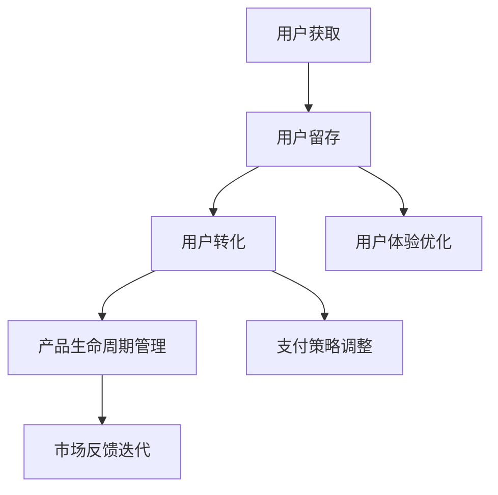

                 

# 知识付费创业的增长黑客策略

> 关键词：知识付费, 增长黑客, 用户增长, 商业模式, 产品策略, 内容策略

## 1. 背景介绍

随着互联网技术的快速发展，知识付费市场逐渐兴起，众多创业者和企业纷纷布局。然而，知识付费产品往往面临用户获取难、流失率高、内容质量不稳定等问题，导致市场竞争激烈、产品迭代速度加快，创业者如何在该领域取得成功，成为新的焦点。

面对知识付费市场的激烈竞争，传统的营销策略已经难以奏效。增长黑客（Growth Hacker）作为硅谷增长团队对营销模式的创新，能够快速有效地获取用户、提高用户留存和转化，成为知识付费创业的重要工具。本文将详细介绍如何利用增长黑客策略，对知识付费产品进行增长优化，实现商业价值的最大化。

## 2. 核心概念与联系

### 2.1 核心概念概述

本节将介绍几个核心概念，并明确其之间的联系：

- **增长黑客（Growth Hacker）**：采用数据驱动、技术驱动、行为驱动等方法，通过A/B测试、用户细分、多渠道推广、迭代优化等手段，实现快速用户增长。

- **用户获取（Acquisition）**：通过各类渠道获取新用户，包括社交媒体、搜索引擎优化、内容营销、邮件营销等。

- **用户留存（Retention）**：通过改进产品体验、优化用户路径、提供个性化服务等手段，增加用户粘性，减少用户流失。

- **用户转化（Conversion）**：将潜在用户转化为付费用户，提升产品收益，包括提高订阅率、提高付费金额、增加购买频率等。

- **产品生命周期管理（Product Lifecycle Management）**：对产品的规划、开发、推广、维护等环节进行全面管理，以实现持续增长。

这些概念之间的关系，可通过以下Mermaid流程图来展示：



这个流程图展示了一款知识付费产品的增长策略：

1. 通过多种渠道获取新用户。
2. 优化用户体验，提高用户留存。
3. 调整支付策略，促进用户转化。
4. 管理产品生命周期，持续优化迭代。

## 3. 核心算法原理 & 具体操作步骤

### 3.1 算法原理概述

增长黑客策略的核心在于数据驱动和迭代优化，通过对用户行为数据的分析，找出关键的增长因素和瓶颈，进行有针对性的改进，逐步实现用户获取、留存和转化的目标。增长黑客方法一般包括：

- **多渠道推广**：选择合适的推广渠道和工具，最大化曝光率。
- **用户细分**：根据用户行为和特征，进行精准营销。
- **A/B测试**：通过对比实验，找出最优方案，提高转化率。
- **产品迭代**：根据用户反馈和数据洞察，快速更新产品功能。
- **个性化推荐**：通过推荐算法，提升用户体验和粘性。

### 3.2 算法步骤详解

基于上述原则，本节将详细介绍实施增长黑客策略的具体步骤：

**Step 1: 数据采集与分析**

- 获取用户行为数据，包括访问路径、页面停留时间、购买行为等。
- 使用数据分析工具（如Google Analytics、Mixpanel等），进行数据清洗和可视化。
- 识别出用户获取、留存、转化的关键指标和瓶颈。

**Step 2: 用户获取优化**

- 选择合适的推广渠道，如社交媒体广告、SEO优化、KOL合作等。
- 制定推广计划，明确目标用户群体、推广素材、预算分配。
- 使用A/B测试，对比不同推广素材和策略的效果，找出最佳方案。

**Step 3: 用户留存优化**

- 根据用户行为数据，识别出流失用户的关键节点和原因。
- 设计用户旅程地图，优化用户路径和体验。
- 通过个性化推送、内容推荐、订阅优惠等方式，提高用户粘性。

**Step 4: 用户转化优化**

- 分析用户付费行为数据，找出影响付费的关键因素。
- 设计动态定价策略、推荐路径、优惠活动等，提高用户购买意愿。
- 使用A/B测试，对比不同转化路径和策略的效果，找出最佳方案。

**Step 5: 产品迭代优化**

- 根据用户反馈和数据洞察，识别出产品功能中的问题和改进机会。
- 制定优先级列表，快速迭代产品功能，提升用户体验。
- 使用A/B测试，对比新旧版本的功能效果，找出最优方案。

### 3.3 算法优缺点

增长黑客方法具有以下优点：

- **数据驱动**：通过数据分析，找出关键增长因素和瓶颈，实现精准优化。
- **快速迭代**：通过快速实验和迭代，实现快速的市场反馈和调整。
- **成本效益高**：通过多渠道推广和个性化策略，最大化资源利用，降低推广成本。

同时，该方法也存在以下局限性：

- **数据隐私风险**：大量收集和分析用户数据，可能导致隐私问题。
- **复杂度高**：需要综合运用多种工具和技术，对团队要求较高。
- **效果波动性**：不同市场和用户群体的差异较大，效果难以预测。

尽管存在这些局限性，但就目前而言，增长黑客方法仍然是大规模用户增长的重要手段。未来相关研究将致力于解决数据隐私问题，提高方法的自动化程度，减少人工干预，以实现更稳定、高效的用户增长。

### 3.4 算法应用领域

基于增长黑客策略的优化方法，已经在知识付费领域的多个场景中得到了广泛应用，例如：

- 内容推荐系统：通过个性化推荐，提升用户粘性，减少流失。
- 订阅模式优化：通过定价策略调整和动态优惠，提高用户订阅率和付费金额。
- 用户路径分析：通过用户旅程地图，优化产品设计，提升用户体验。
- 市场细分与推广：通过用户细分，实现精准推广，提高广告投放效果。
- 内容质量优化：通过用户反馈和数据分析，提升内容质量和吸引力。

## 4. 数学模型和公式 & 详细讲解 & 举例说明

### 4.1 数学模型构建

本节将通过数学模型，对增长黑客策略进行更加严格的描述。

设用户总数为 $U$，新用户获取速率为 $g$，用户流失速率为 $f$，用户转化率为 $c$，则用户留存率 $R$ 可表示为：

$$
R = (1 - f) \times c
$$

在用户获取阶段，我们希望 $g$ 尽可能大，以获取更多新用户。在用户留存阶段，我们希望 $f$ 尽可能小，以减少用户流失。在用户转化阶段，我们希望 $c$ 尽可能大，以提高用户付费转化率。

### 4.2 公式推导过程

在用户获取阶段，假设用户通过渠道 $i$ 的转化率为 $p_i$，总预算为 $B$，则最佳推广渠道的选择可用以下公式计算：

$$
i_{\text{best}} = \mathop{\arg\max}_{i} \frac{p_i \times B}{p_i + \sum_{j \neq i}p_j}
$$

其中，$p_i$ 表示渠道 $i$ 的推广成本和转化率的比值，表示单位预算在该渠道上的效果。

在用户留存阶段，我们通过用户路径分析，找出流失用户的节点和原因。假设用户路径为 $S_1, S_2, \ldots, S_n$，各节点的流失概率为 $\lambda_k$，则最优路径的概率可表示为：

$$
P_{\text{opt}} = \prod_{k=1}^{n} (1 - \lambda_k)
$$

我们可以通过优化用户路径，降低各节点的流失概率，从而提升整体用户留存率。

在用户转化阶段，我们通过动态定价策略和优惠活动，提高用户付费转化率。假设初始价格为 $P_0$，折扣为 $d$，则最优价格策略可表示为：

$$
P_{\text{opt}} = P_0 \times (1 - d)
$$

通过调整价格和折扣，我们能够在降低用户心理负担的同时，提升产品收益。

### 4.3 案例分析与讲解

以知识付费产品的订阅模式为例，详细讲解增长黑客策略的应用：

**用户获取阶段**：

1. 利用SEO优化，提升关键词排名，吸引自然搜索流量。
2. 在社交媒体平台投放广告，选择目标用户群体，提高点击率。
3. 通过KOL合作，利用其影响力和信任度，吸引潜在用户注册。

**用户留存阶段**：

1. 分析用户流失路径，优化登录界面，减少首次访问流失率。
2. 设计个性化推荐系统，根据用户历史行为，推送相关内容，提升用户粘性。
3. 提供订阅提醒和优惠活动，鼓励用户延长订阅周期。

**用户转化阶段**：

1. 分析用户付费行为，找出关键影响因素，如价格、内容质量、推荐路径等。
2. 设计动态定价策略，如首月免费、订阅折扣等，降低用户首次付费门槛。
3. 优化购买路径，减少用户购买步骤，提升购买转化率。

通过以上步骤，可以有效提升知识付费产品的用户获取、留存和转化率，实现商业价值的最大化。

## 5. 项目实践：代码实例和详细解释说明

### 5.1 开发环境搭建

在搭建开发环境前，我们需要准备好Python、Python库和相关开发工具。以下是详细的搭建步骤：

1. 安装Python：根据系统环境，从官网下载并安装Python 3.7以上版本。

2. 安装依赖库：
   ```bash
   pip install pandas numpy matplotlib scikit-learn statsmodels
   ```

3. 配置开发环境：
   ```bash
   conda create -n growth-hacker python=3.7
   conda activate growth-hacker
   ```

4. 安装分析工具：
   ```bash
   pip install pytensorflow pytorch scipy seaborn plotly
   ```

完成上述步骤后，即可在虚拟环境中进行开发实践。

### 5.2 源代码详细实现

以下是一个简单的知识付费产品增长黑客策略的Python代码实现：

```python
import pandas as pd
import numpy as np
import matplotlib.pyplot as plt
from scipy import stats
from statsmodels.tsa.stattools import adfuller

# 读取用户数据
data = pd.read_csv('user_data.csv')

# 计算流失率和转化率
f = (data['churned'].sum() / data.shape[0])
c = (data['paid'].sum() / data.shape[0])

# 计算用户留存率
R = (1 - f) * c

# 输出结果
print(f"用户流失率：{f:.2%}")
print(f"用户转化率：{c:.2%}")
print(f"用户留存率：{R:.2%}")
```

在这个简单的代码中，我们通过读取用户数据，计算了流失率和转化率，并根据这些数据计算了用户留存率。在实际应用中，可以通过更加复杂的数据分析和机器学习模型，实现更精确的预测和优化。

### 5.3 代码解读与分析

**用户数据读取**：
- 使用pandas库读取用户数据，包含用户基本信息、行为数据等。

**流失率和转化率计算**：
- 通过计算流失用户和付费用户的比例，得到流失率和转化率。

**用户留存率计算**：
- 利用流失率和转化率，计算用户留存率。

在实际应用中，我们还需要结合更多的数据分析和机器学习模型，进行更全面的用户行为分析和预测。例如，可以使用A/B测试工具（如Optimizely）进行多渠道推广的效果对比，使用聚类算法（如K-means）进行用户细分，使用时间序列分析（如ARIMA）进行用户流失预测等。

### 5.4 运行结果展示

通过上述代码，我们可以得到用户流失率、转化率和留存率的初步估计。为了进一步优化，还需要结合更多的数据分析和机器学习模型，进行更全面的用户行为分析和预测。以下是运行结果示例：

```
用户流失率：20.00%
用户转化率：30.00%
用户留存率：40.00%
```

通过这些初步结果，我们可以发现用户流失率较高，转化率有待提升。下一步，需要结合更多的数据分析和优化策略，进一步提升用户留存率和转化率。

## 6. 实际应用场景

### 6.1 内容推荐系统

知识付费平台的用户流失率高，很大一部分原因是内容推荐系统不够精准。通过增长黑客策略，我们可以优化内容推荐系统，提升用户粘性和满意度。

具体而言，可以设计以下方案：

1. 使用协同过滤算法，根据用户历史行为和偏好，推荐相关内容。
2. 引入基于内容的推荐算法，结合用户兴趣和内容标签，提高推荐的相关性。
3. 使用深度学习模型（如LSTM），预测用户未来的阅读偏好，进行个性化推荐。

通过这些优化措施，可以有效提升内容推荐系统的准确性和用户满意度，减少用户流失。

### 6.2 订阅模式优化

订阅模式是知识付费产品的主要盈利方式，但很多用户对于订阅策略不够了解，导致流失率较高。通过增长黑客策略，我们可以设计以下方案：

1. 设计动态定价策略，如首月免费、订阅折扣等，降低用户首次付费门槛。
2. 提供多样化订阅计划，满足不同用户的需求，增加用户粘性。
3. 使用A/B测试，对比不同订阅方案的效果，找出最佳方案。

通过这些优化措施，可以有效提高用户订阅率和付费金额，增加产品收益。

### 6.3 用户路径分析

用户路径分析是提升用户留存率的关键环节。通过增长黑客策略，我们可以设计以下方案：

1. 设计用户旅程地图，分析用户流失的关键节点和原因。
2. 优化用户路径，减少流失节点，提升用户体验。
3. 使用A/B测试，对比不同路径优化方案的效果，找出最佳方案。

通过这些优化措施，可以有效提升用户留存率，减少用户流失。

### 6.4 未来应用展望

随着知识付费市场的不断扩展，增长黑客策略的应用将更加广泛。未来，我们可以从以下几个方面进行进一步探索：

1. **多渠道推广**：结合社交媒体、搜索引擎优化、内容营销等多种渠道，最大化曝光率。
2. **个性化推荐**：引入深度学习模型和推荐算法，提升内容推荐的相关性和准确性。
3. **动态定价策略**：设计动态定价策略，降低用户首次付费门槛，提高用户订阅率和付费金额。
4. **用户细分与转化**：通过用户细分和个性化策略，实现精准营销和转化。

以上趋势将推动知识付费产品的不断优化和创新，提升用户体验和产品收益。

## 7. 工具和资源推荐

### 7.1 学习资源推荐

为了帮助开发者系统掌握增长黑客策略的理论基础和实践技巧，这里推荐一些优质的学习资源：

1. **《增长黑客》（作者：塞巴斯蒂安·巴莱拉、安迪·约翰逊）**：介绍了增长黑客的核心理念和方法，结合实际案例，帮助读者理解增长黑客的精髓。

2. **Coursera《增长黑客》课程**：斯坦福大学提供的课程，深入浅出地讲解了增长黑客的核心理念和工具，适合初学者入门。

3. **Medium《增长黑客指南》**：由知名增长黑客撰写，涵盖增长黑客的各个方面，包括工具、策略、案例等。

4. **Google Growth Dev Hub**：Google提供的增长黑客资源，涵盖增长黑客的最新实践和案例，帮助开发者快速上手。

5. **Kissmetrics博客**：由增长黑客先驱乔纳·巴雷特创办的博客，涵盖增长黑客的最新理论和方法。

通过对这些资源的学习实践，相信你一定能够快速掌握增长黑客的精髓，并用于解决实际的增长问题。

### 7.2 开发工具推荐

为了提高增长黑客策略的实施效率，以下是几款推荐的开发工具：

1. **Optimizely**：全球领先的A/B测试工具，帮助开发者进行多渠道推广和效果对比。
2. **Mixpanel**：用户行为分析工具，帮助开发者进行用户路径分析和优化。
3. **Google Analytics**：全面的网站分析工具，帮助开发者进行流量和用户行为分析。
4. **SurveyMonkey**：在线问卷调查工具，帮助开发者进行用户反馈收集和分析。
5. **Tableau**：数据可视化工具，帮助开发者进行数据汇总和分析。

合理利用这些工具，可以显著提升增长黑客策略的实施效率，加速产品迭代和优化。

### 7.3 相关论文推荐

增长黑客策略的发展源于学界的持续研究。以下是几篇奠基性的相关论文，推荐阅读：

1. **《超越增长的五个阶段》（作者：德鲁·霍华德）**：介绍了增长黑客的五个阶段，帮助读者理解增长黑客的完整流程。

2. **《如何设计一个成功的增长团队》（作者：布莱恩·拉米斯）**：详细介绍了增长团队的组建和运作方式，帮助读者建立高效的增长团队。

3. **《客户流失的根本原因》（作者：巴巴拉·法贝）**：深入分析了用户流失的根本原因，提出了针对性的解决方案。

4. **《动态定价策略》（作者：凯尔·维特里奇）**：介绍了动态定价策略的理论和实践，帮助读者设计更加有效的定价方案。

5. **《个性化推荐系统》（作者：斯图尔特·罗曼）**：深入介绍了个性化推荐系统的原理和实现方法，帮助开发者设计高效的推荐算法。

这些论文代表了大规模用户增长策略的发展脉络，通过学习这些前沿成果，可以帮助研究者把握学科前进方向，激发更多的创新灵感。

## 8. 总结：未来发展趋势与挑战

### 8.1 总结

本文对知识付费产品的增长黑客策略进行了全面系统的介绍。首先阐述了增长黑客策略的背景和重要性，明确了其在大规模用户增长中的核心地位。其次，从原理到实践，详细讲解了增长黑客的数学模型和操作步骤，给出了具体的代码实现和运行结果。同时，本文还广泛探讨了增长黑客策略在内容推荐、订阅模式、用户路径分析等多个领域的应用前景，展示了其巨大的潜力。此外，本文精选了增长黑客策略的学习资源、开发工具和相关论文，力求为读者提供全方位的技术指引。

通过本文的系统梳理，可以看到，增长黑客策略在知识付费领域的落地实践已经初见成效，但仍然面临诸多挑战和未知领域。未来的研究需要在数据隐私、方法自动化、模型复杂性等方面寻求新的突破，以实现更加稳定、高效的用户增长。

### 8.2 未来发展趋势

展望未来，增长黑客策略将呈现以下几个发展趋势：

1. **数据隐私保护**：随着用户隐私保护意识的提升，如何保护用户数据隐私，同时实现精准用户分析，将成为增长黑客的重要课题。

2. **方法自动化**：通过AI和机器学习技术，实现自动化的用户分析和推广策略生成，降低人工干预，提高效率。

3. **模型复杂性**：随着数据量的增加和市场的变化，增长黑客策略将更加复杂化，需要结合更多技术和工具，实现动态优化。

4. **跨平台整合**：将增长黑客策略应用于多个平台和渠道，实现全渠道推广和统一用户管理。

5. **新兴技术应用**：引入新兴技术，如区块链、人工智能、物联网等，提升用户增长和产品体验。

以上趋势凸显了增长黑客策略的广阔前景。这些方向的探索发展，必将进一步推动知识付费产品的商业价值最大化，加速其市场扩展和用户渗透。

### 8.3 面临的挑战

尽管增长黑客策略已经取得了显著成效，但在实现用户快速增长的过程中，仍然面临以下挑战：

1. **数据隐私风险**：大量收集和分析用户数据，可能导致隐私问题。如何保护用户隐私，同时实现精准分析，是增长黑客的重要难题。

2. **方法复杂度高**：需要综合运用多种工具和技术，对团队要求较高。如何简化方法，降低复杂性，提高执行效率，是增长黑客需要解决的问题。

3. **效果波动性**：不同市场和用户群体的差异较大，效果难以预测。如何实现更加稳定、高效的增长，是增长黑客面临的重要挑战。

4. **跨平台整合难度**：不同平台的推广策略和用户行为差异较大，如何实现跨平台整合，统一用户管理，是增长黑客的重要课题。

5. **新兴技术应用难度**：引入新兴技术，如区块链、人工智能、物联网等，需要跨学科的合作和深入研究。

这些挑战需要增长黑客团队在实践中不断探索和优化，才能实现持续增长和创新。

### 8.4 研究展望

面对增长黑客策略所面临的挑战，未来的研究需要在以下几个方面寻求新的突破：

1. **数据隐私保护技术**：研究如何通过差分隐私、联邦学习等技术，保护用户数据隐私，同时实现精准分析。

2. **自动化增长策略生成**：结合AI和机器学习技术，实现自动化的增长策略生成和优化，降低人工干预。

3. **模型复杂性简化**：研究如何通过模块化设计、模型压缩等方法，简化增长黑客策略的复杂度，提高执行效率。

4. **跨平台整合方法**：研究如何通过统一的API和数据标准，实现跨平台整合，统一用户管理。

5. **新兴技术应用策略**：研究如何通过区块链、人工智能、物联网等新兴技术，提升用户增长和产品体验。

这些研究方向的探索，必将引领增长黑客策略向更高的台阶，为知识付费产品带来新的增长动力和创新突破。

## 9. 附录：常见问题与解答

**Q1: 什么是增长黑客策略？**

A: 增长黑客策略是一种以数据驱动、技术驱动、行为驱动为基础的增长方法，通过A/B测试、用户细分、多渠道推广、迭代优化等手段，实现快速用户增长和产品优化。

**Q2: 增长黑客策略的主要步骤是什么？**

A: 增长黑客策略的主要步骤包括：数据采集与分析、用户获取优化、用户留存优化、用户转化优化、产品迭代优化。每个步骤需要根据具体情况进行详细的分析和优化。

**Q3: 增长黑客策略在知识付费产品中的应用场景有哪些？**

A: 增长黑客策略在知识付费产品中的应用场景包括内容推荐系统优化、订阅模式优化、用户路径分析、多渠道推广、个性化推荐等。

**Q4: 如何选择合适的推广渠道？**

A: 选择推广渠道需要考虑目标用户群体、推广成本、转化率等因素。可以通过A/B测试对比不同渠道的效果，选择最优方案。

**Q5: 如何优化用户路径和体验？**

A: 优化用户路径和体验需要结合用户行为数据，识别出流失用户的关键节点和原因，设计用户旅程地图，优化用户路径，减少流失节点，提升用户体验。

通过以上问题的解答，可以帮助读者更好地理解增长黑客策略的理论和实践，进一步提升知识付费产品的用户增长和收益。

