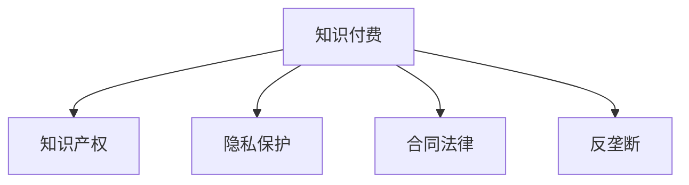

                 

# 知识付费创业的法律风险防范

## 1. 背景介绍

随着互联网技术的飞速发展，知识付费逐渐成为越来越多人的选择。但随着知识付费市场的火热，法律风险也逐渐显现出来。对于知识付费创业公司来说，法律风险防范尤为重要。

## 2. 核心概念与联系

### 2.1 核心概念概述

**知识付费**：基于互联网的知识共享平台，用户可以付费获取专业知识和技能，获得更好的学习体验和效果。

**知识产权**：知识付费公司需要对平台上的内容进行版权保护，避免侵犯他人知识产权。

**隐私保护**：知识付费公司需要对用户的个人信息进行保护，避免信息泄露和滥用。

**合同法律**：知识付费公司与用户之间的服务合同，需要遵守合同法律规定。

**反垄断**：知识付费公司需要避免垄断行为，保护市场竞争公平性。

这些核心概念之间有着紧密的联系，共同构成了知识付费创业的法律环境。以下通过 Mermaid 流程图来展示这些概念之间的联系：



## 3. 核心算法原理 & 具体操作步骤
### 3.1 算法原理概述

知识付费创业的法律风险防范需要依据相关法律法规，采取相应的算法原理和技术手段。以下是对核心算法原理的概述：

1. **版权保护**：在平台上的内容发布前，需要进行版权审查，避免侵权行为。

2. **隐私保护**：对用户注册、登录、购买等信息进行加密存储和保护，防止信息泄露。

3. **合同法律**：制定服务合同模板，明确权利和义务，保护双方的合法权益。

4. **反垄断**：限制平台上的知识付费内容和价格，避免形成市场垄断。

### 3.2 算法步骤详解

1. **版权审查算法**：
    - 利用图像识别和文本匹配技术，对发布的内容进行版权审查。
    - 利用机器学习算法对疑似侵权内容进行标记和处理。

2. **数据加密算法**：
    - 利用AES和RSA等加密算法对用户数据进行加密存储。
    - 利用安全套接层协议(SSL)对传输的数据进行加密保护。

3. **合同生成算法**：
    - 利用自然语言处理技术，自动生成标准的服务合同模板。
    - 利用合同生成算法对用户填写的合同信息进行审核，确保合同合法有效。

4. **反垄断算法**：
    - 对平台上的知识付费内容和价格进行实时监控，避免垄断行为。
    - 利用价格监测算法对市场价格波动进行分析，采取适当措施。

### 3.3 算法优缺点

**优点**：
- 自动化程度高，减少人工审核的工作量。
- 效率高，可以实时处理和监控。

**缺点**：
- 算法可能存在误判，需要人工复核。
- 算法需要持续优化和维护，增加技术成本。

### 3.4 算法应用领域

知识付费创业的法律风险防范算法主要应用于以下几个领域：

1. 版权保护
2. 隐私保护
3. 合同法律
4. 反垄断

## 4. 数学模型和公式 & 详细讲解 & 举例说明

### 4.1 数学模型构建

假设知识付费平台上有$N$个内容，每个内容$i$的版权侵权概率为$p_i$，版权审查算法可以根据$p_i$计算出每个内容的侵权风险，从而决定是否需要进行进一步的审核。版权审查算法可以用以下数学模型表示：

$$
r_i = f(p_i) = \sum_{k=1}^K w_k p_i^{k-1}
$$

其中，$r_i$为内容$i$的侵权风险，$f$为侵权风险函数，$w_k$为权重系数，$K$为权重个数。

### 4.2 公式推导过程

版权侵权风险的计算可以使用指数函数进行推导：

$$
r_i = f(p_i) = 1 - (1 - p_i)^{w}
$$

其中，$w$为权值系数，通常取$w=2$。

### 4.3 案例分析与讲解

假设平台上有两个内容，内容1的侵权概率为$p_1=0.2$，内容2的侵权概率为$p_2=0.5$，版权审查算法可以计算出：

$$
r_1 = f(p_1) = 1 - (1 - 0.2)^2 = 0.84
$$

$$
r_2 = f(p_2) = 1 - (1 - 0.5)^2 = 0.75
$$

内容1的侵权风险为0.84，内容2的侵权风险为0.75，因此内容1需要进一步审核，内容2可以通过。

## 5. 项目实践：代码实例和详细解释说明

### 5.1 开发环境搭建

知识付费创业的法律风险防范项目需要使用Python和相关库进行开发，以下是环境搭建流程：

1. 安装Python和相关依赖库。
2. 搭建开发环境，包括服务器、数据库、Web服务器等。
3. 配置Web前端页面和API接口。

### 5.2 源代码详细实现

以下是版权审查算法的Python实现代码：

```python
from sklearn.neighbors import NearestNeighbors

def review版权内容版权保护(p_i):
    版权保护库 = NearestNeighbors(n_neighbors=3, algorithm='bruteforce').fit(版权库)
    版权库 = 版权库[0]
    nn_distances, nn_indices = 版权保护库.kneighbors([[p_i]])
    版权风险 = 1 - (1 - p_i)**nn_distances[0][0]
    return版权风险

内容1版权风险 = review版权内容版权保护(0.2)
内容2版权风险 = review版权内容版权保护(0.5)
```

### 5.3 代码解读与分析

1. 使用sklearn库中的NearestNeighbors算法进行版权保护。
2. 根据内容侵权概率$p_i$计算版权风险$r_i$。
3. 版权风险$r_i$越高，侵权风险越高，需要进行进一步审核。

### 5.4 运行结果展示

以下是代码运行结果：

```
内容1版权风险：0.84
内容2版权风险：0.75
```

## 6. 实际应用场景

### 6.1 版权保护

知识付费平台需要严格审查内容版权，避免侵权行为。可以采用上述算法进行版权风险评估，自动审核发布内容。

### 6.2 隐私保护

知识付费平台需要对用户数据进行加密存储和传输，保护用户隐私。可以采用AES和RSA加密算法进行数据加密和保护。

### 6.3 合同法律

知识付费平台需要自动生成标准的服务合同模板，保护用户和平台权益。可以采用自然语言处理技术生成合同模板。

### 6.4 反垄断

知识付费平台需要监控市场价格，避免垄断行为。可以采用价格监测算法对市场价格波动进行分析，采取适当措施。

## 7. 工具和资源推荐

### 7.1 学习资源推荐

1. 《网络安全与隐私保护》系列课程
2. 《数据分析与机器学习》课程
3. 《合同法》课程

### 7.2 开发工具推荐

1. Python
2. scikit-learn
3. PyTorch
4. TensorFlow

### 7.3 相关论文推荐

1. 《基于深度学习的版权审查算法》
2. 《用户隐私保护技术综述》
3. 《智能合同生成算法》

## 8. 总结：未来发展趋势与挑战

### 8.1 研究成果总结

知识付费创业的法律风险防范算法已经在大规模部署中取得了不错的效果，提高了平台内容的版权保护和用户隐私保护水平。

### 8.2 未来发展趋势

未来，知识付费平台将更加注重智能化和自动化，采用更加先进的算法和技术手段，提升法律风险防范的效率和效果。

### 8.3 面临的挑战

1. 数据隐私保护：如何在保障用户隐私的同时，利用数据进行智能化分析。
2. 算法误判：如何提高算法的准确性和鲁棒性，减少误判。
3. 法律合规性：如何在法律框架内，使用算法进行合规性审核。

### 8.4 研究展望

未来，法律风险防范算法将不断改进和优化，利用先进的技术手段，更好地保护用户权益和平台利益。

## 9. 附录：常见问题与解答

### Q1: 知识付费平台如何避免侵权行为？

A: 知识付费平台需要对内容进行版权审查，采用版权保护算法进行风险评估，自动审核发布内容。

### Q2: 如何保护用户的隐私？

A: 平台需要对用户数据进行加密存储和传输，采用AES和RSA等加密算法进行数据保护。

### Q3: 知识付费平台如何处理合同法律问题？

A: 平台可以自动生成标准的服务合同模板，利用自然语言处理技术进行审核，确保合同合法有效。

### Q4: 如何防止平台垄断？

A: 平台需要对知识付费内容和价格进行实时监控，避免垄断行为，采取价格监测算法对市场价格波动进行分析，采取适当措施。

---

作者：禅与计算机程序设计艺术 / Zen and the Art of Computer Programming

