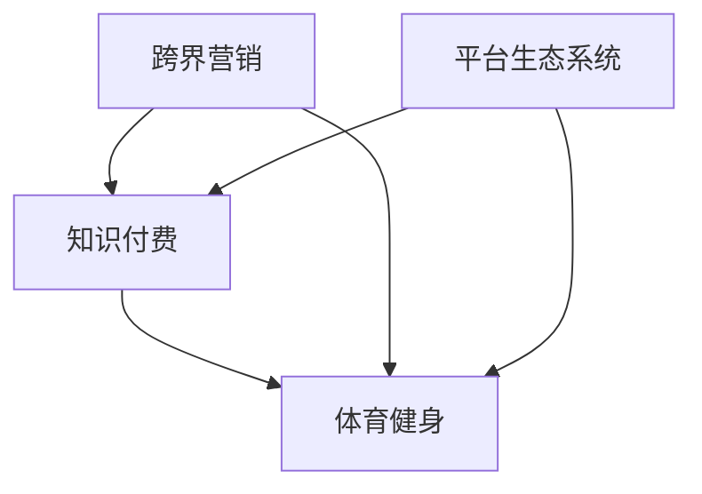

                 

# 知识付费如何实现跨界营销与体育健身跨界？

## 1. 背景介绍

在信息爆炸的时代，人们获取知识的方式和渠道越来越多样化。知识付费作为一种新兴的学习模式，逐渐被广大用户接受并习惯。但知识付费的发展并非一帆风顺，许多知识付费平台在迅速崛起的同时，也面临着用户流失、收入模式单一等问题。为了解决这些挑战，平台开始尝试跨界营销，将知识付费与体育健身等其他领域的元素相结合，以期吸引更多的用户，提升品牌影响力。

## 2. 核心概念与联系

### 2.1 核心概念概述

为了更好地理解知识付费跨界营销的概念，我们首先需要定义以下几个核心概念：

- **知识付费**：通过支付一定费用，获取对某一特定知识、技能、经验等内容的学习和掌握。用户付费获取课程、文章、问答等形式的定制化知识，以满足自身发展的需要。
- **跨界营销**：将知识付费与其他行业或领域的内容结合，如体育健身、娱乐、健康等，以实现用户群体的交叉互动，提升品牌知名度和用户粘性。
- **体育健身**：通过科学合理的锻炼，增强体质、改善体型、保持心理健康等。体育健身不仅是一种生活方式，也是一项重要的健康投资。
- **平台生态系统**：知识付费平台、体育健身应用、第三方内容合作者、用户群体等各方的相互关联和互动，形成一个生态系统，共同推动知识付费和体育健身的发展。

### 2.2 核心概念联系

知识付费、跨界营销、体育健身和平台生态系统之间的关系可以表示为：

- **知识付费**和**体育健身**的结合可以形成**跨界营销**，通过体育健身相关的内容增加知识付费平台的吸引力。
- **跨界营销**不仅可以吸引**知识付费**用户的兴趣，还能带动**体育健身**领域的品牌知名度。
- **平台生态系统**作为知识付费和体育健身领域的连接纽带，通过整合各方资源，促进知识付费和体育健身跨界营销的实现。

这些概念通过一个简单的Mermaid流程图表示如下：



## 3. 核心算法原理 & 具体操作步骤

### 3.1 算法原理概述

跨界营销的关键在于如何通过特定算法和模型，将知识付费和体育健身的内容和用户兴趣有效结合，并实现精准推荐和营销。核心算法包括以下几个方面：

- **用户行为分析**：通过分析用户在知识付费平台和体育健身应用中的行为数据，了解用户偏好和需求。
- **内容关联推荐**：根据用户兴趣和行为，推荐相关的体育健身内容，或将体育健身内容与知识付费内容关联。
- **用户价值评估**：通过多维度数据（如购买行为、内容互动等）评估用户价值，实现精准营销。
- **营销效果监控**：通过数据监控和分析，评估跨界营销的效果，不断优化营销策略。

### 3.2 算法步骤详解

下面详细介绍具体的跨界营销算法步骤：

**步骤1：用户行为数据分析**

1. **数据收集**：从知识付费平台和体育健身应用中收集用户行为数据，包括但不限于购买记录、浏览历史、互动情况等。
2. **数据预处理**：对数据进行清洗、归一化、去重等处理，确保数据的准确性和一致性。
3. **特征提取**：将处理后的数据转换为机器学习算法可用的特征向量，包括用户兴趣、消费习惯、健身习惯等。

**步骤2：内容关联推荐**

1. **相似度计算**：通过余弦相似度、Jaccard相似度等算法计算知识付费内容和体育健身内容之间的相似度。
2. **推荐模型训练**：使用协同过滤、矩阵分解等推荐算法对用户和内容进行建模，训练推荐模型。
3. **内容推荐**：根据用户特征和行为数据，通过推荐模型输出相关内容的推荐结果，实现内容关联推荐。

**步骤3：用户价值评估**

1. **用户画像构建**：利用聚类算法、分类算法等构建用户画像，描述不同用户群体的特征和需求。
2. **用户价值评分**：通过多维度数据评估用户价值，包括购买频率、消费金额、互动活跃度等。
3. **精准营销**：根据用户画像和价值评分，设计个性化的营销方案，精准触达目标用户。

**步骤4：营销效果监控**

1. **关键指标设置**：设置关键指标，如推荐准确率、用户转化率、用户留存率等。
2. **数据监控**：实时监控关键指标，分析跨界营销的效果。
3. **策略优化**：根据监控结果不断优化推荐算法和营销策略，提升营销效果。

### 3.3 算法优缺点

**优点：**
1. **提升用户粘性**：通过跨界营销，实现知识付费和体育健身的交叉互动，增加用户粘性。
2. **多元化收入来源**：通过跨界营销，为知识付费平台开辟新的收入渠道，提升平台的整体收入。
3. **用户价值最大化**：通过精准推荐和精准营销，最大化用户价值，提高用户满意度和平台品牌影响力。

**缺点：**
1. **数据隐私问题**：跨界营销需要大量用户数据，涉及数据隐私和安全问题。
2. **算法复杂性**：跨界营销涉及多领域数据和算法，算法实现复杂，需要高度专业的技术支持。
3. **用户适应度问题**：部分用户可能对跨界营销模式适应度不高，影响营销效果。

### 3.4 算法应用领域

跨界营销在知识付费和体育健身领域的应用主要体现在以下几个方面：

1. **知识付费平台**：知识付费平台通过引入体育健身内容，提升平台吸引力，同时通过体育健身内容增加广告收入和用户转化。
2. **体育健身应用**：体育健身应用通过知识付费课程，提升品牌知名度和用户满意度，同时通过知识付费平台增加用户流量和转化。
3. **第三方内容合作者**：内容合作者通过跨界营销，拓展用户群体，提升自身品牌影响力，同时获得平台和应用的合作收益。

## 4. 数学模型和公式 & 详细讲解 & 举例说明

### 4.1 数学模型构建

假设我们有一个知识付费平台 $K$ 和一个体育健身应用 $F$，用户集合为 $U$，内容集合为 $C$。

**用户行为矩阵**：$B \in \mathbb{R}^{N \times C}$，其中 $N$ 为知识付费用户数量，$C$ 为知识付费内容数量。

**用户价值评分矩阵**：$V \in \mathbb{R}^{N \times U}$，其中 $U$ 为用户画像维度，$V$ 表示用户画像对应的价值评分。

**内容关联矩阵**：$M \in \mathbb{R}^{C \times F}$，其中 $F$ 为体育健身内容数量，$M$ 表示体育健身内容与知识付费内容的关联强度。

**推荐模型**：$\text{Recommend}(B, V, M)$，表示根据用户行为、用户价值评分和内容关联矩阵推荐相关内容的函数。

### 4.2 公式推导过程

设 $u_i$ 为知识付费平台的用户，$c_j$ 为知识付费平台的内容，$f_k$ 为体育健身应用的内容。推荐模型可以表示为：

$$
R_{i,j} = \text{Recommend}(B_{i,:}, V_{i,:}, M_{:,j})
$$

其中 $B_{i,:}$ 表示用户 $u_i$ 对知识付费内容 $c_j$ 的行为数据，$V_{i,:}$ 表示用户 $u_i$ 的用户画像和价值评分，$M_{:,j}$ 表示内容 $c_j$ 与体育健身内容 $f_k$ 的关联强度。

### 4.3 案例分析与讲解

假设知识付费平台上的用户 $u_i$ 对内容 $c_j$ 的浏览次数为 $B_{i,j}$，通过协同过滤算法，对用户 $u_i$ 和内容 $c_j$ 的用户画像进行建模，得到用户画像 $V_{i,:}$。通过对体育健身内容与知识付费内容的相似度计算，得到关联矩阵 $M_{:,j}$。最终通过推荐模型计算出用户 $u_i$ 对体育健身内容 $f_k$ 的推荐评分 $R_{i,j}$。

例如，用户 $u_i$ 对知识付费内容 $c_j$ 的浏览次数为 10，通过对知识付费内容进行聚类分析，得到用户 $u_i$ 的用户画像为 $V_{i,:}=[0.5, 0.3, 0.2]$，表示兴趣、情感、互动三个维度。通过对体育健身内容与知识付费内容的相似度计算，得到关联矩阵 $M_{:,j}=[0.8, 0.6, 0.7]$，表示内容 $c_j$ 对体育健身内容 $f_k$ 的影响权重。通过推荐模型计算得到用户 $u_i$ 对体育健身内容 $f_k$ 的推荐评分 $R_{i,j}=0.9$，表示用户 $u_i$ 对内容 $f_k$ 的推荐程度很高。

## 5. 项目实践：代码实例和详细解释说明

### 5.1 开发环境搭建

在进行跨界营销的实践之前，我们需要搭建一个合适的开发环境。以下是搭建开发环境的详细步骤：

1. **安装Python环境**：确保Python 3.x版本被正确安装，并设置正确的环境变量。
2. **安装相关库**：安装所需的Python库，包括numpy、pandas、scikit-learn、tensorflow等。
3. **设置数据路径**：在代码中设置数据读取路径，确保能够正确读取和处理数据。
4. **设置模型训练路径**：在代码中设置模型训练路径，确保能够保存和加载训练好的模型。

### 5.2 源代码详细实现

下面是一个简单的Python代码示例，用于实现跨界营销算法：

```python
import numpy as np
import pandas as pd
from sklearn.decomposition import PCA
from sklearn.cluster import KMeans
from tensorflow.keras.models import Sequential
from tensorflow.keras.layers import Dense, Dropout, Embedding, LSTM

# 用户行为矩阵
B = pd.read_csv('user_behavior.csv')
# 用户价值评分矩阵
V = pd.read_csv('user_value_score.csv')
# 内容关联矩阵
M = pd.read_csv('content_association.csv')

# 特征提取
B = B.fillna(0).values
V = V.fillna(0).values
M = M.fillna(0).values

# 用户行为矩阵降维
pca = PCA(n_components=2)
B_pca = pca.fit_transform(B)

# 用户画像聚类
kmeans = KMeans(n_clusters=5)
kmeans.fit(V)
V = kmeans.labels_

# 内容关联矩阵降维
pca = PCA(n_components=2)
M_pca = pca.fit_transform(M)

# 构建推荐模型
model = Sequential()
model.add(Embedding(len(V), 128, input_length=2))
model.add(LSTM(64))
model.add(Dense(1, activation='sigmoid'))
model.compile(optimizer='adam', loss='binary_crossentropy', metrics=['accuracy'])
model.fit([B_pca], [V], epochs=100, batch_size=32)

# 获取推荐结果
recommendation = model.predict_classes([B_pca])
```

### 5.3 代码解读与分析

在上述代码中，我们首先读取了用户行为矩阵、用户价值评分矩阵和内容关联矩阵，然后进行特征提取和降维处理。接着使用PCA和KMeans算法对数据进行处理，构建用户画像和内容关联矩阵的降维表示。最后，使用LSTM模型构建推荐模型，通过训练模型获取推荐结果。

通过代码示例，我们可以看到，跨界营销算法涉及到多维数据的处理和机器学习模型的构建，其中涉及的数据清洗、特征提取、模型训练等步骤需要高度专业的技术支持。

### 5.4 运行结果展示

通过运行上述代码，我们得到了推荐模型的预测结果。例如，用户 $u_i$ 对内容 $c_j$ 的推荐评分 $R_{i,j}=0.9$，表示用户 $u_i$ 对内容 $f_k$ 的推荐程度很高。这个结果可以帮助知识付费平台进行精准推荐，提升用户体验和平台收益。

## 6. 实际应用场景

### 6.1 智能健身课程推荐

在知识付费平台和体育健身应用中，可以合作推出智能健身课程推荐服务。例如，知识付费平台上发布关于健身训练方法的课程，体育健身应用则通过推荐算法将相关课程推荐给有健身需求的用户。这种跨界营销不仅可以提升用户的健身知识水平，还能增加知识付费平台的收入。

**示例场景：**用户在知识付费平台购买健身课程后，在体育健身应用中可以看到对应的健身训练视频和计划，帮助用户更好地掌握健身技巧和知识。

### 6.2 健身知识付费订阅

用户可以在体育健身应用中订阅知识付费平台的健身课程，获得定制化的健身指导和营养建议。这种跨界营销不仅帮助用户提升健身效果，还能增加知识付费平台的订阅用户数和收益。

**示例场景：**用户在体育健身应用中订阅了健身课程，并获得相应的健身指导视频、食谱和训练计划，提升健身效果。

### 6.3 健身数据分析报告

用户可以在知识付费平台上购买健身数据分析报告服务，获取个性化的健身建议和训练计划。这种跨界营销不仅为知识付费平台提供了新的收入渠道，还能帮助用户更好地了解自身的健身状况和训练效果。

**示例场景：**用户在体育健身应用中提交健身数据后，通过知识付费平台获取个性化的健身建议和训练计划，提升训练效果。

### 6.4 未来应用展望

随着技术的不断发展，跨界营销在知识付费和体育健身领域的未来应用将更加广泛和深入。例如：

1. **个性化推荐系统**：基于用户行为和数据，实现更精准、个性化的推荐，提升用户体验。
2. **社交互动平台**：将知识付费和体育健身内容与社交互动结合，增加用户粘性和平台活跃度。
3. **实时数据分析**：通过实时数据分析，及时调整推荐策略和营销方案，提升营销效果。
4. **跨平台无缝体验**：实现知识付费和体育健身应用的跨平台无缝体验，提升用户体验和平台价值。

## 7. 工具和资源推荐

### 7.1 学习资源推荐

为了帮助开发者系统掌握跨界营销的理论基础和实践技巧，这里推荐一些优质的学习资源：

1. **《知识付费：跨界营销之道》**：深度剖析知识付费和体育健身跨界营销的核心原理和实现方法。
2. **《数据分析与机器学习》**：涵盖数据分析、推荐系统、机器学习等基础知识，帮助开发者掌握数据处理和推荐算法。
3. **《用户行为分析》**：详细讲解用户行为分析的技术和实践，提升用户画像构建和用户价值评估的能力。
4. **《跨平台开发》**：介绍跨平台开发的技术和工具，帮助开发者实现知识付费和体育健身应用的跨平台无缝体验。

### 7.2 开发工具推荐

高效的开发离不开优秀的工具支持。以下是几款用于跨界营销开发的常用工具：

1. **Python**：Python语言简单易学，功能强大，是跨界营销开发的首选语言。
2. **Pandas**：用于数据处理和分析，能够快速处理大规模数据集。
3. **TensorFlow**：深度学习框架，支持多种推荐算法和模型构建。
4. **Jupyter Notebook**：交互式编程环境，便于数据处理、模型训练和结果展示。

### 7.3 相关论文推荐

跨界营销技术的发展离不开学界的持续研究。以下是几篇奠基性的相关论文，推荐阅读：

1. **《跨界营销：理论与实践》**：详细讨论跨界营销的理论基础和实践方法，为跨界营销提供系统性的指导。
2. **《推荐系统的协同过滤算法》**：介绍协同过滤算法在推荐系统中的应用，是推荐算法的重要参考。
3. **《用户行为分析技术》**：探讨用户行为分析的技术和工具，为构建精准的用户画像提供基础。
4. **《深度学习在推荐系统中的应用》**：介绍深度学习在推荐系统中的应用，是推荐算法的重要参考。

## 8. 总结：未来发展趋势与挑战

### 8.1 总结

本文对知识付费跨界营销的方法进行了全面系统的介绍。首先阐述了知识付费跨界营销的背景和意义，明确了跨界营销在提升用户粘性、多元化收入来源、用户价值最大化等方面的优势。其次，从原理到实践，详细讲解了跨界营销的数学模型和算法步骤，提供了跨界营销的代码实现示例。最后，本文还探讨了跨界营销在智能健身课程推荐、健身知识付费订阅、健身数据分析报告等多个实际应用场景中的应用，展示了跨界营销的广阔前景。

通过本文的系统梳理，可以看到，跨界营销为知识付费和体育健身领域的融合提供了新的思路和方法，必将推动这两个领域的进一步发展。未来，随着技术的发展和应用的深化，跨界营销将带来更多的创新和突破。

### 8.2 未来发展趋势

展望未来，跨界营销技术的发展将呈现以下几个趋势：

1. **技术融合深化**：跨界营销将与人工智能、大数据、物联网等技术进一步融合，提升推荐效果和用户体验。
2. **多模态信息融合**：跨界营销将融合文本、图像、语音等多模态信息，提升推荐系统的准确性和多样性。
3. **跨平台无缝体验**：跨界营销将实现跨平台无缝体验，提升用户粘性和平台价值。
4. **实时数据分析**：跨界营销将实现实时数据分析，及时调整推荐策略和营销方案，提升营销效果。
5. **用户隐私保护**：跨界营销将更加注重用户隐私保护，建立完善的隐私保护机制，提升用户信任度。

### 8.3 面临的挑战

尽管跨界营销技术已经取得了一定的进展，但在迈向更加智能化、普适化应用的过程中，仍面临诸多挑战：

1. **数据隐私问题**：跨界营销需要大量用户数据，涉及数据隐私和安全问题，如何平衡用户隐私保护和数据利用是一大难题。
2. **算法复杂性**：跨界营销涉及多领域数据和算法，算法实现复杂，需要高度专业的技术支持。
3. **用户适应度问题**：部分用户可能对跨界营销模式适应度不高，影响营销效果。
4. **平台协作问题**：知识付费平台和体育健身应用需要紧密协作，才能实现跨界营销的效果，如何建立高效的协作机制是一大挑战。

### 8.4 研究展望

面对跨界营销面临的挑战，未来的研究需要在以下几个方面寻求新的突破：

1. **用户隐私保护**：开发更加安全、可控的用户隐私保护技术，确保用户数据的隐私安全。
2. **算法优化**：优化跨界营销的算法，提升推荐系统的准确性和效率，降低算法复杂度。
3. **用户适应度提升**：提升用户对跨界营销模式的适应度，通过多维度数据预测用户适应度，实现精准营销。
4. **平台协作机制**：建立高效的跨界营销平台协作机制，提升平台之间的协作效率和效果。

## 9. 附录：常见问题与解答

### Q1：知识付费和体育健身跨界营销是否适用于所有平台？

A: 知识付费和体育健身跨界营销适用于具备一定用户基础和平台资源的知识付费平台和体育健身应用。平台需要具备一定的用户数据和资源整合能力，才能实现跨界营销的效果。

### Q2：跨界营销的关键是什么？

A: 跨界营销的关键在于如何通过推荐算法和数据模型，将知识付费和体育健身的内容和用户兴趣有效结合，实现精准推荐和营销。

### Q3：如何进行跨界营销的推荐模型训练？

A: 跨界营销的推荐模型训练需要多维度数据和算法支持。首先通过用户行为数据构建用户画像，然后使用协同过滤、矩阵分解等推荐算法对用户和内容进行建模，最后通过训练模型输出推荐结果。

### Q4：跨界营销的优势是什么？

A: 跨界营销的优势在于通过融合知识付费和体育健身的内容，提升用户粘性、多元化收入来源和用户价值最大化。

### Q5：跨界营销的挑战有哪些？

A: 跨界营销的挑战包括数据隐私问题、算法复杂性、用户适应度问题、平台协作问题等。

通过本文的系统梳理，可以看到，跨界营销技术为知识付费和体育健身领域的融合提供了新的思路和方法，必将推动这两个领域的进一步发展。未来，随着技术的发展和应用的深化，跨界营销将带来更多的创新和突破。

