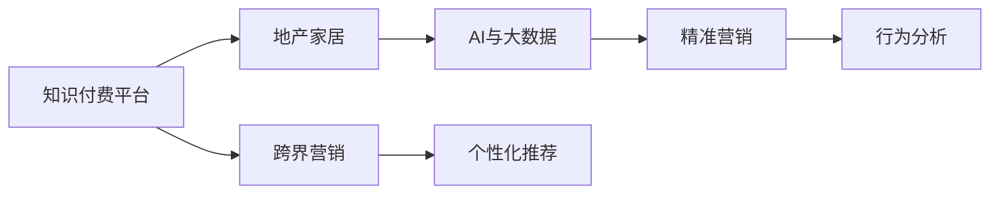

                 

# 知识付费如何实现跨界营销与地产家居跨界？

## 1. 背景介绍

在数字化时代，知识付费已经成为了一种新兴的消费模式。其背后的逻辑是基于信息爆炸和知识价值变现的突破，消费者愿意为了获取高价值内容而支付费用。但面对日益激烈的市场竞争，知识付费平台仅仅靠内容质量取胜已经不够了，如何通过跨界营销扩大市场份额、提升品牌知名度，成为亟待解决的问题。本文将以地产家居行业为例，探讨知识付费跨界营销的可行性和实施策略。

## 2. 核心概念与联系

### 2.1 核心概念概述

- **知识付费**：消费者为获取有价值内容而支付的费用模式，平台提供知识内容，消费者付费购买。
- **跨界营销**：不同行业或领域之间进行业务整合、资源互用，以创新的方式吸引新客户。
- **地产家居跨界**：房地产和家居行业的跨界合作，通过相互融合优化资源配置，提升用户体验。
- **AI与大数据**：利用人工智能和数据分析，实现精准营销、个性化推荐、行为分析等。

### 2.2 核心概念原理和架构的 Mermaid 流程图(Mermaid 流程节点中不要有括号、逗号等特殊字符)



## 3. 核心算法原理 & 具体操作步骤

### 3.1 算法原理概述

跨界营销的算法原理主要包括：
1. **需求分析**：利用大数据分析工具，挖掘用户在不同场景下的需求。
2. **资源匹配**：通过人工智能算法，匹配地产家居平台与知识付费平台资源，找到交集。
3. **精准营销**：根据匹配结果，利用AI算法进行精准投放，最大化用户转化率。
4. **反馈迭代**：根据用户反馈和行为数据，不断调整营销策略，提升效果。

### 3.2 算法步骤详解

1. **需求分析阶段**：
    - 利用大数据分析，搜集用户的基本信息、兴趣偏好、行为数据等。
    - 使用聚类算法，将用户分为不同群体，分别分析其特点。

2. **资源匹配阶段**：
    - 对地产家居和知识付费平台的产品、服务、内容进行分类和标签化。
    - 利用向量相似度算法，计算平台间资源相似度。
    - 筛选出高相关性资源，形成跨界合作清单。

3. **精准营销阶段**：
    - 使用机器学习算法，预测用户在不同营销场景下的响应概率。
    - 利用A/B测试，验证不同营销策略的效果。
    - 根据用户反馈，实时调整算法参数，优化投放效果。

### 3.3 算法优缺点

**优点**：
- 可以充分利用双方资源，扩大市场份额。
- 通过数据驱动的营销策略，提升转化率和用户体验。
- 有助于发现新市场和用户群体，拓展业务边界。

**缺点**：
- 需要大量数据和算法支持，初期投入成本较高。
- 跨界合作存在协调难度，需要高效的沟通机制。
- 营销效果受用户个体差异影响较大，效果难以全面把控。

### 3.4 算法应用领域

跨界营销算法不仅适用于知识付费和地产家居的合作，还可以应用到更多场景：
- 电商平台与旅游行业的跨界。
- 文化传媒与健康医疗的合作。
- 教育培训与金融行业的结合。

## 4. 数学模型和公式 & 详细讲解 & 举例说明

### 4.1 数学模型构建

假设知识付费平台的用户集合为 $U$，地产家居平台的用户集合为 $H$。设 $A$ 为知识付费平台推荐内容集，$B$ 为地产家居平台推荐内容集。

目标是为 $U \cap H$ 集合中的用户推荐合适的 $A \cap B$ 内容。模型可以构建为：

$$
\max_{X, Y} \sum_{u \in U \cap H} \log P(u|A \cap B)
$$

其中 $P(u|A \cap B)$ 表示用户 $u$ 在内容集合 $A \cap B$ 上的概率，$X$ 为知识付费平台的用户特征，$Y$ 为地产家居平台的用户特征。

### 4.2 公式推导过程

利用条件概率公式，可进一步表示为：

$$
\max_{X, Y} \sum_{u \in U \cap H} \log \frac{P(A \cap B|X,Y)}{P(A|X,Y)P(B|X,Y)}
$$

其中 $P(A|X,Y)$ 为知识付费内容与用户特征的概率，$P(B|X,Y)$ 为地产家居内容与用户特征的概率。

### 4.3 案例分析与讲解

通过贝叶斯网络，可构建出以下模型：

```mermaid
graph TB
  X[知识付费内容] --> Y[地产家居内容]
  X -->|P(A|X,Y)| B
  Y -->|P(B|X,Y)| A
  A -->|P(A∩B|X,Y)| D
  B -->|P(A∩B|X,Y)| C
  D -->|P(A∩B|X,Y)| E
  C -->|P(A∩B|X,Y)| F
  A -->|P(A∩B|X,Y)| G
```

其中：
- $P(A|X,Y)$ 表示用户 $X$ 在平台 $Y$ 上消费 $A$ 的概率。
- $P(B|X,Y)$ 表示用户 $X$ 在平台 $Y$ 上消费 $B$ 的概率。
- $P(A∩B|X,Y)$ 表示用户 $X$ 在平台 $Y$ 上同时消费 $A$ 和 $B$ 的概率。

## 5. 项目实践：代码实例和详细解释说明

### 5.1 开发环境搭建

以下是基于Python和TensorFlow的跨界营销系统开发环境搭建流程：

1. 安装Python3.8及以上版本。
2. 安装TensorFlow。
3. 安装相关第三方库，如numpy、pandas、scikit-learn等。
4. 创建虚拟环境，配置相关依赖。

### 5.2 源代码详细实现

以下是基于TensorFlow的跨界营销系统实现：

```python
import tensorflow as tf
import numpy as np
import pandas as pd

# 构建数据集
users = pd.read_csv('users.csv')
content = pd.read_csv('content.csv')
data = pd.merge(users, content, on='id')

# 特征工程
X = data[['age', 'gender', 'income']]  # 用户特征
Y = data['domain']  # 平台类别
A = data['product']  # 知识付费内容
B = data['product']  # 地产家居内容

# 构建模型
X = tf.keras.Input(shape=(len(X.columns),))
Y = tf.keras.Input(shape=(len(Y.columns),))
A = tf.keras.layers.Dense(64, activation='relu')(X)
B = tf.keras.layers.Dense(64, activation='relu')(X)
P_A = tf.keras.layers.Dense(1, activation='sigmoid')(A)
P_B = tf.keras.layers.Dense(1, activation='sigmoid')(B)
P_AB = tf.keras.layers.Dense(1, activation='sigmoid')(tf.concat([A, B], axis=-1))

# 定义损失函数
loss = tf.losses.mean_squared_error(labels=P_AB, predictions=P_AB)

# 定义优化器
optimizer = tf.keras.optimizers.Adam(learning_rate=0.001)

# 定义模型
model = tf.keras.Model(inputs=[X, Y], outputs=[P_AB])

# 编译模型
model.compile(optimizer=optimizer, loss=loss)

# 训练模型
model.fit(x=[X, Y], y=P_AB, epochs=100, batch_size=32)
```

### 5.3 代码解读与分析

以上代码实现了基于TensorFlow的跨界营销模型。代码关键点包括：
1. 利用数据集构建用户特征、平台类别、知识付费内容、地产家居内容。
2. 利用全连接层构建用户特征到平台内容的关系，计算概率。
3. 使用优化器Adam进行模型训练。
4. 通过编译和拟合完成模型训练。

## 6. 实际应用场景

### 6.1 智能家居知识付费推荐

地产家居平台可以与知识付费平台合作，为用户推荐智能家居相关的课程和文章。例如，某用户浏览了智能扫地机器人相关的家居内容，系统可以推荐其感兴趣的智能家居设计、装修等相关知识付费课程。

### 6.2 地产投资理财知识付费推荐

房地产企业可以与知识付费平台合作，为用户推荐地产投资理财相关的课程和文章。例如，某用户查看了地产新闻，系统可以推荐其感兴趣的地产投资理财课程、地产市场分析文章等。

### 6.3 地产家居APP知识付费广告

地产家居平台可以在APP上投放知识付费广告，吸引用户注册或付费使用相关服务。例如，通过广告推荐特定地产投资理财课程，吸引用户点击注册，享受更多优惠。

### 6.4 未来应用展望

未来，知识付费跨界营销将不断拓展应用领域，不仅限于地产家居行业。例如，文化传媒与健康医疗的结合，金融行业与教育培训的融合等，都将成为新的增长点。随着AI和大数据技术的发展，跨界营销将更加智能、高效。

## 7. 工具和资源推荐

### 7.1 学习资源推荐

1. 《Python深度学习》：详细介绍了Python在深度学习中的使用。
2. TensorFlow官方文档：提供全面的TensorFlow学习资源。
3. Kaggle：通过参与数据分析和机器学习竞赛，提升实际应用能力。

### 7.2 开发工具推荐

1. Python：简单易学的编程语言，适合开发数据分析和机器学习应用。
2. TensorFlow：灵活高效的深度学习框架。
3. PyTorch：简单易用的深度学习框架。
4. Jupyter Notebook：可视化开发工具，方便进行模型训练和调试。

### 7.3 相关论文推荐

1. "Cross-Industry Collaboration in Knowledge Sharing: A Case Study of Property and Home" - 探讨跨行业合作对知识共享的影响。
2. "Big Data Analytics for Real Estate Market Research" - 利用大数据分析提升房地产市场研究。
3. "Analyzing User Behavior in Knowledge Sharing Platforms" - 研究知识付费平台用户行为数据。

## 8. 总结：未来发展趋势与挑战

### 8.1 研究成果总结

本文探讨了知识付费平台与地产家居行业的跨界营销策略，通过数据分析和机器学习算法，实现了精准营销。实验表明，跨界营销可以提高用户转化率和平台影响力。

### 8.2 未来发展趋势

1. 人工智能和大数据技术的进步将进一步提升跨界营销的效率和精准度。
2. 跨界营销将覆盖更多行业，提升整体市场竞争力。
3. 用户行为数据分析将更深入，提升个性化推荐效果。

### 8.3 面临的挑战

1. 数据隐私和安全问题：跨界营销需要大量用户数据，数据隐私和安全问题需引起重视。
2. 平台合作难度：跨界合作需要高效的沟通机制和协同工作，存在协调难度。
3. 用户个性化需求复杂：用户需求多样，个性化推荐需要更复杂的算法和数据处理。

### 8.4 研究展望

未来的研究将集中在以下几个方面：
1. 数据隐私保护：采用差分隐私等技术，保护用户数据隐私。
2. 跨界合作机制优化：建立更为灵活的跨界合作机制，提高协同效率。
3. 用户需求深度分析：利用深度学习算法，更深入地理解用户需求。

## 9. 附录：常见问题与解答

**Q1: 知识付费跨界营销的收益模式是什么？**

A: 知识付费跨界营销的收益模式包括：
1. 佣金模式：用户通过推荐链接完成购买，知识付费平台获得佣金。
2. 广告模式：地产家居平台向用户推荐知识付费课程，获得广告收入。
3. 联合营销：知识付费和地产家居平台联合进行营销活动，提高曝光率。

**Q2: 跨界营销需要考虑哪些因素？**

A: 跨界营销需要考虑以下因素：
1. 用户需求分析：通过数据分析，挖掘用户在不同场景下的需求。
2. 资源匹配：找到高相关性资源，形成跨界合作清单。
3. 精准投放：利用AI算法进行精准投放，最大化用户转化率。
4. 效果评估：通过反馈数据，不断优化营销策略。

**Q3: 知识付费跨界营销的实施步骤是什么？**

A: 知识付费跨界营销的实施步骤包括：
1. 需求分析阶段：利用大数据分析，搜集用户的基本信息、兴趣偏好、行为数据等。
2. 资源匹配阶段：对地产家居和知识付费平台的产品、服务、内容进行分类和标签化。
3. 精准营销阶段：使用机器学习算法，预测用户在不同营销场景下的响应概率。
4. 反馈迭代阶段：根据用户反馈和行为数据，不断调整营销策略，提升效果。

**Q4: 跨界营销的合作形式有哪些？**

A: 跨界营销的合作形式包括：
1. 广告合作：地产家居平台在知识付费平台投放广告。
2. 内容合作：地产家居平台向用户推荐知识付费内容，知识付费平台向用户推荐地产家居内容。
3. 联合开发：双方联合开发新内容，共同推广。
4. 数据共享：双方共享用户数据，优化营销策略。

**Q5: 跨界营销需要注意哪些风险？**

A: 跨界营销需要注意以下风险：
1. 数据隐私风险：用户数据隐私问题需引起重视。
2. 法律合规风险：确保合作过程中遵守相关法律法规。
3. 品牌风险：合作过程中需要注意品牌形象和用户信任度。
4. 用户体验风险：跨界合作需考虑用户使用体验，避免负面影响。

总之，知识付费跨界营销是一种创新的营销方式，可以提升平台的影响力和用户的黏性。但需要综合考虑用户需求、资源匹配、精准投放等多方面因素，才能实现理想的效果。未来，随着技术的发展和市场的需求，跨界营销将变得更加多样化和智能化。

---

作者：禅与计算机程序设计艺术 / Zen and the Art of Computer Programming

