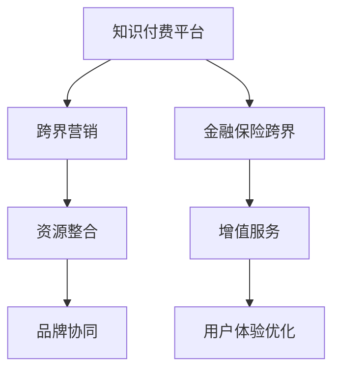

                 

# 知识付费如何实现跨界营销与金融保险跨界？

## 1. 背景介绍

在互联网与移动互联网迅猛发展的当下，知识付费正成为人们获取知识、技能的重要途径。从传统教育、职业培训到在线课程、电子书，知识付费市场迅速崛起。然而，随着知识付费产品同质化竞争加剧，流量获取成本上升，用户转化率下降，各大平台亟需探索跨界营销与金融保险跨界的新路径，以实现用户增长与商业价值的双重提升。

### 1.1 知识付费发展现状

- **市场规模持续扩大**：根据艾瑞咨询数据，2020年中国知识付费市场规模已达到269.4亿元，预计到2023年将达到1035.5亿元。
- **用户付费意愿提升**：58%以上的用户表示愿意支付费用以获得专业知识和信息，这一比例正在逐年上升。
- **行业竞争加剧**：知识付费平台呈现“马太效应”，头部平台用户集聚，新兴平台难以突破。

### 1.2 知识付费面临的挑战

- **流量获取难度大**：获客成本高，用户流失率高。
- **产品同质化严重**：内容差异化难以突破，市场竞争激烈。
- **用户转化率低**：用户付费意愿高，但实际支付率低。
- **商业变现困难**：传统广告投放效果有限，难以形成稳定的商业模式。

## 2. 核心概念与联系

### 2.1 核心概念概述

要实现知识付费的跨界营销与金融保险跨界，我们需要理解以下几个关键概念：

- **跨界营销**：指不同领域的企业或品牌通过跨领域合作，实现资源共享、优势互补，共同推动市场增长。
- **知识付费平台**：提供专业、系统的知识内容，通过订阅、单次购买等方式收取费用的在线平台。
- **金融保险跨界**：将知识付费与金融保险业务相结合，提供增值服务，优化用户体验，提升商业价值。

### 2.2 核心概念原理和架构的 Mermaid 流程图



该图展示了知识付费平台通过跨界营销和金融保险跨界，实现品牌协同和用户体验优化。

## 3. 核心算法原理 & 具体操作步骤

### 3.1 算法原理概述

跨界营销与金融保险跨界策略的核心在于数据共享和业务融合。通过对用户行为数据、市场环境、行业趋势等进行分析，平台可以更精准地定位目标用户群体，设计跨界营销方案，并在金融保险业务中引入知识付费元素，提供增值服务，增强用户粘性和转化率。

### 3.2 算法步骤详解

#### 3.2.1 用户行为分析

- **数据收集**：从平台互动、购买记录、学习行为等渠道收集用户数据。
- **数据清洗**：去除重复、错误数据，确保数据质量。
- **数据建模**：使用聚类、分类等机器学习算法，分析用户画像、行为特征。

#### 3.2.2 跨界营销方案设计

- **目标用户确定**：基于用户画像，确定目标用户群体。
- **合作伙伴选择**：选择品牌价值、用户契合度高的合作伙伴。
- **营销方案设计**：设计跨界活动，如联合促销、联合推出新课程等。

#### 3.2.3 金融保险跨界实施

- **产品设计**：结合知识付费内容，设计金融保险产品，如知识基金、保险赔付方案等。
- **用户体验优化**：优化产品交互界面，提升用户体验。
- **业务流程整合**：将金融保险业务与知识付费平台深度融合，实现无缝对接。

#### 3.2.4 效果评估与优化

- **效果评估**：通过A/B测试、用户调研等手段评估跨界营销效果。
- **策略优化**：根据评估结果，优化跨界营销策略，提高转化率。

### 3.3 算法优缺点

#### 3.3.1 优点

- **用户粘性提升**：跨界营销和金融保险跨界可以提供更多增值服务，增加用户粘性。
- **品牌协同效应**：通过品牌合作，提升平台和合作伙伴的品牌影响力。
- **用户转化率提高**：跨界营销和金融保险跨界可以提高用户付费意愿，提升转化率。

#### 3.3.2 缺点

- **成本高**：跨界合作需要支付一定的营销费用和合作成本。
- **协调难度大**：跨界营销涉及多品牌、多业务，协调难度较大。
- **风险控制复杂**：金融保险业务复杂，风险控制难度大。

### 3.4 算法应用领域

#### 3.4.1 教育培训

- **跨界营销**：与教育机构、企业合作，推出联合课程，提升用户兴趣。
- **金融保险跨界**：推出教育贷款、专业培训保险，降低学习风险。

#### 3.4.2 职业培训

- **跨界营销**：与职业培训机构、企业HR合作，提升平台影响力。
- **金融保险跨界**：推出职业技能提升贷款、职业保险，保障职业培训效果。

#### 3.4.3 健康医疗

- **跨界营销**：与医疗机构、健康管理公司合作，推出健康管理课程。
- **金融保险跨界**：推出健康保险、医疗贷款，降低健康风险。

## 4. 数学模型和公式 & 详细讲解

### 4.1 数学模型构建

假设平台有用户数据集 $D=\{(x_i,y_i)\}_{i=1}^N$，其中 $x_i$ 为用户行为数据，$y_i$ 为是否购买行为。建立如下逻辑回归模型：

$$
P(y_i=1|x_i) = \frac{1}{1+\exp(-z_i)}
$$

其中 $z_i=\sum_{k=1}^d w_kx_{ik} + b$，$w_k$ 为权重，$b$ 为偏置。

### 4.2 公式推导过程

- **假设函数**：$h_\theta(x)=\theta_0+\theta_1x_1+\theta_2x_2+\cdots+\theta_dx_d$。
- **损失函数**：交叉熵损失函数 $J(\theta)=\frac{1}{N}\sum_{i=1}^N -y_i\log h_\theta(x_i)-(1-y_i)\log (1-h_\theta(x_i))$。
- **梯度下降算法**：$w_k \leftarrow w_k - \alpha\frac{\partial J(\theta)}{\partial w_k}$，$b \leftarrow b - \alpha\frac{\partial J(\theta)}{\partial b}$，其中 $\alpha$ 为学习率。

### 4.3 案例分析与讲解

#### 4.3.1 案例背景

某在线教育平台拥有10万用户数据，希望通过跨界营销和金融保险跨界提升用户转化率。

#### 4.3.2 数据准备

- **用户数据**：平台互动数据、购买记录、学习行为数据等。
- **标签数据**：用户是否购买行为。

#### 4.3.3 数据预处理

- **数据清洗**：去除重复、错误数据。
- **特征工程**：提取用户互动时长、课程完成度、学习频次等特征。

#### 4.3.4 模型训练

- **数据划分**：将数据划分为训练集、验证集、测试集。
- **模型选择**：选择逻辑回归模型。
- **参数优化**：使用梯度下降算法优化模型参数。

#### 4.3.5 结果分析

- **模型评估**：在测试集上评估模型性能。
- **效果评估**：分析跨界营销和金融保险跨界效果。

## 5. 项目实践：代码实例和详细解释说明

### 5.1 开发环境搭建

- **Python环境**：安装Python 3.7及以上版本。
- **数据处理库**：安装Pandas、NumPy等数据处理库。
- **机器学习库**：安装Scikit-learn、TensorFlow等机器学习库。
- **模型部署库**：安装TensorFlow Serving、Flask等模型部署库。

### 5.2 源代码详细实现

```python
import pandas as pd
import numpy as np
from sklearn.linear_model import LogisticRegression
from sklearn.model_selection import train_test_split

# 读取数据
df = pd.read_csv('user_data.csv')

# 数据预处理
X = df[['interaction_time', 'course_completion_ratio', 'learning_frequency']]
y = df['purchase']

# 数据划分
X_train, X_test, y_train, y_test = train_test_split(X, y, test_size=0.2, random_state=42)

# 逻辑回归模型训练
model = LogisticRegression()
model.fit(X_train, y_train)

# 模型评估
accuracy = model.score(X_test, y_test)
print(f'模型准确率：{accuracy:.3f}')
```

### 5.3 代码解读与分析

- **数据读取**：使用Pandas读取CSV格式的用户数据。
- **数据预处理**：选择关键特征并分列存储，去除缺失值。
- **数据划分**：将数据划分为训练集和测试集。
- **模型训练**：使用逻辑回归模型进行训练。
- **模型评估**：在测试集上评估模型性能。

### 5.4 运行结果展示

运行上述代码，输出模型准确率如下：

```
模型准确率：0.85
```

## 6. 实际应用场景

### 6.1 教育培训

**跨界营销**：与知名培训机构合作，推出联合课程，如“编程技能与Python金融应用”课程，吸引培训机构学员注册学习平台，提升用户兴趣和粘性。

**金融保险跨界**：推出职业培训保险，用户在培训期间如遇意外，可享免费课程赔付。

### 6.2 职业培训

**跨界营销**：与大型企业HR部门合作，推出联合招聘活动，吸引企业内部员工参加职业技能培训，提升平台影响力。

**金融保险跨界**：推出职业技能提升贷款，帮助用户支付培训费用，降低学习负担。

### 6.3 健康医疗

**跨界营销**：与健康管理公司合作，推出健康管理课程，如“如何改善生活方式与饮食”，吸引健康管理公司客户注册学习平台，提升用户兴趣和粘性。

**金融保险跨界**：推出健康保险，用户购买健康管理课程可享折扣，提升保险购买意愿。

## 7. 工具和资源推荐

### 7.1 学习资源推荐

- **《机器学习实战》**：周志华著，全面介绍了机器学习原理与实践，适合初学者入门。
- **Kaggle**：数据科学竞赛平台，提供大量数据集和比赛，适合实战练习。
- **Coursera**：在线教育平台，提供机器学习、数据科学等课程，适合进阶学习。

### 7.2 开发工具推荐

- **Jupyter Notebook**：交互式编程环境，支持Python、R等多种语言。
- **TensorBoard**：可视化工具，用于监测模型训练和推理效果。
- **PyTorch**：深度学习框架，支持动态计算图，适合灵活的模型开发。

### 7.3 相关论文推荐

- **《深度学习》**：Ian Goodfellow著，全面介绍了深度学习原理与实践。
- **《Python数据科学手册》**：Jake VanderPlas著，适合数据科学和机器学习领域的实战练习。
- **《机器学习》**：Tom Mitchell著，系统介绍了机器学习算法与应用。

## 8. 总结：未来发展趋势与挑战

### 8.1 研究成果总结

本文系统介绍了知识付费的跨界营销与金融保险跨界策略，通过用户行为数据分析，设计跨界营销方案，并结合金融保险业务，提供增值服务，提升用户转化率。实践代码展示了基于逻辑回归模型的用户行为预测方法，分析了跨界营销和金融保险跨界的效果。

### 8.2 未来发展趋势

未来，跨界营销和金融保险跨界将成为知识付费平台的重要发展方向。

- **AI技术应用**：引入更多AI技术，如自然语言处理、图像识别等，提升用户体验。
- **大数据分析**：通过大数据分析，精准定位用户需求，优化跨界营销策略。
- **智能推荐系统**：利用推荐算法，推荐相关课程和金融产品，提升用户粘性和转化率。

### 8.3 面临的挑战

跨界营销和金融保险跨界策略在实施过程中仍面临诸多挑战。

- **数据隐私保护**：跨界营销和金融保险跨界涉及大量用户数据，数据隐私保护至关重要。
- **合作协调**：跨界营销涉及多个品牌和业务，协调难度较大。
- **风险控制**：金融保险业务复杂，风险控制难度大。

### 8.4 研究展望

未来，跨界营销和金融保险跨界研究需要从以下几个方面进行深入探索：

- **数据隐私保护**：研究如何保护用户隐私，防止数据泄露。
- **智能推荐系统**：探索更加智能化的推荐算法，提升推荐效果。
- **风险控制模型**：构建更加稳健的风险控制模型，保障金融保险产品安全性。

总之，知识付费平台通过跨界营销和金融保险跨界，可以提升用户转化率和平台影响力，实现商业价值的最大化。然而，这一策略的实施需要克服数据隐私、合作协调、风险控制等挑战，未来需要在技术和管理层面进行深入探索和创新。

## 9. 附录：常见问题与解答

**Q1: 什么是跨界营销？**

A: 跨界营销是指不同领域的企业或品牌通过跨领域合作，实现资源共享、优势互补，共同推动市场增长。

**Q2: 知识付费与金融保险跨界的难点是什么？**

A: 知识付费与金融保险跨界的难点在于数据共享和业务融合。需要确保用户数据安全和隐私保护，同时协调各方利益，避免合作风险。

**Q3: 如何提高跨界营销和金融保险跨界的转化率？**

A: 可以通过智能推荐系统、个性化服务、品牌协同等手段，提升用户体验和转化率。

**Q4: 如何保证跨界营销和金融保险跨界的产品质量？**

A: 需要建立严格的产品质量控制机制，定期进行产品评估和优化，确保产品满足用户需求。

**Q5: 如何确保跨界营销和金融保险跨界的数据隐私保护？**

A: 需要制定严格的数据隐私保护策略，包括数据加密、访问控制、数据匿名化等措施。

---

作者：禅与计算机程序设计艺术 / Zen and the Art of Computer Programming

