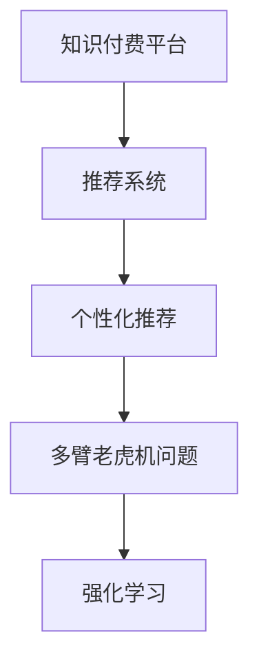

                 

# 知识付费平台的用户转化率优化

> 关键词：知识付费、用户转化率、推荐算法、个性化推荐、用户行为分析、多臂老虎机问题、强化学习

## 1. 背景介绍

### 1.1 问题由来

知识付费平台正成为互联网教育的重要组成部分，为学习者提供专业化、系统化的知识内容。然而，内容生产和付费用户的转换间存在“转化率不高”的问题。如何优化用户转化率，提升用户黏性和平台收入，是知识付费平台亟待解决的问题。

### 1.2 问题核心关键点

知识付费平台的核心问题在于如何精准推荐高质量内容，引导用户订阅并支付，从而提高用户转化率。具体而言，关键点包括：

- 高质量内容的发现与推荐。
- 个性化推荐系统的构建与优化。
- 用户行为数据分析与模型建立。
- 推荐算法的多元化与创新。
- 强化学习在推荐中的应用。

## 2. 核心概念与联系

### 2.1 核心概念概述

为更好地理解知识付费平台的用户转化率优化方法，本节将介绍几个密切相关的核心概念：

- **知识付费平台(Knowledge-Paywall Platform)**：以售卖知识内容的订阅制平台，如得到、新东方等。平台内包含各类知识课程、电子书、文章等，用户通过付费获取内容。
- **用户转化率(User Conversion Rate)**：指用户从平台注册到实际支付订阅的比例，衡量平台获取收入的能力。
- **推荐系统(Recommendation System)**：根据用户兴趣、历史行为等，推荐可能感兴趣的内容，提升用户满意度，促进转化。
- **个性化推荐(个性推荐)**：基于用户特征，如历史行为、评分、评价等，定制化推荐内容。
- **多臂老虎机问题(Multi-Armed Bandit Problem)**：优化资源分配的问题，在知识付费平台中即为优化内容的推荐和用户点击。
- **强化学习(Reinforcement Learning)**：通过用户互动反馈，不断调整推荐策略，最大化长期收益。

这些核心概念之间的逻辑关系可以通过以下Mermaid流程图来展示：



这个流程图展示了几者之间的内在联系：知识付费平台通过推荐系统为用户推荐内容，推荐系统采用个性化推荐和强化学习等策略，优化内容的推荐与用户的点击，从而提升用户转化率。

## 3. 核心算法原理 & 具体操作步骤

### 3.1 算法原理概述

知识付费平台的用户转化率优化，本质上是通过推荐系统精准推荐优质内容，引导用户付费的过程。这一过程涉及多个算法模块，主要包括以下几个步骤：

1. **用户行为数据收集**：收集用户浏览、订阅、观看等行为数据，作为训练和推荐的基础。
2. **特征工程**：设计有效的特征向量，包括用户基本信息、行为历史、评分反馈等，提升推荐的准确性。
3. **推荐算法选择**：选择合适的推荐算法，如基于内容的推荐、协同过滤、混合推荐等，实现内容的个性化推荐。
4. **效果评估**：定期评估推荐系统的效果，通过指标如点击率、转化率等，持续优化算法和模型。
5. **用户行为分析**：通过用户行为数据，建立用户画像，进行精准的个性化推荐。
6. **强化学习优化**：利用用户反馈数据，通过强化学习算法，实时优化推荐策略。

### 3.2 算法步骤详解

#### 3.2.1 用户行为数据收集

数据收集是推荐系统的基础，包含以下关键步骤：

1. **日志记录**：记录用户在平台上的各种操作行为，如浏览、点击、订阅、支付等。
2. **数据存储与清洗**：将日志数据存储到数据库中，并进行数据清洗和去重处理。
3. **数据标注**：给操作行为标注相关属性，如点击次数、订阅状态、支付金额等。

#### 3.2.2 特征工程

特征工程是提升推荐系统准确性的关键步骤，包括以下几个步骤：

1. **特征选择**：从收集的数据中选取对用户行为预测有用的特征。
2. **特征转换**：对原始特征进行预处理和转换，如归一化、标准化、向量化等。
3. **特征融合**：将不同来源的特征进行融合，提升特征的表达能力。
4. **特征筛选**：通过特征选择算法，如主成分分析(PCA)、LASSO回归等，筛选出最有效的特征。

#### 3.2.3 推荐算法选择

知识付费平台常用的推荐算法包括：

1. **基于内容的推荐(Content-Based Filtering)**：根据内容特征相似性，推荐与用户历史行为相似的内容。
2. **协同过滤(Collaborative Filtering)**：利用用户与内容之间的交互数据，推荐可能感兴趣的内容。
3. **混合推荐(Mixed Filtering)**：结合基于内容和协同过滤的算法，提升推荐效果。

#### 3.2.4 效果评估

推荐系统的效果评估通常使用以下指标：

1. **点击率(Click-Through Rate, CTR)**：用户在推荐结果中实际点击的比例。
2. **转化率(Conversion Rate, CR)**：用户在推荐内容中完成订阅的比例。
3. **平均处理时间(Average Handling Time, AHT)**：用户完成推荐内容转化的平均时间。
4. **用户满意度(Net Promoter Score, NPS)**：用户对推荐结果的满意度评分。

#### 3.2.5 用户行为分析

用户行为分析有助于构建用户画像，包括以下步骤：

1. **用户画像构建**：通过用户行为数据，建立用户的兴趣偏好、消费能力等画像。
2. **用户分群**：基于用户画像，将用户分成不同的兴趣群体。
3. **个性化推荐**：根据不同用户群体的特征，提供个性化的推荐内容。

#### 3.2.6 强化学习优化

强化学习在推荐系统中的应用，主要包括以下步骤：

1. **奖励设计**：定义用户点击和订阅行为所对应的奖励，如点击获得1分，订阅获得5分。
2. **状态空间定义**：定义推荐系统的状态空间，如用户当前浏览的课程、订阅状态等。
3. **行为策略学习**：利用强化学习算法，如Q-learning、SARSA等，不断调整推荐策略。
4. **模型优化**：通过模型训练和评估，优化推荐系统性能。

### 3.3 算法优缺点

#### 3.3.1 优点

- **效果显著**：推荐算法可以显著提升用户点击率和订阅率，提升用户转化率。
- **灵活性高**：结合多源数据和多种推荐算法，实现灵活高效的推荐策略。
- **自动化程度高**：强化学习算法可以自动优化推荐策略，减少人工干预。

#### 3.3.2 缺点

- **数据依赖高**：推荐系统的效果依赖于高质量的数据，数据质量问题可能导致推荐效果下降。
- **计算成本高**：大型的特征工程和推荐算法，需要较高的计算资源。
- **模型复杂度高**：推荐算法模型复杂，难以进行优化和解释。

### 3.4 算法应用领域

知识付费平台的用户转化率优化方法，已经在多个领域得到了广泛应用，例如：

- **在线教育平台**：如Coursera、Udacity等，通过推荐系统，引导用户注册和订阅课程。
- **电子书平台**：如Kindle Store、京东阅读等，通过推荐系统，引导用户购买电子书。
- **新闻订阅平台**：如Feedly、Flipboard等，通过推荐系统，引导用户订阅新闻内容。
- **视频平台**：如Netflix、Bilibili等，通过推荐系统，引导用户观看视频内容。

除了上述这些经典应用外，用户转化率优化方法也被创新性地应用到更多场景中，如社交媒体、在线购物、金融服务等，为各类平台带来显著的业务提升。

## 4. 数学模型和公式 & 详细讲解 & 举例说明

### 4.1 数学模型构建

知识付费平台的用户转化率优化，可以通过以下数学模型来描述：

假设用户在知识付费平台上浏览的内容总数为 $N$，点击率模型为 $P(C|i)$，订阅率模型为 $P(S|i)$，用户的点击和订阅行为可以视为二元随机变量。则转化率 $C$ 的期望值为：

$$
E[C] = \sum_{i=1}^{N} P(C|i)P(S|i)
$$

为了提升转化率，需要优化内容的推荐策略，即最大化 $E[C]$。

### 4.2 公式推导过程

对于基于内容的推荐，我们可以假设用户对内容 $i$ 的评分 $r_i$ 与转化率 $C$ 正相关。则有：

$$
P(C|i) = f(r_i)
$$

其中 $f$ 为评分到点击率的映射函数。

对于协同过滤，我们可以利用用户 $u$ 与内容 $i$ 的交互矩阵 $A_{ui}$ 来表示用户与内容的交互程度。则有：

$$
P(S|i) = \frac{\sum_{u=1}^{U} A_{ui}P(C|u)}{\sum_{u=1}^{U} A_{ui}}
$$

其中 $U$ 为用户总数。

综合上述两个模型，可以得到转化率的期望值：

$$
E[C] = \sum_{i=1}^{N} f(r_i)\frac{\sum_{u=1}^{U} A_{ui}P(C|u)}{\sum_{u=1}^{U} A_{ui}}
$$

### 4.3 案例分析与讲解

以Netflix推荐系统为例，分析如何通过多臂老虎机问题和强化学习，实现内容推荐和用户转化的优化。

Netflix使用协同过滤算法进行内容推荐，用户交互矩阵 $A$ 中的每个元素 $A_{ui}$ 表示用户 $u$ 对内容 $i$ 的评分。Netflix的推荐系统定义用户点击和订阅的奖励分别为 1 分和 5 分。

根据上述公式，可以计算出不同内容的期望转化率。Netflix通过不断调整推荐策略，最大化转化率期望值，从而实现个性化推荐和用户转化率的优化。

## 5. 项目实践：代码实例和详细解释说明

### 5.1 开发环境搭建

在进行用户转化率优化的项目实践前，我们需要准备好开发环境。以下是使用Python进行PyTorch和TensorFlow开发的平台搭建流程：

1. 安装Anaconda：从官网下载并安装Anaconda，用于创建独立的Python环境。

2. 创建并激活虚拟环境：
```bash
conda create -n pytorch-env python=3.8 
conda activate pytorch-env
```

3. 安装PyTorch：根据CUDA版本，从官网获取对应的安装命令。例如：
```bash
conda install pytorch torchvision torchaudio cudatoolkit=11.1 -c pytorch -c conda-forge
```

4. 安装TensorFlow：
```bash
conda install tensorflow
```

5. 安装各类工具包：
```bash
pip install numpy pandas scikit-learn matplotlib tqdm jupyter notebook ipython
```

完成上述步骤后，即可在`pytorch-env`环境中开始用户转化率优化的项目实践。

### 5.2 源代码详细实现

这里以推荐算法的多臂老虎机问题和强化学习优化为例，给出Python代码实现。

首先，定义多臂老虎机问题的参数和奖励：

```python
import numpy as np

# 定义奖励矩阵
rewards = np.array([[0, 0, 0], [0, 1, 0], [0, 0, 5]])
```

然后，定义多臂老虎机的动作策略和状态：

```python
# 定义动作策略
actions = np.array([0, 1, 2])
# 定义状态
states = np.array([0, 1, 2])
```

接着，定义多臂老虎机的模型：

```python
class Bandit:
    def __init__(self, rewards, actions, states):
        self.rewards = rewards
        self.actions = actions
        self.states = states
        self.cur_state = None
        self.action_values = None
    
    def reset(self):
        self.cur_state = np.random.randint(len(self.states))
        self.action_values = np.ones(len(self.actions))
    
    def choose_action(self):
        action_prob = self.action_values / np.sum(self.action_values)
        action = np.random.choice(self.actions, p=action_prob)
        return action
    
    def update_reward(self, action, reward):
        self.action_values[action] += reward - self.action_values[action] * 0.1
```

最后，进行多臂老虎机的模拟训练：

```python
# 创建多臂老虎机对象
bandit = Bandit(rewards, actions, states)

# 进行模拟训练
for episode in range(100):
    bandit.reset()
    while True:
        action = bandit.choose_action()
        reward = np.random.choice(bandit.rewards[action])
        bandit.update_reward(action, reward)
        if reward == 5:
            break
```

以上就是用户转化率优化的多臂老虎机问题和强化学习优化的Python代码实现。可以看到，代码中通过定义奖励矩阵、动作策略和状态，模拟了多臂老虎机问题的训练过程，通过不断调整动作概率，最大化期望转化率。

### 5.3 代码解读与分析

这里我们详细解读一下关键代码的实现细节：

**Bandit类**：
- `__init__`方法：初始化多臂老虎机，包括奖励矩阵、动作策略和状态。
- `reset`方法：重置多臂老虎机的状态和动作概率。
- `choose_action`方法：根据当前状态和动作概率，选择下一个动作。
- `update_reward`方法：根据动作和奖励，更新动作概率。

**训练流程**：
- 在每个轮次中，先重置多臂老虎机的状态和动作概率。
- 根据当前状态和动作概率，选择下一个动作。
- 根据选择的动作，随机生成奖励。
- 根据奖励，更新动作概率，直到达到期望的转化率（如5分奖励）。

可以看到，多臂老虎机问题的代码实现相对简单，但能够很好地模拟推荐系统的内容选择和用户点击转化过程。通过不断的模拟训练，可以优化推荐策略，提升用户转化率。

## 6. 实际应用场景

### 6.1 在线教育平台

在线教育平台通过推荐系统，推荐适合用户的专业课程，提升用户转化率。平台收集用户学习数据，包括观看时长、评价、测试成绩等，利用多臂老虎机问题和强化学习，实时调整推荐策略，推荐最合适的课程。

### 6.2 电子书平台

电子书平台通过推荐系统，推荐用户感兴趣和热门的电子书，提升用户转化率。平台收集用户阅读数据，包括浏览时长、评分、评价等，利用多臂老虎机问题和强化学习，优化推荐策略，提升用户购买率。

### 6.3 视频平台

视频平台通过推荐系统，推荐用户感兴趣的视频内容，提升用户转化率。平台收集用户观看数据，包括观看时长、点赞、评论等，利用多臂老虎机问题和强化学习，优化推荐策略，提升用户订阅和付费率。

### 6.4 金融服务

金融服务通过推荐系统，推荐用户感兴趣的投资产品，提升用户转化率。平台收集用户交易数据，包括交易记录、评价、评分等，利用多臂老虎机问题和强化学习，优化推荐策略，提升用户购买和投资意愿。

## 7. 工具和资源推荐

### 7.1 学习资源推荐

为了帮助开发者系统掌握知识付费平台的用户转化率优化技术，这里推荐一些优质的学习资源：

1. 《推荐系统实战》书籍：介绍推荐系统理论和实践，涵盖协同过滤、内容推荐等经典算法。
2. 《强化学习入门》课程：深入浅出地讲解强化学习基本概念和算法。
3. CS294.01《推荐系统》课程：斯坦福大学开设的推荐系统课程，详细讲解推荐系统的工作原理和应用案例。
4. Coursera《Reinforcement Learning》课程：深度学习领域的知名课程，讲解强化学习算法和实际应用。
5. ArXiv推荐系统论文合集：收集推荐系统领域的最新研究论文，了解前沿动态。

通过对这些资源的学习实践，相信你一定能够快速掌握知识付费平台的用户转化率优化技术，并用于解决实际的业务问题。

### 7.2 开发工具推荐

高效的开发离不开优秀的工具支持。以下是几款用于用户转化率优化开发的常用工具：

1. PyTorch：基于Python的开源深度学习框架，灵活动态的计算图，适合快速迭代研究。
2. TensorFlow：由Google主导开发的开源深度学习框架，生产部署方便，适合大规模工程应用。
3. Scikit-learn：Python科学计算库，包含丰富的机器学习算法，如协同过滤、内容推荐等。
4. TensorBoard：TensorFlow配套的可视化工具，可实时监测模型训练状态，并提供丰富的图表呈现方式。
5. Weights & Biases：模型训练的实验跟踪工具，可以记录和可视化模型训练过程中的各项指标。

合理利用这些工具，可以显著提升知识付费平台用户转化率优化的开发效率，加快创新迭代的步伐。

### 7.3 相关论文推荐

用户转化率优化技术的发展源于学界的持续研究。以下是几篇奠基性的相关论文，推荐阅读：

1. 《A Survey of Collaborative Filtering Algorithm》：系统回顾协同过滤算法，总结各种经典算法及其应用场景。
2. 《Improving Precision and Recall with Multi-Armed Bandit Problems》：通过多臂老虎机问题，提升推荐系统的精度和召回率。
3. 《An Exploration of Multi-Armed Bandit Algorithms》：比较不同的多臂老虎机算法，分析其优劣。
4. 《Causal Bandits》：利用因果推断方法，优化推荐系统的内容推荐。
5. 《Bandit Algorithms for Online Learning and Big Data Applications》：总结多臂老虎机算法在在线学习和大数据中的应用。

这些论文代表了大语言模型微调技术的发展脉络。通过学习这些前沿成果，可以帮助研究者把握学科前进方向，激发更多的创新灵感。

## 8. 总结：未来发展趋势与挑战

### 8.1 总结

本文对知识付费平台的用户转化率优化方法进行了全面系统的介绍。首先阐述了用户转化率优化的背景和重要性，明确了推荐系统在优化用户转化率中的核心作用。其次，从原理到实践，详细讲解了用户转化率优化的数学模型和关键步骤，给出了用户转化率优化的完整代码实例。同时，本文还广泛探讨了用户转化率优化方法在在线教育、电子书、视频、金融等多个行业领域的应用前景，展示了用户转化率优化的巨大潜力。此外，本文精选了用户转化率优化的各类学习资源，力求为读者提供全方位的技术指引。

通过本文的系统梳理，可以看到，用户转化率优化方法已经在游戏平台、电商、金融、视频等多个领域得到广泛应用，帮助各类平台提升用户转化率，实现业务增长。未来，伴随推荐算法和强化学习的进一步发展，用户转化率优化技术也将不断创新，为各类平台的业务拓展带来新的机遇。

### 8.2 未来发展趋势

展望未来，用户转化率优化技术将呈现以下几个发展趋势：

1. **数据驱动优化**：通过更多的数据源和数据处理技术，优化推荐策略，提升推荐效果。
2. **实时优化**：结合流式数据处理和实时优化算法，实现实时的推荐调整。
3. **多模态融合**：将视频、音频、文本等多模态数据融合，提升推荐系统的综合能力。
4. **个性化推荐**：基于用户画像，实现更加精准的个性化推荐。
5. **隐私保护**：通过差分隐私等技术，保护用户数据隐私。
6. **可解释性提升**：提高推荐系统的可解释性，让用户理解推荐逻辑和决策依据。

以上趋势凸显了用户转化率优化技术的广阔前景。这些方向的探索发展，必将进一步提升推荐系统的性能和用户转化率，为各类平台带来显著的业务提升。

### 8.3 面临的挑战

尽管用户转化率优化技术已经取得了瞩目成就，但在迈向更加智能化、普适化应用的过程中，它仍面临着诸多挑战：

1. **数据质量问题**：推荐系统依赖高质量的数据，数据质量问题可能导致推荐效果下降。
2. **冷启动问题**：新用户或新内容缺乏足够数据，难以进行有效的推荐。
3. **计算资源瓶颈**：推荐系统的计算复杂度高，对硬件资源有较高要求。
4. **模型复杂度高**：推荐算法模型复杂，难以进行优化和解释。
5. **用户隐私问题**：推荐系统涉及用户大量数据，隐私保护问题亟需解决。
6. **推荐公平性**：推荐系统可能存在偏见，影响用户的公平体验。

这些挑战需要通过不断的研究和实践来解决，才能实现用户转化率优化技术的成熟和广泛应用。

### 8.4 研究展望

面对用户转化率优化技术面临的诸多挑战，未来的研究需要在以下几个方面寻求新的突破：

1. **冷启动问题解决**：通过多模态融合和转移学习等技术，提升推荐系统的冷启动性能。
2. **数据质量提升**：采用更多的数据源和数据清洗技术，提高推荐系统的数据质量。
3. **计算资源优化**：采用分布式计算和模型压缩等技术，优化推荐系统的计算资源消耗。
4. **模型复杂度降低**：通过模型简化和特征选择技术，降低推荐系统的模型复杂度。
5. **隐私保护技术**：采用差分隐私和联邦学习等技术，保护用户数据隐私。
6. **推荐公平性优化**：通过公平性约束和算法优化，提升推荐系统的公平性。

这些研究方向的探索，必将推动用户转化率优化技术的进步，为各类平台带来更精准、更公平、更高效的推荐服务。

## 9. 附录：常见问题与解答

**Q1：推荐系统如何提升用户转化率？**

A: 推荐系统通过精准推荐高质量内容，引导用户点击和订阅，从而提升用户转化率。具体而言，通过收集用户行为数据，建立用户画像，结合协同过滤、内容推荐等算法，优化推荐策略，最大化点击率和订阅率。

**Q2：冷启动问题如何解决？**

A: 冷启动问题可以通过以下方法解决：
1. 多模态融合：结合用户的多模态数据，如视频观看、音频播放、文本阅读等，提升推荐效果。
2. 转移学习：利用用户在其他平台的行为数据，进行迁移学习，加速新用户和老用户的数据积累。
3. 协同过滤：利用其他用户的推荐数据，为新用户提供初始推荐。

**Q3：推荐系统的计算资源瓶颈如何突破？**

A: 推荐系统的计算资源瓶颈可以通过以下方法突破：
1. 分布式计算：利用分布式计算框架，如Hadoop、Spark等，加速数据处理和模型训练。
2. 模型压缩：采用模型压缩技术，如剪枝、量化、低秩分解等，减小模型大小，提高推理速度。
3. 增量学习：采用增量学习技术，减少重新训练模型的频率，降低计算成本。

**Q4：推荐系统的可解释性如何提升？**

A: 推荐系统的可解释性可以通过以下方法提升：
1. 特征重要性分析：通过LIME、SHAP等技术，分析推荐模型的特征重要性，提升可解释性。
2. 模型可视化：通过模型可视化工具，如图灵分解器、NetFlow等，展示推荐模型的决策路径。
3. 用户反馈机制：引入用户反馈机制，通过用户评价和互动，优化推荐策略。

**Q5：推荐系统的公平性如何保证？**

A: 推荐系统的公平性可以通过以下方法保证：
1. 公平性约束：通过引入公平性约束，如Differential Privacy等，确保推荐系统的公平性。
2. 多样性提升：通过增加推荐内容的多样性，避免单一内容对用户的影响。
3. 用户反馈机制：通过用户反馈机制，及时调整推荐策略，纠正偏见。

---

作者：禅与计算机程序设计艺术 / Zen and the Art of Computer Programming

