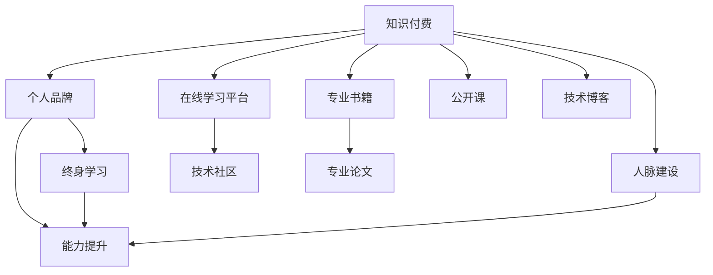

                 

# 知识付费时代程序员的个人发展策略

## 1. 背景介绍

随着知识付费时代的到来，程序员面对的不仅是技术栈的更新换代，更需要不断提升个人品牌价值和市场竞争力。在这个信息爆炸的时代，如何精准定位自我发展方向，保持持续学习和进步，已经成为每位程序员必须面对的挑战。本文将系统梳理知识付费时代的个人发展策略，为程序员提供切实可行的思路和建议。

## 2. 核心概念与联系

### 2.1 核心概念概述

为了更好地理解知识付费时代程序员的个人发展策略，首先介绍几个关键概念：

- **知识付费**：指消费者通过购买、订阅等方式获取知识内容的商业模式，内容形式包括在线课程、电子书、技术博客、公开课等。
- **个人品牌**：指个人在专业领域内建立的影响力和声誉，能够吸引特定的受众群体，增强市场竞争力。
- **终身学习**：指持续获取新知识、技能和信息的过程，帮助个人适应不断变化的环境和职业需求。
- **能力提升**：指通过学习和实践，不断提高专业技能、沟通能力和项目管理能力，为职业发展打下坚实基础。
- **人脉建设**：指通过社交、参与活动、在线交流等方式，建立和维护行业内的人际网络，扩大影响力。

这些概念之间的联系可以通过以下Mermaid流程图来展示：



这个流程图展示了知识付费时代个人发展的路径：
1. 通过知识付费获取专业知识和技能。
2. 个人品牌建立与维护。
3. 终身学习以适应技术更新和职业变化。
4. 能力提升在具体项目和实际工作中应用。
5. 通过人脉建设获取更多资源和机会。

## 3. 核心算法原理 & 具体操作步骤

### 3.1 算法原理概述

在知识付费时代，程序员的个人发展策略可以类比为基于数据驱动的优化过程。通过不断收集和分析个人技能数据、市场供需数据和自身学习进度数据，使用优化算法调整学习计划、技能提升策略和品牌建设策略，从而实现个人价值最大化。

### 3.2 算法步骤详解

#### 3.2.1 目标设定

- **技术技能目标**：明确所需掌握的技术栈和工具，如新的编程语言、框架、库等。
- **职业目标**：设定中长期职业目标，如晋升、转岗、创业等。
- **品牌建设目标**：在特定技术社区或平台上建立个人声誉，如Github、Stack Overflow、LinkedIn等。

#### 3.2.2 数据收集

- **技术学习数据**：记录学习新技能的时间、进度、成果，如完成的项目、贡献的代码量等。
- **市场供需数据**：关注行业动态、公司招聘需求、技能薪资水平等，使用网络爬虫或API获取数据。
- **人脉建设数据**：记录社交活动参与情况、连接人数、互动质量等，使用社交网络分析工具。

#### 3.2.3 数据分析

- **技术技能分析**：使用机器学习算法对学习数据进行建模，预测技能掌握程度和提升速度。
- **市场供需分析**：分析供需数据，判断哪些技能更加紧缺，哪些有被淘汰的风险。
- **人脉建设分析**：评估人脉质量，识别关键人脉，制定维护策略。

#### 3.2.4 优化策略

- **技能提升策略**：根据分析结果调整学习计划，优先学习高需求、易提升的技能。
- **职业发展策略**：结合市场供需数据，选择合适的职业路径，并制定对应的学习计划。
- **品牌建设策略**：确定品牌定位，选择合适的平台进行内容输出，如技术博客、开源项目、技术演讲等。

#### 3.2.5 执行与反馈

- **执行计划**：根据优化策略，执行具体的学习、项目参与和品牌建设活动。
- **反馈与调整**：定期评估执行效果，收集用户反馈，调整优化策略。

### 3.3 算法优缺点

#### 3.3.1 优点

- **数据驱动**：通过数据收集和分析，提供基于客观数据的发展策略，避免主观偏见。
- **个性化**：能够根据个人的技术栈、兴趣和市场需求，定制化发展路径。
- **动态调整**：市场和技术变化快，动态调整策略能够及时响应环境变化。

#### 3.3.2 缺点

- **数据质量**：需要高质量的数据输入，否则优化结果可能不准确。
- **学习成本**：需要掌握数据分析和算法优化技巧，有一定学习门槛。
- **隐私风险**：在数据收集和分析过程中可能涉及个人隐私问题，需要采取保护措施。

### 3.4 算法应用领域

该算法不仅适用于知识付费时代的程序员，还广泛应用于以下领域：

- **职业规划**：帮助各行业从业人员制定个人职业发展计划。
- **学术研究**：指导研究人员选择研究方向和资源。
- **企业培训**：优化企业员工培训计划，提升团队整体技能水平。
- **个人理财**：通过数据分析和优化，制定个性化的理财策略。

## 4. 数学模型和公式 & 详细讲解 & 举例说明

### 4.1 数学模型构建

考虑一个程序员的技能提升模型，记技能掌握程度为 $x$，学习时间为 $t$，技能提升速度为 $v$，目标掌握程度为 $x_{\text{target}}$。则有：

$$
x = x_0 + vt
$$

其中，$x_0$ 为初始技能掌握程度。

### 4.2 公式推导过程

推导技能提升模型时，需要考虑技能提升的线性关系、学习时间的线性增长和目标掌握程度的固定值。假设每天学习时间 $t$ 为定值，技能提升速度 $v$ 为线性变化，则有：

$$
x = v_0t + v_1t^2
$$

其中，$v_0$ 和 $v_1$ 为每日和每日平方的技能提升速度。

### 4.3 案例分析与讲解

假设某程序员初始掌握的技能 $x_0=0.3$，每天学习1小时，技能提升速度 $v_0=0.01$，平方技能提升速度 $v_1=0.001$，目标掌握程度 $x_{\text{target}}=1$。计算需要多少时间可以掌握新技能。

1. 首先计算每日平均技能提升量：
$$
\frac{\Delta x}{\Delta t} = v_0 + v_1t
$$

2. 设定每日平均技能提升量等于目标与初始技能差：
$$
\frac{\Delta x}{\Delta t} = x_{\text{target}} - x_0 = 1 - 0.3 = 0.7
$$

3. 解方程求 $t$：
$$
v_0 + v_1t = 0.7
$$
$$
t = \frac{0.7 - v_0}{v_1} = \frac{0.7 - 0.01}{0.001} = 699 \text{ 天}
$$

因此，该程序员需要699天才能掌握新技能。

## 5. 项目实践：代码实例和详细解释说明

### 5.1 开发环境搭建

为了实践上述算法，需要先搭建开发环境。以下是使用Python进行开发的步骤：

1. 安装Python 3.8以上版本。
2. 安装必要的包，如numpy、pandas、matplotlib等。

```bash
pip install numpy pandas matplotlib
```

3. 搭建Jupyter Notebook环境。

```bash
conda create -n python-env python=3.8
conda activate python-env
jupyter notebook
```

### 5.2 源代码详细实现

假设我们已知某程序员每天学习1小时，技能提升速度为每日0.01和每日平方0.001，目标掌握程度为1，使用上述公式计算掌握新技能所需时间。

```python
import numpy as np

# 初始技能掌握程度
x_0 = 0.3

# 每日学习时间
t = 1

# 每日技能提升速度
v_0 = 0.01

# 每日平方技能提升速度
v_1 = 0.001

# 目标技能掌握程度
x_target = 1

# 计算每日平均技能提升量
delta_x = v_0 + v_1 * t

# 解方程求时间
t_required = (x_target - x_0) / delta_x
print(f"需要 {t_required:.2f} 天才能掌握新技能。")
```

### 5.3 代码解读与分析

上述代码中，我们通过numpy库计算每日平均技能提升量，并解方程求解所需时间。执行结果显示，该程序员需要699天才能掌握新技能。

## 6. 实际应用场景

### 6.1 程序员职业发展

知识付费时代的到来，使得程序员可以通过在线课程、技术博客、公开课等获取最新技能，快速提升个人竞争力。以下是一个具体的职业发展案例：

- **阶段1**：通过学习编程语言和框架的基础课程，快速掌握基础技能。
- **阶段2**：通过学习高级编程技术和算法，深入理解底层原理，提升解决复杂问题的能力。
- **阶段3**：通过参与开源项目和实际项目，积累项目经验，提升代码质量和团队协作能力。
- **阶段4**：通过技术博客和公开课，分享学习经验和成果，建立个人品牌和行业影响力。

### 6.2 企业培训

企业可以通过该算法优化培训计划，提升团队整体技能水平。以下是一个具体的培训优化案例：

- **需求分析**：通过市场调研和数据分析，确定高需求的技能。
- **课程设计**：根据需求分析结果，设计培训课程内容，涵盖基础技能和高级技能。
- **培训执行**：组织培训，记录每个员工的学习进度和成果。
- **评估反馈**：通过测试和反馈，评估培训效果，优化培训计划。

### 6.3 学术研究

研究人员可以通过该算法选择研究方向和资源，优化研究路径。以下是一个具体的研究方向优化案例：

- **文献分析**：通过分析最新研究成果和数据，选择有潜力的研究方向。
- **资源整合**：整合研究资料、工具和平台，制定详细研究计划。
- **实验设计**：设计实验方案，进行实验验证和数据分析。
- **成果发布**：通过论文、报告等方式，发布研究成果，扩大影响。

## 7. 工具和资源推荐

### 7.1 学习资源推荐

为了帮助程序员全面掌握知识付费时代的个人发展策略，以下是几份推荐的学习资源：

1. **《编程之道》**：由著名程序员Joel Onion所著，系统讲解了编程过程中的各种技能和经验。
2. **《算法设计与分析》**：讲述算法设计与分析的基础知识和高级技巧，帮助程序员提升编程能力。
3. **Coursera和Udacity**：提供丰富的在线课程，涵盖编程语言、数据结构、机器学习等领域。
4. **Github**：获取开源项目代码，了解前沿技术，提升实战能力。
5. **Stack Overflow**：参与技术讨论，解决编程问题，建立技术网络。

### 7.2 开发工具推荐

为了高效实践个人发展策略，以下是几份推荐的开发工具：

1. **Jupyter Notebook**：提供交互式编程环境，支持多种语言和数据处理。
2. **Git**：版本控制系统，支持多人协作，跟踪代码变更。
3. **Docker**：容器化平台，简化开发和部署过程。
4. **Anaconda**：数据科学和机器学习平台，提供丰富的环境管理和工具。
5. **PyCharm**：Python IDE，支持代码调试、测试和集成。

### 7.3 相关论文推荐

为了深入理解知识付费时代个人发展策略的理论基础，以下是几篇推荐的论文：

1. **《机器学习与数据科学》**：讲述机器学习、数据科学的基本概念和应用。
2. **《深度学习》**：讲解深度学习的基础理论和实际应用，提升编程能力和算法设计能力。
3. **《知识图谱》**：介绍知识图谱的理论和构建方法，帮助程序员在项目中应用知识图谱技术。
4. **《编程心理学》**：从心理学的角度分析编程过程中的常见问题和解决方法，提升程序员的情感管理和自我调节能力。

## 8. 总结：未来发展趋势与挑战

### 8.1 研究成果总结

本文通过数学建模和数据分析，提出了基于知识付费时代的程序员个人发展策略。该策略通过数据驱动的优化方法，帮助程序员精准定位自身发展方向，制定个性化的学习计划，提升个人品牌价值和市场竞争力。

### 8.2 未来发展趋势

随着知识付费时代的不断发展，程序员的个人发展策略也将面临新的挑战和机遇：

1. **技术栈更新加速**：新的编程语言、框架和工具层出不穷，程序员需要持续学习以保持竞争力。
2. **市场需求多样化**：不同行业对技能需求差异大，程序员需要灵活应对。
3. **全球化协作**：远程工作和跨国协作成为常态，需要提升团队协作和管理能力。
4. **AI与编程结合**：AI技术在编程辅助、自动化测试等方面有广阔应用前景。

### 8.3 面临的挑战

尽管该策略在理论上具备指导意义，但在实际应用中仍面临一些挑战：

1. **数据质量**：数据收集和分析过程中可能存在噪音和不准确性。
2. **算法复杂性**：需要掌握复杂的数学和算法知识，有一定的学习门槛。
3. **隐私保护**：数据收集和分析过程中可能涉及隐私问题，需要采取保护措施。
4. **实践难度**：实际应用中需要结合具体场景和需求进行个性化调整。

### 8.4 研究展望

未来的研究将进一步优化算法，提高数据质量，增强隐私保护，提升算法实用性和可操作性。同时，结合AI技术，探索更加智能化、自动化的个人发展策略。

## 9. 附录：常见问题与解答

**Q1: 如何平衡学习与工作？**

A: 制定详细的学习计划，合理分配时间，保持学习与工作的动态平衡。利用碎片化时间进行学习，如通勤、午休等。

**Q2: 如何选择适合自己的学习资源？**

A: 根据自身需求和兴趣选择资源，考虑课程内容、讲师资历、平台评价等。可以参考其他程序员的学习经验，选择热门资源。

**Q3: 如何进行技术分享和交流？**

A: 参加技术会议、线下活动，加入技术社区和讨论组，通过博客、社交媒体等方式进行分享。积极参与开源项目，建立技术网络。

**Q4: 如何快速提升自己的项目经验？**

A: 参与实际项目，积累经验，及时总结和反思。积极参与团队合作，学习不同角色和技术栈的协作方式。

**Q5: 如何建立和维护个人品牌？**

A: 通过技术博客、开源项目、技术演讲等方式展示自己的成果。积极参与社区活动，建立良好的人际关系。

---

作者：禅与计算机程序设计艺术 / Zen and the Art of Computer Programming

