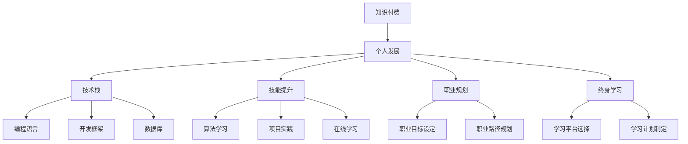

                 

# 知识付费时代程序员的个人发展策略与规划

> 关键词：知识付费, 个人发展, 技术栈, 技能提升, 职业规划, 终身学习

## 1. 背景介绍

在知识付费的时代，程序员面临的不仅是技术的快速发展，还有不断变化的市场需求。这个时代要求程序员不仅仅是代码的编写者，更是解决问题的专家。在这样的背景下，如何制定个人发展策略和规划，成为每位程序员都必须面对的重要课题。本文将从背景介绍、核心概念与联系、核心算法原理与操作步骤、数学模型与公式、项目实践、实际应用场景、工具与资源推荐、总结与展望、常见问题与解答等多个方面，深入探讨知识付费时代程序员的个人发展策略与规划。

## 2. 核心概念与联系

### 2.1 核心概念概述

在知识付费时代，程序员需要掌握的核心概念包括但不限于：

- **知识付费**：指的是用户为获取专业知识和技能而支付费用的模式。在编程领域，知识付费不仅包括技术书籍、在线课程，还包括专家咨询、技术社区等。
- **个人发展**：指通过不断学习和实践，提升个人的专业技能、管理能力和创新能力，以适应市场变化和职业需求。
- **技术栈**：指程序员掌握的技术工具、编程语言、框架等技术组合。技术栈的选择和更新，直接影响个人的发展路径。
- **技能提升**：指通过有针对性的学习和训练，提高个人的专业技能，如算法、数据结构、系统架构等。
- **职业规划**：指在职业发展的不同阶段，制定合理的职业目标和发展路径。
- **终身学习**：指在职业生涯中，持续不断地学习和更新知识，保持与时代同步。

这些概念之间相互关联，共同构成知识付费时代程序员个人发展的理论基础。

### 2.2 核心概念原理和架构的 Mermaid 流程图



这个流程图展示了知识付费、个人发展与技术栈、技能提升、职业规划和终身学习之间的关系。通过不断学习和实践，程序员可以在知识付费平台上积累和更新自己的技术栈和技能，制定和调整职业规划，实现终身学习，从而在个人发展中获得成功。

## 3. 核心算法原理 & 具体操作步骤

### 3.1 算法原理概述

个人发展策略与规划的核心算法原理可以简单概括为：通过不断学习和实践，积累和更新技术栈和技能，制定和调整职业规划，实现终身学习。这一过程可以通过以下步骤实现：

1. **目标设定**：明确个人发展的短期和长期目标，如提升某项技能、掌握新的技术栈、获得高级职位等。
2. **技能学习**：通过在线课程、书籍、项目实践等方式，学习新的编程语言、框架和技术。
3. **项目实践**：通过参与实际项目，将所学知识应用到实际问题中，提高解决实际问题的能力。
4. **职业规划**：根据自身的技术栈和技能，制定职业发展路径，如从初级工程师到高级工程师，再到技术经理或CTO。
5. **持续学习**：通过持续学习和更新技术栈，保持与时代同步，适应市场变化。

### 3.2 算法步骤详解

以下是个人发展策略与规划的详细步骤：

#### 3.2.1 目标设定

1. **短期目标**：如掌握新的编程语言、完成某个在线课程。
2. **长期目标**：如成为某领域的专家、获得高级职位。

#### 3.2.2 技能学习

1. **在线课程**：选择与目标技能相关的在线课程，如Coursera、Udemy、edX等平台提供的编程课程。
2. **技术书籍**：阅读相关技术书籍，如《Clean Code》、《Design Patterns》等。
3. **项目实践**：通过参与开源项目、自己开发项目等方式，将所学知识应用到实际问题中。

#### 3.2.3 项目实践

1. **开源项目**：参与开源项目，了解和实践其他开发者的工作流程和技术栈。
2. **个人项目**：自己开发项目，从需求分析到实现，全过程体验项目开发。
3. **技术社区**：参与技术社区，如GitHub、Stack Overflow等，分享和交流经验。

#### 3.2.4 职业规划

1. **职业目标**：明确职业发展的阶段和目标，如初级工程师、高级工程师、技术经理、CTO等。
2. **路径规划**：根据职业目标，制定详细的职业规划，包括所需技能、需要完成的项目等。
3. **资源配置**：配置和调整个人和团队资源，确保职业目标的实现。

#### 3.2.5 持续学习

1. **学习平台**：选择合适的学习平台，如Udacity、Pluralsight等。
2. **学习计划**：制定周密的学习计划，包括学习内容、时间安排等。
3. **学习效果评估**：定期评估学习效果，调整学习计划和方法。

### 3.3 算法优缺点

**优点**：

- **灵活性**：可以根据个人需求和市场变化，灵活调整学习内容和职业规划。
- **系统性**：通过目标设定、技能学习、项目实践、职业规划和持续学习，形成系统的个人发展策略。
- **可操作性**：每个步骤都有明确的操作指导，便于执行和实现。

**缺点**：

- **时间成本**：个人发展需要大量的时间和精力投入，可能会影响日常生活。
- **经济成本**：一些高级课程和培训需要付费，增加了经济负担。
- **竞争激烈**：知识付费市场竞争激烈，找到优质资源和合适课程可能较为困难。

### 3.4 算法应用领域

个人发展策略与规划的应用领域非常广泛，包括但不限于以下方面：

- **技术栈更新**：通过学习新的编程语言、框架和技术，更新技术栈。
- **技能提升**：通过项目实践和在线学习，提升算法、数据结构、系统架构等核心技能。
- **职业晋升**：通过明确职业目标和路径规划，实现从初级到高级的晋升。
- **终身学习**：通过持续学习和更新知识，保持与时代同步，适应市场变化。

## 4. 数学模型和公式 & 详细讲解 & 举例说明

### 4.1 数学模型构建

个人发展策略与规划的数学模型可以抽象为：

$$
\text{目标实现度} = \text{目标设定} \times \text{技能学习} \times \text{项目实践} \times \text{职业规划} \times \text{持续学习}
$$

其中，每个因子都代表着个人发展的一个关键环节，通过多因子乘积，可以综合评估个人发展的进度和效果。

### 4.2 公式推导过程

1. **目标设定**：假设目标实现度为 $T$，短期目标的实现度为 $T_s$，长期目标的实现度为 $T_l$。则有：

$$
T_s = \alpha \times \beta
$$

其中 $\alpha$ 为短期目标的权重，$\beta$ 为短期目标的完成情况。

2. **技能学习**：假设技能学习完成度为 $S$，某项技能的学习时间为 $t$，完成情况为 $C$。则有：

$$
S = \frac{t}{C} \times \gamma
$$

其中 $\gamma$ 为技能学习的权重。

3. **项目实践**：假设项目实践完成度为 $P$，参与项目数量 $n$，完成情况为 $C_p$。则有：

$$
P = \frac{n}{C_p} \times \delta
$$

其中 $\delta$ 为项目实践的权重。

4. **职业规划**：假设职业规划完成度为 $O$，职业目标数量 $m$，完成情况为 $C_o$。则有：

$$
O = \frac{m}{C_o} \times \epsilon
$$

其中 $\epsilon$ 为职业规划的权重。

5. **持续学习**：假设持续学习完成度为 $L$，学习时间 $T_l$，完成情况为 $C_l$。则有：

$$
L = \frac{T_l}{C_l} \times \zeta
$$

其中 $\zeta$ 为持续学习的权重。

### 4.3 案例分析与讲解

假设一名初级工程师希望在两年内成为高级工程师，其目标设定、技能学习、项目实践、职业规划和持续学习的完成度分别为 $T_s=0.8$，$S=0.6$，$P=0.7$，$O=0.7$，$L=0.8$。根据上述模型，可以计算其整体目标实现度为：

$$
T = T_s \times S \times P \times O \times L = 0.8 \times 0.6 \times 0.7 \times 0.7 \times 0.8 = 0.4256
$$

该工程师的目标实现度为42.56%，意味着其计划还有很大的提升空间。通过调整技能学习、项目实践、职业规划和持续学习的权重和完成度，可以进一步优化其个人发展策略。

## 5. 项目实践：代码实例和详细解释说明

### 5.1 开发环境搭建

以下是使用Python进行个人发展策略与规划开发的开发环境配置流程：

1. **安装Python**：选择3.9或以上版本的Python，可以使用Anaconda或Miniconda进行安装。
2. **安装IDE**：选择PyCharm、Visual Studio Code等IDE进行开发。
3. **安装依赖库**：使用pip安装必要的依赖库，如numpy、pandas、matplotlib等。
4. **配置开发环境**：设置环境变量、虚拟环境等，确保开发环境的稳定性。

### 5.2 源代码详细实现

以下是一个简单的Python代码示例，用于计算个人发展策略与规划的目标实现度：

```python
import numpy as np

# 定义权重和完成度
target_weight = 0.2
skill_weight = 0.3
practice_weight = 0.2
career_weight = 0.2
learning_weight = 0.3
target = 0.8
skill = 0.6
practice = 0.7
career = 0.7
learning = 0.8

# 计算目标实现度
total_weight = target_weight + skill_weight + practice_weight + career_weight + learning_weight
target_achieved = target_weight * target + skill_weight * skill + practice_weight * practice + career_weight * career + learning_weight * learning
result = target_achieved / total_weight

print(f"目标实现度：{result:.4f}")
```

### 5.3 代码解读与分析

这段代码计算了个人发展策略与规划的目标实现度，并输出了结果。代码中，权重和完成度的值可以根据实际情况进行调整，以适应不同的个人发展目标和环境。

## 6. 实际应用场景

### 6.1 场景一：初级工程师的职业晋升

**案例描述**：一名初级工程师希望在两年内成为高级工程师。

**实现路径**：
1. **短期目标**：掌握某项新技术，如机器学习。
2. **技能学习**：参加在线课程，学习机器学习基础和应用。
3. **项目实践**：参与开源项目，实际应用机器学习技术。
4. **职业规划**：明确职业目标，逐步晋升为高级工程师。
5. **持续学习**：订阅相关技术博客、参加技术会议等。

**预期效果**：两年内，该工程师成为具备机器学习技术的应用型人才，能够胜任高级工程师的职责。

### 6.2 场景二：项目经理的职业转型

**案例描述**：一名项目经理希望转型为架构师。

**实现路径**：
1. **短期目标**：掌握新的编程语言，如Go。
2. **技能学习**：参加在线课程，学习Go语言基础和应用。
3. **项目实践**：在项目中逐步引入Go语言。
4. **职业规划**：明确职业目标，逐步转型为架构师。
5. **持续学习**：参加架构设计相关的技术培训。

**预期效果**：两年内，该项目经理成为具备Go语言技能的架构师，能够主导复杂的系统设计和架构工作。

## 7. 工具和资源推荐

### 7.1 学习资源推荐

为了帮助程序员系统掌握个人发展策略与规划，这里推荐一些优质的学习资源：

1. **《程序员的自我修养》**：刘振华著，介绍了技术栈更新、技能提升、职业规划等方面的策略。
2. **Coursera**：提供广泛的在线课程，涵盖编程、数据科学、机器学习等。
3. **Udemy**：提供实用的在线课程，涵盖项目实践、技术栈更新、职业规划等。
4. **edX**：提供高质量的在线课程，涵盖计算机科学、软件工程等领域。
5. **Stack Overflow**：提供技术社区，可以交流学习经验，解决实际问题。

### 7.2 开发工具推荐

高效的开发离不开优秀的工具支持。以下是几款用于个人发展策略与规划开发的常用工具：

1. **GitHub**：代码托管平台，可以存储和管理个人项目。
2. **Git**：版本控制系统，确保代码变更的可追溯性和团队协作。
3. **JIRA**：项目管理工具，可以规划和跟踪个人发展目标和任务。
4. **Trello**：看板工具，可以直观展示个人发展的进度和状态。
5. **Google Calendar**：时间管理工具，可以规划和记录学习时间。

### 7.3 相关论文推荐

个人发展策略与规划的研究源于学界的持续研究。以下是几篇奠基性的相关论文，推荐阅读：

1. **《如何有效学习》**：彼得·布朗著，介绍了高效学习的方法和策略。
2. **《深度学习：原理与实践》**：杨立昆等著，介绍了深度学习的基础知识和应用。
3. **《人工智能：一种现代的方法》**： Stuart Russell和Peter Norvig著，介绍了人工智能的历史、现状和未来。
4. **《Python编程：从入门到实践》**：Eric Matthes著，介绍了Python编程的基础和实践。

## 8. 总结：未来发展趋势与挑战

### 8.1 总结

本文对知识付费时代程序员的个人发展策略与规划进行了全面系统的介绍。首先阐述了个人发展策略与规划的研究背景和意义，明确了目标设定、技能学习、项目实践、职业规划和持续学习在个人发展中的关键作用。其次，从原理到实践，详细讲解了个人发展策略与规划的数学模型和操作步骤，给出了代码实现示例。同时，本文还广泛探讨了个人发展策略与规划在多个行业领域的应用前景，展示了其在职业晋升、项目转型等方面的实际应用效果。最后，本文精选了学习资源、开发工具和相关论文，力求为程序员提供全方位的指导。

通过本文的系统梳理，可以看到，个人发展策略与规划是知识付费时代程序员必不可少的技能。只有通过不断学习和实践，才能在技术不断变化的浪潮中保持竞争力，实现个人和职业的持续发展。

### 8.2 未来发展趋势

展望未来，个人发展策略与规划将呈现以下几个发展趋势：

1. **个性化学习**：随着AI技术的发展，个性化学习将成为常态。根据个人的学习习惯和知识背景，推荐最适合的学习路径和资源。
2. **在线学习平台**：更多的在线学习平台将提供高质量的课程和资源，满足不同人群的需求。
3. **技能认证**：更多的企业将通过技能认证来衡量和提升员工的技能水平，个人发展策略与规划将更加注重技能认证。
4. **终身学习**：终身学习将成为每个从业者的必备技能，个人发展策略与规划需要覆盖更多的学习阶段和职业阶段。
5. **跨领域发展**：随着技术的多样化，跨领域发展的需求将增加，个人发展策略与规划需要具备更广泛的视野和技能。

这些趋势凸显了个人发展策略与规划的重要性。只有在持续学习和适应技术变化的过程中，才能在知识付费时代中脱颖而出，实现个人价值和职业成功。

### 8.3 面临的挑战

尽管个人发展策略与规划在知识付费时代中具有重要作用，但在实施过程中，也面临诸多挑战：

1. **时间管理**：如何在繁忙的工作和生活中安排学习和实践时间，是个难题。
2. **资源投入**：高质量的课程和学习资源往往需要较高的经济投入，可能超出部分人的预算。
3. **技术变化快**：技术发展迅速，如何跟上最新的技术趋势，需要不断调整个人发展策略。
4. **知识更新**：知识和技能需要不断更新，如何制定有效的知识更新计划，是个挑战。
5. **职业规划**：如何制定合理的职业目标和路径，需要在不断变化的职业环境中灵活调整。

这些挑战需要程序员在实践中不断摸索和优化，找到适合自己的学习方式和发展路径。

### 8.4 研究展望

面向未来，个人发展策略与规划的研究需要在以下几个方面寻求新的突破：

1. **技术栈更新**：研究如何通过自动化和工具化，加速技术栈的更新和学习。
2. **个性化学习**：研究如何利用AI技术，提供个性化的学习推荐和资源。
3. **技能认证**：研究如何建立和完善技能认证体系，提升技能认证的实用性和权威性。
4. **跨领域发展**：研究如何打破领域壁垒，促进跨领域的学习和交流。
5. **终身学习**：研究如何建立终身学习社区，促进知识的持续更新和传播。

这些研究方向将进一步推动个人发展策略与规划的发展，帮助程序员在知识付费时代中实现自我突破和职业成长。

## 9. 附录：常见问题与解答

**Q1：如何选择适合自己的学习平台？**

A: 选择适合自己的学习平台时，需要考虑以下因素：
1. 课程质量：选择具有良好口碑和权威认证的课程。
2. 课程难度：根据自己的技术水平选择适合的难度。
3. 课程内容：选择与职业目标和兴趣相关的课程。
4. 学习体验：选择使用方便、交互良好的平台。
5. 学习资源：选择资源丰富、社区活跃的平台。

**Q2：如何高效利用学习时间？**

A: 高效利用学习时间可以通过以下方法实现：
1. 制定学习计划：明确学习目标和时间安排。
2. 分解学习任务：将大任务分解为小任务，逐步完成。
3. 定期回顾：定期回顾学习内容，巩固知识。
4. 利用碎片时间：利用通勤、午休等碎片时间进行学习。
5. 主动实践：通过项目实践、代码编写等方式，加深理解和记忆。

**Q3：如何选择合适的编程语言？**

A: 选择合适的编程语言需要考虑以下因素：
1. 技术栈需求：根据项目需求选择适合的编程语言。
2. 个人兴趣：选择自己感兴趣的语言，提升学习动力。
3. 社区支持：选择有活跃社区和技术支持的编程语言。
4. 跨平台支持：选择跨平台支持良好的编程语言。
5. 工具链完善：选择有丰富工具链支持的编程语言。

**Q4：如何应对技术变化快的问题？**

A: 应对技术变化快的问题，可以通过以下方法：
1. 持续学习：保持学习的习惯，不断更新技术知识。
2. 参加培训和讲座：参加技术培训和讲座，获取最新的技术动态。
3. 参与开源社区：参与开源社区，了解和实践前沿技术。
4. 关注技术博客和论坛：关注技术博客和论坛，获取最新的技术资讯。
5. 灵活调整学习策略：根据技术变化灵活调整学习策略，适应新技术。

这些问题的解答，希望能够帮助程序员在知识付费时代中，更好地制定和实施个人发展策略与规划。

---

作者：禅与计算机程序设计艺术 / Zen and the Art of Computer Programming

