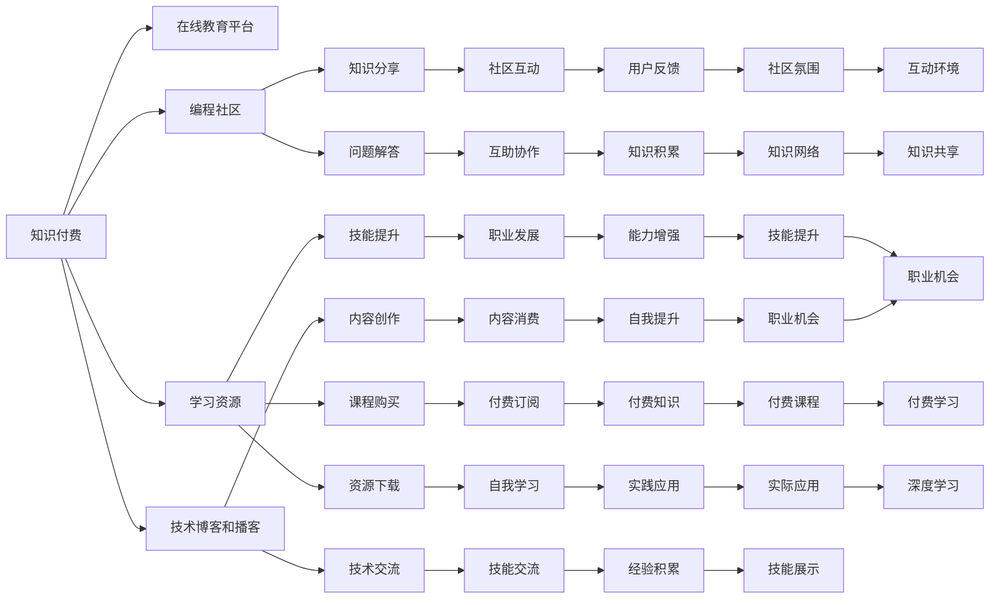

                 

# 知识付费时代程序员的机遇

## 1. 背景介绍

随着信息爆炸和互联网技术的普及，知识付费已成为一种重要的内容消费模式，特别是在程序员群体中，知识付费的需求尤为显著。编程技术的日新月异，新工具、新框架层出不穷，程序员需要不断学习新知识才能保持竞争力。而知识付费提供了一种高效、便捷的学习方式，通过购买课程、订阅技术博客、参加线上培训等形式，程序员可以随时随地获取优质学习资源。

本文章将探讨在知识付费时代，程序员如何利用这一趋势抓住机遇，提升自身技能和职业发展。

## 2. 核心概念与联系

### 2.1 核心概念概述

为了更好地理解知识付费时代程序员的机遇，首先需要明确几个核心概念：

- **知识付费**：指的是通过付费方式获取知识和技能的教育模式，旨在快速提高个人或团队的专业技能。

- **程序员职业发展**：涉及程序员的职业规划、技能提升、市场趋势及个人品牌建设等方面的内容。

- **在线教育平台**：如Coursera、Udacity、edX等，提供各类计算机科学和技术课程。

- **编程社区**：如Stack Overflow、GitHub等，程序员可以在这些平台上分享知识、提问求助。

- **技术博客和播客**：如博客园、CSDN等，程序员可以发布技术文章、视频讲解。

- **学习资源**：如公开课、电子书、在线课程、视频教程等，帮助程序员提升技能。

这些核心概念相互关联，共同构成了知识付费时代程序员的学习和职业发展生态。

### 2.2 核心概念原理和架构的 Mermaid 流程图



该流程图展示了知识付费时代程序员利用各类资源和平台进行学习和发展的路径。

## 3. 核心算法原理 & 具体操作步骤

### 3.1 算法原理概述

在知识付费时代，程序员的职业发展主要依赖于高效的学习和资源整合。算法原理主要包括：

1. **信息检索算法**：帮助程序员从海量资源中快速找到合适的学习材料。
2. **推荐系统算法**：根据程序员的技能水平和偏好推荐合适的课程和资源。
3. **在线学习算法**：利用机器学习技术优化学习路径和效果。
4. **知识图谱构建**：构建程序员的知识图谱，帮助其系统化学习。

### 3.2 算法步骤详解

#### 3.2.1 信息检索算法

信息检索算法主要使用搜索引擎技术，根据程序员输入的关键词，匹配最相关的学习资源。

**步骤**：

1. **输入查询**：程序员输入想要学习的关键词，如“Python高级开发”。
2. **搜索匹配**：算法在数据库中检索相关的课程、博客、视频等资源。
3. **结果排序**：根据相关性、评论、评分等因素对搜索结果进行排序。
4. **展示结果**：将排好序的搜索结果展示给程序员。

**关键点**：
- **关键词提取**：使用NLP技术提取输入查询的关键词。
- **搜索结果评估**：利用TF-IDF、PageRank等算法评估搜索结果的相关性。
- **用户体验优化**：展示搜索结果时，加入预览功能、用户评价等。

#### 3.2.2 推荐系统算法

推荐系统算法使用协同过滤、内容推荐等技术，根据程序员的历史学习记录和偏好，推荐合适的课程和资源。

**步骤**：

1. **数据收集**：收集程序员的学习记录、评分、评价等数据。
2. **模型训练**：使用协同过滤、基于内容的推荐算法等训练推荐模型。
3. **推荐预测**：根据程序员的当前兴趣和历史行为，预测其可能感兴趣的课程和资源。
4. **结果反馈**：根据程序员的反馈，持续优化推荐算法。

**关键点**：
- **数据处理**：对数据进行清洗、归一化、特征工程等处理。
- **算法选择**：选择适当的推荐算法，如协同过滤、基于内容的推荐、矩阵分解等。
- **结果评估**：使用准确率、召回率、F1-score等指标评估推荐系统效果。

#### 3.2.3 在线学习算法

在线学习算法使用机器学习技术，根据程序员的学习行为和反馈，优化学习路径和效果。

**步骤**：

1. **数据收集**：收集程序员的学习行为数据，如学习时间、观看时长、互动次数等。
2. **模型训练**：使用监督学习、强化学习等方法训练在线学习模型。
3. **路径推荐**：根据程序员的学习进度和兴趣，推荐合适的学习路径。
4. **效果评估**：评估学习效果，如知识掌握程度、技能提升等。

**关键点**：
- **学习行为分析**：使用时序分析、聚类等技术分析学习行为。
- **模型优化**：根据学习效果调整模型参数，优化学习路径。
- **效果反馈**：根据学习效果，调整课程难度、节奏等，提升学习体验。

#### 3.2.4 知识图谱构建

知识图谱构建通过构建程序员的知识图谱，帮助其系统化学习。

**步骤**：

1. **知识抽取**：从学习资源中抽取知识实体和关系。
2. **图谱构建**：构建程序员的知识图谱，使用图数据库存储。
3. **图谱查询**：根据程序员的需求，查询相关知识节点。
4. **图谱扩展**：根据学习进度，扩展知识图谱。

**关键点**：
- **实体识别**：使用NLP技术抽取知识实体。
- **关系抽取**：利用知识抽取技术识别知识实体之间的关系。
- **图谱存储**：使用图数据库，如Neo4j、OrientDB等。
- **查询优化**：使用图查询语言，如Cypher、SQL等，优化查询效率。

### 3.3 算法优缺点

#### 3.3.1 优点

1. **高效学习**：信息检索和推荐算法能够帮助程序员快速找到适合的学习资源，节省时间。
2. **个性化推荐**：推荐系统能够根据程序员的兴趣和历史行为，提供个性化的课程和资源。
3. **系统化学习**：知识图谱构建能够帮助程序员系统化学习，形成知识体系。
4. **持续优化**：在线学习算法能够根据程序员的学习效果，持续优化学习路径。

#### 3.3.2 缺点

1. **数据隐私**：数据收集和处理过程中，需要保证程序员的隐私安全。
2. **算法复杂性**：信息检索、推荐、知识图谱构建等算法实现复杂，需要较高的技术门槛。
3. **学习效果差异**：不同程序员的学习效果可能差异较大，需要个性化调整算法。

### 3.4 算法应用领域

1. **在线教育平台**：如Coursera、Udacity等，使用推荐系统和知识图谱，提升课程推荐和学习效果。
2. **编程社区**：如Stack Overflow、GitHub等，使用在线学习算法，帮助程序员提升技能。
3. **技术博客和播客**：如博客园、CSDN等，使用信息检索算法，提供丰富的学习资源。
4. **学习资源提供商**：如Udemy、Pluralsight等，使用推荐系统，优化课程选择和学习路径。

## 4. 数学模型和公式 & 详细讲解 & 举例说明

### 4.1 数学模型构建

信息检索和推荐算法使用机器学习模型，通常采用以下数学模型：

1. **向量空间模型**：用于信息检索，将文本表示为向量，计算查询与文档之间的相似度。
2. **协同过滤模型**：用于推荐系统，通过计算用户和物品的相似度，推荐物品。
3. **深度学习模型**：用于在线学习，通过神经网络模型预测学习效果。

### 4.2 公式推导过程

#### 4.2.1 向量空间模型

**公式推导**：

- **文本表示**：使用TF-IDF等方法将文本表示为向量。
- **相似度计算**：使用余弦相似度计算查询与文档的相似度。

**数学公式**：
$$
\text{similarity}(q,d) = \frac{\text{dot product}(q,d)}{\|q\|\|d\|}
$$

#### 4.2.2 协同过滤模型

**公式推导**：

- **用户-物品矩阵**：构建用户和物品的协同过滤矩阵。
- **相似度计算**：计算用户和物品的相似度。
- **物品推荐**：根据相似度推荐物品。

**数学公式**：
$$
\text{similarity}(u,i) = \frac{A_{ui}}{\sqrt{S_u}\sqrt{S_i}}
$$
$$
\text{rank}(i) = \text{similarity}(u,i)
$$

#### 4.2.3 深度学习模型

**公式推导**：

- **前向传播**：将输入数据输入神经网络模型，得到预测结果。
- **损失函数**：定义预测结果与真实结果之间的损失函数。
- **反向传播**：根据损失函数计算梯度，更新模型参数。

**数学公式**：
$$
\text{output} = \text{forward propagation}(x)
$$
$$
\text{loss} = \text{mean square error}(\text{output},y)
$$
$$
\text{gradient} = \frac{\partial \text{loss}}{\partial \theta}
$$
$$
\text{update} = \text{gradient descent}(\theta)
$$

### 4.3 案例分析与讲解

#### 4.3.1 信息检索案例

某程序员需要学习“Python高级开发”相关知识，使用信息检索算法进行搜索。

**流程**：

1. **输入查询**：搜索“Python高级开发”。
2. **检索结果**：检索出相关的博客、课程、视频等资源。
3. **结果展示**：展示最相关的结果。

**案例分析**：
- **关键词提取**：提取“Python”、“高级开发”等关键词。
- **匹配算法**：使用TF-IDF算法计算搜索结果与查询的相似度。
- **结果排序**：按照相似度排序，展示最相关的资源。

#### 4.3.2 推荐系统案例

某程序员在Coursera上学习Python，使用推荐系统推荐其他课程。

**流程**：

1. **数据收集**：收集程序员的学习记录、评分、评价等数据。
2. **模型训练**：使用协同过滤算法训练推荐模型。
3. **推荐预测**：根据程序员的兴趣和历史行为，推荐Python相关课程。
4. **结果反馈**：根据程序员的反馈，调整推荐算法。

**案例分析**：
- **数据处理**：收集程序员的学习记录和评分。
- **模型训练**：使用协同过滤算法训练推荐模型。
- **推荐预测**：根据程序员的兴趣和历史行为，推荐Python相关课程。
- **结果反馈**：根据程序员的反馈，调整推荐算法。

#### 4.3.3 在线学习案例

某程序员学习Python课程，使用在线学习算法优化学习路径。

**流程**：

1. **数据收集**：收集程序员的学习行为数据，如学习时间、观看时长、互动次数等。
2. **模型训练**：使用监督学习算法训练在线学习模型。
3. **路径推荐**：根据程序员的学习进度和兴趣，推荐合适的学习路径。
4. **效果评估**：评估学习效果，如知识掌握程度、技能提升等。

**案例分析**：
- **数据收集**：收集程序员的学习行为数据。
- **模型训练**：使用监督学习算法训练在线学习模型。
- **路径推荐**：根据程序员的学习进度和兴趣，推荐合适的学习路径。
- **效果评估**：评估学习效果，调整学习路径。

## 5. 项目实践：代码实例和详细解释说明

### 5.1 开发环境搭建

使用Python进行在线学习算法开发，需要以下开发环境：

1. **安装Python**：下载并安装Python 3.x版本。
2. **安装依赖包**：使用pip安装必要的依赖包，如numpy、scikit-learn、tensorflow等。
3. **设置虚拟环境**：使用virtualenv或conda创建虚拟环境，避免环境冲突。
4. **安装IDE**：安装如PyCharm、Jupyter Notebook等开发工具。

### 5.2 源代码详细实现

以下是一个简单的在线学习算法示例，用于预测学习效果。

```python
import numpy as np
from sklearn.ensemble import RandomForestRegressor
from sklearn.metrics import mean_squared_error

# 模拟学习数据
X = np.array([[1, 2], [2, 3], [3, 4], [4, 5], [5, 6], [6, 7]])
y = np.array([0.9, 1.1, 1.2, 1.3, 1.4, 1.5])

# 构建随机森林回归模型
model = RandomForestRegressor(n_estimators=10, random_state=42)

# 训练模型
model.fit(X, y)

# 预测学习效果
X_test = np.array([[7, 8], [8, 9], [9, 10]])
y_pred = model.predict(X_test)

# 计算评估指标
mse = mean_squared_error(y_test=y_test, y_pred=y_pred)
print("Mean Squared Error: {:.2f}".format(mse))
```

### 5.3 代码解读与分析

**代码解读**：

1. **数据准备**：构建模拟学习数据X和y，分别表示学习时间和学习效果。
2. **模型构建**：使用随机森林回归模型构建在线学习模型。
3. **模型训练**：使用X和y训练模型。
4. **模型预测**：使用测试数据预测学习效果。
5. **评估指标**：计算预测结果与真实结果之间的均方误差。

**代码分析**：

1. **数据预处理**：学习数据需要经过预处理，如归一化、标准化等。
2. **模型选择**：选择适当的模型，如线性回归、随机森林等。
3. **模型训练**：根据训练数据，训练模型参数。
4. **模型评估**：使用评估指标，如均方误差、R²等，评估模型效果。
5. **模型优化**：根据评估结果，调整模型参数，优化学习路径。

## 6. 实际应用场景

### 6.1 在线教育平台

在线教育平台利用信息检索、推荐系统和在线学习算法，为程序员提供个性化学习服务。

**应用场景**：

1. **课程推荐**：根据程序员的技能水平和兴趣，推荐合适的课程。
2. **学习路径优化**：根据程序员的学习进度和效果，优化学习路径。
3. **学习效果评估**：评估学习效果，调整课程难度、节奏等。

**技术实现**：

1. **信息检索**：使用向量空间模型和TF-IDF算法，检索相关课程。
2. **推荐系统**：使用协同过滤算法和深度学习模型，推荐课程。
3. **在线学习**：使用监督学习算法，优化学习路径。

### 6.2 编程社区

编程社区利用在线学习算法和知识图谱，帮助程序员提升技能。

**应用场景**：

1. **技能提升**：根据程序员的学习记录和反馈，推荐合适的学习资源。
2. **问题解答**：利用知识图谱，提供问题的答案和解决方案。
3. **社区互动**：通过讨论和交流，提升程序员的技能水平。

**技术实现**：

1. **在线学习**：使用在线学习算法，推荐学习资源。
2. **知识图谱**：构建程序员的知识图谱，提供查询服务。
3. **社区互动**：利用社交网络技术，促进程序员之间的交流。

### 6.3 技术博客和播客

技术博客和播客利用信息检索算法和知识图谱，提供丰富的学习资源。

**应用场景**：

1. **资源推荐**：根据程序员的兴趣，推荐相关的博客和播客。
2. **内容创作**：提供高质量的技术文章和视频讲解。
3. **知识交流**：利用社区功能，促进程序员之间的知识交流。

**技术实现**：

1. **信息检索**：使用向量空间模型和TF-IDF算法，检索相关内容。
2. **知识图谱**：构建技术博客和播客的知识图谱，提供查询服务。
3. **内容创作**：提供丰富的技术文章和视频讲解。

### 6.4 未来应用展望

未来，知识付费时代将进一步普及，程序员将面临更多机遇和挑战。以下是对未来应用的展望：

1. **实时学习**：利用流数据处理技术，实现实时学习，提供即时反馈。
2. **个性化推荐**：使用深度学习算法，提供更加精准的个性化推荐。
3. **多模态学习**：结合图像、视频等多模态数据，提供更加丰富的学习体验。
4. **跨领域应用**：利用跨领域知识图谱，提供跨领域的学习资源。
5. **智能辅导**：利用AI技术，提供智能辅导和答疑服务。

## 7. 工具和资源推荐

### 7.1 学习资源推荐

1. **Coursera**：提供各类计算机科学和技术课程，覆盖广泛的主题。
2. **edX**：提供高质量的在线课程，涵盖从入门到高级的各类技术课程。
3. **Udacity**：提供实战导向的课程，强调项目实践。
4. **Udemy**：提供广泛的在线课程，覆盖编程、数据科学、人工智能等主题。
5. **Pluralsight**：提供企业级的在线课程，涵盖软件开发、数据科学、云计算等主题。

### 7.2 开发工具推荐

1. **PyCharm**：一款功能强大的Python IDE，支持代码编写、调试、测试等功能。
2. **Jupyter Notebook**：一款轻量级的交互式编程环境，支持Python、R等语言。
3. **GitHub**：一款代码托管平台，支持版本控制、协作开发等功能。
4. **Stack Overflow**：一款问答社区，程序员可以在此提问求助。
5. **TensorFlow**：一款开源的机器学习框架，支持深度学习和在线学习算法。

### 7.3 相关论文推荐

1. **"Machine Learning Yearning" by Andrew Ng**：介绍机器学习工程实践，涵盖在线学习算法等主题。
2. **"Recommender Systems Handbook"**：详细介绍协同过滤、基于内容的推荐算法等。
3. **"Deep Learning Specialization" by Andrew Ng on Coursera**：介绍深度学习算法和技术，涵盖在线学习算法等。
4. **"Information Retrieval: An Introduction" by Christopher D. Manning**：介绍信息检索算法和技术，涵盖向量空间模型等。
5. **"Knowledge Graphs: Concepts and Approaches" by Jihong Guo**：介绍知识图谱构建和技术，涵盖知识图谱查询等。

## 8. 总结：未来发展趋势与挑战

### 8.1 研究成果总结

在知识付费时代，程序员的职业发展主要依靠在线教育平台、编程社区、技术博客和播客等资源。通过信息检索、推荐系统、在线学习算法和知识图谱等技术，程序员能够高效地学习和提升技能。

### 8.2 未来发展趋势

1. **智能化**：未来在线教育平台将更加智能化，能够提供个性化学习路径和实时反馈。
2. **多模态**：利用多模态数据，提供更加丰富的学习体验。
3. **跨领域**：利用跨领域知识图谱，提供跨领域的学习资源。
4. **实时化**：利用流数据处理技术，实现实时学习。
5. **智能化辅导**：利用AI技术，提供智能辅导和答疑服务。

### 8.3 面临的挑战

1. **数据隐私**：需要保护程序员的隐私，防止数据泄露。
2. **算法复杂性**：信息检索、推荐、在线学习算法等实现复杂，需要较高的技术门槛。
3. **学习效果差异**：不同程序员的学习效果可能差异较大，需要个性化调整算法。

### 8.4 研究展望

未来研究需要在以下几个方向取得突破：

1. **隐私保护**：开发隐私保护算法，确保数据安全。
2. **算法优化**：优化信息检索、推荐、在线学习等算法，提高效率和准确性。
3. **多模态学习**：结合图像、视频等多模态数据，提供更加丰富的学习体验。
4. **跨领域应用**：利用跨领域知识图谱，提供跨领域的学习资源。

总之，知识付费时代为程序员提供了丰富的学习资源和职业发展机遇。通过合理利用这些资源和技术，程序员能够提升技能，抓住机遇，实现职业发展。未来，随着技术的不断进步，知识付费生态将更加丰富和智能化，为程序员提供更加优质的学习服务。

## 9. 附录：常见问题与解答

**Q1: 如何选择合适的在线学习平台？**

A: 选择在线学习平台需要考虑以下几个因素：

1. **课程质量**：选择提供高质量课程的平台，如Coursera、edX、Udacity等。
2. **课程实用性和前沿性**：选择课程内容实用性强、前沿性高的平台，如Pluralsight等。
3. **学习体验**：选择提供良好学习体验的平台，如Khan Academy、Coursera等。

**Q2: 如何高效利用在线学习资源？**

A: 高效利用在线学习资源需要以下几个步骤：

1. **制定学习计划**：根据自身职业发展需求，制定学习计划，有针对性地选择课程和资源。
2. **制定学习目标**：明确学习目标，如掌握某项技能、理解某个概念等。
3. **制定学习路径**：根据学习目标，选择适合的课程和资源，制定学习路径。
4. **持续学习**：保持持续学习的习惯，定期回顾和巩固所学知识。

**Q3: 如何避免知识付费中的陷阱？**

A: 避免知识付费中的陷阱需要以下几个策略：

1. **选择优质平台和课程**：选择有声誉的平台和课程，如Coursera、edX、Udemy等。
2. **充分调研**：在选择课程前，充分调研课程内容、教师资质、学习体验等。
3. **多样化学习**：不要单一依赖某个平台或课程，多渠道获取学习资源。
4. **积极反馈**：在学习过程中，积极参与社区互动，获取其他学员的反馈。

**Q4: 如何利用在线学习资源提升技能？**

A: 利用在线学习资源提升技能需要以下几个步骤：

1. **确定学习目标**：明确需要提升的技能，如Python编程、机器学习等。
2. **选择合适的课程**：根据自身技能水平和需求，选择适合的课程和资源。
3. **制定学习计划**：制定详细的学习计划，安排学习时间和进度。
4. **实践应用**：在学习过程中，积极实践，将所学知识应用到实际项目中。

**Q5: 如何平衡在线学习和日常工作？**

A: 平衡在线学习和日常工作需要以下几个策略：

1. **时间管理**：合理安排时间，利用零碎时间学习。
2. **优先级管理**：优先处理重要任务，合理规划学习时间和工作时间。
3. **团队协作**：与同事合作学习，共同提升技能。
4. **持续反馈**：在学习过程中，及时反馈，调整学习计划。

总之，知识付费时代为程序员提供了丰富的学习资源和职业发展机遇。通过合理利用这些资源和技术，程序员能够提升技能，抓住机遇，实现职业发展。未来，随着技术的不断进步，知识付费生态将更加丰富和智能化，为程序员提供更加优质的学习服务。

---

作者：禅与计算机程序设计艺术 / Zen and the Art of Computer Programming

