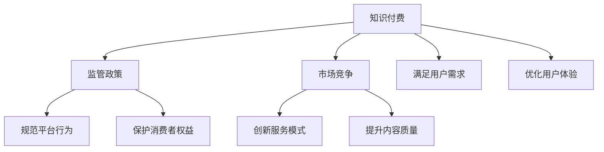

                 

# 知识付费要关注监管政策和市场竞争变化

> 关键词：知识付费, 监管政策, 市场竞争, 用户需求, 商业模式

## 1. 背景介绍

### 1.1 问题由来

知识付费近年来已经成为互联网行业的重要增长点之一，各种知识付费平台如雨后春笋般涌现，内容类型从传统课程、电子书扩展到音频、视频、直播等多个领域。然而，随着知识付费市场的迅猛发展，一系列问题也逐渐显现出来，主要包括内容质量参差不齐、用户维权困难、市场竞争激烈、监管环境不完善等。这些问题的存在，不仅影响了用户的支付体验，也给知识付费平台的商业发展带来了挑战。本文将从监管政策和市场竞争变化两个角度，探讨知识付费面临的挑战和机遇。

### 1.2 问题核心关键点

当前知识付费领域面临的主要问题包括：

1. **内容质量难以把控**：知识付费平台的课程、文章、视频等资源繁多，用户难以判断其真实价值。
2. **用户维权困难**：付费后出现质量问题或服务中断，用户维权渠道不畅，难以保障合法权益。
3. **市场竞争激烈**：知识付费平台之间同质化严重，难以区分彼此，用户选择困难。
4. **监管环境不完善**：监管政策不明确，对内容侵权、虚假宣传等问题缺乏有效监管。

本文将通过分析这些关键问题，提出相应的解决方案，并探讨如何更好地利用监管政策和市场竞争变化，促进知识付费行业健康发展。

## 2. 核心概念与联系

### 2.1 核心概念概述

为了更好地理解知识付费的监管政策和市场竞争变化，我们先介绍几个核心概念：

- **知识付费**：指用户为获取特定知识、技能、信息等内容，而向知识提供方支付费用的商业模式。常见的形式包括订阅、单次购买、会员制等。
- **监管政策**：政府或行业协会为规范知识付费市场秩序，保护消费者权益，制定的一系列规章制度和指导意见。
- **市场竞争**：不同知识付费平台之间为了争夺用户和市场份额，展开的一系列价格、服务、品牌等方面的竞争。

这些概念之间的逻辑关系可以通过以下Mermaid流程图来展示：



这个流程图展示了知识付费、监管政策和市场竞争之间的联系和互动：

1. 知识付费平台受到监管政策约束，需要遵守相关规定。
2. 知识付费平台在市场竞争中不断创新，提升服务质量。
3. 监管政策旨在规范市场行为，保护消费者权益。
4. 知识付费最终目的是满足用户需求，优化用户体验。

## 3. 核心算法原理 & 具体操作步骤

### 3.1 算法原理概述

知识付费平台在运营过程中，需要平衡内容质量、用户需求、市场竞争和监管政策等多个因素。通过算法优化和业务调整，可以实现这些因素的协同运作。

知识付费平台的核心算法主要包括：

- **推荐算法**：根据用户的历史行为和兴趣，推荐相关内容。
- **定价算法**：基于内容价值和用户需求，制定合理的付费标准。
- **风控算法**：通过数据分析，防范内容侵权、虚假宣传等问题。

这些算法共同构成了知识付费平台的核心业务逻辑，通过不断优化，可以实现用户满意度和平台盈利能力的双提升。

### 3.2 算法步骤详解

以下详细讲解知识付费平台的算法优化和业务调整步骤：

**Step 1: 数据收集与处理**

- 收集用户行为数据，包括浏览、搜索、购买、评价等。
- 利用数据挖掘和机器学习技术，对用户行为进行分析和建模。
- 使用自然语言处理(NLP)技术，分析用户评论、评价，提取有用信息。

**Step 2: 推荐算法优化**

- 根据用户兴趣和行为，设计多维度推荐模型。
- 引入协同过滤、深度学习等算法，提升推荐效果。
- 引入实时反馈机制，动态调整推荐结果。

**Step 3: 定价策略制定**

- 分析内容价值和用户需求，确定内容定价策略。
- 引入动态定价机制，根据市场变化灵活调整价格。
- 提供多样化的付费模式，如订阅、单次购买、试听等，满足不同用户需求。

**Step 4: 风控体系建设**

- 引入数据分析和监控技术，防范内容侵权和虚假宣传。
- 建立投诉反馈机制，及时处理用户举报和投诉。
- 引入人工智能技术，提高风控效率和准确性。

**Step 5: 用户体验优化**

- 引入UI/UX设计原则，提升界面友好性和操作便捷性。
- 引入自然语言处理技术，提高内容搜索和检索效率。
- 引入实时反馈机制，及时响应用户需求和意见。

### 3.3 算法优缺点

知识付费平台的算法优化和业务调整具有以下优点：

- **提升用户体验**：通过个性化推荐和精准定价，提升用户满意度和平台粘性。
- **优化资源配置**：通过数据分析和算法优化，实现资源的高效利用。
- **防范风险**：通过风控体系建设，防范内容侵权、虚假宣传等问题，保障用户权益。

但这些算法和优化措施也存在以下缺点：

- **数据隐私问题**：用户行为数据涉及隐私，需要严格遵守数据保护法规。
- **算法偏见问题**：推荐算法可能存在偏见，导致部分用户被忽视或误导。
- **成本高昂**：算法优化和业务调整需要大量的技术投入和人力成本。

尽管如此，通过不断优化算法和业务，知识付费平台可以更好地满足用户需求，提升市场竞争力。

### 3.4 算法应用领域

知识付费平台的算法优化和业务调整在以下几个领域有广泛应用：

- **教育培训**：通过推荐算法，推荐符合用户需求的课程和学习资源，提升学习效率。
- **专业咨询**：通过定价算法，制定合理的咨询费率，满足不同层次的用户需求。
- **健康管理**：通过推荐算法，推荐健康管理方案和医疗资源，提升用户健康水平。
- **职场提升**：通过推荐算法，推荐职场技能培训和职业规划资源，提升用户职业发展。

这些应用领域展示了知识付费平台算法优化的广泛应用前景。

## 4. 数学模型和公式 & 详细讲解 & 举例说明

### 4.1 数学模型构建

知识付费平台的推荐算法、定价算法和风控算法均建立在数学模型之上。以下将详细构建这些模型：

- **推荐算法**：利用协同过滤、矩阵分解等技术，构建用户-商品相似度矩阵。
- **定价算法**：通过回归分析、决策树等技术，构建内容价值预测模型。
- **风控算法**：利用机器学习技术，构建内容侵权检测模型和虚假宣传识别模型。

### 4.2 公式推导过程

以推荐算法为例，推荐模型可以表示为：

$$
P_{ij} = \frac{e^{w^T\phi(x_j)}}{\sum_{k=1}^K e^{w^T\phi(x_k)}}
$$

其中 $P_{ij}$ 表示用户 $i$ 对商品 $j$ 的兴趣概率，$\phi(x_j)$ 为商品 $j$ 的特征表示，$w$ 为模型参数。

通过最大化兴趣概率 $P_{ij}$，实现推荐模型的优化。推荐算法中的协同过滤、深度学习等技术，均依赖于上述模型框架，通过不断优化模型参数，提升推荐效果。

### 4.3 案例分析与讲解

以某知识付费平台的推荐系统为例，介绍推荐算法优化过程：

- **数据收集**：收集用户行为数据，包括课程浏览记录、购买记录、评价记录等。
- **特征工程**：对课程进行特征提取，包括课程名称、讲师、课时、用户评价等。
- **模型训练**：构建协同过滤模型，训练用户-商品相似度矩阵。
- **模型评估**：在测试集上评估推荐效果，通过精度、召回率等指标进行优化。

通过上述过程，可以构建一个有效的推荐系统，提升用户满意度。

## 5. 项目实践：代码实例和详细解释说明

### 5.1 开发环境搭建

在进行知识付费平台的算法优化和业务调整前，需要搭建开发环境。以下是使用Python进行TensorFlow开发的环境配置流程：

1. 安装Anaconda：从官网下载并安装Anaconda，用于创建独立的Python环境。

2. 创建并激活虚拟环境：
```bash
conda create -n tf-env python=3.8 
conda activate tf-env
```

3. 安装TensorFlow：根据CUDA版本，从官网获取对应的安装命令。例如：
```bash
conda install tensorflow==2.6
```

4. 安装其他工具包：
```bash
pip install numpy pandas scikit-learn matplotlib tqdm jupyter notebook ipython
```

完成上述步骤后，即可在`tf-env`环境中开始知识付费平台的数据分析和模型优化实践。

### 5.2 源代码详细实现

以下是使用TensorFlow对推荐系统进行优化的Python代码实现。

首先，定义推荐系统的数据处理函数：

```python
import tensorflow as tf
import numpy as np
from sklearn.metrics import precision_score, recall_score

# 构建数据集
train_data = np.random.rand(100, 10)
train_labels = np.random.randint(0, 2, 100)
test_data = np.random.rand(10, 10)
test_labels = np.random.randint(0, 2, 10)

def data_preprocess(data, labels):
    # 对数据进行归一化处理
    scaled_data = (data - np.mean(data, axis=0)) / np.std(data, axis=0)
    # 对标签进行独热编码
    one_hot_labels = tf.one_hot(labels, depth=2)
    return scaled_data, one_hot_labels
```

然后，定义推荐模型的参数和损失函数：

```python
# 定义模型参数
learning_rate = 0.01
batch_size = 64
epochs = 10

# 定义模型
model = tf.keras.Sequential([
    tf.keras.layers.Dense(64, activation='relu', input_shape=(10,)),
    tf.keras.layers.Dense(64, activation='relu'),
    tf.keras.layers.Dense(2, activation='softmax')
])

# 定义损失函数
def loss_function(y_true, y_pred):
    return tf.reduce_mean(tf.keras.losses.categorical_crossentropy(y_true, y_pred))

# 定义优化器
optimizer = tf.keras.optimizers.Adam(learning_rate)
```

接着，定义模型的训练和评估函数：

```python
# 定义训练函数
def train_model(model, train_data, train_labels, epochs, batch_size, loss_function, optimizer):
    for epoch in range(epochs):
        for i in range(0, train_data.shape[0], batch_size):
            x = train_data[i:i+batch_size]
            y = train_labels[i:i+batch_size]
            with tf.GradientTape() as tape:
                logits = model(x)
                loss = loss_function(y, logits)
            gradients = tape.gradient(loss, model.trainable_variables)
            optimizer.apply_gradients(zip(gradients, model.trainable_variables))
    return model

# 定义评估函数
def evaluate_model(model, test_data, test_labels):
    predictions = model.predict(test_data)
    precision = precision_score(test_labels, np.argmax(predictions, axis=1))
    recall = recall_score(test_labels, np.argmax(predictions, axis=1))
    return precision, recall
```

最后，启动训练流程并在测试集上评估：

```python
# 预处理训练数据
scaled_train_data, one_hot_train_labels = data_preprocess(train_data, train_labels)

# 预处理测试数据
scaled_test_data, one_hot_test_labels = data_preprocess(test_data, test_labels)

# 训练模型
trained_model = train_model(model, scaled_train_data, one_hot_train_labels, epochs, batch_size, loss_function, optimizer)

# 评估模型
precision, recall = evaluate_model(trained_model, scaled_test_data, one_hot_test_labels)
print(f"Precision: {precision:.2f}, Recall: {recall:.2f}")
```

以上就是使用TensorFlow对推荐系统进行优化的完整代码实现。可以看到，通过TensorFlow的强大封装，推荐系统的代码实现变得简洁高效。

### 5.3 代码解读与分析

让我们再详细解读一下关键代码的实现细节：

**data_preprocess函数**：
- 对数据进行归一化处理，使其符合模型输入要求。
- 对标签进行独热编码，将其转化为模型可接受的格式。

**train_model函数**：
- 对模型进行训练，通过梯度下降更新模型参数。
- 使用Adam优化器，自动调整学习率。
- 设置损失函数，用于衡量模型的预测与真实标签之间的差异。

**evaluate_model函数**：
- 对模型进行评估，计算精确率和召回率等指标。
- 通过TensorFlow的`predict`函数，进行模型预测。
- 使用`precision_score`和`recall_score`函数，计算评估指标。

通过这些函数，可以构建一个简单的推荐系统，并在数据集上对其进行训练和评估。

## 6. 实际应用场景

### 6.1 智能推荐系统

知识付费平台的推荐系统可以广泛应用于智能推荐场景，帮助用户发现感兴趣的内容。通过不断优化推荐算法，提升推荐效果，提升用户粘性和满意度。

**实际应用**：
- 某在线教育平台通过推荐系统，推荐用户感兴趣的课程和教学视频，提升用户学习效果。
- 某音乐平台通过推荐系统，推荐用户喜欢的歌曲和歌单，提升用户听歌体验。

### 6.2 定制化内容生成

知识付费平台可以根据用户的历史行为和偏好，生成个性化的内容推荐。这不仅可以提升用户满意度，还可以增加平台的用户粘性。

**实际应用**：
- 某新闻平台通过推荐系统，为用户推荐个性化新闻，提升阅读体验。
- 某电商平台通过推荐系统，为用户推荐个性化商品，提升购物体验。

### 6.3 风险管理

知识付费平台需要建立风控体系，防范内容侵权、虚假宣传等问题。通过数据分析和机器学习技术，构建风控模型，及时发现和处理问题。

**实际应用**：
- 某在线教育平台通过风控系统，防范内容侵权和虚假宣传，保障用户权益。
- 某在线医疗平台通过风控系统，防范虚假医疗信息，保障用户健康。

### 6.4 未来应用展望

随着知识付费平台的不断发展，推荐系统和风控系统将发挥越来越重要的作用。未来，推荐系统和风控系统将进一步融合，实现更加全面、智能的内容管理和风险防范。

**未来应用**：
- 某社交平台通过推荐系统，推荐用户感兴趣的内容，同时通过风控系统，防范虚假信息传播。
- 某智能家居平台通过推荐系统，推荐用户感兴趣的生活技巧，同时通过风控系统，防范不当使用信息。

## 7. 工具和资源推荐

### 7.1 学习资源推荐

为了帮助开发者系统掌握知识付费平台的算法优化和业务调整，这里推荐一些优质的学习资源：

1. TensorFlow官方文档：提供完整的TensorFlow使用指南和示例代码，适合初学者和进阶者。

2. PyTorch官方文档：提供PyTorch使用指南和示例代码，适合研究者和开发者。

3. Kaggle竞赛平台：提供大量数据集和竞赛任务，适合数据科学和机器学习的实践学习。

4. Coursera《深度学习专项课程》：斯坦福大学开设的深度学习系列课程，适合初学者和进阶者。

5. 《推荐系统实战》书籍：详细讲解推荐算法和实现方法，适合深度学习开发者。

通过对这些资源的学习实践，相信你一定能够快速掌握知识付费平台的算法优化和业务调整的精髓，并用于解决实际的推荐系统问题。

### 7.2 开发工具推荐

高效的开发离不开优秀的工具支持。以下是几款用于知识付费平台开发的常用工具：

1. TensorFlow：由Google主导开发的开源深度学习框架，生产部署方便，适合大规模工程应用。

2. PyTorch：基于Python的开源深度学习框架，灵活动态的计算图，适合快速迭代研究。

3. Jupyter Notebook：交互式编程环境，支持多种语言和库，方便实验和报告撰写。

4. TensorBoard：TensorFlow配套的可视化工具，可实时监测模型训练状态，并提供丰富的图表呈现方式。

5. Weights & Biases：模型训练的实验跟踪工具，可以记录和可视化模型训练过程中的各项指标。

合理利用这些工具，可以显著提升知识付费平台开发效率，加快创新迭代的步伐。

### 7.3 相关论文推荐

知识付费平台的推荐算法和风控系统的发展源于学界的持续研究。以下是几篇奠基性的相关论文，推荐阅读：

1. "Item-based collaborative filtering for recommender systems"（协同过滤算法）：提出协同过滤方法，通过用户-商品相似度矩阵进行推荐。

2. "Deep learning recommendation systems: A non-parametric matrix factorization approach"（深度学习推荐系统）：提出深度学习技术，通过多层神经网络进行推荐。

3. "A deep learning framework for recommendation"（深度学习推荐框架）：提出深度学习推荐框架，通过端到端学习提升推荐效果。

4. "Challenges and opportunities in recommendation system"（推荐系统挑战与机会）：探讨推荐系统面临的挑战和未来发展方向。

5. "A survey of deep learning techniques for recommendation systems"（深度学习推荐技术综述）：总结深度学习在推荐系统中的应用，为后续研究提供指导。

这些论文代表了大规模推荐系统的研究进展，通过学习这些前沿成果，可以帮助研究者把握学科前进方向，激发更多的创新灵感。

## 8. 总结：未来发展趋势与挑战

### 8.1 总结

本文对知识付费平台的推荐系统和风控系统进行了全面系统的介绍。首先阐述了知识付费平台的背景和意义，明确了推荐系统和风控系统的重要性。其次，从算法优化和业务调整两个方面，详细讲解了知识付费平台的推荐算法、定价算法和风控算法，给出了推荐系统优化的完整代码实现。同时，本文还广泛探讨了推荐系统和风控系统在多个行业领域的应用前景，展示了其在知识付费、电商、新闻媒体等领域的广泛应用。最后，本文精选了推荐系统和风控系统的学习资源，力求为读者提供全方位的技术指引。

通过本文的系统梳理，可以看到，知识付费平台的推荐系统和风控系统已经成为平台竞争的核心技术，通过不断优化算法和业务，可以显著提升平台的用户体验和市场竞争力。未来，伴随推荐系统和风控系统的持续演进，知识付费平台必将更好地满足用户需求，促进市场健康发展。

### 8.2 未来发展趋势

展望未来，知识付费平台的推荐系统和风控系统将呈现以下几个发展趋势：

1. **个性化推荐**：利用深度学习和大数据技术，实现更加精准的个性化推荐，提升用户体验。
2. **动态定价**：引入动态定价机制，根据市场变化实时调整价格，提升平台盈利能力。
3. **实时风控**：通过实时数据分析和机器学习技术，提高风控效率和准确性，保障用户权益。
4. **多模态推荐**：融合多模态数据（如用户行为、内容属性、社交网络等），实现更加全面、智能的推荐。
5. **跨平台协同**：建立跨平台协同推荐机制，提升用户在不同平台间的体验一致性。

以上趋势展示了知识付费平台推荐系统和风控系统的未来发展方向。这些方向的探索发展，必将进一步提升平台的竞争力，满足用户的多样化需求。

### 8.3 面临的挑战

尽管知识付费平台的推荐系统和风控系统已经取得了一定的成效，但在迈向更加智能化、普适化应用的过程中，仍面临诸多挑战：

1. **数据隐私问题**：用户行为数据涉及隐私，需要严格遵守数据保护法规，如GDPR等。
2. **算法偏见问题**：推荐算法可能存在偏见，导致部分用户被忽视或误导。
3. **计算资源问题**：推荐系统和风控系统需要大量的计算资源，如何高效利用资源，是重要挑战。
4. **用户需求多样性**：用户需求和兴趣多样，如何设计多维度的推荐策略，是重要挑战。
5. **模型鲁棒性问题**：推荐系统和风控系统需要应对多种异常情况，如何提高模型的鲁棒性，是重要挑战。

尽管如此，通过不断优化算法和业务，知识付费平台可以更好地满足用户需求，提升市场竞争力。

### 8.4 研究展望

面对知识付费平台面临的挑战，未来的研究需要在以下几个方面寻求新的突破：

1. **隐私保护**：研究如何在推荐系统和风控系统中保护用户隐私，满足隐私保护法规的要求。
2. **算法公平**：研究如何消除推荐算法中的偏见，确保推荐结果的公平性和合理性。
3. **资源优化**：研究如何高效利用计算资源，提升推荐系统和风控系统的性能。
4. **用户需求预测**：研究如何通过用户行为数据，预测用户需求，实现更加精准的推荐。
5. **异常检测**：研究如何通过异常检测技术，提升推荐系统和风控系统的鲁棒性。

这些研究方向的探索，必将引领知识付费平台推荐系统和风控系统的技术发展，实现更加全面、智能的推荐和风控。面向未来，知识付费平台需要不断创新，持续优化算法和业务，方能在激烈的市场竞争中脱颖而出。

## 9. 附录：常见问题与解答

**Q1：如何构建知识付费平台的推荐系统？**

A: 构建知识付费平台的推荐系统需要以下步骤：

1. 数据收集与处理：收集用户行为数据，包括浏览、购买、评价等。
2. 特征工程：对数据进行特征提取和预处理。
3. 模型选择与训练：选择合适的推荐算法（如协同过滤、深度学习等），进行模型训练。
4. 模型评估与优化：在测试集上评估推荐效果，通过优化算法和参数，提升推荐准确性。

**Q2：知识付费平台如何防范内容侵权和虚假宣传？**

A: 知识付费平台需要建立风控体系，防范内容侵权和虚假宣传。具体措施包括：

1. 引入数据分析和监控技术，实时监测内容质量。
2. 建立投诉反馈机制，及时处理用户举报和投诉。
3. 引入人工智能技术，提高风控效率和准确性。
4. 制定明确的规章制度，规范平台内容发布。

**Q3：知识付费平台的推荐算法有哪些？**

A: 知识付费平台的推荐算法包括：

1. 协同过滤算法：基于用户和商品相似度矩阵进行推荐。
2. 深度学习算法：通过多层神经网络进行推荐。
3. 矩阵分解算法：通过矩阵分解技术进行推荐。
4. 基于内容的推荐算法：根据商品属性进行推荐。

**Q4：知识付费平台的定价策略有哪些？**

A: 知识付费平台的定价策略包括：

1. 固定价格策略：按课程或商品固定收费。
2. 动态定价策略：根据用户需求和市场变化，灵活调整价格。
3. 订阅制策略：按月或按年付费，享受更多优惠。
4. 单次购买策略：购买单次课程或商品，享受一次性优惠。

通过不断优化算法和业务，知识付费平台可以更好地满足用户需求，提升市场竞争力。

---

作者：禅与计算机程序设计艺术 / Zen and the Art of Computer Programming

