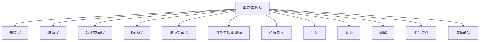

                 

# 知识付费要重视消费者权益保护和纠纷解决

## 1. 背景介绍

### 1.1 问题由来

随着互联网和移动设备的普及，知识付费平台如雨后春笋般涌现，为学习者提供便捷的在线教育资源。然而，消费者在享受知识付费服务的同时，也面临着诸多权益保护和纠纷解决的问题。

### 1.2 问题核心关键点

消费者在知识付费平台上的权益保护和纠纷解决，主要围绕以下几个关键点：

- 消费者权益保护：包括知情权、选择权、公平交易权、隐私权等基本权利。
- 消费者保护机制：如退换货政策、消费者投诉渠道、举报制度等。
- 纠纷解决机制：如仲裁、诉讼、调解等纠纷解决途径。
- 平台责任：平台对消费者权益的保护程度及其在纠纷解决中的作用。
- 监管政策：法律法规和行业规范对知识付费平台行为的约束。

这些核心关键点构成了知识付费领域消费者权益保护和纠纷解决的基础，需要各方共同努力来确保消费者权益不受侵害，及时、有效地解决纠纷。

## 2. 核心概念与联系

### 2.1 核心概念概述

为更好地理解知识付费中的消费者权益保护和纠纷解决机制，本节将介绍几个密切相关的核心概念：

- **消费者权益**：指消费者在购买和使用商品或服务过程中所享有的权利，包括但不限于知情权、选择权、公平交易权、隐私权等。
- **知情权**：消费者有权获得商品或服务真实、全面、准确的信息，以便做出明智选择。
- **选择权**：消费者有权自由选择商品或服务，不受任何形式的强制。
- **公平交易权**：消费者在交易过程中应享有平等的地位，不受到任何形式的不公平对待。
- **隐私权**：消费者在购买和使用知识付费服务时，其个人信息应得到妥善保护。
- **退换货政策**：规定消费者在特定条件下有权退换货，以保障消费者权益。
- **消费者投诉渠道**：提供便捷的投诉方式，帮助消费者解决纠纷。
- **举报制度**：消费者可以举报平台或商家违规行为，保障市场秩序。
- **仲裁**：通过第三方仲裁机构解决纠纷，减少诉讼成本。
- **诉讼**：通过法院解决纠纷，适用于金额较大或争议激烈的案件。
- **调解**：通过调解机构，以协商的方式解决纠纷，快速、低成本。
- **平台责任**：平台有责任保障消费者权益，提供安全、可靠的服务环境。
- **监管政策**：如《电子商务法》《消费者权益保护法》等法律法规，对知识付费平台的经营行为进行约束和规范。

这些核心概念之间的逻辑关系可以通过以下Mermaid流程图来展示：



这个流程图展示出消费者权益保护和纠纷解决的核心概念及其相互关系：

1. 消费者权益是保护和解决的基础。
2. 知情权、选择权、公平交易权、隐私权等具体权利是消费者权益的细化表现。
3. 退换货政策、消费者投诉渠道、举报制度等是保护消费者权益的机制。
4. 仲裁、诉讼、调解等纠纷解决途径是解决纠纷的手段。
5. 平台责任和监管政策为消费者权益保护和纠纷解决提供了制度保障。

这些概念共同构成了知识付费消费者权益保护和纠纷解决机制的基本框架，对维护消费者权益具有重要意义。

## 3. 核心算法原理 & 具体操作步骤

### 3.1 算法原理概述

知识付费平台消费者权益保护和纠纷解决的过程，本质上是一个多角色、多渠道、多层次的协同机制。其核心算法原理可以归纳为以下几个方面：

- **信息披露**：确保消费者获得充分、准确的产品信息，包括商品或服务的特性、价格、使用方法、风险提示等。
- **合同规范**：制定清晰的合同条款，明确双方的权利义务，保障消费者公平交易权。
- **客户服务**：提供及时、有效的客户服务，帮助消费者解决购买和使用中的问题。
- **争议解决**：建立完善的争议解决机制，如仲裁、诉讼、调解等，为消费者提供多样化的纠纷解决渠道。
- **隐私保护**：采取严格的数据保护措施，保障消费者个人信息的安全和隐私。

这些原理通过合理的算法步骤，转化为可操作的具体措施。

### 3.2 算法步骤详解

知识付费平台消费者权益保护和纠纷解决的算法步骤包括以下几个关键步骤：

**Step 1: 信息披露与合同规范**

- 平台提供详细的产品信息，包括商品或服务的规格、价格、使用说明等，确保消费者能够获得充分的信息。
- 制定公平、合理的合同条款，明确消费者的权利义务，避免不平等交易。
- 设计简洁明了的退换货政策，方便消费者操作。

**Step 2: 客户服务与反馈处理**

- 提供便捷的客户服务渠道，如在线客服、热线电话等，及时响应消费者咨询和投诉。
- 建立消费者反馈机制，定期收集消费者意见，优化服务体验。
- 对消费者投诉进行快速响应和处理，保障消费者权益。

**Step 3: 争议解决与纠纷调解**

- 设立专门的争议解决部门，负责处理消费者与商家之间的纠纷。
- 提供仲裁、诉讼、调解等多种争议解决途径，为消费者提供灵活的选择。
- 建立健全的投诉举报制度，保护消费者合法权益，打击不法行为。

**Step 4: 隐私保护与安全保障**

- 采用加密、匿名化等技术手段，保护消费者个人信息安全。
- 制定严格的数据使用和存储政策，确保数据不被滥用。
- 建立数据泄露应急响应机制，及时处理数据安全事件。

通过上述算法步骤，知识付费平台可以有效保障消费者权益，及时解决纠纷，营造良好的消费环境。

### 3.3 算法优缺点

基于信息披露、合同规范、客户服务、争议解决和隐私保护的多角色、多渠道、多层次协同机制，知识付费平台的消费者权益保护和纠纷解决算法具有以下优点：

- **全面性**：覆盖信息披露、合同规范、客户服务、争议解决和隐私保护等多个方面，保障消费者权益的全面性。
- **灵活性**：提供多样化的纠纷解决途径，满足不同消费者的需求。
- **及时性**：通过建立快速响应机制，及时处理消费者投诉和纠纷，减少纠纷处理的延误。
- **安全性**：采用严格的隐私保护措施，确保消费者个人信息的安全。

同时，该算法也存在一些局限性：

- **复杂性**：涉及多角色、多渠道、多层次的协同机制，管理复杂。
- **成本高**：如建立专业的争议解决团队和隐私保护体系，需要较高的成本投入。
- **适用性差**：对于小规模平台，可能无法实现全面的消费者权益保护和纠纷解决机制。

尽管存在这些局限性，但就目前而言，基于信息披露、合同规范、客户服务、争议解决和隐私保护的多角色、多渠道、多层次协同机制，仍是知识付费平台消费者权益保护和纠纷解决的主要范式。未来相关研究的重点在于如何进一步降低管理复杂性，降低成本，提高适用性，以更好地服务于消费者。

### 3.4 算法应用领域

知识付费平台的消费者权益保护和纠纷解决算法在以下领域具有广泛的应用：

- **在线教育**：保障学习者的知情权、选择权、公平交易权和隐私权。
- **职业培训**：为职场人士提供便捷、可靠的职业培训服务。
- **技术支持**：提供专业的技术支持和咨询服务。
- **法律顾问**：提供法律知识咨询和纠纷解决服务。
- **健康医疗**：提供健康咨询和疾病预防知识。
- **文化娱乐**：提供文化艺术教育和娱乐服务。

这些应用领域均涉及消费者权益保护和纠纷解决，知识付费平台通过算法手段，可以有效保障消费者权益，提高用户满意度。

## 4. 数学模型和公式 & 详细讲解 & 举例说明

### 4.1 数学模型构建

知识付费平台的消费者权益保护和纠纷解决算法可以构建为以下数学模型：

设消费者数量为 $N$，平台提供的商品或服务数量为 $M$，消费者对商品或服务的选择概率为 $p$，交易成功的概率为 $q$，纠纷发生概率为 $f$，纠纷解决的成功率为 $r$，隐私泄露的概率为 $p_{隐私}$，隐私泄露后平台的风险成本为 $C_{风险}$，隐私泄露后消费者的损失为 $C_{消费者}$。

定义消费者权益保护和纠纷解决的总效用为 $U$，则有：

$$
U = N \cdot p \cdot q - f \cdot r + p_{隐私} \cdot C_{风险} - p_{隐私} \cdot C_{消费者}
$$

### 4.2 公式推导过程

通过对上述模型的推导，可以得出以下结论：

1. **信息披露与合同规范**：保障消费者的知情权和公平交易权，可以增加 $p$ 和 $q$，提升总效用 $U$。
2. **客户服务与反馈处理**：提供及时响应和有效处理，可以降低 $f$，提升总效用 $U$。
3. **争议解决与纠纷调解**：建立完善的纠纷解决机制，可以提升 $r$，进一步提升总效用 $U$。
4. **隐私保护与安全保障**：采用严格的数据保护措施，可以降低 $p_{隐私}$ 和 $C_{风险}$，减少总效用 $U$ 的损失。

### 4.3 案例分析与讲解

假设某知识付费平台每月有 10 万用户，其中 90% 用户选择了平台提供的课程，成交率为 70%，纠纷发生率为 5%，隐私泄露概率为 2%，隐私泄露后平台风险成本为 1000 元，消费者损失为 500 元。根据上述模型，可以计算出总效用 $U$ 的值为：

$$
U = 100000 \cdot 0.9 \cdot 0.7 - 0.05 \cdot 0.9 \cdot 0.7 \cdot r + 0.02 \cdot 1000 - 0.02 \cdot 500
$$

假设平台建立了完善的纠纷解决机制，纠纷解决成功率为 80%，则有：

$$
U = 100000 \cdot 0.9 \cdot 0.7 - 0.05 \cdot 0.9 \cdot 0.7 \cdot 0.8 + 0.02 \cdot 1000 - 0.02 \cdot 500 \approx 119300
$$

若平台采用了严格的数据保护措施，隐私泄露概率降低至 1%，则有：

$$
U = 100000 \cdot 0.9 \cdot 0.7 - 0.05 \cdot 0.9 \cdot 0.7 \cdot 0.8 + 0.01 \cdot 1000 - 0.01 \cdot 500 \approx 119900
$$

通过上述案例，可以看出信息披露、合同规范、客户服务、争议解决和隐私保护在提升平台总效用中的重要作用。

## 5. 项目实践：代码实例和详细解释说明

### 5.1 开发环境搭建

在进行消费者权益保护和纠纷解决算法开发前，我们需要准备好开发环境。以下是使用Python进行Flask框架开发的环境配置流程：

1. 安装Python：确保Python版本为 3.7 及以上。
2. 安装Flask：使用pip命令安装Flask框架。
3. 安装相关库：安装requests、Flask-RESTful、Flask-SQLAlchemy等库，用于实现API接口和数据库操作。
4. 创建虚拟环境：使用virtualenv命令创建虚拟环境。
5. 激活虚拟环境：使用source命令激活虚拟环境。

完成上述步骤后，即可在虚拟环境中开始开发。

### 5.2 源代码详细实现

下面以知识付费平台中的投诉处理为例，给出使用Flask框架对消费者投诉处理模块的实现。

```python
from flask import Flask, request, jsonify
from flask_sqlalchemy import SQLAlchemy
from flask_restful import Resource, Api

app = Flask(__name__)
api = Api(app)
app.config['SQLALCHEMY_DATABASE_URI'] = 'sqlite:///example.db'
db = SQLAlchemy(app)

class Complaint(db.Model):
    id = db.Column(db.Integer, primary_key=True)
    user_id = db.Column(db.Integer, db.ForeignKey('user.id'))
    complaint_content = db.Column(db.String(500))
    status = db.Column(db.String(50))
    created_at = db.Column(db.DateTime, default=datetime.datetime.utcnow)

class ComplaintResource(Resource):
    def get(self, complaint_id):
        complaint = Complaint.query.filter_by(id=complaint_id).first()
        if not complaint:
            return jsonify({'message': 'Complaint not found'}), 404
        return jsonify({
            'id': complaint.id,
            'user_id': complaint.user_id,
            'complaint_content': complaint.complaint_content,
            'status': complaint.status,
            'created_at': complaint.created_at
        })

    def post(self):
        data = request.get_json()
        complaint = Complaint(
            complaint_content=data['content'],
            status='pending'
        )
        db.session.add(complaint)
        db.session.commit()
        return jsonify({'message': 'Complaint created'}), 201

complaints_endpoint = '/complaints'
api.add_resource(ComplaintResource, complaints_endpoint)

if __name__ == '__main__':
    app.run(debug=True)
```

### 5.3 代码解读与分析

让我们再详细解读一下关键代码的实现细节：

**Complaint类**：
- 定义了投诉数据的模型结构，包括ID、用户ID、投诉内容、状态、创建时间等字段。

**ComplaintResource类**：
- 定义了API接口的实现，包括查询和创建两个方法。
- 查询方法根据ID获取投诉详情，若未找到，返回404错误。
- 创建方法从请求数据中获取投诉内容，创建新的投诉记录，并返回201状态码。

**app.run()**：
- 启动Flask应用，设置debug模式为True，便于调试。

通过上述代码，我们可以看到Flask框架如何实现了一个简单的API接口，用于处理投诉请求。这个示例仅仅是投诉处理的冰山一角，实际应用中还需要考虑更多细节，如用户身份验证、投诉状态管理、投诉数据存储等。

## 6. 实际应用场景

### 6.1 智能客服系统

智能客服系统是知识付费平台的重要组成部分，通过算法手段，可以有效提升客服服务质量和效率。以下是智能客服系统的实际应用场景：

- **实时问答**：通过自然语言处理技术，智能客服系统能够实时回答用户问题，减轻人工客服的压力。
- **情感分析**：通过情感分析算法，识别用户情绪，提供相应的解决方案。
- **语音识别**：将用户的语音转换成文本，进行自动回复。
- **智能推荐**：根据用户历史行为和查询记录，智能推荐相关的课程或服务。

智能客服系统通过算法实现，能够在24小时不间断服务，提升用户满意度，减少客服成本。

### 6.2 内容推荐系统

内容推荐系统是知识付费平台的另一个重要模块，通过算法手段，能够为用户推荐个性化的课程和内容。以下是内容推荐系统的实际应用场景：

- **个性化推荐**：根据用户的浏览、购买记录，推荐符合其兴趣的课程。
- **实时更新**：根据最新的课程内容，动态调整推荐结果，保持推荐内容的时效性。
- **多模态融合**：将文本、图像、视频等多模态信息融合，提高推荐精度。

内容推荐系统通过算法实现，能够提升用户体验，增加平台的粘性。

### 6.3 安全监控系统

安全监控系统是知识付费平台的重要保障，通过算法手段，能够及时发现和应对潜在的安全风险。以下是安全监控系统的实际应用场景：

- **行为分析**：通过分析用户的登录、操作行为，识别异常行为。
- **欺诈检测**：通过检测异常交易，及时发现和阻止欺诈行为。
- **风险预警**：根据风险模型，对高风险交易进行预警。

安全监控系统通过算法实现，能够保障平台和用户的安全。

### 6.4 未来应用展望

随着人工智能技术的不断发展，知识付费平台的消费者权益保护和纠纷解决算法也将得到更广泛的应用。以下是未来应用的展望：

- **多模态融合**：将文本、图像、视频等多模态信息融合，提高推荐精度和用户体验。
- **深度学习应用**：利用深度学习算法，提升自然语言理解和生成能力，提升客服和推荐系统的智能化水平。
- **联邦学习**：利用联邦学习技术，保护用户隐私，提升平台的安全性。
- **跨平台整合**：将知识付费平台与其他在线服务平台整合，提供更全面的服务体验。

未来，知识付费平台将利用算法技术，不断提升服务质量，保障消费者权益，打造更智能、更安全的知识付费生态。

## 7. 工具和资源推荐

### 7.1 学习资源推荐

为了帮助开发者系统掌握消费者权益保护和纠纷解决的理论基础和实践技巧，这里推荐一些优质的学习资源：

1. 《消费者权益保护法》：详细解读消费者权益保护相关法律法规，明确消费者权利和商家义务。
2. 《电子商务法》：解读电子商务领域的消费者权益保护和纠纷解决机制。
3. 《合同法》：讲解合同规范和条款设计，保障消费者权益。
4. 《隐私保护条例》：解读隐私保护相关法律法规，保障用户隐私安全。
5. 《数据保护法》：讲解数据保护技术和管理措施，保障数据安全。
6. 《人工智能伦理》：探讨人工智能技术在消费者权益保护和纠纷解决中的应用。

通过对这些资源的学习实践，相信你一定能够快速掌握消费者权益保护和纠纷解决的精髓，并用于解决实际的消费者权益保护问题。

### 7.2 开发工具推荐

高效的开发离不开优秀的工具支持。以下是几款用于消费者权益保护和纠纷解决算法开发的常用工具：

1. Python：Python作为一门通用编程语言，适合快速迭代研究和开发。
2. Flask：轻量级的Web框架，适合开发API接口，实现用户管理、数据存储等功能。
3. SQLAlchemy：SQLAlchemy提供了ORM（对象关系映射）功能，方便数据库操作。
4. RESTful API：通过RESTful API接口，实现跨平台数据交互。
5. Git：版本控制系统，方便代码管理和协作。
6. Docker：容器化技术，方便部署和管理应用。

合理利用这些工具，可以显著提升消费者权益保护和纠纷解决算法开发的效率，加快创新迭代的步伐。

### 7.3 相关论文推荐

消费者权益保护和纠纷解决算法的研究源于学界的持续研究。以下是几篇奠基性的相关论文，推荐阅读：

1. "A Study on Consumer Rights Protection in the Digital Economy"：探讨数字经济中的消费者权益保护问题。
2. "E-Commerce Dispute Resolution Mechanisms"：分析电子商务领域的消费者纠纷解决机制。
3. "Algorithmic Justice in AI"：探讨人工智能在消费者权益保护中的应用和挑战。
4. "Data Privacy and Security in AI Systems"：研究AI系统中的数据隐私保护技术。
5. "Fine-Grained Prediction in AI"：探讨人工智能在消费者行为预测中的应用。

这些论文代表了大语言模型微调技术的发展脉络。通过学习这些前沿成果，可以帮助研究者把握学科前进方向，激发更多的创新灵感。

## 8. 总结：未来发展趋势与挑战

### 8.1 总结

本文对知识付费平台消费者权益保护和纠纷解决算法进行了全面系统的介绍。首先阐述了消费者权益保护和纠纷解决的背景和意义，明确了算法在保障消费者权益和解决纠纷中的核心作用。其次，从原理到实践，详细讲解了信息披露、合同规范、客户服务、争议解决和隐私保护的多角色、多渠道、多层次协同机制，给出了算法的详细步骤和实例。同时，本文还广泛探讨了智能客服、内容推荐、安全监控等实际应用场景，展示了算法的广泛应用前景。此外，本文精选了相关学习资源，力求为读者提供全方位的技术指引。

通过本文的系统梳理，可以看到，基于信息披露、合同规范、客户服务、争议解决和隐私保护的多角色、多渠道、多层次协同机制，消费者权益保护和纠纷解决算法在知识付费领域具有重要的应用价值。未来，伴随算法技术的不断演进，消费者权益保护和纠纷解决算法必将在更多领域得到应用，为消费者提供更安全、更公平、更高效的服务体验。

### 8.2 未来发展趋势

展望未来，消费者权益保护和纠纷解决算法将呈现以下几个发展趋势：

1. **多模态融合**：将文本、图像、视频等多模态信息融合，提升推荐精度和用户体验。
2. **深度学习应用**：利用深度学习算法，提升自然语言理解和生成能力，提升客服和推荐系统的智能化水平。
3. **联邦学习**：利用联邦学习技术，保护用户隐私，提升平台的安全性。
4. **跨平台整合**：将知识付费平台与其他在线服务平台整合，提供更全面的服务体验。
5. **智能化提升**：利用自然语言处理、机器学习等技术，提升算法的智能化水平，提供更个性化、更智能的服务。

以上趋势凸显了消费者权益保护和纠纷解决算法的广阔前景。这些方向的探索发展，必将进一步提升知识付费平台的性能和应用范围，为消费者提供更安全、更公平、更高效的服务体验。

### 8.3 面临的挑战

尽管消费者权益保护和纠纷解决算法已经取得了显著成效，但在迈向更加智能化、普适化应用的过程中，仍面临诸多挑战：

1. **数据隐私问题**：在数据采集和使用过程中，如何保护用户隐私，防止数据泄露。
2. **算法公平性**：如何保证算法在处理不同用户时，不出现偏见和歧视。
3. **法律合规性**：如何确保算法的应用符合法律法规，避免法律风险。
4. **模型鲁棒性**：如何提高算法的鲁棒性，避免模型在对抗攻击下的失效。
5. **用户接受度**：如何提高用户对算法的信任度，减少用户对算法决策的抵触。

尽管存在这些挑战，但通过不断的技术创新和制度完善，相信消费者权益保护和纠纷解决算法将不断进步，更好地服务于消费者。

### 8.4 研究展望

面对消费者权益保护和纠纷解决算法所面临的诸多挑战，未来的研究需要在以下几个方面寻求新的突破：

1. **隐私保护技术**：开发更高效、更安全的隐私保护技术，保障用户隐私。
2. **算法公平性**：研究公平算法，减少算法偏见和歧视，保障算法公正性。
3. **法律合规性**：建立算法的法律合规性评估体系，确保算法应用符合法律法规。
4. **模型鲁棒性**：研究鲁棒算法，增强模型对抗攻击的能力，提高模型鲁棒性。
5. **用户接受度**：通过透明化算法决策过程，增强用户对算法的信任。

这些研究方向的探索，必将引领消费者权益保护和纠纷解决算法迈向更高的台阶，为构建安全、可靠、公平的知识付费平台提供重要保障。面向未来，消费者权益保护和纠纷解决算法还需要与其他人工智能技术进行更深入的融合，如知识表示、因果推理、强化学习等，多路径协同发力，共同推动消费者权益保护和纠纷解决系统的进步。

## 9. 附录：常见问题与解答

**Q1：消费者权益保护和纠纷解决算法的核心原理是什么？**

A: 消费者权益保护和纠纷解决算法的核心原理是信息披露、合同规范、客户服务、争议解决和隐私保护的多角色、多渠道、多层次协同机制。通过保障消费者的知情权、选择权、公平交易权和隐私权，建立完善的投诉机制和纠纷解决机制，采用严格的数据保护措施，保障消费者的权益和数据安全。

**Q2：如何构建一个完善的投诉处理系统？**

A: 构建一个完善的投诉处理系统需要考虑以下几个关键因素：
1. 设计清晰的投诉处理流程，明确各角色职责。
2. 建立便捷的投诉渠道，方便用户提交投诉。
3. 设计高效的投诉处理机制，如自动分类、优先处理等。
4. 建立反馈机制，定期评估和优化投诉处理流程。
5. 建立数据分析系统，实时监控投诉处理情况。

**Q3：如何提高消费者的信任度？**

A: 提高消费者的信任度需要从以下几个方面入手：
1. 透明化算法决策过程，让消费者了解算法的运行机制。
2. 提高算法公平性，减少偏见和歧视。
3. 提供高质量的客户服务和产品，增强用户满意度和信任感。
4. 建立完善的隐私保护机制，保障用户数据安全。
5. 定期进行用户调研，了解用户需求和反馈，不断优化服务和算法。

通过这些措施，可以有效提升消费者的信任度，增加平台的用户粘性和忠诚度。

**Q4：如何处理算法偏见和歧视问题？**

A: 处理算法偏见和歧视问题需要从以下几个方面入手：
1. 在数据采集和处理过程中，确保数据的多样性和代表性。
2. 采用公平算法，减少算法偏见和歧视。
3. 定期进行模型评估，监测算法公平性。
4. 建立透明的监督机制，确保算法应用符合公平性要求。
5. 定期进行模型更新和优化，提升算法的公平性。

通过这些措施，可以有效减少算法偏见和歧视，保障算法公正性。

**Q5：如何保障算法的鲁棒性？**

A: 保障算法的鲁棒性需要从以下几个方面入手：
1. 在算法设计过程中，考虑算法的鲁棒性和抗攻击能力。
2. 在数据采集和处理过程中，确保数据的完整性和可靠性。
3. 定期进行模型评估，监测算法的鲁棒性。
4. 采用鲁棒算法，增强算法的鲁棒性。
5. 建立风险预警机制，及时发现和应对潜在的安全风险。

通过这些措施，可以有效提高算法的鲁棒性，保障系统的稳定性和安全性。

---

作者：禅与计算机程序设计艺术 / Zen and the Art of Computer Programming

