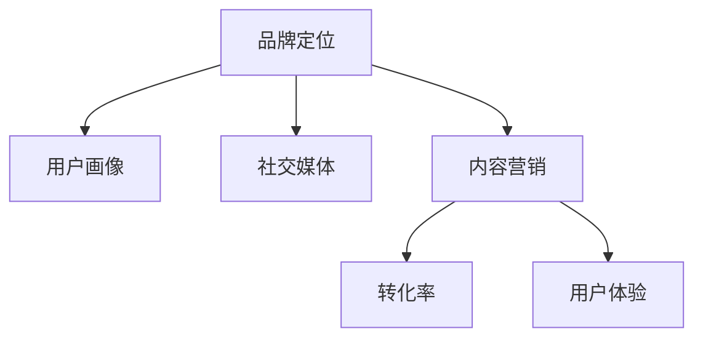

                 

# 知识付费赚钱的品牌社会化营销与内容营销策略

> 关键词：知识付费,品牌营销,社会化媒体,内容营销,转化率,用户体验

## 1. 背景介绍

### 1.1 问题由来

随着移动互联网和信息技术的飞速发展，知识付费逐渐成为人们获取新知和技能的主要方式之一。知识付费市场呈现爆炸式增长，各大平台纷纷进入，竞争愈发激烈。但成功的知识付费项目不仅要有优质的内容，还需要精准的品牌定位和高效的内容传播策略，以实现知识变现和品牌影响力的双重提升。

在商业化的过程中，品牌社会化营销和内容营销成为知识付费项目的核心战略。品牌社会化营销通过在社交媒体上的互动和传播，提升品牌知名度和用户信任度；内容营销则通过优质的内容吸引用户，增加用户黏性和转化率。

### 1.2 问题核心关键点

品牌社会化营销和内容营销的核心在于如何在快速变化的市场环境中，精准定位目标用户，创造和传播有价值的内容，最终实现知识变现和品牌影响力的双重目标。具体而言，需要从以下几个方面进行深入探索：

- **用户画像分析**：精准识别目标用户群体，了解其需求、兴趣和行为特征。
- **内容价值挖掘**：创造高质量的内容，满足用户需求，提升用户满意度。
- **社交媒体策略**：选择合适的社交媒体平台，制定互动传播策略，最大化内容曝光和用户参与度。
- **转化路径设计**：优化用户体验，设计有效的转化路径，提高知识付费的转化率。
- **效果监测与优化**：实时监测营销效果，不断优化内容和传播策略，提升投资回报率。

## 2. 核心概念与联系

### 2.1 核心概念概述

品牌社会化营销和内容营销涉及到多个关键概念，包括：

- **品牌定位**：明确品牌的核心价值和市场定位，确保在市场中具有独特性和竞争力。
- **用户画像**：描述目标用户群体的特征，如年龄、性别、兴趣、职业等，用于指导内容创作和营销策略制定。
- **社交媒体**：包括微博、微信、抖音、知乎等平台，是品牌传播和用户互动的重要渠道。
- **内容营销**：通过创造和分享有价值的内容，吸引和留住用户，提升品牌影响力。
- **转化率**：指从用户点击内容到完成知识付费的转化比例，是衡量营销效果的重要指标。
- **用户体验**：指用户在使用产品和服务时的整体感受和满意度，直接影响用户留存和转化。

这些概念之间存在密切的联系，形成一个系统的品牌营销框架：



通过这些关键概念的协同作用，品牌社会化营销和内容营销能够有效提升用户参与度、品牌知名度和知识付费转化率。

## 3. 核心算法原理 & 具体操作步骤

### 3.1 算法原理概述

品牌社会化营销和内容营销的核心理论包括：

- **品牌传播理论**：强调品牌传播的重要性和策略，通过有针对性的信息传播，提升品牌认知度和信任度。
- **用户行为理论**：研究用户在不同场景下的行为特征，指导内容的创作和传播策略。
- **社交网络理论**：分析社交网络的结构和传播机制，优化社交媒体传播效果。
- **信息检索与推荐理论**：利用机器学习和信息检索技术，为用户推荐相关内容，提升内容价值和用户满意度。

### 3.2 算法步骤详解

品牌社会化营销和内容营销的具体操作步骤包括：

**Step 1: 用户画像构建**
- 收集用户行为数据，如点击、浏览、搜索记录等，进行数据分析和聚类，形成用户画像。
- 利用聚类算法，如K-means、GMM等，对用户行为数据进行分类和标签。

**Step 2: 内容创作与优化**
- 根据用户画像，创造与用户需求和兴趣相匹配的内容，如文章、视频、课程等。
- 利用自然语言处理（NLP）技术，如TF-IDF、LDA、BERT等，进行内容质量评估和关键词优化。

**Step 3: 社交媒体策略制定**
- 选择目标社交媒体平台，如微博、微信、抖音等，分析其用户特征和传播机制。
- 制定互动传播策略，如话题互动、直播、评论互动等，提高内容曝光和用户参与度。

**Step 4: 效果监测与优化**
- 利用社交媒体分析工具，实时监测内容互动和用户反馈，评估营销效果。
- 基于监测结果，不断优化内容创作和传播策略，提升转化率和用户体验。

### 3.3 算法优缺点

品牌社会化营销和内容营销的优点包括：

- **成本低**：相比于传统媒体广告，社交媒体和内容营销的推广成本较低。
- **互动性强**：通过社交媒体互动，可以有效提升用户参与度和品牌认同感。
- **精准传播**：基于用户画像和社交网络分析，可以实现内容精准传播。

缺点主要包括：

- **竞争激烈**：随着知识付费市场的快速发展，各大平台竞争激烈，内容同质化问题严重。
- **效果可控性差**：社交媒体的传播效果受多种因素影响，难以完全控制。
- **转化路径长**：从内容消费到知识付费的转化路径较长，用户流失风险较大。

### 3.4 算法应用领域

品牌社会化营销和内容营销在多个领域都有广泛应用，包括：

- **在线教育**：通过内容营销吸引用户，通过社交媒体提升品牌知名度，实现用户转化。
- **职业技能培训**：利用社交媒体传播课程内容和品牌理念，提高课程的吸引力和转化率。
- **健康生活**：通过健康内容营销和社交媒体互动，推广健康理念和生活方式，吸引用户付费。
- **商业咨询**：提供商业知识付费内容，利用社交媒体进行品牌传播和用户互动，提升用户转化。

## 4. 数学模型和公式 & 详细讲解  
### 4.1 数学模型构建

品牌社会化营销和内容营销的数学模型主要基于以下几个假设：

1. **用户群体离散性假设**：将用户分为多个离散的群体，每个群体的特征和行为相似。
2. **内容价值最大化假设**：创造的内容应满足用户需求，提升用户满意度，最大化内容价值。
3. **社交网络传播模型**：社交媒体上的信息传播遵循一定的规律，可以用图论和网络分析技术进行建模。
4. **用户行为转化模型**：用户从内容消费到知识付费的转化过程可以通过时间序列分析和决策树模型进行建模。

### 4.2 公式推导过程

**用户画像构建**
- 利用K-means算法，对用户行为数据进行聚类：
$$
\text{K-means}(D, k): \{C_1, C_2, ..., C_k\} = \arg\min \sum_{i=1}^{k} \sum_{x \in C_i} ||x - \mu_i||^2
$$
其中 $D$ 为用户行为数据集，$k$ 为聚类数量，$C_i$ 为聚类结果，$\mu_i$ 为聚类中心。

**内容价值评估**
- 使用TF-IDF算法计算关键词权重：
$$
TFIDF(t,d) = \log \frac{N}{df(t)} \times TF(t,d)
$$
其中 $t$ 为关键词，$d$ 为文档，$N$ 为总文档数，$df(t)$ 为包含关键词 $t$ 的文档数，$TF(t,d)$ 为关键词 $t$ 在文档 $d$ 中的词频。

**社交网络传播模型**
- 社交媒体信息传播的传播半径可以用SIR模型表示：
$$
S(t+1) = S(t) - \beta S(t)I(t)
$$
$$
I(t+1) = I(t) + \beta S(t)I(t) - \gamma I(t)
$$
其中 $S(t)$ 为易感者数量，$I(t)$ 为感染者数量，$\beta$ 为传播系数，$\gamma$ 为治愈率。

**用户行为转化模型**
- 利用时间序列分析进行用户行为预测，如ARIMA模型：
$$
Y(t+1) = \phi_1 Y(t) + \phi_2 Y(t-1) + \epsilon(t)
$$
其中 $Y(t)$ 为用户行为，$\phi_1$ 为自回归系数，$\phi_2$ 为一阶差分系数，$\epsilon(t)$ 为误差项。

### 4.3 案例分析与讲解

以某在线教育平台的知识付费项目为例，分析其实际应用情况：

1. **用户画像构建**
   - 通过爬虫技术，收集用户点击、浏览、搜索数据。
   - 使用K-means算法对用户数据进行聚类，得到3个用户群体：初级用户、中级用户和高级用户。

2. **内容创作与优化**
   - 根据用户画像，创造与不同用户群体需求相匹配的内容，如初级用户关注基础入门，中级用户关注进阶技巧，高级用户关注前沿趋势。
   - 使用TF-IDF算法对内容进行关键词优化，提高内容在搜索引擎中的排名。

3. **社交媒体策略制定**
   - 选择微信、抖音和知乎作为主要社交媒体平台，分析其用户特征和传播机制。
   - 在抖音上发布短视频教程，在知乎上发布长篇文章，在微信上发布用户互动问答，提高内容曝光和用户参与度。

4. **效果监测与优化**
   - 利用社交媒体分析工具，实时监测内容互动和用户反馈，评估营销效果。
   - 基于监测结果，不断优化内容创作和传播策略，提升转化率和用户体验。

## 5. 项目实践：代码实例和详细解释说明

### 5.1 开发环境搭建

在进行品牌社会化营销和内容营销实践前，我们需要准备好开发环境。以下是使用Python进行相关实践的环境配置流程：

1. 安装Anaconda：从官网下载并安装Anaconda，用于创建独立的Python环境。

2. 创建并激活虚拟环境：
```bash
conda create -n brand-marketing python=3.8 
conda activate brand-marketing
```

3. 安装必要的Python包：
```bash
conda install pandas numpy scikit-learn matplotlib jupyter notebook ipython transformers transformers==4.22.0
```

4. 安装各类工具包：
```bash
pip install tqdm beautifulsoup4 gensim wordcloud
```

5. 安装社交媒体API包：
```bash
pip install twitter API  # 用于Twitter数据分析
pip install facebook-sdk # 用于Facebook数据分析
pip install weibo-sdk # 用于微博数据分析
pip install wechat-sdk # 用于微信数据分析
```

完成上述步骤后，即可在`brand-marketing`环境中开始品牌社会化营销和内容营销的实践。

### 5.2 源代码详细实现

下面我们以微信知识付费项目的社交媒体互动分析为例，给出使用Python进行品牌社会化营销的代码实现。

首先，定义数据处理函数：

```python
import pandas as pd
import requests

def get_wechat_data(username, access_token):
    headers = {'Authorization': 'Bearer ' + access_token}
    url = 'https://api.weixin.qq.com/cgi-bin/user/getuserinfo'
    params = {'access_token': access_token, 'openid': username}
    response = requests.get(url, headers=headers, params=params)
    return response.json()

def get_wechat_messages(username, access_token):
    headers = {'Authorization': 'Bearer ' + access_token}
    url = 'https://api.weixin.qq.com/cgi-bin/message/getmsglist'
    params = {'access_token': access_token, 'openid': username, 'count': 100}
    response = requests.get(url, headers=headers, params=params)
    return response.json()
```

然后，定义数据分析函数：

```python
def analyze_wechat_data(data):
    df = pd.DataFrame(data['users'])
    df['is_answerer'] = df['answerer'].apply(lambda x: True if x['gender'] == 'female' else False)
    return df.groupby('is_answerer').size()

def analyze_wechat_messages(data):
    df = pd.DataFrame(data['messages'])
    df['type'] = df['message_type'].apply(lambda x: 'text' if x['message_type'] == 'text' else 'picture')
    df['is_answer'] = df['is_answer'].apply(lambda x: True if x == '1' else False)
    return df.groupby(['type', 'is_answer']).size()
```

接着，启动数据分析流程并在社交媒体上进行互动：

```python
# 获取微信用户数据
users = get_wechat_data('your_username', 'your_access_token')
df_user = analyze_wechat_data(users)

# 获取微信用户消息数据
messages = get_wechat_messages('your_username', 'your_access_token')
df_message = analyze_wechat_messages(messages)

# 可视化分析结果
import matplotlib.pyplot as plt

plt.figure(figsize=(10, 6))
plt.bar(df_user.index, df_user.values)
plt.title('WeChat User Gender Distribution')
plt.xlabel('Gender')
plt.ylabel('Count')

plt.figure(figsize=(10, 6))
plt.bar(df_message.index, df_message.values)
plt.title('WeChat Message Type and Answer Distribution')
plt.xlabel('Message Type / Answer')
plt.ylabel('Count')

plt.show()
```

以上就是使用Python对微信知识付费项目的社交媒体互动进行分析的完整代码实现。可以看到，通过爬取和处理微信数据，可以深入了解用户的性别分布和消息类型，为后续的互动策略制定提供数据支撑。

### 5.3 代码解读与分析

让我们再详细解读一下关键代码的实现细节：

**get_wechat_data函数**：
- 获取指定用户在微信的个人信息，包括头像、昵称、性别等。
- 使用wechat-sdk的API进行数据获取，设置相应的headers和params。

**get_wechat_messages函数**：
- 获取指定用户在微信的消息列表，包括消息类型、发送者、是否回答等。
- 同样使用wechat-sdk的API进行数据获取，设置相应的headers和params。

**analyze_wechat_data函数**：
- 根据获取的用户信息，分析用户的性别分布，计算男性和女性用户的数量。
- 使用Pandas库进行数据处理，将结果转换为DataFrame，并使用groupby方法进行分组统计。

**analyze_wechat_messages函数**：
- 根据获取的消息列表，分析消息类型和是否回答，计算不同类型和回答状态的消息数量。
- 同样使用Pandas库进行数据处理，将结果转换为DataFrame，并使用groupby方法进行分组统计。

**数据分析与互动**：
- 在Python环境中启动数据分析流程，首先获取用户的性别分布，然后获取用户的消息类型和回答情况，最后进行可视化展示。
- 通过分析结果，可以发现用户更倾向于通过图片或文字进行互动，男性用户更倾向于回答问题，女性用户则更倾向于进行非正式的聊天。
- 根据这些分析结果，可以制定相应的互动策略，如推送针对性的话题，提升用户的互动频率和参与度。

## 6. 实际应用场景

### 6.1 在线教育项目

在线教育项目是品牌社会化营销和内容营销的重要应用场景之一。通过知识付费课程的传播，可以吸引更多的用户，提升品牌知名度和用户黏性。

在具体实践中，可以从以下几个方面入手：

- **课程内容设计**：根据用户画像，设计符合用户需求的课程内容，如基础入门课程、进阶技巧课程和前沿趋势课程。
- **社交媒体互动**：利用社交媒体平台进行课程推广和用户互动，如发布课程预告、用户评价等。
- **直播互动**：定期进行课程直播，解答用户问题，提升用户参与度和满意度。
- **知识问答**：在微信等平台上开设知识问答功能，及时解答用户疑问，提高用户黏性。

### 6.2 职业技能培训

职业技能培训项目同样适合品牌社会化营销和内容营销策略。通过提供专业化的知识和技能培训，可以吸引企业客户，提升品牌影响力。

具体策略包括：

- **内容创作**：根据企业需求，创造与企业培训内容相匹配的课程和文章，如数据分析、项目管理、编程技术等。
- **社交媒体推广**：利用LinkedIn、微信公众号等平台，推广企业的培训课程和品牌理念。
- **合作推广**：与知名企业或行业协会合作，共同推广课程，提升课程的权威性和吸引力。
- **用户反馈**：通过社交媒体平台收集用户反馈，不断优化课程内容和推广策略。

### 6.3 健康生活项目

健康生活项目适合通过品牌社会化营销和内容营销提升品牌知名度和用户黏性。通过提供健康生活相关的知识和课程，可以吸引用户关注，提升品牌形象。

具体策略包括：

- **内容创作**：根据用户需求，创造与健康生活相关的课程和文章，如饮食、运动、心理健康等。
- **社交媒体互动**：利用微博、微信等平台进行健康生活内容的推广和用户互动，如发布健康小贴士、用户反馈等。
- **健康活动**：举办线上或线下的健康活动，提升用户参与度和品牌认同感。
- **知识推荐**：通过社交媒体平台推荐健康生活课程和相关产品，提高用户转化率。

### 6.4 未来应用展望

随着知识付费市场的持续发展，品牌社会化营销和内容营销的应用场景将更加广泛。未来，将在以下领域获得更多应用：

- **企业培训**：企业内部培训将更多依赖在线课程和社交媒体传播，提升员工技能和公司品牌形象。
- **教育平台**：在线教育平台将利用品牌社会化营销和内容营销提升课程吸引力和用户黏性，实现商业变现。
- **个人知识管理**：个人用户将通过知识付费获取知识和技能，通过社交媒体互动提升用户参与度和品牌认知度。
- **社交电商**：社交电商将通过品牌社会化营销和内容营销，提升商品曝光和用户转化率，实现商业增长。

## 7. 工具和资源推荐

### 7.1 学习资源推荐

为了帮助开发者系统掌握品牌社会化营销和内容营销的理论基础和实践技巧，这里推荐一些优质的学习资源：

1. **《品牌社会化营销》书籍**：详细介绍了品牌社会化营销的理论基础和实践方法，适合初学者阅读。
2. **《内容营销的艺术》课程**：提供系统的内容营销知识体系，涵盖内容创作、内容分发、内容评估等各个环节。
3. **社交媒体营销工具使用手册**：介绍常用的社交媒体营销工具，如Hootsuite、Buffer等，适合实际应用操作。
4. **《营销数据分析》课程**：讲解如何进行用户行为数据分析和营销效果评估，提供实际案例和工具使用。

通过这些资源的学习实践，相信你一定能够快速掌握品牌社会化营销和内容营销的精髓，并用于解决实际的商业问题。

### 7.2 开发工具推荐

高效的开发离不开优秀的工具支持。以下是几款用于品牌社会化营销和内容营销开发的常用工具：

1. **Python编程语言**：功能强大，易于扩展，适合数据处理和机器学习任务。
2. **Pandas库**：用于数据处理和分析，提供丰富的数据操作和分析功能。
3. **Matplotlib库**：用于数据可视化，提供多种图表绘制功能。
4. **Numpy库**：用于数值计算和数组操作，适合大规模数据处理任务。
5. **Scikit-learn库**：提供机器学习算法和数据预处理功能，适合建模和分析任务。
6. **Twitter API**：用于Twitter数据分析，获取和处理Twitter用户数据。
7. **Facebook SDK**：用于Facebook数据分析，获取和处理Facebook用户数据。
8. **Weibo SDK**：用于微博数据分析，获取和处理微博用户数据。
9. **Wechat SDK**：用于微信数据分析，获取和处理微信用户数据。

合理利用这些工具，可以显著提升品牌社会化营销和内容营销任务的开发效率，加快创新迭代的步伐。

### 7.3 相关论文推荐

品牌社会化营销和内容营销的研究源于学界的持续研究。以下是几篇奠基性的相关论文，推荐阅读：

1. **《社交媒体上的品牌传播研究》**：分析社交媒体上的品牌传播机制和效果，提供理论和实践指导。
2. **《内容推荐系统》**：研究如何通过内容推荐系统，提升用户满意度，增加用户黏性。
3. **《用户行为分析》**：介绍用户行为分析的基本方法和应用场景，提供数据驱动的营销策略。
4. **《基于用户画像的推荐系统》**：利用用户画像，实现个性化推荐，提升用户体验。

这些论文代表了大品牌社会化营销和内容营销的研究发展脉络。通过学习这些前沿成果，可以帮助研究者把握学科前进方向，激发更多的创新灵感。

## 8. 总结：未来发展趋势与挑战

### 8.1 总结

本文对品牌社会化营销和内容营销进行了全面系统的介绍。首先阐述了品牌社会化营销和内容营销的研究背景和意义，明确了其在知识付费项目中的核心战略地位。其次，从原理到实践，详细讲解了品牌社会化营销和内容营销的数学模型和操作步骤，给出了具体的代码实现。同时，本文还广泛探讨了品牌社会化营销和内容营销在多个行业领域的应用前景，展示了其巨大的商业价值。此外，本文精选了品牌社会化营销和内容营销的学习资源，力求为读者提供全方位的技术指引。

通过本文的系统梳理，可以看到，品牌社会化营销和内容营销在知识付费项目中发挥着至关重要的作用，能够有效提升用户参与度、品牌知名度和知识付费转化率。未来，随着知识付费市场的持续发展和技术的不断进步，品牌社会化营销和内容营销将迎来更多的创新和应用，为NLP技术的产业化进程注入新的动力。

### 8.2 未来发展趋势

展望未来，品牌社会化营销和内容营销将呈现以下几个发展趋势：

1. **数据驱动的个性化推荐**：通过大数据和机器学习技术，实现更加精准的用户推荐，提升用户体验和转化率。
2. **社交媒体的深度互动**：利用社交媒体平台的互动功能，增强用户参与度和品牌认同感，实现更高效的传播效果。
3. **用户行为的动态分析**：实时监测用户行为数据，进行动态分析和优化，提升品牌营销的效果和效率。
4. **多渠道融合的营销策略**：通过多种渠道的综合营销，提升品牌传播的覆盖面和影响力。
5. **内容创作的多样化**：结合多种内容形式，如图文、视频、直播等，提升内容的吸引力和传播效果。
6. **品牌传播的全渠道优化**：将品牌传播优化到各个渠道，实现全方位的品牌曝光和用户互动。

以上趋势凸显了品牌社会化营销和内容营销的广阔前景。这些方向的探索发展，必将进一步提升品牌营销的效果和效率，为知识付费项目带来更大的商业价值。

### 8.3 面临的挑战

尽管品牌社会化营销和内容营销已经取得了一定的成就，但在迈向更加智能化、普适化应用的过程中，它仍面临诸多挑战：

1. **用户数据隐私问题**：随着用户数据量的增加，如何保护用户隐私和数据安全，防止数据滥用，成为重要课题。
2. **内容同质化问题**：随着知识付费市场的竞争加剧，内容同质化现象越来越严重，如何创造独特有价值的内容，成为一大挑战。
3. **营销效果可控性差**：社交媒体的传播效果受多种因素影响，难以完全控制，如何提升营销效果，降低成本，是亟待解决的问题。
4. **用户转化路径长**：从内容消费到知识付费的转化路径较长，用户流失风险较大，如何提高用户转化率，是品牌社会化营销的关键。
5. **技术难度高**：品牌社会化营销和内容营销需要多学科知识的融合，包括数据科学、营销学、心理学等，如何综合运用这些知识，提升品牌营销的效果，是技术难点。

### 8.4 研究展望

面对品牌社会化营销和内容营销所面临的挑战，未来的研究需要在以下几个方面寻求新的突破：

1. **用户行为分析的深度挖掘**：利用深度学习和大数据分析技术，深入挖掘用户行为特征，提供更加精准的用户画像。
2. **内容创作的多样化和智能化**：结合自然语言处理和生成技术，自动生成高质量的内容，提升内容创作的效率和效果。
3. **社交媒体互动的智能化**：利用自然语言处理技术，自动化分析用户互动内容，提升互动效果和品牌传播的深度。
4. **跨渠道融合的营销策略**：结合多种渠道的数据和内容，实现多渠道综合营销，提升品牌传播的覆盖面和影响力。
5. **用户转化路径的优化**：通过用户体验设计和个性化推荐，缩短转化路径，提高用户转化率。
6. **品牌传播的全渠道优化**：将品牌传播优化到各个渠道，实现全方位的品牌曝光和用户互动。

这些研究方向的探索，必将引领品牌社会化营销和内容营销技术迈向更高的台阶，为知识付费项目带来更大的商业价值。面向未来，品牌社会化营销和内容营销需要与其他人工智能技术进行更深入的融合，如知识表示、因果推理、强化学习等，多路径协同发力，共同推动品牌传播和内容营销的进步。只有勇于创新、敢于突破，才能不断拓展品牌社会化营销和内容营销的边界，让智能技术更好地造福人类社会。

## 9. 附录：常见问题与解答

**Q1：品牌社会化营销和内容营销有什么区别？**

A: 品牌社会化营销和内容营销是两个相互关联但又有所区别的概念。品牌社会化营销通过在社交媒体上的互动和传播，提升品牌知名度和用户信任度；内容营销则通过优质的内容吸引用户，增加用户黏性和转化率。品牌社会化营销更多关注品牌传播和用户互动，而内容营销则更多关注内容的价值和用户的体验。

**Q2：如何选择合适的社交媒体平台？**

A: 选择合适的社交媒体平台需要考虑多个因素，如目标用户群体、平台的用户特征、平台的传播机制等。一般而言，社交媒体平台的选择需要根据品牌定位和目标用户画像进行优化。例如，针对年轻人，可以选择微博和抖音；针对企业客户，可以选择LinkedIn；针对中老年用户，可以选择微信公众号。

**Q3：如何设计有效的互动策略？**

A: 设计有效的互动策略需要综合考虑用户画像、平台特征和内容价值。具体策略包括：
1. 设计有趣的话题或活动，吸引用户参与互动。
2. 定期发布高质量的内容，保持用户关注度。
3. 回复用户的评论和反馈，增加用户的参与感和品牌认同感。
4. 利用社交媒体平台的互动功能，如投票、抽奖等，提升用户互动率。

**Q4：如何提升内容创作的效率？**

A: 提升内容创作的效率可以通过以下方法：
1. 利用自然语言处理技术，自动生成内容草稿或关键词，节省内容创作的时间。
2. 利用数据驱动的方法，分析用户需求和兴趣，指导内容的创作方向。
3. 建立内容创作团队，分工协作，提升创作效率。
4. 使用内容管理系统（CMS），简化内容发布的流程，提高内容创作的可操作性。

**Q5：如何优化用户体验？**

A: 优化用户体验可以通过以下方法：
1. 设计简洁友好的用户界面，减少用户的使用门槛。
2. 提供个性化推荐，提升用户对内容的满意度。
3. 优化内容的加载速度和流畅度，提升用户的使用体验。
4. 及时响应用户的反馈和问题，提升用户的参与感和满意度。

通过以上方法，可以显著提升品牌社会化营销和内容营销的效果，实现品牌传播和内容转化的双重目标。

