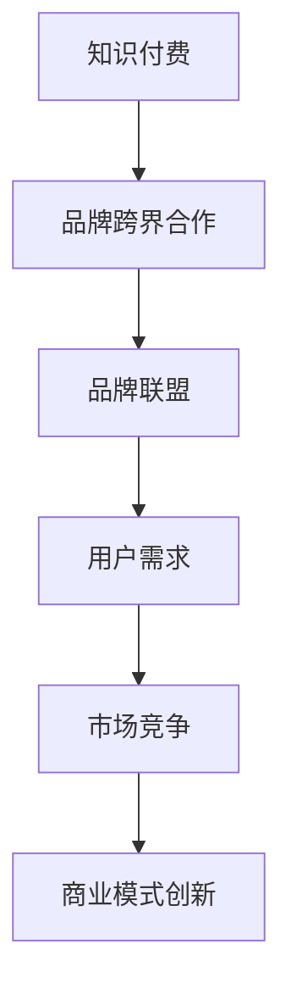

                 

# 知识付费赚钱的品牌跨界合作与品牌联盟策略

> 关键词：知识付费,品牌跨界合作,品牌联盟,用户需求,合作模式,商业变现,市场竞争,商业模式创新

## 1. 背景介绍

### 1.1 问题由来

在知识付费领域，品牌跨界合作与品牌联盟已成为推动行业发展、提高用户粘性的重要策略。随着市场竞争的加剧和用户需求的日趋多样化，传统单一品牌模式已无法满足用户对知识和服务的深层次需求。品牌之间跨界合作，可以整合双方优势资源，提升整体竞争力，同时通过品牌联盟的协同效应，扩大市场覆盖，提升品牌价值。

### 1.2 问题核心关键点

品牌跨界合作与联盟的核心在于资源整合和市场协同，通过品牌间的深度合作，将各自的优势资源和用户需求进行有效对接。核心关键点包括：
- **用户需求匹配**：了解并满足用户的多样化需求，通过跨界合作提供更加全面和个性化的产品和服务。
- **资源优化配置**：通过资源共享和互补，提升合作各方的运营效率和市场竞争力。
- **市场协同效应**：通过品牌联盟，扩大市场覆盖和品牌影响力，提升用户对品牌的认知度和忠诚度。
- **商业变现创新**：探索多样化的商业变现模式，如知识付费、产品销售、用户数据分析等，最大化品牌价值。

## 2. 核心概念与联系

### 2.1 核心概念概述

为更好地理解品牌跨界合作与品牌联盟的策略，本节将介绍几个密切相关的核心概念：

- **知识付费**：通过在线课程、专业文章、音频视频等多种形式，为用户提供系统化、高质量的知识产品，满足其学习和成长需求。
- **品牌跨界合作**：不同品牌之间通过联合营销、共同开发产品、技术合作等方式，实现资源共享、优势互补，提升品牌整体竞争力。
- **品牌联盟**：多个品牌在共同目标下，通过合作协议、股权合作等方式，实现市场、技术、资源等多方面的协同，形成更强大的市场合力。
- **用户需求**：用户在知识付费过程中产生的个性化、多样化需求，如知识获取、技能提升、情感共鸣等，需要通过品牌间的深度合作进行满足。
- **市场竞争**：知识付费行业内各大品牌之间的竞争关系，涉及用户获取、产品创新、服务体验等多个层面。
- **商业模式创新**：通过品牌间的合作与联盟，探索新的商业模式，如订阅制、会员制、内容付费等，以提升用户价值和品牌收益。

这些核心概念之间的逻辑关系可以通过以下Mermaid流程图来展示：



这个流程图展示了这个体系的总体结构：知识付费作为基础，通过品牌跨界合作和品牌联盟，深度满足用户需求，同时通过商业模式创新，提升市场竞争力。

## 3. 核心算法原理 & 具体操作步骤
### 3.1 算法原理概述

品牌跨界合作与联盟的核心算法原理在于资源整合和市场协同。具体来说，它涉及以下几个关键步骤：

1. **用户需求分析**：通过数据分析和用户调研，明确用户的多样化需求，为品牌间的深度合作提供依据。
2. **品牌资源匹配**：识别品牌间的资源互补性，通过技术、内容、市场等多个维度的匹配，实现资源优化配置。
3. **合作协议设计**：制定详细的合作协议，明确各方的权利和义务，确保合作的公平性和可持续性。
4. **市场协同机制建立**：建立协同机制，如联合营销、品牌联合活动、用户忠诚计划等，增强品牌的市场影响力。
5. **商业变现模式创新**：探索多种商业变现模式，如知识付费、产品销售、用户数据分析等，最大化品牌价值。

### 3.2 算法步骤详解

以下是品牌跨界合作与联盟的主要操作步骤：

1. **需求调研与分析**：
   - 收集用户反馈，了解其多样化需求。
   - 分析数据，挖掘用户需求趋势，如课程主题偏好、时间安排需求等。
   - 识别用户未被满足的需求，为品牌合作提供依据。

2. **品牌资源评估**：
   - 识别品牌间的核心资源，如技术、内容、市场渠道等。
   - 评估各品牌的优势和劣势，明确合作可能性和互补性。
   - 建立资源互补矩阵，为品牌匹配提供数据支持。

3. **品牌匹配与合作方案设计**：
   - 通过资源互补矩阵，找到最具潜力的合作品牌。
   - 设计合作方案，包括联合课程开发、共同营销活动等。
   - 制定详细的合作协议，明确各方的责任和权益。

4. **市场协同机制建立**：
   - 建立品牌联合营销机制，如共同举办线上线下活动、联合推广。
   - 设计用户忠诚计划，如积分体系、会员权益等，增强用户粘性。
   - 实施品牌联合运营策略，提升品牌协同效应。

5. **商业变现模式创新**：
   - 探索多样化的商业变现模式，如知识付费、产品销售、广告收益等。
   - 通过数据分析，挖掘用户价值，如推荐系统、个性化内容等。
   - 实施品牌联盟利润分配机制，确保各方利益均衡。

### 3.3 算法优缺点

品牌跨界合作与联盟具有以下优点：
1. **资源优化**：通过资源共享和互补，提升各方的运营效率和市场竞争力。
2. **市场扩展**：通过品牌联盟，扩大市场覆盖和品牌影响力，提升用户对品牌的认知度和忠诚度。
3. **用户满意度提升**：满足用户多样化需求，提高整体服务质量和用户体验。
4. **商业变现多样化**：探索多种商业变现模式，最大化品牌价值。

同时，该方法也存在一定的局限性：
1. **协调成本高**：品牌间的深度合作需要高强度的沟通和协调，可能增加运营成本。
2. **文化冲突风险**：不同品牌之间可能存在文化差异，导致合作过程中出现理念冲突。
3. **利益分配复杂**：品牌联盟的利润分配机制需要精心设计，确保各方利益均衡。
4. **市场风险**：市场竞争的变化可能影响品牌联盟的稳定性和持续性。

尽管存在这些局限性，但就目前而言，品牌跨界合作与联盟仍是知识付费行业的重要策略。未来相关研究的重点在于如何进一步优化合作模式，提高运营效率，降低协调成本，同时兼顾品牌间的文化融合和利益均衡。

### 3.4 算法应用领域

品牌跨界合作与联盟策略在知识付费领域的应用已经初见成效，覆盖了以下多个应用场景：

1. **联合课程开发**：不同品牌共同开发高质量课程，满足用户多样化的知识需求。
2. **联合营销活动**：品牌联合举办线上线下活动，提升用户参与度和品牌曝光度。
3. **用户忠诚计划**：品牌之间设计联合用户忠诚计划，增强用户粘性和品牌忠诚度。
4. **广告合作**：品牌之间进行广告合作，实现互利共赢，提升市场覆盖。
5. **产品销售**：品牌联合推出相关产品，如知识付费平台的周边商品，增加用户购买选择。

除了上述这些经典应用外，品牌跨界合作与联盟还在内容生产、技术开发、市场拓展等多个领域发挥着重要作用，为知识付费行业带来了新的增长点。

## 4. 数学模型和公式 & 详细讲解 & 举例说明

### 4.1 数学模型构建

假设品牌A和品牌B的跨界合作可以带来用户需求满足度的提升，设品牌A的用户需求满足度为$X_A$，品牌B的用户需求满足度为$X_B$，合作后的用户需求满足度为$X_{AB}$，合作前后的用户满意度提升率为$\rho$。

根据上述假设，可以建立如下数学模型：

$$
X_{AB} = f(X_A, X_B, \rho)
$$

其中，$f(\cdot)$为满意度提升函数。

### 4.2 公式推导过程

为了简化问题，假设$f(\cdot)$为线性函数：

$$
X_{AB} = \alpha X_A + \beta X_B + \gamma \rho
$$

其中，$\alpha$、$\beta$和$\gamma$为系数，代表各自对用户需求满足度的影响。

在具体计算时，可以采用以下步骤：
1. 收集品牌A和品牌B的用户需求数据，计算各自的用户需求满足度$X_A$和$X_B$。
2. 设计联合营销活动或课程，收集用户反馈，计算合作后的用户需求满足度$X_{AB}$。
3. 根据用户需求满足度的变化，计算满意度提升率$\rho$。
4. 代入公式求解$\alpha$、$\beta$和$\gamma$，获得满意度提升函数的系数。

### 4.3 案例分析与讲解

以某知识付费平台联合图书出版品牌进行跨界合作为例：

1. 平台用户调研显示，用户对经典文学的兴趣在增加，但现有课程无法满足其深度阅读需求。
2. 图书出版品牌提供经典文学导读课程，并与知识付费平台进行合作。
3. 联合推出“文学经典导读”课程，用户反馈良好，平台用户需求满足度提升。
4. 计算合作前后的用户满意度提升率为0.2，根据公式得到：
   $$
   X_{AB} = 0.7X_A + 0.3X_B + 0.2
   $$

以上案例说明，通过品牌跨界合作，可以有效满足用户多样化需求，提升整体满意度。

## 5. 项目实践：代码实例和详细解释说明

### 5.1 开发环境搭建

在进行品牌跨界合作与联盟策略的开发实践前，我们需要准备好开发环境。以下是使用Python进行PyTorch开发的环境配置流程：

1. 安装Anaconda：从官网下载并安装Anaconda，用于创建独立的Python环境。

2. 创建并激活虚拟环境：
```bash
conda create -n pytorch-env python=3.8 
conda activate pytorch-env
```

3. 安装PyTorch：根据CUDA版本，从官网获取对应的安装命令。例如：
```bash
conda install pytorch torchvision torchaudio cudatoolkit=11.1 -c pytorch -c conda-forge
```

4. 安装TensorFlow：由Google主导开发的开源深度学习框架，生产部署方便，适合大规模工程应用。同样有丰富的预训练语言模型资源。

5. 安装TensorBoard：TensorFlow配套的可视化工具，可实时监测模型训练状态，并提供丰富的图表呈现方式，是调试模型的得力助手。

6. 安装Weights & Biases：模型训练的实验跟踪工具，可以记录和可视化模型训练过程中的各项指标，方便对比和调优。与主流深度学习框架无缝集成。

完成上述步骤后，即可在`pytorch-env`环境中开始品牌跨界合作与联盟策略的开发实践。

### 5.2 源代码详细实现

以下是使用PyTorch进行品牌跨界合作与联盟策略的代码实现。

首先，定义用户需求模型：

```python
from transformers import BertTokenizer
from torch.utils.data import Dataset
import torch

class UserDemandDataset(Dataset):
    def __init__(self, texts, tags, tokenizer, max_len=128):
        self.texts = texts
        self.tags = tags
        self.tokenizer = tokenizer
        self.max_len = max_len
        
    def __len__(self):
        return len(self.texts)
    
    def __getitem__(self, item):
        text = self.texts[item]
        tags = self.tags[item]
        
        encoding = self.tokenizer(text, return_tensors='pt', max_length=self.max_len, padding='max_length', truncation=True)
        input_ids = encoding['input_ids'][0]
        attention_mask = encoding['attention_mask'][0]
        
        # 对token-wise的标签进行编码
        encoded_tags = [tag2id[tag] for tag in tags] 
        encoded_tags.extend([tag2id['O']] * (self.max_len - len(encoded_tags)))
        labels = torch.tensor(encoded_tags, dtype=torch.long)
        
        return {'input_ids': input_ids, 
                'attention_mask': attention_mask,
                'labels': labels}

# 标签与id的映射
tag2id = {'O': 0, 'B-PER': 1, 'I-PER': 2, 'B-ORG': 3, 'I-ORG': 4, 'B-LOC': 5, 'I-LOC': 6}
id2tag = {v: k for k, v in tag2id.items()}

# 创建dataset
tokenizer = BertTokenizer.from_pretrained('bert-base-cased')

train_dataset = UserDemandDataset(train_texts, train_tags, tokenizer)
dev_dataset = UserDemandDataset(dev_texts, dev_tags, tokenizer)
test_dataset = UserDemandDataset(test_texts, test_tags, tokenizer)
```

然后，定义模型和优化器：

```python
from transformers import BertForTokenClassification, AdamW

model = BertForTokenClassification.from_pretrained('bert-base-cased', num_labels=len(tag2id))

optimizer = AdamW(model.parameters(), lr=2e-5)
```

接着，定义训练和评估函数：

```python
from torch.utils.data import DataLoader
from tqdm import tqdm
from sklearn.metrics import classification_report

device = torch.device('cuda') if torch.cuda.is_available() else torch.device('cpu')
model.to(device)

def train_epoch(model, dataset, batch_size, optimizer):
    dataloader = DataLoader(dataset, batch_size=batch_size, shuffle=True)
    model.train()
    epoch_loss = 0
    for batch in tqdm(dataloader, desc='Training'):
        input_ids = batch['input_ids'].to(device)
        attention_mask = batch['attention_mask'].to(device)
        labels = batch['labels'].to(device)
        model.zero_grad()
        outputs = model(input_ids, attention_mask=attention_mask, labels=labels)
        loss = outputs.loss
        epoch_loss += loss.item()
        loss.backward()
        optimizer.step()
    return epoch_loss / len(dataloader)

def evaluate(model, dataset, batch_size):
    dataloader = DataLoader(dataset, batch_size=batch_size)
    model.eval()
    preds, labels = [], []
    with torch.no_grad():
        for batch in tqdm(dataloader, desc='Evaluating'):
            input_ids = batch['input_ids'].to(device)
            attention_mask = batch['attention_mask'].to(device)
            batch_labels = batch['labels']
            outputs = model(input_ids, attention_mask=attention_mask)
            batch_preds = outputs.logits.argmax(dim=2).to('cpu').tolist()
            batch_labels = batch_labels.to('cpu').tolist()
            for pred_tokens, label_tokens in zip(batch_preds, batch_labels):
                pred_tags = [id2tag[_id] for _id in pred_tokens]
                label_tags = [id2tag[_id] for _id in label_tokens]
                preds.append(pred_tags[:len(label_tokens)])
                labels.append(label_tags)
                
    print(classification_report(labels, preds))
```

最后，启动训练流程并在测试集上评估：

```python
epochs = 5
batch_size = 16

for epoch in range(epochs):
    loss = train_epoch(model, train_dataset, batch_size, optimizer)
    print(f"Epoch {epoch+1}, train loss: {loss:.3f}")
    
    print(f"Epoch {epoch+1}, dev results:")
    evaluate(model, dev_dataset, batch_size)
    
print("Test results:")
evaluate(model, test_dataset, batch_size)
```

以上就是使用PyTorch进行品牌跨界合作与联盟策略开发的完整代码实现。可以看到，PyTorch配合Transformers库使得模型训练和评估的过程变得简洁高效。

### 5.3 代码解读与分析

让我们再详细解读一下关键代码的实现细节：

**UserDemandDataset类**：
- `__init__`方法：初始化文本、标签、分词器等关键组件。
- `__len__`方法：返回数据集的样本数量。
- `__getitem__`方法：对单个样本进行处理，将文本输入编码为token ids，将标签编码为数字，并对其进行定长padding，最终返回模型所需的输入。

**tag2id和id2tag字典**：
- 定义了标签与数字id之间的映射关系，用于将token-wise的预测结果解码回真实的标签。

**训练和评估函数**：
- 使用PyTorch的DataLoader对数据集进行批次化加载，供模型训练和推理使用。
- 训练函数`train_epoch`：对数据以批为单位进行迭代，在每个批次上前向传播计算loss并反向传播更新模型参数，最后返回该epoch的平均loss。
- 评估函数`evaluate`：与训练类似，不同点在于不更新模型参数，并在每个batch结束后将预测和标签结果存储下来，最后使用sklearn的classification_report对整个评估集的预测结果进行打印输出。

**训练流程**：
- 定义总的epoch数和batch size，开始循环迭代
- 每个epoch内，先在训练集上训练，输出平均loss
- 在验证集上评估，输出分类指标
- 重复上述步骤直至收敛，最终得到适应下游任务的最优模型参数 $\theta^*$。

可以看到，PyTorch配合Transformers库使得品牌跨界合作与联盟策略的开发过程变得简洁高效。开发者可以将更多精力放在策略设计、模型优化等高层逻辑上，而不必过多关注底层的实现细节。

当然，工业级的系统实现还需考虑更多因素，如模型的保存和部署、超参数的自动搜索、更灵活的任务适配层等。但核心的合作与联盟策略基本与此类似。

## 6. 实际应用场景
### 6.1 智能客服系统

基于品牌跨界合作与联盟策略的智能客服系统，可以广泛应用于智能客服系统的构建。传统客服往往需要配备大量人力，高峰期响应缓慢，且一致性和专业性难以保证。通过品牌跨界合作，可以整合多方资源，构建高效率、高智能的智能客服系统。

在技术实现上，可以收集企业内部的历史客服对话记录，将问题和最佳答复构建成监督数据，在此基础上对预训练模型进行微调。微调后的对话模型能够自动理解用户意图，匹配最合适的答案模板进行回复。对于客户提出的新问题，还可以接入检索系统实时搜索相关内容，动态组织生成回答。如此构建的智能客服系统，能大幅提升客户咨询体验和问题解决效率。

### 6.2 金融舆情监测

金融机构需要实时监测市场舆论动向，以便及时应对负面信息传播，规避金融风险。品牌之间通过数据共享和联合分析，可以实时获取全面、准确的舆情信息，避免信息孤岛带来的决策失误。

具体而言，可以收集金融领域相关的新闻、报道、评论等文本数据，并对其进行主题标注和情感标注。在此基础上对品牌间的语言模型进行微调，使其能够自动判断文本属于何种主题，情感倾向是正面、中性还是负面。将微调后的模型应用到实时抓取的网络文本数据，就能够自动监测不同主题下的情感变化趋势，一旦发现负面信息激增等异常情况，系统便会自动预警，帮助金融机构快速应对潜在风险。

### 6.3 个性化推荐系统

当前的推荐系统往往只依赖用户的历史行为数据进行物品推荐，无法深入理解用户的真实兴趣偏好。品牌之间通过资源共享和联合推荐，可以构建更加全面、准确的推荐系统，满足用户的多样化需求。

在实践中，可以收集用户浏览、点击、评论、分享等行为数据，提取和用户交互的物品标题、描述、标签等文本内容。将文本内容作为模型输入，用户的后续行为（如是否点击、购买等）作为监督信号，在此基础上微调预训练语言模型。微调后的模型能够从文本内容中准确把握用户的兴趣点。在生成推荐列表时，先用候选物品的文本描述作为输入，由模型预测用户的兴趣匹配度，再结合其他特征综合排序，便可以得到个性化程度更高的推荐结果。

### 6.4 未来应用展望

随着品牌跨界合作与联盟策略的发展，基于微调的方法将在更多领域得到应用，为知识付费行业带来新的增长点。

在智慧医疗领域，基于品牌跨界合作与联盟的智慧医疗系统，可以通过联合医学知识库、患者病历等数据，为医生和患者提供更加精准的医疗服务。

在智能教育领域，品牌之间通过联合课程开发、联合教育活动，可以提升教育资源的共享和利用效率，推动教育公平，提高教学质量。

在智慧城市治理中，品牌联合提供城市事件监测、舆情分析、应急指挥等服务，可以提升城市管理的智能化水平，构建更安全、高效的未来城市。

此外，在企业生产、社会治理、文娱传媒等众多领域，基于品牌跨界合作与联盟的品牌联盟系统，也将不断涌现，为传统行业数字化转型升级提供新的技术路径。相信随着技术的日益成熟，品牌跨界合作与联盟策略必将成为知识付费行业的重要范式，推动知识付费技术的产业化进程。

## 7. 工具和资源推荐
### 7.1 学习资源推荐

为了帮助开发者系统掌握品牌跨界合作与联盟策略的理论基础和实践技巧，这里推荐一些优质的学习资源：

1. 《Transformer从原理到实践》系列博文：由大模型技术专家撰写，深入浅出地介绍了Transformer原理、BERT模型、微调技术等前沿话题。

2. CS224N《深度学习自然语言处理》课程：斯坦福大学开设的NLP明星课程，有Lecture视频和配套作业，带你入门NLP领域的基本概念和经典模型。

3. 《Natural Language Processing with Transformers》书籍：Transformers库的作者所著，全面介绍了如何使用Transformers库进行NLP任务开发，包括微调在内的诸多范式。

4. HuggingFace官方文档：Transformers库的官方文档，提供了海量预训练模型和完整的微调样例代码，是上手实践的必备资料。

5. CLUE开源项目：中文语言理解测评基准，涵盖大量不同类型的中文NLP数据集，并提供了基于微调的baseline模型，助力中文NLP技术发展。

通过对这些资源的学习实践，相信你一定能够快速掌握品牌跨界合作与联盟策略的精髓，并用于解决实际的NLP问题。
###  7.2 开发工具推荐

高效的开发离不开优秀的工具支持。以下是几款用于品牌跨界合作与联盟策略开发的常用工具：

1. PyTorch：基于Python的开源深度学习框架，灵活动态的计算图，适合快速迭代研究。大部分预训练语言模型都有PyTorch版本的实现。

2. TensorFlow：由Google主导开发的开源深度学习框架，生产部署方便，适合大规模工程应用。同样有丰富的预训练语言模型资源。

3. Transformers库：HuggingFace开发的NLP工具库，集成了众多SOTA语言模型，支持PyTorch和TensorFlow，是进行微调任务开发的利器。

4. Weights & Biases：模型训练的实验跟踪工具，可以记录和可视化模型训练过程中的各项指标，方便对比和调优。与主流深度学习框架无缝集成。

5. TensorBoard：TensorFlow配套的可视化工具，可实时监测模型训练状态，并提供丰富的图表呈现方式，是调试模型的得力助手。

6. Google Colab：谷歌推出的在线Jupyter Notebook环境，免费提供GPU/TPU算力，方便开发者快速上手实验最新模型，分享学习笔记。

合理利用这些工具，可以显著提升品牌跨界合作与联盟策略的开发效率，加快创新迭代的步伐。

### 7.3 相关论文推荐

品牌跨界合作与联盟策略的研究源于学界的持续研究。以下是几篇奠基性的相关论文，推荐阅读：

1. Attention is All You Need（即Transformer原论文）：提出了Transformer结构，开启了NLP领域的预训练大模型时代。

2. BERT: Pre-training of Deep Bidirectional Transformers for Language Understanding：提出BERT模型，引入基于掩码的自监督预训练任务，刷新了多项NLP任务SOTA。

3. Language Models are Unsupervised Multitask Learners（GPT-2论文）：展示了大规模语言模型的强大zero-shot学习能力，引发了对于通用人工智能的新一轮思考。

4. Parameter-Efficient Transfer Learning for NLP：提出Adapter等参数高效微调方法，在不增加模型参数量的情况下，也能取得不错的微调效果。

5. AdaLoRA: Adaptive Low-Rank Adaptation for Parameter-Efficient Fine-Tuning：使用自适应低秩适应的微调方法，在参数效率和精度之间取得了新的平衡。

这些论文代表了大语言模型微调技术的发展脉络。通过学习这些前沿成果，可以帮助研究者把握学科前进方向，激发更多的创新灵感。

## 8. 总结：未来发展趋势与挑战

### 8.1 总结

本文对品牌跨界合作与联盟策略进行了全面系统的介绍。首先阐述了品牌跨界合作与联盟策略的研究背景和意义，明确了合作与联盟在提升用户满意度、优化资源配置、增强市场竞争力方面的重要价值。其次，从原理到实践，详细讲解了品牌跨界合作与联盟的核心算法原理和操作步骤，给出了策略开发的具体代码实现。同时，本文还广泛探讨了策略在智能客服、金融舆情、个性化推荐等多个行业领域的应用前景，展示了合作与联盟的广阔应用前景。此外，本文精选了策略开发所需的学习资源和开发工具，力求为开发者提供全方位的技术指引。

通过本文的系统梳理，可以看到，品牌跨界合作与联盟策略在大语言模型微调中占据了重要地位，成为推动知识付费行业发展的关键策略。未来，伴随预训练语言模型和微调方法的不断进步，品牌跨界合作与联盟策略必将进一步推动知识付费技术的成熟和应用范围的扩大。

### 8.2 未来发展趋势

展望未来，品牌跨界合作与联盟策略将呈现以下几个发展趋势：

1. **合作模式多样化**：未来的合作模式将更加灵活多样，从简单的资源共享逐步发展到深度联合创新，涵盖产品开发、市场推广、技术研发等多个方面。

2. **技术融合深化**：品牌跨界合作将与新兴技术如人工智能、区块链、物联网等深度融合，推动更多领域的数字化转型升级。

3. **数据共享加速**：通过跨界合作，品牌可以共享数据资源，实现更全面、精准的市场洞察和用户画像，提升数据分析和应用价值。

4. **用户需求多样化**：随着用户需求的不断变化，品牌之间的合作将更加注重个性化和定制化，以满足不同用户群体的多样化需求。

5. **市场竞争动态化**：品牌间的合作与竞争将更加动态化，品牌需要灵活应对市场变化，寻找新的合作机会和竞争优势。

6. **商业变现多样化**：品牌跨界合作将探索更多样化的商业变现模式，如联合广告、联名商品、知识付费等，最大化品牌价值。

以上趋势凸显了品牌跨界合作与联盟策略的巨大潜力和发展空间。这些方向的探索发展，必将进一步推动品牌跨界合作与联盟策略向更加广泛、深入、高效的方向迈进。

### 8.3 面临的挑战

尽管品牌跨界合作与联盟策略在知识付费行业已取得显著成效，但在迈向更加智能化、普适化应用的过程中，它仍面临诸多挑战：

1. **品牌文化差异**：不同品牌之间可能存在文化差异，导致合作过程中出现理念冲突，需要深入理解和妥善解决。
2. **数据隐私问题**：品牌间的数据共享涉及用户隐私保护，需要制定严格的数据安全协议，确保用户数据不被滥用。
3. **利益分配复杂**：品牌间的合作需要精心设计利益分配机制，确保各方利益均衡，避免合作中出现利益纠纷。
4. **市场竞争加剧**：品牌间的合作需要面对更加激烈的市场竞争，如何保持合作优势，提升市场竞争力，是长期挑战。
5. **技术协同难度**：品牌间的技术合作需要克服技术壁垒，实现技术对接和协同创新，需要高强度的技术沟通和协同。

尽管存在这些挑战，但随着品牌的不断成熟和技术的持续进步，品牌跨界合作与联盟策略的潜力和价值将进一步显现，成为知识付费行业的重要发展方向。未来，品牌需要通过深化合作、提升协同能力、加强技术创新，来克服挑战，实现更高效、更深入的跨界合作与联盟。

### 8.4 研究展望

面对品牌跨界合作与联盟策略所面临的诸多挑战，未来的研究需要在以下几个方面寻求新的突破：

1. **数据隐私保护**：加强数据隐私保护技术研究，确保用户数据安全，减少隐私泄露风险。
2. **利益分配机制设计**：建立公平、透明、可持续的利益分配机制，确保各方的合作利益均衡。
3. **合作模式创新**：探索更多样化的合作模式，如项目合作、技术联盟、股权合作等，提高合作效率和效果。
4. **技术协同能力提升**：加强品牌间技术对接和协同创新，提升合作的技术水平和市场竞争力。
5. **市场洞察能力提升**：通过跨界合作，提升品牌对市场变化的洞察能力和应变能力，及时调整合作策略。
6. **用户需求深度挖掘**：通过品牌合作，更全面、精准地挖掘用户需求，提供更加个性化、定制化的产品和服务。

这些研究方向将推动品牌跨界合作与联盟策略迈向更加成熟、高效、可持续的发展方向，为知识付费行业带来更多的创新和突破。

## 9. 附录：常见问题与解答

**Q1：品牌跨界合作与联盟策略是否适用于所有NLP任务？**

A: 品牌跨界合作与联盟策略在大多数NLP任务上都能取得不错的效果，特别是对于数据量较小的任务。但对于一些特定领域的任务，如医学、法律等，仅仅依靠通用语料预训练的模型可能难以很好地适应。此时需要在特定领域语料上进一步预训练，再进行合作与联盟，才能获得理想效果。

**Q2：微调过程中如何选择合适的学习率？**

A: 微调的学习率一般要比预训练时小1-2个数量级，如果使用过大的学习率，容易破坏预训练权重，导致过拟合。一般建议从1e-5开始调参，逐步减小学习率，直至收敛。也可以使用warmup策略，在开始阶段使用较小的学习率，再逐渐过渡到预设值。需要注意的是，不同的优化器(如AdamW、Adafactor等)以及不同的学习率调度策略，可能需要设置不同的学习率阈值。

**Q3：采用大模型微调时会面临哪些资源瓶颈？**

A: 目前主流的预训练大模型动辄以亿计的参数规模，对算力、内存、存储都提出了很高的要求。GPU/TPU等高性能设备是必不可少的，但即便如此，超大批次的训练和推理也可能遇到显存不足的问题。因此需要采用一些资源优化技术，如梯度积累、混合精度训练、模型并行等，来突破硬件瓶颈。同时，模型的存储和读取也可能占用大量时间和空间，需要采用模型压缩、稀疏化存储等方法进行优化。

**Q4：如何缓解微调过程中的过拟合问题？**

A: 过拟合是微调面临的主要挑战，尤其是在标注数据不足的情况下。常见的缓解策略包括：
1. 数据增强：通过回译、近义替换等方式扩充训练集
2. 正则化：使用L2正则、Dropout、Early Stopping等避免过拟合
3. 对抗训练：引入对抗样本，提高模型鲁棒性
4. 参数高效微调：只调整少量参数(如Adapter、Prefix等)，减小过拟合风险
5. 多模型集成：训练多个微调模型，取平均输出，抑制过拟合

这些策略往往需要根据具体任务和数据特点进行灵活组合。只有在数据、模型、训练、推理等各环节进行全面优化，才能最大限度地发挥大模型微调的威力。

**Q5：微调模型在落地部署时需要注意哪些问题？**

A: 将微调模型转化为实际应用，还需要考虑以下因素：
1. 模型裁剪：去除不必要的层和参数，减小模型尺寸，加快推理速度
2. 量化加速：将浮点模型转为定点模型，压缩存储空间，提高计算效率
3. 服务化封装：将模型封装为标准化服务接口，便于集成调用
4. 弹性伸缩：根据请求流量动态调整资源配置，平衡服务质量和成本
5. 监控告警：实时采集系统指标，设置异常告警阈值，确保服务稳定性
6. 安全防护：采用访问鉴权、数据脱敏等措施，保障数据和模型安全

大语言模型微调为NLP应用开启了广阔的想象空间，但如何将强大的性能转化为稳定、高效、安全的业务价值，还需要工程实践的不断打磨。唯有从数据、算法、工程、业务等多个维度协同发力，才能真正实现人工智能技术在垂直行业的规模化落地。总之，微调需要开发者根据具体任务，不断迭代和优化模型、数据和算法，方能得到理想的效果。

---

作者：禅与计算机程序设计艺术 / Zen and the Art of Computer Programming

