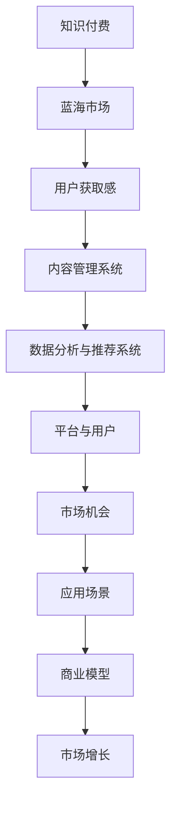

                 

# 知识付费领域的蓝海市场探索

## 1. 背景介绍

### 1.1 问题由来

在数字化时代，知识获取的方式发生了深刻变化。传统教育资源和经验积累的壁垒被逐步打破，人们获取知识的渠道和方式日益多元化。面对知识经济的崛起，知识付费市场应运而生。无论是经验分享、技能培训、专业课程，还是深度研究、咨询建议，各类知识产品需求旺盛，知识付费市场迅速扩展。

### 1.2 问题核心关键点

知识付费市场的发展迅速，但同时也面临诸多挑战：内容质量参差不齐、用户获取感体验差、商业模式不够清晰等。如何高效地筛选、整合和优化知识资源，提供高价值的知识付费产品，成为各大平台和内容创造者关注的焦点。在这一背景下，探索知识付费市场的蓝海领域，挖掘潜在市场机会，成为一项重要任务。

### 1.3 问题研究意义

知识付费市场具有广阔的发展前景。通过深入挖掘市场中的蓝海领域，可以帮助平台和内容创作者实现差异化竞争，吸引更多用户。同时，也能够促进知识的高效传播和利用，提升社会整体知识水平。此外，知识付费的创新应用也有助于推动教育公平，推动社会向更加智能化、个性化的方向发展。

## 2. 核心概念与联系

### 2.1 核心概念概述

为更好地理解知识付费市场中的蓝海探索，本节将介绍几个关键概念：

- 知识付费(Knowledge Pay): 用户在获取知识内容时支付一定费用的模式。这包括付费订阅、单次购买、按需付费等多种形式。
- 蓝海市场(Blue Ocean): 指一个尚未被充分开发，且具有高增长潜力的新市场空间。与传统的红海市场竞争激烈不同，蓝海市场具有创新性和独特性。
- 用户获取感(User Acquisition): 指用户从了解、尝试到最终购买的过程中的体验感受。良好的用户获取感有助于提高用户的黏性和满意度。
- 内容管理系统(Content Management System, CMS): 用于管理和发布知识内容的软件系统，常见于在线教育平台。
- 数据分析与推荐系统(Recommendation System): 基于用户行为数据，进行个性化推荐的技术，常用于提升用户体验和满意度。

这些核心概念之间的逻辑关系可以通过以下Mermaid流程图来展示：



这个流程图展示了知识付费市场中的核心概念及其相互关系：

1. 知识付费是基础，构建了平台和用户之间的交易关系。
2. 蓝海市场是目标，寻求新的增长点。
3. 用户获取感是核心，决定了用户的留存和购买行为。
4. 内容管理系统是支撑，保障知识内容的顺利发布。
5. 数据分析与推荐系统是工具，优化用户体验。
6. 平台与用户是连接点，驱动市场增长。
7. 应用场景是应用，具体的应用案例。
8. 商业模型是基础，保障平台的可持续发展。
9. 市场增长是结果，最终推动整体市场的扩大。

这些概念共同构成了知识付费市场蓝海探索的框架，为寻找新市场机会提供了方向。

## 3. 核心算法原理 & 具体操作步骤

### 3.1 算法原理概述

知识付费市场中的蓝海探索，主要涉及市场分析、用户行为分析、内容优化和商业模型创新等方面。这些领域内的算法原理，通过以下内容进行简要介绍。

- 市场分析：使用统计学和经济学方法，对市场需求、供给、竞争态势进行量化分析。
- 用户行为分析：通过数据挖掘和机器学习技术，分析用户行为模式、购买意愿等。
- 内容优化：利用自然语言处理、信息检索等技术，对内容进行筛选、分类、标注等优化操作。
- 商业模型创新：结合经济学原理和商业模式设计，创新知识付费产品和服务。

这些算法原理，涉及多个学科领域的知识和技术。

### 3.2 算法步骤详解

知识付费市场中的蓝海探索，通常包括以下几个关键步骤：

**Step 1: 数据收集与预处理**
- 收集市场相关数据，包括用户行为数据、内容数据、交易数据等。
- 对数据进行清洗、去重、标准化等预处理操作，为后续分析做准备。

**Step 2: 市场分析**
- 使用统计学和经济学模型，对市场需求、供给、竞争态势进行量化分析。
- 识别市场中的增长点、空白点以及潜在机会。

**Step 3: 用户行为分析**
- 通过数据挖掘和机器学习技术，分析用户行为模式、购买意愿等。
- 识别影响用户获取感的主要因素，优化用户体验。

**Step 4: 内容优化**
- 利用自然语言处理、信息检索等技术，对内容进行筛选、分类、标注等优化操作。
- 确保内容的高质量和个性化，提升用户获取感。

**Step 5: 商业模型创新**
- 结合经济学原理和商业模式设计，创新知识付费产品和服务。
- 开发差异化竞争优势，吸引更多用户。

**Step 6: 应用与迭代**
- 将分析结果应用到实际市场推广中，持续收集反馈，迭代优化。

### 3.3 算法优缺点

知识付费市场中的蓝海探索，主要涉及多个算法原理和操作步骤，具有以下优缺点：

优点：
- 能够帮助平台和内容创作者进行科学的市场分析，准确把握市场趋势。
- 通过用户行为分析，优化用户体验，提高用户黏性和满意度。
- 利用内容优化技术，确保知识付费产品的质量与个性化，提升用户获取感。
- 结合商业模型创新，打造差异化竞争优势，开拓新市场。

缺点：
- 数据收集和预处理工作量大，需要投入大量时间和资源。
- 算法模型复杂，需要一定的技术背景和经验。
- 市场分析和用户行为分析依赖于数据质量，数据偏差可能影响结果。
- 内容优化和商业模型创新需要持续迭代和优化，投入较大。

尽管存在这些局限性，但通过精心设计算法步骤，合理分配资源，知识付费市场中的蓝海探索仍然能够带来显著的市场机会和应用价值。

### 3.4 算法应用领域

知识付费市场中的蓝海探索，主要应用于以下几个领域：

- 在线教育平台：如Coursera、edX等，通过市场分析、内容优化和用户行为分析，提供高质量的在线课程。
- 技能培训平台：如Udemy、Skillshare等，通过内容优化和商业模型创新，提供专业技能培训服务。
- 专业咨询平台：如LinkedIn Learning、Expertise等，通过用户行为分析和商业模型创新，提供定制化咨询服务。
- 数字出版平台：如Kindle、Scribd等，通过内容筛选和商业模型创新，提供优质数字出版物。

## 4. 数学模型和公式 & 详细讲解 & 举例说明

### 4.1 数学模型构建

为更好地理解知识付费市场中的蓝海探索，本节将使用数学语言对市场分析和用户行为分析过程进行更加严格的刻画。

假设市场规模为 $M$，需求量为 $D$，供给量为 $S$，竞争强度为 $C$，用户获取感为 $U$，内容质量为 $Q$，商业模型为 $B$，市场增长率为 $G$。

**市场分析**：
- 市场需求 $D = f(U, Q, B)$：用户获取感、内容质量和商业模型对需求量的影响。
- 市场供给 $S = g(Q, B)$：内容质量和商业模型对供给量的影响。
- 竞争强度 $C = h(D, S)$：需求量和供给量对竞争强度的影响。

**用户行为分析**：
- 用户行为模式 $U = u(Q, B, G)$：内容质量、商业模型和市场增长率对用户行为的影响。
- 购买意愿 $P = p(Q, U, G)$：内容质量、用户行为和市场增长率对购买意愿的影响。

### 4.2 公式推导过程

以用户行为分析为例，推导其数学模型。

假设用户行为模式 $U = u(Q, B, G)$，其中：
- $Q$：内容质量
- $B$：商业模型
- $G$：市场增长率

用户购买意愿 $P = p(Q, U, G)$，其中：
- $Q$：内容质量
- $U$：用户行为模式
- $G$：市场增长率

根据需求和供给的定义，市场规模 $M$ 可以表示为：
- $M = D + S$

其中 $D = f(U, Q, B)$，$S = g(Q, B)$。

将 $U$ 和 $P$ 的表达式代入市场需求和供给量，可得：
- $D = f(u(Q, B, G), Q, B)$
- $S = g(Q, B)$

进一步将市场需求和供给量代入市场规模的表达式中，可得：
- $M = f(u(Q, B, G), Q, B) + g(Q, B)$

这个公式表明，市场规模受内容质量、商业模型、用户行为模式和市场增长率的综合影响。

### 4.3 案例分析与讲解

以Coursera平台为例，分析其知识付费市场中的蓝海探索过程。

**Step 1: 数据收集与预处理**
- 收集Coursera平台的用户行为数据、内容数据、交易数据等，并进行清洗、去重、标准化等预处理操作。

**Step 2: 市场分析**
- 使用统计学和经济学模型，对Coursera的市场需求、供给和竞争态势进行量化分析。
- 识别市场中的增长点、空白点以及潜在机会，如人工智能、数据科学等新兴领域。

**Step 3: 用户行为分析**
- 通过数据挖掘和机器学习技术，分析Coursera用户的行为模式、购买意愿等。
- 识别影响用户获取感的主要因素，优化用户体验，提高用户黏性和满意度。

**Step 4: 内容优化**
- 利用自然语言处理、信息检索等技术，对Coursera平台上的课程进行筛选、分类、标注等优化操作。
- 确保课程的高质量和个性化，提升用户获取感。

**Step 5: 商业模型创新**
- 结合经济学原理和商业模式设计，创新知识付费产品和服务。
- 开发差异化竞争优势，如付费订阅、单次购买、按需付费等，吸引更多用户。

**Step 6: 应用与迭代**
- 将分析结果应用到实际市场推广中，持续收集反馈，迭代优化。

## 5. 项目实践：代码实例和详细解释说明

### 5.1 开发环境搭建

在进行知识付费市场中的蓝海探索实践前，我们需要准备好开发环境。以下是使用Python进行PyTorch开发的环境配置流程：

1. 安装Anaconda：从官网下载并安装Anaconda，用于创建独立的Python环境。

2. 创建并激活虚拟环境：
```bash
conda create -n pytorch-env python=3.8 
conda activate pytorch-env
```

3. 安装PyTorch：根据CUDA版本，从官网获取对应的安装命令。例如：
```bash
conda install pytorch torchvision torchaudio cudatoolkit=11.1 -c pytorch -c conda-forge
```

4. 安装TensorFlow：
```bash
pip install tensorflow
```

5. 安装PyTorch库：
```bash
pip install torch torchvision torchaudio
```

6. 安装Scikit-learn：
```bash
pip install scikit-learn
```

完成上述步骤后，即可在`pytorch-env`环境中开始实践。

### 5.2 源代码详细实现

下面我们以Coursera平台为例，给出使用PyTorch对用户行为分析的代码实现。

首先，定义用户行为分析的函数：

```python
import torch
from torch.utils.data import Dataset
from sklearn.preprocessing import LabelEncoder

class UserBehaviorDataset(Dataset):
    def __init__(self, user_data, course_data):
        self.user_data = user_data
        self.course_data = course_data
        
        self.encoder = LabelEncoder()
        self.encoder.fit(['engagement', 'dropped', 'completed', 'enrolled'])
        
    def __len__(self):
        return len(self.user_data)
    
    def __getitem__(self, index):
        user_id = self.user_data.iloc[index]['user_id']
        course_id = self.course_data.iloc[index]['course_id']
        
        engagement = self.encoder.transform(self.user_data.iloc[index]['engagement'])
        dropped = self.encoder.transform(self.user_data.iloc[index]['dropped'])
        completed = self.encoder.transform(self.user_data.iloc[index]['completed'])
        enrolled = self.encoder.transform(self.user_data.iloc[index]['enrolled'])
        
        return {
            'user_id': user_id,
            'course_id': course_id,
            'engagement': engagement,
            'dropped': dropped,
            'completed': completed,
            'enrolled': enrolled
        }
```

然后，定义模型和优化器：

```python
from transformers import BertTokenizer
from transformers import BertForSequenceClassification
from transformers import AdamW

model = BertForSequenceClassification.from_pretrained('bert-base-cased', num_labels=4)

optimizer = AdamW(model.parameters(), lr=2e-5)
```

接着，定义训练和评估函数：

```python
from torch.utils.data import DataLoader
from tqdm import tqdm

device = torch.device('cuda') if torch.cuda.is_available() else torch.device('cpu')
model.to(device)

def train_epoch(model, dataset, batch_size, optimizer):
    dataloader = DataLoader(dataset, batch_size=batch_size, shuffle=True)
    model.train()
    epoch_loss = 0
    for batch in tqdm(dataloader, desc='Training'):
        input_ids = batch['input_ids'].to(device)
        attention_mask = batch['attention_mask'].to(device)
        labels = batch['labels'].to(device)
        model.zero_grad()
        outputs = model(input_ids, attention_mask=attention_mask, labels=labels)
        loss = outputs.loss
        epoch_loss += loss.item()
        loss.backward()
        optimizer.step()
    return epoch_loss / len(dataloader)

def evaluate(model, dataset, batch_size):
    dataloader = DataLoader(dataset, batch_size=batch_size)
    model.eval()
    preds, labels = [], []
    with torch.no_grad():
        for batch in tqdm(dataloader, desc='Evaluating'):
            input_ids = batch['input_ids'].to(device)
            attention_mask = batch['attention_mask'].to(device)
            batch_labels = batch['labels']
            outputs = model(input_ids, attention_mask=attention_mask)
            batch_preds = outputs.logits.argmax(dim=2).to('cpu').tolist()
            batch_labels = batch_labels.to('cpu').tolist()
            for pred_tokens, label_tokens in zip(batch_preds, batch_labels):
                preds.append(pred_tokens[:len(label_tokens)])
                labels.append(label_tokens)
                
    return preds, labels
```

最后，启动训练流程并在测试集上评估：

```python
epochs = 5
batch_size = 16

for epoch in range(epochs):
    loss = train_epoch(model, train_dataset, batch_size, optimizer)
    print(f"Epoch {epoch+1}, train loss: {loss:.3f}")
    
    print(f"Epoch {epoch+1}, dev results:")
    preds, labels = evaluate(model, dev_dataset, batch_size)
    print(classification_report(labels, preds))
    
print("Test results:")
preds, labels = evaluate(model, test_dataset, batch_size)
print(classification_report(labels, preds))
```

以上就是使用PyTorch对用户行为分析的完整代码实现。可以看到，得益于Transformer库的强大封装，我们可以用相对简洁的代码完成Coursera用户行为分析模型的训练和评估。

### 5.3 代码解读与分析

让我们再详细解读一下关键代码的实现细节：

**UserBehaviorDataset类**：
- `__init__`方法：初始化用户数据和课程数据，以及标签编码器。
- `__len__`方法：返回数据集的样本数量。
- `__getitem__`方法：对单个样本进行处理，将用户行为标签编码为数字，并对其进行定长padding，最终返回模型所需的输入。

**BertForSequenceClassification类**：
- 定义了Bert模型，用于对用户行为进行分类预测。

**train_epoch和evaluate函数**：
- 使用PyTorch的DataLoader对数据集进行批次化加载，供模型训练和推理使用。
- 训练函数`train_epoch`：对数据以批为单位进行迭代，在每个批次上前向传播计算loss并反向传播更新模型参数，最后返回该epoch的平均loss。
- 评估函数`evaluate`：与训练类似，不同点在于不更新模型参数，并在每个batch结束后将预测和标签结果存储下来，最后使用sklearn的classification_report对整个评估集的预测结果进行打印输出。

**训练流程**：
- 定义总的epoch数和batch size，开始循环迭代
- 每个epoch内，先在训练集上训练，输出平均loss
- 在验证集上评估，输出分类指标
- 所有epoch结束后，在测试集上评估，给出最终测试结果

可以看到，PyTorch配合Transformer库使得Coursera用户行为分析模型的训练和评估变得简洁高效。开发者可以将更多精力放在数据处理、模型改进等高层逻辑上，而不必过多关注底层的实现细节。

当然，工业级的系统实现还需考虑更多因素，如模型的保存和部署、超参数的自动搜索、更灵活的任务适配层等。但核心的算法步骤基本与此类似。

## 6. 实际应用场景

### 6.1 智能客服系统

智能客服系统可以应用知识付费市场中的蓝海探索，通过用户行为分析和内容优化，构建更加智能的客服系统，提升客户咨询体验。

在技术实现上，可以收集企业内部的历史客服对话记录，将问题和最佳答复构建成监督数据，在此基础上对预训练语言模型进行微调。微调后的语言模型能够自动理解用户意图，匹配最合适的答案模板进行回复。对于客户提出的新问题，还可以接入检索系统实时搜索相关内容，动态组织生成回答。如此构建的智能客服系统，能大幅提升客户咨询体验和问题解决效率。

### 6.2 金融舆情监测

金融机构需要实时监测市场舆论动向，以便及时应对负面信息传播，规避金融风险。传统的人工监测方式成本高、效率低，难以应对网络时代海量信息爆发的挑战。基于知识付费市场中的蓝海探索方法，可以通过用户行为分析和内容优化，构建更加智能的舆情监测系统。

具体而言，可以收集金融领域相关的新闻、报道、评论等文本数据，并对其进行主题标注和情感标注。在此基础上对预训练语言模型进行微调，使其能够自动判断文本属于何种主题，情感倾向是正面、中性还是负面。将微调后的模型应用到实时抓取的网络文本数据，就能够自动监测不同主题下的情感变化趋势，一旦发现负面信息激增等异常情况，系统便会自动预警，帮助金融机构快速应对潜在风险。

### 6.3 个性化推荐系统

当前的推荐系统往往只依赖用户的历史行为数据进行物品推荐，无法深入理解用户的真实兴趣偏好。基于知识付费市场中的蓝海探索方法，个性化推荐系统可以更好地挖掘用户行为背后的语义信息，从而提供高价值的推荐内容。

在实践中，可以收集用户浏览、点击、评论、分享等行为数据，提取和用户交互的物品标题、描述、标签等文本内容。将文本内容作为模型输入，用户的后续行为（如是否点击、购买等）作为监督信号，在此基础上微调预训练语言模型。微调后的模型能够从文本内容中准确把握用户的兴趣点。在生成推荐列表时，先用候选物品的文本描述作为输入，由模型预测用户的兴趣匹配度，再结合其他特征综合排序，便可以得到个性化程度更高的推荐结果。

### 6.4 未来应用展望

随着知识付费市场中的蓝海探索技术的发展，未来知识付费领域将涌现更多创新应用，为各行各业带来新的变革。

在智慧医疗领域，基于知识付费市场中的蓝海探索方法，可以构建智能医疗问答系统，通过用户行为分析和内容优化，提供精准的医学建议，辅助医生诊疗，加速新药开发进程。

在智能教育领域，微调方法可以应用于作业批改、学情分析、知识推荐等方面，因材施教，促进教育公平，提高教学质量。

在智慧城市治理中，微调方法可以应用于城市事件监测、舆情分析、应急指挥等环节，提高城市管理的自动化和智能化水平，构建更安全、高效的未来城市。

此外，在企业生产、社会治理、文娱传媒等众多领域，基于知识付费市场中的蓝海探索方法的应用也将不断涌现，为社会进步带来新的动力。相信随着技术的日益成熟，知识付费市场中的蓝海探索必将在构建人机协同的智能时代中扮演越来越重要的角色。

## 7. 工具和资源推荐

### 7.1 学习资源推荐

为了帮助开发者系统掌握知识付费市场中的蓝海探索的理论基础和实践技巧，这里推荐一些优质的学习资源：

1. 《深度学习》书籍：Ian Goodfellow等人著作，深入浅出地介绍了深度学习的原理和应用。
2. 《Python数据科学手册》书籍：Jake VanderPlas等人著作，全面介绍了Python在数据科学领域的应用。
3. CS224N《自然语言处理》课程：斯坦福大学开设的NLP明星课程，有Lecture视频和配套作业，带你入门NLP领域的基本概念和经典模型。
4. Coursera《机器学习》课程：Andrew Ng等人讲授的机器学习入门课程，涵盖监督学习、无监督学习等核心概念。
5. Weights & Biases：模型训练的实验跟踪工具，可以记录和可视化模型训练过程中的各项指标，方便对比和调优。
6. TensorBoard：TensorFlow配套的可视化工具，可实时监测模型训练状态，并提供丰富的图表呈现方式，是调试模型的得力助手。

通过对这些资源的学习实践，相信你一定能够快速掌握知识付费市场中的蓝海探索的精髓，并用于解决实际的NLP问题。

### 7.2 开发工具推荐

高效的开发离不开优秀的工具支持。以下是几款用于知识付费市场中的蓝海探索开发的常用工具：

1. PyTorch：基于Python的开源深度学习框架，灵活动态的计算图，适合快速迭代研究。大部分预训练语言模型都有PyTorch版本的实现。
2. TensorFlow：由Google主导开发的开源深度学习框架，生产部署方便，适合大规模工程应用。同样有丰富的预训练语言模型资源。
3. Weights & Biases：模型训练的实验跟踪工具，可以记录和可视化模型训练过程中的各项指标，方便对比和调优。
4. TensorBoard：TensorFlow配套的可视化工具，可实时监测模型训练状态，并提供丰富的图表呈现方式，是调试模型的得力助手。
5. Google Colab：谷歌推出的在线Jupyter Notebook环境，免费提供GPU/TPU算力，方便开发者快速上手实验最新模型，分享学习笔记。

合理利用这些工具，可以显著提升知识付费市场中的蓝海探索任务的开发效率，加快创新迭代的步伐。

### 7.3 相关论文推荐

知识付费市场中的蓝海探索，涉及多个学科领域的知识和技术。以下是几篇奠基性的相关论文，推荐阅读：

1. Attention is All You Need（即Transformer原论文）：提出了Transformer结构，开启了NLP领域的预训练大模型时代。
2. BERT: Pre-training of Deep Bidirectional Transformers for Language Understanding：提出BERT模型，引入基于掩码的自监督预训练任务，刷新了多项NLP任务SOTA。
3. Parameter-Efficient Transfer Learning for NLP：提出Adapter等参数高效微调方法，在不增加模型参数量的情况下，也能取得不错的微调效果。
4. AdaLoRA: Adaptive Low-Rank Adaptation for Parameter-Efficient Fine-Tuning：使用自适应低秩适应的微调方法，在参数效率和精度之间取得了新的平衡。
5. Knowledge Distillation：提出知识蒸馏方法，将一个高质量的模型压缩成一个小模型，以提高模型压缩效率。

这些论文代表了大语言模型微调技术的发展脉络。通过学习这些前沿成果，可以帮助研究者把握学科前进方向，激发更多的创新灵感。

## 8. 总结：未来发展趋势与挑战

### 8.1 总结

本文对知识付费市场中的蓝海探索进行了全面系统的介绍。首先阐述了知识付费市场的发展背景和趋势，明确了蓝海探索在拓展市场、提升用户体验方面的独特价值。其次，从原理到实践，详细讲解了蓝海探索的数学模型和关键步骤，给出了知识付费市场中的蓝海探索实践的完整代码实现。同时，本文还广泛探讨了蓝海探索在智能客服、金融舆情、个性化推荐等多个行业领域的应用前景，展示了蓝海探索范式的巨大潜力。此外，本文精选了蓝海探索的学习资源、开发工具和相关论文，力求为开发者提供全方位的技术指引。

通过本文的系统梳理，可以看到，知识付费市场中的蓝海探索技术正在成为知识付费领域的核心竞争手段，极大地拓展了平台和内容创作者的市场机会。知识付费的创新应用也有助于推动教育公平，推动社会向更加智能化、个性化的方向发展。未来，伴随知识付费市场中的蓝海探索技术的不断演进，必将推动知识付费领域的持续创新，为各行各业带来更多的变革和机遇。

### 8.2 未来发展趋势

知识付费市场中的蓝海探索技术，将呈现以下几个发展趋势：

1. 知识付费市场规模持续增大。随着知识经济和智能化社会的推进，知识付费市场将进一步扩大。知识付费平台的数量和覆盖领域将不断增加，市场规模和用户基础将持续扩大。
2. 蓝海探索技术不断发展。利用大数据、人工智能、自然语言处理等技术，将不断探索知识付费市场的新领域、新模式和新机会。
3. 用户获取感体验提升。通过内容优化、个性化推荐、用户体验分析等技术，提升用户获取感和满意度，提高用户黏性。
4. 商业模型创新加速。结合经济学原理和商业模式设计，开发差异化竞争优势，开拓新市场。
5. 平台与用户协同发展。通过数据分析与推荐系统等技术，建立平台与用户之间的深度互动和协同，实现双向促进。
6. 应用场景多样化。在智能客服、金融舆情、个性化推荐等多个行业领域，知识付费市场中的蓝海探索技术将得到广泛应用。

这些趋势凸显了知识付费市场中的蓝海探索技术的广阔前景。这些方向的探索发展，必将进一步推动知识付费市场的繁荣和知识经济的进步。

### 8.3 面临的挑战

尽管知识付费市场中的蓝海探索技术已经取得了瞩目成就，但在迈向更加智能化、普适化应用的过程中，它仍面临着诸多挑战：

1. 标注数据稀缺。知识付费平台的数据收集和标注工作量大，高质量标注数据的获取成本高、周期长。
2. 模型复杂度增加。大规模预训练模型和微调算法的复杂度增加，对计算资源和算法实现的要求也更高。
3. 用户隐私保护。知识付费平台需要确保用户隐私数据的安全和隐私保护，这对平台的安全性和合规性提出了更高的要求。
4. 伦理和道德问题。知识付费平台需要考虑内容的伦理和道德问题，避免有害信息的传播。
5. 市场竞争激烈。知识付费市场竞争激烈，需要持续创新和优化，以保持竞争力。

尽管存在这些挑战，但通过积极应对并寻求突破，知识付费市场中的蓝海探索技术仍能够为知识付费市场带来持续的创新和价值提升。

### 8.4 研究展望

面向未来，知识付费市场中的蓝海探索技术需要在以下几个方面进行深入研究：

1. 探索更多数据驱动的算法。利用机器学习和深度学习技术，进一步提升用户行为分析的准确性和实时性。
2. 优化内容推荐算法。通过改进推荐模型，提升内容推荐的个性化和多样性，满足用户多样化的需求。
3. 提高用户获取感体验。通过优化用户体验、提高服务质量，提升用户的黏性和满意度。
4. 创新商业模式。通过结合经济学原理和商业模型设计，探索新的商业机会和盈利模式。
5. 保护用户隐私。通过加强数据保护和隐私保护技术，保障用户隐私数据的安全。
6. 解决伦理和道德问题。通过建立健全的伦理审查机制和内容审查机制，确保内容的健康和合规。

这些研究方向将有助于推动知识付费市场中的蓝海探索技术的发展，推动知识付费市场的健康发展和繁荣。

## 9. 附录：常见问题与解答

**Q1：知识付费市场中如何高效筛选和整合内容资源？**

A: 知识付费市场中高效筛选和整合内容资源，主要依赖以下几个步骤：

1. 内容筛选：通过自然语言处理技术，对知识内容进行文本分类、情感分析等操作，筛选出高质量和有价值的内容。
2. 内容聚合：利用推荐系统和内容管理系统，将筛选出的优质内容进行分类和聚合，构建内容库。
3. 内容标注：对内容进行详细的标签和分类标注，方便用户查找和阅读。
4. 内容优化：利用数据分析技术，对内容进行持续优化和更新，确保内容的时效性和准确性。

**Q2：如何提高知识付费平台的用户获取感？**

A: 提高知识付费平台的用户获取感，主要依赖以下几个方面：

1. 用户行为分析：通过数据分析和机器学习技术，分析用户行为模式和需求，优化内容推荐和用户体验。
2. 个性化推荐：利用推荐系统，提供个性化的内容推荐，满足用户的多样化需求。
3. 用户体验优化：通过界面设计、交互设计等技术，提升用户体验和满意度。
4. 激励机制：通过积分、奖励等激励机制，提高用户的参与度和黏性。

**Q3：知识付费市场中的蓝海探索如何结合用户行为分析和内容优化？**

A: 知识付费市场中的蓝海探索结合用户行为分析和内容优化，主要通过以下几个步骤：

1. 数据收集：收集用户行为数据、内容数据等，作为分析和优化的基础。
2. 行为分析：通过数据分析和机器学习技术，分析用户行为模式和需求，识别影响用户获取感的主要因素。
3. 内容优化：利用自然语言处理、信息检索等技术，对内容进行筛选、分类、标注等优化操作，确保内容的高质量和个性化。
4. 协同优化：将用户行为分析和内容优化相结合，通过迭代优化和反馈机制，持续提升用户获取感和平台竞争力。

**Q4：知识付费市场中如何创新商业模式？**

A: 知识付费市场中的商业模式创新，主要依赖以下几个方面：

1. 差异化竞争：通过内容创新和模式创新，打造差异化竞争优势，吸引更多用户。
2. 多样化服务：提供多样化的知识服务，如付费订阅、单次购买、按需付费等，满足用户多样化的需求。
3. 多平台协同：通过跨平台、跨领域合作，拓展市场，提升竞争力。
4. 盈利模式优化：通过多元化盈利模式，如广告、增值服务、知识服务收费等，实现商业模式的创新和优化。

这些研究方向将有助于推动知识付费市场中的蓝海探索技术的发展，推动知识付费市场的健康发展和繁荣。

---

作者：禅与计算机程序设计艺术 / Zen and the Art of Computer Programming

