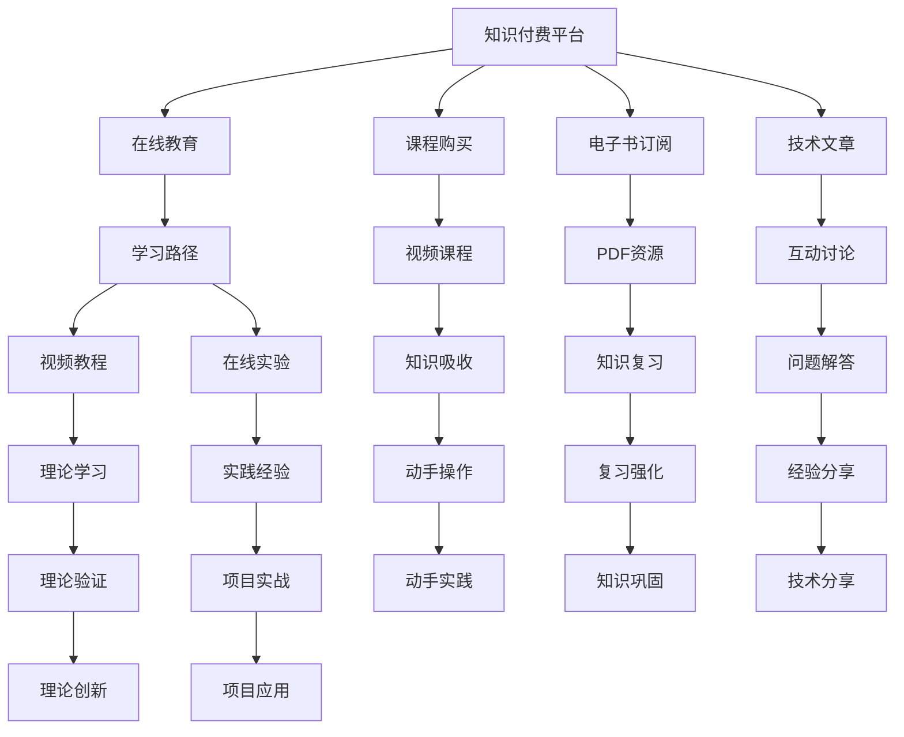

                 

# 知识付费：程序员的社群工具选择

> 关键词：知识付费, 程序员, 社群工具, 开源社区, 在线教育平台, 技术交流平台, 学习资源

## 1. 背景介绍

### 1.1 问题由来

近年来，随着互联网技术的迅猛发展，知识付费作为一种新型经济模式迅速兴起。伴随着知识爆炸时代所带来的信息过载，人们越来越渴望获取系统化、高效化的知识体系。同时，职业发展的快节奏和技术的日新月异，让每一位程序员都需要不断更新自身的技能，以保持竞争力。因此，面对庞大的知识资源和有限的个人时间，如何高效地挑选出对自己最有价值的知识，并加以利用，成为了程序员的普遍诉求。

在这样的背景下，知识付费平台应运而生，为程序员提供了一条快速提升自己的专业技能和行业知识的途径。但如何选择适合自己的知识付费平台，如何确保所投资的知识资源真正转化为个人价值，又成为了困扰许多程序员的问题。本文将详细介绍几种主流知识付费平台和开源社区工具，并对比其优缺点，帮助程序员找到最适合自己的社群工具，提升个人技术能力，拓展职业发展空间。

### 1.2 问题核心关键点

本文的核心关注点在于：

- 分析目前市场上流行的知识付费平台和开源社区工具，包括但不限于Udemy、Coursera、GitHub、Stack Overflow、Stack Exchange等。
- 总结每个平台的独特优势与劣势，帮助程序员根据自己的学习需求选择合适的工具。
- 讨论如何有效地利用知识付费平台和开源社区工具进行技术学习和项目实践，最大化知识转化效率。

### 1.3 问题研究意义

随着知识经济的发展，个人学习与成长已成为职业发展的重要环节。通过精心挑选并充分利用知识付费和开源社区资源，程序员不仅可以在知识层面上实现快速成长，还能在实践经验上获得质的飞跃。本文的研究具有以下意义：

1. 提供有价值的参考。通过系统性对比分析，帮助程序员做出更明智的社群工具选择。
2. 促进技术交流。总结学习资源和交流经验，促进社群内部的知识传播与共享。
3. 推动个人发展。以提升个人技术能力和职业竞争力为导向，辅助程序员找到最适合自己的社群工具。

## 2. 核心概念与联系

### 2.1 核心概念概述

- **知识付费平台**：提供付费课程、电子书、技术文章等知识资源，满足用户学习需求的平台。
- **开源社区工具**：由开发者共同维护的代码、文档、工具等资源共享平台，如GitHub、Stack Overflow等。
- **学习平台**：提供系统化课程，涵盖编程语言、技术框架、软技能培训等，如Udemy、Coursera。
- **交流平台**：提供用户间交流讨论，解决问题、分享项目经验的平台，如Stack Overflow、GitHub。

### 2.2 核心概念原理和架构的 Mermaid 流程图



### 2.3 核心概念的联系

知识付费平台和开源社区工具的联系主要体现在以下几个方面：

1. **知识共享**：两者都提供了丰富的知识资源，能够帮助用户快速获取所需的学习材料。
2. **社区交流**：通过平台提供的讨论区，用户能够与他人交流技术问题，分享项目经验。
3. **知识转化**：通过课程和代码实践，用户可以将学到的知识应用到实际项目中，实现知识内化。

## 3. 核心算法原理 & 具体操作步骤

### 3.1 算法原理概述

知识付费平台和开源社区工具的工作原理主要基于用户需求驱动的数据分析和内容推荐算法。平台通过分析用户的浏览记录、购买行为和反馈信息，推荐个性化的课程和资源。开源社区工具则通过算法分析代码提交、讨论帖子等用户行为，推荐相关的内容。

算法主要包括：

- **推荐算法**：基于协同过滤、内容推荐、深度学习等算法，推荐用户感兴趣的内容。
- **搜索算法**：通过关键词匹配、语义分析等技术，帮助用户快速找到所需资源。

### 3.2 算法步骤详解

1. **用户画像构建**：平台通过用户行为数据，构建用户画像，了解用户的学习偏好和需求。
2. **内容匹配与推荐**：根据用户画像，匹配相关课程或代码资源，并按照用户偏好排序推荐。
3. **知识内化评估**：通过用户反馈和评估数据，评估知识吸收效果，持续优化推荐算法。

### 3.3 算法优缺点

**优点**：

- **个性化推荐**：能够根据用户需求提供个性化的学习内容，提高学习效率。
- **丰富的资源库**：知识付费平台和开源社区工具提供了海量的课程和代码资源，用户可以从中选取最适合自己的学习材料。

**缺点**：

- **资源质量参差不齐**：部分内容质量低劣，用户需要耗费大量时间筛选。
- **价格较高**：部分平台的高价课程可能超出预算，影响学习投入。
- **时间成本高**：系统推荐的课程可能无法完全满足用户需求，用户需花费大量时间自学。

### 3.4 算法应用领域

知识付费平台和开源社区工具广泛应用于以下领域：

1. **技术进阶**：适用于希望深入学习某一技术栈或框架的程序员。
2. **问题解决**：适用于遇到具体问题需要查找解决方案的开发者。
3. **项目协作**：适用于参与开源项目或团队协作的开发者。

## 4. 数学模型和公式 & 详细讲解

### 4.1 数学模型构建

知识付费平台和开源社区工具的推荐算法模型主要基于以下数学模型：

- **协同过滤模型**：用户-物品评分矩阵，通过计算相似度进行推荐。
- **矩阵分解模型**：通过矩阵分解，发现用户-物品间的隐含因子，进行推荐。
- **深度学习模型**：通过构建神经网络模型，学习用户特征和内容特征，进行推荐。

### 4.2 公式推导过程

以协同过滤模型为例，假设用户集为 $U$，物品集为 $I$，用户对物品的评分矩阵为 $R$。协同过滤模型的目标是通过已知评分预测未知评分，推导过程如下：

$$
R_{ui} \approx \sum_{k=1}^K\alpha_{uk}\alpha_{ik}
$$

其中，$\alpha_{uk}$ 和 $\alpha_{ik}$ 分别为用户和物品的潜在因子向量，$K$ 为因子维度。通过最大化预测评分的准确率，求解 $\alpha$。

### 4.3 案例分析与讲解

以Coursera平台为例，分析其如何通过协同过滤算法推荐课程。Coursera使用用户行为数据构建用户画像，计算用户与课程之间的相似度，从而推荐个性化课程。例如，某用户经常访问与数据科学相关的课程，平台会推荐更多相关课程，如机器学习、数据可视化等。

## 5. 项目实践：代码实例和详细解释说明

### 5.1 开发环境搭建

以下是使用Python搭建知识付费平台和开源社区工具实践环境的流程：

1. **安装Python**：
   ```bash
   sudo apt-get install python3-pip python3-dev
   ```

2. **安装依赖库**：
   ```bash
   pip install requests beautifulsoup4 lxml
   ```

3. **下载数据**：
   ```bash
   wget https://example.com/data.csv
   ```

### 5.2 源代码详细实现

以下是一个简单的Python脚本，用于爬取Coursera上的课程信息，并推荐相关课程：

```python
import requests
from bs4 import BeautifulSoup
import pandas as pd

# 请求Coursera课程页面
url = "https://www.coursera.org/courses"
response = requests.get(url)

# 解析页面内容
soup = BeautifulSoup(response.content, 'html.parser')
course_links = soup.find_all('a', class_='course-thumbnail-container')

# 提取课程信息
courses = []
for link in course_links:
    course = {}
    course['title'] = link.text.strip()
    course['url'] = link['href']
    courses.append(course)

# 保存课程信息到CSV文件
df = pd.DataFrame(courses)
df.to_csv('courses.csv', index=False)

# 推荐课程
# 假设用户已经浏览过以下课程
user_browsed = ['Python for Data Science', 'Deep Learning Specialization']
# 查找与用户浏览过的课程相关的课程
df_related = df[df['title'].str.contains('|'.join(user_browsed))]
# 输出推荐课程列表
print(df_related[['title', 'url']])
```

### 5.3 代码解读与分析

1. **数据爬取**：使用BeautifulSoup和requests库，爬取Coursera的课程页面，提取课程标题和链接。
2. **信息保存**：将爬取到的课程信息保存为CSV文件，方便后续处理。
3. **课程推荐**：根据用户已浏览过的课程，推荐相关课程。

## 6. 实际应用场景

### 6.1 在线教育平台

在线教育平台如Udemy、Coursera等，为程序员提供系统化、结构化的课程学习。例如，Udemy上提供从入门到高级的Python课程，Coursera则与顶尖大学合作，提供深度学习和机器学习课程。

**应用场景**：

- 编程语言学习
- 技术框架深入
- 软技能培训

### 6.2 开源社区工具

开源社区工具如GitHub、Stack Overflow，为程序员提供代码共享、问题解决、项目协作等功能。GitHub上成千上万的开源项目提供了丰富的学习材料和实践机会，Stack Overflow则是一个程序员交流和解决问题的平台。

**应用场景**：

- 项目实践与代码学习
- 问题解决与社区交流
- 开源项目贡献与协作

### 6.3 未来应用展望

随着技术的不断进步，知识付费平台和开源社区工具将不断迭代优化，带来更多创新功能：

- **AI辅助推荐**：通过深度学习等算法，提供更加精准的个性化推荐。
- **跨平台整合**：整合多种学习资源，构建无缝的学习生态系统。
- **实时学习**：通过直播、实时互动等功能，提升学习体验。

## 7. 工具和资源推荐

### 7.1 学习资源推荐

- **Udemy**：提供丰富的编程课程，涵盖Python、Java、Web开发等多个方向。
- **Coursera**：与顶尖大学合作，提供系统化的课程，如斯坦福大学的数据科学课程。
- **GitHub**：提供丰富的开源项目和代码资源，支持项目实践与协作。
- **Stack Overflow**：程序员交流和解决问题的平台，提供丰富的代码示例和解决方案。

### 7.2 开发工具推荐

- **Jupyter Notebook**：一个交互式的编程环境，支持Python等语言，非常适合数据科学和机器学习项目。
- **VS Code**：一个功能强大的代码编辑器，支持多种编程语言和扩展插件。
- **Git**：版本控制系统，支持项目管理和协作。

### 7.3 相关论文推荐

- **Knowledge Discovery and Knowledge-Driven Software Engineering**：介绍知识发现和知识驱动的软件工程方法，为知识付费平台和开源社区工具的设计提供了理论基础。
- **Collaborative Filtering for E-Commerce Recommendation Systems**：介绍协同过滤算法在电子商务推荐系统中的应用，为推荐算法提供了实践指导。
- **Deep Learning in Recommendation Systems**：介绍深度学习在推荐系统中的应用，为知识付费平台和开源社区工具的推荐算法提供了新的思路。

## 8. 总结：未来发展趋势与挑战

### 8.1 研究成果总结

本文通过系统性对比分析，帮助程序员了解知识付费平台和开源社区工具的优劣，提供了有价值的社群工具选择建议。

### 8.2 未来发展趋势

- **技术整合**：知识付费平台和开源社区工具的整合将提升整体功能，为程序员提供更全面的学习资源。
- **个性化服务**：通过大数据和AI技术，提供更加精准的个性化推荐服务。
- **跨平台协作**：通过API和数据接口，实现多种平台之间的无缝协作。

### 8.3 面临的挑战

- **数据隐私保护**：如何保护用户隐私数据，防止信息泄露。
- **内容质量控制**：如何筛选高质量的课程和代码资源，避免误导用户。
- **用户体验优化**：如何提升平台的用户体验，增加用户粘性。

### 8.4 研究展望

未来的研究重点在于：

- **算法优化**：优化推荐算法，提升推荐精准度。
- **内容创新**：开发更多高价值的课程和项目，丰富学习资源库。
- **用户互动**：增强用户间的互动交流，提升学习效果。

## 9. 附录：常见问题与解答

**Q1：如何选择合适的知识付费平台？**

A: 根据自身的学习需求和预算，选择适合自己的平台。例如，希望系统化学习某一技术栈的程序员，可以选择Coursera等系统化课程平台。

**Q2：如何使用开源社区工具进行项目实践？**

A: 下载开源项目源码，了解项目结构和文档，逐步进行代码阅读和修改实践，并参与到社区交流中，解决项目中的问题。

**Q3：如何保证知识付费平台的推荐质量？**

A: 平台应定期对课程和资源进行审核，筛选出高质量的内容。同时，用户也应积极反馈，帮助平台优化推荐算法。

---

作者：禅与计算机程序设计艺术 / Zen and the Art of Computer Programming

