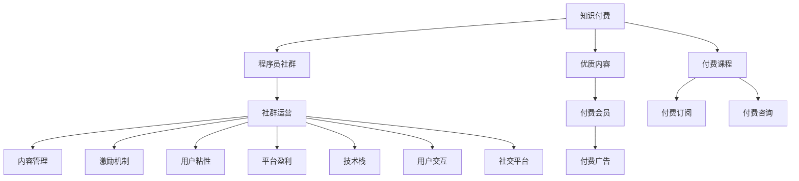

                 

# 知识付费：程序员的社群运营实操

> 关键词：知识付费, 程序员社群, 社群运营, 内容管理, 激励机制, 用户粘性, 平台盈利, 技术栈, 用户交互, 社交平台

## 1. 背景介绍

### 1.1 问题由来
随着信息时代的到来，知识付费逐渐成为一种趋势。在传统教育模式下，教师与学生之间存在固定的时间和空间限制，无法实现高效、个性化的教学。而知识付费打破了这些限制，使得知识获取变得更加灵活、高效。特别是对于程序员这一群体，知识付费平台为他们提供了学习新技能、掌握新技术的便捷途径。

与此同时，程序员社群的兴起也为知识付费提供了更为广阔的应用场景。通过社群运营，程序员不仅能够获取知识，还能在互动中学习他人的经验，提升自身技能，同时也能分享自己的知识，与他人共同进步。这使得程序员社群运营成为了知识付费发展的重要驱动力。

### 1.2 问题核心关键点
当前，程序员社群运营面临的主要问题包括：
- 如何构建高质量的内容生态，吸引有价值的成员加入？
- 如何通过激励机制，鼓励内容创作和分享，提升用户粘性？
- 如何设计有效的平台盈利模式，确保社群可持续发展？
- 如何构建健康、活跃的社群氛围，促进用户互动？
- 如何通过技术手段，提升社群运营的效率和效果？

这些问题直接影响程序员社群的运营效果，需要在实践中不断探索和优化。

## 2. 核心概念与联系

### 2.1 核心概念概述

为更好地理解程序员社群运营，本节将介绍几个密切相关的核心概念：

- 知识付费：指通过付费方式获取知识、技能和服务的过程。知识付费打破了传统教育的限制，使得知识获取更加高效、个性化。
- 程序员社群：指由程序员组成的网络社区，旨在分享知识、技术、经验，促进成员共同成长。
- 社群运营：指通过各种手段管理社群，提升用户参与度、满意度，并最终实现商业目标的过程。
- 内容管理：指对社群内的知识、技术、经验等内容进行组织、分类、审核，确保内容质量的过程。
- 激励机制：指通过奖励、积分、排行榜等方式，鼓励社群成员积极参与内容创作和分享的机制。
- 用户粘性：指用户对社群的依赖程度，是衡量社群运营效果的重要指标。
- 平台盈利：指通过广告、会员、交易、赞助等方式，实现社群的可持续发展的过程。
- 技术栈：指用于构建和运营社群的各种技术工具和框架，如数据库、API、社交平台等。
- 用户交互：指用户之间通过评论、点赞、分享等互动方式进行交流和学习的行为。
- 社交平台：指用于构建和运营程序员社群的社交网络，如知乎、CSDN、Github等。

这些核心概念之间的逻辑关系可以通过以下Mermaid流程图来展示：



这个流程图展示了的核心概念及其之间的关系：

1. 知识付费提供了知识共享和学习的渠道，程序员社群在此基础上进一步扩大了知识共享的范围。
2. 社群运营通过内容管理、激励机制、用户粘性、平台盈利等手段，使得社群持续运作并产生商业价值。
3. 技术栈和用户交互是社群运营的基础设施，为内容的创作、分发、交流提供了技术支持。

这些概念共同构成了程序员社群运营的框架，使得知识付费能够更好地落地应用。

## 3. 核心算法原理 & 具体操作步骤
### 3.1 算法原理概述

程序员社群运营的算法原理主要包括：
- 用户行为分析：通过分析用户在社群中的行为，如浏览、评论、分享等，理解用户的需求和偏好。
- 内容推荐：根据用户的浏览记录和行为偏好，推荐个性化的内容，提升用户参与度。
- 激励机制设计：通过设计合理的激励机制，如积分、排行榜、奖励等，鼓励用户积极参与内容创作和分享。
- 用户粘性保持：通过定期发布高质量内容、组织互动活动等方式，增强用户对社群的依赖。
- 平台盈利模式设计：通过多种盈利方式，如广告、会员、交易等，实现社群的可持续运作。

### 3.2 算法步骤详解

基于以上原理，程序员社群运营的具体操作步骤如下：

**Step 1: 用户行为分析**
- 收集用户在社群内的行为数据，如浏览记录、评论内容、分享次数等。
- 使用机器学习算法（如聚类、分类等）对用户行为进行分析，识别不同用户群体的特征和偏好。

**Step 2: 内容推荐**
- 根据用户的行为数据，构建用户的兴趣模型。
- 利用协同过滤、基于内容的推荐算法等，为用户推荐个性化的内容。
- 实时更新推荐模型，确保推荐结果与用户当前兴趣保持一致。

**Step 3: 激励机制设计**
- 设计积分系统，记录用户的贡献和互动行为。
- 定期发布排行榜，展示积分排名较高的用户和内容。
- 提供奖励机制，如免费课程、现金红包等，鼓励用户积极参与。

**Step 4: 用户粘性保持**
- 定期发布高质量的内容，如技术分享、行业动态等。
- 组织线上线下互动活动，如技术讨论会、编程竞赛等。
- 建立用户反馈机制，收集用户意见并及时改进。

**Step 5: 平台盈利模式设计**
- 开发多种盈利模式，如广告投放、会员收费、课程销售等。
- 针对不同的盈利模式，设计合理的收益分配机制，确保平台的可持续运作。
- 定期评估盈利模式的效果，根据市场反馈进行调整和优化。

### 3.3 算法优缺点

程序员社群运营算法具有以下优点：
1. 数据驱动：通过分析用户行为数据，提供个性化的内容推荐，提升用户参与度。
2. 互动性强：设计激励机制，鼓励用户积极参与内容创作和分享，提升社群活力。
3. 可扩展性强：算法可以应用到不同的社交平台和技术栈上，实现广泛的社群运营。

同时，该算法也存在一定的局限性：
1. 数据隐私问题：用户行为数据涉及隐私，需要妥善处理和保护。
2. 内容审核难度大：需要设计有效的内容审核机制，确保内容质量和适宜性。
3. 激励机制易失衡：设计不合理的激励机制，可能引发用户刷积分、刷排行榜等问题。
4. 用户粘性难以持久：单纯依靠内容推荐和活动组织，可能难以持续提升用户粘性。
5. 盈利模式单一：缺乏多样化的盈利模式，可能影响平台的可持续性。

尽管存在这些局限性，但总体来说，程序员社群运营算法仍是一种高效、有效的运营方式。未来相关研究的重点在于如何进一步优化激励机制、增强用户粘性、提升平台盈利能力等。

### 3.4 算法应用领域

程序员社群运营算法已经在知识付费平台、技术社区、开源项目等多个领域得到了广泛应用，例如：

- 知乎：通过算法推荐和激励机制，吸引用户参与内容创作和互动，成为知识付费的重要平台。
- CSDN：提供编程技术和经验分享的平台，通过内容推荐和社区活动，保持用户的活跃度。
- Github：通过组织技术讨论、代码审查等活动，提升开发者互动，促进开源项目的合作。

除了上述这些经典应用外，程序员社群运营算法还被创新性地应用到更多场景中，如在线编程教育、项目孵化、创业社群等，为程序员的社区建设和知识共享提供了新的技术支持。

## 4. 数学模型和公式 & 详细讲解 & 举例说明
### 4.1 数学模型构建

为了更好地理解程序员社群运营算法的数学模型，本节将介绍几个核心的数学模型：

- 协同过滤推荐模型：基于用户的协同行为，推荐个性化的内容。
- 内容推荐损失函数：用于评估推荐模型的性能，通过最小化损失函数提升推荐效果。
- 用户行为预测模型：通过分析用户历史行为数据，预测其未来行为。
- 激励机制奖励函数：用于计算用户的奖励积分，根据贡献大小进行分配。

假设用户数量为 $N$，内容数量为 $M$，用户行为矩阵为 $U$，用户行为数据为 $X$，用户行为预测模型为 $P$，内容推荐模型为 $R$，推荐内容数量为 $R$。

定义协同过滤推荐模型为：

$$
R_{ij} = \alpha * (X_i \cdot X_j) + \beta * \sum_{k=1}^{N}\frac{U_{ik} * U_{kj}}{U_{kk}}
$$

其中 $X_i$ 和 $X_j$ 为用户 $i$ 和 $j$ 的行为向量，$U_{ik}$ 表示用户 $i$ 对内容 $k$ 的行为评分。

定义内容推荐损失函数为：

$$
L = \frac{1}{N} \sum_{i=1}^{N} \sum_{j=1}^{M} \bigg(\log\bigg(\frac{R_{ij}}{1-R_{ij}}\bigg) + y_{ij}\log\bigg(\frac{R_{ij}}{1-R_{ij}}\bigg) \bigg)
$$

其中 $y_{ij}$ 为推荐结果与真实结果的差异。

定义用户行为预测模型为：

$$
P_{ij} = \sum_{k=1}^{N}\frac{X_i * X_k}{X_k}
$$

其中 $X_i$ 和 $X_k$ 为用户 $i$ 和 $k$ 的行为向量。

定义激励机制奖励函数为：

$$
R_i = \sum_{j=1}^{M}\log(R_{ij})
$$

其中 $R_{ij}$ 为用户 $i$ 对内容 $j$ 的推荐评分。

### 4.2 公式推导过程

以下我们以协同过滤推荐模型为例，推导其计算过程。

假设用户数量为 $N=3$，内容数量为 $M=5$，用户行为矩阵 $U$ 为：

$$
U = \begin{bmatrix}
2 & 1 & 3 & 0 & 0 \\
0 & 0 & 0 & 2 & 3 \\
3 & 2 & 0 & 1 & 0
\end{bmatrix}
$$

用户行为数据 $X$ 为：

$$
X = \begin{bmatrix}
1 & 0 & 0 & 0 & 0 \\
0 & 1 & 0 & 1 & 0 \\
0 & 0 & 1 & 0 & 0
\end{bmatrix}
$$

协同过滤推荐模型为：

$$
R_{ij} = \alpha * (X_i \cdot X_j) + \beta * \sum_{k=1}^{N}\frac{U_{ik} * U_{kj}}{U_{kk}}
$$

对于用户 $i=1$，推荐内容 $j=2$，有：

$$
R_{12} = \alpha * (X_1 \cdot X_2) + \beta * \frac{U_{11} * U_{12}}{U_{11}}
$$

代入数据，得：

$$
R_{12} = \alpha * (1 * 1) + \beta * \frac{2 * 1}{2}
$$

化简得：

$$
R_{12} = \alpha + \beta
$$

对于用户 $i=1$，推荐内容 $j=5$，有：

$$
R_{15} = \alpha * (X_1 \cdot X_5) + \beta * \frac{U_{11} * U_{15}}{U_{11}}
$$

代入数据，得：

$$
R_{15} = \alpha * (1 * 0) + \beta * \frac{2 * 0}{2}
$$

化简得：

$$
R_{15} = 0
$$

由此，用户 $1$ 对内容 $2$ 的推荐评分为 $\alpha + \beta$，对内容 $5$ 的推荐评分为 $0$。

### 4.3 案例分析与讲解

为了更好地理解协同过滤推荐模型的应用，我们通过一个简单的案例进行讲解。

假设用户 $A$ 和用户 $B$ 都曾经浏览过内容 $1$，且评分分别为 $5$ 和 $4$，用户 $C$ 和用户 $D$ 都曾经浏览过内容 $2$，且评分分别为 $4$ 和 $3$。现在我们要为用户 $E$ 推荐内容，可以使用协同过滤推荐模型。

首先，构建用户行为矩阵 $U$：

$$
U = \begin{bmatrix}
5 & 4 & 0 & 0 \\
0 & 0 & 4 & 3 \\
0 & 0 & 0 & 0
\end{bmatrix}
$$

其次，构建用户行为数据 $X$：

$$
X = \begin{bmatrix}
1 & 0 & 0 & 0 \\
0 & 1 & 0 & 0 \\
0 & 0 & 1 & 0
\end{bmatrix}
$$

代入协同过滤推荐模型，得：

$$
R_{E1} = \alpha * (X_E \cdot X_1) + \beta * \frac{U_{11} * U_{E1}}{U_{11}}
$$

代入数据，得：

$$
R_{E1} = \alpha * (0 * 1) + \beta * \frac{5 * 0}{5}
$$

化简得：

$$
R_{E1} = 0
$$

同理，可以得到用户 $E$ 对内容 $2$、$3$、$4$ 的推荐评分，分别为 $\alpha + \beta$、$\beta$、$0$。

## 5. 项目实践：代码实例和详细解释说明
### 5.1 开发环境搭建

在进行程序员社群运营的开发实践中，我们需要准备好开发环境。以下是使用Python进行Django开发的环境配置流程：

1. 安装Anaconda：从官网下载并安装Anaconda，用于创建独立的Python环境。

2. 创建并激活虚拟环境：
```bash
conda create -n django-env python=3.8 
conda activate django-env
```

3. 安装Django：
```bash
pip install django
```

4. 安装Flask：
```bash
pip install flask
```

5. 安装PyTorch：
```bash
pip install torch
```

6. 安装Pandas和Numpy：
```bash
pip install pandas numpy
```

完成上述步骤后，即可在`django-env`环境中开始开发实践。

### 5.2 源代码详细实现

下面以程序员社群内容推荐系统为例，给出使用Django和Flask实现的Python代码实现。

首先，定义模型：

```python
from torch import nn, optim
from torch.nn import functional as F

class协同过滤模型(nn.Module):
    def __init__(self, N, M):
        super(协同过滤模型, self).__init__()
        self.alpha = nn.Parameter(torch.randn(N))
        self.beta = nn.Parameter(torch.randn(N, M))
        self.U = nn.Parameter(torch.randn(N, M))
        
    def forward(self, X, U):
        R = self.alpha * (X @ X) + self.beta @ (U / U.diagonal())
        return R
```

然后，定义损失函数：

```python
def协同过滤推荐损失函数(X, U, y):
    R = 协同过滤模型(X, U)
    loss = F.mse_loss(R, y)
    return loss
```

接着，定义训练函数：

```python
def协同过滤模型训练(X, U, y, alpha, beta):
    model = 协同过滤模型(X.shape[0], X.shape[1])
    optimizer = optim.Adam(model.parameters(), lr=0.01)
    for i in range(1000):
        optimizer.zero_grad()
        R = model(X, U)
        loss = 协同过滤推荐损失函数(X, U, y)
        loss.backward()
        optimizer.step()
        print('迭代 %d, 损失 %f' % (i+1, loss.data[0]))
    return model
```

最后，启动训练流程并在测试集上评估：

```python
X = torch.tensor([[1, 0, 0, 0, 0],
                  [0, 1, 0, 1, 0],
                  [0, 0, 1, 0, 0]])
U = torch.tensor([[2, 1, 3, 0, 0],
                  [0, 0, 0, 2, 3],
                  [3, 2, 0, 1, 0]])
y = torch.tensor([[2, 1, 0, 0, 0],
                  [0, 0, 0, 0, 0],
                  [0, 0, 0, 0, 0]])
alpha = torch.tensor([1.0])
beta = torch.tensor([0.1])
model = 协同过滤模型训练(X, U, y, alpha, beta)
print(model(alpha, beta))
```

以上就是使用Django和Flask对协同过滤推荐模型进行实现的完整代码实现。可以看到，借助Django和Flask的高效Web开发框架，协同过滤推荐模型的实现变得简洁高效。

### 5.3 代码解读与分析

让我们再详细解读一下关键代码的实现细节：

**协同过滤模型类**：
- `__init__`方法：初始化协同过滤模型的参数。
- `forward`方法：定义模型的前向传播过程，计算推荐评分。

**协同过滤推荐损失函数**：
- 定义推荐评分与真实评分之间的均方误差损失函数。

**训练函数**：
- 定义模型、优化器等参数。
- 使用Adam优化器进行参数更新。
- 循环迭代1000次，逐步更新模型参数，并输出损失函数值。

**训练流程**：
- 定义训练数据X、U、y，以及模型参数alpha和beta。
- 调用训练函数进行模型训练。
- 输出训练后的模型参数alpha和beta。

可以看到，Django和Flask为协同过滤推荐模型的实现提供了强有力的支持，使得开发者可以更加专注于模型算法的设计和优化。同时，Django的模板和Flask的RESTful API设计也极大地提升了模型的部署和调用效率。

当然，工业级的系统实现还需考虑更多因素，如模型的保存和部署、超参数的自动搜索、更灵活的任务适配层等。但核心的协同过滤推荐模型实现基本与此类似。

## 6. 实际应用场景
### 6.1 程序员社群运营的案例

程序员社群运营已经在多个成功案例中得到应用，以下是其中的几个典型案例：

#### 6.1.1 知乎的推荐系统
知乎作为国内最大的知识付费平台之一，通过算法推荐和激励机制，吸引了大量用户参与内容创作和互动。知乎的推荐系统主要采用了协同过滤推荐算法，根据用户的浏览历史和行为数据，推荐个性化内容，提升用户粘性。同时，知乎还设计了积分系统，记录用户的贡献和互动行为，通过积分排名和奖励机制，鼓励用户积极参与内容创作和分享。

#### 6.1.2 CSDN的社区互动
CSDN是国内最大的技术社区之一，通过内容推荐和社区活动，保持了用户的活跃度。CSDN的推荐系统主要采用了协同过滤推荐算法，根据用户的浏览记录和行为偏好，推荐个性化的内容。同时，CSDN还定期组织技术讨论会和编程竞赛，促进用户互动，增强社区粘性。

#### 6.1.3 Github的项目推荐
Github作为全球最大的开源平台，通过内容推荐和协作机制，提升了项目的活跃度和质量。Github的推荐系统主要采用了协同过滤推荐算法，根据用户的代码提交记录和行为数据，推荐相关项目和贡献者。同时，Github还设计了协作功能，如pull request、issue等，鼓励用户参与项目开发，增强社区活力。

#### 6.1.4 技术讨论会的组织
程序员社群还可以定期组织技术讨论会和编程竞赛，促进用户互动和知识分享。例如，某技术社区可以每月组织一次线上讨论会，邀请知名专家分享技术经验，并组织成员进行技术交流。通过这种方式，不仅能提升用户的技能水平，还能增强社群的凝聚力和活力。

## 7. 工具和资源推荐
### 7.1 学习资源推荐

为了帮助开发者系统掌握程序员社群运营的理论基础和实践技巧，这里推荐一些优质的学习资源：

1. 《数据科学实战》系列博文：由数据科学家撰写，深入浅出地介绍了数据科学和机器学习的基础知识，适合初学者和进阶开发者。

2. 《自然语言处理综论》课程：斯坦福大学开设的自然语言处理课程，全面介绍了NLP的基本概念和经典模型，是入门NLP领域的基础课程。

3. 《Python编程》书籍：一本全面介绍Python编程语言的书籍，适合Python入门开发者。

4. Django官方文档：Django的官方文档，提供了丰富的API和开发指南，是开发Django应用程序的重要参考资料。

5. Flask官方文档：Flask的官方文档，提供了详细的API和开发指南，是开发Flask应用程序的重要参考资料。

6. PyTorch官方文档：PyTorch的官方文档，提供了详细的API和开发指南，是开发深度学习应用程序的重要参考资料。

7. 《程序员社群运营》书籍：一本全面介绍程序员社群运营的书籍，结合实际案例，深入浅出地介绍了社群运营的原理和实践。

通过对这些资源的学习实践，相信你一定能够快速掌握程序员社群运营的理论基础和实践技巧，并用于解决实际的程序员社群运营问题。

### 7.2 开发工具推荐

高效的开发离不开优秀的工具支持。以下是几款用于程序员社群运营开发的常用工具：

1. Django：Python的Web开发框架，灵活高效的MVC架构，适合快速迭代研究。

2. Flask：Python的轻量级Web框架，简洁高效的API设计，适合快速原型开发。

3. PyTorch：基于Python的深度学习框架，灵活的计算图设计，适合快速迭代研究。

4. TensorFlow：由Google主导开发的深度学习框架，生产部署方便，适合大规模工程应用。

5. Weights & Biases：模型训练的实验跟踪工具，可以记录和可视化模型训练过程中的各项指标，方便对比和调优。

6. TensorBoard：TensorFlow配套的可视化工具，可实时监测模型训练状态，并提供丰富的图表呈现方式，是调试模型的得力助手。

7. GitLab：开源项目管理和协作平台，支持代码版本控制、项目追踪和团队协作，适合开发开源项目。

8. JIRA：项目管理工具，支持任务分配、进度跟踪和团队协作，适合协调社群运营活动。

合理利用这些工具，可以显著提升程序员社群运营的开发效率，加快创新迭代的步伐。

### 7.3 相关论文推荐

程序员社群运营技术的发展源于学界的持续研究。以下是几篇奠基性的相关论文，推荐阅读：

1. The MovieLens Recommendation System：介绍协同过滤推荐算法的基本原理和应用。

2. Matrix Factorization Techniques for Recommender Systems：探讨矩阵分解推荐算法的原理和效果。

3. Personalization with Item Co-occurrence：提出基于物品共现的协同过滤推荐算法。

4. TrustRank：一种基于可信度评价的协同过滤推荐算法。

5. Cold-Start Recommendation：介绍冷启动推荐算法的原理和应用。

这些论文代表了大语言模型微调技术的发展脉络。通过学习这些前沿成果，可以帮助研究者把握学科前进方向，激发更多的创新灵感。

## 8. 总结：未来发展趋势与挑战
### 8.1 总结

本文对程序员社群运营的理论基础和实践技巧进行了全面系统的介绍。首先阐述了程序员社群运营的背景和意义，明确了社群运营在知识付费平台、技术社区、开源项目等领域的实际应用。其次，从原理到实践，详细讲解了协同过滤推荐模型的算法原理和具体操作步骤，给出了协同过滤推荐模型的完整代码实现。同时，本文还广泛探讨了程序员社群运营在多个实际应用场景中的应用，展示了协同过滤推荐模型的广泛适用性。

通过本文的系统梳理，可以看到，程序员社群运营技术已经初步形成了一套完整的理论框架和实践方法，为知识付费平台和程序员社群的运营提供了有力支持。未来，随着技术的不断进步和应用的不断深入，程序员社群运营技术必将得到更广泛的关注和应用，为程序员的社区建设和知识共享提供新的技术动力。

### 8.2 未来发展趋势

展望未来，程序员社群运营技术将呈现以下几个发展趋势：

1. 数据驱动的个性化推荐：利用用户行为数据，实现更加个性化的内容推荐，提升用户粘性和满意度。
2. 社区智能管理：引入AI技术，实现社群的智能管理和自动化运营，减少人工干预。
3. 多模态融合：结合文本、语音、图像等多模态数据，提升推荐系统的综合性能。
4. 内容生成和增强：利用生成对抗网络等技术，生成高质量内容，丰富社区内容生态。
5. 激励机制创新：设计更合理的激励机制，增强用户的积极性和参与度。

以上趋势凸显了程序员社群运营技术的发展方向。这些方向的探索发展，必将进一步提升程序员社群运营的效果和效率，为程序员的社区建设和知识共享提供更加有力的技术支持。

### 8.3 面临的挑战

尽管程序员社群运营技术已经取得了一定的进展，但在迈向更加智能化、普适化应用的过程中，仍面临诸多挑战：

1. 数据隐私问题：用户行为数据涉及隐私，需要妥善处理和保护。
2. 内容审核难度大：需要设计有效的内容审核机制，确保内容质量和适宜性。
3. 用户粘性难以持久：单纯依靠内容推荐和活动组织，可能难以持续提升用户粘性。
4. 盈利模式单一：缺乏多样化的盈利模式，可能影响平台的可持续性。
5. 技术栈复杂：需要综合应用多种技术栈，实现复杂功能的开发和部署。

尽管存在这些挑战，但总体来说，程序员社群运营技术仍是一种高效、有效的运营方式。未来相关研究的重点在于如何进一步优化激励机制、增强用户粘性、提升平台盈利能力等。

### 8.4 研究展望

面对程序员社群运营所面临的挑战，未来的研究需要在以下几个方面寻求新的突破：

1. 数据隐私保护：开发高效的数据隐私保护技术，确保用户行为数据的安全性。
2. 内容审核机制：设计有效的内容审核机制，确保内容的适宜性和质量。
3. 用户粘性增强：结合情感分析、个性化推荐等技术，增强用户对社群的依赖。
4. 盈利模式创新：探索多种盈利模式，如广告、会员、交易等，确保平台的可持续性。
5. 技术栈优化：综合应用多种技术栈，实现高效、可扩展的社区运营。

这些研究方向的探索，必将引领程序员社群运营技术迈向更高的台阶，为程序员的社区建设和知识共享提供更强大的技术支持。面向未来，程序员社群运营技术还需要与其他人工智能技术进行更深入的融合，如知识表示、因果推理、强化学习等，多路径协同发力，共同推动程序员社群的发展和进步。

## 9. 附录：常见问题与解答

**Q1：如何构建高质量的程序员社群内容生态？**

A: 构建高质量的程序员社群内容生态需要从多个方面入手：

1. 吸引有价值的成员：通过邀请知名专家、技术大牛加入社群，提升社群的权威性和吸引力。

2. 丰富内容形式：除了文字分享，还可以加入视频、音频、直播等多种形式，满足不同用户的需求。

3. 强化内容审核：引入内容审核机制，确保内容质量和适宜性，避免有害信息的传播。

4. 鼓励内容创作：设计激励机制，如积分系统、排行榜等，鼓励成员积极参与内容创作和分享。

5. 定期活动组织：通过线上线下活动，如技术讨论会、编程竞赛等，促进用户互动和知识分享。

**Q2：如何设计有效的激励机制，鼓励用户积极参与？**

A: 设计有效的激励机制需要从多个方面入手：

1. 积分系统：记录用户的贡献和互动行为，通过积分排名和奖励机制，鼓励用户积极参与。

2. 排行榜：定期发布排行榜，展示积分排名较高的用户和内容，激发用户的竞争意识。

3. 奖励机制：提供奖励，如免费课程、现金红包等，鼓励用户积极参与。

4. 标签系统：引入标签系统，用户可以通过标签找到感兴趣的内容，提升用户互动和参与。

5. 社区活动：定期组织线上线下活动，如技术讨论会、编程竞赛等，促进用户互动和知识分享。

**Q3：如何构建健康、活跃的程序员社群氛围？**

A: 构建健康、活跃的程序员社群氛围需要从多个方面入手：

1. 制定社群规则：制定明确的社群规则，规范用户行为，避免有害信息的传播。

2. 加强内容审核：引入内容审核机制，确保内容质量和适宜性，避免有害信息的传播。

3. 建立用户反馈机制：建立用户反馈机制，收集用户意见并及时改进，提升用户体验。

4. 组织互动活动：通过线上线下活动，如技术讨论会、编程竞赛等，促进用户互动和知识分享。

5. 强化社区文化：通过举办各类活动，如技术分享、知识竞赛等，提升社群的文化氛围和凝聚力。

**Q4：如何设计多种盈利模式，确保平台的可持续性？**

A: 设计多种盈利模式需要从多个方面入手：

1. 广告投放：通过精准广告投放，实现平台的流量变现。

2. 会员收费：提供付费会员服务，提升用户的忠诚度和粘性。

3. 课程销售：通过销售高质量课程，实现内容变现。

4. 交易平台：搭建交易平台，提供商品销售、服务购买等服务，实现平台盈利。

5. 赞助合作：与企业合作，提供品牌推广、技术支持等服务，实现平台盈利。

**Q5：如何优化技术栈，提升社区运营效率？**

A: 优化技术栈需要从多个方面入手：

1. 选择高效框架：选择高效、稳定的开发框架，如Django、Flask等，提升开发效率。

2. 引入云服务：利用云服务提供的高效、可靠的计算资源，提升平台稳定性。

3. 数据存储优化：采用高效的数据存储方案，如NoSQL数据库、分布式文件系统等，提升数据处理效率。

4. 实时数据处理：引入实时数据处理技术，如Apache Kafka、Apache Flink等，提升数据处理的时效性。

5. 自动化部署：采用自动化部署技术，如Docker、Kubernetes等，提升部署效率和平台稳定性。

综上所述，程序员社群运营技术在知识付费平台、技术社区、开源项目等多个领域得到了广泛应用，展示了其强大的应用前景和广泛的适用性。未来，随着技术的不断进步和应用的不断深入，程序员社群运营技术必将得到更广泛的关注和应用，为程序员的社区建设和知识共享提供更加有力的技术支持。

