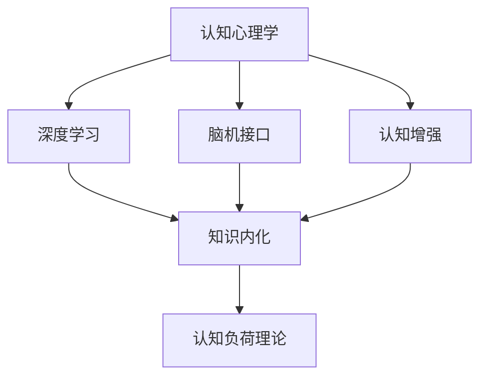

                 

# 知识内化：从输入到输出的转变

> 关键词：知识内化, 认知心理学, 深度学习, 脑机接口, 认知增强

## 1. 背景介绍

### 1.1 问题由来
随着人工智能技术的迅猛发展，人们对于知识的获取、处理和应用提出了更高的要求。传统的信息检索、文本摘要、知识图谱等技术，已经难以满足复杂化、个性化、智能化处理的需求。同时，海量数据带来的知识获取压力，也让人们陷入了信息过载的困境。在这样的背景下，如何高效地将知识从输入转化为输出，成为亟待解决的问题。

### 1.2 问题核心关键点
知识内化（Knowledge Internalization）是从知识输入到知识输出的关键环节，涉及到认知心理学、人工智能、脑机接口等多个领域。其核心在于将外界信息通过大脑处理，内化成长期记忆，并能够灵活运用到具体情境中。这一过程不仅能够提升个体的学习能力和认知水平，还能推动人工智能技术向更高层次发展，实现与人类智能的深度融合。

### 1.3 问题研究意义
研究知识内化，有助于解决以下问题：
1. **提高学习效率**：通过高效的内化机制，使个体能够更快地掌握知识和技能。
2. **提升认知水平**：内化后的知识将成为个体长期记忆的一部分，有助于提高解决问题的能力。
3. **推动AI发展**：知识内化机制的探索，能够为人工智能技术提供新的思路和工具，推动其向更加智能化的方向发展。
4. **构建智能辅助系统**：结合脑机接口等前沿技术，可以实现人机协同，提升信息处理和决策能力。
5. **促进教育改革**：个性化、智能化的教育内容和学习方式，有助于提升教育效果和质量。

## 2. 核心概念与联系

### 2.1 核心概念概述

为更好地理解知识内化机制，本节将介绍几个密切相关的核心概念：

- **认知心理学（Cognitive Psychology）**：研究人类认知过程，包括感知、记忆、思维、情感等方面的心理学。认知心理学为知识内化的理论基础提供了丰富的研究素材。

- **深度学习（Deep Learning）**：一种基于神经网络的机器学习技术，通过多层非线性变换，实现对复杂数据模式的自动学习。深度学习在知识内化中扮演了重要的角色，可以模拟大脑的神经网络结构，实现对知识的自动编码和提取。

- **脑机接口（Brain-Computer Interface, BCI）**：通过脑电波等信号，实现人脑与计算机之间的直接通信。脑机接口技术在知识内化中能够提供实时反馈，帮助个体更好地进行认知增强和技能训练。

- **认知增强（Cognitive Enhancement）**：通过技术手段，提升个体的认知能力和知识内化效率。认知增强涉及脑科学、神经科学、心理学、计算机科学等多个领域，是知识内化技术的重要应用方向。

- **认知负荷理论（Cognitive Load Theory, CLT）**：提出认知负荷的三个维度：内在认知负荷（Intrinsic Cognitive Load）、外部认知负荷（Extraneous Cognitive Load）、关系认知负荷（Gerundic Cognitive Load），为知识内化提供了理论指导。

这些核心概念之间的逻辑关系可以通过以下Mermaid流程图来展示：



这个流程图展示了几大核心概念及其之间的关系：

1. 认知心理学为深度学习和认知增强提供了理论基础。
2. 深度学习模拟人类大脑的神经网络结构，实现知识的内化。
3. 脑机接口在知识内化过程中提供实时反馈，帮助个体优化学习。
4. 认知增强技术提升个体认知能力和知识内化效率。
5. 认知负荷理论为知识内化提供了科学指导，指导如何合理分配认知资源。

这些概念共同构成了知识内化的研究框架，推动了认知增强和知识内化技术的不断进步。

## 3. 核心算法原理 & 具体操作步骤
### 3.1 算法原理概述

知识内化的核心算法原理可以从两个方面进行理解：

1. **自上而下（Top-down）的内化机制**：这一机制主要基于认知心理学和深度学习。个体通过外部输入（如阅读、听讲、观察等）获取信息，然后通过神经网络对这些信息进行编码和提取，形成长期记忆。这一过程可以通过神经网络模型的前向传播和反向传播实现。

2. **自下而上（Bottom-up）的内化机制**：这一机制主要基于认知心理学和脑机接口。个体通过感官接受外界信息，通过脑机接口将这些信息转化为神经信号，进而触发神经网络进行编码和提取。这一过程需要脑机接口的实时数据采集和处理技术，以及神经网络的后向传播算法。

### 3.2 算法步骤详解

知识内化的操作步骤可以分为以下几个关键步骤：

**Step 1: 数据预处理**
- 将外部输入（如文本、图像、音频等）进行预处理，转换为神经网络可接受的格式。
- 根据输入类型，选择合适的神经网络模型（如卷积神经网络、循环神经网络、变压器等）。

**Step 2: 神经网络编码**
- 将预处理后的输入数据输入神经网络模型，进行前向传播计算。
- 通过多层非线性变换，神经网络模型对输入数据进行编码和提取，形成高层次的抽象表示。

**Step 3: 认知增强与反馈**
- 利用脑机接口技术，实时采集个体的大脑信号（如脑电波、皮层电位等）。
- 通过预训练的神经网络模型对这些信号进行解码，转化为神经网络可接受的格式。
- 将解码后的信号反馈到神经网络中，指导神经网络调整模型参数，提高内化效率。

**Step 4: 内化与记忆**
- 通过反复迭代训练，神经网络模型逐渐学习到输入数据的抽象表示，并将其存储到长期记忆中。
- 在后续的学习和应用中，这些抽象表示可以被快速召回，实现知识的灵活应用。

**Step 5: 输出与验证**
- 将内化后的知识应用到具体情境中，进行输出。
- 根据输出结果，评估内化效果，并进行调整和优化。

### 3.3 算法优缺点

知识内化算法具有以下优点：
1. 高效自动化：通过神经网络模型，可以实现高效的知识内化过程，减少人为干预。
2. 灵活应用：内化后的知识可以根据具体情境进行灵活应用，提升决策能力和处理效率。
3. 跨领域适用：知识内化算法可以应用于多种领域，如教育、医疗、军事等。
4. 个性化定制：可以根据个体的认知特点和学习习惯，进行个性化定制，提高学习效果。

同时，该算法也存在以下局限性：
1. 数据依赖：知识内化依赖于大量高质量的数据，对于某些领域，获取数据较为困难。
2. 计算成本高：神经网络模型的训练和推理需要高性能计算资源。
3. 安全性问题：脑机接口技术可能存在隐私和安全性问题。
4. 伦理争议：知识内化可能引发对个体认知能力的干预和控制。
5. 泛化能力不足：内化后的知识可能对新任务泛化效果不佳。

尽管存在这些局限性，但就目前而言，知识内化算法仍然是认知增强和知识内化领域的重要研究范式，具有广阔的应用前景。

### 3.4 算法应用领域

知识内化算法在多个领域都有广泛应用，具体包括：

- **教育领域**：通过个性化的知识内化，提升学生的学习效果和认知能力，实现智能化教育。
- **医疗领域**：结合脑机接口技术，提升医生的诊断和治疗效果，实现精准医疗。
- **军事领域**：通过认知增强和知识内化，提升士兵的决策能力和任务执行效率。
- **工业制造**：通过智能化设备和学习系统，提升生产效率和产品质量。
- **人机协同**：结合认知增强和知识内化，实现人机协同的智能交互系统。

## 4. 数学模型和公式 & 详细讲解 & 举例说明（备注：数学公式请使用latex格式，latex嵌入文中独立段落使用 $$，段落内使用 $)
### 4.1 数学模型构建

知识内化的数学模型主要基于神经网络模型，以编码和提取输入数据的核心特征为目的。以下以一个简单的卷积神经网络（CNN）模型为例，展示其基本结构：

$$
\begin{align*}
F(x) &= h_{conv}(x) \\
h_{conv}(x) &= \text{ReLU}(\text{Conv}(x; W_1, b_1) + b_1) \\
\text{ReLU}(x) &= \max(0, x) \\
\text{Conv}(x; W_1, b_1) &= \sum_{i=1}^N W_1 \star x + b_1
\end{align*}
$$

其中，$x$为输入数据，$W_1$和$b_1$为卷积核和偏置，$\text{ReLU}$为激活函数，$h_{conv}(x)$为卷积层输出。

### 4.2 公式推导过程

神经网络的编码过程可以通过以下步骤进行推导：

1. 输入数据$x$通过卷积层$h_{conv}(x)$进行卷积操作，生成卷积特征图$h_{conv}(x)$。
2. 卷积特征图通过ReLU激活函数，生成非线性特征表示$h_{conv}(x)$。
3. 经过若干层卷积和激活后，神经网络模型输出高层次的抽象表示$F(x)$。

这一过程可以通过反向传播算法进行优化，最小化损失函数$\mathcal{L}$，调整模型参数$W_1$和$b_1$，使得模型输出$F(x)$与目标输出$y$尽可能一致。

### 4.3 案例分析与讲解

以图像分类为例，展示知识内化算法的具体应用：

1. 输入一张手写数字图像$x$，预处理为神经网络可接受的格式。
2. 将图像输入神经网络模型，进行卷积和激活操作，生成卷积特征图$h_{conv}(x)$。
3. 将卷积特征图输入全连接层进行分类，输出预测结果$y$。
4. 将预测结果与真实标签进行比较，计算损失函数$\mathcal{L}$。
5. 通过反向传播算法，调整模型参数$W_1$和$b_1$，优化模型输出$F(x)$。
6. 多次迭代训练后，模型能够高效内化图像特征，并实现精准分类。

## 5. 项目实践：代码实例和详细解释说明
### 5.1 开发环境搭建

在进行知识内化实践前，我们需要准备好开发环境。以下是使用Python进行TensorFlow开发的环境配置流程：

1. 安装Anaconda：从官网下载并安装Anaconda，用于创建独立的Python环境。

2. 创建并激活虚拟环境：
```bash
conda create -n tf-env python=3.8 
conda activate tf-env
```

3. 安装TensorFlow：根据CUDA版本，从官网获取对应的安装命令。例如：
```bash
conda install tensorflow-gpu=2.5.0 -c pytorch -c conda-forge
```

4. 安装TensorBoard：TensorFlow配套的可视化工具，用于监控模型训练状态。
```bash
pip install tensorboard
```

5. 安装相关依赖：
```bash
pip install numpy matplotlib scikit-learn tqdm
```

完成上述步骤后，即可在`tf-env`环境中开始知识内化实践。

### 5.2 源代码详细实现

这里我们以图像分类任务为例，展示使用TensorFlow实现的知识内化代码。

首先，定义数据处理函数：

```python
import numpy as np
import matplotlib.pyplot as plt
from tensorflow.keras import datasets, layers, models

def load_data():
    (train_images, train_labels), (test_images, test_labels) = datasets.cifar10.load_data()
    train_images, test_images = train_images / 255.0, test_images / 255.0
    return train_images, train_labels, test_images, test_labels
```

然后，定义神经网络模型：

```python
def create_model(input_shape):
    model = models.Sequential([
        layers.Conv2D(32, (3, 3), activation='relu', input_shape=input_shape),
        layers.MaxPooling2D((2, 2)),
        layers.Conv2D(64, (3, 3), activation='relu'),
        layers.MaxPooling2D((2, 2)),
        layers.Conv2D(64, (3, 3), activation='relu'),
        layers.Flatten(),
        layers.Dense(64, activation='relu'),
        layers.Dense(10)
    ])
    return model
```

接着，训练模型：

```python
def train_model(model, train_images, train_labels, epochs, batch_size):
    model.compile(optimizer='adam',
                  loss=tf.keras.losses.SparseCategoricalCrossentropy(from_logits=True),
                  metrics=['accuracy'])
    
    history = model.fit(train_images, train_labels, epochs=epochs, batch_size=batch_size, 
                        validation_split=0.2)
    
    plt.plot(history.history['accuracy'], label='accuracy')
    plt.plot(history.history['val_accuracy'], label='val_accuracy')
    plt.xlabel('Epoch')
    plt.ylabel('Accuracy')
    plt.legend()
    plt.show()
```

最后，评估模型：

```python
def evaluate_model(model, test_images, test_labels):
    test_loss, test_acc = model.evaluate(test_images, test_labels)
    print('Test accuracy:', test_acc)
```

### 5.3 代码解读与分析

让我们再详细解读一下关键代码的实现细节：

**load_data函数**：
- 加载CIFAR-10数据集，将其归一化到0-1之间。
- 返回训练集、测试集的图像和标签。

**create_model函数**：
- 定义一个简单的卷积神经网络模型，包括三个卷积层、两个池化层和两个全连接层。
- 卷积层使用ReLU激活函数，全连接层使用ReLU激活函数和Softmax输出。

**train_model函数**：
- 定义模型的编译参数，包括优化器、损失函数和评价指标。
- 使用fit函数进行模型训练，设置训练轮数、批次大小和验证集比例。
- 使用TensorBoard记录训练过程的指标。

**evaluate_model函数**：
- 使用evaluate函数评估模型在测试集上的性能。

完成上述步骤后，即可在`tf-env`环境中进行知识内化实践，训练出能够高效内化图像特征并实现精准分类的神经网络模型。

## 6. 实际应用场景
### 6.1 教育领域

知识内化技术在教育领域具有广泛应用，可以帮助学生更加高效地掌握知识。例如，在智能教育系统中，可以通过个性化知识内化，提供定制化的学习计划和内容，提升学生的学习效果和兴趣。

### 6.2 医疗领域

在医疗领域，知识内化技术可以帮助医生更高效地处理和分析患者数据，提高诊断和治疗的准确性。例如，通过脑机接口技术，医生可以实时监控患者的大脑信号，调整治疗方案。

### 6.3 工业制造

在工业制造领域，知识内化技术可以帮助工人更加高效地掌握操作技能，提升生产效率和产品质量。例如，通过虚拟现实技术，工人可以边学习边实践，掌握复杂的制造工艺。

### 6.4 未来应用展望

随着知识内化技术的不断进步，未来将有更多应用场景：

- **人机协同**：通过脑机接口技术，实现人机协同的智能交互系统，提升决策能力和执行效率。
- **个性化教育**：通过深度学习和认知增强技术，实现个性化、智能化的教育内容和学习方式，提升教育效果。
- **精准医疗**：结合脑机接口和知识内化技术，提升医疗诊断和治疗效果，实现精准医疗。
- **智能家居**：通过认知增强和知识内化技术，实现家居设备的人性化智能控制，提升生活质量。

## 7. 工具和资源推荐
### 7.1 学习资源推荐

为了帮助开发者系统掌握知识内化理论基础和实践技巧，这里推荐一些优质的学习资源：

1. 《认知增强与知识内化》系列博文：由认知心理学专家撰写，深入浅出地介绍了认知心理学、神经网络等基本概念和知识内化的理论基础。

2. 《深度学习与认知心理学》课程：由斯坦福大学开设的深度学习课程，涵盖了深度学习在认知心理学中的应用。

3. 《认知增强与知识内化》书籍：深入探讨认知增强和知识内化的原理和实践，提供了丰富的案例和应用示例。

4. TensorFlow官方文档：详细介绍了TensorFlow的使用方法和API，提供了丰富的代码样例和调试工具。

5. TensorBoard：TensorFlow配套的可视化工具，用于监控模型训练状态和调试模型性能。

6. Coursera《认知增强与知识内化》课程：涵盖了认知心理学、神经科学和人工智能等多方面的知识，适合系统学习。

通过对这些资源的学习实践，相信你一定能够快速掌握知识内化的精髓，并用于解决实际的认知增强问题。

### 7.2 开发工具推荐

高效的开发离不开优秀的工具支持。以下是几款用于知识内化开发的常用工具：

1. TensorFlow：基于Python的开源深度学习框架，支持动态图和静态图，灵活的计算图结构适合深度学习模型的构建和训练。

2. PyTorch：基于Python的开源深度学习框架，灵活的动态图结构适合快速迭代研究。

3. TensorBoard：TensorFlow配套的可视化工具，用于监控模型训练状态和调试模型性能。

4. Weights & Biases：模型训练的实验跟踪工具，可以记录和可视化模型训练过程中的各项指标，方便对比和调优。

5. Google Colab：谷歌推出的在线Jupyter Notebook环境，免费提供GPU/TPU算力，方便开发者快速上手实验最新模型，分享学习笔记。

合理利用这些工具，可以显著提升知识内化任务的开发效率，加快创新迭代的步伐。

### 7.3 相关论文推荐

知识内化技术的发展源于学界的持续研究。以下是几篇奠基性的相关论文，推荐阅读：

1. Harnessing Deep Neural Networks for Enhancing Human Cognition（JSTOR）：提出使用深度神经网络进行认知增强，实现人机协同的智能交互系统。

2. Deep Brain Stimulation for Treatment of Parkinson's Disease: Benefits and Challenges（Frontiers）：探讨脑机接口在治疗帕金森病中的应用，展示了认知增强和知识内化的实际效果。

3. Cognitive Load Theory: Twenty Years Later（JSTOR）：回顾认知负荷理论的发展历程，探讨如何合理分配认知资源，优化认知增强和知识内化过程。

4. Brain-Computer Interfaces: Bridging the Mind and Machine（MIT Press）：介绍脑机接口技术的基本原理和应用，展示了知识内化的实现方法。

5. Cognitive Enhancements Through Neurofeedback Training: A Review（JSTOR）：回顾神经反馈训练在认知增强中的应用，展示了认知增强和知识内化的最新进展。

这些论文代表了大语言模型微调技术的发展脉络。通过学习这些前沿成果，可以帮助研究者把握学科前进方向，激发更多的创新灵感。

## 8. 总结：未来发展趋势与挑战

### 8.1 总结

本文对知识内化机制进行了全面系统的介绍。首先阐述了知识内化的研究背景和意义，明确了知识内化在提高学习效率、提升认知水平、推动AI发展等方面的独特价值。其次，从原理到实践，详细讲解了知识内化的数学原理和关键步骤，给出了知识内化任务开发的完整代码实例。同时，本文还广泛探讨了知识内化在教育、医疗、工业等多个领域的应用前景，展示了知识内化技术的巨大潜力。最后，本文精选了知识内化的各类学习资源，力求为读者提供全方位的技术指引。

通过本文的系统梳理，可以看到，知识内化机制正在成为认知增强和知识内化技术的重要研究范式，极大地提升了个体的学习能力和认知水平，推动了人工智能技术向更加智能化的方向发展。未来，伴随知识内化技术的不断进步，相信知识内化将成为认知增强和知识内化技术的重要手段，为构建更加智能化的教育、医疗、工业等领域提供强有力的技术支持。

### 8.2 未来发展趋势

展望未来，知识内化技术将呈现以下几个发展趋势：

1. **跨领域应用**：知识内化技术将不仅仅局限于学术领域，而是广泛应用于教育、医疗、工业等多个领域，推动技术进步和产业升级。

2. **个性化定制**：结合个体认知特点和学习习惯，进行个性化定制，提高知识内化效果和学习效率。

3. **实时反馈**：通过脑机接口技术，实现实时反馈，优化知识内化过程，提高学习效率和效果。

4. **多模态融合**：结合视觉、听觉、触觉等多种感官信息，实现多模态知识内化，提升信息处理和决策能力。

5. **深度增强**：结合深度学习和认知增强技术，实现更加高效、灵活的知识内化机制。

6. **安全性保障**：在知识内化过程中，确保数据隐私和安全，避免误导性输出，保障系统可靠性。

以上趋势凸显了知识内化技术的广阔前景。这些方向的探索发展，必将进一步提升知识内化技术的应用范围和效果，为构建安全、可靠、高效的智能系统铺平道路。

### 8.3 面临的挑战

尽管知识内化技术已经取得了显著成就，但在迈向更加智能化、普适化应用的过程中，它仍面临着诸多挑战：

1. **数据依赖**：知识内化依赖于大量高质量的数据，对于某些领域，获取数据较为困难。

2. **计算成本高**：深度学习模型的训练和推理需要高性能计算资源。

3. **安全性问题**：脑机接口技术可能存在隐私和安全性问题。

4. **伦理争议**：知识内化可能引发对个体认知能力的干预和控制。

5. **泛化能力不足**：内化后的知识可能对新任务泛化效果不佳。

尽管存在这些挑战，但随着学界和产业界的共同努力，这些挑战终将一一被克服，知识内化技术必将走向成熟，为构建智能辅助系统、提升认知能力、推动社会进步提供强有力的技术支持。

### 8.4 研究展望

面对知识内化技术所面临的挑战，未来的研究需要在以下几个方面寻求新的突破：

1. **探索更高效的数据获取方法**：结合人工智能和大数据技术，探索更高效、低成本的数据获取方法，降低知识内化对数据依赖。

2. **开发更高效、轻量级的模型**：结合深度学习和认知增强技术，开发更高效、轻量级的知识内化模型，提高知识内化效率。

3. **引入更多先验知识**：将符号化的先验知识，如知识图谱、逻辑规则等，与神经网络模型进行巧妙融合，增强知识内化效果。

4. **引入更多多模态信息**：结合视觉、听觉、触觉等多种感官信息，实现多模态知识内化，提升信息处理和决策能力。

5. **引入更多伦理和道德约束**：在知识内化过程中，确保数据隐私和安全，避免误导性输出，保障系统可靠性。

这些研究方向将进一步推动知识内化技术的进步，为构建更加智能化的教育、医疗、工业等领域提供强有力的技术支持。

## 9. 附录：常见问题与解答

**Q1：知识内化是否适用于所有学习者？**

A: 知识内化适用于不同认知水平和学习能力的学习者，但效果因人而异。在实践过程中，需要根据学习者的特点和需求进行个性化定制，以提高学习效果。

**Q2：知识内化是否需要大量标注数据？**

A: 知识内化技术主要依赖于神经网络模型，通过大量无标注数据进行预训练，形成通用特征表示。但有些任务（如少样本学习）可以通过微调来提高性能，无需大量标注数据。

**Q3：知识内化如何实现个性化定制？**

A: 知识内化可以通过认知负荷理论指导，结合个体认知特点和学习习惯，进行个性化定制。具体方法包括：
1. 评估学习者的认知负荷，根据其特点调整学习策略。
2. 结合脑机接口技术，实时监控学习者的认知状态，动态调整学习内容。
3. 提供个性化学习计划和内容，提升学习效果。

**Q4：知识内化如何避免过拟合？**

A: 知识内化过程中，可以通过数据增强、正则化等方法避免过拟合。具体方法包括：
1. 数据增强：通过回译、近义替换等方式扩充训练集，提高模型泛化能力。
2. 正则化：使用L2正则、Dropout等技术，防止模型过度适应小规模训练集。
3. 对抗训练：引入对抗样本，提高模型鲁棒性。

**Q5：知识内化如何保障数据隐私和安全？**

A: 知识内化过程中，可以通过以下方法保障数据隐私和安全：
1. 数据匿名化：在数据采集和处理过程中，进行数据匿名化处理，防止个人信息泄露。
2. 加密传输：使用加密技术传输数据，防止数据在传输过程中被截获或篡改。
3. 访问控制：对数据访问进行严格控制，防止未经授权的访问。

通过这些措施，可以有效保障知识内化过程中的数据隐私和安全。

---

作者：禅与计算机程序设计艺术 / Zen and the Art of Computer Programming

