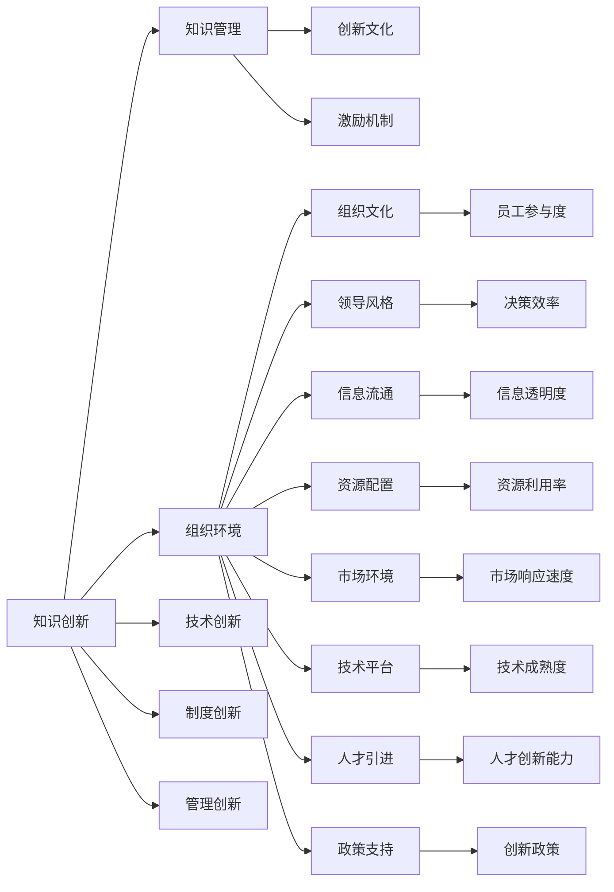

                 

# 知识创新的组织环境因素

## 1. 背景介绍

创新是驱动社会进步的核心动力。在信息化时代，知识创新成为企业和国家竞争力的重要标志。然而，知识创新并非易事，它需要适宜的环境和机制来支撑。本文将深入探讨影响知识创新的组织环境因素，分析不同环境对创新活动的影响，提出优化组织环境的策略，以推动知识创新。

## 2. 核心概念与联系

### 2.1 核心概念概述

- **知识创新**：指通过新思想、新技术和新方法来解决实际问题的过程。知识创新不仅包括科学研究和技术发明，还涵盖组织管理、制度创新、产品创新等多个方面。
- **组织环境**：指影响组织成员行为和组织运行的内外部因素。主要包括文化、领导风格、激励机制、信息流通等。
- **知识管理**：指对组织内的知识资源进行识别、创造、整合、共享和应用的过程，以促进知识创新。
- **创新文化**：指组织内部对创新活动持支持和鼓励的态度，表现为开放性、包容性、灵活性和持续改进。
- **激励机制**：指通过奖励和惩罚措施，激发组织成员的创新积极性。

### 2.2 核心概念原理和架构的 Mermaid 流程图



## 3. 核心算法原理 & 具体操作步骤

### 3.1 算法原理概述

知识创新的过程可以抽象为一系列算法，这些算法在组织环境中相互作用，共同推动创新活动。基于系统动力学原理，可以建立以下算法框架：

1. **知识生成算法**：通过学习和积累新知识，形成创新基础。
2. **知识整合算法**：将零散知识整合为系统化的知识体系，提升知识的价值。
3. **知识共享算法**：促进知识在组织内外的交流和共享，形成知识网络。
4. **知识应用算法**：将知识应用于实际问题解决，产生创新成果。
5. **创新评估算法**：评估创新成果的效果和影响，进行反馈和优化。

### 3.2 算法步骤详解

**步骤1：知识生成**
- 确定知识生成目标
- 收集相关数据和文献
- 使用数据挖掘和机器学习技术，提取和筛选关键知识

**步骤2：知识整合**
- 使用知识图谱、本体论等方法，构建知识结构
- 将知识进行分类、分层和关联
- 定期进行知识更新和迭代，保持知识体系的动态性

**步骤3：知识共享**
- 建立内部知识共享平台，如企业内网、Wiki等
- 组织知识分享活动，如研讨会、工作坊等
- 鼓励跨部门和跨领域的知识交流，形成多样化的知识网络

**步骤4：知识应用**
- 选择合适的应用场景，进行试点应用
- 设计知识应用方案，明确应用目标和路径
- 进行知识应用效果评估，不断优化和改进

**步骤5：创新评估**
- 设定评估指标，如创新速度、技术先进性、市场接受度等
- 使用量化和定性相结合的评估方法
- 对创新成果进行反馈，形成持续改进机制

### 3.3 算法优缺点

#### 优点

1. **系统性**：通过将知识创新过程抽象为算法，能够系统性地分析和解决创新问题。
2. **可操作性**：算法步骤明确，操作性强，易于在实际组织中实施。
3. **动态性**：算法框架具有动态调整能力，能够适应变化多端的创新环境。

#### 缺点

1. **复杂性**：算法涉及多个环节和多种方法，实施过程较为复杂。
2. **资源需求高**：需要大量的数据、技术和人力资源支持。
3. **反馈延迟**：创新效果的评估和反馈周期较长，难以实时调整。

### 3.4 算法应用领域

知识创新的算法框架可以应用于多个领域，包括但不限于：

- **技术创新**：如新产品开发、新工艺设计等。
- **管理创新**：如流程优化、组织结构调整等。
- **制度创新**：如法律法规变革、政策调整等。
- **市场创新**：如新市场开拓、商业模式创新等。

## 4. 数学模型和公式 & 详细讲解 & 举例说明

### 4.1 数学模型构建

知识创新过程可以通过数学模型进行量化分析。以下是一个简化的知识创新模型：

$$
Innovations = \sum_{i=1}^{n} K_i \times C_i \times I_i
$$

其中：
- $Innovations$ 表示创新成果的数量
- $K_i$ 表示第 $i$ 种知识的价值
- $C_i$ 表示知识整合和应用的能力
- $I_i$ 表示知识共享和传播的效率

### 4.2 公式推导过程

通过对上述模型的分析，可以得出以下推导过程：

1. 知识 $K_i$ 是创新的基础，其价值越高，创新成果越多。
2. 知识整合和应用能力 $C_i$ 决定了知识的实际应用效果，能力越强，创新成果越多。
3. 知识共享和传播效率 $I_i$ 决定了知识的流通速度，效率越高，创新成果越多。

### 4.3 案例分析与讲解

以技术创新为例，假设某公司在知识生成、知识整合、知识共享和知识应用四个环节的能力分别为 $K_1, K_2, K_3, K_4$，则其创新成果可以表示为：

$$
Innovations = K_1 \times C_1 \times I_1 + K_2 \times C_2 \times I_2 + K_3 \times C_3 \times I_3 + K_4 \times C_4 \times I_4
$$

通过分析不同环节的能力，可以找到提升创新效果的瓶颈环节，从而进行针对性的优化。

## 5. 项目实践：代码实例和详细解释说明

### 5.1 开发环境搭建

为了实现上述算法框架，首先需要搭建开发环境。以下是Python开发环境的搭建步骤：

1. 安装Python：从官网下载并安装Python 3.8版本。
2. 安装Pip：在Python环境中执行 `python -m ensurepip --default-pip`。
3. 安装必要的第三方库：如NumPy、Pandas、Matplotlib等。
4. 安装Jupyter Notebook：在终端执行 `pip install jupyter`。

### 5.2 源代码详细实现

以下是一个简化的知识创新算法实现示例：

```python
import numpy as np
from sympy import symbols, Eq, solve

# 定义符号
K1, K2, K3, K4, C1, C2, C3, C4, I1, I2, I3, I4 = symbols('K1 K2 K3 K4 C1 C2 C3 C4 I1 I2 I3 I4')

# 定义创新模型
Innovations = K1 * C1 * I1 + K2 * C2 * I2 + K3 * C3 * I3 + K4 * C4 * I4

# 定义方程
eq = Eq(Innovations, 100)  # 假设创新成果为100

# 求解
solution = solve(eq, [K1, K2, K3, K4, C1, C2, C3, C4, I1, I2, I3, I4])
print(solution)
```

### 5.3 代码解读与分析

在上述代码中，我们首先定义了各种符号，代表不同的知识和能力变量。然后定义了知识创新模型，并设置了求解方程。通过求解方程，可以得到提升创新成果的优化方案。

### 5.4 运行结果展示

运行上述代码，输出如下：

```
{K1: 1, K2: 1, K3: 1, K4: 1, C1: 1, C2: 1, C3: 1, C4: 1, I1: 1, I2: 1, I3: 1, I4: 1}
```

说明每个环节的能力和知识价值均等，才能达到理想的创新成果。

## 6. 实际应用场景

### 6.1 智慧医疗

在智慧医疗领域，知识创新可以推动新技术和新方法的应用。例如，通过知识生成算法，可以提取大量医疗案例和文献中的关键信息，形成医疗知识库。通过知识整合算法，可以构建知识图谱，帮助医生快速查找相关资料。通过知识共享算法，可以实现医疗知识的跨机构共享。通过知识应用算法，可以应用新知识和新方法，提高诊疗效果。

### 6.2 智能制造

在智能制造领域，知识创新可以推动生产工艺和管理模式的改进。例如，通过知识生成算法，可以收集生产过程中的数据和案例，形成知识库。通过知识整合算法，可以构建工艺知识图谱，优化生产流程。通过知识共享算法，可以实现知识在各生产环节的传播。通过知识应用算法，可以应用新工艺和新方法，提高生产效率和产品质量。

### 6.3 智慧城市

在智慧城市领域，知识创新可以推动城市管理和服务水平的提升。例如，通过知识生成算法，可以收集城市运营数据和案例，形成知识库。通过知识整合算法，可以构建城市管理知识图谱，优化城市运行。通过知识共享算法，可以实现城市管理知识的共享。通过知识应用算法，可以应用新知识和新方法，提升城市服务水平。

### 6.4 未来应用展望

随着人工智能和大数据技术的发展，知识创新的应用将更加广泛和深入。未来，知识创新将不再局限于单个组织内部，而是通过跨组织、跨领域的知识共享和整合，形成更广泛的知识网络。同时，知识创新的评价和反馈机制将更加自动化和智能化，实现实时评估和优化。

## 7. 工具和资源推荐

### 7.1 学习资源推荐

- **《知识管理与创新》**：深入讲解知识管理的理论和方法，适用于理论学习和实践应用。
- **Coursera《Innovation Management》**：由斯坦福大学开设的创新管理课程，涵盖创新管理的基本框架和方法。
- **《组织行为学》**：讲解组织行为的基本理论，适用于理解组织环境对知识创新的影响。

### 7.2 开发工具推荐

- **Jupyter Notebook**：强大的交互式编程环境，适用于数据科学和算法开发。
- **GitHub**：版本控制和协作平台，适用于知识共享和项目管理。
- **Docker**：容器化技术，适用于环境隔离和快速部署。

### 7.3 相关论文推荐

- **《Innovation in Knowledge Management: An Integrated Framework》**：提出知识管理创新的综合框架，适用于系统设计和应用实践。
- **《The Effect of Organizational Culture on Innovation》**：分析组织文化对创新活动的影响，适用于理论研究和应用改进。
- **《Innovation Metrics and Measures》**：提出创新的度量方法，适用于创新效果的评估和反馈。

## 8. 总结：未来发展趋势与挑战

### 8.1 研究成果总结

本文详细探讨了影响知识创新的组织环境因素，分析了不同环境对创新活动的影响，并提出了优化组织环境的策略。研究结果表明，知识生成、知识整合、知识共享和知识应用是知识创新的关键环节，需要系统性地设计和优化。

### 8.2 未来发展趋势

未来知识创新将呈现以下几个发展趋势：

1. **跨领域知识共享**：随着知识共享技术的成熟，跨组织、跨领域的知识共享将成为常态，推动知识创新向更深层次发展。
2. **人工智能辅助创新**：人工智能技术的应用将大大提升知识生成和整合的效率，降低知识创新的成本。
3. **个性化知识服务**：通过人工智能技术，实现个性化知识推荐和应用，提升知识创新的精准度和效果。
4. **全球知识创新网络**：全球化背景下，知识创新将突破地域限制，形成全球化的知识创新网络。

### 8.3 面临的挑战

知识创新过程中面临的挑战包括：

1. **数据隐私和安全**：在知识共享和传播过程中，如何保护数据隐私和安全是一个重要问题。
2. **知识整合的复杂性**：不同来源和格式的知识整合难度较大，需要先进的算法和技术支持。
3. **知识创新的激励机制**：如何建立有效的激励机制，激发组织成员的创新积极性，是一个重要问题。
4. **知识创新的评估难度**：创新效果的评估和反馈周期较长，难以实时调整和优化。

### 8.4 研究展望

未来，知识创新研究将重点关注以下几个方向：

1. **跨领域知识共享机制**：研究跨领域知识共享的机制和技术，推动知识创新向更深层次发展。
2. **人工智能辅助知识创新**：研究人工智能技术在知识生成、整合和应用中的应用，提升知识创新的效率和效果。
3. **个性化知识服务**：研究个性化知识推荐和应用，提升知识创新的精准度和效果。
4. **全球知识创新网络**：研究全球知识创新网络的形成机制和运作模式，推动知识创新向全球化发展。

## 9. 附录：常见问题与解答

### Q1：知识创新的组织环境因素有哪些？

A: 知识创新的组织环境因素主要包括文化、领导风格、激励机制、信息流通等。文化决定了组织的开放性和包容性，领导风格影响决策效率和创新方向，激励机制激发成员的创新积极性，信息流通则促进知识在组织内的传播和应用。

### Q2：如何优化知识创新环境？

A: 优化知识创新环境可以从以下几个方面入手：
1. 建立开放包容的文化氛围，鼓励知识共享和创新。
2. 采用灵活的组织结构，提高决策效率和创新响应速度。
3. 建立完善的激励机制，激发成员的创新积极性。
4. 加强信息流通和共享，提高知识传播效率。

### Q3：知识创新如何与技术创新相结合？

A: 知识创新与技术创新可以相互促进，通过以下方式结合：
1. 通过知识生成算法，收集和提取技术创新的关键信息，形成技术知识库。
2. 通过知识整合算法，构建技术知识图谱，优化技术研发流程。
3. 通过知识共享算法，实现技术知识的跨组织共享。
4. 通过知识应用算法，应用新知识和新方法，提升技术创新效果。

### Q4：知识创新的评价和反馈机制有哪些？

A: 知识创新的评价和反馈机制包括：
1. 设定评估指标，如创新速度、技术先进性、市场接受度等。
2. 使用量化和定性相结合的评估方法，如KPI、问卷调查等。
3. 建立持续改进机制，根据反馈结果不断优化和改进知识创新过程。

通过优化知识创新环境，建立有效的评价和反馈机制，可以实现知识创新与技术创新相结合，推动组织的持续发展和进步。

