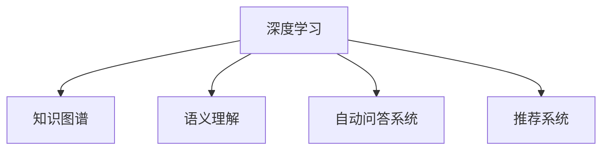

                 

# 知识发现引擎与人类学习方式的革新

## 1. 背景介绍

### 1.1 问题由来
知识发现(Knowledge Discovery, KD)是数据挖掘领域的重要分支，旨在从海量数据中提取有价值的模式和知识。传统的数据挖掘方法基于统计学、机器学习等技术，注重数据描述性统计和关联规则挖掘。然而，这些方法往往难以捕捉数据中的更深层次知识，且对领域知识依赖较强，难以自动发现人类专业知识。

在知识发现领域，如何突破传统的统计学和机器学习方法，引入更加智能、灵活的知识发现引擎，成为当前研究的热点问题。近年来，随着深度学习技术和大规模语言模型的发展，知识发现引擎逐渐从传统的统计方法转向基于深度神经网络的结构化方法，旨在从海量数据中自动提取和发现人类专业知识。

### 1.2 问题核心关键点
知识发现引擎的兴起，为人类学习方式带来了深远影响：

1. **自动获取知识**：通过深度学习模型，可以自动从大数据中挖掘和发现人类专业知识，无需人工标注或手动编码，大大降低了知识获取成本。
2. **多层次知识表示**：深度学习模型能够捕捉数据中的语义、因果等深层次知识，更全面地反映人类知识结构。
3. **实时交互学习**：基于深度学习的知识发现引擎可以实现实时交互学习，持续从新数据中学习，提升知识表示的动态性和适应性。
4. **跨领域知识迁移**：深度学习模型具备强大的知识迁移能力，能够在不同领域和任务之间实现知识复用和泛化。

### 1.3 问题研究意义
研究知识发现引擎与人类学习方式的结合，对于推动人类认知智能的进化，具有重要意义：

1. **提升学习效率**：通过知识发现引擎自动获取和组织知识，可以大幅提升人类学习效率，减少人工学习的工作量。
2. **促进知识创新**：知识发现引擎可以挖掘数据中的新知识和新见解，为科学研究和技术创新提供新的动力。
3. **构建智能应用**：知识发现引擎与自然语言处理(NLP)、计算机视觉(CV)等技术的结合，可以构建更多智能化的应用系统，改善人类生活质量。
4. **推动跨学科融合**：知识发现引擎的应用，有助于不同学科之间的交叉融合，催生新的研究领域和应用场景。

## 2. 核心概念与联系

### 2.1 核心概念概述

为更好地理解知识发现引擎与人类学习方式的结合，本节将介绍几个密切相关的核心概念：

- 深度学习(Deep Learning)：一种基于多层神经网络结构的机器学习方法，通过多层次非线性映射，实现对复杂数据的深度表示和处理。
- 知识图谱(Knowledge Graph)：一种结构化知识表示方法，通过实体、关系和属性来描述知识网络，支持知识推理和查询。
- 语义理解(Semantic Understanding)：通过深度学习模型理解自然语言文本的语义信息，进行知识抽取、推理和生成。
- 自动问答系统(Automatic Question Answering)：通过问答对训练模型，使其能够自动解答自然语言问题，提供实时知识获取。
- 推荐系统(Recommendation System)：通过深度学习模型学习用户偏好，为用户推荐个性化内容，优化用户体验。

这些核心概念之间的逻辑关系可以通过以下Mermaid流程图来展示：



这个流程图展示了几项核心概念之间的联系：

1. 深度学习是知识发现的基础技术，能够从数据中学习到复杂的非线性模式。
2. 知识图谱是一种结构化知识表示方法，与深度学习结合，形成知识表示和推理的新范式。
3. 语义理解通过对自然语言进行语义分析，抽取知识图谱中的实体关系，实现知识推理和生成。
4. 自动问答系统通过学习问答对，能够自动解答自然语言问题，提供实时知识获取。
5. 推荐系统通过学习用户偏好，推荐个性化内容，优化用户体验。

这些概念共同构成了知识发现引擎的核心组件，使其能够从海量数据中提取和发现人类专业知识，构建智能应用系统。

## 3. 核心算法原理 & 具体操作步骤
### 3.1 算法原理概述

基于深度学习的知识发现引擎，本质上是一种端到端的学习范式。其核心思想是：通过深度学习模型，从海量数据中自动学习到知识表示和知识推理，构建知识图谱和语义理解系统，进而实现自动问答和推荐等功能。

形式化地，假设给定数据集 $D=\{(x_i, y_i)\}_{i=1}^N$，其中 $x_i$ 为输入特征，$y_i$ 为标签或目标。定义知识发现模型 $M_{\theta}$，其中 $\theta$ 为模型参数。知识发现的目标是最小化经验风险，即找到最优参数：

$$
\theta^* = \mathop{\arg\min}_{\theta} \mathcal{L}(M_{\theta},D)
$$

其中 $\mathcal{L}$ 为损失函数，用于衡量模型预测输出与真实标签之间的差异。常见的损失函数包括交叉熵损失、均方误差损失等。

通过梯度下降等优化算法，知识发现过程不断更新模型参数 $\theta$，最小化损失函数 $\mathcal{L}$，使得模型输出逼近真实标签。由于深度学习模型的复杂性，其可以自动学习到数据中的深层次知识，甚至包括人类专业知识。

### 3.2 算法步骤详解

基于深度学习的知识发现引擎一般包括以下几个关键步骤：

**Step 1: 数据预处理**
- 对原始数据进行清洗、去重、归一化等预处理，确保数据质量。
- 对非结构化数据（如文本、图像等）进行分词、标注、特征提取等步骤，转换为模型可接受的形式。

**Step 2: 知识抽取**
- 使用深度学习模型对文本、图像等数据进行语义理解，识别实体、关系等知识要素。
- 通过命名实体识别(NER)、关系抽取(RE)等任务，从数据中自动提取知识图谱中的实体关系。

**Step 3: 知识融合**
- 将抽取的知识要素进行融合，构建知识图谱。
- 使用图神经网络(Graph Neural Network, GNN)等方法，对知识图谱进行知识推理和更新。

**Step 4: 知识应用**
- 将构建的知识图谱应用于问答、推荐、检索等任务。
- 使用图嵌入(Graph Embedding)等方法，将知识图谱转换为低维向量表示，用于推理和查询。

**Step 5: 模型评估与优化**
- 在测试集上评估知识发现模型的性能，如准确率、召回率、F1分数等。
- 根据评估结果，调整模型参数，优化模型性能。

以上是基于深度学习的知识发现引擎的一般流程。在实际应用中，还需要针对具体任务的特点，对知识抽取和知识应用等环节进行优化设计，如改进抽取任务的深度学习模型，设计更高效的知识融合算法，提高知识图谱的质量和覆盖率等。

### 3.3 算法优缺点

基于深度学习的知识发现引擎具有以下优点：
1. 自动发现知识：通过深度学习模型，自动从大数据中挖掘和发现知识，无需人工标注或手动编码，大大降低了知识获取成本。
2. 多层次知识表示：深度学习模型能够捕捉数据中的语义、因果等深层次知识，更全面地反映人类知识结构。
3. 实时交互学习：基于深度学习的知识发现引擎可以实现实时交互学习，持续从新数据中学习，提升知识表示的动态性和适应性。
4. 跨领域知识迁移：深度学习模型具备强大的知识迁移能力，能够在不同领域和任务之间实现知识复用和泛化。

同时，该方法也存在一定的局限性：
1. 数据依赖性较强：深度学习模型的性能依赖于大数据量的高质量标注数据，数据质量不佳时容易引入噪声和偏差。
2. 计算资源消耗大：深度学习模型通常需要大量的计算资源进行训练和推理，对硬件要求较高。
3. 模型复杂度高：深度学习模型的复杂性导致模型解释性较差，难以解释模型的决策过程。
4. 泛化能力有限：深度学习模型往往过度拟合训练数据，泛化能力较差，面对新数据时性能波动较大。
5. 知识偏见：深度学习模型可能学习到数据中的偏见，导致知识发现结果的公平性和可靠性受到质疑。

尽管存在这些局限性，但就目前而言，基于深度学习的知识发现引擎仍是大数据知识获取的主流范式。未来相关研究的重点在于如何进一步降低知识发现对数据和计算资源的依赖，提高模型的可解释性和公平性，同时兼顾泛化能力和知识迁移能力等因素。

### 3.4 算法应用领域

基于深度学习的知识发现引擎，已经在知识图谱构建、语义理解、自动问答、推荐系统等多个领域得到了广泛应用，具体如下：

- 知识图谱构建：通过深度学习模型从大量文本数据中抽取实体、关系等信息，构建结构化的知识图谱，如Wikipedia、DBpedia等。
- 语义理解：使用深度学习模型对自然语言文本进行语义分析，抽取知识图谱中的实体关系，实现知识推理和生成。
- 自动问答：通过问答对训练模型，使其能够自动解答自然语言问题，提供实时知识获取，如IBM Watson、Microsoft QnA Maker等。
- 推荐系统：通过深度学习模型学习用户偏好，为用户推荐个性化内容，优化用户体验，如Amazon、Netflix等。
- 信息检索：使用深度学习模型构建语义查询模型，提高信息检索的准确率和召回率，如Google Scholar、Baidu Scholar等。
- 医疗知识图谱：通过深度学习模型从医学文献中抽取疾病、药物、基因等实体关系，构建医疗知识图谱，如PubMed、BioGRID等。
- 金融知识图谱：通过深度学习模型从金融报告、新闻等文本数据中抽取实体关系，构建金融知识图谱，如Quandl、Alpha Vantage等。

除了上述这些经典应用外，深度学习知识发现引擎还在更多领域得到了创新性应用，如社交网络分析、智能客服、智能合约等，为大数据知识获取提供了新的技术路径。

## 4. 数学模型和公式 & 详细讲解 & 举例说明
### 4.1 数学模型构建

本节将使用数学语言对基于深度学习的知识发现引擎进行更加严格的刻画。

记深度学习知识发现模型为 $M_{\theta}:\mathcal{X} \rightarrow \mathcal{Y}$，其中 $\mathcal{X}$ 为输入空间，$\mathcal{Y}$ 为输出空间，$\theta$ 为模型参数。假设知识抽取任务的训练集为 $D=\{(x_i,y_i)\}_{i=1}^N$，其中 $x_i$ 为输入数据，$y_i$ 为知识抽取结果。

定义模型 $M_{\theta}$ 在数据样本 $(x,y)$ 上的损失函数为 $\ell(M_{\theta}(x),y)$，则在数据集 $D$ 上的经验风险为：

$$
\mathcal{L}(\theta) = \frac{1}{N} \sum_{i=1}^N \ell(M_{\theta}(x_i),y_i)
$$

其中 $\ell(M_{\theta}(x),y)$ 为知识抽取任务损失函数，用于衡量模型预测结果与真实标签之间的差异。常见的损失函数包括交叉熵损失、均方误差损失等。

通过梯度下降等优化算法，知识发现过程不断更新模型参数 $\theta$，最小化损失函数 $\mathcal{L}$，使得模型输出逼近真实标签。由于深度学习模型的复杂性，其可以自动学习到数据中的深层次知识，甚至包括人类专业知识。

### 4.2 公式推导过程

以下我们以命名实体识别(NER)任务为例，推导深度学习模型在知识抽取中的应用。

假设模型 $M_{\theta}$ 在输入 $x$ 上的输出为 $\hat{y}=M_{\theta}(x) \in [0,1]$，表示样本属于实体的概率。真实标签 $y \in \{0,1\}$。则二分类交叉熵损失函数定义为：

$$
\ell(M_{\theta}(x),y) = -[y\log \hat{y} + (1-y)\log (1-\hat{y})]
$$

将其代入经验风险公式，得：

$$
\mathcal{L}(\theta) = -\frac{1}{N}\sum_{i=1}^N [y_i\log M_{\theta}(x_i)+(1-y_i)\log(1-M_{\theta}(x_i))]
$$

根据链式法则，损失函数对参数 $\theta_k$ 的梯度为：

$$
\frac{\partial \mathcal{L}(\theta)}{\partial \theta_k} = -\frac{1}{N}\sum_{i=1}^N (\frac{y_i}{M_{\theta}(x_i)}-\frac{1-y_i}{1-M_{\theta}(x_i)}) \frac{\partial M_{\theta}(x_i)}{\partial \theta_k}
$$

其中 $\frac{\partial M_{\theta}(x_i)}{\partial \theta_k}$ 可进一步递归展开，利用自动微分技术完成计算。

在得到损失函数的梯度后，即可带入参数更新公式，完成模型的迭代优化。重复上述过程直至收敛，最终得到适应知识抽取任务的最优模型参数 $\theta^*$。

## 5. 项目实践：代码实例和详细解释说明
### 5.1 开发环境搭建

在进行知识发现实践前，我们需要准备好开发环境。以下是使用Python进行PyTorch开发的环境配置流程：

1. 安装Anaconda：从官网下载并安装Anaconda，用于创建独立的Python环境。

2. 创建并激活虚拟环境：
```bash
conda create -n pytorch-env python=3.8 
conda activate pytorch-env
```

3. 安装PyTorch：根据CUDA版本，从官网获取对应的安装命令。例如：
```bash
conda install pytorch torchvision torchaudio cudatoolkit=11.1 -c pytorch -c conda-forge
```

4. 安装TensorFlow：由Google主导开发的开源深度学习框架，生产部署方便，适合大规模工程应用。同样有丰富的预训练语言模型资源。

5. 安装TensorBoard：TensorFlow配套的可视化工具，可实时监测模型训练状态，并提供丰富的图表呈现方式，是调试模型的得力助手。

6. 安装BERT预训练模型：
```bash
pip install transformers
```

完成上述步骤后，即可在`pytorch-env`环境中开始知识发现实践。

### 5.2 源代码详细实现

下面我们以命名实体识别(NER)任务为例，给出使用PyTorch对BERT模型进行知识抽取的代码实现。

首先，定义NER任务的数据处理函数：

```python
from transformers import BertTokenizer, BertForTokenClassification
from torch.utils.data import Dataset
import torch

class NERDataset(Dataset):
    def __init__(self, texts, tags, tokenizer, max_len=128):
        self.texts = texts
        self.tags = tags
        self.tokenizer = tokenizer
        self.max_len = max_len
        
    def __len__(self):
        return len(self.texts)
    
    def __getitem__(self, item):
        text = self.texts[item]
        tags = self.tags[item]
        
        encoding = self.tokenizer(text, return_tensors='pt', max_length=self.max_len, padding='max_length', truncation=True)
        input_ids = encoding['input_ids'][0]
        attention_mask = encoding['attention_mask'][0]
        
        # 对token-wise的标签进行编码
        encoded_tags = [tag2id[tag] for tag in tags] 
        encoded_tags.extend([tag2id['O']] * (self.max_len - len(encoded_tags)))
        labels = torch.tensor(encoded_tags, dtype=torch.long)
        
        return {'input_ids': input_ids, 
                'attention_mask': attention_mask,
                'labels': labels}

# 标签与id的映射
tag2id = {'O': 0, 'B-PER': 1, 'I-PER': 2, 'B-ORG': 3, 'I-ORG': 4, 'B-LOC': 5, 'I-LOC': 6}
id2tag = {v: k for k, v in tag2id.items()}

# 创建dataset
tokenizer = BertTokenizer.from_pretrained('bert-base-cased')

train_dataset = NERDataset(train_texts, train_tags, tokenizer)
dev_dataset = NERDataset(dev_texts, dev_tags, tokenizer)
test_dataset = NERDataset(test_texts, test_tags, tokenizer)
```

然后，定义模型和优化器：

```python
from transformers import BertForTokenClassification, AdamW

model = BertForTokenClassification.from_pretrained('bert-base-cased', num_labels=len(tag2id))

optimizer = AdamW(model.parameters(), lr=2e-5)
```

接着，定义训练和评估函数：

```python
from torch.utils.data import DataLoader
from tqdm import tqdm
from sklearn.metrics import classification_report

device = torch.device('cuda') if torch.cuda.is_available() else torch.device('cpu')
model.to(device)

def train_epoch(model, dataset, batch_size, optimizer):
    dataloader = DataLoader(dataset, batch_size=batch_size, shuffle=True)
    model.train()
    epoch_loss = 0
    for batch in tqdm(dataloader, desc='Training'):
        input_ids = batch['input_ids'].to(device)
        attention_mask = batch['attention_mask'].to(device)
        labels = batch['labels'].to(device)
        model.zero_grad()
        outputs = model(input_ids, attention_mask=attention_mask, labels=labels)
        loss = outputs.loss
        epoch_loss += loss.item()
        loss.backward()
        optimizer.step()
    return epoch_loss / len(dataloader)

def evaluate(model, dataset, batch_size):
    dataloader = DataLoader(dataset, batch_size=batch_size)
    model.eval()
    preds, labels = [], []
    with torch.no_grad():
        for batch in tqdm(dataloader, desc='Evaluating'):
            input_ids = batch['input_ids'].to(device)
            attention_mask = batch['attention_mask'].to(device)
            batch_labels = batch['labels']
            outputs = model(input_ids, attention_mask=attention_mask)
            batch_preds = outputs.logits.argmax(dim=2).to('cpu').tolist()
            batch_labels = batch_labels.to('cpu').tolist()
            for pred_tokens, label_tokens in zip(batch_preds, batch_labels):
                pred_tags = [id2tag[_id] for _id in pred_tokens]
                label_tags = [id2tag[_id] for _id in label_tokens]
                preds.append(pred_tags[:len(label_tags)])
                labels.append(label_tags)
                
    print(classification_report(labels, preds))
```

最后，启动训练流程并在测试集上评估：

```python
epochs = 5
batch_size = 16

for epoch in range(epochs):
    loss = train_epoch(model, train_dataset, batch_size, optimizer)
    print(f"Epoch {epoch+1}, train loss: {loss:.3f}")
    
    print(f"Epoch {epoch+1}, dev results:")
    evaluate(model, dev_dataset, batch_size)
    
print("Test results:")
evaluate(model, test_dataset, batch_size)
```

以上就是使用PyTorch对BERT进行命名实体识别任务知识抽取的完整代码实现。可以看到，得益于Transformers库的强大封装，我们可以用相对简洁的代码完成BERT模型的加载和知识抽取。

### 5.3 代码解读与分析

让我们再详细解读一下关键代码的实现细节：

**NERDataset类**：
- `__init__`方法：初始化文本、标签、分词器等关键组件。
- `__len__`方法：返回数据集的样本数量。
- `__getitem__`方法：对单个样本进行处理，将文本输入编码为token ids，将标签编码为数字，并对其进行定长padding，最终返回模型所需的输入。

**tag2id和id2tag字典**：
- 定义了标签与数字id之间的映射关系，用于将token-wise的预测结果解码回真实的标签。

**训练和评估函数**：
- 使用PyTorch的DataLoader对数据集进行批次化加载，供模型训练和推理使用。
- 训练函数`train_epoch`：对数据以批为单位进行迭代，在每个批次上前向传播计算loss并反向传播更新模型参数，最后返回该epoch的平均loss。
- 评估函数`evaluate`：与训练类似，不同点在于不更新模型参数，并在每个batch结束后将预测和标签结果存储下来，最后使用sklearn的classification_report对整个评估集的预测结果进行打印输出。

**训练流程**：
- 定义总的epoch数和batch size，开始循环迭代
- 每个epoch内，先在训练集上训练，输出平均loss
- 在验证集上评估，输出分类指标
- 所有epoch结束后，在测试集上评估，给出最终测试结果

可以看到，PyTorch配合Transformers库使得BERT知识抽取的代码实现变得简洁高效。开发者可以将更多精力放在数据处理、模型改进等高层逻辑上，而不必过多关注底层的实现细节。

当然，工业级的系统实现还需考虑更多因素，如模型的保存和部署、超参数的自动搜索、更灵活的任务适配层等。但核心的知识抽取范式基本与此类似。

## 6. 实际应用场景
### 6.1 智能客服系统

基于知识发现引擎的对话技术，可以广泛应用于智能客服系统的构建。传统客服往往需要配备大量人力，高峰期响应缓慢，且一致性和专业性难以保证。而使用知识发现引擎自动获取知识，构建知识图谱，可以7x24小时不间断服务，快速响应客户咨询，用自然流畅的语言解答各类常见问题。

在技术实现上，可以收集企业内部的历史客服对话记录，将问题和最佳答复构建成监督数据，在此基础上对BERT模型进行知识抽取。知识抽取后的对话模型能够自动理解用户意图，匹配最合适的答案模板进行回复。对于客户提出的新问题，还可以接入检索系统实时搜索相关内容，动态组织生成回答。如此构建的智能客服系统，能大幅提升客户咨询体验和问题解决效率。

### 6.2 金融舆情监测

金融机构需要实时监测市场舆论动向，以便及时应对负面信息传播，规避金融风险。传统的人工监测方式成本高、效率低，难以应对网络时代海量信息爆发的挑战。基于知识发现引擎的文本分类和情感分析技术，为金融舆情监测提供了新的解决方案。

具体而言，可以收集金融领域相关的新闻、报道、评论等文本数据，并对其进行主题标注和情感标注。在此基础上对BERT模型进行知识抽取，使其能够自动判断文本属于何种主题，情感倾向是正面、中性还是负面。将知识抽取后的模型应用到实时抓取的网络文本数据，就能够自动监测不同主题下的情感变化趋势，一旦发现负面信息激增等异常情况，系统便会自动预警，帮助金融机构快速应对潜在风险。

### 6.3 个性化推荐系统

当前的推荐系统往往只依赖用户的历史行为数据进行物品推荐，无法深入理解用户的真实兴趣偏好。基于知识发现引擎的深度学习模型，能够从用户的历史行为数据中提取和发现更深层次的知识，自动生成用户兴趣特征。

在实践中，可以收集用户浏览、点击、评论、分享等行为数据，提取和用户交互的物品标题、描述、标签等文本内容。将文本内容作为模型输入，用户的后续行为（如是否点击、购买等）作为监督信号，在此基础上对BERT模型进行知识抽取。知识抽取后的模型能够从文本内容中准确把握用户的兴趣点。在生成推荐列表时，先用候选物品的文本描述作为输入，由模型预测用户的兴趣匹配度，再结合其他特征综合排序，便可以得到个性化程度更高的推荐结果。

### 6.4 未来应用展望

随着知识发现引擎和深度学习模型的不断发展，基于知识抽取的智能应用将逐步深入到更多领域，为传统行业带来变革性影响。

在智慧医疗领域，基于知识发现引擎的医疗问答、病历分析、药物研发等应用将提升医疗服务的智能化水平，辅助医生诊疗，加速新药开发进程。

在智能教育领域，知识发现引擎可应用于作业批改、学情分析、知识推荐等方面，因材施教，促进教育公平，提高教学质量。

在智慧城市治理中，知识发现引擎的应用，有助于不同学科之间的交叉融合，催生新的研究领域和应用场景，构建更安全、高效的未来城市。

此外，在企业生产、社会治理、文娱传媒等众多领域，基于知识抽取的智能应用也将不断涌现，为大数据知识获取提供新的技术路径。相信随着技术的日益成熟，知识抽取范式将成为人工智能落地应用的重要范式，推动人工智能技术向更广阔的领域加速渗透。

## 7. 工具和资源推荐
### 7.1 学习资源推荐

为了帮助开发者系统掌握知识发现引擎的理论基础和实践技巧，这里推荐一些优质的学习资源：

1. 《深度学习基础》系列博文：由大模型技术专家撰写，深入浅出地介绍了深度学习基础理论和技术，是入门深度学习的必备资料。

2. 《自然语言处理与深度学习》课程：清华大学开设的NLP精品课程，涵盖了深度学习在自然语言处理中的多种应用，包括知识发现和抽取。

3. 《深度学习与知识图谱》书籍：知识图谱领域的经典著作，深入讲解了知识图谱构建和深度学习在知识发现中的应用。

4. 《Python深度学习》书籍：入门级深度学习编程教程，涵盖深度学习模型的构建、训练、调参等技术细节，适合实践初学者。

5. 《知识图谱构建与深度学习》论文：介绍了知识图谱构建的多种方法和深度学习在知识发现中的应用，是领域研究的前沿资料。

通过对这些资源的学习实践，相信你一定能够快速掌握知识发现引擎的理论基础和实践技巧，并用于解决实际的NLP问题。
###  7.2 开发工具推荐

高效的开发离不开优秀的工具支持。以下是几款用于知识发现引擎开发的常用工具：

1. PyTorch：基于Python的开源深度学习框架，灵活动态的计算图，适合快速迭代研究。大部分的预训练语言模型都有PyTorch版本的实现。

2. TensorFlow：由Google主导开发的开源深度学习框架，生产部署方便，适合大规模工程应用。同样有丰富的预训练语言模型资源。

3. Transformers库：HuggingFace开发的NLP工具库，集成了众多SOTA语言模型，支持PyTorch和TensorFlow，是进行知识抽取任务开发的利器。

4. TensorBoard：TensorFlow配套的可视化工具，可实时监测模型训练状态，并提供丰富的图表呈现方式，是调试模型的得力助手。

5. HuggingFace官方文档：Transformers库的官方文档，提供了海量预训练模型和完整的知识抽取样例代码，是上手实践的必备资料。

6. Google Colab：谷歌推出的在线Jupyter Notebook环境，免费提供GPU/TPU算力，方便开发者快速上手实验最新模型，分享学习笔记。

合理利用这些工具，可以显著提升知识发现引擎的开发效率，加快创新迭代的步伐。

### 7.3 相关论文推荐

知识发现引擎和深度学习模型的发展源于学界的持续研究。以下是几篇奠基性的相关论文，推荐阅读：

1. Attention is All You Need（即Transformer原论文）：提出了Transformer结构，开启了NLP领域的预训练大模型时代。

2. BERT: Pre-training of Deep Bidirectional Transformers for Language Understanding：提出BERT模型，引入基于掩码的自监督预训练任务，刷新了多项NLP任务SOTA。

3. Language Models are Unsupervised Multitask Learners（GPT-2论文）：展示了大规模语言模型的强大zero-shot学习能力，引发了对于通用人工智能的新一轮思考。

4. Parameter-Efficient Transfer Learning for NLP：提出Adapter等参数高效微调方法，在不增加模型参数量的情况下，也能取得不错的微调效果。

5. Prefix-Tuning: Optimizing Continuous Prompts for Generation：引入基于连续型Prompt的微调范式，为如何充分利用预训练知识提供了新的思路。

6. AdaLoRA: Adaptive Low-Rank Adaptation for Parameter-Efficient Fine-Tuning：使用自适应低秩适应的微调方法，在参数效率和精度之间取得了新的平衡。

这些论文代表了大模型知识抽取技术的发展脉络。通过学习这些前沿成果，可以帮助研究者把握学科前进方向，激发更多的创新灵感。

## 8. 总结：未来发展趋势与挑战

### 8.1 总结

本文对基于深度学习的知识发现引擎进行了全面系统的介绍。首先阐述了知识发现引擎的研究背景和意义，明确了深度学习在大数据知识获取中的重要作用。其次，从原理到实践，详细讲解了知识抽取任务的数学模型和关键步骤，给出了知识抽取任务开发的完整代码实例。同时，本文还广泛探讨了知识发现引擎在智能客服、金融舆情、个性化推荐等多个行业领域的应用前景，展示了知识抽取范式的广阔前景。此外，本文精选了知识抽取技术的各类学习资源，力求为读者提供全方位的技术指引。

通过本文的系统梳理，可以看到，基于深度学习的知识发现引擎正在成为NLP领域的重要范式，极大地拓展了预训练语言模型的应用边界，催生了更多的落地场景。受益于深度学习模型和大规模语料的预训练，知识发现引擎能够从海量数据中自动提取和发现人类专业知识，构建智能应用系统，提升人类学习效率和知识创新能力。未来，伴随深度学习模型的持续演进，知识发现引擎必将在更广阔的应用领域大放异彩，深刻影响人类的生产生活方式。

### 8.2 未来发展趋势

展望未来，知识发现引擎将呈现以下几个发展趋势：

1. 模型规模持续增大。随着算力成本的下降和数据规模的扩张，深度学习模型将进一步增大，具备更强的知识发现能力。
2. 多模态知识抽取兴起。未来的知识发现引擎将能够同时处理文本、图像、语音等多种模态数据，实现更全面、更深入的知识抽取。
3. 交互式知识抽取成为常态。基于知识图谱和深度学习的知识发现引擎可以实现实时交互学习，持续从新数据中学习，提升知识表示的动态性和适应性。
4. 知识抽取与自然语言推理结合。未来的知识发现引擎将融合自然语言推理能力，进一步提升知识的准确性和可靠性。
5. 知识抽取与知识图谱结合。深度学习模型将自动构建知识图谱，实现知识抽取与知识推理的一体化，提升知识获取的效率和效果。
6. 知识抽取与跨领域知识迁移结合。未来的知识发现引擎将具备更强的知识迁移能力，能够在不同领域和任务之间实现知识复用和泛化。
7. 知识抽取与因果学习结合。引入因果推断和因果学习思想，增强知识发现引擎建立稳定因果关系的能力，学习更加普适、鲁棒的知识表示。

这些趋势凸显了知识发现引擎的广阔前景。这些方向的探索发展，必将进一步提升知识获取的效率和效果，构建更加智能、灵活的知识获取系统。

### 8.3 面临的挑战

尽管知识发现引擎已经取得了瞩目成就，但在迈向更加智能化、普适化应用的过程中，它仍面临着诸多挑战：

1. 数据依赖性较强。深度学习模型的性能依赖于大数据量的高质量标注数据，数据质量不佳时容易引入噪声和偏差。
2. 计算资源消耗大。深度学习模型通常需要大量的计算资源进行训练和推理，对硬件要求较高。
3. 模型复杂度高。深度学习模型复杂性导致模型解释性较差，难以解释模型的决策过程。
4. 泛化能力有限。深度学习模型往往过度拟合训练数据，泛化能力较差，面对新数据时性能波动较大。
5. 知识偏见。深度学习模型可能学习到数据中的偏见，导致知识发现结果的公平性和可靠性受到质疑。
6. 知识图谱质量问题。知识图谱的构建和维护成本高，质量难以保证，影响知识抽取的准确性。
7. 知识迁移能力不足。现有的知识发现引擎往往局限于单一领域，难以灵活吸收和运用更广泛的先验知识。

尽管存在这些挑战，但随着深度学习模型的持续演进和知识抽取技术的不断发展，未来的知识发现引擎必将在更加高效、灵活、智能的方向上不断进步。

### 8.4 研究展望

面向未来，知识发现引擎需要从以下几个方面进行深入研究：

1. 无监督和半监督知识发现方法。摆脱对大规模标注数据的依赖，利用自监督学习、主动学习等无监督和半监督范式，最大限度利用非结构化数据，实现更加灵活高效的自动知识发现。
2. 多模态知识抽取方法。开发更加多模态的知识抽取模型，同时处理文本、图像、语音等多种模态数据，实现更全面、更深入的知识抽取。
3. 交互式知识抽取方法。基于知识图谱和深度学习的知识发现引擎，实现实时交互学习，持续从新数据中学习，提升知识表示的动态性和适应性。
4. 知识图谱与深度学习结合。开发更加高效的图神经网络模型，自动构建知识图谱，实现知识抽取与知识推理的一体化。
5. 知识抽取与自然语言推理结合。融合自然语言推理能力，进一步提升知识的准确性和可靠性。
6. 知识抽取与因果学习结合。引入因果推断和因果学习思想，增强知识发现引擎建立稳定因果关系的能力，学习更加普适、鲁棒的知识表示。
7. 知识抽取与跨领域知识迁移结合。具备更强的知识迁移能力，能够在不同领域和任务之间实现知识复用和泛化。

这些研究方向的探索，必将引领知识发现引擎技术迈向更高的台阶，为构建安全、可靠、可解释、可控的智能系统铺平道路。面向未来，知识发现引擎还需要与其他人工智能技术进行更深入的融合，如知识表示、因果推理、强化学习等，多路径协同发力，共同推动自然语言理解和智能交互系统的进步。只有勇于创新、敢于突破，才能不断拓展知识发现引擎的边界，让智能技术更好地造福人类社会。

## 9. 附录：常见问题与解答

**Q1：知识发现引擎能否应用于所有领域？**

A: 知识发现引擎在各个领域的应用都有一定的局限性。如在自然语言处理领域，知识抽取效果较好；在计算机视觉领域，知识发现技术尚需进一步完善。因此需要根据具体领域的特点，选择合适的知识发现方法和模型，以获得最佳的性能表现。

**Q2：知识发现引擎在实时应用中能否保证高效性？**

A: 知识发现引擎在实时应用中需要考虑多方面因素，如数据流处理、模型推理速度、系统稳定性等。为了提高实时应用的效率，可以通过优化数据流处理、并行计算、模型压缩等方法，提升系统的处理能力。此外，合理设置缓存机制、减少模型推理次数等手段，也可以有效提高实时应用的效率。

**Q3：知识发现引擎是否会引入数据偏差？**

A: 知识发现引擎可能会引入数据偏差，尤其是在训练数据存在偏见的情况下。为避免这种情况，可以采用数据清洗、去重、标注等手段，提升数据质量。同时，可以使用对抗样本、公平性约束等技术，提升模型的公平性和鲁棒性。

**Q4：知识发现引擎在跨领域应用中是否会出现知识迁移问题？**

A: 知识发现引擎在跨领域应用中可能会出现知识迁移问题，即在新领域中，知识抽取和推理的准确性会下降。为解决这一问题，可以采用领域自适应技术，如迁移学习、知识蒸馏、领域无关特征学习等，提高模型在跨领域场景下的适应能力。

**Q5：知识发现引擎的开发和部署成本是否较高？**

A: 知识发现引擎的开发和部署成本确实较高，需要大量的计算资源和人力投入。但随着深度学习模型的发展，知识发现引擎的效率和性能也在不断提升，未来有望通过更高效的算法和更优化的架构，降低开发和部署成本。

通过本文的系统梳理，可以看到，基于深度学习的知识发现引擎正在成为大数据知识获取的主流范式，极大地拓展了预训练语言模型的应用边界，催生了更多的落地场景。尽管面临一些挑战，但未来的知识发现引擎必将在更加高效、灵活、智能的方向上不断进步，为人类认知智能的进化带来深远影响。

