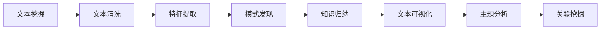

                 

# 知识发现引擎在文学研究中的创新应用

## 1. 背景介绍

### 1.1 问题由来

随着数字化、网络化时代的到来，文学作品的数字化存储和获取变得极为便捷，但随之而来的问题也愈发严峻。如何在海量文学文本数据中快速发现知识、挖掘模式、归纳规律，是文学研究面临的巨大挑战。传统的文本处理和分析方法，如关键词提取、主题分类、情感分析等，往往难以覆盖文学研究的深度和广度。

与此同时，数据挖掘和机器学习技术的迅猛发展，为文学研究的知识发现开辟了新的途径。知识发现引擎(Knowledge Discovery Engine, KDE)作为数据挖掘的重要工具，通过自动化算法提取和归纳知识，为文学研究提供了强有力的技术支撑。

本文旨在探讨知识发现引擎在文学研究中的创新应用，介绍基于大数据和机器学习技术的知识发现引擎的基本原理，以及其在文学文本分析中的具体实现和应用效果。

### 1.2 问题核心关键点

知识发现引擎在文学研究中的应用，主要体现在以下几个关键点上：

- **文本挖掘与分析**：对文学文本进行自动化处理，提取文本中的重要信息和模式。
- **知识归纳与发现**：基于统计模型和机器学习算法，挖掘文本中的规律和关系。
- **文本可视化和互动**：以图形化的方式展示挖掘结果，便于直观理解和互动探索。
- **主题分析和关联挖掘**：揭示文学作品中的主题、流派、风格等隐性知识，以及不同作品之间的关联。

## 2. 核心概念与联系

### 2.1 核心概念概述

知识发现引擎的核心概念主要包括：

- **文本挖掘(Text Mining)**：通过对文本数据进行分析，提取出有用的信息和知识，如关键词、主题、情感倾向等。
- **知识归纳(Knowledge Induction)**：在大量文本数据中发现知识模式和关系，如主题分布、作者风格、作品关联等。
- **可视化和互动(Visualization and Interaction)**：将挖掘结果以图形化的方式展示，便于人类直观理解。
- **主题分析(Thematic Analysis)**：识别文本中的主要主题，发现文本的主题结构和变化趋势。
- **关联挖掘(Association Mining)**：发现不同文本之间的关联和相似性，揭示隐性的知识关系。

### 2.2 核心概念原理和架构的 Mermaid 流程图



## 3. 核心算法原理 & 具体操作步骤

### 3.1 算法原理概述

知识发现引擎的算法原理基于数据挖掘和机器学习技术，主要包括以下几个步骤：

1. **文本清洗**：去除噪声和无用信息，提升文本的可读性和分析质量。
2. **特征提取**：将文本转换为机器学习算法可处理的形式，提取文本中的关键特征。
3. **模式发现**：使用聚类、分类、关联规则等算法，发现文本中的隐性模式和知识。
4. **知识归纳**：基于统计和规则，归纳出文本中的知识结构和关系。
5. **文本可视化**：将挖掘结果以图形化的方式展示，便于直观理解和分析。
6. **主题分析**：识别文本中的主要主题和关键词，揭示文本的隐性内容。
7. **关联挖掘**：发现文本之间的关联和相似性，揭示文本之间的隐性关系。

### 3.2 算法步骤详解

以下是知识发现引擎在文学文本分析中的详细步骤：

**Step 1: 文本收集与预处理**

- 从图书馆、档案馆、数字图书馆等收集文学文本数据。
- 对文本进行预处理，包括去除标点、统一格式、分词等。

**Step 2: 特征提取**

- 使用TF-IDF、词频统计等方法提取文本的关键词和短语。
- 应用NLP技术，如词性标注、命名实体识别等，提取文本的实体信息。
- 使用主题模型，如LDA，识别文本中的主题分布。

**Step 3: 模式发现**

- 使用聚类算法，如K-Means、层次聚类，发现文本的相似性和聚类结构。
- 应用分类算法，如朴素贝叶斯、支持向量机，识别文本的类别和情感倾向。
- 采用关联规则算法，如Apriori、FP-Growth，发现文本中的关联规则和知识模式。

**Step 4: 知识归纳**

- 应用统计分析方法，如频率统计、回归分析，归纳文本中的统计规律。
- 使用规则学习算法，如决策树、神经网络，发现文本中的逻辑关系。
- 结合领域知识，通过人工标注和专家审核，修正算法结果，确保知识的准确性。

**Step 5: 文本可视化和互动**

- 使用数据可视化工具，如Tableau、Plotly，将挖掘结果以图形化的方式展示。
- 开发交互式界面，支持用户对挖掘结果进行深入探索和互动分析。

**Step 6: 主题分析和关联挖掘**

- 应用主题模型，如LDA、LSI，揭示文本中的主要主题和关键词。
- 使用关联算法，如共现分析、社会网络分析，发现文本之间的关联和相似性。

### 3.3 算法优缺点

知识发现引擎在文学研究中的应用，具有以下优点：

- **自动化和高效性**：可以自动化地处理大量文本数据，节省人力和时间成本。
- **深度挖掘**：通过多层次的文本分析和模式发现，能够揭示文本中的隐性知识和关系。
- **可视化直观**：图形化的展示方式，便于用户直观理解文本中的知识和模式。
- **可扩展性**：可以不断扩展新的算法和技术，提升知识发现的能力和精度。

同时，知识发现引擎也存在一些局限性：

- **领域依赖**：不同领域的文本结构和特征不同，需要针对性地设计算法和技术。
- **知识准确性**：算法结果的准确性依赖于数据质量和模型选择，需要人工干预和修正。
- **解释性不足**：自动化的挖掘过程缺乏可解释性，用户难以理解和调试。
- **资源消耗**：处理大规模文本数据需要较高的计算资源和时间成本。

## 4. 数学模型和公式 & 详细讲解 & 举例说明

### 4.1 数学模型构建

知识发现引擎的数学模型主要基于统计学习和机器学习技术，包括以下几个关键模型：

- **文本清洗模型**：去除噪声和无用信息的模型，如基于规则的文本清洗模型。
- **特征提取模型**：将文本转换为特征向量的模型，如TF-IDF模型、词袋模型。
- **聚类模型**：发现文本相似性的模型，如K-Means、层次聚类模型。
- **分类模型**：识别文本类别的模型，如朴素贝叶斯模型、支持向量机模型。
- **关联规则模型**：发现文本关联规则的模型，如Apriori、FP-Growth模型。
- **主题模型**：揭示文本主题结构的模型，如LDA、LSI模型。

### 4.2 公式推导过程

以TF-IDF模型为例，推导其公式和计算过程。

设文本集合为 $\mathcal{D}=\{d_1, d_2, \ldots, d_n\}$，词汇表为 $\mathcal{V}=\{t_1, t_2, \ldots, t_m\}$，文本-词汇矩阵为 $D \in \mathbb{R}^{n \times m}$，其中 $d_i$ 表示文本 $d$ 中词汇 $t$ 的出现次数，$w_i$ 表示词汇 $t$ 在文本集合中的权重。则TF-IDF模型的公式为：

$$
w_{t,i} = \text{TF}(t,i) \times \text{IDF}(t)
$$

其中 $\text{TF}(t,i)$ 表示词汇 $t$ 在文本 $i$ 中出现的频率，$\text{IDF}(t)$ 表示词汇 $t$ 在整个文本集合中的重要性，计算公式为：

$$
\text{TF}(t,i) = \frac{d_i(t)}{\sum_{k=1}^n d_k(t)}
$$

$$
\text{IDF}(t) = \log \frac{|\mathcal{D}|}{\sum_{k=1}^n \mathbf{1}[d_k(t)>0]}
$$

在实际应用中，通常使用改进的TF-IDF模型，如TF-IDF-IDF、Okapi BM25等，以提升模型效果。

### 4.3 案例分析与讲解

以LDA主题模型为例，展示其对文学文本的分析和应用效果。

1. **数据准备**：
   - 从小说《红楼梦》中提取文本。
   - 将文本进行分词、去除停用词等预处理操作。
   - 构建文本-词汇矩阵，作为LDA模型的输入。

2. **模型训练**：
   - 使用Gibbs Sampling算法，对文本-词汇矩阵进行LDA模型训练，得到词汇和主题的分布概率。
   - 对主题进行进一步分析，发现《红楼梦》中的主要主题，如爱情、家族、命运等。

3. **结果展示**：
   - 使用Tableau等工具，将主题分布以图形化的方式展示。
   - 通过交互式界面，用户可以进一步探索和分析主题之间的关系。

4. **效果验证**：
   - 将模型结果与专家标注进行对比，验证主题发现的准确性。
   - 将主题分析结果应用于文学评论、主题研究等场景，提升研究的深度和广度。

## 5. 项目实践：代码实例和详细解释说明

### 5.1 开发环境搭建

知识发现引擎的开发环境通常包括：

1. **编程语言**：Python是最常用的开发语言，支持丰富的数据处理和分析库。
2. **数据处理库**：Pandas、NumPy等库，支持数据读取、清洗和预处理。
3. **机器学习库**：Scikit-learn、TensorFlow等库，支持多种机器学习算法的实现。
4. **数据可视化库**：Matplotlib、Seaborn、Plotly等库，支持可视化展示和交互式分析。
5. **交互式界面**：Flask、Django等Web框架，开发交互式分析界面。

以下是Python环境的安装和配置流程：

1. 安装Python和pip：
   ```bash
   sudo apt-get install python3-pip
   ```

2. 安装Pandas和NumPy：
   ```bash
   pip install pandas numpy
   ```

3. 安装Scikit-learn和TensorFlow：
   ```bash
   pip install scikit-learn tensorflow
   ```

4. 安装Matplotlib和Seaborn：
   ```bash
   pip install matplotlib seaborn
   ```

5. 安装Plotly和Flask：
   ```bash
   pip install plotly flask
   ```

### 5.2 源代码详细实现

以下是使用Python和Scikit-learn库实现TF-IDF特征提取的示例代码：

```python
import pandas as pd
from sklearn.feature_extraction.text import TfidfVectorizer

# 读取文本数据
data = pd.read_csv('text_data.csv')

# 创建TF-IDF转换器
tfidf = TfidfVectorizer(stop_words='english')

# 转换文本为TF-IDF特征
X = tfidf.fit_transform(data['text'])

# 输出TF-IDF特征矩阵
print(X)
```

### 5.3 代码解读与分析

代码中，首先使用Pandas库读取文本数据，然后使用Scikit-learn库的TfidfVectorizer类，创建TF-IDF转换器。通过调用fit_transform方法，将文本数据转换为TF-IDF特征矩阵X。

### 5.4 运行结果展示

运行上述代码，输出TF-IDF特征矩阵的维度和词汇表大小。可以使用Matplotlib库绘制特征向量的分布直方图，进一步分析特征的重要性。

## 6. 实际应用场景

### 6.1 文学作品分析

知识发现引擎在文学作品分析中具有广泛的应用场景。通过文本清洗、特征提取、聚类、分类等技术，可以揭示文本中的隐性知识，发现文本的特征和模式，提升文学研究的深度和广度。

1. **文本分类**：将文学作品分为小说、诗歌、散文等不同类别，揭示不同类型作品的特征和主题。
2. **情感分析**：分析文本的情感倾向，揭示作品中的情感表达和变化趋势。
3. **主题分析**：发现文本中的主要主题和关键词，揭示作品的主题结构和变化趋势。
4. **关联挖掘**：发现不同作品之间的关联和相似性，揭示作品之间的隐性关系。

### 6.2 文学研究中的新视角

知识发现引擎为文学研究提供了新的视角和方法，揭示了传统文本分析难以发现的知识和关系。以下是几个应用示例：

1. **跨作品对比**：通过关联挖掘技术，发现不同作品之间的相似性和关联，揭示作品之间的隐性关系。
2. **作者风格分析**：通过聚类和分类技术，发现不同作者的作品风格和主题偏好，揭示作者之间的隐性关系。
3. **文本生成与改写**：通过生成对抗网络(GAN)等技术，生成新的文本样本或改写现有文本，揭示文本生成与改写的规律和模式。

### 6.3 文学作品推荐系统

知识发现引擎还可以应用于文学作品的推荐系统中，为用户推荐符合其兴趣的文学作品。通过文本分类和聚类技术，可以发现用户喜欢的作品类型和主题，从而推荐相似的作品。

1. **用户画像建立**：通过分析用户的阅读记录和评价，建立用户画像，识别用户喜欢的作品类型和主题。
2. **作品推荐算法**：使用协同过滤、内容推荐等算法，为用户推荐符合其兴趣的文学作品。
3. **个性化推荐**：通过实时分析用户的阅读行为，动态调整推荐策略，提升推荐效果。

## 7. 工具和资源推荐

### 7.1 学习资源推荐

为了帮助开发者系统掌握知识发现引擎的理论基础和实践技巧，这里推荐一些优质的学习资源：

1. **《Data Mining and Statistical Learning》**：该书系统介绍了数据挖掘和统计学习的理论和实践，涵盖了文本挖掘、聚类、分类等多个方面。
2. **《Introduction to Information Retrieval》**：该书介绍了信息检索的基本原理和算法，包括TF-IDF、主题模型、关联规则等。
3. **Coursera《Applied Data Science with Python》课程**：由密歇根大学开设，涵盖数据处理、机器学习、数据可视化等多个方面的内容。
4. **Kaggle竞赛和项目**：Kaggle平台上有多项文本挖掘和知识发现的竞赛和项目，可供学习和实践。

### 7.2 开发工具推荐

知识发现引擎的开发工具众多，以下是几个常用的推荐：

1. **Python**：Python是数据处理和机器学习领域的主流编程语言，支持丰富的数据处理和分析库。
2. **Pandas**：Pandas是Python的数据处理库，支持数据的读取、清洗和预处理。
3. **Scikit-learn**：Scikit-learn是Python的机器学习库，支持多种机器学习算法的实现。
4. **TensorFlow**：TensorFlow是Google开发的深度学习框架，支持大规模数据处理和模型训练。
5. **Tableau**：Tableau是一款数据可视化工具，支持将数据以图形化的方式展示。
6. **Plotly**：Plotly是一款交互式可视化工具，支持动态展示和交互式分析。

### 7.3 相关论文推荐

知识发现引擎的研究涉及多个领域，以下是几篇具有代表性的相关论文，推荐阅读：

1. **Text Mining: Concepts, Methodologies, Tools and Applications**：该书全面介绍了文本挖掘的理论和应用，包括文本分类、主题模型、情感分析等多个方面。
2. **A Survey on Knowledge Discovery in Text**：该文综述了文本挖掘和知识发现的研究进展，涵盖了文本清洗、特征提取、聚类、分类等多个方面。
3. **Knowledge Discovery and Machine Learning**：该书系统介绍了知识发现和机器学习的理论和方法，包括数据挖掘、统计学习、机器学习等多个方面。

## 8. 总结：未来发展趋势与挑战

### 8.1 研究成果总结

本文介绍了知识发现引擎在文学研究中的创新应用，从文本挖掘、模式发现、知识归纳等多个方面，展示了知识发现引擎在文学文本分析中的强大功能和潜力。

通过知识发现引擎，可以自动化地处理大量文学文本数据，发现文本中的隐性知识和模式，揭示文本之间的关联和相似性，为文学研究提供新的视角和方法。知识发现引擎在文本分类、情感分析、主题分析、关联挖掘等多个场景中展示了其卓越的性能和应用效果。

### 8.2 未来发展趋势

未来，知识发现引擎在文学研究中的应用将呈现以下几个发展趋势：

1. **多模态融合**：知识发现引擎将逐步融合图像、视频、音频等多模态数据，提升对文学作品的全面理解。
2. **智能推荐系统**：知识发现引擎将与智能推荐系统结合，实现更个性化的文学作品推荐。
3. **跨领域应用**：知识发现引擎将应用于更多领域，如法律、医学、社会科学等，揭示不同领域中的隐性知识。
4. **自适应学习**：知识发现引擎将具备自适应学习能力，根据用户反馈和数据分布，动态调整模型参数和算法策略。
5. **知识图谱构建**：知识发现引擎将与知识图谱技术结合，构建更为全面和精准的知识网络，提升知识发现的深度和广度。

### 8.3 面临的挑战

尽管知识发现引擎在文学研究中展示了强大的潜力，但仍面临以下挑战：

1. **数据质量**：文学文本数据的质量和多样性直接影响知识发现的准确性，需要保证数据来源的多样性和可靠性。
2. **算法复杂度**：知识发现算法的复杂度高，需要高效的计算资源和算法优化。
3. **模型解释性**：知识发现引擎的模型缺乏可解释性，用户难以理解和调试，需要引入可解释性技术。
4. **跨领域应用**：不同领域的数据结构和特征不同，需要针对性地设计算法和技术。
5. **伦理和隐私**：文学文本数据的隐私和伦理问题需要得到充分考虑，确保数据使用的合法性和安全性。

### 8.4 研究展望

面向未来，知识发现引擎在文学研究中的应用将进一步扩展和深化。以下是几个研究展望：

1. **跨领域知识发现**：将知识发现引擎应用于跨领域研究，揭示不同领域之间的隐性知识关系。
2. **文本生成与改写**：研究文本生成与改写技术，生成新的文学文本或改写现有文本，揭示文本生成与改写的规律和模式。
3. **情感计算**：研究情感计算技术，分析文学作品中的情感表达和变化趋势，揭示情感在文学作品中的作用和影响。
4. **跨语言文本分析**：研究跨语言文本分析技术，揭示不同语言文学作品之间的相似性和差异性，提升对世界文学的全面理解。

知识发现引擎在文学研究中的应用前景广阔，具有巨大的创新潜力。未来需要更多的跨学科合作，综合利用多种技术和方法，共同推动文学研究的数字化和智能化进程。

## 9. 附录：常见问题与解答

**Q1: 知识发现引擎在文学研究中需要哪些数据和工具？**

A: 知识发现引擎在文学研究中需要大量文学文本数据，以及文本挖掘、机器学习、数据可视化等工具。具体来说，需要以下数据和工具：
1. **文学文本数据**：从图书馆、档案馆、数字图书馆等收集文学文本数据，涵盖多种文学体裁和作者。
2. **文本处理工具**：使用Pandas、NumPy等库进行数据清洗和预处理。
3. **机器学习工具**：使用Scikit-learn、TensorFlow等库进行文本分类、聚类、分类等操作。
4. **数据可视化工具**：使用Tableau、Plotly等工具进行结果可视化展示。
5. **交互式界面工具**：使用Flask、Django等Web框架开发交互式分析界面。

**Q2: 知识发现引擎在文学研究中面临哪些挑战？**

A: 知识发现引擎在文学研究中面临以下挑战：
1. **数据质量**：文学文本数据的质量和多样性直接影响知识发现的准确性，需要保证数据来源的多样性和可靠性。
2. **算法复杂度**：知识发现算法的复杂度高，需要高效的计算资源和算法优化。
3. **模型解释性**：知识发现引擎的模型缺乏可解释性，用户难以理解和调试。
4. **跨领域应用**：不同领域的数据结构和特征不同，需要针对性地设计算法和技术。
5. **伦理和隐私**：文学文本数据的隐私和伦理问题需要得到充分考虑，确保数据使用的合法性和安全性。

**Q3: 知识发现引擎在文学研究中的应用前景如何？**

A: 知识发现引擎在文学研究中的应用前景广阔，具有巨大的创新潜力。具体来说，知识发现引擎可以应用于以下几个方面：
1. **文本分类**：将文学作品分为小说、诗歌、散文等不同类别，揭示不同类型作品的特征和主题。
2. **情感分析**：分析文本的情感倾向，揭示作品中的情感表达和变化趋势。
3. **主题分析**：发现文本中的主要主题和关键词，揭示作品的主题结构和变化趋势。
4. **关联挖掘**：发现不同作品之间的关联和相似性，揭示作品之间的隐性关系。
5. **文本生成与改写**：通过生成对抗网络(GAN)等技术，生成新的文本样本或改写现有文本，揭示文本生成与改写的规律和模式。
6. **智能推荐系统**：将知识发现引擎与智能推荐系统结合，实现更个性化的文学作品推荐。

**Q4: 知识发现引擎在文学研究中的应用范例有哪些？**

A: 知识发现引擎在文学研究中的应用范例包括：
1. **文本分类**：使用聚类和分类算法，将文学作品分为小说、诗歌、散文等不同类别，揭示不同类型作品的特征和主题。
2. **情感分析**：使用情感分析算法，分析文本的情感倾向，揭示作品中的情感表达和变化趋势。
3. **主题分析**：使用主题模型，如LDA、LSI，发现文本中的主要主题和关键词，揭示作品的主题结构和变化趋势。
4. **关联挖掘**：使用关联规则算法，如Apriori、FP-Growth，发现不同作品之间的关联和相似性，揭示作品之间的隐性关系。
5. **文本生成与改写**：通过生成对抗网络(GAN)等技术，生成新的文本样本或改写现有文本，揭示文本生成与改写的规律和模式。
6. **智能推荐系统**：将知识发现引擎与智能推荐系统结合，实现更个性化的文学作品推荐。

---

作者：禅与计算机程序设计艺术 / Zen and the Art of Computer Programming

