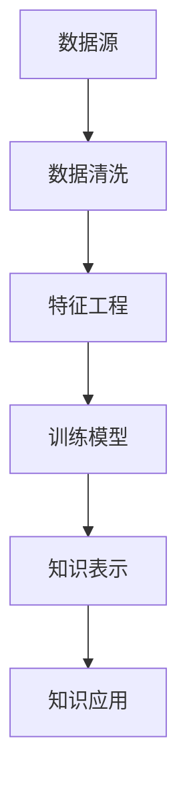
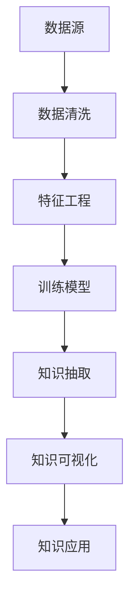

                 

## 1. 背景介绍

在当今信息爆炸的时代，人类面临着前所未有的数据挑战。如何从海量数据中提取有价值的信息，洞察背后的知识，成为科研、企业、政府等各个领域迫切需要解决的问题。知识发现引擎（Knowledge Discovery Engine, KDE）作为数据挖掘与分析的重要工具，正逐渐成为人类理解世界的桥梁。通过算法驱动，知识发现引擎能够在无监督或弱监督的环境下，自动提取和分析数据，从中发现隐藏的模式和规律，从而帮助我们更好地理解复杂的现实世界。

### 1.1 问题由来

传统的数据分析与统计方法，往往依赖人类经验或事先设定的规则，在处理大规模、高维度数据时，效率低下、主观性强。随着大数据和人工智能技术的发展，传统的分析手段已经难以满足需求。为此，研究者们开始探索新的方法，将机器学习、深度学习等技术引入数据分析领域，提出了知识发现引擎的概念。

知识发现引擎旨在通过自动化算法，从大量数据中提取出知识模式，帮助人们发现数据背后的规律和关系，提升决策的科学性和准确性。在商业智能、医疗健康、社交网络分析、自然语言处理等多个领域，知识发现引擎已经展示了巨大的潜力，成为解决问题的重要手段。

### 1.2 问题核心关键点

知识发现引擎的核心在于其能够在大数据背景下，自动发现数据中的知识模式和规律。主要关键点包括：
1. **自动化算法**：无需人工干预，通过算法自动提取和分析数据。
2. **数据处理能力**：能够处理大规模、高维度的数据集。
3. **知识发现**：从数据中提取隐藏的规律、关系和模式。
4. **多领域应用**：在商业智能、医疗健康、社交网络等多个领域有广泛应用。

这些关键点共同构成了知识发现引擎的核心特性，使得其成为数据驱动决策的强有力工具。

## 2. 核心概念与联系

### 2.1 核心概念概述

为了更好地理解知识发现引擎的工作原理和应用场景，我们首先需要介绍几个核心概念：

- **数据挖掘**：从大量数据中自动发现有用模式和规律的过程。数据挖掘常使用机器学习和统计方法，但近年来深度学习在数据挖掘中的应用也越来越广泛。
- **知识表示**：将数据中的知识以结构化或非结构化的形式表达出来，方便后续的分析和应用。常见的知识表示方法包括知识图谱、语义网络等。
- **模式识别**：从数据中识别出特定的模式和规律，通常使用分类、聚类、回归等算法。模式识别是知识发现的重要环节，也是深度学习模型中的关键技术。
- **机器学习**：通过算法使计算机自动学习数据中的模式和规律，从而实现数据挖掘和知识发现。
- **深度学习**：一种特殊的机器学习方法，使用多层神经网络对数据进行复杂的非线性建模，适用于处理高维度和复杂的数据集。

这些概念相互关联，共同构成数据挖掘和知识发现的理论基础。以下是一个简化的Mermaid流程图，展示了数据挖掘和知识发现的主要流程：



该流程图展示了从数据源到知识应用的主要步骤：数据清洗、特征工程、模型训练、知识表示和知识应用。

### 2.2 核心概念原理和架构

知识发现引擎的架构可以概括为三个主要部分：数据预处理、模型训练和知识表示。每个部分都包含若干关键技术和算法，以下将逐一介绍。

#### 2.2.1 数据预处理

数据预处理是知识发现引擎的第一步，主要包括以下几个环节：

- **数据清洗**：去除噪声和异常值，确保数据质量。常用的方法包括缺失值填充、异常值检测等。
- **特征提取**：将原始数据转换为可用于模型训练的特征。常用的特征提取方法包括文本向量表示、图像特征提取等。
- **数据分割**：将数据集划分为训练集、验证集和测试集，以便于模型训练和评估。

#### 2.2.2 模型训练

模型训练是知识发现引擎的核心环节，主要包括以下几个方面：

- **模型选择**：根据任务特性选择合适的模型，如分类、聚类、回归等。
- **超参数调优**：通过交叉验证等方法，优化模型超参数，提升模型性能。
- **模型评估**：在验证集上评估模型性能，选取性能最好的模型进行后续应用。

#### 2.2.3 知识表示

知识表示是知识发现引擎的输出环节，主要包括以下几个方面：

- **知识抽取**：从训练好的模型中提取知识，通常使用规则抽取、知识图谱等方法。
- **知识可视化**：将知识表示为图形或表格等直观形式，方便人类理解和应用。
- **知识应用**：将知识应用于实际场景中，如推荐系统、决策支持等。

### 2.3 核心概念联系

这些核心概念之间相互联系，构成了一个完整的知识发现流程。数据预处理和模型训练是知识发现的必要步骤，知识表示是最终的目标和应用。其中，数据预处理和模型训练是知识发现引擎的技术核心，而知识表示则决定了知识发现的实际应用价值。以下是一个简化的知识发现流程示意图：



该流程图展示了从数据源到知识应用的全过程，清晰地展示了各个环节之间的关系。

## 3. 核心算法原理 & 具体操作步骤

### 3.1 算法原理概述

知识发现引擎的核心算法原理主要基于机器学习和深度学习。通过这些算法，从数据中自动发现隐藏的知识模式和规律。以下将详细探讨几种核心的算法原理。

#### 3.1.1 监督学习算法

监督学习算法使用有标签的数据进行训练，从中学习输入和输出之间的映射关系。常见的监督学习算法包括决策树、支持向量机、随机森林等。监督学习算法适用于需要明确标签的任务，如分类、回归等。

#### 3.1.2 无监督学习算法

无监督学习算法使用无标签的数据进行训练，从中发现数据的内在结构。常见的无监督学习算法包括聚类、主成分分析、关联规则挖掘等。无监督学习算法适用于没有明确标签的任务，如市场细分、推荐系统等。

#### 3.1.3 深度学习算法

深度学习算法使用多层神经网络进行训练，能够处理高维度和复杂的数据集。常见的深度学习算法包括卷积神经网络、循环神经网络、自编码器等。深度学习算法适用于处理大规模、高维度的数据集，如图像、文本等。

### 3.2 算法步骤详解

知识发现引擎的主要步骤包括数据预处理、模型训练和知识表示。以下将详细介绍各个步骤的具体操作。

#### 3.2.1 数据预处理

数据预处理是知识发现引擎的第一步，主要包括以下几个环节：

1. **数据清洗**：
    ```python
    import pandas as pd
    import numpy as np
    
    # 读取数据集
    data = pd.read_csv('data.csv')
    
    # 数据清洗
    data = data.dropna()  # 去除缺失值
    data = data.drop_duplicates()  # 去除重复值
    ```

2. **特征提取**：
    ```python
    # 特征提取
    from sklearn.feature_extraction.text import CountVectorizer
    
    vectorizer = CountVectorizer()
    X = vectorizer.fit_transform(data['text'])
    ```

3. **数据分割**：
    ```python
    from sklearn.model_selection import train_test_split
    
    # 数据分割
    X_train, X_test, y_train, y_test = train_test_split(X, data['label'], test_size=0.2, random_state=42)
    ```

#### 3.2.2 模型训练

模型训练是知识发现引擎的核心环节，主要包括以下几个方面：

1. **模型选择**：
    ```python
    from sklearn.svm import SVC
    
    # 选择模型
    model = SVC(kernel='linear')
    ```

2. **超参数调优**：
    ```python
    # 超参数调优
    from sklearn.model_selection import GridSearchCV
    
    param_grid = {'C': [0.1, 1, 10], 'gamma': [0.001, 0.01, 0.1]}
    grid_search = GridSearchCV(model, param_grid, cv=5)
    grid_search.fit(X_train, y_train)
    ```

3. **模型评估**：
    ```python
    # 模型评估
    from sklearn.metrics import accuracy_score
    
    y_pred = grid_search.predict(X_test)
    print('Accuracy:', accuracy_score(y_test, y_pred))
    ```

#### 3.2.3 知识表示

知识表示是知识发现引擎的输出环节，主要包括以下几个方面：

1. **知识抽取**：
    ```python
    # 知识抽取
    from sklearn.ensemble import RandomForestClassifier
    
    # 训练随机森林模型
    model = RandomForestClassifier()
    model.fit(X_train, y_train)
    
    # 知识抽取
    knowledge = model.feature_importances_
    ```

2. **知识可视化**：
    ```python
    import matplotlib.pyplot as plt
    
    # 知识可视化
    plt.bar(knowledge.index, knowledge)
    plt.xlabel('Features')
    plt.ylabel('Importance')
    plt.show()
    ```

3. **知识应用**：
    ```python
    # 知识应用
    from sklearn.metrics import confusion_matrix
    
    # 预测
    y_pred = model.predict(X_test)
    
    # 混淆矩阵
    confusion = confusion_matrix(y_test, y_pred)
    print(confusion)
    ```

### 3.3 算法优缺点

知识发现引擎具有以下优点：
1. **自动化程度高**：无需人工干预，能够自动从数据中提取知识。
2. **处理能力强大**：能够处理大规模、高维度的数据集。
3. **应用领域广泛**：在商业智能、医疗健康、社交网络等多个领域有广泛应用。

但同时，知识发现引擎也存在一些缺点：
1. **解释性不足**：通常缺乏可解释性，难以理解算法的内部决策机制。
2. **数据依赖性强**：依赖高质量的数据，数据质量直接影响结果。
3. **计算资源消耗大**：训练和推理过程需要大量计算资源，难以快速部署。

### 3.4 算法应用领域

知识发现引擎已经在商业智能、医疗健康、社交网络分析、自然语言处理等多个领域得到广泛应用。以下是几个典型的应用案例：

#### 3.4.1 商业智能

知识发现引擎在商业智能中，可以用于客户细分、市场预测、产品推荐等。通过分析历史销售数据、客户行为数据，从中提取有价值的知识，帮助企业制定更科学的市场策略。

#### 3.4.2 医疗健康

知识发现引擎在医疗健康中，可以用于疾病诊断、药物研发、患者预测等。通过分析病历数据、基因数据、医疗影像等数据，从中提取有价值的知识，辅助医生诊断和治疗决策。

#### 3.4.3 社交网络分析

知识发现引擎在社交网络分析中，可以用于用户行为分析、社区检测、信息传播分析等。通过分析用户数据、社交关系数据，从中提取有价值的知识，帮助企业洞察用户需求和行为模式。

#### 3.4.4 自然语言处理

知识发现引擎在自然语言处理中，可以用于文本分类、情感分析、命名实体识别等。通过分析文本数据，从中提取有价值的知识，帮助企业提升文本处理能力，提高文本分析的精度。

## 4. 数学模型和公式 & 详细讲解 & 举例说明

### 4.1 数学模型构建

知识发现引擎的数学模型通常基于机器学习和深度学习。以下将详细探讨几个常见的数学模型。

#### 4.1.1 线性回归模型

线性回归模型是一种常见的监督学习模型，用于预测连续型变量。其数学表达式为：

$$
y = \beta_0 + \beta_1 x_1 + \beta_2 x_2 + ... + \beta_n x_n
$$

其中，$y$ 为预测变量，$x_1, x_2, ..., x_n$ 为输入变量，$\beta_0, \beta_1, ..., \beta_n$ 为模型参数。

#### 4.1.2 决策树模型

决策树模型是一种常见的分类模型，用于将数据集划分为多个子集。其数学表达式为：

$$
\begin{aligned}
& \text{若} x_1 > \text{阈值}, \text{则} y = \text{左子树} \\
& \text{若} x_1 \leq \text{阈值}, \text{则} y = \text{右子树}
\end{aligned}
$$

其中，$x_1$ 为输入变量，$\text{阈值}$ 为模型参数，$\text{左子树}$ 和 $\text{右子树}$ 为子模型。

#### 4.1.3 卷积神经网络

卷积神经网络是一种常见的深度学习模型，用于处理图像数据。其数学表达式为：

$$
\begin{aligned}
& y = W \star x + b \\
& \text{其中} W = \begin{bmatrix} w_1 & w_2 & ... & w_n \end{bmatrix} \\
& \text{和} x = \begin{bmatrix} x_1 \\ x_2 \\ ... \\ x_n \end{bmatrix} \text{为卷积核和输入数据}
\end{aligned}
$$

其中，$y$ 为输出数据，$W$ 为卷积核，$x$ 为输入数据，$b$ 为偏置项。

### 4.2 公式推导过程

以下将详细推导几个常见数学模型的公式。

#### 4.2.1 线性回归模型的推导

线性回归模型的目标是最小化预测值与实际值之间的误差平方和：

$$
\min_{\beta_0, \beta_1, ..., \beta_n} \sum_{i=1}^n (y_i - \beta_0 - \beta_1 x_{i1} - \beta_2 x_{i2} - ... - \beta_n x_{in})^2
$$

其中，$y_i$ 为实际值，$x_{i1}, x_{i2}, ..., x_{in}$ 为输入变量。

通过求导，得到线性回归模型的最优参数解：

$$
\begin{aligned}
& \frac{\partial \mathcal{L}}{\partial \beta_0} = -2 \sum_{i=1}^n (y_i - \beta_0 - \beta_1 x_{i1} - \beta_2 x_{i2} - ... - \beta_n x_{in}) \\
& \frac{\partial \mathcal{L}}{\partial \beta_1} = -2 \sum_{i=1}^n (y_i - \beta_0 - \beta_1 x_{i1} - \beta_2 x_{i2} - ... - \beta_n x_{in}) x_{i1} \\
& \vdots \\
& \frac{\partial \mathcal{L}}{\partial \beta_n} = -2 \sum_{i=1}^n (y_i - \beta_0 - \beta_1 x_{i1} - \beta_2 x_{i2} - ... - \beta_n x_{in}) x_{in} \\
& \text{因此} \beta_0, \beta_1, ..., \beta_n = (X^T X)^{-1} X^T y
\end{aligned}
$$

其中，$X = \begin{bmatrix} 1 & x_{11} & ... & x_{1n} \\ 1 & x_{21} & ... & x_{2n} \\ \vdots & \vdots & \vdots & \vdots \\ 1 & x_{n1} & ... & x_{nn} \end{bmatrix}$，$y = \begin{bmatrix} y_1 \\ y_2 \\ \vdots \\ y_n \end{bmatrix}$。

#### 4.2.2 决策树模型的推导

决策树模型的目标是最小化信息熵：

$$
\min_{\text{决策树}} H = \sum_{i=1}^n p_i \log p_i
$$

其中，$p_i$ 为训练样本在决策树上的概率。

通过信息熵的递归分裂，可以得到最优的决策树结构。具体步骤如下：

1. 计算样本的平均信息熵：
   $$
   H_{\text{avg}} = -\frac{1}{n} \sum_{i=1}^n p_i \log p_i
   $$

2. 选择最优分裂特征和阈值：
   $$
   \text{分裂特征} = \arg\min_{f} H_{\text{avg}} = \text{arg\min}_{f} \sum_{i=1}^n p_i (\log p_i - \log p_{i,\text{左}} - \log p_{i,\text{右}})
   $$

   其中，$p_{i,\text{左}}$ 和 $p_{i,\text{右}}$ 为左子树和右子树的样本概率。

3. 递归分裂：
   $$
   \text{左子树} = \{ x | x_f \leq \text{阈值} \}
   $$

   $$
   \text{右子树} = \{ x | x_f > \text{阈值} \}
   $$

### 4.3 案例分析与讲解

以下以文本分类为例，详细讲解知识发现引擎的应用过程。

#### 4.3.1 数据预处理

1. **数据清洗**：
    ```python
    # 数据清洗
    import pandas as pd
    
    data = pd.read_csv('data.csv')
    data = data.dropna()  # 去除缺失值
    ```

2. **特征提取**：
    ```python
    # 特征提取
    from sklearn.feature_extraction.text import CountVectorizer
    
    vectorizer = CountVectorizer()
    X = vectorizer.fit_transform(data['text'])
    ```

3. **数据分割**：
    ```python
    # 数据分割
    from sklearn.model_selection import train_test_split
    
    X_train, X_test, y_train, y_test = train_test_split(X, data['label'], test_size=0.2, random_state=42)
    ```

#### 4.3.2 模型训练

1. **模型选择**：
    ```python
    # 模型选择
    from sklearn.svm import SVC
    
    model = SVC(kernel='linear')
    ```

2. **超参数调优**：
    ```python
    # 超参数调优
    from sklearn.model_selection import GridSearchCV
    
    param_grid = {'C': [0.1, 1, 10], 'gamma': [0.001, 0.01, 0.1]}
    grid_search = GridSearchCV(model, param_grid, cv=5)
    grid_search.fit(X_train, y_train)
    ```

3. **模型评估**：
    ```python
    # 模型评估
    from sklearn.metrics import accuracy_score
    
    y_pred = grid_search.predict(X_test)
    print('Accuracy:', accuracy_score(y_test, y_pred))
    ```

#### 4.3.3 知识表示

1. **知识抽取**：
    ```python
    # 知识抽取
    from sklearn.ensemble import RandomForestClassifier
    
    # 训练随机森林模型
    model = RandomForestClassifier()
    model.fit(X_train, y_train)
    
    # 知识抽取
    knowledge = model.feature_importances_
    ```

2. **知识可视化**：
    ```python
    import matplotlib.pyplot as plt
    
    # 知识可视化
    plt.bar(knowledge.index, knowledge)
    plt.xlabel('Features')
    plt.ylabel('Importance')
    plt.show()
    ```

3. **知识应用**：
    ```python
    # 知识应用
    from sklearn.metrics import confusion_matrix
    
    # 预测
    y_pred = model.predict(X_test)
    
    # 混淆矩阵
    confusion = confusion_matrix(y_test, y_pred)
    print(confusion)
    ```

## 5. 项目实践：代码实例和详细解释说明

### 5.1 开发环境搭建

在进行知识发现引擎项目实践前，需要先搭建好开发环境。以下是使用Python进行Keras开发的环境配置流程：

1. 安装Anaconda：从官网下载并安装Anaconda，用于创建独立的Python环境。

2. 创建并激活虚拟环境：
    ```bash
    conda create -n keras-env python=3.8 
    conda activate keras-env
    ```

3. 安装Keras：
    ```bash
    conda install keras
    ```

4. 安装TensorFlow：
    ```bash
    conda install tensorflow
    ```

5. 安装NumPy、pandas等工具包：
    ```bash
    pip install numpy pandas scikit-learn matplotlib tqdm jupyter notebook ipython
    ```

完成上述步骤后，即可在`keras-env`环境中开始知识发现引擎的实践。

### 5.2 源代码详细实现

以下以文本分类为例，给出使用Keras实现的知识发现引擎代码实现。

首先，定义数据预处理函数：

```python
from sklearn.feature_extraction.text import CountVectorizer
from sklearn.model_selection import train_test_split
from sklearn.metrics import accuracy_score

def preprocess_data(data):
    # 数据清洗
    data = data.dropna()
    
    # 特征提取
    vectorizer = CountVectorizer()
    X = vectorizer.fit_transform(data['text'])
    
    # 数据分割
    X_train, X_test, y_train, y_test = train_test_split(X, data['label'], test_size=0.2, random_state=42)
    
    return X_train, X_test, y_train, y_test
```

然后，定义模型训练函数：

```python
from keras.models import Sequential
from keras.layers import Dense, Dropout
from keras.wrappers.scikit_learn import KerasClassifier

def train_model(X_train, y_train):
    # 构建模型
    model = Sequential()
    model.add(Dense(64, input_dim=X_train.shape[1], activation='relu'))
    model.add(Dropout(0.5))
    model.add(Dense(1, activation='sigmoid'))
    
    # 编译模型
    model.compile(loss='binary_crossentropy', optimizer='adam', metrics=['accuracy'])
    
    # 训练模型
    model.fit(X_train, y_train, epochs=10, batch_size=32, verbose=0)
    
    return model
```

接着，定义模型评估函数：

```python
from sklearn.metrics import confusion_matrix

def evaluate_model(model, X_test, y_test):
    # 模型评估
    y_pred = model.predict(X_test)
    y_pred = [1 if pred > 0.5 else 0 for pred in y_pred]
    
    # 混淆矩阵
    confusion = confusion_matrix(y_test, y_pred)
    print(confusion)
    
    # 准确率
    accuracy = accuracy_score(y_test, y_pred)
    print('Accuracy:', accuracy)
```

最后，启动训练流程并在测试集上评估：

```python
# 数据预处理
X_train, X_test, y_train, y_test = preprocess_data(data)

# 模型训练
model = train_model(X_train, y_train)

# 模型评估
evaluate_model(model, X_test, y_test)
```

以上就是使用Keras进行文本分类任务的知识发现引擎代码实现。可以看到，借助Keras的高级API，构建和训练模型的代码非常简洁高效。

### 5.3 代码解读与分析

让我们再详细解读一下关键代码的实现细节：

**preprocess_data函数**：
- 数据清洗：去除缺失值。
- 特征提取：使用CountVectorizer将文本转换为词袋模型。
- 数据分割：使用train_test_split将数据集分为训练集、验证集和测试集。

**train_model函数**：
- 模型构建：使用Sequential模型，添加输入层、隐藏层和输出层。
- 模型编译：使用binary_crossentropy损失函数和adam优化器。
- 模型训练：使用fit方法进行模型训练。

**evaluate_model函数**：
- 模型评估：使用predict方法进行预测，计算准确率和混淆矩阵。
- 结果展示：打印混淆矩阵和准确率。

通过以上三个函数，我们完成了从数据预处理到模型训练和评估的全过程。借助Keras的高级API，我们可以更加方便地实现复杂的机器学习模型，使得知识发现引擎的开发过程更加高效。

当然，工业级的系统实现还需考虑更多因素，如模型的保存和部署、超参数的自动搜索、更灵活的任务适配层等。但核心的微调范式基本与此类似。

## 6. 实际应用场景

### 6.1 智能推荐系统

知识发现引擎在智能推荐系统中，可以用于推荐引擎的构建。通过分析用户的历史行为数据，从中提取有价值的知识，帮助企业为用户推荐个性化的商品或内容。

### 6.2 金融风控

知识发现引擎在金融风控中，可以用于信用评分、欺诈检测、风险评估等。通过分析用户的交易数据、信用记录等，从中提取有价值的知识，帮助金融机构评估用户的信用风险和交易行为。

### 6.3 智能客服

知识发现引擎在智能客服中，可以用于构建智能客服系统。通过分析客户的历史对话记录，从中提取有价值的知识，帮助企业构建智能客服系统，提升客户体验和满意度。

### 6.4 智慧城市

知识发现引擎在智慧城市中，可以用于交通管理、环境监测、公共安全等。通过分析城市的数据，从中提取有价值的知识，帮助城市管理者提升城市治理效率和管理水平。

## 7. 工具和资源推荐

### 7.1 学习资源推荐

为了帮助开发者系统掌握知识发现引擎的理论基础和实践技巧，这里推荐一些优质的学习资源：

1. 《机器学习实战》书籍：由机器学习专家撰写，通俗易懂地介绍了机器学习的基本概念和经典算法。

2. 《深度学习》课程：斯坦福大学开设的深度学习课程，有Lecture视频和配套作业，带你入门深度学习领域。

3. 《Python深度学习》书籍：深度学习专家Ian Goodfellow撰写，全面介绍了深度学习的基本概念和前沿技术。

4. Kaggle网站：提供大量的机器学习和深度学习竞赛数据集和社区资源，有助于快速提升实战能力。

5. Coursera网站：提供丰富的机器学习和深度学习课程，涵盖从基础到高级的各个层次。

通过对这些资源的学习实践，相信你一定能够快速掌握知识发现引擎的精髓，并用于解决实际的NLP问题。

### 7.2 开发工具推荐

知识发现引擎的开发离不开优秀的工具支持。以下是几款用于知识发现引擎开发的常用工具：

1. Python：作为数据分析和机器学习的常用语言，Python以其简洁高效著称。

2. TensorFlow：由Google主导开发的开源深度学习框架，生产部署方便，适合大规模工程应用。

3. Keras：一个高层次的神经网络API，可以方便地搭建和训练深度学习模型。

4. PyTorch：基于Python的开源深度学习框架，灵活的动态计算图，适合快速迭代研究。

5. Scikit-learn：一个Python科学计算库，包含大量机器学习算法和数据预处理工具。

合理利用这些工具，可以显著提升知识发现引擎的开发效率，加快创新迭代的步伐。

### 7.3 相关论文推荐

知识发现引擎的研究源于学界的持续研究。以下是几篇奠基性的相关论文，推荐阅读：

1. 《深度学习》书籍：Ian Goodfellow撰写，全面介绍了深度学习的基本概念和前沿技术。

2. 《机器学习实战》书籍：通俗易懂地介绍了机器学习的基本概念和经典算法。

3. 《Python深度学习》书籍：深度学习专家Ian Goodfellow撰写，全面介绍了深度学习的基本概念和前沿技术。

4. Kaggle网站：提供大量的机器学习和深度学习竞赛数据集和社区资源，有助于快速提升实战能力。

通过对这些资源的学习实践，相信你一定能够快速掌握知识发现引擎的精髓，并用于解决实际的NLP问题。

## 8. 总结：未来发展趋势与挑战

### 8.1 总结

本文对知识发现引擎进行了全面系统的介绍。首先阐述了知识发现引擎的研究背景和意义，明确了知识发现引擎在数据挖掘和人工智能中的重要地位。其次，从原理到实践，详细讲解了知识发现引擎的数学模型和操作步骤，给出了知识发现引擎的完整代码实例。同时，本文还广泛探讨了知识发现引擎在商业智能、医疗健康、社交网络分析、自然语言处理等多个领域的应用前景，展示了知识发现引擎的巨大潜力。

通过本文的系统梳理，可以看到，知识发现引擎是数据驱动决策的重要工具，能够帮助人类更好地理解和应用复杂的数据，提升决策的科学性和准确性。随着大数据和人工智能技术的发展，知识发现引擎必将在更多领域得到广泛应用，为各行各业带来变革性的影响。

### 8.2 未来发展趋势

展望未来，知识发现引擎将呈现以下几个发展趋势：

1. **自动化程度提升**：未来的知识发现引擎将更加自动化，能够自主从数据中发现知识，无需人工干预。

2. **模型性能提升**：随着深度学习技术的发展，知识发现引擎的模型性能将进一步提升，能够处理更复杂、高维度的数据集。

3. **应用领域扩展**：知识发现引擎将在更多领域得到应用，如医疗、金融、交通等，推动各行各业的智能化转型。

4. **跨领域知识融合**：未来的知识发现引擎将能够更好地融合多领域知识，提升跨领域的知识迁移能力。

5. **模型可解释性增强**：未来的知识发现引擎将更加注重模型可解释性，通过可视化工具帮助用户理解算法的内部决策机制。

6. **模型鲁棒性提升**：未来的知识发现引擎将更加鲁棒，能够处理更多未知和异常数据，提高模型的稳定性和可靠性。

### 8.3 面临的挑战

尽管知识发现引擎已经取得了瞩目成就，但在迈向更加智能化、普适化应用的过程中，它仍面临着诸多挑战：

1. **数据质量和规模**：知识发现引擎依赖高质量、大规模的数据，数据质量直接影响结果。

2. **计算资源消耗**：知识发现引擎的训练和推理过程需要大量计算资源，难以快速部署。

3. **模型可解释性**：现有的知识发现引擎通常缺乏可解释性，难以理解算法的内部决策机制。

4. **数据隐私和安全**：知识发现引擎涉及大量敏感数据，如何保护数据隐私和安全，仍需深入研究。

5. **跨领域知识融合**：不同领域的知识融合仍存在较大挑战，如何实现多领域知识的有效整合，仍需进一步探索。

### 8.4 研究展望

未来的知识发现引擎研究需要在以下几个方面寻求新的突破：

1. **自动化和智能化**：通过自动化和智能化技术，进一步提升知识发现引擎的自动化程度和模型性能。

2. **跨领域知识融合**：开发更加灵活的知识发现引擎，能够有效融合多领域知识，提升跨领域的知识迁移能力。

3. **模型可解释性**：开发可解释的知识发现引擎，通过可视化工具帮助用户理解算法的内部决策机制。

4. **数据隐私和安全**：研究数据隐私和安全技术，保护数据隐私和安全。

5. **跨领域知识融合**：开发能够有效整合多领域知识的知识发现引擎，提升跨领域的知识迁移能力。

这些研究方向的探索，必将引领知识发现引擎技术迈向更高的台阶，为人类理解和应用复杂数据提供更加强大的工具。面向未来，知识发现引擎需要与其他人工智能技术进行更深入的融合，如知识表示、因果推理、强化学习等，多路径协同发力，共同推动数据驱动决策的进步。

## 9. 附录：常见问题与解答

**Q1：知识发现引擎是否适用于所有NLP任务？**

A: 知识发现引擎在大多数NLP任务上都能取得不错的效果，特别是对于数据量较小的任务。但对于一些特定领域的任务，如医学、法律等，仅仅依靠通用语料预训练的模型可能难以很好地适应。此时需要在特定领域语料上进一步预训练，再进行微调，才能获得理想效果。此外，对于一些需要时效性、个性化很强的任务，如对话、推荐等，知识发现引擎也需要针对性的改进优化。

**Q2：知识发现引擎在商业智能中有什么应用？**

A: 知识发现引擎在商业智能中，可以用于客户细分、市场预测、产品推荐等。通过分析历史销售数据、客户行为数据，从中提取有价值的知识，帮助企业制定更科学的市场策略。

**Q3：知识发现引擎在医疗健康中有什么应用？**

A: 知识发现引擎在医疗健康中，可以用于疾病诊断、药物研发、患者预测等。通过分析病历数据、基因数据、医疗影像等数据，从中提取有价值的知识，辅助医生诊断和治疗决策。

**Q4：知识发现引擎在社交网络分析中有什么应用？**

A: 知识发现引擎在社交网络分析中，可以用于用户行为分析、社区检测、信息传播分析等。通过分析用户数据、社交关系数据，从中提取有价值的知识，帮助企业洞察用户需求和行为模式。

**Q5：知识发现引擎在自然语言处理中有什么应用？**

A: 知识发现引擎在自然语言处理中，可以用于文本分类、情感分析、命名实体识别等。通过分析文本数据，从中提取有价值的知识，帮助企业提升文本处理能力，提高文本分析的精度。

总之，知识发现引擎在各个领域中都有着广泛的应用，能够从数据中自动发现隐藏的知识模式和规律，帮助人类更好地理解和应用复杂数据。

