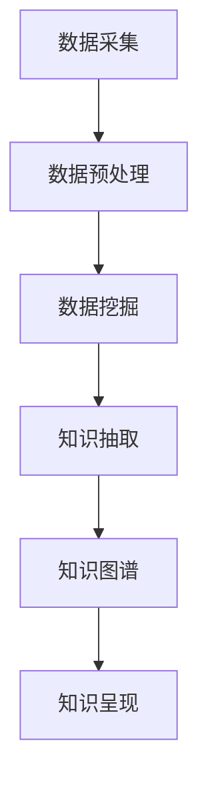

                 

# 知识发现引擎如何帮助程序员快速掌握行业动态

在当今快速发展的技术环境中，程序员需要不断更新自己的知识体系以保持竞争力。但面对海量的信息，如何高效地获取和掌握行业动态，成为了一个挑战。知识发现引擎(Knowledge Discovery Engine, KDE)作为一种先进的工具，可以帮助程序员快速识别和利用行业趋势，提供有价值的洞察。本文将详细探讨知识发现引擎的核心概念、算法原理、操作步骤、应用领域以及未来展望，为程序员提供实用的指南。

## 1. 背景介绍

### 1.1 问题由来
随着信息技术的飞速发展，程序员所需要掌握的技术和知识也在快速增长。从编程语言到开发工具，从算法框架到数据库技术，程序员需要不断学习以跟上行业的步伐。然而，这些知识不仅数量庞大，而且更新迅速，难以系统化地掌握。此外，信息过载和技术更新的不确定性使得程序员难以分辨哪些信息值得投入时间和精力去学习和应用。

### 1.2 问题核心关键点
在解决这一问题时，知识发现引擎应运而生。通过利用先进的算法和大数据技术，知识发现引擎可以从大量的数据中提取出有价值的知识，帮助程序员快速掌握行业动态，发现新技术、新趋势，甚至预见未来的发展方向。

知识发现引擎通常包括以下几个关键点：
- **数据采集**：从各种数据源收集信息，如技术博客、开源项目、论文、新闻、社区讨论等。
- **数据预处理**：清洗和整理数据，消除噪声和冗余。
- **数据分析**：使用机器学习和数据挖掘技术，识别和抽取知识。
- **知识呈现**：将抽取的知识以易于理解和利用的形式呈现给用户。

### 1.3 问题研究意义
掌握行业动态对于程序员的职业发展至关重要。知识发现引擎不仅能提高程序员的学习效率，减少时间和精力的浪费，还能帮助他们预见技术趋势，提升竞争力。在企业级应用中，知识发现引擎还可以辅助技术选型、项目管理、人才评估等方面，为企业带来持续的技术创新和竞争优势。

## 2. 核心概念与联系

### 2.1 核心概念概述

为更好地理解知识发现引擎的工作原理和优势，本节将介绍几个核心概念及其相互之间的联系。

- **知识发现(Knowledge Discovery, KD)**：从大规模数据中提取有价值的信息和知识的过程。知识发现通常包括数据清洗、数据预处理、数据挖掘、数据分析、知识抽取等步骤。
- **数据挖掘(Data Mining)**：通过算法和模型，从原始数据中提取有价值的模式、规律和关系。常用的数据挖掘算法包括分类、聚类、关联规则挖掘、异常检测等。
- **机器学习(Machine Learning, ML)**：使用数据训练模型，使模型能够自动识别和泛化数据中的模式。机器学习是知识发现的重要工具。
- **知识图谱(Knowledge Graph)**：一种图形化的知识表示方式，通过节点和边描述实体和它们之间的关系。知识图谱是知识发现的重要成果之一。
- **自然语言处理(Natural Language Processing, NLP)**：使计算机能够理解和生成自然语言，是知识发现中的关键技术。

这些核心概念之间的联系可以通过以下Mermaid流程图来展示：



这个流程图展示了从数据采集到知识呈现的知识发现引擎工作流程：

1. 从各种数据源收集信息。
2. 清洗和整理数据，消除噪声和冗余。
3. 使用机器学习和数据挖掘技术，从数据中抽取知识。
4. 将抽取的知识构建为知识图谱，以图形化方式呈现。
5. 将知识图谱呈现给用户，辅助决策和行动。

## 3. 核心算法原理 & 具体操作步骤

### 3.1 算法原理概述

知识发现引擎的核心算法原理基于数据挖掘和机器学习，其目标是自动地从大量数据中抽取有价值的知识，并通过可视化的方式呈现给用户。以下是核心算法的概述：

- **数据预处理**：包括数据清洗、数据归一化、特征工程等步骤，确保数据质量，为后续分析奠定基础。
- **分类算法**：通过分类算法，将数据分为不同的类别，便于发现数据中的模式和规律。
- **聚类算法**：使用聚类算法，将相似的数据聚集在一起，识别数据中的自然分组。
- **关联规则挖掘**：通过关联规则挖掘，发现数据项之间的潜在关系和模式，如购物篮分析。
- **异常检测**：通过异常检测，识别数据中的异常值，可能表明数据中的错误或极端情况。
- **知识抽取**：将挖掘出的知识转换为结构化的形式，如知识图谱。

### 3.2 算法步骤详解

知识发现引擎的实际操作通常包括以下几个关键步骤：

**Step 1: 数据收集与预处理**
- 使用网络爬虫、API接口等方式从多个数据源（如GitHub、Stack Overflow、技术博客、论文库等）收集数据。
- 清洗数据，去除噪声、重复和无关信息。
- 归一化数据格式，如时间戳、URL、代码格式等。
- 提取特征，如关键词、技术栈、开发语言、贡献者活跃度等。

**Step 2: 数据分析与挖掘**
- 使用分类算法（如K-means、决策树、随机森林等）对数据进行分类，识别常见技术栈和框架。
- 使用聚类算法（如层次聚类、DBSCAN等）对数据进行聚类，发现技术热点和趋势。
- 使用关联规则挖掘算法（如Apriori、FP-growth等）发现技术栈之间的关联关系，如常见技术组合。
- 使用异常检测算法（如孤立森林、局部离群因子等）识别技术热点和趋势。

**Step 3: 知识抽取与呈现**
- 将挖掘出的知识转换为结构化的形式，如知识图谱。
- 使用可视化工具（如Gephi、Cytoscape等）将知识图谱呈现为图形，便于理解和分析。
- 将知识图谱呈现为报表、仪表盘等形式，辅助决策和行动。

### 3.3 算法优缺点

知识发现引擎的优点包括：
- **自动化处理**：自动化处理大量数据，减少人工干预和错误。
- **高效准确**：使用先进的算法和大数据技术，高效准确地抽取知识。
- **多源数据整合**：整合多源数据，提供全面的行业洞察。

其缺点包括：
- **数据质量依赖**：依赖于原始数据的质量，数据噪声和错误可能影响结果。
- **算法复杂性**：涉及复杂的算法和模型，需要专业知识。
- **计算资源消耗**：处理大规模数据需要高性能计算资源。

### 3.4 算法应用领域

知识发现引擎在多个领域都有广泛应用，以下是几个典型的应用场景：

- **技术选型**：帮助企业根据当前技术趋势，选择最合适的新技术或技术栈。
- **人才评估**：通过分析程序员的贡献历史和技术栈，评估其技术能力和发展潜力。
- **项目管理**：辅助项目管理团队识别技术风险和机会，优化资源配置。
- **知识共享**：将抽取的知识共享给团队成员，促进团队学习和知识传播。
- **市场分析**：分析技术市场趋势和热点，辅助市场和业务决策。

## 4. 数学模型和公式 & 详细讲解 & 举例说明

### 4.1 数学模型构建

知识发现引擎的数学模型构建通常包括以下几个部分：

- **数据采集模型**：定义数据采集的规则和策略，如爬虫策略、API调用等。
- **数据预处理模型**：定义数据清洗、归一化和特征提取的算法和步骤。
- **数据分析模型**：定义分类、聚类、关联规则挖掘和异常检测的算法和模型。
- **知识抽取模型**：定义将挖掘出的知识转换为知识图谱的算法和步骤。

### 4.2 公式推导过程

以下是分类算法的公式推导过程：

假设有一个二分类问题，数据集 $D=\{(x_i,y_i)\}_{i=1}^N$，其中 $x_i$ 为输入特征，$y_i$ 为标签。分类算法的目标是找到最优的决策边界，将数据分为两类。假设使用线性分类器，模型为 $h(x;\theta) = \text{sign}(\sum_{i=1}^N \theta_i x_i + \theta_0)$，其中 $\theta$ 为模型参数，$\text{sign}(x)$ 为符号函数。

训练数据集 $D$ 上的经验风险最小化问题为：

$$
\min_{\theta} \frac{1}{N} \sum_{i=1}^N \mathbb{I}(y_i \neq h(x_i;\theta))
$$

其中 $\mathbb{I}(\cdot)$ 为示性函数，当条件成立时取1，否则取0。

使用梯度下降算法，最小化经验风险的公式为：

$$
\theta \leftarrow \theta - \eta \nabla_{\theta} \mathcal{L}(\theta)
$$

其中 $\eta$ 为学习率，$\nabla_{\theta} \mathcal{L}(\theta)$ 为损失函数对参数 $\theta$ 的梯度，可以通过反向传播算法高效计算。

### 4.3 案例分析与讲解

假设我们收集了50000个开源项目的代码数据，目标是分析这些项目的编程语言和框架。以下是使用K-means算法对数据进行聚类的案例分析：

- **数据收集**：从GitHub上爬取项目的代码和贡献者信息。
- **数据预处理**：清洗数据，去除注释和无关代码；归一化数据格式，提取编程语言、框架、贡献者数等特征。
- **数据挖掘**：使用K-means算法对数据进行聚类，识别出不同的编程语言和框架集群。
- **知识抽取**：将聚类结果转换为知识图谱，可视化编程语言和框架之间的关系。

## 5. 项目实践：代码实例和详细解释说明

### 5.1 开发环境搭建

在进行知识发现引擎的实践时，我们需要准备好开发环境。以下是使用Python进行Scikit-learn开发的环境配置流程：

1. 安装Anaconda：从官网下载并安装Anaconda，用于创建独立的Python环境。

2. 创建并激活虚拟环境：
```bash
conda create -n kde-env python=3.8 
conda activate kde-env
```

3. 安装Scikit-learn：
```bash
pip install scikit-learn
```

4. 安装各类工具包：
```bash
pip install pandas numpy matplotlib seaborn
```

完成上述步骤后，即可在`kde-env`环境中开始知识发现引擎的实践。

### 5.2 源代码详细实现

这里我们以编程语言和框架的聚类分析为例，给出使用Scikit-learn对数据进行聚类的PyTorch代码实现。

首先，定义数据预处理函数：

```python
import pandas as pd
import numpy as np
from sklearn.preprocessing import StandardScaler
from sklearn.decomposition import PCA
from sklearn.cluster import KMeans

def preprocess_data(df):
    # 去除无关特征
    df = df.drop(['id', 'license', 'contributor_count'], axis=1)
    # 归一化数据
    scaler = StandardScaler()
    df = pd.DataFrame(scaler.fit_transform(df), columns=df.columns)
    return df
```

然后，定义聚类函数：

```python
def kmeans_clustering(df, n_clusters):
    # 使用PCA降维
    pca = PCA(n_components=2)
    df_pca = pca.fit_transform(df)
    # 使用K-means聚类
    kmeans = KMeans(n_clusters=n_clusters)
    kmeans.fit(df_pca)
    return kmeans.labels_
```

接着，定义可视化函数：

```python
import matplotlib.pyplot as plt

def visualize_clusters(df, labels):
    # 使用t-SNE降维
    tsne = TSNE(n_components=2, random_state=42)
    df_tsne = tsne.fit_transform(df)
    # 可视化聚类结果
    plt.scatter(df_tsne[:, 0], df_tsne[:, 1], c=labels, cmap='viridis')
    plt.xlabel('Component 1')
    plt.ylabel('Component 2')
    plt.show()
```

最后，启动聚类流程：

```python
# 加载数据
df = pd.read_csv('data.csv')

# 数据预处理
df = preprocess_data(df)

# 聚类
labels = kmeans_clustering(df, n_clusters=3)

# 可视化
visualize_clusters(df, labels)
```

以上就是使用Scikit-learn对编程语言和框架数据进行聚类的完整代码实现。可以看到，通过Scikit-learn的封装，知识发现引擎的开发过程变得简单高效。

### 5.3 代码解读与分析

让我们再详细解读一下关键代码的实现细节：

**preprocess_data函数**：
- 函数定义了数据预处理的步骤，包括去除无关特征和归一化数据。
- 使用`StandardScaler`对数据进行标准化处理，去除特征间的尺度差异。

**kmeans_clustering函数**：
- 函数使用了PCA降维，将高维数据降低到二维空间，以便可视化。
- 使用K-means算法对数据进行聚类，识别出不同的编程语言和框架集群。
- 返回聚类结果，便于后续分析和可视化。

**visualize_clusters函数**：
- 函数使用了t-SNE降维，将数据降低到二维空间，以便可视化。
- 使用`matplotlib`库绘制散点图，将聚类结果可视化展示。

在实践中，我们通常需要根据具体任务调整预处理和聚类算法，以得到最优的聚类效果。同时，数据的可视化也需要根据聚类结果进行选择和调整，以更好地呈现知识的结构。

## 6. 实际应用场景

### 6.1 智能技术选型

知识发现引擎在技术选型中的应用非常广泛。技术栈的选择直接影响到系统的性能和可靠性，选择不当可能导致项目失败。通过知识发现引擎，程序员可以快速了解当前行业趋势和热门技术，辅助技术选型决策。

例如，一个新兴的电子商务网站需要选择适合的技术栈，知识发现引擎可以分析市场趋势，识别当前最受欢迎的前端框架和后端技术，从而选择最合适的技术栈。

### 6.2 人才评估与招聘

人才评估和招聘是企业人力资源管理的重要环节。知识发现引擎可以分析程序员的代码贡献和技术栈，评估其技术能力和发展潜力，从而辅助招聘决策。

例如，企业可以通过知识发现引擎分析候选人的开源项目和贡献历史，识别其擅长的技术领域和贡献度，以便更准确地评估候选人的能力和潜力。

### 6.3 项目管理与监控

项目管理和监控是确保项目成功的重要环节。知识发现引擎可以分析项目数据，识别技术风险和进度瓶颈，辅助项目管理决策。

例如，项目经理可以通过知识发现引擎分析项目的代码贡献和技术栈，识别可能的技术风险和进度瓶颈，及时调整项目计划，确保项目顺利进行。

### 6.4 未来应用展望

随着知识发现引擎技术的发展，其在更多领域的应用前景也将逐渐显现。

- **医疗健康**：通过分析医疗数据，识别疾病趋势和技术进展，辅助医疗决策和研究。
- **金融科技**：通过分析金融数据，识别市场趋势和技术进展，辅助金融决策和投资。
- **环境保护**：通过分析环境数据，识别环境问题和解决方案，辅助环境保护决策。

知识发现引擎在更多领域的应用，将带来更广泛的行业变革，为各行各业提供更多的智能决策支持。

## 7. 工具和资源推荐

### 7.1 学习资源推荐

为了帮助开发者系统掌握知识发现引擎的理论基础和实践技巧，这里推荐一些优质的学习资源：

1. **《Python数据科学手册》**：详细介绍了使用Python进行数据分析和机器学习的过程，包括数据预处理、特征工程、模型训练等环节。

2. **《数据科学导论》**：由斯坦福大学开设的免费在线课程，系统介绍了数据科学的原理和实践，涵盖了数据挖掘、机器学习、知识图谱等多个领域。

3. **《Scikit-learn官方文档》**：Scikit-learn的官方文档，提供了详尽的算法和模型介绍，适合深入学习和实践。

4. **Kaggle**：数据科学竞赛平台，提供了大量的数据集和竞赛题目，适合实践和竞赛。

5. **Gephi**：开源数据可视化工具，支持复杂网络数据的可视化，适合知识图谱的展示。

通过对这些资源的学习实践，相信你一定能够快速掌握知识发现引擎的精髓，并用于解决实际的NLP问题。

### 7.2 开发工具推荐

高效的开发离不开优秀的工具支持。以下是几款用于知识发现引擎开发的常用工具：

1. **Python**：使用广泛的开源编程语言，适合快速迭代研究。

2. **Scikit-learn**：基于Python的开源机器学习库，提供了丰富的算法和模型，适合数据挖掘和机器学习任务。

3. **TensorFlow**：由Google主导开发的开源深度学习框架，生产部署方便，适合大规模工程应用。

4. **Matplotlib**：Python的可视化库，支持绘制各种类型的图表和图形，适合数据可视化任务。

5. **Kaggle**：数据科学竞赛平台，提供了大量的数据集和竞赛题目，适合实践和竞赛。

合理利用这些工具，可以显著提升知识发现引擎的开发效率，加快创新迭代的步伐。

### 7.3 相关论文推荐

知识发现引擎的研究源于学界的持续研究。以下是几篇奠基性的相关论文，推荐阅读：

1. **《K-means: A new method for clustering in r4》**：K-means算法的经典论文，详细介绍了K-means算法的原理和实现。

2. **《An Introduction to Statistical Learning》**：由斯坦福大学等学者合著的统计学习经典教材，涵盖了机器学习的各个方面，适合全面学习。

3. **《Graph-Based Clustering》**：介绍了基于图论的聚类方法，适合处理复杂网络数据。

4. **《Apriori Algorithm for Association Rules》**：关联规则挖掘算法的经典论文，详细介绍了Apriori算法的原理和实现。

5. **《Robust Principal Component Analysis for Large Datasets with Missing Values》**：PCA算法的改进论文，介绍了使用PCA进行数据降维的方法，适合处理大规模数据集。

这些论文代表了大数据和知识发现引擎的发展脉络。通过学习这些前沿成果，可以帮助研究者把握学科前进方向，激发更多的创新灵感。

## 8. 总结：未来发展趋势与挑战

### 8.1 总结

本文对知识发现引擎进行了全面系统的介绍。首先阐述了知识发现引擎的背景和意义，明确了其在程序员职业发展中的重要作用。其次，从原理到实践，详细讲解了知识发现引擎的核心算法和操作步骤，给出了知识发现引擎的完整代码实例。同时，本文还广泛探讨了知识发现引擎在多个行业领域的应用前景，展示了知识发现引擎的广泛潜力。

通过本文的系统梳理，可以看到，知识发现引擎作为一种先进的工具，正在帮助程序员快速掌握行业动态，发现新技术、新趋势，甚至预见未来的发展方向。随着大数据和机器学习技术的不断发展，知识发现引擎必将在更多领域发挥更大的作用。

### 8.2 未来发展趋势

展望未来，知识发现引擎将呈现以下几个发展趋势：

1. **自动化处理**：随着技术的发展，知识发现引擎将进一步自动化，减少人工干预，提高处理效率。

2. **多源数据整合**：知识发现引擎将能够整合更多源数据，提供更全面的行业洞察。

3. **实时处理**：通过引入流数据处理技术，知识发现引擎可以实现实时处理，及时获取最新的行业动态。

4. **深度学习融合**：将深度学习技术与知识发现引擎结合，提升算法的精度和效果。

5. **知识图谱扩展**：构建更丰富、更精细的知识图谱，提供更全面、更深入的知识结构。

6. **智能推荐**：结合推荐算法，提供智能的知识推荐服务，辅助用户快速获取有价值的信息。

以上趋势凸显了知识发现引擎的广阔前景。这些方向的探索发展，必将进一步提升知识发现引擎的性能和应用范围，为程序员提供更强大的行业洞察工具。

### 8.3 面临的挑战

尽管知识发现引擎技术已经取得了瞩目成就，但在迈向更加智能化、普适化应用的过程中，它仍面临着诸多挑战：

1. **数据质量依赖**：依赖于原始数据的质量，数据噪声和错误可能影响结果。

2. **算法复杂性**：涉及复杂的算法和模型，需要专业知识。

3. **计算资源消耗**：处理大规模数据需要高性能计算资源。

4. **实时性问题**：处理实时数据需要高效、可靠的系统架构。

5. **模型解释性**：知识发现引擎通常被视为"黑盒"系统，难以解释其内部工作机制和决策逻辑。

6. **数据隐私和安全**：知识发现引擎涉及大量敏感数据，需要严格的数据隐私和安全保护。

正视知识发现引擎面临的这些挑战，积极应对并寻求突破，将是其走向成熟的必由之路。

### 8.4 研究展望

面对知识发现引擎所面临的挑战，未来的研究需要在以下几个方面寻求新的突破：

1. **数据预处理技术**：研究更加高效的预处理算法，提高数据质量，减少噪声和错误。

2. **自动化算法选择**：开发自适应算法选择技术，根据数据特点自动选择合适的算法和模型。

3. **多模态数据融合**：将知识发现引擎扩展到多模态数据处理，如文本、图像、视频等。

4. **实时处理技术**：研究流数据处理技术，实现实时处理和实时分析。

5. **模型解释性**：研究模型解释性技术，赋予知识发现引擎更强的可解释性，增强用户信任。

6. **数据隐私和安全**：研究数据隐私和安全保护技术，确保数据的安全性和合规性。

这些研究方向和技术的探索，将推动知识发现引擎向更加智能化、普适化方向发展，为程序员提供更加强大的行业洞察工具。

## 9. 附录：常见问题与解答

**Q1：知识发现引擎在数据质量差的情况下还能有效工作吗？**

A: 知识发现引擎依赖于高质量的数据，数据质量差会影响算法的精度和效果。但在实际应用中，可以通过数据清洗、异常检测等技术提升数据质量，尽可能减少噪声和错误。同时，可以采用稳健的算法和模型，增强算法的鲁棒性，提高结果的可靠性。

**Q2：知识发现引擎如何处理大规模数据集？**

A: 处理大规模数据集是知识发现引擎的重要挑战。可以通过分布式计算、数据分片、并行处理等技术，将大规模数据划分为小规模数据块，并行处理，提高处理效率。同时，可以使用GPU、TPU等高性能计算资源，加速数据处理过程。

**Q3：知识发现引擎的可视化效果如何影响决策？**

A: 知识发现引擎的可视化效果直接影响决策的质量。通过清晰、直观的图形展示，决策者能够更容易理解数据中的模式和趋势，做出更为明智的决策。因此，选择合适的可视化工具和技术，是知识发现引擎成功的关键。

**Q4：知识发现引擎在跨领域应用中有哪些挑战？**

A: 知识发现引擎在跨领域应用中面临诸多挑战，包括领域知识差异、数据格式不一致、多源数据整合等。需要开发跨领域知识发现引擎，同时引入领域专家知识，增强算法的适应性和鲁棒性。

**Q5：知识发现引擎在预测未来趋势方面有哪些局限？**

A: 知识发现引擎在预测未来趋势方面有其局限性，主要表现在数据的时效性和预测模型的不确定性。随着数据量的增加和模型的改进，预测准确性将逐步提升。但在短期内，仍需结合领域专家知识和经验，进行辅助决策。

通过这些问题的解答，相信你一定能够更好地理解知识发现引擎的工作原理和应用场景，为实际应用提供有力的指导。

---

作者：禅与计算机程序设计艺术 / Zen and the Art of Computer Programming

