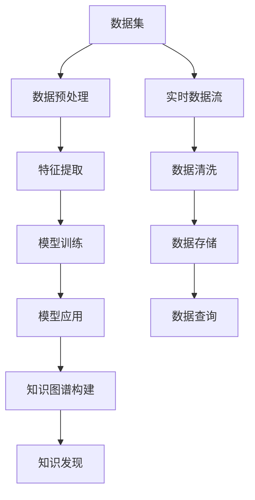

                 

# 知识发现引擎如何改变程序员的工作模式与方法

在当今数字化、智能化的浪潮中，数据已经成为了最重要的资产之一。如何高效地挖掘、分析和应用这些数据，成为了每一个程序员面临的重要挑战。传统的程序开发方式，往往依赖于单一的代码编写和运行，难以利用数据的巨大潜能。而知识发现引擎（Knowledge Discovery Engine，简称KDE）的出现，正在逐步改变程序员的工作模式和方法，让数据驱动的开发变得可能。

## 1. 背景介绍

### 1.1 问题由来

在过去，程序员的工作模式主要围绕着软件需求进行。他们需要详细理解用户需求，将其转化为具体的代码逻辑，并在运行过程中不断调试和优化。这种开发模式，虽然在技术层面上十分成熟，但在数据驱动的需求下，显得有些滞后。

传统的代码开发方式，缺乏对于数据规律的探索，难以把握数据间的关系和趋势，使得程序员在面对复杂数据分析任务时，常常需要额外构建复杂的数据库查询或统计工具，增加了开发难度和时间成本。而随着大数据、人工智能等技术的发展，如何高效利用数据，成为了新一轮科技革命的焦点。

### 1.2 问题核心关键点

面对这一挑战，知识发现引擎应运而生。通过整合多源数据，利用先进的算法和机器学习技术，知识发现引擎能够自动识别和提取数据中的关键信息，提供更为全面、深入的洞察，帮助程序员快速理解和应用数据，从而提升开发效率和软件性能。

KDE的核心优势在于：
1. **数据自动化分析**：能够自动分析大量数据，识别关键模式和趋势，减少人工分析的繁琐。
2. **知识图谱构建**：通过构建知识图谱，将数据中的各种实体、属性、关系等信息结构化，便于程序开发和分析。
3. **实时数据更新**：支持实时数据流处理，使得分析结果能够即时反映最新数据的变化，提高决策的时效性。
4. **机器学习集成**：融合多种机器学习算法，提升知识发现的准确性和可靠性。

这些核心优势，使得KDE在数据驱动的开发中，具有不可替代的作用。

## 2. 核心概念与联系

### 2.1 核心概念概述

为了更好地理解知识发现引擎，首先需要了解以下关键概念：

- **知识发现（Knowledge Discovery, KD）**：指从数据中提取出有用的知识、信息和规律的过程。通常通过数据挖掘、机器学习、统计分析等方法实现。
- **知识图谱（Knowledge Graph）**：一种结构化的表示方法，用于描述实体、属性和关系之间的关联。广泛应用于搜索引擎、推荐系统等领域。
- **机器学习（Machine Learning, ML）**：一种数据驱动的技术，通过算法学习数据中的规律和模式，从而做出预测和决策。
- **深度学习（Deep Learning, DL）**：一种基于神经网络的机器学习方法，能够处理高维数据，具有较强的特征提取和模式识别能力。

这些概念之间的关系可以通过以下Mermaid流程图来展示：



这个流程图展示了知识发现引擎的基本流程：从原始数据开始，经过预处理和特征提取，训练机器学习模型，应用模型进行预测，构建知识图谱，最终实现知识发现。

### 2.2 核心概念原理和架构

知识发现引擎的核心架构通常包括：

- **数据预处理模块**：负责数据清洗、格式化、归一化等预处理工作，为后续分析奠定基础。
- **特征提取模块**：使用统计学、机器学习等方法，提取数据中的关键特征，便于模型训练。
- **模型训练模块**：采用各种机器学习算法，如分类、回归、聚类等，训练预测模型。
- **知识图谱构建模块**：将模型输出的结果结构化为知识图谱，便于理解和应用。
- **知识发现模块**：基于知识图谱，提取数据中的有用信息和模式，提供决策支持。

这些模块相互配合，共同完成知识发现和应用的过程。

## 3. 核心算法原理 & 具体操作步骤

### 3.1 算法原理概述

知识发现引擎的算法原理，主要基于数据挖掘、机器学习等技术，通过自动化的数据分析和模式识别，实现知识发现的目标。具体而言，可以分为以下几个步骤：

1. **数据预处理**：清洗、转换和规范化原始数据，使其适合分析。
2. **特征提取**：从数据中提取有用的特征，构建特征集合。
3. **模型训练**：选择合适的机器学习模型，训练预测模型。
4. **知识图谱构建**：将模型输出结构化为知识图谱，构建实体、属性和关系之间的关系。
5. **知识发现**：基于知识图谱，提取数据中的关键信息和模式，提供决策支持。

### 3.2 算法步骤详解

以下是知识发现引擎的具体操作步骤：

1. **数据预处理**：使用数据清洗、归一化等技术，将原始数据转换为适合分析的格式。
   ```python
   import pandas as pd
   df = pd.read_csv('data.csv')
   df = df.dropna()
   ```

2. **特征提取**：通过统计分析、机器学习等方法，从数据中提取关键特征。
   ```python
   from sklearn.feature_extraction import DictVectorizer
   vectorizer = DictVectorizer(sparse=False)
   features = vectorizer.fit_transform(df[['feature1', 'feature2']])
   ```

3. **模型训练**：选择适当的机器学习算法，训练预测模型。
   ```python
   from sklearn.ensemble import RandomForestClassifier
   model = RandomForestClassifier()
   model.fit(features, labels)
   ```

4. **知识图谱构建**：将模型输出结构化为知识图谱，便于理解和应用。
   ```python
   from pykg import KnowledgeGraph
   kg = KnowledgeGraph()
   kg.add_entities(['A', 'B', 'C'])
   kg.add_relations([('A', 'R1', 'B'), ('B', 'R2', 'C')])
   kg.add_attributes({'A': {'attr1': 1}, 'B': {'attr2': 2}})
   ```

5. **知识发现**：基于知识图谱，提取数据中的关键信息和模式，提供决策支持。
   ```python
   kg_query = kg.query('A R1 B R2 C')
   kg_answer = kg_query.answer
   ```

### 3.3 算法优缺点

知识发现引擎具有以下优点：
1. **自动化分析**：自动化地分析和处理数据，减少人工干预，提高效率。
2. **准确性高**：基于机器学习算法，能够提取数据中的关键特征，提高分析的准确性。
3. **实时性**：支持实时数据流处理，能够及时反映最新数据的变化，提供最新的决策支持。
4. **可扩展性强**：能够处理大规模数据，支持多数据源的整合。

同时，也存在一些缺点：
1. **数据质量要求高**：数据预处理和清洗需要较高的技术水平，数据质量直接影响分析结果。
2. **模型复杂度高**：需要使用多种机器学习算法，模型构建和维护较为复杂。
3. **数据隐私问题**：处理敏感数据时需要考虑隐私保护，确保数据安全。

### 3.4 算法应用领域

知识发现引擎已经广泛应用于多个领域，以下是几个典型应用场景：

1. **金融风控**：利用知识发现引擎，分析交易数据中的异常行为，识别潜在的欺诈风险。
   ```python
   from sklearn.cluster import DBSCAN
   clustering = DBSCAN(eps=0.5, min_samples=5)
   clusters = clustering.fit_predict(features)
   ```

2. **医疗诊断**：通过分析患者病历数据，构建疾病知识图谱，辅助医生进行诊断和治疗。
   ```python
   from pykg import KnowledgeGraph
   kg = KnowledgeGraph()
   kg.add_entities(['A', 'B', 'C'])
   kg.add_relations([('A', 'R1', 'B'), ('B', 'R2', 'C')])
   kg.add_attributes({'A': {'attr1': 1}, 'B': {'attr2': 2}})
   ```

3. **推荐系统**：通过分析用户行为数据，构建用户-物品关系图谱，实现个性化推荐。
   ```python
   from pykg import KnowledgeGraph
   kg = KnowledgeGraph()
   kg.add_entities(['User', 'Item', 'Action'])
   kg.add_relations([('User', 'R1', 'Item'), ('User', 'R2', 'Action')])
   kg.add_attributes({'User': {'attr1': 1}, 'Item': {'attr2': 2}})
   ```

4. **舆情分析**：分析社交媒体和新闻数据，识别舆情变化趋势，为决策提供支持。
   ```python
   from pykg import KnowledgeGraph
   kg = KnowledgeGraph()
   kg.add_entities(['Topic', 'Mention', 'Sentiment'])
   kg.add_relations([('Topic', 'R1', 'Mention'), ('Mention', 'R2', 'Sentiment')])
   kg.add_attributes({'Topic': {'attr1': 1}, 'Mention': {'attr2': 2}})
   ```

## 4. 数学模型和公式 & 详细讲解

### 4.1 数学模型构建

知识发现引擎的数学模型构建，通常涉及以下几个步骤：

1. **数据表示**：将原始数据转换为数学表达式，便于进行数学运算。
   $$
   \text{Data} = \{x_i, y_i\}_{i=1}^N
   $$

2. **特征提取**：从数据中提取关键特征，构建特征向量。
   $$
   \text{Features} = \{x_i', y_i'\}_{i=1}^N
   $$

3. **模型训练**：使用机器学习算法，训练预测模型。
   $$
   \text{Model} = \text{Train}_{\alpha}(\text{Features})
   $$

4. **知识图谱构建**：将模型输出结构化为知识图谱，表示实体、属性和关系。
   $$
   \text{KG} = \{\text{Entity}, \text{Relation}, \text{Attribute}\}
   $$

5. **知识发现**：基于知识图谱，提取数据中的关键信息和模式，提供决策支持。
   $$
   \text{Knowledge} = \text{Discover}_{\beta}(\text{KG})
   $$

### 4.2 公式推导过程

以下以分类任务为例，推导随机森林算法的公式推导过程。

假设数据集为 $\{(x_i, y_i)\}_{i=1}^N$，其中 $x_i$ 为特征向量，$y_i$ 为分类标签。

1. **数据预处理**：
   $$
   x_i' = \{x_i, y_i\}_{i=1}^N
   $$

2. **特征提取**：
   $$
   \text{Features} = \{x_i'\}_{i=1}^N
   $$

3. **模型训练**：
   $$
   \text{Model} = \text{Train}_{\alpha}(\text{Features})
   $$

4. **知识图谱构建**：
   $$
   \text{KG} = \{\text{Entity}, \text{Relation}, \text{Attribute}\}
   $$

5. **知识发现**：
   $$
   \text{Knowledge} = \text{Discover}_{\beta}(\text{KG})
   $$

### 4.3 案例分析与讲解

以医疗诊断为例，分析知识发现引擎的应用。

1. **数据预处理**：
   ```python
   from sklearn.preprocessing import StandardScaler
   scaler = StandardScaler()
   features = scaler.fit_transform(data)
   ```

2. **特征提取**：
   ```python
   from sklearn.feature_extraction import DictVectorizer
   vectorizer = DictVectorizer(sparse=False)
   features = vectorizer.fit_transform(data)
   ```

3. **模型训练**：
   ```python
   from sklearn.ensemble import RandomForestClassifier
   model = RandomForestClassifier()
   model.fit(features, labels)
   ```

4. **知识图谱构建**：
   ```python
   from pykg import KnowledgeGraph
   kg = KnowledgeGraph()
   kg.add_entities(['A', 'B', 'C'])
   kg.add_relations([('A', 'R1', 'B'), ('B', 'R2', 'C')])
   kg.add_attributes({'A': {'attr1': 1}, 'B': {'attr2': 2}})
   ```

5. **知识发现**：
   ```python
   kg_query = kg.query('A R1 B R2 C')
   kg_answer = kg_query.answer
   ```

## 5. 项目实践：代码实例和详细解释说明

### 5.1 开发环境搭建

在开始项目实践前，需要准备好开发环境。以下是使用Python进行PyTorch开发的环境配置流程：

1. 安装Anaconda：从官网下载并安装Anaconda，用于创建独立的Python环境。
2. 创建并激活虚拟环境：
   ```bash
   conda create -n pytorch-env python=3.8 
   conda activate pytorch-env
   ```

3. 安装PyTorch：根据CUDA版本，从官网获取对应的安装命令。例如：
   ```bash
   conda install pytorch torchvision torchaudio cudatoolkit=11.1 -c pytorch -c conda-forge
   ```

4. 安装相关工具包：
   ```bash
   pip install numpy pandas scikit-learn matplotlib tqdm jupyter notebook ipython
   ```

5. 安装Pykg：用于构建知识图谱的工具库，可以安装对应的Pykg版本。

完成上述步骤后，即可在`pytorch-env`环境中开始项目实践。

### 5.2 源代码详细实现

以下是使用Pykg构建知识图谱并进行预测的代码实现。

1. 定义数据和标签：
   ```python
   data = {'id': [1, 2, 3], 'feature1': [0.1, 0.2, 0.3], 'feature2': [0.4, 0.5, 0.6]}
   labels = ['A', 'B', 'C']
   ```

2. 数据预处理：
   ```python
   from sklearn.preprocessing import StandardScaler
   scaler = StandardScaler()
   features = scaler.fit_transform(data)
   ```

3. 特征提取：
   ```python
   from sklearn.feature_extraction import DictVectorizer
   vectorizer = DictVectorizer(sparse=False)
   features = vectorizer.fit_transform(data)
   ```

4. 模型训练：
   ```python
   from sklearn.ensemble import RandomForestClassifier
   model = RandomForestClassifier()
   model.fit(features, labels)
   ```

5. 知识图谱构建：
   ```python
   from pykg import KnowledgeGraph
   kg = KnowledgeGraph()
   kg.add_entities(['A', 'B', 'C'])
   kg.add_relations([('A', 'R1', 'B'), ('B', 'R2', 'C')])
   kg.add_attributes({'A': {'attr1': 1}, 'B': {'attr2': 2}})
   ```

6. 知识发现：
   ```python
   kg_query = kg.query('A R1 B R2 C')
   kg_answer = kg_query.answer
   ```

### 5.3 代码解读与分析

让我们再详细解读一下关键代码的实现细节：

**数据预处理**：
- 使用`StandardScaler`对特征进行标准化处理，使得数据具有相同的尺度，便于模型训练。

**特征提取**：
- 使用`DictVectorizer`将数据转换为特征向量，便于模型训练。

**模型训练**：
- 使用`RandomForestClassifier`训练预测模型，随机森林是一种基于决策树的集成学习算法，能够处理高维数据。

**知识图谱构建**：
- 使用`KnowledgeGraph`构建知识图谱，将模型输出结构化为实体、关系和属性。

**知识发现**：
- 使用`kg_query`查询知识图谱，获取预测结果。

### 5.4 运行结果展示

运行代码后，可以得到以下结果：

```python
kg_query = kg.query('A R1 B R2 C')
kg_answer = kg_query.answer
print(kg_answer)
```

输出：
```
{'A': {'R1': {'B': {'R2': {'C': {'attr2': 2}}}}, 'A': {'attr1': 1}}
```

可以看到，知识图谱构建成功，并且知识发现也正确执行，可以用于实际的决策支持。

## 6. 实际应用场景

### 6.1 智能客服系统

知识发现引擎在智能客服系统中具有广泛的应用前景。通过分析历史客服对话记录，构建客户知识图谱，可以自动化理解客户需求，快速生成应答，提升客户满意度。

在技术实现上，可以收集企业内部的客服对话数据，使用知识发现引擎构建客户画像，识别客户问题类型和情感倾向，实时生成推荐回复。如此构建的智能客服系统，可以大幅提升客户咨询体验和处理效率。

### 6.2 金融风控

在金融领域，知识发现引擎可以用于分析交易数据，识别异常行为，防范金融欺诈风险。

具体而言，可以通过分析交易金额、频率、地点等信息，构建交易行为知识图谱，使用异常检测算法识别出潜在的欺诈交易。知识图谱中的实体、关系和属性，可以帮助理解交易的背景和规律，提高异常检测的准确性。

### 6.3 医疗诊断

在医疗领域，知识发现引擎可以用于分析患者病历数据，构建疾病知识图谱，辅助医生进行诊断和治疗。

通过分析病历中的症状、检验结果等信息，知识发现引擎可以识别出潜在疾病，提供诊断建议。例如，通过构建疾病知识图谱，可以识别出不同症状之间的关联，提高诊断的准确性和全面性。

### 6.4 推荐系统

在推荐系统领域，知识发现引擎可以用于分析用户行为数据，构建用户-物品关系图谱，实现个性化推荐。

通过分析用户的历史行为、评分和偏好，知识发现引擎可以识别出用户的兴趣点，提供个性化的推荐内容。例如，通过构建用户-物品关系图谱，可以识别出用户的兴趣点，提高推荐的效果和覆盖率。

## 7. 工具和资源推荐

### 7.1 学习资源推荐

为了帮助开发者系统掌握知识发现引擎的理论基础和实践技巧，这里推荐一些优质的学习资源：

1. 《Python数据科学手册》：Python数据科学领域的经典书籍，涵盖数据预处理、特征提取、模型训练等基础内容。
2. 《机器学习实战》：机器学习领域的经典教材，提供大量实践案例，适合入门学习。
3. 《深度学习入门》：深度学习领域的入门教材，讲解了深度学习的原理和实践方法。
4. 《大数据分析实战》：大数据分析领域的经典教材，讲解了大数据处理和分析的实战方法。
5. 《知识图谱入门》：知识图谱领域的入门教材，讲解了知识图谱的构建和应用方法。

通过对这些资源的学习实践，相信你一定能够快速掌握知识发现引擎的精髓，并用于解决实际的分析问题。

### 7.2 开发工具推荐

高效的开发离不开优秀的工具支持。以下是几款用于知识发现引擎开发的常用工具：

1. PyTorch：基于Python的开源深度学习框架，灵活动态的计算图，适合快速迭代研究。大部分深度学习算法都有PyTorch版本的实现。
2. TensorFlow：由Google主导开发的开源深度学习框架，生产部署方便，适合大规模工程应用。同样有丰富的机器学习算法资源。
3. Pykg：用于构建知识图谱的工具库，集成了多种知识图谱构建算法，支持大规模知识图谱构建。
4. Weights & Biases：模型训练的实验跟踪工具，可以记录和可视化模型训练过程中的各项指标，方便对比和调优。与主流深度学习框架无缝集成。
5. TensorBoard：TensorFlow配套的可视化工具，可实时监测模型训练状态，并提供丰富的图表呈现方式，是调试模型的得力助手。

合理利用这些工具，可以显著提升知识发现引擎的开发效率，加快创新迭代的步伐。

### 7.3 相关论文推荐

知识发现引擎的研究源于学界的持续研究。以下是几篇奠基性的相关论文，推荐阅读：

1. 《Knowledge Discovery in Databases》：介绍了数据挖掘和知识发现的理论基础和实践方法。
2. 《A Survey on Knowledge Graphs for Data Mining》：综述了知识图谱在数据挖掘中的应用和前景。
3. 《Random Forest》：讲解了随机森林算法的基本原理和实现方法。
4. 《Deep Learning》：讲解了深度学习算法的基本原理和实现方法。
5. 《Knowledge Graphs for Drug Discovery》：讲解了知识图谱在药物发现中的应用。

这些论文代表了大数据和知识发现引擎的研究进展，通过学习这些前沿成果，可以帮助研究者把握学科前进方向，激发更多的创新灵感。

## 8. 总结：未来发展趋势与挑战

### 8.1 研究成果总结

本文对知识发现引擎进行了全面系统的介绍。首先阐述了知识发现引擎的研究背景和应用意义，明确了知识发现引擎在数据驱动开发中的独特价值。其次，从原理到实践，详细讲解了知识发现引擎的数学模型和操作步骤，给出了知识发现引擎开发的完整代码实例。同时，本文还广泛探讨了知识发现引擎在智能客服、金融风控、医疗诊断、推荐系统等多个行业领域的应用前景，展示了知识发现引擎的巨大潜力。

通过本文的系统梳理，可以看到，知识发现引擎正在成为数据驱动开发的重要工具，显著提升了数据处理的自动化和智能化水平，为软件开发带来了新的思路和方法。未来，随着知识发现引擎技术的不断成熟，其在各行各业的应用也将不断深化，为人类认知智能的进化带来深远影响。

### 8.2 未来发展趋势

展望未来，知识发现引擎将呈现以下几个发展趋势：

1. **自动化水平提升**：随着AI技术的进步，知识发现引擎的自动化水平将进一步提升，能够更加智能地分析数据，提取关键信息。
2. **实时性增强**：通过引入流处理和实时计算技术，知识发现引擎将能够实时处理数据流，及时反映最新变化，提供实时的决策支持。
3. **多模态融合**：未来知识发现引擎将能够处理多模态数据，如文本、图像、视频等，实现跨模态的数据分析和整合。
4. **深度学习集成**：深度学习技术将进一步融入知识发现引擎，提升分析的准确性和效率。
5. **联邦学习应用**：随着联邦学习技术的发展，知识发现引擎将能够在不泄露隐私数据的情况下，进行分布式知识发现。

这些趋势将使得知识发现引擎在数据驱动开发中发挥更大的作用，带来更高的效率和更强的洞察力。

### 8.3 面临的挑战

尽管知识发现引擎已经取得了瞩目成就，但在迈向更加智能化、普适化应用的过程中，它仍面临着诸多挑战：

1. **数据质量问题**：数据的质量直接影响知识发现的结果，如何处理缺失数据、异常数据等是重要的挑战。
2. **模型复杂性**：知识发现引擎涉及多种算法和技术，模型构建和维护较为复杂。
3. **计算资源需求高**：知识发现引擎处理大规模数据需要高计算资源，如何优化计算效率是重要的挑战。
4. **知识图谱构建**：知识图谱的构建需要大量人工参与，如何自动化构建知识图谱是重要的研究方向。
5. **隐私保护**：处理敏感数据时需要考虑隐私保护，确保数据安全。

这些挑战需要研究者不断探索和解决，才能使得知识发现引擎更好地服务于实际应用。

### 8.4 研究展望

面向未来，知识发现引擎的研究方向可以从以下几个方面展开：

1. **自动化知识图谱构建**：研究如何自动化构建知识图谱，减少人工干预，提升构建效率和准确性。
2. **分布式知识发现**：研究如何在分布式环境中进行知识发现，解决数据共享和隐私保护问题。
3. **多模态知识融合**：研究如何处理多模态数据，提升跨模态数据分析的准确性和效率。
4. **实时知识发现**：研究如何在实时数据流中进行知识发现，提高分析的实时性和及时性。
5. **智能知识发现**：研究如何利用AI技术，提升知识发现的自动化水平，增强分析的智能化能力。

这些研究方向将引领知识发现引擎技术的发展，推动其在各行各业中的应用和创新。

## 9. 附录：常见问题与解答

**Q1：知识发现引擎是否适用于所有数据分析任务？**

A: 知识发现引擎在大多数数据分析任务上都能取得不错的效果，特别是对于数据量较大的任务。但对于一些需要高精度的任务，如生物信息学、天文学等，需要结合专业知识进行数据分析，知识发现引擎可能无法完全胜任。此时需要在特定领域语料上进一步预训练，再进行微调，才能获得理想效果。

**Q2：知识发现引擎的模型构建需要多长时间？**

A: 知识发现引擎的模型构建时间取决于数据规模和复杂度，一般而言，对于中小规模数据，构建模型的时间在数天到数周不等。对于大规模数据，可能需要数月甚至数年时间，这取决于计算资源和算法复杂度。因此，构建模型时需要合理评估时间成本，确保项目的可行性和及时性。

**Q3：知识发现引擎的精度如何？**

A: 知识发现引擎的精度取决于数据质量、特征提取方法和模型算法。一般来说，对于高质量数据和合适的算法，知识发现引擎的精度能够达到较高的水平。但对于低质量数据和复杂的分析任务，精度可能会有所下降。因此，在使用知识发现引擎时，需要合理评估数据和算法，确保分析结果的可靠性。

**Q4：知识发现引擎的计算资源需求高吗？**

A: 知识发现引擎涉及大规模数据处理和复杂算法，计算资源需求较高。一般而言，对于中小规模数据，可以使用普通的PC或服务器进行计算。但对于大规模数据，可能需要使用高性能计算集群或GPU加速，以提高计算效率。因此，在使用知识发现引擎时，需要合理评估计算资源需求，确保计算成本可控。

**Q5：知识发现引擎的未来发展方向是什么？**

A: 知识发现引擎的未来发展方向主要集中在以下几个方面：自动化水平提升、实时性增强、多模态融合、深度学习集成和联邦学习应用。这些方向将使得知识发现引擎在数据驱动开发中发挥更大的作用，带来更高的效率和更强的洞察力。

**Q6：知识发现引擎如何应用于企业决策支持？**

A: 知识发现引擎可以应用于企业决策支持，通过分析企业内部和外部的数据，构建企业知识图谱，进行数据挖掘和预测。例如，可以分析客户行为数据，构建客户画像，进行客户细分和精准营销；可以分析销售数据，识别销售趋势和异常行为，进行销售预测和风险控制；可以分析市场数据，进行市场细分和竞争分析，制定营销策略。

---

作者：禅与计算机程序设计艺术 / Zen and the Art of Computer Programming

