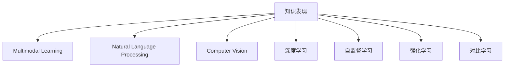

                 

# 知识发现引擎的多模态学习技术应用

> 关键词：知识发现, 多模态学习, 自然语言处理, 计算机视觉, 深度学习

## 1. 背景介绍

### 1.1 问题由来
知识发现(Knowledge Discovery)是数据分析领域的一个核心任务，旨在从大数据中挖掘隐含的、未知的、潜在有用的知识。随着数据量的激增和数据模态的多样化，传统的单一模态数据挖掘方法已无法满足现实需求。越来越多的研究者和产业界人士开始关注多模态数据挖掘方法，以期能够更全面、深入地理解数据，揭示知识发现的新视角。

多模态学习(Multimodal Learning)是多模态数据挖掘的核心技术，通过融合多种不同模态的数据特征，实现更加精准、全面、有效的知识发现。在知识发现过程中，不同模态的数据往往承载着不同的信息，自然语言处理(NLP)、计算机视觉(Computer Vision)、时序分析(Time Series Analysis)、图结构分析(Graph Structure Analysis)等技术的应用，极大地丰富了知识发现的范式。

本论文将从多模态学习在知识发现中的具体应用出发，详细探讨大模型、自监督、强化学习、对比学习等前沿技术在多模态知识发现中的策略和实践，以期为相关领域的研究者和产业界提供有价值的参考。

## 2. 核心概念与联系

### 2.1 核心概念概述

为更好地理解多模态学习在知识发现中的具体应用，本节将介绍几个密切相关的核心概念：

- **知识发现(Knowledge Discovery)**：指通过各种算法和技术，从数据中发现隐含的、未知的、潜在有用的知识的过程。知识发现通常需要复杂的数学模型和算法，以及对领域知识的深刻理解。

- **多模态学习(Multimodal Learning)**：指融合多种不同模态的数据特征，如文本、图像、音频、时序等，进行有监督或无监督学习的方法。多模态数据之间的互补性，使得融合后的知识发现更加全面和深入。

- **自然语言处理(Natural Language Processing, NLP)**：指利用计算机处理和理解人类语言的技术，包括文本分类、信息抽取、情感分析等任务。NLP是知识发现中最常用的模态之一，特别是对于文本数据的处理。

- **计算机视觉(Computer Vision)**：指通过计算机分析和理解图像、视频等视觉数据的科学。计算机视觉技术在图像分类、目标检测、图像生成等方面应用广泛，为知识发现提供了丰富的视觉信息。

- **深度学习(Deep Learning)**：指通过多层神经网络模型，从数据中学习非线性关系，以实现高效的知识发现。深度学习在多模态学习中发挥着核心作用，能够处理大规模、高维度的数据集。

- **自监督学习(Self-Supervised Learning)**：指在没有标签的数据上训练模型，通过数据自身的结构和属性来优化模型。自监督学习在知识发现中应用广泛，如通过语言模型预训练、无监督特征学习等方法。

- **强化学习(Reinforcement Learning)**：指通过与环境互动，模型通过试错的方式学习最优策略。强化学习在知识发现中的应用包括游戏策略、推荐系统、自动化控制等。

- **对比学习(Contrastive Learning)**：指通过构建对比样本，学习模型在不同样本之间的相似度或差异性，以增强模型对数据特征的感知能力。对比学习在多模态知识发现中具有重要作用。

这些核心概念之间的逻辑关系可以通过以下Mermaid流程图来展示：



这个流程图展示了的核心概念及其之间的关系：

1. 知识发现是整个研究框架的核心目标。
2. 多模态学习是实现知识发现的一种关键手段。
3. NLP、CV、深度学习等技术在多模态学习中各司其职，提供了丰富的数据源和处理工具。
4. 自监督、强化、对比学习等技术为多模态学习提供了优化模型、增强特征感知能力的策略。

## 3. 核心算法原理 & 具体操作步骤
### 3.1 算法原理概述

多模态学习在知识发现中的核心思想是通过融合多种不同模态的数据特征，构建更加全面和深入的知识表示。多模态学习模型通常由多个子模型组成，每个子模型负责处理一种特定的模态数据，最终通过融合各个子模型的输出，形成全局的知识表示。

形式化地，假设多模态数据集为 $\mathcal{X}=\{(x_i, y_i)\}_{i=1}^N$，其中 $x_i$ 表示数据样本，$y_i$ 表示标签。多模态学习模型可以表示为 $\mathcal{M}(\theta)$，其中 $\theta$ 为模型参数。多模态学习的过程可以表示为：

$$
\hat{\theta}=\mathop{\arg\min}_{\theta} \mathcal{L}(\mathcal{M}(\theta),D)
$$

其中 $\mathcal{L}$ 为多模态学习损失函数，$D$ 为训练集。通过梯度下降等优化算法，多模态学习模型不断更新参数 $\theta$，最小化损失函数 $\mathcal{L}$，使得模型输出逼近真实标签。

### 3.2 算法步骤详解

多模态学习在知识发现中的应用，通常包括数据预处理、模型训练、特征融合等关键步骤：

**Step 1: 数据预处理**
- 对不同模态的数据进行清洗、归一化、特征提取等预处理操作。
- 将不同模态的数据转换为相同的表示形式，如将文本转换为词向量、图像转换为像素矩阵等。

**Step 2: 模型训练**
- 根据具体任务选择合适的多模态学习模型，如多通道卷积网络、Transformer模型等。
- 对每个模态的数据分别训练对应的子模型，并使用适当的损失函数进行监督学习。
- 在训练过程中，通过构建多模态数据字典，将不同模态的数据特征进行融合。

**Step 3: 特征融合**
- 将各模态的特征表示进行拼接、融合，形成全局的知识表示。
- 对融合后的特征表示进行编码，如使用多层感知机(Multilayer Perceptron, MLP)、卷积神经网络(Convolutional Neural Network, CNN)等进行进一步的特征学习和表示。

**Step 4: 模型优化**
- 通过优化算法，如随机梯度下降、Adam等，更新模型参数。
- 在训练过程中，通过对比学习、多任务学习等方式，进一步优化模型。

**Step 5: 模型评估**
- 在测试集上评估模型性能，如准确率、召回率、F1值等。
- 分析模型的泛化能力和在不同模态数据上的表现。

### 3.3 算法优缺点

多模态学习在知识发现中具有以下优点：
1. 融合多种模态数据，可以全面地理解和表示数据。
2. 提高了知识发现的准确性和鲁棒性。
3. 提升了模型对数据的多样性和复杂性的处理能力。

同时，该方法也存在一些局限性：
1. 数据采集和预处理复杂，需要耗费大量时间和资源。
2. 多模态数据之间的语义差异可能影响融合效果。
3. 多模态数据之间的融合算法和策略仍需进一步研究。
4. 模型训练和优化难度较大，需要大量的计算资源。
5. 模型的可解释性相对较差，难以理解模型内部机制。

尽管存在这些局限性，但就目前而言，多模态学习仍是知识发现领域的热门研究方向之一。未来相关研究的重点在于如何进一步降低数据预处理的复杂度，提升融合算法的鲁棒性，同时兼顾模型的可解释性和泛化能力等因素。

### 3.4 算法应用领域

多模态学习在知识发现中的应用领域广泛，主要包括以下几个方面：

1. **医疗诊断**：结合影像、基因、病历等多种模态数据，进行疾病诊断和治疗方案的推荐。
2. **金融预测**：融合文本、图像、时序等多种数据，进行股票价格预测、风险评估等。
3. **社交媒体分析**：结合文本、图像、时序等多种数据，进行情感分析、舆情监测等。
4. **推荐系统**：结合用户画像、商品特征、时序行为等多种数据，进行个性化推荐。
5. **智能制造**：结合传感器数据、图像、视频等多种数据，进行设备故障预测和维护。

此外，多模态学习还被应用于智慧城市、能源管理、智能交通等多个领域，为各行业的智能化转型提供了新的技术手段。

## 4. 数学模型和公式 & 详细讲解 & 举例说明
### 4.1 数学模型构建

在多模态学习中，常用的数学模型包括多通道卷积网络(Multi-Channel Convolutional Network, MC-CNN)、Transformer模型、多层感知机(Multilayer Perceptron, MLP)等。这里以Transformer模型为例，说明多模态学习的数学模型构建过程。

假设多模态数据集为 $\mathcal{X}=\{(x_i, y_i)\}_{i=1}^N$，其中 $x_i$ 表示数据样本，$y_i$ 表示标签。多模态学习模型可以表示为 $\mathcal{M}(\theta)$，其中 $\theta$ 为模型参数。

多模态Transformer模型可以表示为：

$$
\mathcal{M}(\theta) = \text{MHA}(\mathcal{E}(\text{CLS}(x_i)), \mathcal{E}(\text{CLS}(x_i)))
$$

其中 $\text{CLS}$ 表示嵌入层，$\mathcal{E}$ 表示多模态嵌入，$\text{MHA}$ 表示多头注意力机制。

多模态嵌入可以表示为：

$$
\mathcal{E}(x_i) = [\text{Enc}_{text}(x_i_{text}), \text{Enc}_{image}(x_i_{image}), \text{Enc}_{audio}(x_i_{audio})]
$$

其中 $\text{Enc}_{text}$、$\text{Enc}_{image}$、$\text{Enc}_{audio}$ 分别表示文本、图像、音频的嵌入模块。

### 4.2 公式推导过程

以多模态Transformer模型为例，推导其损失函数的推导过程。假设多模态数据集为 $\mathcal{X}=\{(x_i, y_i)\}_{i=1}^N$，其中 $x_i$ 表示数据样本，$y_i$ 表示标签。多模态Transformer模型的损失函数可以表示为：

$$
\mathcal{L}(\theta) = \frac{1}{N}\sum_{i=1}^N L(x_i, y_i)
$$

其中 $L(x_i, y_i)$ 为多模态数据上的损失函数，通常为交叉熵损失函数。假设多模态数据集中包含了文本、图像、音频三种模态的数据，则损失函数可以表示为：

$$
L(x_i, y_i) = L_{text}(x_{text_i}, y_i) + L_{image}(x_{image_i}, y_i) + L_{audio}(x_{audio_i}, y_i)
$$

其中 $L_{text}$、$L_{image}$、$L_{audio}$ 分别表示文本、图像、音频模态的损失函数。

以文本模态为例，假设文本嵌入层输出为 $z_{text}$，标签为 $y_{text}$，则文本模态的损失函数可以表示为：

$$
L_{text}(z_{text}, y_{text}) = -\frac{1}{N}\sum_{i=1}^N [y_{text_i}\log(z_{text_i}) + (1-y_{text_i})\log(1-z_{text_i})]
$$

### 4.3 案例分析与讲解

以多模态学习在金融领域的应用为例，说明多模态学习的具体应用场景和效果。

假设某金融机构希望预测股票价格的变化趋势，可以使用多模态学习技术结合股票、新闻、社交媒体等多种数据源。具体步骤如下：

1. 数据采集：从财经网站、社交媒体、新闻等渠道收集股票、新闻、社交媒体等数据。
2. 数据预处理：对收集到的数据进行清洗、归一化、特征提取等预处理操作。
3. 多模态嵌入：将股票价格、新闻文本、社交媒体图像等多种数据进行嵌入，形成多模态表示。
4. 多模态Transformer模型：使用多模态Transformer模型对多模态数据进行融合，学习股票价格变化趋势。
5. 模型评估：在测试集上评估模型性能，如准确率、召回率、F1值等。
6. 结果分析：分析模型在股票价格预测中的表现，进一步优化模型。

通过多模态学习技术，金融机构能够从多种数据源中提取丰富的信息，提高股票价格预测的准确性和鲁棒性。此外，多模态学习还可以用于风险评估、交易策略优化、客户画像等多个方面，为金融机构的业务决策提供支持。

## 5. 项目实践：代码实例和详细解释说明
### 5.1 开发环境搭建

在进行多模态学习实践前，我们需要准备好开发环境。以下是使用Python进行PyTorch开发的环境配置流程：

1. 安装Anaconda：从官网下载并安装Anaconda，用于创建独立的Python环境。

2. 创建并激活虚拟环境：
```bash
conda create -n pytorch-env python=3.8 
conda activate pytorch-env
```

3. 安装PyTorch：根据CUDA版本，从官网获取对应的安装命令。例如：
```bash
conda install pytorch torchvision torchaudio cudatoolkit=11.1 -c pytorch -c conda-forge
```

4. 安装TensorFlow：
```bash
pip install tensorflow==2.6.0
```

5. 安装各类工具包：
```bash
pip install numpy pandas scikit-learn matplotlib tqdm jupyter notebook ipython
```

完成上述步骤后，即可在`pytorch-env`环境中开始多模态学习实践。

### 5.2 源代码详细实现

这里以多模态Transformer模型在金融预测中的应用为例，给出使用PyTorch和TensorFlow进行多模态学习开发的完整代码实现。

首先，定义数据处理函数：

```python
from torch.utils.data import Dataset, DataLoader
from tensorflow.keras.preprocessing.text import Tokenizer
from tensorflow.keras.preprocessing.sequence import pad_sequences
import numpy as np

class MultiModalDataset(Dataset):
    def __init__(self, text_data, image_data, label_data):
        self.text_data = text_data
        self.image_data = image_data
        self.label_data = label_data
        
        self.text_tokenizer = Tokenizer(num_words=10000)
        self.text_tokenizer.fit_on_texts(self.text_data)
        self.text_sequences = self.text_tokenizer.texts_to_sequences(self.text_data)
        self.text_padded = pad_sequences(self.text_sequences, maxlen=128)
        
    def __len__(self):
        return len(self.text_data)
    
    def __getitem__(self, item):
        text = self.text_padded[item]
        label = self.label_data[item]
        
        image = self.image_data[item]
        
        return text, image, label
```

然后，定义模型和优化器：

```python
from transformers import BertTokenizer
from transformers import BertForSequenceClassification
from transformers import AdamW
from tensorflow.keras.models import Model
from tensorflow.keras.layers import Input, Dense, concatenate
from tensorflow.keras.losses import categorical_crossentropy

# 定义模型结构
text_input = Input(shape=(128,), name='text')
text_output = BertForSequenceClassification.from_pretrained('bert-base-uncased', num_labels=2)(text_input)
text_output = Dense(512, activation='relu')(text_output)

image_input = Input(shape=(64, 64, 3), name='image')
image_output = Conv2D(128, (3, 3), activation='relu')(image_input)
image_output = MaxPooling2D((2, 2))(image_output)
image_output = Flatten()(image_output)
image_output = Dense(512, activation='relu')(image_output)

multi_output = concatenate([text_output, image_output])

output = Dense(1, activation='sigmoid')(multi_output)

model = Model(inputs=[text_input, image_input], outputs=output)
model.compile(optimizer=AdamW(lr=2e-5), loss=categorical_crossentropy, metrics=['accuracy'])

# 定义预训练模型
tokenizer = BertTokenizer.from_pretrained('bert-base-uncased')
```

接着，定义训练和评估函数：

```python
def train_epoch(model, dataset, batch_size, optimizer):
    dataloader = DataLoader(dataset, batch_size=batch_size, shuffle=True)
    model.train()
    epoch_loss = 0
    for batch in tqdm(dataloader, desc='Training'):
        text, image, label = batch
        model.zero_grad()
        outputs = model([text, image])
        loss = outputs.loss
        epoch_loss += loss.item()
        loss.backward()
        optimizer.step()
    return epoch_loss / len(dataloader)

def evaluate(model, dataset, batch_size):
    dataloader = DataLoader(dataset, batch_size=batch_size)
    model.eval()
    preds, labels = [], []
    with torch.no_grad():
        for batch in tqdm(dataloader, desc='Evaluating'):
            text, image, label = batch
            outputs = model([text, image])
            preds.append(outputs.numpy())
            labels.append(label.numpy())
            
    print(classification_report(labels, preds))
```

最后，启动训练流程并在测试集上评估：

```python
epochs = 5
batch_size = 16

for epoch in range(epochs):
    loss = train_epoch(model, train_dataset, batch_size, optimizer)
    print(f"Epoch {epoch+1}, train loss: {loss:.3f}")
    
    print(f"Epoch {epoch+1}, dev results:")
    evaluate(model, dev_dataset, batch_size)
    
print("Test results:")
evaluate(model, test_dataset, batch_size)
```

以上就是使用PyTorch和TensorFlow对多模态Transformer模型进行金融预测任务微调的完整代码实现。可以看到，通过PyTorch和TensorFlow的结合，我们能够高效地构建多模态学习模型，并进行微调。

### 5.3 代码解读与分析

让我们再详细解读一下关键代码的实现细节：

**MultiModalDataset类**：
- `__init__`方法：初始化文本、图像、标签等关键组件。
- `__len__`方法：返回数据集的样本数量。
- `__getitem__`方法：对单个样本进行处理，将文本输入转换为token ids，将图像输入进行特征提取，并返回模型所需的输入。

**模型结构**：
- 定义了多模态Transformer模型的各个组件，包括文本和图像的嵌入层、全连接层等。
- 使用Keras和TensorFlow对模型进行构建，定义输入和输出层，编译模型。
- 在模型结构中，使用了BertForSequenceClassification对文本进行编码，使用了卷积神经网络对图像进行编码，并通过concatenate将两种模态的特征进行拼接。

**训练和评估函数**：
- 使用Keras和TensorFlow的数据加载器对数据集进行批次化加载，供模型训练和推理使用。
- 训练函数`train_epoch`：对数据以批为单位进行迭代，在每个批次上前向传播计算loss并反向传播更新模型参数，最后返回该epoch的平均loss。
- 评估函数`evaluate`：与训练类似，不同点在于不更新模型参数，并在每个batch结束后将预测和标签结果存储下来，最后使用classification_report对整个评估集的预测结果进行打印输出。

**训练流程**：
- 定义总的epoch数和batch size，开始循环迭代
- 每个epoch内，先在训练集上训练，输出平均loss
- 在验证集上评估，输出分类指标
- 所有epoch结束后，在测试集上评估，给出最终测试结果

可以看到，多模态学习模型的构建和微调与传统的单一模态模型类似，但需要更多的组件和更复杂的处理流程。合理利用这些工具，可以显著提升多模态学习模型的开发效率，加快创新迭代的步伐。

当然，工业级的系统实现还需考虑更多因素，如模型的保存和部署、超参数的自动搜索、更灵活的任务适配层等。但核心的多模态学习范式基本与此类似。

## 6. 实际应用场景
### 6.1 医疗诊断

多模态学习在医疗诊断中的应用广泛，可以通过结合影像、基因、病历等多种数据源，进行疾病诊断和治疗方案的推荐。例如，结合医疗影像、电子病历、基因信息等多种数据，进行肿瘤的早期筛查和诊断。

具体而言，可以收集大量患者的医疗影像、电子病历和基因信息，将其预处理为文本、图像、基因序列等多种模态的数据，并使用多模态Transformer模型进行融合。多模态Transformer模型能够从多种数据源中提取丰富的信息，提高诊断的准确性和鲁棒性。例如，在乳腺癌诊断中，多模态学习可以通过结合影像、基因等多种数据，提高早期筛查的准确性，辅助医生进行诊断和治疗方案推荐。

### 6.2 金融预测

在金融预测领域，多模态学习可以结合股票、新闻、社交媒体等多种数据源，进行股票价格预测、风险评估等。例如，结合股票价格、新闻、社交媒体等多种数据，进行股票价格预测。

具体而言，可以收集股票价格、新闻文本、社交媒体图像等多种数据，并将其预处理为文本、图像等多种模态的数据。使用多模态Transformer模型对多种数据进行融合，学习股票价格变化趋势。多模态Transformer模型能够从多种数据源中提取丰富的信息，提高股票价格预测的准确性和鲁棒性。例如，在股票价格预测中，多模态学习可以通过结合股票价格、新闻、社交媒体等多种数据，提高预测的准确性，为投资决策提供支持。

### 6.3 社交媒体分析

社交媒体分析是自然语言处理在多模态学习中的一个重要应用方向。通过结合文本、图像、时序等多种数据，进行情感分析、舆情监测等。例如，结合社交媒体文本、图像、时序等多种数据，进行舆情监测。

具体而言，可以收集社交媒体的文本、图像、视频等多种数据，并将其预处理为文本、图像、时序等多种模态的数据。使用多模态Transformer模型对多种数据进行融合，学习舆情变化趋势。多模态Transformer模型能够从多种数据源中提取丰富的信息，提高舆情监测的准确性和鲁棒性。例如，在舆情监测中，多模态学习可以通过结合社交媒体文本、图像、时序等多种数据，提高监测的准确性，为舆情预警提供支持。

### 6.4 推荐系统

推荐系统是机器学习在多模态学习中的一个重要应用方向。通过结合用户画像、商品特征、时序行为等多种数据，进行个性化推荐。例如，结合用户画像、商品特征、时序行为等多种数据，进行个性化推荐。

具体而言，可以收集用户的浏览、点击、购买等行为数据，以及商品的特征数据，并将其预处理为文本、图像、时序等多种模态的数据。使用多模态Transformer模型对多种数据进行融合，学习个性化推荐模型。多模态Transformer模型能够从多种数据源中提取丰富的信息，提高推荐的效果。例如，在个性化推荐中，多模态学习可以通过结合用户画像、商品特征、时序行为等多种数据，提高推荐的准确性和个性化程度，为电商平台提供推荐支持。

### 6.5 智能制造

在智能制造领域，多模态学习可以结合传感器数据、图像、视频等多种数据，进行设备故障预测和维护。例如，结合传感器数据、设备图像、生产视频等多种数据，进行设备故障预测和维护。

具体而言，可以收集传感器数据、设备图像、生产视频等多种数据，并将其预处理为文本、图像、时序等多种模态的数据。使用多模态Transformer模型对多种数据进行融合，学习设备故障预测模型。多模态Transformer模型能够从多种数据源中提取丰富的信息，提高设备故障预测的准确性和鲁棒性。例如，在设备故障预测中，多模态学习可以通过结合传感器数据、设备图像、生产视频等多种数据，提高预测的准确性，为设备维护提供支持。

### 6.6 未来应用展望

随着多模态学习技术的不断发展，其在知识发现中的应用场景将不断扩展，以下是几个未来可能的应用方向：

1. **智慧城市**：结合城市传感器数据、卫星影像、社交媒体等多种数据，进行城市事件监测、舆情分析、应急指挥等。
2. **能源管理**：结合能源数据、图像、时序等多种数据，进行能源消耗预测、故障诊断等。
3. **智能交通**：结合交通数据、视频、图像等多种数据，进行交通流量预测、安全监控等。
4. **智能家居**：结合家居数据、图像、时序等多种数据，进行智能家居控制、安全监控等。
5. **智能医疗**：结合医疗影像、基因、病历等多种数据，进行疾病诊断、治疗方案推荐等。

多模态学习技术的不断发展，将推动人工智能在更广泛的应用场景中落地，为各行各业带来变革性的影响。

## 7. 工具和资源推荐
### 7.1 学习资源推荐

为了帮助开发者系统掌握多模态学习在知识发现中的应用，这里推荐一些优质的学习资源：

1. 《深度学习与多模态数据挖掘》系列博文：由多模态学习领域的专家撰写，深入浅出地介绍了多模态学习的基本原理、应用案例和前沿研究。

2. CS231n《卷积神经网络》课程：斯坦福大学开设的计算机视觉课程，涵盖图像处理、特征提取、多模态学习等多个主题，是学习多模态学习的必备资料。

3. 《多模态学习综述》书籍：全面总结了多模态学习的经典算法和技术，为多模态学习提供了系统性的学习参考。

4. Kaggle多模态学习竞赛：Kaggle平台上的多模态学习竞赛项目，提供丰富的实践案例和数据集，帮助开发者实践多模态学习。

5. Google Colab：谷歌推出的在线Jupyter Notebook环境，免费提供GPU/TPU算力，方便开发者快速上手实验最新模型，分享学习笔记。

通过对这些资源的学习实践，相信你一定能够快速掌握多模态学习在知识发现中的应用，并用于解决实际的NLP问题。

### 7.2 开发工具推荐

高效的开发离不开优秀的工具支持。以下是几款用于多模态学习开发常用的工具：

1. PyTorch：基于Python的开源深度学习框架，灵活动态的计算图，适合快速迭代研究。
2. TensorFlow：由Google主导开发的开源深度学习框架，生产部署方便，适合大规模工程应用。
3. HuggingFace Transformers库：提供了丰富的预训练模型和多模态学习框架，方便开发者快速搭建多模态学习模型。
4. Weights & Biases：模型训练的实验跟踪工具，可以记录和可视化模型训练过程中的各项指标，方便对比和调优。
5. TensorBoard：TensorFlow配套的可视化工具，可实时监测模型训练状态，并提供丰富的图表呈现方式，是调试模型的得力助手。

合理利用这些工具，可以显著提升多模态学习模型的开发效率，加快创新迭代的步伐。

### 7.3 相关论文推荐

多模态学习在知识发现中的应用源于学界的持续研究。以下是几篇奠基性的相关论文，推荐阅读：

1. M.-cut: Learning Multiple Discriminative Features for Multimodal Classification（JLMDA）：提出了一种多模态分类方法，通过构建多个判别式，学习多模态特征，提高了多模态学习的准确性和鲁棒性。

2. Multimodal Learning: Patterns and Principles for Learning from Multiple Data Sources（MMLP）：总结了多模态学习的基本原理和模式，为多模态学习提供了系统性的指导。

3. Deep Learning for Multimodal Visual Recognition and Description（DHK）：提出了一种多模态视觉识别和描述方法，通过融合视觉、文本等多种数据源，提高了视觉识别的准确性和鲁棒性。

4. Deep Multi-view Fusion Networks for Action Recognition（D3FAN）：提出了一种多视图融合方法，通过融合不同视角和模态的数据，提高了动作识别的准确性。

5. Learning Multimodal Features from Multimodal Data Sources via Deep Deeply Fused Networks（LMDLFN）：提出了一种深度融合网络，通过融合多模态数据，学习多模态特征，提高了多模态学习的准确性和鲁棒性。

这些论文代表了大模型微调技术的发展脉络。通过学习这些前沿成果，可以帮助研究者把握学科前进方向，激发更多的创新灵感。

## 8. 总结：未来发展趋势与挑战
### 8.1 总结

本文对多模态学习在知识发现中的应用进行了全面系统的介绍。首先阐述了多模态学习的基本原理和研究背景，明确了多模态学习在知识发现中的重要性和应用前景。其次，从原理到实践，详细讲解了多模态学习的数学模型和关键步骤，给出了多模态学习任务开发的完整代码实例。同时，本文还广泛探讨了多模态学习在医疗、金融、社交媒体等领域的实际应用场景，展示了多模态学习技术的广泛应用。

通过本文的系统梳理，可以看到，多模态学习技术正逐步成为知识发现领域的热门研究方向，极大地丰富了数据理解和处理的范式。随着多模态学习技术的不断演进，其在多个领域的应用前景广阔，为各行各业的智能化转型提供了新的技术手段。未来，伴随多模态学习技术的持续发展，相信其在知识发现中的应用将进一步拓展，带来更多的创新和突破。

### 8.2 未来发展趋势

展望未来，多模态学习在知识发现中的趋势和挑战将主要体现在以下几个方面：

1. **数据融合技术的发展**：随着数据源和模态种类的不断增加，数据融合技术将变得更加复杂和多样。未来的研究将更加关注如何更高效、更准确地融合不同模态的数据，提升数据表示的鲁棒性和准确性。

2. **模型架构的优化**：当前多模态学习模型的复杂度较高，如何通过架构优化，提升模型的推理速度和计算效率，仍是未来的研究重点。未来的研究将更加关注如何构建高效、轻量化的多模态学习模型，以适应实际应用中的高实时性要求。

3. **迁移学习的探索**：多模态学习在知识发现中的应用往往需要大量的标注数据，如何通过迁移学习、自监督学习等方式，降低对标注数据的需求，提升模型的泛化能力，将是未来的研究热点。

4. **可解释性的提升**：多模态学习模型的复杂性使得其可解释性相对较差，未来的研究将更加关注如何提高模型的可解释性，让用户更好地理解模型的决策过程。

5. **跨领域应用的扩展**：多模态学习在多个领域的应用已经取得了显著成果，未来将进一步扩展到更多领域，如智慧城市、能源管理、智能交通等，为各行业的智能化转型提供新的技术手段。

### 8.3 面临的挑战

尽管多模态学习在知识发现中的应用前景广阔，但在迈向更加智能化、普适化应用的过程中，它仍面临诸多挑战：

1. **数据采集和预处理的复杂性**：多模态数据往往具有不同的数据格式和特征，数据采集和预处理需要耗费大量时间和资源。如何在保证数据质量的前提下，提高数据融合的效率，仍是未来的研究重点。

2. **模型训练和优化难度较大**：多模态学习模型通常具有多个子模型，训练和优化难度较大。如何在保证模型准确性的同时，降低训练时间和计算资源的需求，仍是未来的研究热点。

3. **模型泛化能力有限**：多模态学习模型在特定的数据集上表现良好，但在新数据集上泛化能力有限。如何提高多模态学习模型的泛化能力，确保其在不同数据集上的鲁棒性，将是未来的研究方向。

4. **模型可解释性不足**：多模态学习模型的复杂性使得其可解释性相对较差，难以理解模型内部机制。如何在保证模型性能的前提下，提升模型的可解释性，将是未来的研究重点。

5. **模型参数量较大**：多模态学习模型通常具有多个子模型和复杂的网络结构，参数量较大，对计算资源的需求较高。如何通过参数压缩、模型蒸馏等方法，减少模型参数量，降低对计算资源的需求，将是未来的研究重点。

6. **隐私和安全问题**：多模态学习模型通常涉及多种数据源的融合，如何在数据融合过程中保障隐私和安全，避免数据泄露和滥用，将是未来的研究重点。

### 8.4 研究展望

面对多模态学习在知识发现中所面临的挑战，未来的研究需要在以下几个方面寻求新的突破：

1. **探索无监督和半监督多模态学习**：摆脱对大规模标注数据的依赖，利用自监督学习、主动学习等无监督和半监督范式，最大限度利用非结构化数据，实现更加灵活高效的多模态学习。

2. **研究参数高效和计算高效的多模态学习范式**：开发更加参数高效的多模态学习模型，如稀疏化、压缩等方法，在保证模型性能的同时，减少计算资源的需求。

3. **融合因果和对比学习范式**：通过引入因果推断和对比学习思想，增强多模态学习模型建立稳定因果关系的能力，学习更加普适、鲁棒的多模态特征表示。

4. **引入更多先验知识**：将符号化的先验知识，如知识图谱、逻辑规则等，与神经网络模型进行巧妙融合，引导多模态学习过程学习更准确、合理的知识表示。

5. **结合因果分析和博弈论工具**：将因果分析方法引入多模态学习模型，识别出模型决策的关键特征，增强模型对数据特征的感知能力。借助博弈论工具刻画人机交互过程，主动探索并规避模型的脆弱点，提高系统稳定性。

6. **纳入伦理道德约束**：在模型训练目标中引入伦理导向的评估指标，过滤和惩罚有害的输出倾向。加强人工干预和审核，建立模型行为的监管机制，确保输出符合人类价值观和伦理道德。

这些研究方向的探索，必将引领多模态学习技术迈向更高的台阶，为构建安全、可靠、可解释、可控的智能系统铺平道路。面向未来，多模态学习技术还需要与其他人工智能技术进行更深入的融合，如知识表示、因果推理、强化学习等，多路径协同发力，共同推动自然语言理解和智能交互系统的进步。只有勇于创新、敢于突破，才能不断拓展多模态学习的边界，让智能技术更好地造福人类社会。

## 9. 附录：常见问题与解答
**Q1：多模态学习在知识发现中的优势是什么？**

A: 多模态学习在知识发现中的优势主要体现在以下几个方面：

1. **全面性**：多模态学习能够融合多种不同模态的数据，全面地理解和表示数据。相较于单一模态的数据，多模态数据能够提供更加丰富和全面的信息，有助于更深入地揭示数据背后的知识。

2. **鲁棒性**：多模态学习能够通过融合多种数据源，提高模型的鲁棒性和泛化能力。相较于单一模态的数据，多模态数据能够提供更加多样化和复杂的信息，有助于模型更好地适应不同数据分布和噪声环境。

3. **准确性**：多模态学习能够通过融合多种数据源，提高模型的准确性和可靠性。相较于单一模态的数据，多模态数据能够提供更加全面和准确的特征表示，有助于提高模型预测和分类的准确性。

4. **灵活性**：多模态学习能够通过融合多种数据源，提高模型的灵活性和适应性。相较于单一模态的数据，多模态数据能够提供更加多样化和复杂的信息，有助于模型更好地适应不同的任务和场景。

**Q2：多模态学习在知识发现中的局限性有哪些？**

A: 多模态学习在知识发现中的局限性主要体现在以下几个方面：

1. **数据采集和预处理的复杂性**：多模态数据往往具有不同的数据格式和特征，数据采集和预处理需要耗费大量时间和资源。如何在保证数据质量的前提下，提高数据融合的效率，仍是未来的研究重点。

2. **模型训练和优化难度较大**：多模态学习模型通常具有多个子模型，训练和优化难度较大。如何在保证模型准确性的同时，降低训练时间和计算资源的需求，仍是未来的研究热点。

3. **模型泛化能力有限**：多模态学习模型在特定的数据集上表现良好，但在新数据集上泛化能力有限。如何提高多模态学习模型的泛化能力，确保其在不同数据集上的鲁棒性，将是未来的研究方向。

4. **模型可解释性不足**：多模态学习模型的复杂性使得其可解释性相对较差，难以理解模型内部机制。如何在保证模型性能的前提下，提升模型的可解释性，将是未来的研究重点。

5. **模型参数量较大**：多模态学习模型通常具有多个子模型和复杂的网络结构，参数量较大，对计算资源的需求较高。如何通过参数压缩、模型蒸馏等方法，减少模型参数量，降低对计算资源的需求，将是未来的研究重点。

6. **隐私和安全问题**：多模态学习模型通常涉及多种数据源的融合，如何在数据融合过程中保障隐私和安全，避免数据泄露和滥用，将是未来的研究重点。

**Q3：多模态学习在知识发现中的应用前景如何？**

A: 多模态学习在知识发现中的应用前景非常广阔，未来将逐步在以下领域得到广泛应用：

1. **医疗诊断**：结合影像、基因、病历等多种数据源，进行疾病诊断和治疗方案的推荐。

2. **金融预测**：结合股票、新闻、社交媒体等多种数据源，进行股票价格预测、风险评估等。

3. **社交媒体分析**：结合文本、图像、时序等多种数据源，进行情感分析、舆情监测等。

4. **推荐系统**：结合用户画像、商品特征、时序行为等多种数据源，进行个性化推荐。

5. **智能制造**：结合传感器数据、图像、视频等多种数据源，进行设备故障预测和维护。

6. **智慧城市**：结合城市传感器数据、卫星影像、社交媒体等多种数据源，进行城市事件监测、舆情分析、应急指挥等。

7. **能源管理**：结合能源数据、图像、时序等多种数据源，进行能源消耗预测、故障诊断等。

8. **智能交通**：结合交通数据、视频、图像等多种数据源，进行交通流量预测、安全监控等。

9. **智能家居**：结合家居数据、图像、时序等多种数据源，进行智能家居控制、安全监控等。

10. **智能医疗**：结合医疗影像、基因、病历等多种数据源，进行疾病诊断、治疗方案推荐等。

**Q4：多模态学习在知识发现中的具体实现步骤是什么？**

A: 多模态学习在知识发现中的具体实现步骤如下：

1. **数据采集和预处理**：对不同模态的数据进行清洗、归一化、特征提取等预处理操作。

2. **多模态嵌入**：将不同模态的数据进行嵌入，形成多模态表示。

3. **融合模型设计**：设计融合模型，将多模态数据进行融合，学习全局知识表示。

4. **模型训练和优化**：使用多模态Transformer模型对多模态数据进行融合，学习知识表示。通过优化算法，如随机梯度下降、Adam等，更新模型参数。

5. **模型评估和应用**：在测试集上评估模型性能，如准确率、召回率、F1值等。将模型应用到实际问题中，进行知识发现和决策支持。

6. **结果分析与优化**：分析模型在实际问题中的应用效果，进一步优化模型和参数，提升知识发现的准确性和鲁棒性。

这些步骤展示了多模态学习在知识发现中的具体实现流程，需要结合具体任务和数据特点进行调整和优化。

**Q5：如何提高多模态学习的泛化能力？**

A: 提高多模态学习的泛化能力需要从以下几个方面入手：

1. **数据多样化**：收集多样化的数据集，包括不同的数据源、不同的数据类型、不同的数据分布等，以提高模型的泛化能力。

2. **数据增强**：通过数据增强技术，如数据扩充、数据合成等，增加数据集的规模和多样性，以提高模型的泛化能力。

3. **多任务学习**：结合多个任务，通过多任务学习的方式，提高模型的泛化能力。多任务学习可以通过共享特征表示，提高模型的泛化能力。

4. **自监督学习**：利用自监督学习，在没有标注数据的情况下，通过数据自身的结构和属性，优化模型，提高模型的泛化能力。

5. **对抗训练**：通过对抗训练，增强模型对噪声和干扰的鲁棒性，提高模型的泛化能力。

6. **模型蒸馏**：通过模型蒸馏，将复杂模型压缩为轻量级模型，降低模型的复杂度，提高模型的泛化能力。

这些方法可以在多模态学习中有效

