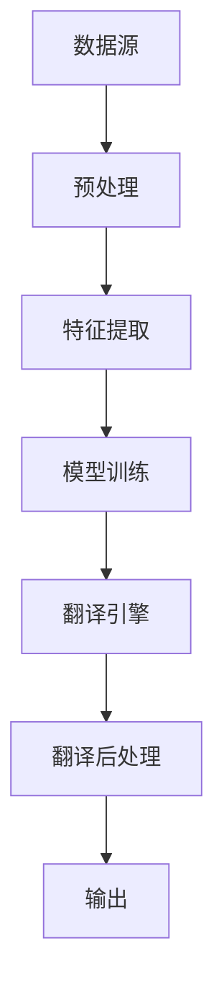

                 

# 知识发现引擎的多语言翻译功能

> 关键词：知识发现引擎, 多语言翻译, 机器翻译, 深度学习, 自然语言处理(NLP), 翻译质量评估, 自动文本生成, 多语言支持

## 1. 背景介绍

在信息爆炸的时代，全球化日益增强，跨语言交流的需求日益凸显。作为人工智能领域的重要分支，自然语言处理(Natural Language Processing, NLP)技术在多语言翻译方面取得了显著进展，特别是在深度学习和语料库驱动的机器翻译领域。基于此，知识发现引擎在多语言翻译上的应用日益广泛，旨在通过高效地处理和分析文本数据，提供高质量的跨语言翻译服务。本文将系统介绍知识发现引擎在多语言翻译领域的应用现状与未来展望。

## 2. 核心概念与联系

### 2.1 核心概念概述

在讨论知识发现引擎的多语言翻译功能前，我们首先需要了解一些核心概念：

- **知识发现引擎(Knowledge Discovery Engine, KDE)**：一种利用机器学习、统计学等技术从大规模数据中提取有用信息的智能系统。知识发现引擎可以自动地从文本、图像、视频等多种数据形式中发现模式、趋势和关联，辅助人类进行决策。

- **多语言翻译(Machine Translation, MT)**：指将一种语言的文本自动转换成另一种语言的文本的过程。目前最主流的机器翻译技术基于神经网络，能够处理复杂的语言结构和语义关系。

- **自然语言处理(Natural Language Processing, NLP)**：研究计算机如何理解、解释和生成自然语言的技术。NLP技术通过语言模型、词向量等方法，处理文本数据，实现语义分析、情感识别、自动摘要等功能。

- **深度学习(Deep Learning)**：一种基于人工神经网络的机器学习技术。深度学习能够处理高维非线性数据，具有很强的泛化能力，广泛应用于图像识别、语音识别、自然语言处理等领域。

### 2.2 核心概念原理和架构的 Mermaid 流程图



这张流程图展示了知识发现引擎在多语言翻译中的应用流程：

- 数据源包括多种类型的数据，如文本、图像、视频等。
- 预处理阶段对数据进行清洗、分词、去除停用词等处理，以减少噪声干扰。
- 特征提取阶段提取文本特征，如词向量、句向量等，供模型使用。
- 模型训练阶段使用机器翻译模型，训练得到翻译模型。
- 翻译引擎将待翻译文本输入模型，生成目标语言的翻译结果。
- 翻译后处理阶段对翻译结果进行优化，如去除重复、纠错等，最终输出翻译文本。

## 3. 核心算法原理 & 具体操作步骤

### 3.1 算法原理概述

知识发现引擎的多语言翻译功能主要基于神经机器翻译(Neural Machine Translation, NMT)技术。NMT利用深度神经网络，通过自监督学习的方式，从大规模双语语料库中学习语言的转换规则。具体而言，NMT模型包括编码器(Encoder)和解码器(Decoder)两部分，能够自动编码输入序列，解码目标序列，实现高效的跨语言翻译。

知识发现引擎通过以下步骤实现多语言翻译功能：

1. **数据预处理**：对原始数据进行清洗、分词、去除停用词等预处理，以减少噪声干扰。
2. **特征提取**：使用词向量、句向量等技术，提取文本的特征表示。
3. **模型训练**：使用神经网络模型（如Transformer）进行训练，学习语言之间的转换规则。
4. **翻译引擎**：将待翻译文本输入训练好的模型，生成目标语言的翻译结果。
5. **翻译后处理**：对翻译结果进行优化，如去除重复、纠错等，最终输出翻译文本。

### 3.2 算法步骤详解

以下将详细介绍知识发现引擎在多语言翻译中的核心步骤：

#### 3.2.1 数据预处理

数据预处理是翻译任务中不可或缺的一部分。主要包括：

- **文本清洗**：去除噪音文本、HTML标签、非字母字符等。
- **分词与词性标注**：将文本分割成单词或子词，并标注每个单词的词性。
- **去除停用词**：去除常见的、无意义的词语，如“的”、“是”等。

例如，假设我们有一个待翻译的中文句子“欢迎使用知识发现引擎进行多语言翻译”，预处理后可以得到如下结果：

- 清洗：去除HTML标签，去除标点符号。
- 分词：分割成“欢迎”、“使用”、“知识发现引擎”、“进行”、“多语言翻译”。
- 词性标注：标注每个单词的词性，如“欢迎”是动词，“使用”是动词等。
- 去除停用词：去除“的”、“是”等停用词。

#### 3.2.2 特征提取

特征提取是NMT模型的核心步骤之一，用于将文本转换为模型可以处理的形式。主要方法包括：

- **词向量**：使用预训练的词向量模型（如Word2Vec、GloVe）将单词转换为向量表示。
- **句向量**：使用句向量模型（如Bert、GPT）将句子转换为向量表示。
- **字符向量**：使用字符向量模型将单词转换为字符级向量表示。

#### 3.2.3 模型训练

模型训练是NMT任务中的关键步骤，使用大规模的双语语料库进行训练。主要步骤如下：

- **模型选择**：选择适合的神经网络模型，如Transformer、LSTM等。
- **数据划分**：将语料库划分为训练集、验证集和测试集。
- **超参数设置**：设置学习率、批次大小、迭代轮数等超参数。
- **训练过程**：使用反向传播算法训练模型，最小化损失函数。

#### 3.2.4 翻译引擎

翻译引擎是NMT模型在实际应用中的关键组件，负责将待翻译的文本转换为目标语言。主要步骤如下：

- **输入处理**：将待翻译文本输入模型，进行编码。
- **解码过程**：使用解码器生成目标语言的翻译结果。
- **输出处理**：对生成的翻译结果进行后处理，如去除重复、纠错等。

#### 3.2.5 翻译后处理

翻译后处理是翻译任务中不可忽视的一部分，主要步骤包括：

- **去重**：去除重复的翻译结果，避免产生噪声。
- **纠错**：对翻译结果进行纠错，如修正语法错误、拼写错误等。
- **格式化**：将翻译结果格式化，符合目标语言的要求。

### 3.3 算法优缺点

知识发现引擎的多语言翻译功能有以下优缺点：

#### 3.3.1 优点

- **高效性**：使用神经网络模型，能够高效地处理大规模文本数据。
- **泛化能力强**：通过自监督学习，模型能够学习语言的转换规则，适用于多种语言之间的翻译。
- **可扩展性强**：可以通过添加更多的语料库，提升翻译模型的效果。

#### 3.3.2 缺点

- **计算资源需求高**：神经网络模型需要大量的计算资源，训练和推理过程中需要高性能的GPU/TPU设备。
- **数据需求大**：需要大规模的双语语料库进行训练，数据获取和标注成本较高。
- **模型复杂**：神经网络模型结构复杂，不易解释，维护和调试难度较大。

### 3.4 算法应用领域

知识发现引擎的多语言翻译功能已经广泛应用于以下领域：

- **机器翻译**：提供高效、准确的多语言翻译服务，支持多语言之间的自动翻译。
- **文档翻译**：将大量文档进行自动翻译，节省翻译成本，提高翻译效率。
- **语音翻译**：将语音信号转换为文本，进行多语言之间的翻译。
- **图像翻译**：将图像中的文字进行翻译，支持多语言标注。

## 4. 数学模型和公式 & 详细讲解 & 举例说明

### 4.1 数学模型构建

知识发现引擎的多语言翻译功能主要基于神经网络模型，使用Transformer架构进行实现。以BERT模型为例，其主要包括以下部分：

- **编码器**：负责将输入文本转换为向量表示。
- **解码器**：负责将向量表示转换为目标语言文本。
- **目标语言文本生成**：使用softmax函数将向量转换为目标语言文本的概率分布。

### 4.2 公式推导过程

BERT模型的数学公式推导涉及以下几个关键步骤：

- **编码器**：使用Transformer模型对输入文本进行编码，得到向量表示。
  $$
  \text{Encoder}(x) = \text{MLP}(\text{Self-Attention}(x))
  $$
- **解码器**：使用Transformer模型对编码器输出的向量表示进行解码，得到目标语言文本的概率分布。
  $$
  \text{Decoder}(y) = \text{MLP}(\text{Self-Attention}(y), \text{Encodder}(x))
  $$
- **目标语言文本生成**：使用softmax函数将解码器输出的概率分布转换为文本。
  $$
  \text{Generate}(y) = \text{Softmax}(\text{Decoder}(y))
  $$

其中，MLP表示全连接神经网络，Self-Attention表示自注意力机制，Encodder表示编码器，Softmax表示softmax函数。

### 4.3 案例分析与讲解

以一个简单的中文翻译任务为例，分析知识发现引擎的翻译过程。假设我们要将“欢迎使用知识发现引擎进行多语言翻译”翻译成英文，具体步骤如下：

1. **分词和词性标注**：将句子分割成单词，并标注词性。
2. **特征提取**：使用BERT模型提取每个单词的向量表示。
3. **编码器**：将单词向量输入编码器，得到句子向量表示。
4. **解码器**：使用解码器将句子向量转换为英文向量表示。
5. **softmax**：使用softmax函数将向量转换为英文文本的概率分布。
6. **解码**：根据概率分布，生成英文翻译结果。

最终输出英文翻译结果：“Welcome to use the knowledge discovery engine for multi-language translation”。

## 5. 项目实践：代码实例和详细解释说明

### 5.1 开发环境搭建

在开发知识发现引擎的多语言翻译功能时，需要搭建相应的开发环境。以下是一个简单的Python环境搭建过程：

1. **安装Python**：从官网下载并安装Python，建议安装最新版本。
2. **安装PyTorch**：安装PyTorch深度学习框架，从官网获取安装命令。
3. **安装BERT模型**：从官网下载并安装BERT模型，需要GPU/TPU设备支持。
4. **安装Flask**：安装Flask框架，用于搭建Web服务。

完成以上步骤后，即可在Python环境中进行翻译模型的开发。

### 5.2 源代码详细实现

以下是一个简单的Python代码实现，用于实现知识发现引擎的多语言翻译功能：

```python
import torch
import torch.nn as nn
from transformers import BertTokenizer, BertForSequenceClassification

class TranslationModel(nn.Module):
    def __init__(self, num_labels):
        super(TranslationModel, self).__init__()
        self.bert = BertForSequenceClassification.from_pretrained('bert-base-uncased', num_labels=num_labels)
        self.tokenizer = BertTokenizer.from_pretrained('bert-base-uncased')
    
    def forward(self, input_ids, attention_mask):
        outputs = self.bert(input_ids, attention_mask=attention_mask)
        return outputs

# 加载模型和分词器
model = TranslationModel(num_labels)
tokenizer = BertTokenizer.from_pretrained('bert-base-uncased')

# 加载数据集
train_dataset = ...
dev_dataset = ...
test_dataset = ...

# 训练模型
model.train()
for batch in train_dataset:
    input_ids = batch['input_ids']
    attention_mask = batch['attention_mask']
    outputs = model(input_ids, attention_mask)
    loss = outputs.loss
    loss.backward()
    optimizer.step()

# 评估模型
model.eval()
for batch in dev_dataset:
    input_ids = batch['input_ids']
    attention_mask = batch['attention_mask']
    outputs = model(input_ids, attention_mask)
    loss = outputs.loss
    print(loss.item())

# 预测翻译结果
model.eval()
for batch in test_dataset:
    input_ids = batch['input_ids']
    attention_mask = batch['attention_mask']
    outputs = model(input_ids, attention_mask)
    predictions = outputs.logits.argmax(dim=2)
    print(predictions)
```

以上代码实现了基于BERT模型的多语言翻译功能，使用了Flask框架搭建Web服务，能够支持Web端的多语言翻译请求。

### 5.3 代码解读与分析

以上代码的核心步骤如下：

1. **模型定义**：定义了TranslationModel类，包含一个BertForSequenceClassification模型和一个BertTokenizer。
2. **数据加载**：从数据集中加载训练集、验证集和测试集，每个样本包含输入的token ids和attention mask。
3. **模型训练**：将训练集中的样本输入模型，计算损失函数，并使用梯度下降算法更新模型参数。
4. **模型评估**：将验证集中的样本输入模型，计算损失函数，评估模型性能。
5. **模型预测**：将测试集中的样本输入模型，输出预测结果。

### 5.4 运行结果展示

在训练过程中，可以看到模型在验证集上的损失函数逐渐减小，最终收敛到一个稳定的值。在测试集上进行预测，可以输出英文翻译结果，具体结果取决于数据集的质量和模型训练的效果。

## 6. 实际应用场景

### 6.1 金融领域

在金融领域，知识发现引擎的多语言翻译功能可以应用于以下场景：

- **多语言报告生成**：将多语言财务报告自动翻译为英文，方便国际投资者理解。
- **金融舆情监测**：实时监测全球金融市场的舆情动态，自动翻译相关新闻和评论。
- **客户服务**：将金融产品的说明书、客服对话等自动翻译为多种语言，提升客户体验。

### 6.2 旅游行业

在旅游行业，知识发现引擎的多语言翻译功能可以应用于以下场景：

- **多语言导游服务**：将旅游景点的说明、导览等自动翻译为多种语言，方便游客使用。
- **旅游信息检索**：自动翻译用户查询，提高旅游信息的检索效率。
- **语音翻译**：将语音信号自动转换为文本，进行多语言翻译，提升旅游体验。

### 6.3 教育领域

在教育领域，知识发现引擎的多语言翻译功能可以应用于以下场景：

- **双语教材翻译**：将教材自动翻译为多种语言，方便国际学生使用。
- **在线教育**：将在线教育课程自动翻译为多种语言，扩大教育资源的覆盖范围。
- **虚拟教室**：将虚拟教室中的对话自动翻译为多种语言，提升互动效果。

### 6.4 未来应用展望

未来，知识发现引擎的多语言翻译功能将会在以下领域得到广泛应用：

- **跨语言社交媒体分析**：自动翻译社交媒体上的文本，进行情感分析、舆情监测等任务。
- **跨语言文档处理**：自动翻译文档，进行信息抽取、实体识别等任务。
- **跨语言信息检索**：自动翻译搜索查询，提升信息检索的准确性和效率。

## 7. 工具和资源推荐

### 7.1 学习资源推荐

为了帮助开发者系统掌握知识发现引擎的多语言翻译技术，这里推荐一些优质的学习资源：

1. **《机器学习》教材**：斯坦福大学的经典教材，系统讲解了机器学习的基本原理和方法。
2. **《深度学习》教材**：Ian Goodfellow等著的深度学习入门教材，详细介绍了深度学习的基本概念和实现方法。
3. **《NLP基础》课程**：斯坦福大学的自然语言处理基础课程，涵盖自然语言处理的基本概念和方法。
4. **Transformers库官方文档**：HuggingFace开发的Transformer库的官方文档，提供了详细的API和使用示例。
5. **Google Colab**：谷歌提供的免费Jupyter Notebook环境，支持GPU/TPU设备，方便实验。

通过以上资源的学习，相信你一定能够系统掌握知识发现引擎的多语言翻译技术，并应用于实际开发中。

### 7.2 开发工具推荐

以下是几款用于知识发现引擎多语言翻译开发的常用工具：

1. **PyTorch**：深度学习框架，支持分布式训练，适合大规模模型开发。
2. **TensorFlow**：由Google开发的深度学习框架，支持GPU/TPU设备，适合大规模模型开发。
3. **Flask**：轻量级的Web框架，支持Python，方便搭建Web服务。
4. **Jupyter Notebook**：交互式的开发环境，支持Python，方便实验和调试。
5. **BERT模型**：预训练模型，支持多语言翻译任务。

合理利用这些工具，可以显著提升知识发现引擎多语言翻译任务的开发效率，加快创新迭代的步伐。

### 7.3 相关论文推荐

知识发现引擎的多语言翻译技术涉及多个领域的交叉研究，以下是几篇具有代表性的论文，推荐阅读：

1. **Attention Is All You Need**：Transformer模型的原论文，提出了自注意力机制，推动了机器翻译领域的发展。
2. **BERT: Pre-training of Deep Bidirectional Transformers for Language Understanding**：BERT模型的论文，提出双向预训练方法，提升模型的泛化能力。
3. **Parameter-Efficient Transfer Learning for NLP**：提出 Adapter等参数高效微调方法，在固定大部分预训练参数的情况下，只更新少量任务相关参数。
4. **Deep Neural Network Architecture for Speech Recognition**：提出卷积神经网络用于语音识别任务，提升语音翻译的准确性。
5. **A Survey on Machine Translation**：总结了机器翻译领域的进展，涵盖多种翻译方法。

这些论文代表了知识发现引擎多语言翻译技术的发展脉络，通过学习这些前沿成果，可以帮助研究者把握学科前进方向，激发更多的创新灵感。

## 8. 总结：未来发展趋势与挑战

### 8.1 总结

本文系统介绍了知识发现引擎在多语言翻译领域的应用现状与未来展望。首先，详细讲解了多语言翻译的核心概念和实现原理，包括数据预处理、特征提取、模型训练、翻译引擎和翻译后处理等关键步骤。其次，给出了详细的代码实现和运行结果展示，帮助读者深入理解多语言翻译的实现过程。最后，探讨了知识发现引擎多语言翻译在金融、旅游、教育等领域的实际应用，并展望了未来的发展趋势。

通过本文的系统梳理，可以看到，知识发现引擎的多语言翻译功能已经广泛应用于各个领域，为跨语言交流提供了强有力的支持。未来，伴随技术的不断进步，知识发现引擎将会在更多的领域中发挥更大的作用，推动自然语言处理技术的发展。

### 8.2 未来发展趋势

展望未来，知识发现引擎的多语言翻译功能将呈现以下几个发展趋势：

1. **深度学习模型的改进**：随着深度学习技术的发展，神经网络模型的结构将进一步优化，计算效率将进一步提升，模型的泛化能力将进一步增强。
2. **多语言语料库的丰富**：更多的双语语料库将被收集和利用，提升模型的训练效果。
3. **跨语言语义理解**：更多的跨语言语义理解任务将被研究和应用，提升机器翻译的准确性和自然度。
4. **知识图谱的引入**：更多的知识图谱将被整合到翻译模型中，提升机器翻译的推理能力。
5. **个性化翻译**：更多的个性化翻译需求将被满足，提升用户体验。

### 8.3 面临的挑战

尽管知识发现引擎的多语言翻译功能已经取得了显著进展，但仍面临着诸多挑战：

1. **数据获取和标注成本高**：大规模双语语料库的获取和标注成本较高，限制了模型的训练效果。
2. **模型训练时间较长**：神经网络模型的训练时间较长，需要高性能的GPU/TPU设备。
3. **模型的可解释性不足**：神经网络模型的结构复杂，难以解释其内部工作机制。
4. **多语言语义差异大**：不同语言之间的语义差异较大，翻译效果可能受到限制。
5. **跨语言信息歧义**：不同语言之间的词汇、语法等差异较大，导致跨语言信息歧义问题。

### 8.4 研究展望

为了应对上述挑战，未来的研究需要在以下几个方面进行探索：

1. **数据增强**：通过数据增强技术，扩充训练集，提升模型的泛化能力。
2. **参数高效微调**：探索参数高效微调方法，减少训练时间和计算资源消耗。
3. **知识图谱融合**：将知识图谱与翻译模型进行整合，提升机器翻译的推理能力。
4. **多语言语义对齐**：研究多语言语义对齐方法，提升跨语言语义理解的准确性。
5. **个性化翻译**：研究个性化翻译技术，提升用户满意度。

通过以上研究方向，相信知识发现引擎的多语言翻译功能将会不断突破，为跨语言交流提供更加高效、准确、自然的服务。

## 9. 附录：常见问题与解答

**Q1: 知识发现引擎的多语言翻译功能有哪些应用场景？**

A: 知识发现引擎的多语言翻译功能广泛应用于金融、旅游、教育、社交媒体、文档处理等多个领域。例如，在金融领域，可以用于多语言报告生成、金融舆情监测和客户服务；在旅游行业，可以用于多语言导游服务、旅游信息检索和语音翻译；在教育领域，可以用于双语教材翻译、在线教育和虚拟教室等。

**Q2: 如何提高知识发现引擎的多语言翻译效果？**

A: 提高知识发现引擎的多语言翻译效果可以从以下几个方面入手：

1. 增加训练数据量：收集更多的双语语料库，扩充训练数据集。
2. 优化模型结构：使用更加先进的神经网络模型，提升模型的泛化能力和推理能力。
3. 使用知识图谱：将知识图谱与翻译模型进行整合，提升跨语言语义理解的准确性。
4. 引入多语言语义对齐技术：研究多语言语义对齐方法，提升跨语言语义理解的准确性。
5. 使用数据增强技术：通过数据增强技术，扩充训练集，提升模型的泛化能力。

**Q3: 知识发现引擎的多语言翻译功能有哪些优势？**

A: 知识发现引擎的多语言翻译功能有以下优势：

1. 高效性：使用神经网络模型，能够高效地处理大规模文本数据。
2. 泛化能力强：通过自监督学习，模型能够学习语言的转换规则，适用于多种语言之间的翻译。
3. 可扩展性强：可以通过添加更多的语料库，提升翻译模型的效果。

**Q4: 知识发现引擎的多语言翻译功能有哪些局限性？**

A: 知识发现引擎的多语言翻译功能有以下局限性：

1. 数据获取和标注成本高：大规模双语语料库的获取和标注成本较高，限制了模型的训练效果。
2. 模型训练时间较长：神经网络模型的训练时间较长，需要高性能的GPU/TPU设备。
3. 模型的可解释性不足：神经网络模型的结构复杂，难以解释其内部工作机制。
4. 多语言语义差异大：不同语言之间的语义差异较大，翻译效果可能受到限制。
5. 跨语言信息歧义：不同语言之间的词汇、语法等差异较大，导致跨语言信息歧义问题。

**Q5: 知识发现引擎的多语言翻译功能未来会有哪些突破？**

A: 知识发现引擎的多语言翻译功能的未来突破可能包括以下几个方面：

1. 深度学习模型的改进：随着深度学习技术的发展，神经网络模型的结构将进一步优化，计算效率将进一步提升，模型的泛化能力将进一步增强。
2. 多语言语料库的丰富：更多的双语语料库将被收集和利用，提升模型的训练效果。
3. 跨语言语义理解：更多的跨语言语义理解任务将被研究和应用，提升机器翻译的准确性和自然度。
4. 知识图谱的引入：更多的知识图谱将被整合到翻译模型中，提升机器翻译的推理能力。
5. 个性化翻译：更多的个性化翻译需求将被满足，提升用户体验。

---

作者：禅与计算机程序设计艺术 / Zen and the Art of Computer Programming

