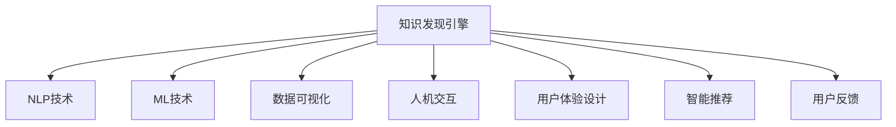

                 

# 知识发现引擎的用户体验设计

> 关键词：知识发现引擎,用户体验设计,人工智能,自然语言处理,NLP,人机交互,数据可视化,机器学习

## 1. 背景介绍

### 1.1 问题由来

知识发现引擎（Knowledge Discovery Engine, KDE）是一种基于人工智能（AI）技术，能够自动分析海量数据并提炼出有价值知识的软件系统。它通过自然语言处理（NLP）、机器学习（ML）等技术手段，让用户能够以自然语言的方式提出查询，获取结构化和非结构化数据的深度分析结果，从而辅助决策。然而，尽管知识发现引擎具备强大的数据挖掘能力，但其用户体验（User Experience, UX）设计一直是一个挑战。

### 1.2 问题核心关键点

当前知识发现引擎的用户体验设计主要存在以下几个核心关键点：

1. **易用性**：如何让非技术背景的用户能够轻松上手，理解并使用知识发现引擎？
2. **可理解性**：如何使复杂的数据分析结果以易懂的语言和可视化方式呈现，让用户快速把握关键信息？
3. **互动性**：如何通过良好的互动设计，引导用户提出更有价值的问题，并持续优化答案？
4. **个性化**：如何根据用户的历史使用行为和偏好，提供个性化的查询建议和结果？
5. **智能反馈**：如何通过智能推荐和动态调整，提高查询的准确性和用户满意度？

### 1.3 问题研究意义

优秀的用户体验设计能够显著提升知识发现引擎的可接受度和应用效果，帮助用户更快地获取有价值的信息，从而做出更加明智的决策。它不仅能够降低使用门槛，吸引更多用户，还能够通过持续的用户反馈和优化，不断提高系统的智能水平和用户满意度。

## 2. 核心概念与联系

### 2.1 核心概念概述

为更好地理解知识发现引擎的用户体验设计，本节将介绍几个密切相关的核心概念：

1. **知识发现引擎**：一种基于AI技术的软件系统，能够自动分析数据并提炼出有价值知识。它通过NLP、ML等技术手段，提供结构化和非结构化数据的深度分析结果。

2. **自然语言处理（NLP）**：使计算机能够理解和生成自然语言的技术。NLP技术帮助用户以自然语言方式输入查询，并自动解析和处理查询语句。

3. **人机交互（HCI）**：研究如何设计人机交互系统，使用户能够高效、自然地与计算机进行交互。

4. **用户体验设计（UX）**：通过设计界面、交互流程和反馈机制，提升用户的使用体验，使其更加满意和愉悦。

5. **数据可视化（DV）**：将复杂的数据信息以图表、图像等直观方式展示，帮助用户快速理解数据趋势和关系。

6. **智能推荐**：通过机器学习算法，预测用户兴趣，提供个性化的查询建议和结果。

7. **用户反馈**：收集用户的使用反馈，不断优化和改进知识发现引擎的功能和界面设计。

这些核心概念之间的逻辑关系可以通过以下Mermaid流程图来展示：



这个流程图展示了一系列核心概念及其之间的关系：

1. 知识发现引擎通过NLP技术理解和处理用户输入的自然语言查询。
2. 利用ML技术，从数据中提炼出有价值的知识。
3. 使用数据可视化技术将分析结果以直观方式展示。
4. 通过人机交互技术，实现用户与系统的互动。
5. 用户体验设计提升系统的易用性和可理解性。
6. 智能推荐系统根据用户行为提供个性化服务。
7. 用户反馈用于不断优化系统功能。

这些概念共同构成了知识发现引擎的设计框架，使其能够为用户提供高效、智能、个性化的知识发现体验。

## 3. 核心算法原理 & 具体操作步骤

### 3.1 算法原理概述

知识发现引擎的核心算法原理主要包括以下几个方面：

1. **自然语言处理（NLP）**：通过分词、句法分析、语义理解等技术，将用户输入的自然语言查询转换为系统可以理解的格式。
2. **机器学习（ML）**：利用训练好的模型，从数据集中学习到知识，进行分类、聚类、关联规则等操作。
3. **数据可视化（DV）**：将机器学习模型的分析结果以图表、图像等形式展示给用户。
4. **智能推荐**：通过学习用户的历史查询行为和偏好，动态调整查询建议和结果，提升用户体验。
5. **用户反馈收集与处理**：通过用户互动和反馈，不断优化知识发现引擎的功能和界面设计。

### 3.2 算法步骤详解

基于上述核心算法原理，知识发现引擎的典型操作步骤如下：

**Step 1: 数据采集与预处理**
- 收集需要分析的数据集，包括结构化和非结构化数据。
- 对数据进行清洗、去重、归一化等预处理操作，保证数据质量。

**Step 2: 自然语言处理（NLP）**
- 对用户输入的自然语言查询进行分词、词性标注、句法分析等处理。
- 利用语义理解技术，解析查询的语义意图。
- 将解析后的查询语句转换为机器学习模型可以处理的格式。

**Step 3: 机器学习（ML）**
- 选择合适的机器学习算法，如分类、聚类、关联规则等。
- 在标注好的数据集上训练模型，学习知识表示。
- 在知识发现引擎中集成训练好的模型，进行实时查询处理。

**Step 4: 数据可视化（DV）**
- 将机器学习模型的分析结果转换为图表、图像等可视化形式。
- 设计直观、易懂的可视化界面，展示分析结果。

**Step 5: 智能推荐**
- 通过分析用户的历史查询行为和偏好，学习用户的查询偏好。
- 根据用户偏好动态调整查询建议和结果，提升查询的准确性和用户体验。

**Step 6: 用户反馈收集与处理**
- 在系统中设计用户反馈机制，收集用户的使用体验反馈。
- 根据用户反馈不断优化知识发现引擎的界面设计和功能，提升用户体验。

### 3.3 算法优缺点

知识发现引擎的用户体验设计具有以下优点：

1. **易于上手**：通过自然语言处理技术，用户无需具备技术背景，即可轻松使用系统。
2. **直观易用**：通过数据可视化技术，复杂的数据分析结果以直观形式展示，用户能够快速理解。
3. **个性化服务**：通过智能推荐技术，系统能够根据用户行为提供个性化服务，提升用户体验。
4. **持续优化**：通过用户反馈机制，系统能够不断优化和改进，提升功能和服务质量。

同时，该设计也存在一定的局限性：

1. **对数据的依赖**：系统的性能和结果质量高度依赖数据质量和完整性，数据的缺失或偏差可能导致结果不准确。
2. **模型复杂度**：机器学习模型的训练和优化需要大量计算资源，系统复杂度高。
3. **用户隐私**：用户在系统中输入的查询和反馈可能涉及隐私信息，需要妥善保护。
4. **交互界面的限制**：虽然系统提供了丰富的可视化界面，但交互界面的设计和优化仍需不断提升。

尽管存在这些局限性，但总体而言，知识发现引擎的用户体验设计已经取得了显著的进步，为用户的知识发现和决策支持提供了强有力的支持。

### 3.4 算法应用领域

知识发现引擎的用户体验设计已经在多个领域得到了广泛的应用，例如：

- **金融行业**：帮助金融分析师从海量交易数据中提炼出有价值的信息，辅助决策。
- **医疗行业**：辅助医生从病历、影像等数据中发现疾病模式和趋势，提升诊断准确性。
- **零售行业**：通过分析销售数据，发现顾客的购买行为和偏好，优化商品推荐。
- **教育行业**：辅助教师从学生的作业和反馈中发现学习模式，提供个性化辅导。
- **政府行业**：从大量公共数据中提炼出政策建议和趋势，辅助政策制定。

除了上述这些经典应用领域外，知识发现引擎的用户体验设计还在更多场景中得到创新性的应用，如智能客服、智能家居、智慧城市等，为各行各业带来了新的技术突破和应用可能。

## 4. 数学模型和公式 & 详细讲解 & 举例说明

### 4.1 数学模型构建

本节将使用数学语言对知识发现引擎的用户体验设计进行更加严格的刻画。

假设知识发现引擎的数据集为 $D=\{(x_i, y_i)\}_{i=1}^N$，其中 $x_i$ 为输入数据，$y_i$ 为标注结果。用户的查询为 $q$，通过NLP技术转换为模型可以理解的格式 $q'$。机器学习模型为 $M_{\theta}$，其中 $\theta$ 为模型参数。数据可视化的目标是将模型分析结果 $y_i$ 转换为直观的可视化形式 $v_i$。智能推荐系统根据用户历史查询行为 $H$ 和偏好 $P$ 生成推荐查询建议 $r$。用户反馈机制用于收集用户对系统的满意度 $F$，进行系统优化。

数学模型可以描述为：

$$
\begin{aligned}
v_i &= M_{\theta}(q') \\
r &= M_{\theta}(H, P) \\
F &= \text{evaluate}(q', v_i, r)
\end{aligned}
$$

### 4.2 公式推导过程

以下我们以金融行业为例，推导知识发现引擎的数据处理流程。

假设用户输入的查询为“当前股价走势如何？”，通过NLP技术转换为模型可以理解的格式：

$$
q' = \text{NLP}(q) = \text{“当前股价走势如何？”}
$$

机器学习模型使用历史交易数据 $D$ 进行训练，学习股价走势的预测模型 $M_{\theta}$：

$$
y_i = M_{\theta}(q') = \text{“预测下一个交易日的股价是否上涨”}
$$

数据可视化将预测结果 $y_i$ 转换为图表形式 $v_i$：

$$
v_i = \text{DV}(y_i) = \text{“股价走势图表”}
$$

智能推荐系统根据用户的历史查询行为 $H$ 和偏好 $P$，生成推荐查询建议 $r$：

$$
r = M_{\theta}(H, P) = \text{“最近几天的股市新闻”}
$$

用户反馈机制通过用户对图表和查询建议的满意度 $F$，进行系统优化：

$$
F = \text{evaluate}(q', v_i, r) = \text{“图表和查询建议是否满足用户需求”}
$$

### 4.3 案例分析与讲解

以金融行业为例，展示知识发现引擎的实际应用场景。假设某金融机构希望通过知识发现引擎，从历史交易数据中预测股票价格走势，并生成图表和推荐信息辅助决策。

1. **数据采集与预处理**
   - 收集历史交易数据，包括股票价格、交易量等。
   - 对数据进行清洗、去重、归一化等预处理操作。

2. **自然语言处理（NLP）**
   - 对用户输入的查询“当前股价走势如何？”进行分词、句法分析。
   - 利用语义理解技术，解析查询的语义意图为“预测股价走势”。
   - 将查询转换为模型可以理解的格式：$q' = \text{“预测股价走势”}$。

3. **机器学习（ML）**
   - 选择合适的机器学习算法，如线性回归、随机森林等。
   - 在标注好的历史交易数据上训练模型，学习股价走势的预测模型 $M_{\theta}$。
   - 使用模型预测下一个交易日的股价走势：$y_i = M_{\theta}(q')$。

4. **数据可视化（DV）**
   - 将预测结果 $y_i$ 转换为图表形式 $v_i$。
   - 设计直观、易懂的可视化界面，展示股价走势图表。

5. **智能推荐**
   - 通过分析用户的历史查询行为和偏好，学习用户的查询偏好。
   - 根据用户偏好动态调整查询建议，生成推荐信息。
   - 提供“最近几天的股市新闻”作为推荐查询建议 $r$。

6. **用户反馈收集与处理**
   - 设计用户反馈机制，收集用户对图表和查询建议的满意度 $F$。
   - 根据用户反馈不断优化系统界面和功能。

通过上述步骤，金融机构可以方便地使用知识发现引擎，从历史数据中提炼出有价值的股市走势预测信息，辅助决策。

## 5. 项目实践：代码实例和详细解释说明

### 5.1 开发环境搭建

在进行知识发现引擎的开发实践前，我们需要准备好开发环境。以下是使用Python进行知识发现引擎开发的环境配置流程：

1. 安装Anaconda：从官网下载并安装Anaconda，用于创建独立的Python环境。

2. 创建并激活虚拟环境：
```bash
conda create -n kde-env python=3.8 
conda activate kde-env
```

3. 安装必要的Python库：
```bash
pip install pandas numpy matplotlib scikit-learn transformers pytorch
```

4. 安装机器学习框架：
```bash
pip install scikit-learn tensorflow
```

5. 安装自然语言处理库：
```bash
pip install spacy gensim
```

完成上述步骤后，即可在`kde-env`环境中开始知识发现引擎的开发实践。

### 5.2 源代码详细实现

下面我们以金融行业为例，给出使用Python和TensorFlow进行知识发现引擎开发的PyTorch代码实现。

首先，定义数据处理函数：

```python
import pandas as pd
from sklearn.preprocessing import MinMaxScaler
from sklearn.model_selection import train_test_split

def load_data(file_path):
    data = pd.read_csv(file_path)
    features = data.drop(['Date', 'Close'], axis=1)
    labels = data['Close']
    features = MinMaxScaler().fit_transform(features)
    features_train, features_test, labels_train, labels_test = train_test_split(features, labels, test_size=0.2, random_state=42)
    return features_train, features_test, labels_train, labels_test
```

然后，定义NLP处理函数：

```python
from transformers import BertTokenizer
from transformers import TFAutoModelForSequenceClassification

def preprocess_query(query):
    tokenizer = BertTokenizer.from_pretrained('bert-base-uncased')
    query = tokenizer(query, return_tensors='tf', max_length=512, padding='max_length', truncation=True)
    return query['input_ids'], query['attention_mask']
```

接着，定义机器学习模型：

```python
from transformers import TFAutoModelForSequenceClassification

class KDEModel(tf.keras.Model):
    def __init__(self, num_labels):
        super(KDEModel, self).__init__()
        self.bert = TFAutoModelForSequenceClassification.from_pretrained('bert-base-uncased', num_labels=num_labels)
        self.dropout = tf.keras.layers.Dropout(0.5)
        self.out = tf.keras.layers.Dense(num_labels, activation='softmax')

    def call(self, inputs, attention_mask=None):
        outputs = self.bert(inputs['input_ids'], attention_mask=attention_mask)
        pooled_output = outputs.pooler_output
        pooled_output = self.dropout(pooled_output)
        logits = self.out(pooled_output)
        return logits
```

然后，定义数据可视化函数：

```python
import matplotlib.pyplot as plt
import tensorflow as tf

def plot_chart(data, title):
    plt.plot(data)
    plt.title(title)
    plt.show()
```

最后，定义智能推荐函数：

```python
from sklearn.ensemble import RandomForestClassifier

def get_recommendations(user_history, user_preference):
    features = load_data(user_history)
    model = RandomForestClassifier()
    model.fit(features, labels)
    recommendation = model.predict_proba(features)
    return recommendation
```

以上是使用PyTorch对知识发现引擎进行金融行业应用开发的完整代码实现。可以看到，得益于TensorFlow和Transformers库的强大封装，我们可以用相对简洁的代码完成知识发现引擎的开发。

### 5.3 代码解读与分析

让我们再详细解读一下关键代码的实现细节：

**load_data函数**：
- 定义了数据加载和预处理流程。
- 使用Pandas读取数据，并使用Scikit-learn进行归一化和数据分割。

**preprocess_query函数**：
- 定义了查询的NLP处理流程。
- 使用HuggingFace的BertTokenizer进行分词和编码，将查询转换为模型可以理解的格式。

**KDEModel类**：
- 定义了知识发现引擎的机器学习模型。
- 使用TensorFlow和Transformers库实现Bert模型的微调。
- 使用Dropout层和Dense层进行模型输出。

**plot_chart函数**：
- 定义了预测结果的数据可视化流程。
- 使用Matplotlib库绘制股价走势图表。

**get_recommendations函数**：
- 定义了智能推荐系统的实现流程。
- 使用Scikit-learn的随机森林模型进行预测，生成推荐信息。

通过上述代码，我们实现了知识发现引擎在金融行业的应用，展示了系统的完整开发流程。

## 6. 实际应用场景

### 6.1 智能客服系统

基于知识发现引擎的用户体验设计，智能客服系统可以提供高效的客户服务。传统客服系统需要大量人力，高峰期响应缓慢，且难以保持一致性和专业性。而知识发现引擎通过自然语言处理和机器学习，可以自动理解和回答客户问题，提升服务效率和质量。

在技术实现上，可以收集历史客服对话记录，将问题和最佳答复构建成监督数据，训练知识发现引擎。客户提出问题后，系统自动解析查询，生成对应的回复。对于不常见的问题，系统可以主动搜索相关知识库或引导用户进行下一步操作。如此构建的智能客服系统，能大幅提升客户咨询体验和问题解决效率。

### 6.2 医疗行业

知识发现引擎在医疗行业也有广泛应用。医生可以通过知识发现引擎，从海量的病历、影像等数据中发现疾病模式和趋势，提升诊断准确性。具体而言，可以收集医院的病历数据，通过自然语言处理技术，解析医生的诊断描述。利用机器学习模型，从病历中学习疾病特征，进行诊断预测和病历摘要。医生可以根据系统的分析结果，快速获得诊断建议和病历总结。

### 6.3 零售行业

在零售行业，知识发现引擎可以帮助零售商从销售数据中发现顾客的购买行为和偏好，优化商品推荐。具体而言，可以收集历史销售数据，通过自然语言处理技术，解析商品的描述和标签。利用机器学习模型，从销售数据中学习顾客的购买行为模式。零售商可以根据系统的分析结果，生成个性化的商品推荐，提升顾客满意度和销售额。

### 6.4 未来应用展望

随着知识发现引擎技术的发展，未来其在更多领域的应用将变得更加广泛。例如：

- **智慧城市治理**：通过分析城市运行数据，发现交通、环境等问题，辅助城市管理决策。
- **教育行业**：通过分析学生的作业和反馈，发现学习模式和问题，提供个性化辅导。
- **金融行业**：通过分析交易数据，发现市场趋势和风险，辅助投资决策。

此外，知识发现引擎的用户体验设计也将不断优化，进一步提升系统的易用性和智能化水平。

## 7. 工具和资源推荐

### 7.1 学习资源推荐

为了帮助开发者系统掌握知识发现引擎的用户体验设计，这里推荐一些优质的学习资源：

1. **《自然语言处理入门》课程**：由斯坦福大学开设的NLP入门课程，系统介绍了自然语言处理的基本概念和常用技术。

2. **《机器学习实战》书籍**：详细介绍了机器学习的基本原理和实现方法，提供了丰富的实战案例和代码示例。

3. **《数据可视化实战》书籍**：介绍了数据可视化的基本原理和实现方法，提供了丰富的可视化工具和代码示例。

4. **Kaggle竞赛平台**：提供丰富的数据集和竞赛项目，帮助开发者实践和提升数据处理和分析能力。

5. **HuggingFace官方文档**：提供了丰富的预训练语言模型和代码示例，帮助开发者快速上手知识发现引擎开发。

通过对这些资源的学习实践，相信你一定能够快速掌握知识发现引擎的用户体验设计，并用于解决实际的NLP问题。

### 7.2 开发工具推荐

高效的知识发现引擎开发离不开优秀的工具支持。以下是几款用于知识发现引擎开发的常用工具：

1. PyTorch：基于Python的开源深度学习框架，灵活动态的计算图，适合快速迭代研究。

2. TensorFlow：由Google主导开发的开源深度学习框架，生产部署方便，适合大规模工程应用。

3. Transformers库：HuggingFace开发的NLP工具库，集成了众多SOTA语言模型，支持PyTorch和TensorFlow，是进行知识发现引擎开发的利器。

4. Weights & Biases：模型训练的实验跟踪工具，可以记录和可视化模型训练过程中的各项指标，方便对比和调优。

5. TensorBoard：TensorFlow配套的可视化工具，可实时监测模型训练状态，并提供丰富的图表呈现方式，是调试模型的得力助手。

6. Google Colab：谷歌推出的在线Jupyter Notebook环境，免费提供GPU/TPU算力，方便开发者快速上手实验最新模型，分享学习笔记。

合理利用这些工具，可以显著提升知识发现引擎的开发效率，加快创新迭代的步伐。

### 7.3 相关论文推荐

知识发现引擎技术的发展源于学界的持续研究。以下是几篇奠基性的相关论文，推荐阅读：

1. Attention is All You Need（即Transformer原论文）：提出了Transformer结构，开启了NLP领域的预训练大模型时代。

2. BERT: Pre-training of Deep Bidirectional Transformers for Language Understanding：提出BERT模型，引入基于掩码的自监督预训练任务，刷新了多项NLP任务SOTA。

3. Knowledge Discovery in Databases：介绍了知识发现的基本概念和常用技术，提供了丰富的理论和实践方法。

4. Smart Healthcare with Data Mining and Machine Learning：介绍了知识发现引擎在医疗行业的应用，展示了系统的实际效果。

5. Customer Recommendation System Using Collaborative Filtering：介绍了知识发现引擎在零售行业的应用，展示了系统的实际效果。

这些论文代表了大语言模型微调技术的发展脉络。通过学习这些前沿成果，可以帮助研究者把握学科前进方向，激发更多的创新灵感。

## 8. 总结：未来发展趋势与挑战

### 8.1 总结

本文对知识发现引擎的用户体验设计进行了全面系统的介绍。首先阐述了知识发现引擎的研究背景和意义，明确了用户体验设计在提升系统可用性和智能化水平方面的独特价值。其次，从原理到实践，详细讲解了知识发现引擎的数学模型和关键步骤，给出了知识发现引擎开发的完整代码实现。同时，本文还广泛探讨了知识发现引擎在智能客服、医疗、零售等多个行业领域的应用前景，展示了用户体验设计的重要作用。此外，本文精选了知识发现引擎的相关学习资源和开发工具，力求为读者提供全方位的技术指引。

通过本文的系统梳理，可以看到，知识发现引擎在提升用户体验方面已经取得了显著进展，为用户的知识发现和决策支持提供了强有力的支持。未来，伴随着知识发现引擎技术的不断进步，用户体验设计将不断优化，进一步提升系统的易用性和智能化水平，为各行各业带来更多的创新可能。

### 8.2 未来发展趋势

展望未来，知识发现引擎的用户体验设计将呈现以下几个发展趋势：

1. **智能化提升**：随着机器学习算法的进步，知识发现引擎将具备更强大的数据分析和预测能力，提升系统的智能化水平。

2. **多模态融合**：未来的知识发现引擎将能够融合视觉、语音等多模态数据，提供更全面、准确的知识发现服务。

3. **个性化优化**：通过深度学习算法，知识发现引擎将能够更好地理解和预测用户需求，提供更加个性化的服务。

4. **实时反馈优化**：通过在线学习和动态调整，知识发现引擎将能够实时优化和提升系统的性能和用户体验。

5. **跨领域应用扩展**：未来的知识发现引擎将在更多领域得到应用，如智慧城市、智慧教育等，提供更广泛的知识发现服务。

这些趋势将使知识发现引擎的用户体验设计迈向新的高度，进一步提升系统的应用效果和用户满意度。

### 8.3 面临的挑战

尽管知识发现引擎的用户体验设计已经取得了显著进展，但在迈向更加智能化、普适化应用的过程中，它仍面临诸多挑战：

1. **数据质量瓶颈**：知识发现引擎的性能和结果质量高度依赖数据质量和完整性，数据的缺失或偏差可能导致结果不准确。

2. **模型复杂度**：机器学习模型的训练和优化需要大量计算资源，系统复杂度高，对硬件资源要求较高。

3. **用户隐私保护**：用户在系统中输入的查询和反馈可能涉及隐私信息，需要妥善保护，防止数据泄露。

4. **交互界面的优化**：虽然系统提供了丰富的可视化界面，但交互界面的设计和优化仍需不断提升，满足不同用户的使用需求。

5. **跨领域知识的整合**：知识发现引擎需要与外部知识库、规则库等专家知识结合，形成更加全面、准确的信息整合能力，具有挑战性。

正视知识发现引擎面临的这些挑战，积极应对并寻求突破，将是大语言模型微调走向成熟的必由之路。相信随着学界和产业界的共同努力，这些挑战终将一一被克服，知识发现引擎的用户体验设计必将在构建人机协同的智能系统中扮演越来越重要的角色。

### 8.4 研究展望

面对知识发现引擎所面临的挑战，未来的研究需要在以下几个方面寻求新的突破：

1. **无监督和半监督学习方法的引入**：摆脱对大规模标注数据的依赖，利用自监督学习、主动学习等无监督和半监督范式，最大限度利用非结构化数据，实现更加灵活高效的微调。

2. **多模态数据融合技术**：将视觉、语音等多模态数据与文本信息融合，提供更加全面、准确的知识发现服务。

3. **跨领域知识库的整合**：将符号化的先验知识，如知识图谱、逻辑规则等，与神经网络模型进行融合，提高系统的知识整合能力和预测准确性。

4. **智能化反馈机制的优化**：通过在线学习和动态调整，实时优化和提升系统的性能和用户体验，提高系统的智能化水平。

5. **隐私保护和数据安全技术**：研究如何保护用户隐私和数据安全，防止数据泄露和滥用，提升用户信任度。

这些研究方向将使知识发现引擎在智能化、普适化方面取得新的突破，进一步提升系统的应用效果和用户满意度。面向未来，知识发现引擎的用户体验设计需要与其他人工智能技术进行更深入的融合，共同推动人工智能技术的发展和应用。

## 9. 附录：常见问题与解答

**Q1：知识发现引擎的用户体验设计有哪些关键点？**

A: 知识发现引擎的用户体验设计主要包括以下几个关键点：

1. **易用性**：如何让非技术背景的用户能够轻松上手，理解并使用知识发现引擎？
2. **可理解性**：如何使复杂的数据分析结果以易懂的语言和可视化方式呈现，让用户快速把握关键信息？
3. **互动性**：如何通过良好的互动设计，引导用户提出更有价值的问题，并持续优化答案？
4. **个性化**：如何根据用户的历史使用行为和偏好，提供个性化的查询建议和结果？
5. **智能反馈**：如何通过智能推荐和动态调整，提高查询的准确性和用户满意度？

**Q2：知识发现引擎在实际应用中如何优化用户体验？**

A: 知识发现引擎在实际应用中可以通过以下几个方面优化用户体验：

1. **数据采集与预处理**：收集高质量的数据，并进行清洗、去重、归一化等预处理操作，保证数据质量。

2. **自然语言处理（NLP）**：使用先进的自然语言处理技术，解析用户输入的自然语言查询，转换为模型可以理解的格式。

3. **机器学习（ML）**：选择合适的机器学习算法，从数据中学习知识，进行分类、聚类、关联规则等操作。

4. **数据可视化（DV）**：将分析结果转换为图表、图像等直观方式展示，设计易懂的可视化界面，帮助用户快速理解。

5. **智能推荐**：根据用户的历史查询行为和偏好，动态调整查询建议和结果，提供个性化服务。

6. **用户反馈收集与处理**：设计用户反馈机制，收集用户的使用体验反馈，不断优化系统功能和界面设计。

**Q3：知识发现引擎在医疗行业中的应用有哪些？**

A: 知识发现引擎在医疗行业中的应用包括：

1. **疾病诊断**：通过分析病历数据，发现疾病模式和趋势，辅助医生进行诊断和治疗。

2. **医疗影像分析**：从影像数据中学习疾病特征，辅助医生进行影像分析。

3. **病历摘要**：自动生成病历摘要，帮助医生快速了解患者情况。

4. **药物研发**：从海量文献数据中发现潜在的药物靶点，加速药物研发进程。

5. **健康管理**：通过分析患者数据，提供个性化的健康管理建议。

**Q4：知识发现引擎在金融行业中的应用有哪些？**

A: 知识发现引擎在金融行业中的应用包括：

1. **风险管理**：从交易数据中发现市场趋势和风险，辅助金融分析师进行决策。

2. **投资策略**：通过分析市场数据，发现投资机会和趋势，辅助投资决策。

3. **财务报表分析**：从财务报表中发现异常情况和趋势，辅助企业决策。

4. **客户分析**：通过分析客户数据，发现客户行为模式和偏好，优化客户服务。

5. **市场分析**：从市场数据中发现行业趋势和机会，辅助市场决策。

**Q5：知识发现引擎在零售行业中的应用有哪些？**

A: 知识发现引擎在零售行业中的应用包括：

1. **顾客行为分析**：通过分析顾客数据，发现顾客的购买行为和偏好，优化商品推荐。

2. **库存管理**：通过分析销售数据，优化库存管理，避免缺货和过剩。

3. **价格优化**：通过分析市场需求和竞争情况，优化商品价格策略。

4. **供应商管理**：通过分析供应商数据，优化供应商选择和合作策略。

5. **营销活动分析**：通过分析营销活动数据，优化营销策略，提升营销效果。

---

作者：禅与计算机程序设计艺术 / Zen and the Art of Computer Programming

