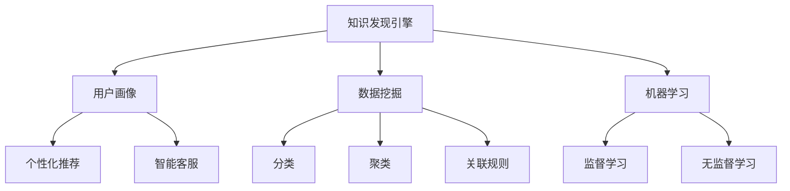

                 

# 知识发现引擎的用户画像分析与应用

> 关键词：知识发现引擎,用户画像,数据挖掘,机器学习,大数据,个性化推荐,用户行为分析

## 1. 背景介绍

### 1.1 问题由来
在数字化时代，用户数据的采集和分析成为企业获取竞争优势的关键。然而，在海量用户数据中，如何快速、精准地挖掘出有用信息，实现用户画像的构建，成为企业和研究者面临的重大挑战。知识发现引擎（Knowledge Discovery Engine, KDE）通过将用户行为数据转化为有价值的用户画像，帮助企业深入理解用户需求，实现精准营销、个性化推荐、智能客服等应用，从而在激烈的市场竞争中占据有利位置。

### 1.2 问题核心关键点
本文将介绍基于用户画像分析的知识发现引擎，并从其核心概念、算法原理、具体操作步骤等多个维度进行深入剖析，以期为相关领域的实践提供指导。

## 2. 核心概念与联系

### 2.1 核心概念概述

为更好地理解知识发现引擎的用户画像分析方法，本节将介绍几个密切相关的核心概念：

- **知识发现引擎（KDE）**：利用数据挖掘、机器学习等技术，从大量数据中挖掘出有用信息，构建用户画像，并进行个性化推荐、智能决策等应用。
- **用户画像**：通过分析用户行为数据，构建出用户个性、兴趣、行为特征等综合信息，用于指导精准营销、个性化推荐、智能客服等应用。
- **数据挖掘**：从海量数据中提取、分析有用信息的过程，包括分类、聚类、关联规则学习等。
- **机器学习**：构建算法模型，使机器能够自动学习和提升决策能力。
- **大数据技术**：采用分布式计算、云存储等技术，高效处理大规模数据集，支持复杂的数据挖掘和分析任务。

这些核心概念之间的逻辑关系可以通过以下Mermaid流程图来展示：



这个流程图展示出知识发现引擎的核心概念及其之间的关系：

1. 知识发现引擎从数据挖掘和机器学习中提取用户画像。
2. 数据挖掘包括分类、聚类、关联规则等技术。
3. 机器学习涵盖监督学习和无监督学习两种方式。
4. 用户画像被应用于个性化推荐和智能客服等应用。

## 3. 核心算法原理 & 具体操作步骤
### 3.1 算法原理概述

知识发现引擎的用户画像分析，本质上是基于用户行为数据的分类、聚类、关联规则等数据挖掘方法，结合机器学习技术构建用户模型，并通过个性化推荐、智能决策等应用，提升用户体验和业务价值。

形式化地，假设用户行为数据为 $D=\{(x_i, y_i)\}_{i=1}^N$，其中 $x_i$ 为行为特征向量，$y_i$ 为标签，$y_i$ 可为性别、兴趣、行为类型等。知识发现引擎的目标是通过分类、聚类、关联规则等算法，挖掘出有用的用户特征，构建出用户画像。

### 3.2 算法步骤详解

基于用户画像分析的知识发现引擎一般包括以下几个关键步骤：

**Step 1: 数据收集与预处理**
- 收集用户行为数据，包括但不限于浏览记录、购买记录、搜索记录等。
- 清洗数据，处理缺失值、异常值，进行特征工程，构造用户行为特征向量 $x_i$。

**Step 2: 数据挖掘**
- 应用分类算法（如决策树、SVM、神经网络等）对用户行为数据进行分类。
- 使用聚类算法（如K-means、层次聚类等）将用户分为不同群体，构建用户画像。
- 提取关联规则，发现不同行为之间的关联关系。

**Step 3: 机器学习**
- 利用监督学习（如随机森林、支持向量机等）对用户画像进行模型训练，构建预测模型。
- 利用无监督学习（如LDA、PCA等）对用户画像进行降维，发现潜在结构。

**Step 4: 个性化推荐与智能决策**
- 根据用户画像，利用协同过滤、内容推荐等算法进行个性化推荐。
- 结合智能决策技术，通过规则引擎、推荐系统等工具，实现智能决策和用户互动。

**Step 5: 效果评估与优化**
- 在验证集上评估模型的准确率、召回率等性能指标。
- 根据评估结果，优化算法模型，提升用户画像的精准度。

以上是知识发现引擎用户画像分析的一般流程。在实际应用中，还需要针对具体任务的特点，对数据挖掘和机器学习过程的各个环节进行优化设计，如改进特征提取方法，选择适合的算法模型等，以进一步提升用户画像的构建效果。

### 3.3 算法优缺点

基于用户画像分析的知识发现引擎方法具有以下优点：

1. 个性化推荐精准度高。通过详细分析用户行为数据，构建出个性化的用户画像，能够显著提升推荐系统的精准度。
2. 智能决策效率高。利用用户画像进行智能决策，可以快速响应用户需求，提升用户体验。
3. 数据驱动决策。用户画像分析能够将数据转化为有价值的信息，辅助企业进行决策，提升业务效果。

但该方法也存在一定的局限性：

1. 对数据依赖性强。用户画像分析需要大量的高质量数据，一旦数据质量不佳，分析结果将难以令人信服。
2. 模型复杂度高。构建用户画像涉及多种算法，模型复杂度较高，实现难度大。
3. 隐私保护难度大。用户行为数据的采集和使用涉及用户隐私问题，需严格遵守相关法律法规。
4. 业务场景适应性差。不同业务场景下的用户行为特征差异大，需要针对性地设计和调整算法。

尽管存在这些局限性，但知识发现引擎用户画像分析方法在实际应用中已经取得了显著成效，广泛应用于电商、金融、社交媒体等多个领域，为精准营销、个性化推荐、智能客服等应用提供了强有力的技术支撑。

### 3.4 算法应用领域

基于用户画像分析的知识发现引擎在多个领域得到了广泛应用，例如：

- **电商领域**：通过分析用户的浏览记录、购买记录，构建用户画像，进行商品推荐和广告投放，提升用户转化率和销售额。
- **金融领域**：利用用户财务记录、交易行为等数据，构建用户画像，进行风险评估、信用评分等，提高金融服务的个性化和精准度。
- **社交媒体**：分析用户的互动记录、兴趣标签等，构建用户画像，进行内容推荐和广告定向投放，提升用户粘性和平台活跃度。
- **医疗健康**：通过分析用户的健康记录、运动数据等，构建用户画像，进行健康干预和个性化医疗建议，提高用户健康水平。
- **智慧城市**：利用用户出行数据、环境偏好等，构建用户画像，进行智能交通规划和城市管理，提升城市居民的生活品质。

除了上述这些经典应用外，知识发现引擎在智能客服、智能家居、智能制造等领域的应用也在不断拓展，为各行各业提供了高效、精准的用户画像分析工具。

## 4. 数学模型和公式 & 详细讲解 & 举例说明

### 4.1 数学模型构建

本节将使用数学语言对基于用户画像分析的知识发现引擎进行更加严格的刻画。

记用户行为数据为 $D=\{(x_i, y_i)\}_{i=1}^N$，其中 $x_i \in \mathbb{R}^d$ 为特征向量，$y_i \in \{0,1\}$ 为标签。

定义用户画像为 $P \in \mathbb{R}^k$，其中 $k$ 为用户画像的维度，一般根据业务需求确定。假设用户画像 $P$ 由分类算法 $f_C$ 和聚类算法 $f_C$ 分别得到，则用户画像的构建过程可以表示为：

$$
P = f_C(f_C(D))
$$

其中 $f_C$ 表示分类算法，$f_C$ 表示聚类算法。

### 4.2 公式推导过程

以下我们以用户画像的构建为例，推导分类算法和聚类算法的数学模型。

**分类算法（如决策树）**：
假设训练集为 $D=\{(x_i, y_i)\}_{i=1}^N$，目标构建分类模型 $f(x)$，使得模型能够对新的输入 $x$ 进行分类。假设决策树的节点数为 $m$，叶节点的数量为 $n$，则决策树的构建过程可以表示为：

$$
f(x) = \begin{cases}
\text{Leaf}_1, & x \in \text{Region}_1 \\
\text{Leaf}_2, & x \in \text{Region}_2 \\
\vdots & \vdots \\
\text{Leaf}_n, & x \in \text{Region}_n \\
\end{cases}
$$

其中 $\text{Region}_i$ 为决策树的叶节点区域，$\text{Leaf}_i$ 为叶节点，表示分类结果。

**聚类算法（如K-means）**：
假设初始聚类中心为 $\mu_1, \mu_2, \ldots, \mu_k$，则K-means算法的迭代过程可以表示为：

$$
\mu_i = \frac{1}{|C_i|}\sum_{x \in C_i} x
$$

其中 $C_i$ 为第 $i$ 个聚类区域，$|C_i|$ 为聚类区域 $C_i$ 中的样本数量。

通过分类和聚类算法的结合，可以构建出用户画像，用于指导个性化推荐、智能决策等应用。

### 4.3 案例分析与讲解

**电商推荐系统案例**：
假设电商平台的购买数据为 $D=\{(x_i, y_i)\}_{i=1}^N$，其中 $x_i$ 为商品信息，$y_i$ 为购买记录。

- **数据收集与预处理**：
  1. 收集用户的购买记录 $D=\{(x_i, y_i)\}_{i=1}^N$。
  2. 对数据进行清洗，处理缺失值、异常值，进行特征工程，构造用户行为特征向量 $x_i$。
  
- **分类算法**：
  1. 利用决策树、SVM等分类算法，对用户行为数据进行分类，得到分类结果 $y_i$。
  2. 构建分类模型 $f_C(x)$，对新的输入 $x$ 进行分类。

- **聚类算法**：
  1. 利用K-means算法，将用户分为不同群体，构建用户画像 $P_i$。
  2. 对用户画像进行降维，得到降维后的用户画像 $P'$。

- **个性化推荐**：
  1. 利用协同过滤、内容推荐等算法，根据用户画像 $P'$，进行个性化推荐。
  2. 结合智能决策技术，通过推荐系统，实现智能推荐。

通过用户画像分析，电商推荐系统能够准确把握用户需求，进行个性化的商品推荐，提升用户满意度和销售额。

## 5. 项目实践：代码实例和详细解释说明
### 5.1 开发环境搭建

在进行用户画像分析的实践前，我们需要准备好开发环境。以下是使用Python进行Scikit-Learn、Pandas、Numpy等库进行数据挖掘和机器学习开发的环境配置流程：

1. 安装Anaconda：从官网下载并安装Anaconda，用于创建独立的Python环境。

2. 创建并激活虚拟环境：
```bash
conda create -n kde-env python=3.8 
conda activate kde-env
```

3. 安装Scikit-Learn、Pandas、Numpy、Matplotlib、Jupyter Notebook等库：
```bash
conda install scikit-learn pandas numpy matplotlib jupyter notebook ipython
```

完成上述步骤后，即可在`kde-env`环境中开始用户画像分析的实践。

### 5.2 源代码详细实现

下面我们以用户画像的构建为例，给出使用Scikit-Learn库进行数据挖掘和机器学习开发的PyTorch代码实现。

首先，定义数据预处理函数：

```python
import pandas as pd
import numpy as np
from sklearn.preprocessing import StandardScaler, OneHotEncoder

def preprocess_data(data):
    # 处理缺失值和异常值
    data.dropna(inplace=True)
    data = data[data['price'] > 0]
    
    # 特征工程
    features = data[['age', 'gender', 'location', 'interest']]
    targets = data['purchase']
    
    # 标准化处理
    features = StandardScaler().fit_transform(features)
    
    # 独热编码
    features = OneHotEncoder(sparse=False).fit_transform(features)
    
    # 数据拆分
    X_train, X_test, y_train, y_test = train_test_split(features, targets, test_size=0.2, random_state=42)
    
    return X_train, X_test, y_train, y_test
```

然后，定义分类算法函数：

```python
from sklearn.tree import DecisionTreeClassifier
from sklearn.svm import SVC

def train_classification_model(X_train, y_train):
    # 决策树分类
    clf = DecisionTreeClassifier()
    clf.fit(X_train, y_train)
    return clf
    
def train_svm_model(X_train, y_train):
    # SVM分类
    clf = SVC()
    clf.fit(X_train, y_train)
    return clf
```

接着，定义聚类算法函数：

```python
from sklearn.cluster import KMeans

def train_clustering_model(X_train, n_clusters):
    # K-means聚类
    clustering = KMeans(n_clusters=n_clusters)
    clustering.fit(X_train)
    return clustering
```

最后，定义用户画像构建函数：

```python
def build_user_profile(X_train, y_train, n_clusters):
    # 分类算法
    clf_decision_tree = train_classification_model(X_train, y_train)
    clf_svm = train_svm_model(X_train, y_train)
    
    # 聚类算法
    clustering = train_clustering_model(X_train, n_clusters)
    
    # 用户画像构建
    user_profiles = []
    for i in range(n_clusters):
        labels = clustering.labels_
        subset = X_train[labels == i]
        subset = subset.iloc[:, :3]  # 仅取前3个特征构建用户画像
        user_profiles.append(subset)
    
    return user_profiles
```

完成以上步骤后，即可在Jupyter Notebook中进行用户画像分析的实践。

### 5.3 代码解读与分析

让我们再详细解读一下关键代码的实现细节：

**preprocess_data函数**：
- 处理缺失值和异常值。
- 特征工程，构造用户行为特征向量 $x_i$。
- 标准化处理，缩小数据范围。
- 独热编码，处理类别型特征。
- 数据拆分，构造训练集和测试集。

**train_classification_model函数**：
- 使用决策树或SVM等分类算法，对用户行为数据进行分类，得到分类结果 $y_i$。
- 构建分类模型 $f_C(x)$，对新的输入 $x$ 进行分类。

**train_clustering_model函数**：
- 利用K-means算法，将用户分为不同群体，构建用户画像 $P_i$。
- 对用户画像进行降维，得到降维后的用户画像 $P'$。

**build_user_profile函数**：
- 结合分类算法和聚类算法，构建用户画像。
- 将用户画像以列表形式存储，便于后续分析。

在实际应用中，还需要针对具体任务的特点，对数据处理、分类算法、聚类算法等各个环节进行优化设计，以进一步提升用户画像的构建效果。

## 6. 实际应用场景

### 6.1 电商推荐系统

电商推荐系统通过分析用户行为数据，构建出用户画像，进行商品推荐和广告投放，提升用户转化率和销售额。具体应用场景包括：

- **商品推荐**：根据用户的浏览记录、购买记录，推荐相关商品。
- **广告投放**：基于用户的兴趣标签，投放个性化广告。
- **优惠活动**：根据用户的消费行为，推送个性化的优惠活动。

通过用户画像分析，电商推荐系统能够准确把握用户需求，进行个性化的商品推荐，提升用户满意度和销售额。

### 6.2 金融信用评估

金融信用评估系统利用用户财务记录、交易行为等数据，构建出用户画像，进行风险评估和信用评分，提高金融服务的精准度和安全性。具体应用场景包括：

- **信用评分**：根据用户的财务记录和交易行为，评估用户的信用风险。
- **风险预警**：利用用户画像，预警潜在风险，防止金融诈骗。
- **个性化服务**：根据用户画像，提供个性化的金融产品和服务。

通过用户画像分析，金融信用评估系统能够精准评估用户的信用风险，提高金融服务的个性化和安全性。

### 6.3 社交媒体推荐

社交媒体推荐系统通过分析用户的互动记录、兴趣标签等，构建出用户画像，进行内容推荐和广告定向投放，提升用户粘性和平台活跃度。具体应用场景包括：

- **内容推荐**：根据用户的互动记录，推荐相关内容。
- **广告定向**：基于用户的兴趣标签，投放个性化广告。
- **话题讨论**：根据用户画像，引导热门话题讨论。

通过用户画像分析，社交媒体推荐系统能够精准推荐内容，提升用户粘性和平台活跃度，增加平台收益。

### 6.4 未来应用展望

随着大数据技术的发展，用户画像分析的应用场景将不断拓展，为各行各业带来新的机遇和挑战。

在智慧城市治理中，利用用户出行数据、环境偏好等，构建用户画像，进行智能交通规划和城市管理，提升城市居民的生活品质。

在智能制造领域，通过分析工人的操作记录、设备使用情况等，构建出工人画像，进行智能调度和管理，提升生产效率和质量。

在智能家居领域，通过分析用户的居住行为、设备使用情况等，构建出用户画像，进行智能家居控制和推荐，提升居住体验和舒适度。

在医疗健康领域，通过分析用户的健康记录、运动数据等，构建出用户画像，进行健康干预和个性化医疗建议，提高用户健康水平。

总之，用户画像分析技术在智能推荐、智能决策、智能客服等领域具有广泛的应用前景，必将推动各行各业的数字化转型升级。

## 7. 工具和资源推荐
### 7.1 学习资源推荐

为了帮助开发者系统掌握用户画像分析的技术基础和实践技巧，这里推荐一些优质的学习资源：

1. **《数据挖掘导论》**：斯坦福大学开设的经典课程，涵盖数据挖掘的基本概念和技术，适合初学者入门。
2. **《Python数据科学手册》**：涵盖Python在数据挖掘、机器学习等领域的应用，适合进阶学习。
3. **《深度学习》**：斯坦福大学开设的深度学习课程，涵盖深度学习的基本概念和算法，适合学习深度学习技术。
4. **Kaggle平台**：提供丰富的数据挖掘、机器学习竞赛和数据集，适合实践练习和知识巩固。
5. **《数据挖掘：概念与技术》**：介绍数据挖掘的经典算法和技术，适合深入学习和研究。

通过对这些资源的学习实践，相信你一定能够快速掌握用户画像分析的精髓，并用于解决实际的业务问题。

### 7.2 开发工具推荐

高效的开发离不开优秀的工具支持。以下是几款用于用户画像分析开发的常用工具：

1. **Python**：基于Python的开源深度学习框架，灵活易用，支持丰富的机器学习算法库。
2. **Scikit-Learn**：Python中的机器学习库，提供了简单易用的算法实现，适合数据挖掘和机器学习开发。
3. **Pandas**：数据处理库，支持大规模数据集的读写、处理和分析。
4. **Jupyter Notebook**：数据挖掘和机器学习的交互式开发环境，支持代码调试、结果展示和版本控制。
5. **TensorBoard**：机器学习模型的可视化工具，可以实时监测模型训练状态，可视化模型参数和指标。

合理利用这些工具，可以显著提升用户画像分析的开发效率，加快创新迭代的步伐。

### 7.3 相关论文推荐

用户画像分析技术的不断发展，离不开学界的持续研究。以下是几篇奠基性的相关论文，推荐阅读：

1. **《用户画像：定义、构建与应用》**：介绍用户画像的基本概念和构建方法，适合入门学习。
2. **《基于机器学习的用户画像分析》**：通过机器学习算法，构建用户画像，适合实践应用。
3. **《多模态用户画像构建》**：结合多模态数据，构建用户画像，适合深入研究。
4. **《用户画像的隐私保护》**：讨论用户画像分析中的隐私保护问题，适合关注伦理和隐私的开发者。
5. **《知识图谱与用户画像的结合》**：将知识图谱与用户画像结合，进行智能推荐，适合应用到更复杂的业务场景。

这些论文代表了大规模用户画像分析的发展脉络。通过学习这些前沿成果，可以帮助研究者把握学科前进方向，激发更多的创新灵感。

## 8. 总结：未来发展趋势与挑战

### 8.1 总结

本文对基于用户画像分析的知识发现引擎进行了全面系统的介绍。首先阐述了用户画像分析的研究背景和意义，明确了知识发现引擎在精准营销、个性化推荐、智能决策等应用中的重要价值。其次，从原理到实践，详细讲解了用户画像分析的数学原理和关键步骤，给出了用户画像分析任务开发的完整代码实例。同时，本文还广泛探讨了用户画像分析在电商、金融、社交媒体等多个领域的应用前景，展示了用户画像分析技术的巨大潜力。此外，本文精选了用户画像分析技术的各类学习资源，力求为读者提供全方位的技术指引。

通过本文的系统梳理，可以看到，基于用户画像分析的知识发现引擎技术正在成为数据挖掘和机器学习领域的重要范式，极大地拓展了用户画像分析的应用边界，催生了更多的落地场景。受益于大数据技术和机器学习算法的不断进步，用户画像分析将更加精准、高效，为各行各业带来更优质的用户体验和业务价值。

### 8.2 未来发展趋势

展望未来，用户画像分析技术将呈现以下几个发展趋势：

1. **多模态数据融合**：用户画像分析将更多地结合多模态数据，如文本、图像、视频等，构建更加全面、精确的用户画像。
2. **实时数据处理**：用户画像分析将实时处理和更新用户数据，构建动态、实时化的用户画像，满足业务动态变化的需求。
3. **隐私保护与伦理审查**：用户画像分析将更加重视用户隐私保护，引入伦理审查机制，确保数据使用的合法性和安全性。
4. **人工智能与机器学习的深度融合**：用户画像分析将更多地融合人工智能技术和机器学习算法，提升数据分析的准确性和智能性。
5. **跨行业应用拓展**：用户画像分析将更多地应用于不同行业，如医疗、金融、制造等，为各行业带来新的应用场景和价值提升。

以上趋势凸显了用户画像分析技术的广阔前景。这些方向的探索发展，必将进一步提升用户画像分析的精准度和应用范围，为各行各业带来更优质的用户体验和业务价值。

### 8.3 面临的挑战

尽管用户画像分析技术已经取得了显著成效，但在迈向更加智能化、普适化应用的过程中，它仍面临着诸多挑战：

1. **数据获取与隐私保护**：用户画像分析需要大量的高质量数据，而数据获取和隐私保护往往存在冲突。如何平衡数据利用和隐私保护，将是一大难题。
2. **算法复杂度**：用户画像分析涉及多种算法，算法复杂度较高，实现难度大。如何简化算法，提高算法效率，将是一个重要研究方向。
3. **业务场景适应性**：不同业务场景下的用户行为特征差异大，如何针对性地设计和调整算法，提高用户画像分析的适用性，将是一个重要问题。
4. **模型可解释性**：用户画像分析模型往往是"黑盒"系统，难以解释其内部工作机制和决策逻辑。如何赋予模型更强的可解释性，将是重要的研究课题。
5. **技术融合与集成**：用户画像分析需要与其他技术进行深度融合，如知识图谱、AI推理等，多路径协同发力，共同提升用户体验和业务效果。

这些挑战凸显了用户画像分析技术的复杂性和多样性。唯有持续创新、不断优化，才能应对各种挑战，推动用户画像分析技术迈向成熟和普适化。

### 8.4 研究展望

面对用户画像分析所面临的种种挑战，未来的研究需要在以下几个方面寻求新的突破：

1. **无监督与半监督学习**：摆脱对大量标注数据的依赖，利用自监督学习、主动学习等方法，最大限度地利用非结构化数据，实现更高效的用户画像分析。
2. **多模态数据融合**：结合多种模态数据，提升用户画像的全面性和准确性，增强用户画像分析的应用范围。
3. **深度学习与强化学习**：将深度学习与强化学习结合，提升用户画像分析的智能性和鲁棒性，满足复杂业务场景的需求。
4. **隐私保护与伦理审查**：引入隐私保护技术，确保用户数据的安全性和合法性，建立用户画像分析的伦理审查机制。
5. **知识图谱与用户画像的结合**：将知识图谱与用户画像结合，提升用户画像的语义理解和推理能力，增强智能推荐系统的精准度。

这些研究方向的探索，必将引领用户画像分析技术迈向更高的台阶，为构建安全、可靠、可解释、可控的智能系统铺平道路。面向未来，用户画像分析技术还需要与其他人工智能技术进行更深入的融合，如知识表示、因果推理、强化学习等，多路径协同发力，共同推动自然语言理解和智能交互系统的进步。只有勇于创新、敢于突破，才能不断拓展用户画像分析的边界，让智能技术更好地造福人类社会。

## 9. 附录：常见问题与解答

**Q1：如何处理用户画像中的缺失值和异常值？**

A: 用户画像中的缺失值和异常值需要通过数据清洗进行处理。常见的处理方法包括：

1. 缺失值填充：利用均值、中位数、众数等方法填充缺失值。
2. 异常值检测：利用Z-score、IQR等方法检测并处理异常值。
3. 数据插值：利用插值方法，根据已有数据推测缺失值。

**Q2：如何评估用户画像分析模型的准确性？**

A: 用户画像分析模型的评估通常使用准确率、召回率、F1值等指标，具体如下：

1. 准确率（Accuracy）：模型预测正确的样本数与总样本数之比。
2. 召回率（Recall）：模型正确预测为正类的样本数与实际正类样本数之比。
3. F1值（F1-score）：准确率与召回率的调和平均数。

**Q3：用户画像分析中如何处理高维数据？**

A: 高维数据处理是用户画像分析中的重要问题，常见的处理方法包括：

1. 特征选择：通过特征选择方法，选择对目标变量影响最大的特征。
2. 特征降维：利用主成分分析（PCA）、线性判别分析（LDA）等方法，将高维数据降维。
3. 特征提取：利用因子分析、独立成分分析等方法，提取更有意义的特征。

**Q4：如何保护用户隐私？**

A: 用户隐私保护是用户画像分析中的关键问题，常见的处理方法包括：

1. 数据匿名化：通过数据脱敏、扰动等方法，保护用户隐私。
2. 访问控制：设置数据访问权限，控制数据访问范围。
3. 数据加密：对用户数据进行加密存储和传输。

**Q5：用户画像分析中的特征工程有哪些技巧？**

A: 特征工程是用户画像分析中的重要环节，常见的技巧包括：

1. 特征选择：选择对目标变量影响最大的特征。
2. 特征提取：提取更有意义的特征。
3. 特征转换：对特征进行转换，提升模型效果。

通过这些方法和技巧，可以提升用户画像分析的效果，确保模型的准确性和稳定性。

---

作者：禅与计算机程序设计艺术 / Zen and the Art of Computer Programming

