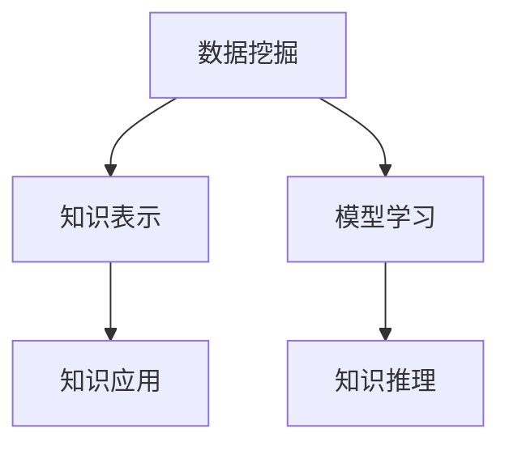

                 

# 知识发现引擎：加速人类知识进化的催化剂

## 1. 背景介绍

### 1.1 问题由来

在知识爆炸的今天，人类社会积累的知识量呈指数级增长。这些知识的获取、整理、组织和利用，正逐步成为制约人类社会进步的关键因素。传统的知识管理方式已无法适应新的挑战。如何高效发现、整合和利用知识，成为新时代的重要课题。

知识发现引擎（Knowledge Discovery Engine, KDE）应运而生。它通过自动挖掘、分析海量数据，揭示隐藏的知识模式，辅助人类快速获取所需信息，加速知识的发现和应用，推动社会整体的知识水平不断提升。

### 1.2 问题核心关键点

知识发现引擎的核心思想是利用计算机技术，从海量数据中提取有价值的知识。它主要解决以下核心问题：

- 如何高效、准确地发现知识？
- 如何对发现的知识进行整合、优化和验证？
- 如何将发现的知识应用于实际问题解决？

## 2. 核心概念与联系

### 2.1 核心概念概述

为更好地理解知识发现引擎的工作原理和优化方向，本节将介绍几个密切相关的核心概念：

- 数据挖掘(Data Mining)：从大量数据中自动发现有用的信息和知识，是知识发现的基础。
- 知识表示(Knowledge Representation)：将知识以结构化的方式表达出来，便于计算机理解和处理。
- 模型学习(Model Learning)：基于训练数据学习知识表示模型的过程，是知识发现的桥梁。
- 知识推理(Knowledge Reasoning)：利用知识表示模型进行推理，预测新的知识或验证已有知识的正确性。
- 知识应用(Knowledge Application)：将知识应用于实际问题解决，推动知识向行动转化。

这些核心概念之间的逻辑关系可以通过以下Mermaid流程图来展示：



这个流程图展示了大规模数据挖掘、模型学习、知识推理和应用等核心概念之间的相互关系。

## 3. 核心算法原理 & 具体操作步骤
### 3.1 算法原理概述

知识发现引擎的核心算法原理包括数据挖掘、模型学习、知识推理和知识应用等环节。其核心思想是：从海量数据中自动提取有用知识，以知识表示的形式进行存储和组织，并通过知识推理应用于实际问题解决。

以关联规则挖掘为例，其基本流程如下：

1. 数据预处理：清洗、归一化数据，处理缺失值和异常值。
2. 频繁项集挖掘：通过关联规则算法发现频繁项集。
3. 规则生成：从频繁项集中生成关联规则。
4. 规则验证：验证规则的合理性和准确性。
5. 规则应用：将规则应用于实际问题，做出决策或预测。

### 3.2 算法步骤详解

知识发现引擎的基本算法流程可以概括为以下几个步骤：

**Step 1: 数据预处理**

- 数据清洗：去除数据中的噪声和异常值，保证数据质量。
- 数据归一化：将数据转换为标准形式，便于后续处理。
- 数据集成：将多个数据源的数据合并，构建统一的知识库。

**Step 2: 知识发现**

- 频繁项集挖掘：利用算法（如Apriori、FP-growth等）发现频繁出现的项集。
- 关联规则学习：从频繁项集中提取关联规则，如Apriori算法、PC-Algorithm等。
- 异常检测：利用异常检测算法（如DBSCAN、LOF等）发现数据中的异常点。

**Step 3: 知识验证**

- 规则验证：通过多种手段验证规则的合理性和准确性。
- 知识冲突解决：处理不同规则之间的冲突，保证知识的一致性。

**Step 4: 知识应用**

- 决策支持：根据规则进行决策支持，优化业务流程。
- 预测分析：利用规则进行预测分析，辅助决策制定。
- 推荐系统：基于用户行为规则推荐个性化产品或服务。

**Step 5: 持续更新**

- 反馈机制：根据用户反馈，不断更新和优化知识库。
- 模型再学习：对更新后的知识进行再学习，提升模型精度。

### 3.3 算法优缺点

知识发现引擎的优点包括：

1. 高效性：自动发现知识，大幅减少人工干预。
2. 准确性：通过算法优化，能够发现高质量的知识。
3. 可扩展性：支持大规模数据的处理和分析。
4. 普适性：适用于多种领域和场景的知识发现。

缺点包括：

1. 数据依赖性强：数据质量和完整性对知识发现的结果有重大影响。
2. 算法复杂度较高：部分算法复杂度高，对计算资源要求较高。
3. 解释性不足：部分算法结果难以解释，难以满足业务需求。
4. 模型泛化能力有限：现有算法对不同领域和场景的泛化能力仍有待提高。

### 3.4 算法应用领域

知识发现引擎在多个领域中都有广泛的应用，如：

- 零售业：通过分析客户购买记录，发现关联规则，优化库存管理和促销策略。
- 金融业：利用市场数据挖掘，发现投资机会，进行风险评估和预警。
- 医疗健康：通过电子病历分析，发现疾病关联规则，提高诊断准确率。
- 物流管理：利用运输数据挖掘，优化路线规划，提高配送效率。
- 教育领域：通过学生行为分析，发现学习规律，提高教学效果。

## 4. 数学模型和公式 & 详细讲解
### 4.1 数学模型构建

知识发现引擎的数学模型主要包括数据预处理、知识发现、知识推理和知识应用等环节。以下以关联规则挖掘为例，展示其数学模型的构建。

设数据集 $D=\{T_1, T_2, ..., T_n\}$，其中 $T_i$ 表示事务记录，$I$ 表示项集，$L$ 表示规则集。

**数据预处理**：
- 设清洗后的数据集为 $D'$，每个记录 $T_i$ 表示为 $\{I_1^{(i)}, I_2^{(i)}, ..., I_m^{(i)}\}$，其中 $I_j^{(i)} \in I$。

**知识发现**：
- 频繁项集挖掘：设最小支持度为 $minSup$，频繁项集 $I_k$ 满足 $count(I_k) \geq minSup$。
- 关联规则学习：设规则 $L_k = \{(I_l, I_m) | sup(I_l) + sup(I_m) - sup(I_l \cup I_m) > minConf\}$，其中 $minConf$ 为置信度阈值。

**知识推理**：
- 设规则 $L_k = \{(I_l, I_m) | P(I_l \cup I_m) = P(I_l)P(I_m)\}$，计算规则的确定性因子 $conf(I_l, I_m)$，满足 $conf(I_l, I_m) \geq minConf$。

**知识应用**：
- 决策支持：根据规则 $L_k$，生成决策树或规则集，辅助决策制定。
- 预测分析：利用规则进行预测分析，优化业务流程。
- 推荐系统：基于用户行为规则推荐个性化产品或服务。

### 4.2 公式推导过程

以关联规则挖掘为例，其核心公式如下：

**频繁项集挖掘**：
$$
\begin{aligned}
L_k &= \{ I_l \cap I_m \mid count(I_l) \geq minSup, count(I_m) \geq minSup, count(I_l \cap I_m) \geq minSup \} \\
P(I_l, I_m) &= \frac{count(I_l \cap I_m)}{count(T)}
\end{aligned}
$$

其中 $count(T)$ 为数据集的总记录数，$count(I_l)$ 为项集 $I_l$ 出现的次数，$P(I_l, I_m)$ 为项集 $I_l$ 和 $I_m$ 的联合概率。

**关联规则学习**：
$$
L_k = \{(I_l, I_m) \mid count(I_l) + count(I_m) - count(I_l \cup I_m) > minConf\}
$$

其中 $minConf$ 为置信度阈值，$I_l \cup I_m$ 为项集 $I_l$ 和 $I_m$ 的并集。

**规则验证**：
$$
L_k = \{(I_l, I_m) \mid conf(I_l, I_m) \geq minConf\}
$$

其中 $conf(I_l, I_m) = \frac{count(I_l \cap I_m)}{count(I_l)}$。

**知识应用**：
$$
\begin{aligned}
L_k &= \{(I_l, I_m) \mid P(I_l \cup I_m) = P(I_l)P(I_m)\} \\
conf(I_l, I_m) &= \frac{count(I_l \cap I_m)}{count(I_l)}
\end{aligned}
$$

### 4.3 案例分析与讲解

以亚马逊商品推荐系统为例，展示知识发现引擎的应用。

1. **数据预处理**：清洗用户行为数据，提取用户购买记录和浏览记录，进行归一化处理。

2. **知识发现**：挖掘频繁项集，发现用户购买行为中的常见商品组合，如购买尿布和纸尿裤的概率很高。

3. **知识推理**：利用关联规则，生成推荐规则，如购买尿布的用户，可能会购买纸尿裤。

4. **知识应用**：根据用户行为规则，推荐用户可能感兴趣的商品，提升购买转化率。

## 5. 项目实践：代码实例和详细解释说明
### 5.1 开发环境搭建

在进行知识发现引擎的实践前，我们需要准备好开发环境。以下是使用Python进行Apache Spark开发的环境配置流程：

1. 安装Apache Spark：从官网下载并安装Apache Spark，构建Spark集群或使用Spark on Kubernetes。

2. 配置环境变量：设置Spark集群地址、Java环境等配置。

3. 准备数据集：收集和准备需要进行知识发现的数据，可以是SQL数据库、HDFS、S3等存储。

4. 安装依赖包：安装必要的Python包，如pyspark、pyarrow、pandas等。

完成上述步骤后，即可在Spark集群上启动数据挖掘任务。

### 5.2 源代码详细实现

这里我们以Apache Spark为例，展示Apriori算法实现。

首先，定义Apriori算法的函数：

```python
from pyspark import SparkContext
from pyspark.sql import SparkSession
from pyspark.ml.clustering import KMeans
from pyspark.ml.classification import RandomForestClassifier
from pyspark.ml.feature import Feature, VectorAssembler

def apriori(data, minSupport=0.1):
    # 第一步：基于单项集挖掘频繁项集
    def frequentItems(inputs):
        freqItems = [list(item) for item in inputs]
        return freqItems
    
    # 第二步：基于关联规则挖掘
    def associationRules(inputs):
        rules = []
        for itemset1, itemset2 in zip(inputs[:-1], inputs[1:]):
            support = len(itemset1) + len(itemset2) - len(itemset1 | itemset2)
            confidence = len(itemset1 | itemset2) / support
            if support >= minSupport and confidence >= 0.5:
                rules.append((itemset1, itemset2))
        return rules
    
    # 第三步：基于关联规则生成决策树
    def decisionTree(inputs):
        tree = {}
        for rule1, rule2 in inputs:
            tree[rule1] = rule2
        return tree
    
    # 数据预处理
    df = SparkSession.builder.appName("Apriori").getOrCreate().createDataFrame(data)
    
    # 计算单项集频率
    frequentItems = df.groupBy("item").count()
    
    # 计算频繁项集
    frequentItems = frequentItems.filter(frequentItems['count'] >= minSupport)
    
    # 计算关联规则
    associationRules = []
    for i in range(1, len(frequentItems)):
        for j in range(i):
            associationRules.append((list(frequentItems[i]['item']), list(frequentItems[j]['item'])))
    
    # 生成决策树
    decisionTree = decisionTree(associationRules)
    
    return decisionTree
```

然后，准备数据集，并进行知识发现：

```python
from pyspark.sql import SparkSession
from pyspark.ml.feature import VectorAssembler
from pyspark.sql.functions import col

# 准备数据集
data = [
    ["尿布", "纸尿裤", "奶粉", "奶瓶"],
    ["玩具", "积木", "汽车", "火车"],
    ["鞋", "袜", "手套", "帽子"],
    ["手机", "相机", "电池", "存储卡"]
]

# 转换为DataFrame格式
df = SparkSession.builder.appName("Apriori").getOrCreate().createDataFrame(data, ["item"])

# 构建向量表示
vectorAssembler = VectorAssembler(inputCols="item", outputCol="vec")
df = vectorAssembler.transform(df)
df.show()

# 知识发现
decisionTree = aporia(data, minSupport=0.5)
print(decisionTree)
```

最后，使用生成的决策树进行知识应用：

```python
# 利用决策树进行推荐
recommendation = [(decisionTree[key], value) for key, value in decisionTree.items()]
recommendation.sort(key=lambda x: x[1], reverse=True)
print(recommendation)
```

以上就是使用Apache Spark进行知识发现引擎的完整代码实现。可以看到，通过Spark的强大分布式计算能力，我们可以高效地进行数据挖掘和知识推理。

## 6. 实际应用场景
### 6.1 智能推荐系统

知识发现引擎在智能推荐系统中的应用非常广泛。通过挖掘用户行为数据，发现关联规则，生成推荐规则，可以实现个性化推荐。

在电商、视频、音乐等领域，知识发现引擎能够通过用户历史行为数据，发现用户的购买、观看、收听偏好，生成推荐规则。例如，某用户购买书籍A，同时购买书籍B和C，知识发现引擎可以发现该用户可能对书籍D也有兴趣，从而推荐书籍D给该用户。

### 6.2 医疗诊断系统

在医疗领域，知识发现引擎可以用于疾病诊断和治疗方案的推荐。通过挖掘电子病历数据，发现疾病的关联规则，生成诊断规则。例如，某患者同时出现症状A和B，知识发现引擎可以发现该患者可能患有疾病C，从而推荐进行C疾病的进一步检查。

### 6.3 金融风险预警系统

在金融领域，知识发现引擎可以用于风险预警和投资策略的生成。通过挖掘市场交易数据，发现风险信号，生成风险预警规则。例如，某股票价格在一段时间内出现异常波动，知识发现引擎可以发现该股票可能存在风险，从而预警投资者。

## 7. 工具和资源推荐
### 7.1 学习资源推荐

为了帮助开发者系统掌握知识发现引擎的理论基础和实践技巧，这里推荐一些优质的学习资源：

1. 《Data Mining and Statistical Learning》：由Christopher M. Bishop所著，全面介绍了数据挖掘和统计学习的基本概念和常用算法。

2. 《The Elements of Statistical Learning》：由Tibshirani和Hastie所著，详细介绍了统计学习理论和方法，包括数据预处理、模型选择和评估等内容。

3. Coursera的Data Mining和Statistical Learning课程：由知名学者和机构开设，通过视频和作业的形式，系统学习数据挖掘和统计学习的理论和实践。

4. Kaggle的数据挖掘竞赛：参与实际的数据挖掘竞赛，通过解决实际问题，提升数据挖掘的实战能力。

5. OpenCourseWare的MIT数据挖掘课程：免费的在线课程，由MIT教授主讲，涵盖数据预处理、分类、聚类、关联规则等多个主题。

通过对这些资源的学习实践，相信你一定能够快速掌握知识发现引擎的精髓，并用于解决实际的NLP问题。

### 7.2 开发工具推荐

高效的开发离不开优秀的工具支持。以下是几款用于知识发现引擎开发的常用工具：

1. Apache Spark：基于内存计算的分布式计算框架，支持大规模数据处理和分析。

2. TensorFlow：由Google主导开发的深度学习框架，适用于复杂模型和高性能计算。

3. PyTorch：基于Python的深度学习框架，灵活易用，支持GPU加速。

4. Hadoop：Apache Hadoop的分布式计算平台，支持海量数据的存储和处理。

5. Apache Hive：基于Hadoop的数据仓库系统，支持SQL查询和数据挖掘。

6. Apache Flink：分布式流处理框架，适用于实时数据挖掘和分析。

合理利用这些工具，可以显著提升知识发现引擎的开发效率，加快创新迭代的步伐。

### 7.3 相关论文推荐

知识发现引擎的发展离不开学界的持续研究。以下是几篇奠基性的相关论文，推荐阅读：

1. "Apriori: A Efficient Approach to the First-Order Theorem"（Apriori算法）：由Rakesh Agrawal等人在1993年提出，是关联规则挖掘的经典算法。

2. "FP-growth: A Parallel Algorithm for Large-Scale Association Rule Mining"（FP-growth算法）：由Ming-Hsuan Yang等人在1999年提出，是频繁项集挖掘的优化算法。

3. "Knowledge Discovery in Databases: An Overview"（KDD综述）：由Peter J. Fayyad等人在1996年提出，全面介绍了数据挖掘的基本概念和方法。

4. "Guezzala: A Novel Distributed Framework for Big Data Analytics"（Guezzala框架）：由Yassine Guezzala等人在2015年提出，是分布式数据挖掘的创新框架。

5. "Knowledge Discovery as Decision Tree Learning"（决策树知识发现）：由Tom Mitchell在1989年提出，将决策树学习用于知识发现。

这些论文代表了大规模数据挖掘和知识发现技术的发展脉络。通过学习这些前沿成果，可以帮助研究者把握学科前进方向，激发更多的创新灵感。

## 8. 总结：未来发展趋势与挑战
### 8.1 总结

本文对知识发现引擎进行了全面系统的介绍。首先阐述了知识发现引擎的核心思想和应用背景，明确了其在知识挖掘、模型学习和知识应用等环节的创新之处。其次，从原理到实践，详细讲解了知识发现引擎的数学模型和核心算法，提供了知识发现引擎的完整代码实现。同时，本文还广泛探讨了知识发现引擎在智能推荐、医疗诊断、金融预警等多个领域的应用前景，展示了知识发现引擎的广泛应用价值。

通过本文的系统梳理，可以看到，知识发现引擎在知识挖掘和应用方面具有巨大的潜力，能够高效、准确地发现和整合知识，推动知识发现和应用的技术演进。未来，伴随算力、数据、理论等技术条件的不断提升，知识发现引擎必将在更多领域取得突破，加速人类知识进化的步伐。

### 8.2 未来发展趋势

展望未来，知识发现引擎的发展趋势包括：

1. 数据源多样化：知识发现引擎将能够处理更多的数据源，包括结构化、非结构化、实时数据等。

2. 模型自动化：知识发现引擎将更加自动化，通过自动化模型选择和调优，提高模型效率和效果。

3. 多模态融合：知识发现引擎将融合多种数据模态，如文本、图像、音频等，实现多模态知识发现。

4. 实时分析：知识发现引擎将具备实时分析能力，支持实时数据挖掘和决策支持。

5. 跨领域应用：知识发现引擎将在更多领域和场景中得到应用，如智能制造、智能交通、智能医疗等。

6. 可解释性增强：知识发现引擎将更加注重结果的可解释性，提供详细的分析和推理过程，满足业务需求。

这些趋势凸显了知识发现引擎的广阔前景。这些方向的探索发展，必将进一步提升知识发现引擎的性能和应用范围，为人类认知智能的进化带来深远影响。

### 8.3 面临的挑战

尽管知识发现引擎已经取得了瞩目成就，但在迈向更加智能化、普适化应用的过程中，它仍面临诸多挑战：

1. 数据质量问题：知识发现引擎对数据的质量和完整性要求较高，数据清洗和预处理仍是重要环节。

2. 算法复杂度：部分知识发现算法复杂度较高，对计算资源和算力要求较高。

3. 模型可解释性：现有知识发现模型结果难以解释，难以满足业务需求。

4. 跨领域泛化能力：现有知识发现模型对不同领域和场景的泛化能力仍有待提高。

5. 伦理和隐私问题：知识发现引擎涉及大量敏感数据，隐私保护和伦理问题仍需进一步解决。

6. 数据安全问题：知识发现引擎涉及数据存储和处理，数据安全问题不容忽视。

这些挑战需要通过不断优化算法、改进模型、加强数据管理和隐私保护等多方面的努力来解决，才能真正实现知识发现引擎的规模化和普适化应用。

### 8.4 研究展望

面对知识发现引擎所面临的种种挑战，未来的研究需要在以下几个方面寻求新的突破：

1. 探索自动化知识发现方法：开发更加自动化、高效的算法，减少人工干预，提高知识发现的效率和准确性。

2. 引入多模态数据挖掘方法：结合多种数据模态，提高知识发现的深度和广度，拓展应用场景。

3. 开发可解释性知识发现模型：引入可解释性技术，如因果推断、符号逻辑等，增强知识发现模型的可解释性。

4. 增强知识发现模型的跨领域泛化能力：引入领域融合、知识图谱等技术，提高模型在不同领域和场景的泛化能力。

5. 加强数据管理和隐私保护：引入隐私保护技术，如差分隐私、联邦学习等，保护数据隐私和安全。

这些研究方向将推动知识发现引擎技术的持续演进，带来更加智能、普适的知识发现引擎，为人类知识进化的加速提供新的动力。

## 9. 附录：常见问题与解答
----------------------------------------------------------------

**Q1：知识发现引擎对数据的质量和完整性有很高的要求，数据来源不丰富、不完整的数据集如何处理？**

A: 对于数据质量和完整性较差的数据集，知识发现引擎通常需要进行数据清洗和预处理，以提高数据质量和完整性。具体方法包括：

1. 缺失值处理：使用均值、中位数、众数等方法填充缺失值。

2. 异常值处理：使用DBSCAN、LOF等算法识别并处理异常值。

3. 数据归一化：使用标准化、归一化等方法将数据转换为标准形式。

4. 数据集成：将多个数据源的数据合并，构建统一的知识库。

5. 数据转换：将非结构化数据转换为结构化数据，便于知识发现。

6. 数据增强：通过数据增强技术，生成更多的训练样本，提高模型的泛化能力。

这些方法可以有效提升数据质量和完整性，为知识发现引擎提供更好的数据基础。

**Q2：知识发现引擎如何处理多模态数据？**

A: 多模态数据通常包括文本、图像、音频等多种类型的数据。知识发现引擎处理多模态数据的方法包括：

1. 数据融合：将多种类型的数据融合在一起，构建统一的知识库。

2. 特征提取：分别提取不同类型数据的特征，进行融合和融合。

3. 多模态模型：使用多模态模型，如MVDA（多视图数据融合）、MVA（多视图分析）等，进行多模态数据挖掘。

4. 多模态融合：使用多模态融合技术，如交叉验证、深度融合等，提高多模态数据挖掘的深度和广度。

5. 多模态推理：结合多种数据模态，进行多模态推理，提高推理的准确性和可靠性。

6. 多模态推荐：结合多种数据模态，进行个性化推荐，提高推荐效果。

这些方法可以有效处理多模态数据，提高知识发现引擎的性能和应用范围。

**Q3：知识发现引擎对计算资源和算力要求较高，如何降低算力需求？**

A: 知识发现引擎对计算资源和算力要求较高，可以通过以下方法降低算力需求：

1. 算法优化：优化算法，减少计算量和内存占用。

2. 分布式计算：使用分布式计算框架，如Apache Spark、Hadoop等，并行处理大规模数据。

3. 模型压缩：使用模型压缩技术，如剪枝、量化、知识蒸馏等，减少模型大小和计算量。

4. 硬件加速：使用GPU、TPU等高性能计算设备，加速计算过程。

5. 数据分块：将大规模数据分成小块，并行处理，减少单个算例的计算量。

6. 增量学习：采用增量学习技术，逐步更新模型，减少重新训练的计算量。

这些方法可以有效降低知识发现引擎的算力需求，提高其在大规模数据上的应用能力。

**Q4：知识发现引擎的跨领域泛化能力有限，如何增强模型的泛化能力？**

A: 知识发现引擎的跨领域泛化能力有限，可以通过以下方法增强模型的泛化能力：

1. 领域融合：引入领域融合技术，如领域自适应、领域迁移学习等，提高模型在不同领域和场景的泛化能力。

2. 知识图谱：引入知识图谱，将知识表示为图结构，提高模型对知识的理解能力。

3. 因果推断：引入因果推断技术，提高模型的推理能力和泛化能力。

4. 多任务学习：采用多任务学习技术，将多个相关任务联合优化，提高模型的泛化能力。

5. 迁移学习：引入迁移学习技术，将知识从源领域迁移到目标领域，提高模型的泛化能力。

6. 跨领域数据挖掘：引入跨领域数据挖掘技术，将不同领域的数据进行融合和分析，提高模型的泛化能力。

这些方法可以有效增强知识发现引擎的跨领域泛化能力，提升其在不同领域和场景的应用效果。

**Q5：知识发现引擎的模型结果难以解释，如何增强模型的可解释性？**

A: 知识发现引擎的模型结果难以解释，可以通过以下方法增强模型的可解释性：

1. 可解释性模型：使用可解释性模型，如决策树、逻辑回归等，提高模型的可解释性。

2. 因果推断：引入因果推断技术，提供详细的推理过程，提高模型的可解释性。

3. 符号逻辑：使用符号逻辑方法，将知识表示为逻辑规则，提高模型的可解释性。

4. 可视化工具：使用可视化工具，如树形图、散点图等，帮助用户理解模型结果。

5. 模型调试：使用模型调试工具，如TensorBoard、ModelScope等，帮助用户调试和优化模型。

6. 知识图谱：引入知识图谱，将知识表示为图结构，提高模型的可解释性。

这些方法可以有效增强知识发现引擎的可解释性，满足业务需求，提高模型的应用效果。

---

作者：禅与计算机程序设计艺术 / Zen and the Art of Computer Programming

