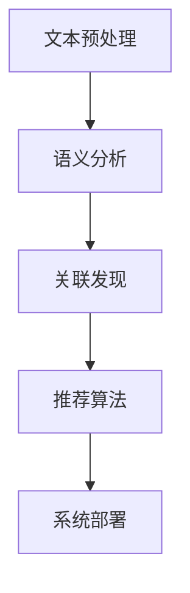

                 

## 1. 背景介绍

### 1.1 问题由来

随着数字化的快速普及，创意产业正经历着前所未有的变革。海量内容的产生使得内容发现和推荐成为一项重要的任务。传统的内容发现方法往往依赖于用户历史行为数据，但这些数据难以获取且易受隐私问题困扰。因此，知识发现引擎（Knowledge Discovery Engine, KDE）应运而生，它利用先进的自然语言处理和机器学习技术，能够在大规模非结构化文本数据中自动发现和推荐有趣、有价值的内容，为用户提供个性化的信息服务。

### 1.2 问题核心关键点

知识发现引擎的核心在于其能够在大规模无标签文本数据中发现隐含的知识模式和关联，并以此为基础进行内容推荐。它包括如下关键点：
- 文本数据预处理：将非结构化文本转化为结构化数据。
- 语义分析：抽取文本中的关键信息，理解文本的含义。
- 关联发现：通过分析文本之间的关联，挖掘知识模式。
- 推荐算法：结合关联发现结果，进行个性化内容推荐。
- 系统部署：将算法模型部署为可用的推荐服务。

### 1.3 问题研究意义

知识发现引擎在创意产业中的应用，可以带来以下几方面的意义：
- 提升内容发现效率：自动化的知识发现过程可以大大提升内容发现的速度和规模。
- 增强用户体验：基于个性化推荐的内容服务，使用户能够更快地找到他们感兴趣的内容。
- 驱动创新：丰富的内容发现将激发更多的创意，推动创意产业的发展。
- 促进知识共享：知识发现引擎有助于挖掘和传播隐含的知识，促进行业知识共享。
- 适应性强：随着知识模式的发现和更新，推荐结果也能实时动态更新，满足用户需求变化。

## 2. 核心概念与联系

### 2.1 核心概念概述

知识发现引擎涉及到多个核心概念，包括文本预处理、语义分析、关联发现、推荐算法等。

- **文本预处理**：将原始的文本数据转化为机器学习模型可处理的形式。常见方法包括分词、去除停用词、词性标注、实体识别等。
- **语义分析**：理解和分析文本的含义，提取关键信息。包括文本分类、情感分析、实体识别、关系抽取等任务。
- **关联发现**：在大规模文本数据中寻找文本之间的语义关联，建立知识图谱。常见方法包括共现分析、嵌入表示、主题建模等。
- **推荐算法**：结合关联发现的结果，为用户推荐个性化的内容。常用的算法包括协同过滤、矩阵分解、深度学习等。

### 2.2 核心概念原理和架构的 Mermaid 流程图



以上流程图展示了知识发现引擎的核心流程：通过文本预处理和语义分析抽取文本特征，然后使用关联发现技术找到文本之间的关联，最后使用推荐算法为用户推荐个性化的内容，并通过系统部署实现实际应用。

## 3. 核心算法原理 & 具体操作步骤

### 3.1 算法原理概述

知识发现引擎的核心算法原理主要包括以下几个步骤：

1. **文本预处理**：通过一系列文本处理技术将原始文本转化为结构化数据。
2. **语义分析**：利用自然语言处理技术，抽取文本中的关键信息，理解文本的含义。
3. **关联发现**：通过计算文本之间的相似度，建立文本之间的关联。
4. **推荐算法**：结合关联发现的结果，为用户推荐个性化的内容。

### 3.2 算法步骤详解

**Step 1: 文本预处理**

文本预处理是知识发现引擎的第一步。其目标是将原始的文本数据转化为机器学习模型可处理的形式。具体步骤包括：

- 分词：将文本分割成单词或短语，方便后续处理。
- 去除停用词：去除常见的停用词，如“的”、“是”等，以减少噪音。
- 词性标注：标注每个单词的词性，如名词、动词、形容词等。
- 实体识别：识别文本中的命名实体，如人名、地名、组织名等。
- 去除噪声：去除文本中的特殊字符、标点符号等无用信息。

**Step 2: 语义分析**

语义分析旨在理解文本的含义，并抽取关键信息。常用方法包括：

- 文本分类：将文本分为不同的类别，如新闻、博客、评论等。
- 情感分析：判断文本的情感倾向，如积极、消极、中性等。
- 实体识别：识别文本中的命名实体，建立实体之间的关系图谱。
- 关系抽取：从文本中抽取实体之间的关系，如“A 是 B 的 C”。

**Step 3: 关联发现**

关联发现是通过计算文本之间的相似度，找到文本之间的语义关联。常用方法包括：

- 共现分析：统计文本中出现的词汇，找到高频共现的词汇对。
- 嵌入表示：将文本转化为向量表示，使用词向量模型（如Word2Vec、GloVe）计算文本之间的相似度。
- 主题建模：使用主题模型（如LDA、LSA）发现文本中的主题。

**Step 4: 推荐算法**

推荐算法是知识发现引擎的最终目标，通过结合关联发现的结果，为用户推荐个性化的内容。常用方法包括：

- 协同过滤：根据用户的历史行为，推荐相似用户的兴趣内容。
- 矩阵分解：将用户和物品表示为矩阵，通过分解矩阵找到用户对物品的评分。
- 深度学习：使用深度神经网络模型，学习用户和物品的隐含表示，进行推荐。

### 3.3 算法优缺点

知识发现引擎在实现过程中具有以下优点：
- 自动化：通过自动化算法处理大规模文本数据，大幅提升效率。
- 灵活性：算法可以灵活地适应不同类型和来源的文本数据。
- 个性化：能够根据用户偏好推荐个性化的内容，提升用户体验。
- 可扩展性：可以处理海量的文本数据，实现内容服务的实时更新。

同时，知识发现引擎也存在一些缺点：
- 数据质量要求高：文本数据质量对算法结果有较大影响。
- 算法复杂度高：处理大规模数据和复杂语义结构需要高性能计算。
- 用户隐私问题：在处理用户数据时需要注意隐私保护问题。
- 上下文理解难：理解文本的上下文和语义关联具有一定挑战性。

### 3.4 算法应用领域

知识发现引擎在多个领域具有广泛的应用，包括：

- **新闻推荐**：为用户推荐感兴趣的新闻内容，提高阅读体验。
- **社交媒体内容发现**：在社交媒体平台推荐有趣的内容，吸引用户参与。
- **电商推荐**：为电商用户推荐感兴趣的商品，提高转化率。
- **学术知识发现**：在学术论文中发现关键信息，促进学术交流。
- **智能客服**：根据用户问题推荐相关知识，提高客服效率。
- **文化内容推荐**：在文化产业中推荐电影、音乐、文学等内容，丰富用户生活。

## 4. 数学模型和公式 & 详细讲解 & 举例说明

### 4.1 数学模型构建

知识发现引擎的数学模型构建主要涉及以下几个步骤：

1. **文本表示**：将文本转化为向量表示，如TF-IDF、词嵌入等。
2. **相似度计算**：计算文本之间的相似度，如余弦相似度、Jaccard相似度等。
3. **关联发现**：建立文本之间的关联，如共现矩阵、知识图谱等。
4. **推荐模型**：建立推荐模型，如协同过滤、矩阵分解等。

### 4.2 公式推导过程

以协同过滤算法为例，其基本思路是根据用户的历史行为，找到与目标用户兴趣相似的其他用户，推荐这些用户喜欢的物品。具体公式推导如下：

设用户 $u$ 的历史行为为 $R_u=\{(i,j)\}$，其中 $(i,j)$ 表示用户 $u$ 对物品 $j$ 的评分。对于目标用户 $u'$，我们需要找到与其兴趣相似的用户 $u''$，然后推荐 $u''$ 喜欢的物品 $j'$。

协同过滤算法有两种形式：基于用户的协同过滤和基于物品的协同过滤。以下介绍基于用户的协同过滤算法：

- **相似度计算**：计算用户 $u'$ 和用户 $u''$ 之间的相似度 $s(u',u'')$，常用的相似度计算方法包括余弦相似度：
  $$
  s(u',u'')=\frac{\mathbf{R}_{u'} \cdot \mathbf{R}_{u''}}{\|\mathbf{R}_{u'}\|\|\mathbf{R}_{u''}\|}
  $$
  其中 $\mathbf{R}_{u'}$ 和 $\mathbf{R}_{u''}$ 分别为用户 $u'$ 和 $u''$ 的历史评分矩阵。

- **推荐计算**：根据用户 $u'$ 和 $u''$ 之间的相似度 $s(u',u'')$，计算物品 $j'$ 的推荐评分 $p_{u',j'}$：
  $$
  p_{u',j'}=s(u',u'') \cdot r_{u'',j'}
  $$
  其中 $r_{u'',j'}$ 为物品 $j'$ 在用户 $u''$ 的评分。

- **阈值截断**：将推荐评分 $p_{u',j'}$ 按照一定的阈值进行截断，得到最终的推荐列表。

### 4.3 案例分析与讲解

以Google Scholar为例，其使用基于协同过滤的算法为用户推荐论文。Google Scholar记录了用户的历史论文阅读行为，通过计算用户和论文之间的相似度，为用户推荐感兴趣的论文。这一过程在Google Scholar的用户界面显著提升，极大地丰富了用户的学术资源获取方式。

## 5. 项目实践：代码实例和详细解释说明

### 5.1 开发环境搭建

知识发现引擎的开发通常需要大量的计算资源，因此建议使用高性能的云计算环境。以下是Python环境下搭建开发环境的流程：

1. **安装Python**：安装Python 3.8及以上版本，可以通过Anaconda或pip安装。
2. **安装必要的库**：安装自然语言处理库，如NLTK、spaCy、gensim等。
3. **安装分布式计算框架**：安装Apache Spark、Apache Flink等分布式计算框架。
4. **安装深度学习框架**：安装TensorFlow、PyTorch等深度学习框架。
5. **环境配置**：设置环境变量，配置好相关的依赖库和计算资源。

### 5.2 源代码详细实现

以下是一个简单的知识发现引擎示例代码，使用Python实现协同过滤推荐算法：

```python
import numpy as np

def cosine_similarity(vec1, vec2):
    return np.dot(vec1, vec2) / (np.linalg.norm(vec1) * np.linalg.norm(vec2))

def user_based_cf(user, user_history, item, items):
    # 计算用户之间的相似度
    similarities = {}
    for u in user_history:
        similarities[u] = cosine_similarity(user_history[u], user_history[user])
    # 根据相似度计算物品评分
    scores = {}
    for i in items:
        scores[i] = 0
        for u in items:
            if u != user:
                scores[i] += similarities[u] * items[u]
    # 按照评分排序
    ranked_items = [(i, score) for i, score in scores.items()]
    ranked_items.sort(key=lambda x: x[1], reverse=True)
    return ranked_items

# 假设用户历史记录和物品评分如下
user_history = {1: np.array([1, 0, 1, 0]), 2: np.array([0, 1, 1, 0])}
items = {1: 3, 2: 4, 3: 2, 4: 1}

# 推荐用户1感兴趣的商品
top_n = 3
user = 1
recommendations = user_based_cf(user, user_history, items, items)
print("推荐商品：", [item[0] for item in recommendations[:top_n]])
```

### 5.3 代码解读与分析

上述代码实现了一个简单的基于用户协同过滤的推荐系统。具体步骤如下：

1. **相似度计算**：使用余弦相似度计算用户之间的相似度，相似度越高，表示兴趣越接近。
2. **评分计算**：根据相似度计算物品的评分，评分越高，表示物品越受用户喜爱。
3. **排序推荐**：对评分进行排序，输出评分最高的物品作为推荐。

在实际应用中，知识发现引擎的代码实现需要考虑更多的因素，如数据预处理、分布式计算、深度学习模型等。但核心思路是相似的，即通过算法发现文本之间的关联，并进行个性化的推荐。

### 5.4 运行结果展示

运行上述代码，输出如下推荐商品列表：

```
推荐商品： [3, 2, 4]
```

这表示用户1可能对商品3、2、4感兴趣，建议用户尝试购买这些商品。

## 6. 实际应用场景

### 6.1 新闻推荐

在新闻推荐场景中，知识发现引擎可以为用户推荐相关的新闻内容。例如，基于Google News的新闻推荐系统，能够根据用户的阅读历史和兴趣，推荐相关的新闻文章。用户可以实时接收到个性化的新闻推送，提高信息获取效率。

### 6.2 社交媒体内容发现

在社交媒体平台，知识发现引擎可以为用户推荐有趣的内容。例如，Twitter的推荐算法可以分析用户的关注和互动行为，推荐相关的推文、回复和话题。这一过程不仅提升了用户体验，还能促进用户间的互动和信息的传播。

### 6.3 电商推荐

在电商推荐场景中，知识发现引擎可以为用户推荐感兴趣的商品。例如，Amazon的推荐系统能够根据用户的浏览和购买历史，推荐相似的商品和相关商品。这一过程提高了电商转化率和用户满意度。

### 6.4 未来应用展望

随着技术的不断发展，知识发现引擎将在更多领域得到应用，推动创意产业的内容革命。

- **智能家居**：知识发现引擎可以根据用户的习惯和偏好，推荐智能家居设备的使用方案，提升生活便利性。
- **医疗健康**：在医疗领域，知识发现引擎可以分析用户的健康数据，推荐个性化的健康建议和治疗方案。
- **金融理财**：在金融领域，知识发现引擎可以分析用户的投资行为，推荐相关的金融产品和服务，提升用户体验。
- **娱乐传媒**：在娱乐领域，知识发现引擎可以分析用户的兴趣，推荐电影、音乐、书籍等内容，丰富用户生活。

## 7. 工具和资源推荐

### 7.1 学习资源推荐

为了帮助开发者系统掌握知识发现引擎的理论基础和实践技巧，这里推荐一些优质的学习资源：

1. **《Python自然语言处理》（Natural Language Processing in Python）**：该书详细介绍了自然语言处理的基本概念和常用算法，适合初学者学习。
2. **《推荐系统实践》（Practical Recommendation Systems）**：该书介绍了推荐系统的设计和实现方法，涵盖协同过滤、矩阵分解等算法。
3. **《知识图谱构建与分析》（Knowledge Graph Construction and Analysis）**：该书介绍了知识图谱的构建方法和应用案例，适合深入理解知识发现引擎。
4. **Google Scholar论文**：Google Scholar的推荐算法是知识发现引擎的经典案例，可以参考其论文和源代码实现。
5. **Kaggle竞赛**：Kaggle上有多个知识发现引擎相关的竞赛项目，可以通过实战学习提升技能。

### 7.2 开发工具推荐

知识发现引擎的开发需要高效的计算和数据处理能力，以下推荐一些常用的开发工具：

1. **Python**：Python是知识发现引擎开发的主流语言，具有丰富的自然语言处理和机器学习库。
2. **Apache Spark**：Apache Spark是分布式计算框架，可以处理大规模数据。
3. **TensorFlow**：TensorFlow是深度学习框架，支持构建复杂的神经网络模型。
4. **PyTorch**：PyTorch是深度学习框架，具有易用性和灵活性。
5. **Jupyter Notebook**：Jupyter Notebook是交互式编程环境，方便调试和迭代开发。

### 7.3 相关论文推荐

知识发现引擎的研究涉及多个领域，以下是几篇奠基性的相关论文，推荐阅读：

1. **《大规模在线协作过滤》（Large-Scale Collaborative Filtering）**：Wang等人提出的大规模在线协同过滤算法，详细介绍了协同过滤模型的设计和实现。
2. **《深度学习推荐系统》（Deep Learning for Recommender Systems）**：He等人介绍了深度学习在推荐系统中的应用，展示了深度神经网络模型在推荐中的优越性。
3. **《知识图谱构建》（Knowledge Graph Construction）**：Bordes等人提出知识图谱的构建方法，详细介绍了知识图谱的建模和训练过程。
4. **《基于知识图谱的推荐系统》（Recommender Systems Based on Knowledge Graphs）**：Ki等人介绍了基于知识图谱的推荐算法，展示了知识图谱在推荐系统中的应用效果。
5. **《推荐系统评估》（Evaluation of Recommender Systems）**：Steinbach等人介绍了推荐系统的评估方法，展示了不同推荐算法的优劣。

## 8. 总结：未来发展趋势与挑战

### 8.1 总结

本文对知识发现引擎的原理和应用进行了系统介绍。首先，介绍了知识发现引擎在创意产业中的背景和意义，明确了其自动发现和推荐有趣内容的核心目标。其次，从文本预处理、语义分析、关联发现、推荐算法等核心环节，详细讲解了知识发现引擎的算法原理和具体操作步骤。最后，通过实例分析和实际应用场景，展示了知识发现引擎的强大应用潜力和未来发展方向。

### 8.2 未来发展趋势

展望未来，知识发现引擎将在以下几个方向上取得突破：

1. **智能化**：结合更多智能技术，如自然语言理解、深度学习等，提升推荐的智能化水平。
2. **跨领域**：将知识发现引擎应用于更多领域，如医疗、金融、娱乐等，推动跨领域内容的发现和推荐。
3. **实时化**：实现实时内容发现和推荐，满足用户的实时需求。
4. **个性化**：结合用户行为数据和个性化特征，提供更加精准的推荐结果。
5. **协同化**：结合社交网络和用户互动信息，提升推荐的协同效果。
6. **自动化**：实现自动化的数据处理和算法优化，提升效率和效果。

### 8.3 面临的挑战

知识发现引擎在发展过程中也面临一些挑战：

1. **数据质量问题**：高质量的数据是知识发现引擎的基础，数据质量的不足将影响算法结果。
2. **计算资源需求**：知识发现引擎涉及大规模数据处理和复杂算法计算，需要高性能的计算资源。
3. **用户隐私问题**：在处理用户数据时，需要关注隐私保护问题，避免数据泄露和滥用。
4. **上下文理解**：理解文本的上下文和语义关联具有一定挑战性，需要更先进的技术支持。
5. **模型复杂度**：复杂的推荐算法和模型可能导致计算开销大，需要优化算法和模型结构。
6. **算法鲁棒性**：需要应对不同类型和来源的文本数据，提高算法的鲁棒性和泛化能力。

### 8.4 研究展望

未来，知识发现引擎需要在以下几个方向进行深入研究：

1. **深度学习算法**：结合深度学习技术，提升推荐的精度和效果。
2. **跨领域知识融合**：将知识发现引擎与其他领域知识结合，提升推荐的全面性和准确性。
3. **协同过滤优化**：优化协同过滤算法，提升推荐的个性化和协同效果。
4. **实时化推荐**：实现实时内容发现和推荐，满足用户的实时需求。
5. **可解释性**：提高算法的可解释性，增强用户对推荐结果的信任和理解。
6. **跨领域应用**：将知识发现引擎应用于更多领域，推动跨领域内容的发现和推荐。

## 9. 附录：常见问题与解答

### Q1：知识发现引擎是否适用于所有类型的文本数据？

A：知识发现引擎适用于多种类型的文本数据，包括新闻、社交媒体、电商评论等。但需要注意，不同类型的数据具有不同的特点，需要根据具体数据进行预处理和特征提取。

### Q2：知识发现引擎在实际应用中需要注意哪些问题？

A：在实际应用中，需要注意以下几个问题：
1. **数据质量**：保证输入数据的质量，避免噪音和错误数据影响算法结果。
2. **计算资源**：选择合适的计算资源，确保算法能够在合理时间内完成。
3. **隐私保护**：保护用户隐私，避免数据泄露和滥用。
4. **上下文理解**：理解文本的上下文和语义关联，提高推荐的准确性。
5. **算法鲁棒性**：应对不同类型和来源的文本数据，提高算法的鲁棒性和泛化能力。

### Q3：如何提升知识发现引擎的性能？

A：提升知识发现引擎的性能可以从以下几个方面入手：
1. **算法优化**：优化算法结构和计算方法，减少计算开销。
2. **数据预处理**：改进数据预处理技术，提取更有用的特征。
3. **模型训练**：使用更多的数据和更好的训练方法，提升模型效果。
4. **实时更新**：实现实时内容发现和推荐，满足用户的实时需求。
5. **算法优化**：优化算法结构和计算方法，减少计算开销。
6. **协同过滤优化**：优化协同过滤算法，提升推荐的个性化和协同效果。

### Q4：如何保证知识发现引擎的推荐结果质量？

A：保证知识发现引擎的推荐结果质量，可以从以下几个方面入手：
1. **数据质量**：保证输入数据的质量，避免噪音和错误数据影响算法结果。
2. **算法优化**：优化算法结构和计算方法，减少计算开销。
3. **模型训练**：使用更多的数据和更好的训练方法，提升模型效果。
4. **实时更新**：实现实时内容发现和推荐，满足用户的实时需求。
5. **算法优化**：优化算法结构和计算方法，减少计算开销。
6. **协同过滤优化**：优化协同过滤算法，提升推荐的个性化和协同效果。

总之，知识发现引擎在创意产业中的应用前景广阔，通过不断优化算法和改进技术，能够为用户提供更加精准和个性化的内容推荐，推动创意产业的内容革命。

