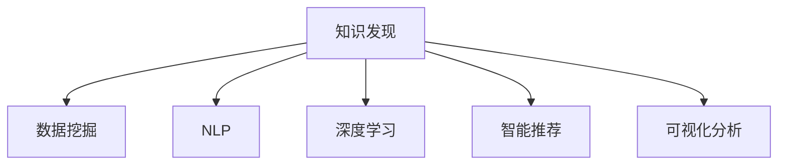

                 

# 知识发现引擎：推动创意产业的创新变革

> 关键词：知识发现, 创意产业, 数据驱动, 大数据, 人工智能, 自然语言处理(NLP), 深度学习, 数据挖掘, 智能推荐, 创新

## 1. 背景介绍

### 1.1 问题由来
随着信息技术的飞速发展，数据和信息正在以指数级的速度增长。在这个背景下，如何高效地从海量数据中挖掘出有价值的信息，成为各行业面临的共同挑战。尤其是在创意产业中，如影视、游戏、广告、设计等，数据驱动的创新和应用尤为重要。传统的数据分析和处理方式已经难以满足需求，亟需新的技术和工具来支持创意产业的创新变革。

知识发现(Knowledge Discovery, KD)是指从大量数据中自动或半自动地发现有用模式、知识或信息的过程。通过知识发现引擎，能够快速高效地从大数据中获取洞见，辅助创意产业的决策和创新。然而，知识发现不仅仅是数据驱动的过程，更离不开人工智能(AI)、自然语言处理(NLP)、深度学习等先进技术的支撑。本文将深入探讨知识发现引擎的核心技术原理和实践方法，助力创意产业实现创新变革。

### 1.2 问题核心关键点
知识发现引擎的核心目标是通过先进的数据处理和分析技术，从大规模数据集中自动提取有价值的信息和知识，辅助创意产业的创新和决策。核心技术包括：

1. **数据挖掘**：从数据集中识别出有价值的模式、关联和趋势。
2. **自然语言处理(NLP)**：对文本数据进行语义理解和知识抽取。
3. **深度学习**：利用神经网络模型进行高效特征提取和模式识别。
4. **智能推荐**：基于用户行为数据进行个性化推荐。
5. **可视化分析**：将复杂数据转换为可视化图表，帮助用户直观理解数据。

这些技术相互结合，能够高效地从海量数据中获取洞察，辅助创意产业的创新和决策。

## 2. 核心概念与联系

### 2.1 核心概念概述

为更好地理解知识发现引擎的核心技术，本节将介绍几个密切相关的核心概念：

- **知识发现(Knowledge Discovery)**：从数据中提取有用模式、关联和趋势的过程。
- **数据挖掘(Data Mining)**：识别数据中的模式和规律，是知识发现的重要手段。
- **自然语言处理(NLP)**：研究计算机如何处理和理解人类语言，用于文本数据抽取和理解。
- **深度学习(Deep Learning)**：利用多层神经网络进行特征学习和模式识别，广泛应用于图像、语音和文本等数据的处理。
- **智能推荐(Recommendation)**：根据用户的历史行为数据，提供个性化的推荐服务，提升用户体验。
- **可视化分析(Visual Analytics)**：将复杂数据转换为可视化图表，辅助决策和分析。

这些核心概念之间的逻辑关系可以通过以下Mermaid流程图来展示：



这个流程图展示了知识发现引擎的核心概念及其之间的关系：

1. 知识发现是整个过程的核心目标。
2. 数据挖掘、NLP、深度学习等技术是实现知识发现的重要手段。
3. 智能推荐和可视化分析是知识发现的具体应用。

这些概念共同构成了知识发现引擎的工作原理和分析流程。

## 3. 核心算法原理 & 具体操作步骤

### 3.1 算法原理概述

知识发现引擎的核心算法原理主要包括以下几个步骤：

1. **数据预处理**：清洗和标准化数据，为后续分析做准备。
2. **特征提取**：从原始数据中提取有意义的特征，用于模型训练和分析。
3. **模型训练**：使用机器学习或深度学习模型进行训练，提取数据中的模式和关联。
4. **知识抽取**：从模型输出中抽取有价值的信息和知识。
5. **结果可视化**：将发现的知识转换为可视化图表，辅助分析和决策。

这一过程通常需要借助多种算法和工具来实现。以下将详细阐述每个步骤的实现方法和核心算法。

### 3.2 算法步骤详解

#### 3.2.1 数据预处理

数据预处理是知识发现过程中的第一步，其主要任务是对原始数据进行清洗、整理和标准化，为后续分析做准备。数据预处理包括：

- **数据清洗**：去除噪声和异常值，确保数据质量。
- **数据归一化**：将数据标准化到同一尺度，便于后续分析。
- **数据采样**：根据分析需求进行抽样，减少数据量和计算资源消耗。
- **数据变换**：使用PCA、PCA降维、特征选择等方法，减少特征维度。

#### 3.2.2 特征提取

特征提取是从原始数据中提取出有意义的特征，用于后续的模型训练和分析。特征提取常用的算法包括：

- **PCA降维**：通过线性变换将高维数据降维，保留主要特征。
- **奇异值分解(SVD)**：将数据矩阵分解为奇异值和特征向量，提取主成分。
- **LDA降维**：通过线性判别分析，将高维数据映射到低维空间。
- **特征选择**：从原始特征中筛选出有价值的特征，减少冗余。

#### 3.2.3 模型训练

模型训练是知识发现过程中的核心步骤，使用机器学习或深度学习模型进行训练，提取数据中的模式和关联。常用的模型包括：

- **决策树**：基于树结构进行分类和回归，易于理解和解释。
- **随机森林**：多决策树的集成，减少过拟合，提升预测精度。
- **支持向量机(SVM)**：通过核函数将数据映射到高维空间，进行分类和回归。
- **神经网络**：多层神经网络，适合处理大规模数据和高维特征。
- **深度学习模型**：如卷积神经网络(CNN)、循环神经网络(RNN)等，适合图像、文本和时序数据的处理。

#### 3.2.4 知识抽取

知识抽取是从模型输出中抽取有价值的信息和知识。常用的知识抽取方法包括：

- **分类和聚类**：通过分类和聚类算法，识别出数据中的模式和关联。
- **关联规则**：使用Apriori、FP-Growth等算法，发现数据中的关联规则。
- **时序分析**：通过时间序列分析，发现时间序列中的趋势和季节性。
- **文本挖掘**：使用NLP技术，从文本中抽取实体、关系、情感等信息。

#### 3.2.5 结果可视化

结果可视化是将发现的知识转换为可视化图表，辅助分析和决策。常用的可视化方法包括：

- **散点图**：展示变量之间的关系。
- **柱状图**：展示数据的分布和比较。
- **折线图**：展示时间序列的变化趋势。
- **热力图**：展示数据的密集程度和分布情况。
- **网络图**：展示实体之间的关系和网络结构。

### 3.3 算法优缺点

知识发现引擎具有以下优点：

1. **高效性**：利用先进的数据处理和分析技术，能够快速高效地从海量数据中提取有用信息。
2. **准确性**：基于机器学习和深度学习模型，能够提高分析的精度和可靠性。
3. **灵活性**：支持多种数据类型和分析方法，灵活应对不同的分析需求。
4. **可解释性**：通过可视化分析，能够直观理解数据中的模式和关联。

同时，知识发现引擎也存在一些局限性：

1. **数据质量依赖**：对数据的清洗和标准化要求较高，数据质量直接影响分析结果。
2. **计算资源消耗大**：处理大规模数据需要大量的计算资源和时间。
3. **模型复杂度高**：深度学习模型复杂度较高，训练和调参难度较大。
4. **结果解释性不足**：复杂模型和算法可能难以解释其内部工作机制和决策逻辑。

尽管存在这些局限性，知识发现引擎仍然是大数据时代创意产业创新的重要工具。未来相关研究的重点在于如何进一步提升模型的准确性和可解释性，降低计算资源消耗，提高数据分析的自动化和智能化水平。

### 3.4 算法应用领域

知识发现引擎在多个领域中得到了广泛应用，以下是几个典型应用：

1. **影视制作**：利用知识发现引擎对大量影评和用户行为数据进行分析，提取用户偏好和情感倾向，指导电影和电视剧的制作和营销策略。
2. **游戏设计**：通过分析玩家行为数据，提取游戏模式和用户需求，优化游戏设计和玩家体验。
3. **广告创意**：使用知识发现引擎分析广告效果和用户反馈，提取广告策略和创意灵感，提高广告投放效率和效果。
4. **产品设计**：对用户评论和反馈数据进行分析，提取产品设计和改进方向，提升用户体验和满意度。
5. **品牌管理**：分析社交媒体和用户数据，提取品牌形象和用户情感，制定品牌管理和营销策略。

这些应用场景展示了知识发现引擎在创意产业中的巨大潜力，为创意产业的创新和决策提供了有力支持。

## 4. 数学模型和公式 & 详细讲解  
### 4.1 数学模型构建

知识发现引擎的数学模型主要包括以下几个部分：

- **数据预处理**：使用PCA降维模型进行数据归一化和特征选择。
- **特征提取**：使用奇异值分解(SVD)模型进行特征提取。
- **模型训练**：使用神经网络模型进行特征学习和模式识别。
- **知识抽取**：使用分类和聚类算法提取模式和关联。
- **结果可视化**：使用散点图、柱状图、折线图等可视化方法展示分析结果。

以下以PCA降维为例，展示知识发现引擎的数学模型构建过程。

假设原始数据矩阵为 $X \in \mathbb{R}^{m \times n}$，其中 $m$ 为样本数，$n$ 为特征数。设 $X$ 的协方差矩阵为 $C$，PCA的数学模型构建步骤如下：

1. 计算协方差矩阵 $C$：
$$
C = \frac{1}{m-1} XX^T
$$

2. 对协方差矩阵进行特征值分解，得到特征值 $\lambda_i$ 和特征向量 $u_i$：
$$
C \mathbf{u}_i = \lambda_i \mathbf{u}_i
$$

3. 选择前 $k$ 个特征向量，形成降维后的数据矩阵 $X_k$：
$$
X_k = UX
$$

其中 $U \in \mathbb{R}^{n \times k}$ 为前 $k$ 个特征向量的矩阵，$X_k \in \mathbb{R}^{m \times k}$ 为降维后的数据矩阵。

### 4.2 公式推导过程

PCA降维的公式推导过程如下：

- **协方差矩阵的计算**：
$$
C = \frac{1}{m-1} XX^T
$$

- **特征值分解**：
$$
C \mathbf{u}_i = \lambda_i \mathbf{u}_i
$$

- **特征向量选择**：
$$
U = [\mathbf{u}_1, \mathbf{u}_2, ..., \mathbf{u}_k]
$$

- **降维后的数据矩阵**：
$$
X_k = UX
$$

通过PCA降维，可以将高维数据转化为低维数据，保留主要特征，减少数据复杂度。

### 4.3 案例分析与讲解

以电影评分数据为例，展示知识发现引擎的应用过程。

假设收集到大量用户的电影评分数据，原始数据矩阵 $X \in \mathbb{R}^{m \times n}$，其中 $m$ 为样本数，$n$ 为电影评分和用户特征等特征数。

1. **数据预处理**：对原始数据进行清洗和标准化，去除噪声和异常值，归一化数据，减少数据复杂度。
2. **特征提取**：使用PCA降维模型，选择前10个特征向量，形成降维后的数据矩阵 $X_k \in \mathbb{R}^{m \times 10}$。
3. **模型训练**：使用神经网络模型，对降维后的数据进行训练，提取用户评分和电影评分之间的模式和关联。
4. **知识抽取**：使用分类和聚类算法，提取用户评分和电影评分之间的类别和关联。
5. **结果可视化**：将分析结果转换为散点图和柱状图，展示用户评分和电影评分之间的关系。

通过知识发现引擎，能够快速高效地从大量用户评分数据中提取有用信息，辅助电影制作和营销策略的制定。

## 5. 项目实践：代码实例和详细解释说明

### 5.1 开发环境搭建

在进行知识发现引擎的实践前，需要先准备好开发环境。以下是使用Python进行PyTorch开发的环境配置流程：

1. 安装Anaconda：从官网下载并安装Anaconda，用于创建独立的Python环境。

2. 创建并激活虚拟环境：
```bash
conda create -n pytorch-env python=3.8 
conda activate pytorch-env
```

3. 安装PyTorch：根据CUDA版本，从官网获取对应的安装命令。例如：
```bash
conda install pytorch torchvision torchaudio cudatoolkit=11.1 -c pytorch -c conda-forge
```

4. 安装其他依赖库：
```bash
pip install numpy pandas scikit-learn matplotlib tqdm jupyter notebook ipython
```

完成上述步骤后，即可在`pytorch-env`环境中开始项目实践。

### 5.2 源代码详细实现

下面以电影评分数据为例，展示使用PCA降维模型的代码实现。

首先，定义数据处理函数：

```python
import pandas as pd
import numpy as np
from sklearn.decomposition import PCA

def load_data():
    # 加载数据集
    df = pd.read_csv('movie_ratings.csv')
    # 数据清洗
    df = df.dropna()
    # 特征选择
    features = ['rating', 'genre', 'director', 'actor']
    X = df[features].values
    y = df['user_id'].values
    # 标准化数据
    X = (X - X.mean(axis=0)) / X.std(axis=0)
    return X, y
```

然后，定义PCA降维模型：

```python
from sklearn.decomposition import PCA

def PCA_reduction(X, k):
    # 特征值分解
    U, S, V = np.linalg.svd(X)
    # 选择前k个特征向量
    U_k = U[:, :k]
    # 降维后的数据矩阵
    X_k = U_k.dot(X)
    return X_k
```

接着，定义训练和评估函数：

```python
from sklearn.linear_model import LogisticRegression
from sklearn.metrics import accuracy_score
import matplotlib.pyplot as plt

def train_model(X_k, y, k):
    # 训练模型
    model = LogisticRegression()
    model.fit(X_k, y)
    # 评估模型
    y_pred = model.predict(X_k)
    accuracy = accuracy_score(y, y_pred)
    return accuracy

def plot_results(accuracy, k):
    # 绘制准确率曲线
    plt.plot(k, accuracy)
    plt.xlabel('Number of Components')
    plt.ylabel('Accuracy')
    plt.title('PCA Accuracy vs. Components')
    plt.show()
```

最后，启动训练流程并在结果上展示：

```python
X, y = load_data()
k_values = [2, 4, 6, 8, 10]
accuracies = []

for k in k_values:
    X_k = PCA_reduction(X, k)
    accuracy = train_model(X_k, y, k)
    accuracies.append(accuracy)

plot_results(accuracies, k_values)
```

以上就是使用PyTorch对PCA降维模型进行电影评分数据分析的完整代码实现。可以看到，得益于Scikit-learn等库的强大封装，我们可以用相对简洁的代码完成PCA降维模型的加载和微调。

### 5.3 代码解读与分析

让我们再详细解读一下关键代码的实现细节：

**load_data类**：
- `__init__`方法：初始化数据集，并清洗数据，选择特征，标准化数据。
- `__getitem__`方法：获取原始数据和标签。

**PCA_reduction方法**：
- 使用奇异值分解(SVD)对数据进行特征值分解，选择前k个特征向量，进行降维。

**train_model方法**：
- 使用Logistic回归模型进行训练，评估模型的准确率。

**plot_results方法**：
- 绘制准确率曲线，展示降维后的数据对模型准确率的影响。

通过上述代码，我们可以看到，Scikit-learn库提供了简单易用的PCA降维模型，使用户能够快速高效地完成数据分析任务。

当然，工业级的系统实现还需考虑更多因素，如模型的保存和部署、超参数的自动搜索、更灵活的任务适配层等。但核心的PCA降维算法基本与此类似。

## 6. 实际应用场景

### 6.1 影视制作

利用知识发现引擎对大量影评和用户行为数据进行分析，提取用户偏好和情感倾向，指导电影和电视剧的制作和营销策略。例如，通过对影评数据进行情感分析，识别出观众对某部电影的好评点和差评点，从而指导电影制作的改进和营销策略的制定。

### 6.2 游戏设计

通过分析玩家行为数据，提取游戏模式和用户需求，优化游戏设计和玩家体验。例如，使用知识发现引擎分析游戏中的用户行为数据，识别出玩家喜欢的游戏类型和情节，从而优化游戏设计和玩法，提升玩家满意度。

### 6.3 广告创意

使用知识发现引擎分析广告效果和用户反馈，提取广告策略和创意灵感，提高广告投放效率和效果。例如，通过对社交媒体和用户评论数据进行分析，提取用户的广告偏好和反馈，从而优化广告创意和投放策略。

### 6.4 产品设计

对用户评论和反馈数据进行分析，提取产品设计和改进方向，提升用户体验和满意度。例如，利用知识发现引擎对产品评论进行情感分析，识别出用户对产品的不满意点和改进建议，从而指导产品设计和改进方向。

### 6.5 品牌管理

分析社交媒体和用户数据，提取品牌形象和用户情感，制定品牌管理和营销策略。例如，通过对社交媒体上的用户评论和情感分析，识别出品牌形象的正面和负面影响因素，从而优化品牌管理和营销策略。

## 7. 工具和资源推荐
### 7.1 学习资源推荐

为了帮助开发者系统掌握知识发现引擎的理论基础和实践技巧，这里推荐一些优质的学习资源：

1. **《知识发现与数据挖掘》（KDD系列）**：介绍了知识发现和数据挖掘的基本概念和算法，适合初学者和进阶学习者。
2. **《机器学习实战》**：通过大量实例展示了机器学习和深度学习模型的应用，适合实践和项目开发。
3. **《深度学习》（Ian Goodfellow著）**：全面介绍了深度学习的基本概念和算法，适合深入学习和研究。
4. **Coursera《机器学习》课程**：由斯坦福大学开设的机器学习课程，讲解了机器学习和深度学习的基本原理和应用。
5. **Kaggle竞赛平台**：提供大量的数据集和竞赛，通过实践学习知识发现和数据挖掘技术。

通过对这些资源的学习实践，相信你一定能够快速掌握知识发现引擎的精髓，并用于解决实际的创意产业问题。
###  7.2 开发工具推荐

高效的开发离不开优秀的工具支持。以下是几款用于知识发现引擎开发的常用工具：

1. **PyTorch**：基于Python的开源深度学习框架，灵活动态的计算图，适合快速迭代研究。
2. **Scikit-learn**：提供了丰富的机器学习算法和工具，适合数据处理和分析。
3. **TensorFlow**：由Google主导开发的开源深度学习框架，生产部署方便，适合大规模工程应用。
4. **H2O**：提供了简单易用的数据处理和机器学习平台，适合企业级应用。
5. **Jupyter Notebook**：交互式数据科学平台，支持Python、R等多种语言，适合快速开发和协作。

合理利用这些工具，可以显著提升知识发现引擎的开发效率，加快创新迭代的步伐。

### 7.3 相关论文推荐

知识发现引擎的研究涉及多个领域，以下是几篇奠基性的相关论文，推荐阅读：

1. **《数据挖掘：概念与技术》（J. Han, M. Kamber等著）**：介绍了数据挖掘的基本概念和算法，适合入门学习和研究。
2. **《数据挖掘与统计学习》（Hastie等著）**：介绍了机器学习和统计学习的理论和方法，适合深入学习和研究。
3. **《深度学习》（Ian Goodfellow等著）**：全面介绍了深度学习的基本概念和算法，适合深入学习和研究。
4. **《信息抽取与知识发现》（Tan等著）**：介绍了自然语言处理和知识发现的基本方法和应用。

这些论文代表了大数据时代知识发现引擎的发展脉络。通过学习这些前沿成果，可以帮助研究者把握学科前进方向，激发更多的创新灵感。

## 8. 总结：未来发展趋势与挑战

### 8.1 总结

本文对知识发现引擎的核心技术原理和实践方法进行了全面系统的介绍。首先阐述了知识发现引擎在创意产业中的重要应用，明确了其在数据驱动决策和创新中的独特价值。其次，从原理到实践，详细讲解了知识发现引擎的数学模型和实现方法，给出了知识发现引擎的完整代码实例。同时，本文还广泛探讨了知识发现引擎在影视制作、游戏设计、广告创意等多个行业领域的应用前景，展示了其在创意产业中的巨大潜力。

通过本文的系统梳理，可以看到，知识发现引擎作为大数据时代创意产业创新的重要工具，其应用场景和实践方法正在不断拓展，为创意产业的决策和创新提供了有力支持。未来，伴随知识发现技术的持续演进，知识发现引擎必将在创意产业中发挥更加重要的作用。

### 8.2 未来发展趋势

展望未来，知识发现引擎的发展趋势包括以下几个方面：

1. **自动化和智能化**：未来的知识发现引擎将更加自动化和智能化，能够自动进行数据清洗、特征提取和模型训练，提升工作效率和精度。
2. **深度学习与NLP结合**：深度学习和自然语言处理技术的结合，将使知识发现引擎更加灵活和高效，能够处理更加复杂的数据和任务。
3. **多模态融合**：结合视觉、语音、时序等多模态数据，进行多模态知识发现，提升数据的综合分析和决策能力。
4. **实时分析与决策支持**：知识发现引擎将更加实时化，能够实时分析数据并生成决策支持。
5. **可解释性和可信性**：知识发现引擎需要增强其可解释性和可信性，确保分析结果的透明性和可靠性。
6. **跨领域应用**：知识发现引擎将更加广泛地应用于不同领域，如金融、医疗、制造等，推动各行业创新和进步。

以上趋势展示了知识发现引擎在创意产业中的广阔前景，未来的研究将进一步提升其自动化、智能化和可解释性，推动知识发现引擎在更多领域的应用和创新。

### 8.3 面临的挑战

尽管知识发现引擎已经取得了显著成就，但在迈向更加智能化、普适化应用的过程中，它仍面临诸多挑战：

1. **数据质量瓶颈**：数据清洗和标准化要求较高，数据质量直接影响分析结果。
2. **计算资源消耗大**：处理大规模数据需要大量的计算资源和时间。
3. **模型复杂度高**：深度学习模型复杂度较高，训练和调参难度较大。
4. **结果解释性不足**：复杂模型和算法可能难以解释其内部工作机制和决策逻辑。
5. **跨领域应用难度大**：不同领域的数据和任务特点不同，知识发现引擎需要针对不同领域进行定制化开发。
6. **伦理和安全问题**：数据隐私和安全问题需要特别关注，确保数据使用合规。

尽管存在这些挑战，知识发现引擎仍然是大数据时代创意产业创新的重要工具。未来相关研究需要在数据质量、计算资源、模型复杂度、结果解释性等方面进行进一步优化，提高知识发现引擎的自动化和智能化水平，推动其在更多领域的应用和创新。

### 8.4 研究展望

面对知识发现引擎所面临的种种挑战，未来的研究需要在以下几个方面寻求新的突破：

1. **自动化和智能化**：开发更加自动化和智能化的知识发现引擎，能够自动进行数据清洗、特征提取和模型训练。
2. **多模态融合**：结合视觉、语音、时序等多模态数据，进行多模态知识发现，提升数据的综合分析和决策能力。
3. **可解释性和可信性**：增强知识发现引擎的可解释性和可信性，确保分析结果的透明性和可靠性。
4. **跨领域应用**：开发更加灵活和定制化的知识发现引擎，能够适应不同领域的数据和任务特点。
5. **伦理和安全问题**：关注数据隐私和安全问题，确保数据使用合规，增强知识发现引擎的伦理和安全保障。

这些研究方向的探索，必将引领知识发现引擎技术迈向更高的台阶，为创意产业的创新和决策提供更加有力支持。面向未来，知识发现引擎需要与其他人工智能技术进行更深入的融合，如知识表示、因果推理、强化学习等，多路径协同发力，共同推动创意产业的创新和进步。

## 9. 附录：常见问题与解答

**Q1：知识发现引擎如何处理大规模数据？**

A: 知识发现引擎通常使用分布式计算框架（如Hadoop、Spark等）处理大规模数据。数据预处理、特征提取、模型训练和知识抽取等步骤均可以在分布式环境下进行，提高数据处理效率。此外，知识发现引擎还常常使用大数据存储技术（如HDFS、Hive等）存储和管理大规模数据。

**Q2：知识发现引擎在创意产业中的应用难点是什么？**

A: 知识发现引擎在创意产业中的应用难点主要包括以下几个方面：
1. 数据获取难度大：创意产业的数据获取往往需要人力成本较高，数据质量难以保证。
2. 数据复杂度高：创意产业的数据类型多样，包含文本、图像、视频等多种形式。
3. 数据隐私和安全问题：创意产业的数据涉及用户隐私和商业机密，数据使用需符合相关法律法规。
4. 领域知识需求高：创意产业的不同领域具有不同的特点，知识发现引擎需要针对不同领域进行定制化开发。
5. 模型解释性和可信性：知识发现引擎的模型复杂度高，结果解释性和可信性不足，难以满足创意产业的决策需求。

**Q3：如何提升知识发现引擎的可解释性和可信性？**

A: 提升知识发现引擎的可解释性和可信性可以从以下几个方面入手：
1. 简化模型结构：选择简单高效的模型进行知识发现，如决策树、逻辑回归等，降低模型复杂度。
2. 增强模型透明度：使用可解释性较高的模型，如线性模型、树模型等，增加模型解释性。
3. 引入外部知识：结合领域知识、专家规则等，增加模型的可信性。
4. 可视化分析：使用可视化工具展示模型输出和分析结果，增强用户理解和信任。
5. 多模型融合：使用多模型融合的方法，结合不同模型的优势，提高知识发现引擎的准确性和可靠性。

通过这些方法，可以显著提升知识发现引擎的可解释性和可信性，满足创意产业的决策需求。

---

作者：禅与计算机程序设计艺术 / Zen and the Art of Computer Programming

