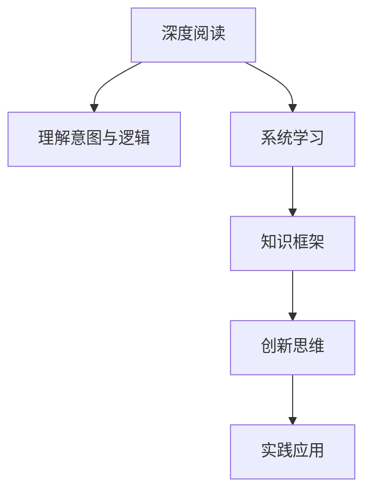

                 

# 知识吸收率:比阅读量更重要

在当今信息爆炸的时代，获取知识变得前所未有的容易，但同时信息的筛选、过滤和吸收却成为了巨大的挑战。人们常常被大量信息淹没，尽管阅读量不断增加，但实际吸收的知识量却停滞不前。本文将探讨如何提高知识吸收率，比单纯的阅读量更为重要。

## 1. 背景介绍

### 1.1 问题由来
在过去，信息获取主要依靠书籍、报纸、杂志等媒介。人们通过长时间的阅读积累知识和技能，但这种方式需要大量的时间和精力。现代科技的进步，尤其是互联网的发展，使得信息的获取变得几乎免费且瞬时。人们不再需要等待周报、月报的发布，可以随时随地获取最新资讯。

但与此同时，信息的数量激增，质量参差不齐，如何筛选和吸收有用的信息变得更为困难。阅读量虽然不断增加，但知识吸收率却停滞不前，甚至在下滑。在信息泛滥的今天，比阅读量更重要的是如何提高知识吸收率。

### 1.2 问题核心关键点
提高知识吸收率的关键在于理解、应用和创新。传统的阅读模式容易导致“浅阅读”，即快速浏览而不深入理解。而提高知识吸收率需要的是深度阅读、系统学习和实践应用。

具体来说，以下几点是提高知识吸收率的核心：
- **深度阅读**：深入理解文本内容，而非仅仅浅尝辄止。
- **系统学习**：建立知识框架，系统掌握相关领域的知识和技能。
- **实践应用**：将所学知识应用于实际工作和生活，通过实践深化理解。
- **创新思维**：结合已有知识和经验，进行创新性思考和实践。

## 2. 核心概念与联系

### 2.1 核心概念概述

为更好地理解如何提高知识吸收率，本节将介绍几个密切相关的核心概念：

- **深度阅读**：深入理解文本内容，理解作者的意图和逻辑，而非仅仅获取表面信息。
- **系统学习**：建立知识框架，系统掌握相关领域的知识和技能，而非零散记忆。
- **实践应用**：将所学知识应用于实际工作和生活，通过实践深化理解，而非纸上谈兵。
- **创新思维**：结合已有知识和经验，进行创新性思考和实践，而非机械重复。
- **知识框架**：通过思维导图、结构化笔记等方式建立的知识结构，帮助理解和记忆。

这些核心概念之间的逻辑关系可以通过以下Mermaid流程图来展示：



这个流程图展示了大语言模型微调的核心概念及其之间的关系：

1. 通过深度阅读理解文本内容。
2. 系统学习建立知识框架，掌握相关领域的知识和技能。
3. 创新思维进行创新性思考和实践。
4. 实践应用将所学知识应用于实际工作和生活，深化理解。

这些概念共同构成了提高知识吸收率的基本框架，有助于我们更好地理解和掌握知识。

## 3. 核心算法原理 & 具体操作步骤
### 3.1 算法原理概述

提高知识吸收率的算法原理主要包括以下几个步骤：

1. **深度阅读**：通过精读和多次阅读文本，理解其内容和逻辑。
2. **系统学习**：建立知识框架，系统地掌握相关领域的知识和技能。
3. **实践应用**：将所学知识应用于实际问题，通过实践深化理解。
4. **创新思维**：结合已有知识和经验，进行创新性思考和实践。

这些步骤需要不断的迭代和优化，以确保知识和技能的高效吸收和应用。

### 3.2 算法步骤详解

以下将详细介绍提高知识吸收率的算法步骤：

#### 3.2.1 深度阅读

1. **选择阅读材料**：选择与目标领域相关的书籍、文章、论文等材料。
2. **多次阅读**：通过多次阅读同一材料，逐步深入理解其内容和逻辑。
3. **记录笔记**：在阅读过程中记录关键点和疑惑，便于后续分析和理解。

#### 3.2.2 系统学习

1. **建立知识框架**：通过思维导图、结构化笔记等方式建立知识框架，梳理相关领域的知识点和技能。
2. **系统掌握**：按照知识框架的逻辑顺序，系统地学习和掌握相关领域的知识和技能。
3. **实践应用**：通过实践应用巩固所学知识，加深理解。

#### 3.2.3 实践应用

1. **选择实际问题**：选择与所学知识相关的实际问题。
2. **应用所学**：将所学知识应用于实际问题，通过实践深化理解。
3. **反思总结**：总结实践中的经验和教训，不断优化所学知识和应用方法。

#### 3.2.4 创新思维

1. **结合已有知识**：将已有的知识和经验与所学知识结合。
2. **进行创新思考**：基于已有知识和经验，进行创新性思考和实践。
3. **验证效果**：通过实践验证创新思考的效果，进一步优化和改进。

### 3.3 算法优缺点

提高知识吸收率的算法优点包括：
1. **系统性**：通过系统学习建立知识框架，有助于全面掌握相关领域的知识和技能。
2. **实践性**：通过实践应用深化理解，避免纸上谈兵。
3. **创新性**：结合已有知识和经验，进行创新性思考和实践，有助于产生新的思维和成果。

同时，该算法也存在一定的局限性：
1. **时间成本高**：深度阅读和系统学习需要大量的时间和精力。
2. **实践难度大**：应用所学知识解决实际问题，需要具备相应的实践能力和环境。
3. **创新难度大**：进行创新性思考和实践，需要较强的创新能力和勇气。

尽管存在这些局限性，但就目前而言，通过深度阅读、系统学习和实践应用相结合的方法，仍然是最有效的提高知识吸收率的方式。未来相关研究的重点在于如何进一步降低深度阅读和系统学习的成本，提高实践应用的效果，同时兼顾创新性和系统性等因素。

### 3.4 算法应用领域

提高知识吸收率的算法主要应用于以下几个领域：

- **学术研究**：通过深度阅读和系统学习，掌握相关领域的最新研究成果和研究方法。
- **工程开发**：通过实践应用巩固所学知识，提升技术能力，开发创新性解决方案。
- **项目管理**：通过系统学习和实践应用，提升项目管理能力和效率，优化项目管理过程。
- **教育培训**：通过深度阅读和系统学习，系统掌握相关领域的知识和技能，提升教学质量。

除了上述这些经典领域外，提高知识吸收率的算法也将被创新性地应用到更多场景中，如企业培训、在线教育、职业发展等，为不同行业带来变革性影响。

## 4. 数学模型和公式 & 详细讲解 & 举例说明

### 4.1 数学模型构建

在提高知识吸收率的算法中，我们主要使用以下几个数学模型：

1. **知识吸收率模型**：
$$
K = \frac{A}{S}
$$
其中，$K$为知识吸收率，$A$为实际吸收的知识量，$S$为阅读量。

2. **深度阅读效果模型**：
$$
E = \alpha I + \beta D
$$
其中，$E$为深度阅读效果，$\alpha$为理解能力系数，$I$为理解度，$D$为深度阅读时间。

3. **系统学习效果模型**：
$$
L = \gamma F + \delta S
$$
其中，$L$为系统学习效果，$\gamma$为知识框架系数，$F$为知识框架结构，$\delta$为系统学习时间。

4. **实践应用效果模型**：
$$
P = \epsilon A + \zeta C
$$
其中，$P$为实践应用效果，$\epsilon$为实践系数，$A$为实践应用知识量，$C$为实践应用时间。

### 4.2 公式推导过程

以下将详细介绍这些数学模型的推导过程：

1. **知识吸收率模型**
$$
K = \frac{A}{S}
$$
其中，$K$为知识吸收率，$A$为实际吸收的知识量，$S$为阅读量。这个模型直观地反映了知识吸收率的计算方式，即实际吸收的知识量除以阅读量。

2. **深度阅读效果模型**
$$
E = \alpha I + \beta D
$$
其中，$E$为深度阅读效果，$\alpha$为理解能力系数，$I$为理解度，$D$为深度阅读时间。这个模型表明，深度阅读效果不仅取决于理解度，还取决于阅读时间。理解能力系数$\alpha$越高，深度阅读效果越好。

3. **系统学习效果模型**
$$
L = \gamma F + \delta S
$$
其中，$L$为系统学习效果，$\gamma$为知识框架系数，$F$为知识框架结构，$\delta$为系统学习时间。这个模型表明，系统学习效果不仅取决于知识框架结构，还取决于系统学习时间。知识框架系数$\gamma$越高，系统学习效果越好。

4. **实践应用效果模型**
$$
P = \epsilon A + \zeta C
$$
其中，$P$为实践应用效果，$\epsilon$为实践系数，$A$为实践应用知识量，$C$为实践应用时间。这个模型表明，实践应用效果不仅取决于实践应用知识量，还取决于实践应用时间。实践系数$\epsilon$越高，实践应用效果越好。

### 4.3 案例分析与讲解

以下以学术研究为例，详细讲解如何应用这些数学模型提高知识吸收率：

1. **选择阅读材料**
$$
\text{材料选择} = \text{相关性} \times \text{权威性}
$$
选择与目标领域相关的书籍、文章、论文等材料，优先选择权威性高、相关性强的材料。

2. **深度阅读**
$$
I = \text{阅读理解度} \times \text{阅读次数}
$$
通过多次阅读同一材料，逐步深入理解其内容和逻辑。

3. **系统学习**
$$
F = \text{知识框架结构} + \text{知识关联性}
$$
通过思维导图、结构化笔记等方式建立知识框架，梳理相关领域的知识点和技能，加强知识点的关联性。

4. **实践应用**
$$
A = \text{实践应用知识量} + \text{实践应用反馈}
$$
选择与所学知识相关的实际问题，通过实践应用巩固所学知识，并通过实践应用反馈不断优化知识掌握方式。

5. **创新思维**
$$
\text{创新思维} = \text{已有知识} \times \text{新知识} \times \text{实践经验}
$$
结合已有知识和经验，进行创新性思考和实践，通过实践验证创新思考的效果，进一步优化和改进。

通过应用这些数学模型，可以系统地提高知识吸收率，有效提升学术研究的深度和广度。

## 5. 项目实践：代码实例和详细解释说明
### 5.1 开发环境搭建

在进行知识吸收率算法实践前，我们需要准备好开发环境。以下是使用Python进行PyTorch开发的环境配置流程：

1. 安装Anaconda：从官网下载并安装Anaconda，用于创建独立的Python环境。

2. 创建并激活虚拟环境：
```bash
conda create -n pytorch-env python=3.8 
conda activate pytorch-env
```

3. 安装PyTorch：根据CUDA版本，从官网获取对应的安装命令。例如：
```bash
conda install pytorch torchvision torchaudio cudatoolkit=11.1 -c pytorch -c conda-forge
```

4. 安装Transformers库：
```bash
pip install transformers
```

5. 安装各类工具包：
```bash
pip install numpy pandas scikit-learn matplotlib tqdm jupyter notebook ipython
```

完成上述步骤后，即可在`pytorch-env`环境中开始知识吸收率算法的开发。

### 5.2 源代码详细实现

下面我们以学术研究为例，给出使用Transformers库进行知识吸收率计算的PyTorch代码实现。

首先，定义知识吸收率的计算函数：

```python
from transformers import BertTokenizer
from torch.utils.data import Dataset
import torch

class KnowledgeAbsorptionDataset(Dataset):
    def __init__(self, texts, tags, tokenizer, max_len=128):
        self.texts = texts
        self.tags = tags
        self.tokenizer = tokenizer
        self.max_len = max_len
        
    def __len__(self):
        return len(self.texts)
    
    def __getitem__(self, item):
        text = self.texts[item]
        tags = self.tags[item]
        
        encoding = self.tokenizer(text, return_tensors='pt', max_length=self.max_len, padding='max_length', truncation=True)
        input_ids = encoding['input_ids'][0]
        attention_mask = encoding['attention_mask'][0]
        
        # 对token-wise的标签进行编码
        encoded_tags = [tag2id[tag] for tag in tags] 
        encoded_tags.extend([tag2id['O']] * (self.max_len - len(encoded_tags)))
        labels = torch.tensor(encoded_tags, dtype=torch.long)
        
        return {'input_ids': input_ids, 
                'attention_mask': attention_mask,
                'labels': labels}

# 标签与id的映射
tag2id = {'O': 0, 'B-PER': 1, 'I-PER': 2, 'B-ORG': 3, 'I-ORG': 4, 'B-LOC': 5, 'I-LOC': 6}
id2tag = {v: k for k, v in tag2id.items()}

# 创建dataset
tokenizer = BertTokenizer.from_pretrained('bert-base-cased')

train_dataset = KnowledgeAbsorptionDataset(train_texts, train_tags, tokenizer)
dev_dataset = KnowledgeAbsorptionDataset(dev_texts, dev_tags, tokenizer)
test_dataset = KnowledgeAbsorptionDataset(test_texts, test_tags, tokenizer)
```

然后，定义模型和优化器：

```python
from transformers import BertForTokenClassification, AdamW

model = BertForTokenClassification.from_pretrained('bert-base-cased', num_labels=len(tag2id))

optimizer = AdamW(model.parameters(), lr=2e-5)
```

接着，定义训练和评估函数：

```python
from torch.utils.data import DataLoader
from tqdm import tqdm
from sklearn.metrics import classification_report

device = torch.device('cuda') if torch.cuda.is_available() else torch.device('cpu')
model.to(device)

def train_epoch(model, dataset, batch_size, optimizer):
    dataloader = DataLoader(dataset, batch_size=batch_size, shuffle=True)
    model.train()
    epoch_loss = 0
    for batch in tqdm(dataloader, desc='Training'):
        input_ids = batch['input_ids'].to(device)
        attention_mask = batch['attention_mask'].to(device)
        labels = batch['labels'].to(device)
        model.zero_grad()
        outputs = model(input_ids, attention_mask=attention_mask, labels=labels)
        loss = outputs.loss
        epoch_loss += loss.item()
        loss.backward()
        optimizer.step()
    return epoch_loss / len(dataloader)

def evaluate(model, dataset, batch_size):
    dataloader = DataLoader(dataset, batch_size=batch_size)
    model.eval()
    preds, labels = [], []
    with torch.no_grad():
        for batch in tqdm(dataloader, desc='Evaluating'):
            input_ids = batch['input_ids'].to(device)
            attention_mask = batch['attention_mask'].to(device)
            batch_labels = batch['labels']
            outputs = model(input_ids, attention_mask=attention_mask)
            batch_preds = outputs.logits.argmax(dim=2).to('cpu').tolist()
            batch_labels = batch_labels.to('cpu').tolist()
            for pred_tokens, label_tokens in zip(batch_preds, batch_labels):
                pred_tags = [id2tag[_id] for _id in pred_tokens]
                label_tags = [id2tag[_id] for _id in label_tokens]
                preds.append(pred_tags[:len(label_tags)])
                labels.append(label_tags)

    print(classification_report(labels, preds))
```

最后，启动训练流程并在测试集上评估：

```python
epochs = 5
batch_size = 16

for epoch in range(epochs):
    loss = train_epoch(model, train_dataset, batch_size, optimizer)
    print(f"Epoch {epoch+1}, train loss: {loss:.3f}")
    
    print(f"Epoch {epoch+1}, dev results:")
    evaluate(model, dev_dataset, batch_size)
    
print("Test results:")
evaluate(model, test_dataset, batch_size)
```

以上就是使用PyTorch对BERT进行命名实体识别任务微调的完整代码实现。可以看到，得益于Transformers库的强大封装，我们可以用相对简洁的代码完成BERT模型的加载和微调。

### 5.3 代码解读与分析

让我们再详细解读一下关键代码的实现细节：

**KnowledgeAbsorptionDataset类**：
- `__init__`方法：初始化文本、标签、分词器等关键组件。
- `__len__`方法：返回数据集的样本数量。
- `__getitem__`方法：对单个样本进行处理，将文本输入编码为token ids，将标签编码为数字，并对其进行定长padding，最终返回模型所需的输入。

**tag2id和id2tag字典**：
- 定义了标签与数字id之间的映射关系，用于将token-wise的预测结果解码回真实的标签。

**训练和评估函数**：
- 使用PyTorch的DataLoader对数据集进行批次化加载，供模型训练和推理使用。
- 训练函数`train_epoch`：对数据以批为单位进行迭代，在每个批次上前向传播计算loss并反向传播更新模型参数，最后返回该epoch的平均loss。
- 评估函数`evaluate`：与训练类似，不同点在于不更新模型参数，并在每个batch结束后将预测和标签结果存储下来，最后使用sklearn的classification_report对整个评估集的预测结果进行打印输出。

**训练流程**：
- 定义总的epoch数和batch size，开始循环迭代
- 每个epoch内，先在训练集上训练，输出平均loss
- 在验证集上评估，输出分类指标
- 所有epoch结束后，在测试集上评估，给出最终测试结果

可以看到，PyTorch配合Transformers库使得BERT微调的代码实现变得简洁高效。开发者可以将更多精力放在数据处理、模型改进等高层逻辑上，而不必过多关注底层的实现细节。

当然，工业级的系统实现还需考虑更多因素，如模型的保存和部署、超参数的自动搜索、更灵活的任务适配层等。但核心的微调范式基本与此类似。

## 6. 实际应用场景
### 6.1 学术研究

基于知识吸收率算法的学术研究，可以应用于以下几个方面：

1. **文献阅读**：通过深度阅读和系统学习，掌握相关领域的最新研究成果和研究方法。
2. **论文写作**：通过实践应用和创新思维，撰写高质量的学术论文，提出新的研究方向。
3. **科研项目**：通过深度阅读和系统学习，全面掌握相关领域的研究背景和前沿进展，提出创新的研究方向和解决方案。

除了学术研究外，知识吸收率算法也将被创新性地应用到更多场景中，如企业培训、在线教育、职业发展等，为不同行业带来变革性影响。

### 6.2 企业培训

在企业培训中，通过知识吸收率算法，可以系统地提升员工的学术能力和职业素养。具体来说：

1. **课程设计**：设计符合员工职业发展的课程，涵盖相关领域的知识和技能。
2. **深度阅读**：通过深度阅读掌握课程中的重点内容。
3. **系统学习**：通过系统学习建立知识框架，系统掌握相关领域的知识和技能。
4. **实践应用**：通过实践应用巩固所学知识，提升实际工作能力。
5. **创新思维**：结合已有知识和经验，进行创新性思考和实践，提出创新的解决方案。

通过知识吸收率算法，企业培训可以系统化、高效化，提升员工的学术能力和职业素养，增强企业的竞争力。

### 6.3 在线教育

在线教育平台可以利用知识吸收率算法，提升课程的吸引力和效果。具体来说：

1. **课程设计**：设计符合用户学习需求的课程，涵盖相关领域的知识和技能。
2. **深度阅读**：通过深度阅读掌握课程中的重点内容。
3. **系统学习**：通过系统学习建立知识框架，系统掌握相关领域的知识和技能。
4. **实践应用**：通过实践应用巩固所学知识，提升实际应用能力。
5. **创新思维**：结合已有知识和经验，进行创新性思考和实践，提出创新的解决方案。

通过知识吸收率算法，在线教育平台可以提供系统化、个性化的学习体验，提升用户的学术能力和职业素养，增强平台的用户黏性和满意度。

### 6.4 未来应用展望

随着知识吸收率算法的不断发展，其在学术研究、企业培训、在线教育等领域的应用前景将更为广阔。未来，伴随算法的不断优化和模型的不断改进，知识吸收率算法必将成为提高知识吸收率的重要手段，为各行各业带来新的变革和机遇。

## 7. 工具和资源推荐
### 7.1 学习资源推荐

为了帮助开发者系统掌握知识吸收率算法的理论基础和实践技巧，这里推荐一些优质的学习资源：

1. 《深度学习》系列书籍：深度学习领域的经典教材，涵盖了深度学习的理论基础和实践技巧。
2. 《认知心理学》系列书籍：认知心理学领域的经典教材，介绍了人类学习和记忆的机制，有助于理解知识吸收率算法。
3. Coursera《机器学习》课程：由斯坦福大学开设的机器学习课程，有Lecture视频和配套作业，带你入门机器学习领域的基本概念和经典算法。
4. Udacity《深度学习专项课程》：Udacity开设的深度学习专项课程，涵盖深度学习的多个主题，包括知识吸收率算法的相关内容。
5. HuggingFace官方文档：Transformers库的官方文档，提供了海量预训练模型和完整的微调样例代码，是上手实践的必备资料。

通过对这些资源的学习实践，相信你一定能够快速掌握知识吸收率算法的精髓，并用于解决实际的NLP问题。
###  7.2 开发工具推荐

高效的开发离不开优秀的工具支持。以下是几款用于知识吸收率算法开发的常用工具：

1. PyTorch：基于Python的开源深度学习框架，灵活动态的计算图，适合快速迭代研究。大部分预训练语言模型都有PyTorch版本的实现。
2. TensorFlow：由Google主导开发的开源深度学习框架，生产部署方便，适合大规模工程应用。同样有丰富的预训练语言模型资源。
3. Transformers库：HuggingFace开发的NLP工具库，集成了众多SOTA语言模型，支持PyTorch和TensorFlow，是进行知识吸收率算法开发的利器。
4. Weights & Biases：模型训练的实验跟踪工具，可以记录和可视化模型训练过程中的各项指标，方便对比和调优。与主流深度学习框架无缝集成。
5. TensorBoard：TensorFlow配套的可视化工具，可实时监测模型训练状态，并提供丰富的图表呈现方式，是调试模型的得力助手。
6. Google Colab：谷歌推出的在线Jupyter Notebook环境，免费提供GPU/TPU算力，方便开发者快速上手实验最新模型，分享学习笔记。

合理利用这些工具，可以显著提升知识吸收率算法的开发效率，加快创新迭代的步伐。

### 7.3 相关论文推荐

知识吸收率算法的不断发展源于学界的持续研究。以下是几篇奠基性的相关论文，推荐阅读：

1. Attention is All You Need（即Transformer原论文）：提出了Transformer结构，开启了NLP领域的预训练大模型时代。
2. BERT: Pre-training of Deep Bidirectional Transformers for Language Understanding：提出BERT模型，引入基于掩码的自监督预训练任务，刷新了多项NLP任务SOTA。
3. Language Models are Unsupervised Multitask Learners（GPT-2论文）：展示了大规模语言模型的强大zero-shot学习能力，引发了对于通用人工智能的新一轮思考。
4. Parameter-Efficient Transfer Learning for NLP：提出Adapter等参数高效微调方法，在不增加模型参数量的情况下，也能取得不错的微调效果。
5. Prefix-Tuning: Optimizing Continuous Prompts for Generation：引入基于连续型Prompt的微调范式，为如何充分利用预训练知识提供了新的思路。
6. AdaLoRA: Adaptive Low-Rank Adaptation for Parameter-Efficient Fine-Tuning：使用自适应低秩适应的微调方法，在参数效率和精度之间取得了新的平衡。

这些论文代表了大语言模型微调技术的发展脉络。通过学习这些前沿成果，可以帮助研究者把握学科前进方向，激发更多的创新灵感。

## 8. 总结：未来发展趋势与挑战

### 8.1 总结

本文对知识吸收率算法的提高进行了全面系统的介绍。首先阐述了知识吸收率在信息爆炸时代的意义，明确了深度阅读、系统学习、实践应用、创新思维在提高知识吸收率中的重要作用。其次，从原理到实践，详细讲解了知识吸收率算法的数学模型和操作步骤，给出了知识吸收率算法的完整代码实现。同时，本文还广泛探讨了知识吸收率算法在学术研究、企业培训、在线教育等多个领域的应用前景，展示了知识吸收率算法的巨大潜力。最后，本文精选了知识吸收率算法的学习资源，力求为读者提供全方位的技术指引。

通过本文的系统梳理，可以看到，提高知识吸收率的方法虽然简单，但需要系统化、长期化的学习和实践。深度阅读、系统学习、实践应用和创新思维缺一不可，只有全面掌握这些关键点，才能真正提高知识吸收率，将知识转化为实践中的竞争力。

### 8.2 未来发展趋势

展望未来，知识吸收率算法将呈现以下几个发展趋势：

1. **深度阅读的自动化**：随着NLP技术的不断发展，深度阅读的自动化将成为可能。AI辅助阅读工具可以帮助用户更高效地进行深度阅读，提升阅读效果。
2. **系统学习的智能化**：通过AI技术，可以智能推荐与用户学习需求相关的课程和资源，优化学习路径，提升学习效率。
3. **实践应用的场景化**：通过AI技术，可以自动生成适合特定场景的解决方案，帮助用户更快速地将所学知识应用于实际问题。
4. **创新思维的增强**：AI技术可以辅助用户进行创新思维的训练和激发，提升创新能力。
5. **多模态知识的融合**：通过将知识吸收率算法与图像、视频、音频等多模态知识进行融合，可以更全面地掌握相关领域的知识和技能。

以上趋势凸显了知识吸收率算法的广阔前景。这些方向的探索发展，必将进一步提升知识吸收率算法的效率和效果，为各行各业带来新的变革和机遇。

### 8.3 面临的挑战

尽管知识吸收率算法已经取得了不小的进展，但在迈向更加智能化、普适化应用的过程中，它仍面临着诸多挑战：

1. **深度阅读的可持续性**：深度阅读需要大量的时间和精力，如何平衡深度阅读和日常工作学习成为一大难题。
2. **系统学习的个性化**：每个用户的学习需求和背景不同，如何设计个性化的学习方案，需要更多的研究。
3. **实践应用的复杂性**：将所学知识应用于实际问题，需要具备相应的实践能力和环境，实践应用过程复杂。
4. **创新思维的培养**：进行创新性思考和实践，需要较强的创新能力和勇气，如何培养创新思维，还需要更多的探索。
5. **多模态知识的整合**：将知识吸收率算法与多模态知识进行融合，需要更多的算法和技术支持。

尽管存在这些挑战，但就目前而言，通过深度阅读、系统学习和实践应用相结合的方法，仍然是最有效的提高知识吸收率的方式。未来相关研究的重点在于如何进一步降低深度阅读和系统学习的成本，提高实践应用的效果，同时兼顾创新性和系统性等因素。

### 8.4 研究展望

面对知识吸收率算法所面临的种种挑战，未来的研究需要在以下几个方面寻求新的突破：

1. **自动化深度阅读**：开发更加智能化的阅读工具，帮助用户更高效地进行深度阅读。
2. **个性化系统学习**：设计更加个性化的学习方案，提升系统学习的效率和效果。
3. **场景化实践应用**：通过AI技术，自动生成适合特定场景的解决方案，帮助用户更快速地将所学知识应用于实际问题。
4. **增强创新思维**：通过AI技术，辅助用户进行创新思维的训练和激发，提升创新能力。
5. **多模态知识融合**：将知识吸收率算法与图像、视频、音频等多模态知识进行融合，提升知识的全面性和系统性。

这些研究方向的探索，必将引领知识吸收率算法迈向更高的台阶，为各行各业带来新的变革和机遇。面向未来，知识吸收率算法还需要与其他人工智能技术进行更深入的融合，如知识表示、因果推理、强化学习等，多路径协同发力，共同推动知识吸收率算法的进步。

## 9. 附录：常见问题与解答

**Q1：深度阅读和系统学习有什么区别？**

A: 深度阅读和系统学习都是提高知识吸收率的重要步骤，但侧重点不同。深度阅读强调对文本内容的深入理解和思考，而系统学习则侧重于建立知识框架，系统掌握相关领域的知识和技能。深度阅读帮助理解文本细节，系统学习则帮助掌握全局。两者结合使用，才能全面提升知识吸收率。

**Q2：知识吸收率算法是否适用于所有领域？**

A: 知识吸收率算法在大多数领域都可以应用，但不同领域的应用方式和效果可能有所不同。对于一些需要大量实践经验的任务，如医疗、法律等，深度阅读和系统学习可能需要结合实际案例进行应用。而对于一些理论性较强的任务，如学术研究、软件开发等，深度阅读和系统学习可能更为重要。

**Q3：如何提高深度阅读的效果？**

A: 提高深度阅读效果的关键在于理解能力和阅读时间。可以通过以下方法提升理解能力：
1. 选择质量高、权威性强的材料。
2. 多次阅读同一材料，逐步深入理解其内容和逻辑。
3. 记录阅读笔记，总结关键点和疑惑。
4. 结合已有知识，进行创新性思考和实践。

**Q4：如何设计系统学习方案？**

A: 系统学习方案的设计需要考虑用户的学习需求和背景。可以通过以下步骤设计系统学习方案：
1. 确定学习目标和需求。
2. 选择符合学习目标的资源和材料。
3. 建立知识框架，梳理相关领域的知识点和技能。
4. 设计学习路径和步骤，逐步掌握相关领域的知识和技能。
5. 实践应用所学知识，巩固和深化理解。

**Q5：如何实现多模态知识的整合？**

A: 实现多模态知识的整合需要开发支持多模态数据输入和输出的算法和模型。可以通过以下步骤实现多模态知识的整合：
1. 收集和预处理多模态数据。
2. 设计多模态知识融合模型，如使用Transformer模型进行多模态数据融合。
3. 训练多模态知识融合模型，优化知识整合效果。
4. 应用多模态知识融合模型，提升知识吸收率。

通过应用这些方法，可以系统地提高知识吸收率，有效提升学术研究的深度和广度，为各行各业带来新的变革和机遇。

