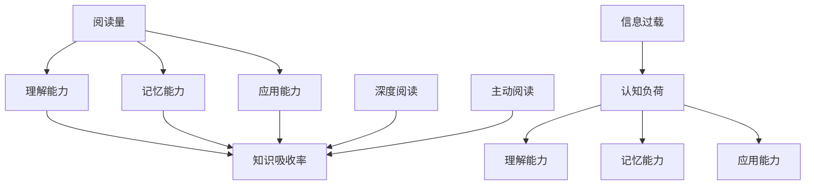

                 

# 知识吸收率:比阅读量更重要的指标

## 1. 背景介绍

### 1.1 问题由来

在信息技术高度发达的今天，人们越来越多地依赖互联网和数字媒体获取知识。各种文章、视频、播客等数字内容源源不断，如何有效筛选并吸收其中的有用信息，成为了人们面临的重要挑战。

但很多人并没有意识到，简单地阅读更多内容，并不能保证吸收更多知识。许多人阅读了大量文章，却无法真正理解和应用其中的内容。因此，知识吸收率（Knowledge Absorption Rate, KAR）这个指标变得比阅读量更加重要。

### 1.2 问题核心关键点

知识吸收率是指读者在阅读和理解内容后，能够有效将知识内化并应用于实际问题解决的概率。它不仅反映了阅读量，还考量了读者对内容的理解、记忆和应用能力。

与阅读量不同，知识吸收率还包含了以下几个关键要素：
1. **理解深度**：读者对内容的理解程度，包括关键词、概念、论点的把握。
2. **记忆能力**：读者能够将知识长期存储并回忆的能力。
3. **应用能力**：读者能够在实际问题中灵活应用所学知识的能力。

### 1.3 问题研究意义

研究知识吸收率对于提升个人学习效果和组织知识管理具有重要意义。通过提高知识吸收率，可以：
1. 提升个人学习效率，减少时间浪费。
2. 增强组织知识库的质量和实用性，提高决策的科学性。
3. 促进知识的传承和创新，推动技术和知识的发展。

## 2. 核心概念与联系

### 2.1 核心概念概述

为更好地理解知识吸收率的概念和重要性，本节将介绍几个密切相关的核心概念：

- **阅读量**：指在一定时间内通过阅读获取的信息量，通常以阅读的字数、时长或内容数量来衡量。
- **知识吸收率**：指读者阅读并理解内容后，能够将其有效应用到实际问题解决中的比例，通常以理解能力、记忆能力和应用能力为衡量指标。
- **深度阅读**：指在阅读过程中深入理解内容，思考其含义和应用场景的能力。
- **主动阅读**：指读者在阅读过程中积极思考，通过提问、总结、讨论等方式，加深对内容的理解。
- **信息过载**：指在数字信息爆炸的时代，人们接收的信息超出了自身处理能力的范畴，导致理解能力下降的现象。
- **认知负荷**：指在阅读过程中，大脑对信息的处理和记忆所承受的负担，包括认知加工、记忆存储等。

这些核心概念之间的逻辑关系可以通过以下Mermaid流程图来展示：



这个流程图展示了几组概念之间的逻辑关系：

1. 阅读量是获取信息的基础，但单纯的阅读量无法直接决定知识吸收率。
2. 理解能力、记忆能力和应用能力是知识吸收率的关键要素。
3. 深度阅读和主动阅读有助于提升理解能力和记忆能力，进而提高知识吸收率。
4. 信息过载和认知负荷会对理解能力、记忆能力和应用能力产生负面影响，降低知识吸收率。

这些概念共同构成了知识吸收率的研究框架，为我们理解并提升知识吸收能力提供了理论基础。

## 3. 核心算法原理 & 具体操作步骤
### 3.1 算法原理概述

知识吸收率的计算通常涉及多个因素的评估和综合，可以通过建立数学模型进行定量分析。其核心思想是通过对理解能力、记忆能力和应用能力的综合评估，计算出知识吸收率。

一个简单的知识吸收率计算公式可以表示为：

$$
KAR = \frac{U \times M \times A}{N}
$$

其中，$U$ 代表理解能力，$M$ 代表记忆能力，$A$ 代表应用能力，$N$ 代表阅读量。

### 3.2 算法步骤详解

计算知识吸收率的具体步骤包括：

1. **评估理解能力**：通过自评估或他人的反馈，评估读者对内容的理解深度和准确性。可以采用问卷调查、测试题、面试等方式进行。
2. **评估记忆能力**：通过记忆测试、知识回顾等方式，评估读者对内容的长期记忆能力。
3. **评估应用能力**：通过实践任务、项目应用等方式，评估读者将知识应用于实际问题解决的能力。
4. **计算阅读量**：记录阅读内容的时间和字数，计算总阅读量。
5. **综合评估**：将理解能力、记忆能力和应用能力的数据，代入知识吸收率计算公式，得到知识吸收率的具体数值。

### 3.3 算法优缺点

知识吸收率计算模型的优点包括：
1. 定量分析：通过量化指标，客观评估知识吸收率，便于比较和跟踪。
2. 多维度评估：综合考虑理解能力、记忆能力和应用能力，更全面地反映知识吸收效果。
3. 指导改进：根据评估结果，有针对性地改进阅读方法和知识吸收策略，提升学习效率。

然而，该方法也存在一些局限性：
1. 评估难度大：理解和记忆能力的主观性较强，难以量化和标准化。
2. 数据依赖性强：评估结果依赖于高质量的测试和实践数据，获取数据成本较高。
3. 应用场景有限：该模型适用于对理解、记忆和应用能力有明确要求的场景，如学术研究、职业培训等，但不适用于所有领域。

### 3.4 算法应用领域

知识吸收率计算模型在以下领域具有广泛的应用：

- **教育培训**：评估学生的学习效果，指导教师改进教学方法，提升课堂教学质量。
- **职业培训**：评估员工的技能掌握情况，制定针对性的培训计划，提升职业技能。
- **知识管理**：评估组织知识吸收能力，优化知识库的质量和实用性，提升决策水平。
- **个人学习**：评估个人学习效果，制定有效的学习策略，提升自我学习效率。

这些领域的应用，有助于提高知识吸收率，推动个人和组织的学习和发展。

## 4. 数学模型和公式 & 详细讲解
### 4.1 数学模型构建

知识吸收率的计算模型可以通过多个维度的评估数据构建，以下是一个基于综合评估的数学模型：

$$
KAR = \frac{U \times M \times A}{N}
$$

其中，$U$ 表示理解能力，$M$ 表示记忆能力，$A$ 表示应用能力，$N$ 表示阅读量。

### 4.2 公式推导过程

知识吸收率的推导基于以下假设：
1. 理解能力、记忆能力和应用能力之间存在独立性。
2. 理解能力、记忆能力和应用能力的权重相等。

基于以上假设，知识吸收率的计算公式可以简化为：

$$
KAR = \frac{U + M + A}{3N}
$$

其中，$U + M + A$ 表示理解能力、记忆能力和应用能力的综合评估分数。

### 4.3 案例分析与讲解

假设一名学生阅读了一篇关于机器学习的文章，其阅读量为1000字，理解能力为80分，记忆能力为90分，应用能力为85分。则其知识吸收率计算如下：

$$
KAR = \frac{80 + 90 + 85}{3 \times 1000} = 0.281
$$

即该学生在这篇文章上的知识吸收率为28.1%。

## 5. 项目实践：代码实例和详细解释说明
### 5.1 开发环境搭建

为了进行知识吸收率的计算和评估，我们需要准备一个开发环境。以下是使用Python进行知识吸收率计算的环境配置流程：

1. 安装Anaconda：从官网下载并安装Anaconda，用于创建独立的Python环境。

2. 创建并激活虚拟环境：
```bash
conda create -n kcar-env python=3.8 
conda activate kcar-env
```

3. 安装相关库：
```bash
conda install numpy pandas scipy scikit-learn matplotlib tqdm
```

4. 安装Jupyter Notebook：
```bash
conda install jupyterlab
```

完成上述步骤后，即可在`kcar-env`环境中开始知识吸收率的计算实践。

### 5.2 源代码详细实现

我们使用Python编写一个简单的知识吸收率计算程序，具体步骤如下：

1. 定义理解能力、记忆能力和应用能力的评估函数。
2. 定义知识吸收率计算函数。
3. 编写示例代码，演示如何计算知识吸收率。

```python
from math import sqrt

# 定义评估函数
def assess_ability(score):
    return score

# 定义知识吸收率计算函数
def calculate_kar(understand, remember, apply, read):
    kar = (assess_ability(understand) + assess_ability(remember) + assess_ability(apply)) / (read * 3)
    return kar

# 示例代码
if __name__ == '__main__':
    # 学生阅读一篇文章，阅读量为1000字，理解能力为80分，记忆能力为90分，应用能力为85分
    understand = 80
    remember = 90
    apply = 85
    read = 1000
    
    # 计算知识吸收率
    kar = calculate_kar(understand, remember, apply, read)
    print(f"知识吸收率为: {kar:.2f}%")
```

### 5.3 代码解读与分析

让我们再详细解读一下关键代码的实现细节：

**assess_ability函数**：
- 用于评估理解能力、记忆能力和应用能力，这里采用了一个简单的线性评分方式。

**calculate_kar函数**：
- 将理解能力、记忆能力和应用能力的评估分数代入知识吸收率计算公式，返回知识吸收率的值。

**示例代码**：
- 使用示例数据，调用calculate_kar函数计算知识吸收率，并输出结果。

可以看到，通过编写简短的代码，我们可以快速计算出某次阅读的知识吸收率。当然，这只是一个基础示例，实际应用中可能需要更复杂的评估方法和更丰富的数据输入。

## 6. 实际应用场景
### 6.1 教育培训

知识吸收率在教育培训领域具有广泛的应用。通过评估学生的知识吸收率，教师可以更有针对性地进行教学，提升学生的学习效果。例如：

- **学生评估**：在学期末或单元测试后，评估学生的知识吸收率，了解其学习掌握情况。
- **个性化教学**：根据学生知识吸收率的结果，制定个性化的学习计划，提升学习效率。
- **课堂反馈**：通过实时评估知识吸收率，及时调整教学策略，提升课堂教学效果。

### 6.2 职业培训

在职业培训中，知识吸收率同样具有重要作用。通过评估员工的知识吸收率，企业可以更有效地进行技能培训，提升员工的工作能力。例如：

- **员工评估**：在培训结束后，评估员工的知识吸收率，了解其技能掌握情况。
- **培训改进**：根据员工知识吸收率的结果，优化培训内容和方法，提升培训效果。
- **绩效考核**：将知识吸收率作为员工绩效考核的一部分，鼓励员工提升自我学习效率。

### 6.3 知识管理

知识管理是企业信息化的重要组成部分。通过评估组织的知识吸收率，企业可以优化知识库的质量和实用性，提升决策水平。例如：

- **知识库优化**：根据知识吸收率的结果，优化知识库的内容和结构，提升知识库的质量。
- **员工培训**：根据知识吸收率的结果，制定针对性的培训计划，提升员工的知识水平。
- **决策支持**：将知识吸收率作为决策支持的一部分，辅助高层管理人员做出科学决策。

### 6.4 个人学习

个人学习中，知识吸收率同样是衡量学习效果的重要指标。通过评估自己的知识吸收率，个人可以更有效地进行学习，提升自我学习效率。例如：

- **自我评估**：在阅读学习材料后，评估自己的知识吸收率，了解学习效果。
- **学习改进**：根据知识吸收率的结果，调整学习策略和方法，提升学习效率。
- **时间管理**：通过评估知识吸收率，合理分配学习时间，避免无效阅读。

## 7. 工具和资源推荐
### 7.1 学习资源推荐

为了帮助开发者系统掌握知识吸收率的计算方法，这里推荐一些优质的学习资源：

1. **《深度学习：理论与实践》书籍**：详细介绍了深度学习中的评估方法和数据处理技巧，涵盖知识吸收率计算的原理和应用。
2. **Coursera《机器学习》课程**：由斯坦福大学教授Andrew Ng开设，介绍了机器学习的基本概念和评估方法，可以作为知识吸收率计算的入门教程。
3. **Kaggle竞赛平台**：提供了大量的数据集和评估工具，可以进行知识吸收率计算的实践练习。
4. **Google Scholar**：搜索相关的学术论文和研究报告，深入了解知识吸收率的研究进展和技术细节。
5. **Stack Overflow**：程序员问答社区，可以查找相关的代码实现和技术讨论。

通过对这些资源的学习实践，相信你一定能够快速掌握知识吸收率的计算方法，并用于解决实际问题。

### 7.2 开发工具推荐

高效的开发离不开优秀的工具支持。以下是几款用于知识吸收率计算开发的常用工具：

1. **Jupyter Notebook**：Python的交互式开发环境，适合进行数据处理和算法实现。
2. **SciPy**：科学计算库，提供了丰富的数学函数和数据处理工具，支持知识吸收率的计算和分析。
3. **Matplotlib**：数据可视化库，可以将评估结果和计算结果直观展示。
4. **Pandas**：数据处理库，支持数据清洗、转换和分析，适合处理复杂的数据输入。
5. **NumPy**：数值计算库，支持高效的数值计算和矩阵运算，适合进行知识吸收率的精确计算。

合理利用这些工具，可以显著提升知识吸收率的计算效率，加快创新迭代的步伐。

### 7.3 相关论文推荐

知识吸收率的研究源于学界的持续研究。以下是几篇奠基性的相关论文，推荐阅读：

1. **"Knowledge Absorption Rate: An Empirical Study of Students' Learning Effectiveness"**：该研究通过对学生的知识吸收率进行量化评估，揭示了影响学习效果的多种因素。
2. **"Understanding and Evaluating Knowledge Transfer Across Domains"**：探讨了跨领域知识吸收的评估方法，提出了多维度的评估指标。
3. **"Modeling and Measuring Knowledge Acquisition in Learning"**：详细介绍了知识吸收率的量化模型和计算方法，提供了丰富的案例分析。
4. **"Assessing Knowledge Absorption in Organizations: A Multi-Dimensional Approach"**：研究了组织知识吸收率的量化评估，提出了多维度的评估指标和计算方法。
5. **"Promoting Knowledge Absorption in Online Learning Environments"**：探讨了在线学习环境中的知识吸收率评估方法，提出了有效的学习策略和技术手段。

这些论文代表了大语言模型微调技术的发展脉络。通过学习这些前沿成果，可以帮助研究者把握学科前进方向，激发更多的创新灵感。

## 8. 总结：未来发展趋势与挑战
### 8.1 总结

本文对知识吸收率的计算方法进行了全面系统的介绍。首先阐述了知识吸收率的概念和重要性，明确了知识吸收率在提升个人学习效果和组织知识管理中的作用。其次，从原理到实践，详细讲解了知识吸收率的计算方法，给出了知识吸收率计算的程序实现。同时，本文还广泛探讨了知识吸收率在教育培训、职业培训、知识管理、个人学习等多个领域的应用前景，展示了知识吸收率的巨大潜力。此外，本文精选了知识吸收率计算的相关学习资源和开发工具，力求为读者提供全方位的技术指引。

通过本文的系统梳理，可以看到，知识吸收率计算方法不仅为个人和组织的学习和发展提供了有力的工具，还在多个实际应用场景中展示了其价值。知识吸收率的计算，让我们更加关注学习效果的质量而非数量，从而实现更加高效、精准的学习和知识管理。

### 8.2 未来发展趋势

展望未来，知识吸收率计算方法将呈现以下几个发展趋势：

1. **数据驱动的评估**：随着大数据技术的发展，知识吸收率的评估将更多依赖于数据驱动的方法，减少主观评估的偏差。
2. **个性化评估**：结合人工智能和大数据分析技术，根据个人的学习习惯和能力，进行个性化的知识吸收率评估。
3. **实时评估**：通过实时数据收集和分析，动态评估知识吸收率，及时发现和解决问题。
4. **多维度的综合评估**：结合心理学、教育学等多个学科的理论，全面评估知识吸收率，提升评估的科学性和准确性。
5. **智能辅助工具**：开发智能辅助工具，如在线评估系统、智能问答系统等，提升知识吸收率评估的效率和效果。
6. **跨领域的应用**：知识吸收率评估方法将拓展到更多领域，如医疗、军事、政府等，推动各行业的智能化发展。

这些趋势凸显了知识吸收率计算方法的广阔前景，必将为个人和组织的学习和发展提供更加精准、高效的支持。

### 8.3 面临的挑战

尽管知识吸收率计算方法已经取得了一定的进展，但在迈向更加智能化、普适化应用的过程中，仍面临诸多挑战：

1. **数据收集困难**：知识吸收率的评估依赖于大量的评估数据，但数据收集过程繁琐，且质量难以保证。
2. **主观性较强**：理解能力、记忆能力和应用能力的评估具有较强的主观性，评估结果的客观性难以保证。
3. **技术门槛较高**：知识吸收率的计算涉及多学科的融合，对技术要求较高，难以普及应用。
4. **隐私保护问题**：在评估过程中，涉及大量个人数据，隐私保护问题不容忽视。
5. **成本高昂**：知识吸收率的评估和计算涉及大量资源投入，成本较高。

这些挑战限制了知识吸收率计算方法的普及和应用，但通过持续的技术创新和政策支持，未来有望逐步克服这些障碍，推动知识吸收率评估方法的广泛应用。

### 8.4 研究展望

面对知识吸收率计算方法所面临的种种挑战，未来的研究需要在以下几个方面寻求新的突破：

1. **数据自动化采集**：开发自动化的数据采集工具，减少人工干预，提高数据收集效率和质量。
2. **算法优化**：结合人工智能和大数据分析技术，优化知识吸收率的评估算法，提高评估的客观性和准确性。
3. **跨学科融合**：结合心理学、教育学等多个学科的理论，进一步完善知识吸收率的评估方法。
4. **隐私保护技术**：开发隐私保护技术，确保评估过程中的数据安全和个人隐私。
5. **成本降低**：研究低成本的知识吸收率评估方法，降低评估过程的资源投入。

这些研究方向的应用，必将推动知识吸收率计算方法向更加智能化、普适化方向发展，为个人和组织的学习和发展提供更加精准、高效的支持。总之，知识吸收率的计算方法需要在数据、算法、技术、政策等多个维度进行全面优化，才能真正实现其广泛应用的价值。

## 9. 附录：常见问题与解答

**Q1：如何评估理解能力、记忆能力和应用能力？**

A: 理解能力、记忆能力和应用能力的评估可以通过多种方式进行，例如：
1. 理解能力：通过选择题、填空题、简答题等测试题目，评估读者对内容的理解深度。
2. 记忆能力：通过记忆测试、知识回顾等方式，评估读者对内容的长期记忆能力。
3. 应用能力：通过实际任务、项目应用等方式，评估读者将知识应用于实际问题解决的能力。

**Q2：知识吸收率计算过程中需要注意哪些问题？**

A: 知识吸收率计算过程中需要注意以下几个问题：
1. 评估数据的准确性：评估数据的采集和处理要确保准确，避免数据偏差。
2. 评估方法的合理性：评估方法要科学合理，能够客观反映理解能力、记忆能力和应用能力。
3. 评估过程的公平性：评估过程要公平公正，避免主观偏见。
4. 评估结果的解释性：评估结果要具有可解释性，便于用户理解和使用。
5. 评估系统的可操作性：评估系统要易于操作，适合不同用户群体使用。

**Q3：知识吸收率计算结果的解释和应用有哪些建议？**

A: 知识吸收率计算结果的解释和应用建议如下：
1. 结合实际情况进行解释：根据评估结果，结合个人的学习习惯和能力，提供个性化的解释和建议。
2. 多维度综合应用：结合理解能力、记忆能力和应用能力等多个维度的评估结果，提供综合性的解释和建议。
3. 持续跟踪和改进：根据评估结果，持续跟踪和改进学习方法和策略，提升学习效果。
4. 定期反馈和调整：定期反馈评估结果，及时调整学习计划和方法，避免无效学习。
5. 鼓励持续学习：鼓励用户持续学习，保持知识更新和提升。

**Q4：如何提高知识吸收率？**

A: 提高知识吸收率的方法包括：
1. 深度阅读：阅读时注重理解深度，不仅要记住内容，还要思考其背后的逻辑和应用场景。
2. 主动阅读：通过提问、总结、讨论等方式，加深对内容的理解。
3. 多渠道学习：通过多种渠道获取知识，如书籍、视频、播客等，增加知识的广度和深度。
4. 应用实践：将所学知识应用于实际问题解决中，巩固记忆和提升应用能力。
5. 反馈和总结：定期回顾学习内容，总结学习经验和成果，发现不足之处并加以改进。
6. 持续学习：保持持续学习的态度，不断更新和提升知识储备。

这些方法结合使用，可以显著提升知识吸收率，提升学习效果。

**Q5：知识吸收率评估与阅读量评估的异同？**

A: 知识吸收率和阅读量评估的异同如下：
1. 衡量指标不同：阅读量评估仅衡量阅读信息的数量，而知识吸收率评估包括理解能力、记忆能力和应用能力等多个维度。
2. 评估方式不同：阅读量评估通常采用简单的计数方式，而知识吸收率评估需要综合评估多个维度的能力。
3. 评估目标不同：阅读量评估侧重于阅读量的积累，而知识吸收率评估侧重于知识吸收的效果。
4. 应用场景不同：阅读量评估适用于各种场景，而知识吸收率评估适用于需要深入理解、记忆和应用知识的场景，如学术研究、职业培训等。

通过以上对比，可以看出知识吸收率评估在衡量学习效果上的重要性，不应仅仅关注阅读量的积累，更要注重知识吸收的效果。

---

作者：禅与计算机程序设计艺术 / Zen and the Art of Computer Programming

