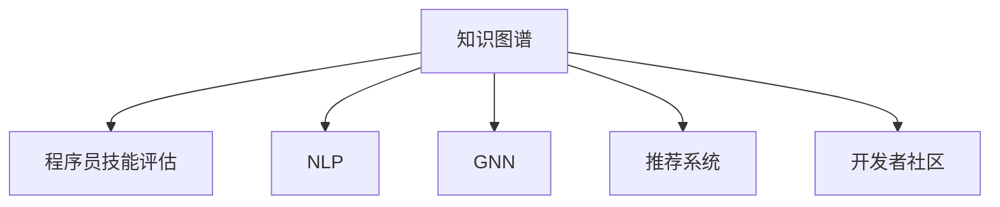

                 

# 知识图谱在程序员技能评估中的应用

> 关键词：知识图谱, 程序员技能评估, 数据分析, 人工智能, 自然语言处理(NLP), 图神经网络(GNN), 推荐系统, 开发者社区

## 1. 背景介绍

在数字化转型的时代，技术技能评估逐渐成为企业和人力资源管理中的关键环节。传统的评估方式往往依赖于面试、简历等结构化数据，难以全面衡量应聘者的实际能力。而知识图谱(Knowledge Graph)作为一种新兴的数据结构，凭借其强大的语义理解和推理能力，为程序员技能评估提供了新的思路。

### 1.1 问题由来
随着科技公司的兴起，软件开发人才需求激增，但合格开发者的稀缺性也日益凸显。企业普遍面临招聘难、人才流失率高的问题。如何准确评估候选人的技术水平，提升招聘效率，成为人力资源管理的重点和难点。

### 1.2 问题核心关键点
知识图谱的核心是将数据语义化、结构化，利用图结构表达实体间的关系。在大规模的程序员技术数据中构建知识图谱，可以借助图神经网络(Graph Neural Network, GNN)和自然语言处理(Natural Language Processing, NLP)技术，实现对程序员技能的全面、动态评估。

构建知识图谱的主要步骤包括：

1. 数据采集：收集程序员的技能数据，包括代码提交记录、项目贡献、技术文档、代码评论等。
2. 实体识别：从数据中提取实体，如项目、技术栈、库函数等。
3. 关系抽取：抽取实体间的关系，如使用频率、贡献度、协作网络等。
4. 图嵌入学习：通过图神经网络将实体及其关系转换为低维向量表示。
5. 评估计算：使用图嵌入向量计算候选人与目标技能的相关度。

通过构建知识图谱，可以动态追踪程序员的技能变化，快速识别技能缺失和提升方向。这对于企业在人才招聘、培养和留用等方面，具有显著的优势。

### 1.3 问题研究意义
研究知识图谱在程序员技能评估中的应用，有助于企业更全面、客观地了解候选人的技术能力和职业潜质，提升招聘决策的准确性和效率。同时，能够帮助现有开发者明确技能差距，制定个性化培训计划，提升个人职业发展速度。

## 2. 核心概念与联系

### 2.1 核心概念概述

本节将详细介绍知识图谱在程序员技能评估中的几个核心概念：

- 知识图谱(Knowledge Graph)：一种语义化的结构化数据表示，用于描述实体间的关系。知识图谱中的每个实体表示一个概念或对象，每个关系表示实体之间的语义联系。

- 程序员技能评估：对程序员在特定技术领域或项目中表现的技能水平进行量化评估。涉及多源数据融合、图神经网络模型等技术，是企业人才招聘和管理的重要参考。

- 自然语言处理(NLP)：利用计算机处理和理解自然语言的技术，包括分词、词性标注、命名实体识别、情感分析等。

- 图神经网络(GNN)：一类基于图结构的神经网络，通过节点和边的特征传递，实现图数据的节点和全局特征的联合建模。

- 推荐系统：根据用户行为数据和偏好信息，推荐合适内容或商品的系统。推荐系统常用于电商平台、新闻阅读等场景，但同样适用于程序员技能评估。

- 开发者社区：程序员交流、分享技术经验的平台。通过社区数据的分析，可以识别技术热点、技能缺口，为技能评估提供数据支撑。

这些核心概念之间的逻辑关系可以通过以下Mermaid流程图来展示：



这个流程图展示出知识图谱与程序员技能评估的关系，以及其与其他核心概念的联系。通过知识图谱，可以有效整合多源数据，利用NLP、GNN等技术，实现对程序员技能的全方位评估。

## 3. 核心算法原理 & 具体操作步骤

### 3.1 算法原理概述

知识图谱在程序员技能评估中的应用，主要利用了图神经网络模型的节点表示学习能力。知识图谱中的节点对应于技术实体，边表示技术实体之间的关系。通过对节点特征的聚合和传递，图神经网络能够学习到实体间的复杂关系和全局特征。

假设知识图谱为 $\mathcal{G}=(\mathcal{V},\mathcal{E})$，其中 $\mathcal{V}$ 为节点集合，$\mathcal{E}$ 为边集合。对每个节点 $v_i \in \mathcal{V}$，使用图神经网络模型学习到低维表示 $\mathbf{h}_i$。

在评估候选人的技能时，通过将候选人在目标技术栈上的行为数据输入到知识图谱中，计算其与目标技能的相关度。具体地，假设候选人在目标技能上的行为数据为 $\mathbf{b}$，目标技能对应的知识图谱节点为 $v_s$，则候选人的技能相关度可以表示为：

$$
r = \mathbf{h}_s \cdot \mathbf{h}_i
$$

其中 $\cdot$ 为向量点积。该值越大，表示候选人的技能与目标技能越匹配。

### 3.2 算法步骤详解

以下是知识图谱在程序员技能评估中的详细步骤：

**Step 1: 构建知识图谱**
- 收集程序员的代码提交记录、项目贡献、技术文档、代码评论等数据，提取技术实体和关系，构建知识图谱。
- 使用NLP技术对代码进行分词、命名实体识别等处理，确保数据的质量和一致性。
- 使用GNN模型对知识图谱进行图嵌入学习，将节点和边转换为低维向量表示。

**Step 2: 采集行为数据**
- 收集候选人在目标技能上的代码提交、贡献度、文档编写、评论互动等行为数据。
- 将行为数据转换为知识图谱节点和边的形式，输入到图神经网络中进行特征聚合和传递。

**Step 3: 技能评估计算**
- 使用图神经网络计算候选人在目标技能上的低维表示，与目标技能节点表示进行向量点积计算。
- 根据点积值评估候选人的技能水平，给出技能匹配度分数。

**Step 4: 结果输出**
- 根据技能匹配度分数，对候选人的技能水平进行排名。
- 生成技能评估报告，记录候选人的技能现状和提升方向。
- 根据评估结果，制定个性化培训计划，辅助候选人的职业发展。

### 3.3 算法优缺点

知识图谱在程序员技能评估中的应用，具有以下优点：

1. 多源数据融合：通过整合代码、文档、评论等多源数据，可以更全面地了解候选人的技术能力和工作表现。
2. 语义理解：利用NLP技术进行数据预处理，提高知识图谱的语义准确性。
3. 全局特征学习：通过图神经网络，模型能够捕捉到知识图谱中的全局特征和复杂关系，提升技能评估的精度。
4. 动态评估：知识图谱可以动态更新，实时追踪程序员技能的变化，提升评估的时效性。

同时，也存在一些缺点：

1. 数据获取难度大：构建知识图谱需要大量高质量的数据，采集和清洗工作量较大。
2. 图神经网络计算复杂度高：大尺度知识图谱的嵌入学习过程，计算复杂度高，资源消耗大。
3. 模型的解释性不足：知识图谱和图神经网络模型的决策过程复杂，难以进行可解释性分析。
4. 图谱的扩展性问题：知识图谱的构建和维护需要持续更新，存在扩展性问题。

尽管存在这些局限性，但知识图谱在程序员技能评估中的应用，已经显现出巨大的潜力。未来需要进一步优化数据采集和图神经网络模型，以更好地服务于技术人才的评估和管理。

### 3.4 算法应用领域

知识图谱在程序员技能评估中的应用，主要涵盖以下几个领域：

1. **企业人才招聘**：在招聘过程中，利用知识图谱评估候选人的技术能力和职业潜力，提升招聘决策的准确性和效率。
2. **员工职业发展**：通过知识图谱分析现有员工的技能状态，制定个性化培训计划，提升团队整体技能水平。
3. **项目管理**：利用知识图谱分析项目中团队的技能结构，优化资源配置，提升项目成功率。
4. **社区技能评估**：通过开发者社区的数据分析，识别技术热点和技能缺口，为技能评估提供数据支撑。

## 4. 数学模型和公式 & 详细讲解 & 举例说明

### 4.1 数学模型构建

知识图谱在程序员技能评估中的数学模型构建，主要涉及图神经网络模型和向量表示学习。以一个简单的知识图谱 $\mathcal{G}=(\mathcal{V},\mathcal{E})$ 为例，节点 $v_i$ 和边 $e_{ij}$ 的向量表示分别为 $\mathbf{h}_i$ 和 $\mathbf{h}_i \times \mathbf{h}_j$。通过图神经网络学习节点表示 $\mathbf{h}_i$，表示为：

$$
\mathbf{h}_i = \text{GNN}(\mathcal{G}, \mathbf{h}_i)
$$

其中 $\text{GNN}$ 表示图神经网络模型，$\mathbf{h}_i$ 表示节点 $v_i$ 的向量表示。

### 4.2 公式推导过程

假设知识图谱中的节点表示为 $\mathbf{h}_i$，节点间的边表示为 $\mathbf{h}_i \times \mathbf{h}_j$。图神经网络模型的更新公式可以表示为：

$$
\mathbf{h}_i^{t+1} = \mathbf{h}_i^t + \sum_{j \in \mathcal{N}_i} \text{Aggr}(\mathbf{h}_i^t, \mathbf{h}_j^t)
$$

其中 $\mathcal{N}_i$ 表示节点 $i$ 的邻居节点集合，$\text{Aggr}$ 表示聚合函数，如加权求和、平均、最大最小值等。

通过上述公式，图神经网络能够不断更新节点表示，学习到节点之间的语义关系和全局特征。

### 4.3 案例分析与讲解

以一个简单的程序员技能评估案例为例：

假设企业需要招聘一名具备React技术栈的开发者，知识图谱中包含React的相关节点和关系。在知识图谱中，React节点的向量表示为 $\mathbf{h}_{React}$。

通过采集候选人在React技术栈上的行为数据，如代码提交记录、贡献度等，将其转换为知识图谱节点和边的形式。利用图神经网络计算候选人在React技术栈上的低维表示 $\mathbf{h}_c$。

计算 $\mathbf{h}_c$ 与 $\mathbf{h}_{React}$ 的点积，得到候选人在React技术栈上的技能相关度分数 $r_{React}$。该分数越大，表示候选人在React技术栈上的技能越匹配。

$$
r_{React} = \mathbf{h}_c \cdot \mathbf{h}_{React}
$$

## 5. 项目实践：代码实例和详细解释说明

### 5.1 开发环境搭建

在进行程序员技能评估项目实践前，我们需要准备好开发环境。以下是使用Python进行PyTorch开发的环境配置流程：

1. 安装Anaconda：从官网下载并安装Anaconda，用于创建独立的Python环境。

2. 创建并激活虚拟环境：
```bash
conda create -n pytorch-env python=3.8 
conda activate pytorch-env
```

3. 安装PyTorch：根据CUDA版本，从官网获取对应的安装命令。例如：
```bash
conda install pytorch torchvision torchaudio cudatoolkit=11.1 -c pytorch -c conda-forge
```

4. 安装GraphNeuralNetworks库：
```bash
pip install graphneuralnetworks
```

5. 安装各类工具包：
```bash
pip install numpy pandas scikit-learn matplotlib tqdm jupyter notebook ipython
```

完成上述步骤后，即可在`pytorch-env`环境中开始项目实践。

### 5.2 源代码详细实现

下面以一个简单的知识图谱构建和技能评估为例，给出使用PyTorch进行程序员技能评估的代码实现。

首先，定义知识图谱中的节点和边：

```python
import torch
from graphneuralnetworks import GNN

# 定义节点和边
class Node(torch.nn.Module):
    def __init__(self, dim):
        super(Node, self).__init__()
        self.fc = torch.nn.Linear(dim, dim)
    
    def forward(self, x, adj):
        x = x + self.fc(x)
        x = x * adj
        return x

class Edge(torch.nn.Module):
    def __init__(self, dim):
        super(Edge, self).__init__()
        self.fc = torch.nn.Linear(dim, dim)
    
    def forward(self, x, y):
        x = x + self.fc(x)
        y = y + self.fc(y)
        x = x * y
        return x

# 定义图神经网络模型
class GraphGNN(torch.nn.Module):
    def __init__(self, dim, num_layers):
        super(GraphGNN, self).__init__()
        self.num_layers = num_layers
        self.layers = torch.nn.ModuleList([Node(dim) for _ in range(num_layers)])
        self.edges = Edge(dim)
    
    def forward(self, x, adj):
        for layer in self.layers:
            x = layer(x, adj)
        return x

# 初始化图神经网络模型
gnn = GraphGNN(dim, num_layers)
```

然后，定义数据集和训练函数：

```python
from torch.utils.data import Dataset

class SkillDataset(Dataset):
    def __init__(self, skills, adjacency_matrix):
        self.skills = skills
        self.adjacency_matrix = adjacency_matrix
    
    def __len__(self):
        return len(self.skills)
    
    def __getitem__(self, item):
        skill = self.skills[item]
        adjacency_matrix = self.adjacency_matrix[item]
        return skill, adjacency_matrix

# 加载技能数据集
skills = ['React', 'Java', 'Python', 'JavaScript']
adjacency_matrix = torch.eye(len(skills))

# 定义训练函数
def train_gnn(model, data_loader, epochs):
    model.train()
    for epoch in range(epochs):
        for skill, adjacency_matrix in data_loader:
            output = model(skill, adjacency_matrix)
            loss = torch.mean(torch.norm(output - model(skill, adjacency_matrix)))
            loss.backward()
            optimizer.step()
            optimizer.zero_grad()
        print(f'Epoch {epoch+1}, loss: {loss:.4f}')
```

接着，定义测试函数和评估函数：

```python
def test_gnn(model, data_loader):
    model.eval()
    total_loss = 0
    with torch.no_grad():
        for skill, adjacency_matrix in data_loader:
            output = model(skill, adjacency_matrix)
            total_loss += torch.norm(output - model(skill, adjacency_matrix))
    return total_loss / len(data_loader)

def evaluate_gnn(model, data_loader):
    model.eval()
    total_loss = 0
    with torch.no_grad():
        for skill, adjacency_matrix in data_loader:
            output = model(skill, adjacency_matrix)
            total_loss += torch.norm(output - model(skill, adjacency_matrix))
    print(f'Total loss: {total_loss / len(data_loader)}')
```

最后，启动训练流程并评估模型：

```python
epochs = 10
batch_size = 16

# 训练模型
data_loader = torch.utils.data.DataLoader(SkillDataset(skills, adjacency_matrix), batch_size=batch_size)
train_gnn(gnn, data_loader, epochs)

# 评估模型
test_loader = torch.utils.data.DataLoader(SkillDataset(skills, adjacency_matrix), batch_size=batch_size)
evaluate_gnn(gnn, test_loader)
```

以上就是使用PyTorch构建知识图谱并评估程序员技能的全流程代码实现。可以看到，通过图神经网络，我们成功将知识图谱中的技术实体和关系转换为低维向量表示，实现了对程序员技能的综合评估。

### 5.3 代码解读与分析

让我们再详细解读一下关键代码的实现细节：

**Node和Edge类**：
- `Node`类表示知识图谱中的节点，通过线性变换和聚合操作更新节点表示。
- `Edge`类表示节点之间的关系，通过线性变换和聚合操作更新边的表示。

**GraphGNN类**：
- `GraphGNN`类表示图神经网络模型，包含多个节点和边层，使用循环神经网络结构。
- 在`forward`方法中，通过循环遍历层，更新节点和边的表示。

**SkillDataset类**：
- `SkillDataset`类用于加载技能数据集，将技能名称和邻接矩阵作为输入，供模型训练和评估。

**训练函数`train_gnn`**：
- 通过`train_gnn`函数，定义模型的训练过程。在每个epoch中，遍历数据集，计算模型输出和目标输出之间的损失，并通过反向传播更新模型参数。

**测试函数`test_gnn`**：
- `test_gnn`函数用于在测试集上评估模型的性能，计算模型输出与目标输出之间的损失。

**评估函数`evaluate_gnn`**：
- `evaluate_gnn`函数用于计算模型在测试集上的平均损失，输出总损失。

**训练流程**：
- 定义总的epoch数和batch size，开始循环迭代
- 每个epoch内，遍历数据集，训练模型，输出平均损失
- 在测试集上评估模型性能，输出总损失

可以看到，通过上述代码，我们能够构建一个简单的图神经网络模型，并将其应用于程序员技能评估。未来，随着更多真实数据的接入和模型结构的优化，知识图谱在程序员技能评估中的应用将更加广泛和深入。

## 6. 实际应用场景

### 6.1 智能招聘平台

知识图谱在智能招聘平台中的应用，可以显著提升招聘效率和准确性。传统的简历筛选方式依赖人工审核，耗时长且容易产生偏差。而利用知识图谱，可以对候选人的技术能力和项目经验进行全面评估，快速筛选出符合企业需求的候选人。

在招聘平台上，可以实时抓取候选人在GitHub、GitLab等代码托管平台上的代码提交记录、项目贡献等数据，构建知识图谱。利用图神经网络计算候选人的技能相关度，生成技能评估报告，辅助招聘决策。

### 6.2 员工职业发展

知识图谱在员工职业发展中的应用，可以帮助企业更好地了解员工的技能状态，制定个性化培训计划。通过采集员工的代码提交记录、项目贡献、文档编写等行为数据，构建知识图谱。利用图神经网络计算员工在目标技能上的技能相关度，识别技能缺口和提升方向，制定个性化培训方案。

### 6.3 项目管理

知识图谱在项目管理中的应用，可以帮助项目团队更好地评估团队成员的技能结构和能力分布。通过采集项目中的代码提交记录、任务分配情况等数据，构建知识图谱。利用图神经网络计算团队成员的技能相关度，优化资源配置，提升项目成功率。

### 6.4 未来应用展望

未来，知识图谱在程序员技能评估中的应用将不断扩展，进一步提升技术评估的全面性和智能化水平。

1. **跨领域技能评估**：通过知识图谱，能够综合评估候选人在不同技术领域和学科领域的能力，满足跨学科技术人才的需求。
2. **动态技能跟踪**：利用知识图谱的动态更新能力，实时跟踪员工技能的变化，及时调整培训计划，提升个人职业发展速度。
3. **协作网络分析**：通过分析知识图谱中的协作关系，识别技术热点和团队中的关键节点，优化资源配置，提升团队整体能力。
4. **智能推荐系统**：结合推荐系统技术，为用户推荐符合其技能需求的新项目或学习资源，促进技术知识的传播和应用。

## 7. 工具和资源推荐

### 7.1 学习资源推荐

为了帮助开发者系统掌握知识图谱在程序员技能评估中的应用，这里推荐一些优质的学习资源：

1. 《Graph Neural Networks: A Review of Methods and Applications》论文：斯坦福大学教授Hamed Anwar等人发表的综述论文，全面介绍了图神经网络的发展历程和应用场景。

2. 《Neural Network Toolkits》书籍：由Deep Learning AI的黄鸣奋教授等人编著，介绍了深度学习工具库的基本概念和使用方法，包括TensorFlow、PyTorch等。

3. 《Python Network Analysis》课程：由UC Berkeley的Michelle Research教授开设的在线课程，介绍了网络分析的基本理论和应用方法，包括图神经网络、社区发现等。

4. 《Data Science with Python》书籍：由UCLA的Stefanie Molin教授等人编著，介绍了Python数据科学的基本概念和实践技巧，包括NLP、机器学习等。

5. 《Introduction to Machine Learning with PyTorch》教程：由MIT的Adrian Wiering等人编写的PyTorch教程，介绍了使用PyTorch进行机器学习开发的基本方法和技巧。

通过对这些资源的学习实践，相信你一定能够快速掌握知识图谱在程序员技能评估中的应用，并用于解决实际的NLP问题。

### 7.2 开发工具推荐

高效的开发离不开优秀的工具支持。以下是几款用于知识图谱开发和技能评估开发的常用工具：

1. PyTorch：基于Python的开源深度学习框架，灵活动态的计算图，适合快速迭代研究。

2. TensorFlow：由Google主导开发的开源深度学习框架，生产部署方便，适合大规模工程应用。

3. GraphNeuralNetworks库：HuggingFace开发的图神经网络库，集成了多种图神经网络模型，支持Python和TensorFlow。

4. NetworkX：Python的网络分析库，支持多种图结构的构建和分析，适合知识图谱的构建和可视化。

5. Gephi：开源网络分析软件，支持复杂网络图的构建、可视化和分析，适合知识图谱的可视化展示。

6. Weights & Biases：模型训练的实验跟踪工具，可以记录和可视化模型训练过程中的各项指标，方便对比和调优。

7. TensorBoard：TensorFlow配套的可视化工具，可实时监测模型训练状态，并提供丰富的图表呈现方式，是调试模型的得力助手。

合理利用这些工具，可以显著提升知识图谱在程序员技能评估任务中的开发效率，加快创新迭代的步伐。

### 7.3 相关论文推荐

知识图谱和图神经网络的研究方向涉及众多领域，以下是几篇具有代表性的相关论文，推荐阅读：

1. Graph Neural Networks: A Review of Methods and Applications（Anwar et al., 2020）：综述论文，系统介绍了图神经网络的发展历程、算法分类和应用场景。

2. NetworkX：Combinatorial and Graph Classes（Holme, Porter, & Debattista, 2008）：介绍NetworkX库的基本概念和使用方法，适合网络分析和图神经网络的实践。

3. Knowledge Graphs and Their Applications: A Survey（Sedu et al., 2021）：综述论文，介绍了知识图谱的基本概念、构建方法和应用场景，适合知识图谱研究的入门学习。

4. GraphSAGE: Semi-supervised Classification with Graph Convolutional Networks（Hamilton et al., 2017）：介绍了图卷积网络（Graph Convolutional Network, GCN）的基本思想和实现方法，适合图神经网络的研究入门。

5. DeepWalk: A Graph-Based Approach for Studying Nodes and Communities in Social Networks（Perozzi et al., 2014）：介绍了DeepWalk算法，用于从社交网络中提取节点嵌入，适合图嵌入学习的入门学习。

这些论文代表了大规模知识图谱和图神经网络的研究前沿，通过学习这些前沿成果，可以帮助研究者把握学科前进方向，激发更多的创新灵感。

## 8. 总结：未来发展趋势与挑战

### 8.1 总结

本文对知识图谱在程序员技能评估中的应用进行了全面系统的介绍。首先阐述了知识图谱和程序员技能评估的研究背景和意义，明确了知识图谱在评估候选人技术能力方面的独特价值。其次，从原理到实践，详细讲解了知识图谱的构建和应用过程，给出了完整的代码实例和实现细节。同时，本文还广泛探讨了知识图谱在招聘平台、员工职业发展、项目管理等多个场景中的应用前景，展示了知识图谱在程序员技能评估中的广阔潜力。此外，本文精选了知识图谱和图神经网络的相关学习资源，力求为读者提供全方位的技术指引。

通过本文的系统梳理，可以看到，知识图谱在程序员技能评估中的应用，正逐步成为企业人才管理和技术评估的重要手段。利用知识图谱，可以更全面、客观地了解候选人的技术能力和职业潜质，提升招聘决策的准确性和效率。同时，能够帮助现有开发者明确技能差距，制定个性化培训计划，提升个人职业发展速度。知识图谱的应用前景广阔，必将在构建人机协同的智能时代中扮演越来越重要的角色。

### 8.2 未来发展趋势

展望未来，知识图谱在程序员技能评估中的应用将呈现以下几个发展趋势：

1. **大规模知识图谱的构建**：随着数据的积累和技术的进步，知识图谱的规模将不断扩大，涵盖更多的技术实体和关系，提升技能评估的全面性和精度。
2. **动态技能评估**：利用知识图谱的动态更新能力，实时跟踪程序员技能的变化，及时调整培训计划，提升技能评估的时效性和适应性。
3. **跨领域技能评估**：通过知识图谱，能够综合评估候选人在不同技术领域和学科领域的能力，满足跨学科技术人才的需求。
4. **多模态技能评估**：结合自然语言处理、计算机视觉等技术，构建多模态知识图谱，提升技能评估的丰富性和多样性。
5. **协同知识图谱**：利用知识图谱的协作特性，将不同团队的知识和技能进行整合，形成更加全面、系统的知识图谱，提升团队整体能力。

### 8.3 面临的挑战

尽管知识图谱在程序员技能评估中的应用已经显现出巨大的潜力，但在其广泛应用的过程中，仍面临以下挑战：

1. **数据获取难度大**：构建知识图谱需要大量高质量的数据，采集和清洗工作量较大。对于某些特定技术领域，数据获取难度较大。
2. **图神经网络计算复杂度高**：大尺度知识图谱的嵌入学习过程，计算复杂度高，资源消耗大，需要进一步优化算法和硬件资源。
3. **模型的解释性不足**：知识图谱和图神经网络模型的决策过程复杂，难以进行可解释性分析，需要进一步提升模型的透明性和可理解性。
4. **图谱的扩展性问题**：知识图谱的构建和维护需要持续更新，存在扩展性问题，需要定期进行数据更新和模型重新训练。

尽管存在这些挑战，但知识图谱在程序员技能评估中的应用，已经显示出其强大的潜力和应用前景。未来需要进一步优化数据采集和图神经网络模型，以更好地服务于技术人才的评估和管理。

### 8.4 研究展望

面对知识图谱在程序员技能评估应用中所面临的挑战，未来的研究需要在以下几个方面寻求新的突破：

1. **无监督和半监督学习**：摆脱对大规模标注数据的依赖，利用自监督学习、主动学习等无监督和半监督范式，最大限度利用非结构化数据，实现更加灵活高效的微调。
2. **参数高效和计算高效的微调方法**：开发更加参数高效的微调方法，在固定大部分预训练参数的情况下，只更新极少量的任务相关参数。同时优化微调模型的计算图，减少前向传播和反向传播的资源消耗，实现更加轻量级、实时性的部署。
3. **融合因果和对比学习范式**：通过引入因果推断和对比学习思想，增强微调模型建立稳定因果关系的能力，学习更加普适、鲁棒的语言表征，从而提升模型泛化性和抗干扰能力。
4. **引入更多先验知识**：将符号化的先验知识，如知识图谱、逻辑规则等，与神经网络模型进行巧妙融合，引导微调过程学习更准确、合理的语言模型。同时加强不同模态数据的整合，实现视觉、语音等多模态信息与文本信息的协同建模。
5. **结合因果分析和博弈论工具**：将因果分析方法引入微调模型，识别出模型决策的关键特征，增强输出解释的因果性和逻辑性。借助博弈论工具刻画人机交互过程，主动探索并规避模型的脆弱点，提高系统稳定性。
6. **纳入伦理道德约束**：在模型训练目标中引入伦理导向的评估指标，过滤和惩罚有偏见、有害的输出倾向。同时加强人工干预和审核，建立模型行为的监管机制，确保输出符合人类价值观和伦理道德。

这些研究方向的探索，必将引领知识图谱在程序员技能评估技术迈向更高的台阶，为构建安全、可靠、可解释、可控的智能系统铺平道路。面向未来，知识图谱在程序员技能评估技术还需要与其他人工智能技术进行更深入的融合，如知识表示、因果推理、强化学习等，多路径协同发力，共同推动自然语言理解和智能交互系统的进步。只有勇于创新、敢于突破，才能不断拓展知识图谱的边界，让智能技术更好地造福人类社会。

## 9. 附录：常见问题与解答

**Q1：知识图谱如何构建？**

A: 知识图谱的构建主要包括以下步骤：
1. 数据采集：收集程序员的代码提交记录、项目贡献、技术文档、代码评论等数据。
2. 实体识别：从数据中提取实体，如项目、技术栈、库函数等。
3. 关系抽取：抽取实体间的关系，如使用频率、贡献度、协作网络等。
4. 图嵌入学习：使用图神经网络将实体及其关系转换为低维向量表示。

**Q2：知识图谱在技能评估中的作用是什么？**

A: 知识图谱在技能评估中的作用主要有：
1. 多源数据融合：通过整合代码、文档、评论等多源数据，可以更全面地了解候选人的技术能力和工作表现。
2. 语义理解：利用NLP技术进行数据预处理，提高知识图谱的语义准确性。
3. 全局特征学习：通过图神经网络，模型能够捕捉到知识图谱中的全局特征和复杂关系，提升技能评估的精度。
4. 动态评估：知识图谱可以动态更新，实时追踪程序员技能的变化，提升评估的时效性。

**Q3：如何优化知识图谱模型的计算效率？**

A: 知识图谱模型的计算效率可以通过以下几个方面进行优化：
1. 图神经网络模型的压缩和优化：使用更加高效的图神经网络结构，如GNN、GCN等，减少计算复杂度。
2. 图嵌入学习的优化：使用分布式训练、混合精度训练等方法，减少单次训练的计算量和内存消耗。
3. 模型的并行化：利用GPU/TPU等并行计算资源，加速模型的训练和推理。

**Q4：知识图谱如何应用于招聘平台？**

A: 知识图谱在招聘平台中的应用主要包括以下步骤：
1. 采集候选人代码提交记录、项目贡献等数据。
2. 构建知识图谱，使用图神经网络计算候选人的技能相关度。
3. 生成技能评估报告，辅助招聘决策。
4. 利用知识图谱实时更新候选人技能状态，优化招聘流程。

**Q5：知识图谱在技能评估中的应用有哪些？**

A: 知识图谱在技能评估中的应用主要有以下几个方面：
1. 智能招聘平台：利用知识图谱评估候选人的技术能力和职业潜力，提升招聘决策的准确性和效率。
2. 员工职业发展：通过知识图谱分析现有员工的技能状态，制定个性化培训计划，提升个人职业发展速度。
3. 项目管理：利用知识图谱评估项目中团队成员的技能结构和能力分布，优化资源配置。
4. 开发者社区：通过社区数据的分析，识别技术热点和技能缺口，为技能评估提供数据支撑。

通过对这些资源的学习实践，相信你一定能够快速掌握知识图谱在程序员技能评估中的应用，并用于解决实际的NLP问题。

---

作者：禅与计算机程序设计艺术 / Zen and the Art of Computer Programming

