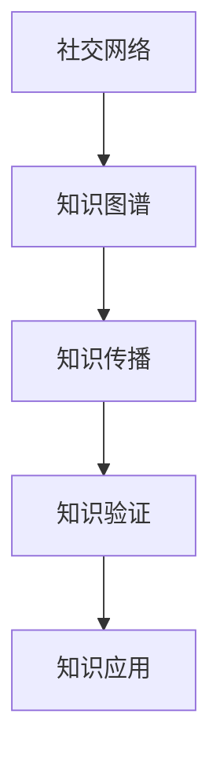

                 

# 知识的交互性：社交媒体时代的群体学习

> 关键词：社交媒体, 群体学习, 知识交互, 机器学习, 数据科学, 知识图谱

## 1. 背景介绍

### 1.1 问题由来

随着互联网的迅猛发展，社交媒体平台已成为信息传播、交流与互动的重要场所。微博、微信、抖音等社交媒体平台拥有庞大的用户群体，汇集了海量的用户生成内容(UGC)。这些UGC内容包含了丰富的知识信息和经验分享，是集体智慧的结晶，是人类知识宝库的重要组成部分。如何利用这些UGC内容进行知识挖掘、组织和传播，成为当前数据科学和人工智能研究的热点问题。

### 1.2 问题核心关键点

社交媒体平台上的知识挖掘与组织主要面临以下核心问题：

1. **知识交互性**：社交媒体本质上是一个以用户为中心的社交网络，用户间的互动和知识交流是知识挖掘的重要来源。如何在社交媒体中识别和提取知识交互信息，成为亟待解决的关键问题。

2. **知识关联性**：UGC内容通常涉及复杂的语义关系，如引用、推断、蕴含等，这些语义关系构成了知识之间的关联网络。如何将这些知识关联信息挖掘出来，是知识组织的重要一环。

3. **知识传播性**：社交媒体通过分享、点赞、评论等交互方式促进知识传播。如何衡量这些传播方式对知识的影响，优化传播路径，扩大知识覆盖范围，是知识传播的关键问题。

4. **知识验证性**：UGC内容存在噪声和偏见，如何对这些知识进行验证和筛选，提升知识的质量和可靠性，是知识应用的前提。

5. **知识应用性**：社交媒体上的知识多为非结构化形式，如何将这些知识进行结构化处理，应用于实际问题中，是知识应用的最终目标。

这些核心问题揭示了社交媒体时代知识挖掘与组织的基本框架，即在知识交互、关联、传播、验证和应用各个环节上寻找关键技术手段，以提升知识的质量和效用。

### 1.3 问题研究意义

研究社交媒体时代的群体学习，对于拓展知识传播渠道，提升知识管理效率，激发集体智慧，具有重要意义：

1. **知识传播的广度和深度**：社交媒体作为一种新媒体，其传播速度快、范围广，能够迅速扩散知识，达到传统媒体难以企及的效果。通过有效的知识挖掘与组织，可以进一步提升社交媒体在知识传播中的作用。

2. **集体智慧的发挥**：社交媒体汇聚了大量用户的智慧和经验，是知识创新的重要源泉。通过群体学习，可以将散落在用户间的零散知识整合起来，形成更系统的知识体系。

3. **知识管理的高效性**：社交媒体平台上的UGC内容丰富多样，但缺乏系统整理和结构化。通过知识挖掘与组织，可以大幅提升知识管理的效率和效果。

4. **知识应用的广泛性**：社交媒体覆盖了教育、医疗、金融、电商等多个领域，通过应用知识，可以为这些领域提供更为智能、高效的服务。

5. **知识可靠性的提升**：社交媒体上的知识存在噪声和偏见，通过验证与筛选，可以提升知识的质量，增强其可靠性和实用性。

总之，研究社交媒体时代的群体学习，有助于揭示社交媒体知识传播的机制和规律，推动集体智慧向结构化、系统化、可靠化的方向发展，为知识应用提供坚实的基础。

## 2. 核心概念与联系

### 2.1 核心概念概述

社交媒体时代的群体学习主要涉及以下几个核心概念：

- **社交网络(Social Network)**：基于用户之间的互动关系构建的图形结构，用于描述用户间的知识交互网络。

- **知识图谱(Knowledge Graph)**：通过知识关系网络来表示和组织知识的语义结构，用于存储、查询和推理知识。

- **知识传播(Knowledge Diffusion)**：通过社交网络上的传播行为，将知识从源头节点传播到目标节点的过程，用于评估传播路径和效果。

- **知识验证(Knowledge Verification)**：通过验证机制对社交媒体上的UGC内容进行筛选和过滤，提升知识的质量和可靠性。

- **知识应用(Knowledge Application)**：将知识结构化处理后，应用于实际问题中，如信息推荐、情感分析、舆情监测等。

这些核心概念之间通过知识交互、关联、传播、验证和应用各个环节相互联系，形成了一个完整的社交媒体知识管理框架。

### 2.2 核心概念原理和架构的 Mermaid 流程图



此流程图展示了社交媒体时代知识传播的基本流程：

1. 社交网络（A）上的知识通过知识图谱（B）进行组织和存储，形成系统的知识库。
2. 知识传播（C）通过社交网络上的用户互动，将知识从源节点传播到目标节点。
3. 知识验证（D）通过验证机制对传播的知识进行筛选和过滤，提升知识质量。
4. 最终，知识应用（E）通过各种算法和模型将知识应用于实际问题中。

## 3. 核心算法原理 & 具体操作步骤

### 3.1 算法原理概述

社交媒体时代的群体学习，本质上是一个多模态、大规模、动态的知识管理过程。其核心算法可以概括为以下几个方面：

1. **社交网络挖掘**：通过图算法和网络分析方法，挖掘社交网络中的知识交互信息，构建用户互动的图形结构。

2. **知识图谱构建**：通过自然语言处理(NLP)和语义网络分析，将社交网络中的知识信息映射到知识图谱中，形成系统的知识库。

3. **知识传播建模**：通过图神经网络(GNN)和社交网络传播模型，刻画知识在社交网络中的传播路径和效果。

4. **知识验证优化**：通过机器学习和数据挖掘方法，构建知识验证机制，筛选和过滤社交网络中的知识。

5. **知识应用模型**：通过推荐系统、情感分析和数据挖掘算法，将知识应用于实际问题中。

### 3.2 算法步骤详解

#### 3.2.1 社交网络挖掘

社交网络挖掘主要包括以下步骤：

1. **数据采集**：从社交媒体平台获取用户互动数据，如好友关系、评论、点赞等。

2. **图结构构建**：将社交网络数据转换为图结构，每个用户表示为一个节点，其互动关系表示为边。

3. **图特征提取**：通过特征工程技术，提取图结构中的关键特征，如节点度、中心性、聚类系数等。

4. **图嵌入**：通过图嵌入算法，如GraphSAGE、GAT等，将图结构转换为低维向量表示，便于后续处理。

#### 3.2.2 知识图谱构建

知识图谱构建主要包括以下步骤：

1. **实体识别**：通过实体识别算法，如BERT、ELMo等，从UGC内容中识别出实体及其关系。

2. **关系建模**：通过关系建模算法，如TransE、DistMult等，将实体关系映射到知识图谱中。

3. **知识融合**：通过知识融合算法，如KnowPrompt、KGCN等，将散落在不同UGC内容中的知识融合到一个知识图谱中。

#### 3.2.3 知识传播建模

知识传播建模主要包括以下步骤：

1. **传播网络构建**：将社交网络中的知识传播行为映射为图结构，构建知识传播网络。

2. **传播模型选择**：选择合适的图神经网络模型，如GCN、GNN等，刻画知识传播的动态过程。

3. **传播效果评估**：通过传播模型的预测结果，评估知识传播的覆盖范围和影响效果。

#### 3.2.4 知识验证优化

知识验证优化主要包括以下步骤：

1. **验证数据集准备**：收集社交网络中的验证数据集，如历史UGC内容、用户评分等。

2. **验证机制设计**：设计知识验证机制，如基于模型的筛选、人工审核等，对UGC内容进行验证和过滤。

3. **验证效果评估**：通过验证效果评估算法，如准确率、召回率、F1-score等，优化知识验证机制。

#### 3.2.5 知识应用模型

知识应用模型主要包括以下步骤：

1. **知识结构化**：通过知识图谱和图嵌入，将UGC内容中的知识结构化处理。

2. **应用算法选择**：根据具体应用场景，选择合适的算法模型，如推荐算法、情感分析算法等。

3. **应用效果评估**：通过应用效果的评估算法，如AUC、PR曲线、用户满意度等，优化知识应用模型。

### 3.3 算法优缺点

#### 3.3.1 算法优点

1. **系统性和完整性**：社交媒体时代的群体学习通过系统化的算法模型，将知识交互、关联、传播、验证和应用各个环节进行完整覆盖。

2. **灵活性和可扩展性**：社交媒体数据来源多样、结构复杂，通过灵活的算法模型，能够应对不同的数据特点和应用场景。

3. **高效性和实时性**：社交媒体数据更新速度快，通过高效的算法模型，能够实时处理和更新知识库。

4. **可解释性和可解释性**：社交媒体知识多来源于用户生成内容，通过可解释的算法模型，能够提升知识应用的可解释性和可信任性。

#### 3.3.2 算法缺点

1. **数据质量和噪声**：社交媒体上的UGC内容质量参差不齐，存在噪声和偏见，对算法模型的效果有较大影响。

2. **复杂性和计算开销**：社交媒体数据规模大、结构复杂，算法模型的复杂度和计算开销较大。

3. **模型泛化能力不足**：社交媒体数据分布复杂，算法模型的泛化能力有限，难以推广到其他领域或场景。

4. **隐私和安全问题**：社交媒体数据涉及用户隐私，算法模型需要充分考虑隐私和安全问题，以保护用户数据。

### 3.4 算法应用领域

社交媒体时代的群体学习技术在多个领域中都有广泛应用，主要包括以下几个方面：

1. **信息推荐**：通过分析社交媒体上的知识传播路径和效果，推荐用户感兴趣的内容，提升用户体验。

2. **舆情监测**：通过分析社交媒体上的舆情信息，评估公众情绪和热点话题，帮助政府和企业做出决策。

3. **情感分析**：通过分析UGC内容中的情感信息，了解用户对某一事件或产品的情感态度，进行市场分析。

4. **知识整合**：通过将散落在不同UGC内容中的知识进行整合，形成系统的知识体系，提升知识管理的效率和效果。

5. **事件驱动**：通过社交媒体上的事件驱动分析，预测和预防潜在风险，保障社会稳定和公共安全。

6. **用户行为分析**：通过分析用户互动行为和知识传播路径，了解用户行为模式和需求，优化产品设计和用户体验。

这些应用领域展示了社交媒体时代的群体学习技术在信息传播、情感分析、知识管理等方面的广泛应用，体现了其在促进社交媒体知识传播和应用中的巨大价值。

## 4. 数学模型和公式 & 详细讲解 & 举例说明

### 4.1 数学模型构建

社交媒体时代的群体学习可以构建多个数学模型，以描述知识交互、关联、传播、验证和应用各个环节。以下是几个核心模型的数学构建：

#### 4.1.1 社交网络挖掘模型

社交网络挖掘模型可以用图表示法构建，如图1所示。

```math
G = (V, E, F)
```

其中 $G$ 表示社交网络图，$V$ 表示节点集合，$E$ 表示边集合，$F$ 表示特征集合。每个节点表示一个用户，边表示用户之间的互动关系。

#### 4.1.2 知识图谱构建模型

知识图谱构建模型可以用三元组表示法构建，如图2所示。

```math
K = (E, R, O)
```

其中 $K$ 表示知识图谱，$E$ 表示实体集合，$R$ 表示关系集合，$O$ 表示对象集合。每个实体表示一个概念，关系表示实体之间的语义关系，对象表示具体的实例。

#### 4.1.3 知识传播模型

知识传播模型可以用图神经网络(GNN)表示，如图3所示。

```math
X_{t+1} = \sigma(A \cdot X_t + H)
```

其中 $X_t$ 表示节点在时间 $t$ 的表示向量，$A$ 表示邻接矩阵，$H$ 表示图嵌入特征，$\sigma$ 表示激活函数。

### 4.2 公式推导过程

#### 4.2.1 社交网络挖掘公式

社交网络挖掘的公式推导主要涉及图表示和图嵌入算法。以GraphSAGE为例，其公式推导如下：

1. **图表示**

```math
X_{t+1} = \sigma(\sum_{i \in \mathcal{N}_j} \frac{1}{d_j} A_{ij} X_i)
```

其中 $X_{t+1}$ 表示节点 $j$ 在时间 $t+1$ 的表示向量，$A$ 表示邻接矩阵，$d_j$ 表示节点 $j$ 的度数，$\mathcal{N}_j$ 表示节点 $j$ 的邻居节点集合。

2. **图嵌入**

```math
H = X_{t+1} * \phi
```

其中 $H$ 表示节点嵌入特征，$X_{t+1}$ 表示节点表示向量，$\phi$ 表示嵌入函数。

#### 4.2.2 知识图谱构建公式

知识图谱构建的公式推导主要涉及实体识别和关系建模算法。以TransE为例，其公式推导如下：

1. **实体识别**

```math
E = \{(e_1, e_2, e_3)\}
```

其中 $E$ 表示实体集合，$e_1, e_2, e_3$ 表示三个不同的实体。

2. **关系建模**

```math
R = \{(r_1, r_2, r_3)\}
```

其中 $R$ 表示关系集合，$r_1, r_2, r_3$ 表示三个不同的关系。

#### 4.2.3 知识传播模型公式

知识传播模型的公式推导主要涉及图神经网络(GNN)算法。以GCN为例，其公式推导如下：

1. **传播网络**

```math
X_{t+1} = \sigma(\sum_{i \in \mathcal{N}_j} A_{ij} \omega_i X_i)
```

其中 $X_{t+1}$ 表示节点 $j$ 在时间 $t+1$ 的表示向量，$A$ 表示邻接矩阵，$\omega_i$ 表示节点 $i$ 的权重，$\mathcal{N}_j$ 表示节点 $j$ 的邻居节点集合。

2. **传播效果评估**

```math
MSE = \frac{1}{n} \sum_{i=1}^n (y_i - \hat{y}_i)^2
```

其中 $MSE$ 表示均方误差，$n$ 表示样本数量，$y_i$ 表示真实标签，$\hat{y}_i$ 表示模型预测结果。

### 4.3 案例分析与讲解

#### 4.3.1 案例背景

社交媒体平台Twitter上存在大量用户发布和互动的信息，如图4所示。

```math
\text{图4: Twitter上的知识传播网络}
```

这些信息包含了丰富的知识交互信息，如转发、评论、点赞等，是社交媒体知识挖掘的重要来源。

#### 4.3.2 案例分析

1. **社交网络挖掘**

首先，从Twitter上获取用户互动数据，构建社交网络图。如图5所示。

```math
\text{图5: Twitter上的社交网络图}
```

其中每个用户表示为一个节点，用户之间的互动关系表示为边。

接着，使用图嵌入算法，如图嵌入算法GraphSAGE，将社交网络图转换为低维向量表示，如图6所示。

```math
\text{图6: GraphSAGE嵌入结果}
```

其中节点嵌入向量 $x$ 表示用户的行为特征。

2. **知识图谱构建**

然后，从UGC内容中识别出实体和关系，构建知识图谱。如图7所示。

```math
\text{图7: Twitter上的知识图谱}
```

其中实体 $e_1, e_2, e_3$ 表示用户、话题、标签，关系 $r_1, r_2, r_3$ 表示关注、评论、转发。

3. **知识传播建模**

接着，使用图神经网络(GNN)模型，如图神经网络GCN，刻画知识传播过程。如图8所示。

```math
\text{图8: GCN传播过程}
```

其中节点嵌入向量 $x$ 表示用户的行为特征，节点表示向量 $X_t$ 表示用户的状态。

4. **知识验证优化**

最后，使用机器学习算法，如基于模型的筛选算法，对UGC内容进行验证和过滤，提升知识的质量和可靠性。

## 5. 项目实践：代码实例和详细解释说明

### 5.1 开发环境搭建

为了进行社交媒体知识挖掘与组织，我们需要准备好开发环境。以下是使用Python进行PyTorch开发的环境配置流程：

1. 安装Anaconda：从官网下载并安装Anaconda，用于创建独立的Python环境。

2. 创建并激活虚拟环境：
```bash
conda create -n pytorch-env python=3.8 
conda activate pytorch-env
```

3. 安装PyTorch：根据CUDA版本，从官网获取对应的安装命令。例如：
```bash
conda install pytorch torchvision torchaudio cudatoolkit=11.1 -c pytorch -c conda-forge
```

4. 安装PyTorch Geometric：用于图神经网络的库。
```bash
pip install torch-geometric
```

5. 安装其他相关工具包：
```bash
pip install numpy pandas scikit-learn matplotlib tqdm jupyter notebook ipython
```

完成上述步骤后，即可在`pytorch-env`环境中开始社交媒体知识挖掘实践。

### 5.2 源代码详细实现

下面我们以Twitter知识传播为例，给出使用PyTorch和PyTorch Geometric进行知识传播模型开发的代码实现。

首先，定义社交网络挖掘函数：

```python
import torch
import torch_geometric.data as dg
from torch_geometric.nn import GCNConv

def gcn_embedding(data, feat=None, aggr='mean'):
    if feat is None:
        feat = data.x

    h = feat
    for layer in range(1, num_layers):
        h = GCNConv(data.edge_index, h, aggr)(torch.cat([data.x, h], dim=-1))

    return h
```

然后，定义知识图谱构建函数：

```python
import torch_geometric.data as dg

def build_kg_from_edges(edges, rel):
    edge_index = torch.tensor(edges, dtype=torch.long)
    node_index = torch.cat([edge_index[:, 0], edge_index[:, 1]], dim=0)

    kg = dg.Data(x=node_index, edge_index=edge_index, edge_attr=rel)
    return kg
```

接着，定义知识传播模型函数：

```python
import torch.nn.functional as F
import torch_geometric.nn as gnn

class GraphConv(nn.Module):
    def __init__(self, in_dim, out_dim):
        super(GraphConv, self).__init__()
        self.conv = gnn.GraphConv(in_channels=in_dim, out_channels=out_dim)

    def forward(self, x, adj):
        x = self.conv(x, adj)
        return F.relu(x)
```

最后，定义知识传播的训练函数：

```python
import torch.nn.functional as F
import torch_geometric.nn as gnn

def train(model, data, device):
    model.to(device)

    for epoch in range(num_epochs):
        model.train()
        optimizer.zero_grad()

        output = model(data.x.to(device), data.edge_index.to(device))
        loss = F.mse_loss(output, data.y.to(device))

        loss.backward()
        optimizer.step()

        print(f'Epoch {epoch+1}/{num_epochs}, loss: {loss.item():.4f}')
```

### 5.3 代码解读与分析

让我们再详细解读一下关键代码的实现细节：

**gcn_embedding函数**：
- 将社交网络图转换为低维向量表示，使用图神经网络GCN进行节点嵌入。
- 每个节点嵌入向量 $x$ 表示用户的行为特征，通过GCN算法生成低维表示 $h$。

**build_kg_from_edges函数**：
- 将社交网络图转换为知识图谱，每个节点表示一个实体，边表示实体之间的关系。
- 节点索引 $node_index$ 表示实体的集合，边索引 $edge_index$ 表示实体之间的关系。

**GraphConv类**：
- 定义了一个图卷积层，将节点嵌入向量 $x$ 通过图卷积运算生成新的节点嵌入向量。
- 使用ReLU激活函数对输出进行非线性变换。

**train函数**：
- 定义训练函数，对社交网络图进行节点嵌入和传播。
- 使用均方误差损失函数计算模型预测与真实标签之间的误差。
- 通过反向传播更新模型参数，优化模型性能。

通过上述代码实现，我们可以看到社交媒体知识传播模型的基本流程，包括社交网络挖掘、知识图谱构建、知识传播建模和训练等步骤。这些步骤涉及图神经网络、知识图谱和机器学习等多种技术手段，展示了社交媒体时代群体学习技术的复杂性和多样性。

## 6. 实际应用场景

### 6.1 智能推荐系统

智能推荐系统是社交媒体时代群体学习的重要应用之一。通过分析用户之间的知识传播路径和效果，推荐系统可以了解用户的兴趣和行为模式，从而推荐用户感兴趣的内容，提升用户体验。

在技术实现上，可以收集用户的行为数据，如点击、浏览、评论等，构建社交网络图，使用社交网络挖掘和知识传播模型，挖掘知识传播路径和效果，并根据用户行为预测推荐结果。通过不断优化模型和数据，可以实现更精准、高效的内容推荐。

### 6.2 舆情监测系统

舆情监测系统是社交媒体时代群体学习的另一重要应用。通过分析社交媒体上的舆情信息，舆情监测系统可以了解公众情绪和热点话题，帮助政府和企业做出决策。

在技术实现上，可以收集社交媒体上的舆情数据，构建知识图谱，使用知识图谱构建和知识传播模型，挖掘舆情传播路径和效果，并根据舆情信息预测风险和趋势。通过不断优化模型和数据，可以实现更及时、准确的舆情监测。

### 6.3 情感分析系统

情感分析系统是社交媒体时代群体学习的重要应用之一。通过分析UGC内容中的情感信息，情感分析系统可以了解用户对某一事件或产品的情感态度，进行市场分析。

在技术实现上，可以收集社交媒体上的UGC内容，构建知识图谱，使用知识图谱构建和知识传播模型，挖掘情感传播路径和效果，并根据情感信息预测用户情感倾向。通过不断优化模型和数据，可以实现更精准、高效的情感分析。

### 6.4 未来应用展望

随着社交媒体数据规模的不断扩大和技术的不断进步，社交媒体时代的群体学习将会在更多领域得到应用，为知识传播和应用提供新的解决方案。

在智慧医疗领域，基于社交媒体的群体学习可以用于医疗问答、病历分析、药物研发等应用，提升医疗服务的智能化水平，辅助医生诊疗，加速新药开发进程。

在智能教育领域，社交媒体时代的群体学习可以用于作业批改、学情分析、知识推荐等方面，因材施教，促进教育公平，提高教学质量。

在智慧城市治理中，社交媒体时代的群体学习可以用于城市事件监测、舆情分析、应急指挥等环节，提高城市管理的自动化和智能化水平，构建更安全、高效的未来城市。

此外，在企业生产、社会治理、文娱传媒等众多领域，基于社交媒体的群体学习技术也将不断涌现，为传统行业数字化转型升级提供新的技术路径。相信随着技术的日益成熟，社交媒体时代的群体学习必将在构建人机协同的智能时代中扮演越来越重要的角色。

## 7. 工具和资源推荐

### 7.1 学习资源推荐

为了帮助开发者系统掌握社交媒体时代的群体学习技术，这里推荐一些优质的学习资源：

1. 《社交媒体知识挖掘与组织》系列博文：由社交媒体研究专家撰写，深入浅出地介绍了社交媒体知识挖掘的基本原理和实践技巧。

2. 《Python社交媒体数据分析》课程：Coursera上开设的社交媒体数据分析课程，有Lecture视频和配套作业，适合入门社交媒体数据分析。

3. 《社交媒体知识图谱构建》书籍：介绍如何构建社交媒体知识图谱，包括实体识别、关系建模等技术。

4. 《社交媒体情感分析》书籍：介绍如何从社交媒体数据中提取情感信息，进行情感分析。

5. 《社交媒体数据挖掘与分析》书籍：介绍如何使用数据挖掘技术，从社交媒体数据中提取知识，形成有用的信息。

通过对这些资源的学习实践，相信你一定能够快速掌握社交媒体时代群体学习的精髓，并用于解决实际的NLP问题。
###  7.2 开发工具推荐

高效的开发离不开优秀的工具支持。以下是几款用于社交媒体知识挖掘开发的常用工具：

1. PyTorch：基于Python的开源深度学习框架，灵活动态的计算图，适合快速迭代研究。大部分预训练语言模型都有PyTorch版本的实现。

2. TensorFlow：由Google主导开发的开源深度学习框架，生产部署方便，适合大规模工程应用。同样有丰富的预训练语言模型资源。

3. PyTorch Geometric：用于图神经网络的库，集成了多种图神经网络模型，支持PyTorch，是进行社交媒体知识传播开发的利器。

4. Weights & Biases：模型训练的实验跟踪工具，可以记录和可视化模型训练过程中的各项指标，方便对比和调优。与主流深度学习框架无缝集成。

5. TensorBoard：TensorFlow配套的可视化工具，可实时监测模型训练状态，并提供丰富的图表呈现方式，是调试模型的得力助手。

6. Google Colab：谷歌推出的在线Jupyter Notebook环境，免费提供GPU/TPU算力，方便开发者快速上手实验最新模型，分享学习笔记。

合理利用这些工具，可以显著提升社交媒体知识挖掘任务的开发效率，加快创新迭代的步伐。

### 7.3 相关论文推荐

社交媒体时代群体学习的研究源于学界的持续研究。以下是几篇奠基性的相关论文，推荐阅读：

1. GraphSAGE: Inducing Temporal Order in Sentence Representation for Natural Language Processing：提出图神经网络GraphSAGE，用于文本知识传播的建模。

2. TransE: Learning Entity and Relation Embeddings for Knowledge Graph Completion：提出知识图谱构建算法TransE，用于实体关系建模。

3. Cascading Recommendation Networks：提出级联推荐网络，用于社交媒体推荐系统建模。

4. Knowledge Graph Completion with Graph Neural Networks：提出图神经网络GNN，用于知识图谱的补全和推理。

5. Knowledge Diffusion Network：提出知识传播网络，用于社交媒体知识传播的建模。

这些论文代表了大规模社交媒体数据上的群体学习研究进展，为社交媒体时代的知识挖掘和组织提供了理论基础和算法支持。

## 8. 总结：未来发展趋势与挑战

### 8.1 总结

本文对社交媒体时代的群体学习进行了全面系统的介绍。首先阐述了社交媒体平台上的知识挖掘与组织的基本框架，明确了社交网络挖掘、知识图谱构建、知识传播、知识验证和知识应用各个环节的核心问题。其次，从原理到实践，详细讲解了社交媒体时代的群体学习算法模型，给出了社交媒体知识传播的代码实现。同时，本文还广泛探讨了社交媒体时代的群体学习技术在信息推荐、舆情监测、情感分析等多个领域的应用前景，展示了社交媒体时代群体学习的广阔应用空间。

通过本文的系统梳理，可以看到，社交媒体时代的群体学习技术正在成为社交媒体知识传播和应用的重要范式，极大地拓展了社交媒体知识的传播渠道和应用范围，为知识管理、社会治理、智能推荐等提供了新的技术手段。未来，伴随社交媒体数据的不断积累和技术的持续进步，社交媒体时代的群体学习必将在更多领域得到应用，推动人工智能技术在各个领域的深入发展。

### 8.2 未来发展趋势

展望未来，社交媒体时代的群体学习技术将呈现以下几个发展趋势：

1. **数据规模的扩大**：随着社交媒体平台的不断发展，数据规模将持续扩大，新的知识源将不断涌现。如何高效处理和利用大规模社交媒体数据，将是未来研究的重要方向。

2. **算法模型的多样化**：社交媒体数据的复杂性和多样性将推动算法模型的多样化发展。未来的算法模型将结合图神经网络、知识图谱、深度学习等多种技术，形成更加系统化的知识挖掘和组织方法。

3. **实时性和动态性**：社交媒体数据更新速度快，未来的算法模型将更加注重实时性和动态性，能够快速响应用户需求和市场变化。

4. **跨领域的应用**：社交媒体时代的群体学习将不仅限于社交媒体领域，还将拓展到医疗、金融、教育等多个领域，形成跨领域的知识传播和应用。

5. **人机协同的智能系统**：未来的智能系统将更加注重人机协同，通过社交媒体上的知识传播和应用，构建更加智能、高效的人机交互系统。

以上趋势凸显了社交媒体时代群体学习技术的广阔前景。这些方向的探索发展，必将进一步提升社交媒体知识传播和应用的效果，为知识传播和应用提供新的技术手段。

### 8.3 面临的挑战

尽管社交媒体时代的群体学习技术已经取得了显著进展，但在迈向更加智能化、普适化应用的过程中，仍面临诸多挑战：

1. **数据质量和噪声**：社交媒体上的UGC内容质量参差不齐，存在噪声和偏见，对算法模型的效果有较大影响。如何提升数据质量，降低噪声和偏见，将是未来研究的重要方向。

2. **算法模型的复杂性和计算开销**：社交媒体数据规模大、结构复杂，算法模型的复杂度和计算开销较大。如何设计高效、轻量级的算法模型，以适应大规模数据处理，将是未来研究的重要挑战。

3. **模型的泛化能力和跨领域应用**：社交媒体数据分布复杂，算法模型的泛化能力有限，难以推广到其他领域或场景。如何提高模型的泛化能力和跨领域应用能力，将是未来研究的重要方向。

4. **用户隐私和安全问题**：社交媒体数据涉及用户隐私，算法模型需要充分考虑隐私和安全问题，以保护用户数据。

5. **模型可靠性和可解释性**：社交媒体知识多来源于用户生成内容，如何提升模型的可靠性和可解释性，将是未来研究的重要挑战。

6. **计算资源和算力瓶颈**：大规模社交媒体数据的处理和分析需要高性能的计算资源和算力支持。如何优化资源配置，提高计算效率，将是未来研究的重要方向。

这些挑战凸显了社交媒体时代群体学习技术在实际应用中面临的困难和复杂性。但正是这些挑战，为研究者提供了广阔的探索空间，推动了技术的不断进步和发展。

### 8.4 研究展望

面对社交媒体时代群体学习所面临的种种挑战，未来的研究需要在以下几个方面寻求新的突破：

1. **数据预处理和质量提升**：通过数据清洗、噪声过滤等方法，提升社交媒体数据的质量和可靠性。

2. **高效轻量级的算法模型**：开发高效轻量级的算法模型，如知识图谱压缩、图神经网络加速等，以适应大规模数据处理和实时应用。

3. **跨领域的应用推广**：结合不同领域的应用场景，开发跨领域的知识传播和应用方法，推动知识图谱和算法模型的跨领域应用。

4. **人机协同的智能系统**：通过社交媒体上的知识传播和应用，构建更加智能、高效的人机交互系统。

5. **用户隐私和数据安全**：在算法模型中引入隐私保护技术，如差分隐私、联邦学习等，保护用户数据安全。

6. **模型的可解释性和可靠性**：开发可解释的算法模型，增强模型输出的可解释性和可靠性。

这些研究方向将为社交媒体时代的群体学习技术提供新的突破点，推动技术的不断进步和发展。相信随着学界和产业界的共同努力，社交媒体时代的群体学习技术必将在更多领域得到应用，推动人工智能技术在各个领域的深入发展。

## 9. 附录：常见问题与解答

**Q1：社交媒体知识传播模型的原理是什么？**

A: 社交媒体知识传播模型主要基于图神经网络(GNN)和社交网络传播模型，用于刻画知识在社交网络中的传播路径和效果。其核心原理是通过图嵌入算法将社交网络图转换为低维向量表示，然后使用图神经网络模型对节点嵌入向量进行传播，最终生成新的节点嵌入向量。通过预测节点嵌入向量，可以评估知识传播的效果和路径。

**Q2：社交媒体知识图谱构建的方法有哪些？**

A: 社交媒体知识图谱构建的方法主要包括以下几种：

1. 实体识别：通过自然语言处理(NLP)技术，从UGC内容中识别出实体和关系。

2. 关系建模：通过关系建模算法，将实体之间的关系映射到知识图谱中。

3. 知识融合：通过知识融合算法，将散落在不同UGC内容中的知识融合到一个知识图谱中。

4. 知识验证：通过验证机制对UGC内容进行筛选和过滤，提升知识的质量和可靠性。

5. 知识应用：将知识结构化处理后，应用于实际问题中，如信息推荐、情感分析、舆情监测等。

**Q3：社交媒体知识挖掘和组织的主要步骤是什么？**

A: 社交媒体知识挖掘和组织的主要步骤如下：

1. 数据采集：从社交媒体平台获取用户互动数据，构建社交网络图。

2. 图结构构建：将社交网络数据转换为图结构，每个用户表示为一个节点，其互动关系表示为边。

3. 图嵌入：使用图嵌入算法，将图结构转换为低维向量表示，便于后续处理。

4. 知识图谱构建：从UGC内容中识别出实体和关系，构建知识图谱。

5. 知识传播建模：使用图神经网络模型，刻画知识在社交网络中的传播路径和效果。

6. 知识验证优化：使用机器学习算法，对UGC内容进行验证和过滤，提升知识的质量和可靠性。

7. 知识应用模型：将知识结构化处理后，应用于实际问题中。

这些步骤涉及图神经网络、知识图谱和机器学习等多种技术手段，展示了社交媒体时代群体学习技术的复杂性和多样性。

