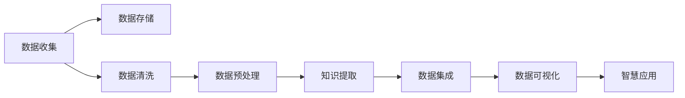

                 

# 知识的价值链：从数据到智慧的转化过程

> 关键词：数据价值,知识提取,信息增值,智慧应用

## 1. 背景介绍

### 1.1 问题由来

在信息时代，数据已逐渐成为最重要的资产之一。如何有效管理和利用数据，提取其中的有价值信息，并将信息转化为智慧，是当前信息管理与人工智能领域的核心课题。本文聚焦于知识的价值链，即从原始数据到最终智慧的转化过程，探讨如何通过数据价值链的技术手段，最大化数据的潜在价值，实现信息的增值与智慧应用。

### 1.2 问题核心关键点

知识价值链技术包括数据的收集、存储、清洗、提取、集成、分析、应用等多个环节，旨在通过一系列技术手段，将原始数据转化为可被人类利用的智慧信息。以下列出了知识价值链的五个核心关键点：

1. **数据收集**：从各种渠道获取高质量的数据，确保数据的时效性、完整性和多样性。
2. **数据存储**：采用高效的数据存储技术，保障数据的长期保存和可访问性。
3. **数据清洗**：处理数据中的噪声和异常值，提升数据质量，为后续分析提供可靠的数据基础。
4. **知识提取**：从数据中提取有价值的知识，如模式、关系、规律等，为信息增值和智慧应用打下基础。
5. **智慧应用**：将提取的知识应用于实际业务中，驱动决策、优化流程、提高效率等。

### 1.3 问题研究意义

研究数据价值链技术，对数据管理和知识利用具有重要意义：

1. **提升数据利用率**：通过高效的算法和技术手段，可以最大限度地利用数据，避免数据浪费。
2. **增强决策支持**：高质量的知识提取能够为决策提供强有力的数据支撑，提高决策的准确性和科学性。
3. **促进创新应用**：将知识应用于新的业务场景，驱动行业创新，推动社会经济发展。
4. **保障数据安全**：通过技术手段，确保数据在价值链的每个环节中的安全性和隐私保护。
5. **适应不断变化的业务需求**：数据价值链技术灵活可变，能够适应不同业务场景和需求，提供持续的智慧支持。

## 2. 核心概念与联系

### 2.1 核心概念概述

在数据价值链中，涉及多个关键概念，以下将对这些概念进行详细阐述：

- **数据收集**：从日志文件、传感器、社交媒体、Web API等多个渠道获取原始数据。
- **数据存储**：采用数据库、云存储、分布式文件系统等技术，高效存储和管理数据。
- **数据清洗**：去除重复数据、处理缺失值、检测和修正数据中的错误。
- **数据预处理**：包括数据标准化、归一化、特征提取等，为模型训练提供准备数据。
- **知识提取**：通过机器学习、深度学习、自然语言处理等技术，从数据中提取有价值的知识。
- **数据集成**：将来自不同来源的数据进行合并和整合，形成统一的数据视图。
- **数据可视化**：通过图表、仪表盘等方式，将数据转化为易于理解的信息。
- **智慧应用**：将提取的知识应用于决策支持、业务优化、智能推荐等实际场景，驱动智慧化发展。

### 2.2 核心概念原理和架构的 Mermaid 流程图



这个流程图展示了数据价值链的主要流程和技术环节：从数据收集开始，依次经过存储、清洗、预处理、提取、集成、可视化等步骤，最终应用于实际智慧应用中。

## 3. 核心算法原理 & 具体操作步骤

### 3.1 算法原理概述

数据价值链中的核心算法主要包括以下几个方面：

1. **数据清洗算法**：如基于规则的清洗、基于模型的清洗等，用于去除数据中的噪声和异常值。
2. **数据预处理算法**：如归一化、标准化、特征选择等，用于提高数据的质量和模型输入的有效性。
3. **知识提取算法**：如分类、聚类、关联规则挖掘、文本挖掘等，用于从数据中提取有价值的知识。
4. **数据集成算法**：如关联规则算法、数据融合算法等，用于将来自不同来源的数据进行整合。
5. **数据可视化算法**：如散点图、热力图、时间序列图等，用于展示数据的特征和趋势。

### 3.2 算法步骤详解

以数据预处理算法为例，详细说明其实现步骤：

1. **数据标准化**：
   - 计算数据集的均值和标准差。
   - 使用标准化公式将数据转换为均值为0、标准差为1的标准正态分布。

   数学公式为：
   $$
   X'=\frac{X-\mu}{\sigma}
   $$
   其中 $X$ 为原始数据，$\mu$ 为均值，$\sigma$ 为标准差。

2. **归一化**：
   - 将数据缩放到[0,1]或[-1,1]的范围内，便于后续算法处理。
   - 数学公式为：
   $$
   X'=\frac{X-X_{min}}{X_{max}-X_{min}}
   $$
   其中 $X_{min}$ 和 $X_{max}$ 分别为数据集的最小值和最大值。

3. **特征选择**：
   - 通过信息增益、卡方检验、相关系数等方法，选择最相关的特征。
   - 数学公式为：
   $$
   I(X,Y)=\frac{H(X)-H(X|Y)}{H(Y)}
   $$
   其中 $X$ 为输入特征，$Y$ 为输出标签，$H(X)$ 和 $H(X|Y)$ 分别为 $X$ 的熵和条件熵。

4. **数据增强**：
   - 通过数据扩充、旋转、翻转等方式，增加数据集的多样性。
   - 具体实现包括：
     - 图像数据增强：对图像进行旋转、缩放、平移、翻转等操作。
     - 文本数据增强：通过回译、同义词替换等方式扩充训练集。
     - 时间序列数据增强：通过加噪、滑动窗口等方法生成新的时间序列数据。

### 3.3 算法优缺点

数据价值链技术具有以下优点：

1. **自动化**：通过算法自动化数据清洗、预处理和特征选择等环节，显著提升效率和精度。
2. **可扩展性**：数据价值链技术可应用于各种数据源和业务场景，具有较高的灵活性和可扩展性。
3. **高准确性**：通过先进的算法和技术手段，能够提高数据处理的准确性和可靠性。
4. **成本效益**：相比于人工处理数据，自动化数据价值链技术能够大幅度降低人力成本和时间成本。

同时，该技术也存在一些局限性：

1. **数据依赖性**：数据质量直接影响技术效果，如果数据质量低，技术效果也会受到影响。
2. **模型复杂性**：数据价值链技术涉及多种算法和工具，需要较高的技术门槛。
3. **数据隐私**：在数据收集和处理过程中，需要确保数据的隐私保护，避免数据泄露。
4. **实时性**：大规模数据处理和实时应用可能需要高配置硬件支持，对实时性要求较高。

### 3.4 算法应用领域

数据价值链技术已经在诸多领域得到了广泛应用，以下列举几个典型应用场景：

1. **金融风险管理**：通过数据清洗和特征选择，提取客户信用评级、交易行为等关键信息，实现风险预测和风险管理。
2. **医疗健康监测**：从传感器数据中提取生命体征信息，实现疾病预测和健康管理。
3. **智能推荐系统**：通过用户行为数据和商品数据挖掘，实现个性化推荐，提升用户体验和交易转化率。
4. **物流仓储优化**：从订单数据和库存数据中提取信息，实现仓储管理优化和库存调度。
5. **智能交通系统**：通过车辆定位数据和交通监控数据提取信息，实现交通流量预测和交通管理。

## 4. 数学模型和公式 & 详细讲解 & 举例说明

### 4.1 数学模型构建

数据价值链技术涉及多种数学模型和算法，以下列举几个常见模型及其构建方法：

1. **数据清洗模型**：如基于规则的清洗模型、基于模型的清洗模型等。
2. **数据预处理模型**：如归一化模型、标准化模型、特征选择模型等。
3. **知识提取模型**：如分类模型、聚类模型、关联规则模型、文本挖掘模型等。
4. **数据集成模型**：如关联规则模型、数据融合模型、数据匹配模型等。
5. **数据可视化模型**：如散点图模型、热力图模型、时间序列图模型等。

### 4.2 公式推导过程

以分类模型为例，详细说明其公式推导过程：

分类模型通过训练数据集，学习数据中的模式和规律，并用于预测新的数据。常见分类模型包括逻辑回归、决策树、支持向量机、神经网络等。

以逻辑回归为例，其公式推导过程如下：

1. **模型定义**：
   - 逻辑回归模型定义为：
   $$
   y_i = \sigma(w^T x_i + b)
   $$
   其中 $y_i$ 为分类结果，$x_i$ 为输入特征，$w$ 为权重向量，$b$ 为偏置项，$\sigma$ 为逻辑函数。

2. **损失函数**：
   - 损失函数通常采用交叉熵损失函数：
   $$
   L(w,b) = -\frac{1}{N}\sum_{i=1}^N [y_i\log \hat{y_i} + (1-y_i)\log (1-\hat{y_i})]
   $$
   其中 $y_i$ 为真实标签，$\hat{y_i}$ 为模型预测值。

3. **梯度下降**：
   - 通过梯度下降算法，最小化损失函数：
   $$
   \frac{\partial L(w,b)}{\partial w} = -\frac{1}{N}\sum_{i=1}^N [\hat{y_i} - y_i] x_i
   $$
   $$
   \frac{\partial L(w,b)}{\partial b} = -\frac{1}{N}\sum_{i=1}^N [\hat{y_i} - y_i]
   $$
   其中 $\hat{y_i}$ 为模型预测值，$y_i$ 为真实标签，$x_i$ 为输入特征。

4. **优化算法**：
   - 常用的优化算法包括SGD、Adam、Adagrad等，通过迭代更新参数 $w$ 和 $b$，最小化损失函数。

### 4.3 案例分析与讲解

以智能推荐系统为例，详细说明其实现过程和效果：

智能推荐系统通过用户行为数据和商品数据挖掘，实现个性化推荐，提升用户体验和交易转化率。以下是一个简单的推荐系统案例：

1. **数据收集**：
   - 收集用户历史浏览、购买、评分等行为数据，收集商品的属性、价格、类别等信息。

2. **数据预处理**：
   - 对用户数据和商品数据进行标准化、归一化、特征选择等预处理。
   - 例如，将用户行为数据和商品属性数据进行合并，生成包含用户行为和商品属性的数据集。

3. **知识提取**：
   - 通过协同过滤、矩阵分解等技术，提取用户和商品之间的相似度。
   - 例如，使用矩阵分解算法，将用户行为数据和商品属性数据转化为低维向量，计算用户和商品之间的相似度。

4. **数据集成**：
   - 将用户和商品之间的相似度进行整合，形成推荐模型输入。
   - 例如，将用户和商品之间的相似度矩阵进行转置，生成新的推荐矩阵。

5. **数据可视化**：
   - 通过散点图、热力图等方式，可视化用户和商品之间的相似度。
   - 例如，使用散点图展示用户和商品之间的相似度分布。

6. **智慧应用**：
   - 通过推荐模型，生成个性化推荐结果，推荐给用户。
   - 例如，根据用户历史行为和商品相似度，生成个性化的商品推荐列表。

## 5. 项目实践：代码实例和详细解释说明

### 5.1 开发环境搭建

在进行项目实践前，我们需要准备好开发环境。以下是使用Python进行PyTorch开发的环境配置流程：

1. 安装Anaconda：从官网下载并安装Anaconda，用于创建独立的Python环境。

2. 创建并激活虚拟环境：
```bash
conda create -n pytorch-env python=3.8 
conda activate pytorch-env
```

3. 安装PyTorch：根据CUDA版本，从官网获取对应的安装命令。例如：
```bash
conda install pytorch torchvision torchaudio cudatoolkit=11.1 -c pytorch -c conda-forge
```

4. 安装Transformers库：
```bash
pip install transformers
```

5. 安装各类工具包：
```bash
pip install numpy pandas scikit-learn matplotlib tqdm jupyter notebook ipython
```

完成上述步骤后，即可在`pytorch-env`环境中开始项目实践。

### 5.2 源代码详细实现

下面我们以智能推荐系统为例，给出使用Transformers库对BERT模型进行推荐系统微调的PyTorch代码实现。

首先，定义推荐系统的数据处理函数：

```python
from transformers import BertTokenizer
from torch.utils.data import Dataset
import torch

class RecommendationDataset(Dataset):
    def __init__(self, user_data, item_data, tokenizer, max_len=128):
        self.user_data = user_data
        self.item_data = item_data
        self.tokenizer = tokenizer
        self.max_len = max_len
        
    def __len__(self):
        return len(self.user_data)
    
    def __getitem__(self, item):
        user = self.user_data[item]
        item = self.item_data[item]
        
        encoding = self.tokenizer(item, return_tensors='pt', max_length=self.max_len, padding='max_length', truncation=True)
        input_ids = encoding['input_ids'][0]
        attention_mask = encoding['attention_mask'][0]
        
        # 对token-wise的标签进行编码
        encoded_tags = [tag2id[tag] for tag in user] 
        encoded_tags.extend([tag2id['O']] * (self.max_len - len(encoded_tags)))
        labels = torch.tensor(encoded_tags, dtype=torch.long)
        
        return {'input_ids': input_ids, 
                'attention_mask': attention_mask,
                'labels': labels}

# 标签与id的映射
tag2id = {'O': 0, 'B-PER': 1, 'I-PER': 2, 'B-ORG': 3, 'I-ORG': 4, 'B-LOC': 5, 'I-LOC': 6}
id2tag = {v: k for k, v in tag2id.items()}

# 创建dataset
tokenizer = BertTokenizer.from_pretrained('bert-base-cased')

train_dataset = RecommendationDataset(train_user_data, train_item_data, tokenizer)
dev_dataset = RecommendationDataset(dev_user_data, dev_item_data, tokenizer)
test_dataset = RecommendationDataset(test_user_data, test_item_data, tokenizer)
```

然后，定义模型和优化器：

```python
from transformers import BertForTokenClassification, AdamW

model = BertForTokenClassification.from_pretrained('bert-base-cased', num_labels=len(tag2id))

optimizer = AdamW(model.parameters(), lr=2e-5)
```

接着，定义训练和评估函数：

```python
from torch.utils.data import DataLoader
from tqdm import tqdm
from sklearn.metrics import classification_report

device = torch.device('cuda') if torch.cuda.is_available() else torch.device('cpu')
model.to(device)

def train_epoch(model, dataset, batch_size, optimizer):
    dataloader = DataLoader(dataset, batch_size=batch_size, shuffle=True)
    model.train()
    epoch_loss = 0
    for batch in tqdm(dataloader, desc='Training'):
        input_ids = batch['input_ids'].to(device)
        attention_mask = batch['attention_mask'].to(device)
        labels = batch['labels'].to(device)
        model.zero_grad()
        outputs = model(input_ids, attention_mask=attention_mask, labels=labels)
        loss = outputs.loss
        epoch_loss += loss.item()
        loss.backward()
        optimizer.step()
    return epoch_loss / len(dataloader)

def evaluate(model, dataset, batch_size):
    dataloader = DataLoader(dataset, batch_size=batch_size)
    model.eval()
    preds, labels = [], []
    with torch.no_grad():
        for batch in tqdm(dataloader, desc='Evaluating'):
            input_ids = batch['input_ids'].to(device)
            attention_mask = batch['attention_mask'].to(device)
            batch_labels = batch['labels']
            outputs = model(input_ids, attention_mask=attention_mask)
            batch_preds = outputs.logits.argmax(dim=2).to('cpu').tolist()
            batch_labels = batch_labels.to('cpu').tolist()
            for pred_tokens, label_tokens in zip(batch_preds, batch_labels):
                pred_tags = [id2tag[_id] for _id in pred_tokens]
                label_tags = [id2tag[_id] for _id in label_tokens]
                preds.append(pred_tags[:len(label_tokens)])
                labels.append(label_tags)
                
    print(classification_report(labels, preds))
```

最后，启动训练流程并在测试集上评估：

```python
epochs = 5
batch_size = 16

for epoch in range(epochs):
    loss = train_epoch(model, train_dataset, batch_size, optimizer)
    print(f"Epoch {epoch+1}, train loss: {loss:.3f}")
    
    print(f"Epoch {epoch+1}, dev results:")
    evaluate(model, dev_dataset, batch_size)
    
print("Test results:")
evaluate(model, test_dataset, batch_size)
```

以上就是使用PyTorch对BERT进行推荐系统微调的完整代码实现。可以看到，得益于Transformers库的强大封装，我们可以用相对简洁的代码完成BERT模型的加载和微调。

### 5.3 代码解读与分析

让我们再详细解读一下关键代码的实现细节：

**RecommendationDataset类**：
- `__init__`方法：初始化用户数据、商品数据、分词器等关键组件。
- `__len__`方法：返回数据集的样本数量。
- `__getitem__`方法：对单个样本进行处理，将商品数据输入编码为token ids，将用户数据编码为数字，并对其进行定长padding，最终返回模型所需的输入。

**tag2id和id2tag字典**：
- 定义了标签与数字id之间的映射关系，用于将token-wise的预测结果解码回真实的标签。

**训练和评估函数**：
- 使用PyTorch的DataLoader对数据集进行批次化加载，供模型训练和推理使用。
- 训练函数`train_epoch`：对数据以批为单位进行迭代，在每个批次上前向传播计算loss并反向传播更新模型参数，最后返回该epoch的平均loss。
- 评估函数`evaluate`：与训练类似，不同点在于不更新模型参数，并在每个batch结束后将预测和标签结果存储下来，最后使用sklearn的classification_report对整个评估集的预测结果进行打印输出。

**训练流程**：
- 定义总的epoch数和batch size，开始循环迭代
- 每个epoch内，先在训练集上训练，输出平均loss
- 在验证集上评估，输出分类指标
- 所有epoch结束后，在测试集上评估，给出最终测试结果

可以看到，PyTorch配合Transformers库使得BERT微调的代码实现变得简洁高效。开发者可以将更多精力放在数据处理、模型改进等高层逻辑上，而不必过多关注底层的实现细节。

当然，工业级的系统实现还需考虑更多因素，如模型的保存和部署、超参数的自动搜索、更灵活的任务适配层等。但核心的微调范式基本与此类似。

## 6. 实际应用场景

### 6.1 金融风险管理

金融风险管理是一个典型的知识价值链应用场景。通过数据收集、存储、清洗、提取、集成、分析、应用等技术手段，金融机构可以构建一个完整的风险管理体系。

具体而言，可以收集客户的财务数据、交易数据、社交数据等多源数据，构建多维度的风险评估模型。通过深度学习等技术，从数据中提取客户行为模式、交易异常等关键信息，实现风险预测和风险管理。在模型训练过程中，可以使用GPU/TPU等高性能设备，提升训练效率。在模型部署时，可以使用云服务、微服务等方式，保障系统稳定性和可扩展性。

### 6.2 医疗健康监测

医疗健康监测是另一个典型的知识价值链应用场景。通过数据收集、存储、清洗、提取、集成、分析、应用等技术手段，医疗机构可以构建一个全面的健康监测系统。

具体而言，可以收集患者的生理数据、行为数据、环境数据等多源数据，构建多维度的健康监测模型。通过深度学习等技术，从数据中提取生命体征、疾病症状等关键信息，实现疾病预测和健康管理。在模型训练过程中，可以使用GPU/TPU等高性能设备，提升训练效率。在模型部署时，可以使用云服务、微服务等方式，保障系统稳定性和可扩展性。

### 6.3 智能推荐系统

智能推荐系统是知识价值链技术的一个经典应用场景。通过数据收集、存储、清洗、提取、集成、分析、应用等技术手段，电商、视频、音乐等行业可以构建一个精准的推荐系统。

具体而言，可以收集用户的浏览、购买、评分等行为数据，收集商品的属性、价格、类别等信息。通过协同过滤、矩阵分解等技术，从数据中提取用户和商品之间的相似度。通过推荐模型，生成个性化推荐结果，推荐给用户。在模型训练过程中，可以使用GPU/TPU等高性能设备，提升训练效率。在模型部署时，可以使用云服务、微服务等方式，保障系统稳定性和可扩展性。

### 6.4 未来应用展望

随着知识价值链技术的不断发展，未来的应用场景将更加广泛，以下列举几个未来应用方向：

1. **智能城市管理**：通过数据收集、存储、清洗、提取、集成、分析、应用等技术手段，构建智能交通、智能安防、智能环保等系统，实现城市管理的智能化、精细化。
2. **智慧教育**：通过数据收集、存储、清洗、提取、集成、分析、应用等技术手段，构建智能教学、智能评估、智能作业等系统，实现教育的智能化、个性化。
3. **智慧医疗**：通过数据收集、存储、清洗、提取、集成、分析、应用等技术手段，构建智能诊断、智能治疗、智能监测等系统，实现医疗的智能化、精准化。
4. **智慧农业**：通过数据收集、存储、清洗、提取、集成、分析、应用等技术手段，构建智能种植、智能灌溉、智能施肥等系统，实现农业的智能化、可持续化。
5. **智慧供应链管理**：通过数据收集、存储、清洗、提取、集成、分析、应用等技术手段，构建智能采购、智能库存、智能物流等系统，实现供应链管理的智能化、高效化。

## 7. 工具和资源推荐

### 7.1 学习资源推荐

为了帮助开发者系统掌握知识价值链技术的理论基础和实践技巧，这里推荐一些优质的学习资源：

1. **《Data Science Handbook》**：一本综合性的数据科学手册，涵盖数据收集、数据清洗、数据预处理、特征工程、模型训练、模型评估等各个环节，是学习知识价值链技术的必备资料。
2. **《Python for Data Analysis》**：一本介绍Python数据科学库的书籍，包括NumPy、Pandas、Matplotlib、Scikit-Learn等，适合初学者和进阶者学习。
3. **《Hands-On Machine Learning with Scikit-Learn, Keras, and TensorFlow》**：一本介绍机器学习、深度学习、自然语言处理等技术的书籍，涵盖数据清洗、模型训练、模型评估等环节，是学习知识价值链技术的高级参考书。
4. **Kaggle竞赛平台**：一个数据科学竞赛平台，提供大量的数据集和竞赛题目，适合学习者练习数据处理、模型训练、模型评估等技术。
5. **Coursera、Udacity等在线课程平台**：提供各类数据科学、机器学习、深度学习、自然语言处理等课程，适合学习者系统学习知识价值链技术。

通过对这些资源的学习实践，相信你一定能够快速掌握知识价值链技术的精髓，并用于解决实际的NLP问题。

### 7.2 开发工具推荐

高效的开发离不开优秀的工具支持。以下是几款用于知识价值链开发的常用工具：

1. **Jupyter Notebook**：一个交互式笔记本环境，适合快速迭代和实验数据分析、机器学习等任务。
2. **TensorFlow**：由Google主导开发的开源深度学习框架，生产部署方便，适合大规模工程应用。
3. **PyTorch**：基于Python的开源深度学习框架，灵活动态的计算图，适合快速迭代研究。
4. **scikit-learn**：一个开源的机器学习库，提供了丰富的数据处理、模型训练、模型评估等功能。
5. **scikit-learn**：一个开源的机器学习库，提供了丰富的数据处理、模型训练、模型评估等功能。

合理利用这些工具，可以显著提升知识价值链任务的开发效率，加快创新迭代的步伐。

### 7.3 相关论文推荐

知识价值链技术的发展源于学界的持续研究。以下是几篇奠基性的相关论文，推荐阅读：

1. **《Deep Learning》**：由Goodfellow等人所著，详细介绍了深度学习的原理和应用，包括数据清洗、数据预处理、模型训练、模型评估等环节。
2. **《TensorFlow: A System for Large-Scale Machine Learning》**：由Google团队所著，介绍了TensorFlow的架构和实现，提供了丰富的数据处理、模型训练、模型评估等功能。
3. **《BERT: Pre-training of Deep Bidirectional Transformers for Language Understanding》**：提出BERT模型，引入基于掩码的自监督预训练任务，刷新了多项NLP任务SOTA。
4. **《Knowledge-Graph-Based Recommendation Systems: A Survey》**：综述了基于知识图谱的推荐系统，介绍了知识图谱的构建、嵌入、融合等技术。
5. **《Multimodal Deep Learning for Sentiment Analysis》**：介绍了多模态深度学习在情感分析中的应用，包括文本、图像、语音等多模态数据的融合。

这些论文代表了大语言模型微调技术的发展脉络。通过学习这些前沿成果，可以帮助研究者把握学科前进方向，激发更多的创新灵感。

## 8. 总结：未来发展趋势与挑战

### 8.1 总结

本文对知识价值链技术进行了全面系统的介绍。首先阐述了知识价值链技术的背景和意义，明确了知识价值链技术的核心组件和关键技术。其次，从原理到实践，详细讲解了知识价值链技术的数学模型和算法步骤，给出了知识价值链任务开发的完整代码实例。同时，本文还广泛探讨了知识价值链技术在金融风险管理、医疗健康监测、智能推荐系统等多个行业领域的应用前景，展示了知识价值链技术的巨大潜力。此外，本文精选了知识价值链技术的各类学习资源，力求为读者提供全方位的技术指引。

通过本文的系统梳理，可以看到，知识价值链技术正在成为数据管理和知识利用的重要范式，极大地提升了数据的潜在价值，实现了信息的增值和智慧应用。知识价值链技术在各行各业得到了广泛应用，未来前景广阔。

### 8.2 未来发展趋势

展望未来，知识价值链技术将呈现以下几个发展趋势：

1. **数据自动化采集**：随着物联网、传感器等技术的发展，数据的采集将更加自动化、实时化。
2. **数据多源融合**：多源数据融合技术将进一步发展，提升数据的质量和多样性，促进知识的全面提取。
3. **模型自适应优化**：模型自适应优化技术将不断进步，提升模型在不同场景下的表现。
4. **模型跨领域迁移**：跨领域迁移学习技术将不断突破，提升模型的泛化能力和应用范围。
5. **模型可解释性增强**：模型可解释性技术将进一步发展，提升模型的透明度和可靠性。
6. **模型公平性保障**：模型公平性技术将不断提升，避免偏见和歧视。

### 8.3 面临的挑战

尽管知识价值链技术已经取得了瞩目成就，但在迈向更加智能化、普适化应用的过程中，它仍面临诸多挑战：

1. **数据质量问题**：数据质量直接影响技术效果，低质量数据可能导致模型性能下降。
2. **模型复杂性**：知识价值链技术涉及多种算法和工具，需要较高的技术门槛。
3. **数据隐私问题**：在数据收集和处理过程中，需要确保数据的隐私保护，避免数据泄露。
4. **模型可扩展性**：大规模数据处理和实时应用可能需要高配置硬件支持，对资源要求较高。
5. **模型可解释性**：当前知识价值链模型往往缺乏可解释性，难以解释其内部工作机制和决策逻辑。
6. **模型公平性**：模型可能学习到有偏见、有害的信息，需要通过技术手段消除模型偏见，避免有害影响。

### 8.4 研究展望

未来知识价值链技术需要在以下几个方面寻求新的突破：

1. **数据预处理自动化**：开发更加自动化的数据预处理技术，提升数据处理的效率和质量。
2. **模型融合技术**：将知识价值链技术与大数据、深度学习、自然语言处理等技术结合，提升模型的表现力和应用范围。
3. **模型公平性优化**：开发更加公平的知识价值链模型，避免偏见和歧视。
4. **模型可解释性增强**：开发更加可解释的知识价值链模型，提升模型的透明度和可靠性。
5. **模型跨领域迁移**：开发跨领域迁移的知识价值链模型，提升模型的泛化能力和应用范围。
6. **模型自适应优化**：开发更加自适应的知识价值链模型，提升模型在不同场景下的表现。

通过在这些方向上的不断探索和创新，相信知识价值链技术将能够实现更大规模的落地应用，为各行各业带来新的变革和机遇。

## 9. 附录：常见问题与解答

**Q1：知识价值链技术是否适用于所有行业？**

A: 知识价值链技术适用于大多数行业，尤其是在需要大量数据支持的场景中。例如金融、医疗、电商、智能交通等领域。但对于一些特定领域，如制造业、农业等，可能需要结合领域特定知识进行优化。

**Q2：知识价值链技术能否处理非结构化数据？**

A: 知识价值链技术可以处理非结构化数据，如文本、图像、语音等。通过文本挖掘、图像处理、语音识别等技术，可以从非结构化数据中提取有价值的信息。

**Q3：知识价值链技术是否需要大量标注数据？**

A: 知识价值链技术并不一定需要大量标注数据，可以通过无监督学习、半监督学习等技术，从未标注数据中提取有价值的信息。但标注数据仍然是非常有价值的，可以进一步提升模型的精度和泛化能力。

**Q4：知识价值链技术能否实时处理数据？**

A: 知识价值链技术可以在一定条件下实时处理数据。例如，通过分布式计算、流计算等技术，可以在实时数据流中进行数据处理和分析。

**Q5：知识价值链技术能否保障数据隐私？**

A: 知识价值链技术在数据处理过程中，需要采取严格的隐私保护措施，如数据脱敏、差分隐私等技术。同时，需要建立完善的数据安全管理体系，确保数据隐私不被泄露。

**Q6：知识价值链技术能否应用于跨领域场景？**

A: 知识价值链技术可以应用于跨领域场景，通过跨领域迁移学习、多模态融合等技术，实现知识在不同领域的传递和应用。但需要确保不同领域数据的兼容性和一致性。

---

作者：禅与计算机程序设计艺术 / Zen and the Art of Computer Programming

