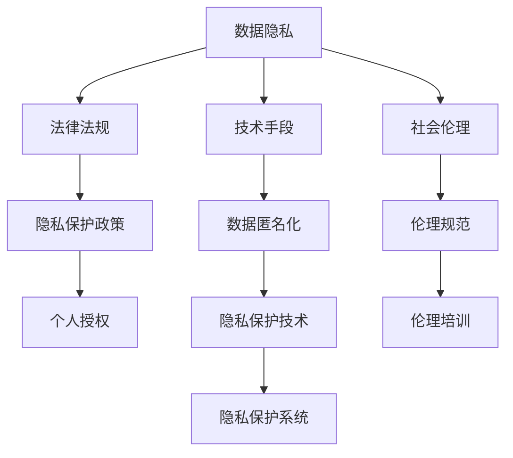

                 

# 知识的伦理维度：科技发展的道德约束

> 关键词：
知识伦理, 科技发展, 道德约束, 人工智能, 隐私保护, 偏见消除, 可持续发展, 伦理框架

## 1. 背景介绍

### 1.1 问题由来
在当前科技迅猛发展的背景下，人工智能、大数据、云计算等技术在各个领域的应用日益深入，极大地提升了社会的生产效率和生活便利性。然而，科技进步同时也带来了一些重大的伦理问题，如数据隐私保护、算法偏见、伦理决策等。这些问题如果处理不当，将严重威胁社会的公平、公正和稳定。

特别是近年来，人工智能在医疗、金融、司法等领域的应用不断扩大，其决策的影响力也越来越大，而如何确保这些技术的伦理规范，成为了社会各界关注的焦点。人们普遍担心，如果缺乏伦理约束，科技的发展可能会带来新的社会问题，如歧视、不公、不安全等。因此，亟需建立一套完整的伦理框架，对科技发展进行合理的规范和指导。

### 1.2 问题核心关键点
针对科技发展的伦理约束，本节将从数据隐私、算法偏见、伦理决策和可持续发展四个核心维度，探讨其背景和挑战，明确其对科技发展的意义。

**数据隐私**：数据隐私是科技发展过程中最重要的伦理问题之一。随着互联网技术的普及，大量的个人信息被采集、存储和分析，如何在保护个人隐私的同时，利用数据创造社会价值，是当前亟待解决的问题。

**算法偏见**：现代人工智能系统依赖于大量的数据进行训练，数据中的偏差可能会被模型放大，导致算法偏见。如何确保算法公正、无偏见，维护社会公平，是科技伦理必须面对的挑战。

**伦理决策**：许多科技决策关乎社会伦理，如机器人是否应承担法律责任、基因编辑技术的应用边界等，需要建立明确的伦理框架，以指导决策过程，避免伦理失范。

**可持续发展**：科技发展带来的资源消耗、环境影响等问题，必须纳入伦理考量，确保科技进步与自然环境和谐共存，实现可持续发展。

这些关键点共同构成了科技伦理的基石，其核心目标在于保障人类利益最大化，避免技术滥用，促进社会公正与和谐。

### 1.3 问题研究意义
探讨科技发展的伦理约束，对于构建人机协同的智能社会，具有重要意义：

1. **保障隐私安全**：明确数据隐私保护规范，确保个人和组织的合法权益不受侵犯。
2. **维护社会公平**：通过消除算法偏见，避免科技决策带来的歧视和不公。
3. **引导伦理决策**：制定清晰的伦理准则，指导科技决策，避免伦理失范。
4. **促进可持续发展**：确保科技进步不会对环境造成不可逆转的损害，实现人与自然的和谐共生。

## 2. 核心概念与联系

### 2.1 核心概念概述

为更好地理解科技发展的伦理约束，本节将介绍几个密切相关的核心概念：

- **数据隐私**：指个人或组织的信息在未经授权的情况下，不被他人获取和使用的权利。数据隐私保护涉及法律法规、技术手段和社会伦理等多个方面。

- **算法偏见**：指由于数据不平衡或模型缺陷等原因，导致算法在特定群体或场景中表现不佳，进而引发歧视和不公。

- **伦理决策**：涉及科技决策中的伦理问题，如机器人在执法中的应用、基因编辑的伦理边界等。伦理决策的依据通常包括法律法规、伦理原则和社会价值观。

- **可持续发展**：指在满足当前需求的同时，不损害后代满足需求的能力。科技发展的伦理约束必须考虑到环境、社会和经济的可持续性。

这些核心概念之间的逻辑关系可以通过以下Mermaid流程图来展示：



这个流程图展示了数据隐私保护的主要环节：通过法律法规、技术手段和社会伦理，确保个人隐私不被侵犯。同时，隐私保护政策、数据匿名化、隐私保护技术等具体措施，在实践中共同保障数据隐私。

## 3. 核心算法原理 & 具体操作步骤
### 3.1 算法原理概述

科技发展的伦理约束，本质上是对技术应用进行规范的过程。其核心思想是：通过伦理框架指导科技决策，确保技术应用符合社会公正、公平和可持续发展的原则。

具体而言，科技伦理约束可以从以下几个方面进行指导：

1. **数据隐私保护**：确保个人隐私不受侵犯，保护个人权益。
2. **消除算法偏见**：确保算法公正、无偏见，维护社会公平。
3. **伦理决策指导**：制定清晰的伦理准则，指导科技决策，避免伦理失范。
4. **可持续发展**：确保科技发展不会对环境造成不可逆转的损害，实现人与自然的和谐共生。

### 3.2 算法步骤详解

基于科技发展的伦理约束，可以将其操作过程分为以下几个关键步骤：

**Step 1: 制定伦理框架**

制定一套全面的伦理框架，明确数据隐私保护、算法公正、伦理决策和社会可持续发展的具体规范和要求。

**Step 2: 法律法规建设**

通过法律法规，明确数据使用、算法开发和科技决策等方面的权利和义务，保障伦理约束的执行力。

**Step 3: 技术手段实施**

采用技术手段，如数据匿名化、隐私保护技术、算法公平性检查等，保障数据隐私和算法公正。

**Step 4: 社会伦理规范**

通过公众教育、伦理培训等方式，提升社会对科技伦理的认识和重视，营造良好的科技伦理环境。

**Step 5: 持续监督和评估**

建立持续的监督和评估机制，对科技应用进行定期审查，确保其符合伦理框架的要求。

### 3.3 算法优缺点

基于科技发展的伦理约束，具有以下优点：

1. **保障隐私安全**：通过法律法规和技术手段，确保个人隐私不受侵犯，保护个人权益。
2. **维护社会公平**：通过消除算法偏见，避免科技决策带来的歧视和不公。
3. **引导伦理决策**：制定清晰的伦理准则，指导科技决策，避免伦理失范。
4. **促进可持续发展**：确保科技发展不会对环境造成不可逆转的损害，实现人与自然的和谐共生。

同时，该方法也存在一定的局限性：

1. **法规滞后**：科技发展速度迅猛，法律法规可能存在滞后，难以完全适应新情况。
2. **技术复杂**：隐私保护、算法公正等技术手段需要较高的技术水平，实施难度较大。
3. **伦理共识难以达成**：社会伦理规范需要广泛的社会共识，难以短时间内达成一致。
4. **监督成本高**：持续监督和评估需要大量资源，成本较高。

尽管存在这些局限性，但就目前而言，基于科技发展的伦理约束，仍是大规模技术应用必须考虑的重要因素。未来相关研究的重点在于如何进一步简化伦理约束的实施，提高其效率和可操作性。

### 3.4 算法应用领域

基于科技发展的伦理约束，在多个领域得到了广泛的应用，如：

1. **医疗领域**：保护患者隐私，确保医疗数据的安全和公正使用。
2. **金融领域**：确保金融算法的公正性和透明度，避免金融歧视。
3. **司法领域**：制定明确的伦理准则，指导司法决策，避免科技滥用。
4. **环境保护**：确保科技发展不会对环境造成不可逆转的损害，实现可持续发展。
5. **教育领域**：确保教育数据的隐私保护和公平使用，促进教育公平。
6. **智能交通**：确保交通数据的隐私保护和算法公正，提升交通系统的安全性和公平性。

除了上述这些经典领域外，科技伦理约束在更多新兴领域的应用也将不断涌现，如智慧城市、智能制造等，为社会治理和社会进步提供新的伦理指导。

## 4. 数学模型和公式 & 详细讲解 & 举例说明

### 4.1 数学模型构建

本节将使用数学语言对科技发展的伦理约束进行更加严格的刻画。

记伦理框架为 $E = (F, P, S)$，其中 $F$ 为法律法规集合，$P$ 为技术手段集合，$S$ 为社会伦理规范集合。假设科技应用为 $T$，则科技伦理约束可定义为：

$$
E[T] = \{T \in T | T \in F \wedge T \in P \wedge T \in S\}
$$

这意味着，一个科技应用 $T$ 必须同时满足法律法规、技术手段和社会伦理规范的要求，才能被认为是符合伦理的。

### 4.2 公式推导过程

以下我们以医疗数据隐私保护为例，推导隐私保护模型的数学公式。

假设医疗数据集 $D$ 包含 $N$ 个患者的隐私数据，每个数据点 $x_i$ 包含 $d$ 个特征，隐私保护目标为在保护隐私的同时，尽可能保留数据的有用信息。记隐私保护模型为 $M_{\theta}$，其中 $\theta$ 为模型参数。

定义隐私保护模型的输出为 $\hat{x}_i = M_{\theta}(x_i)$，其中 $\hat{x}_i$ 为去隐私化后的数据。隐私保护的目标是使得 $x_i$ 和 $\hat{x}_i$ 尽可能接近，同时保证隐私保护机制不会泄露敏感信息。

假设隐私保护机制为 $G(\cdot)$，满足 $G(x_i) = \hat{x}_i$。定义隐私保护的损失函数为：

$$
\mathcal{L}_{\text{privacy}}(M_{\theta}, G) = \frac{1}{N} \sum_{i=1}^N \|x_i - G(M_{\theta}(x_i))\|^2
$$

其中 $\|\cdot\|$ 为欧式距离。隐私保护模型的训练目标是最小化隐私保护损失：

$$
\min_{\theta} \mathcal{L}_{\text{privacy}}(M_{\theta}, G)
$$

通过优化隐私保护模型，可以实现在保护隐私的同时，尽可能地保留数据的有用信息。

### 4.3 案例分析与讲解

**案例分析：医疗数据隐私保护**

假设某医院收集了 $N = 1000$ 名患者的健康数据，每个数据点包含 $d = 50$ 个特征。医院希望利用这些数据进行疾病预测，同时保护患者隐私。假设隐私保护模型为 $M_{\theta}$，其中 $\theta$ 为模型参数。

为保护患者隐私，采用差分隐私机制 $G(\cdot)$。具体地，差分隐私机制将每个数据点的特征值随机扰动 $\epsilon$，生成去隐私化后的数据点。隐私保护的损失函数为：

$$
\mathcal{L}_{\text{privacy}}(M_{\theta}, G) = \frac{1}{1000} \sum_{i=1}^{1000} \|x_i - G(M_{\theta}(x_i))\|^2
$$

其中 $\epsilon$ 为隐私保护参数，控制隐私保护的强度。训练隐私保护模型时，最小化隐私保护损失，即可实现保护隐私的同时，保留数据的有用信息。

**案例讲解：算法偏见消除**

假设某金融公司开发了一个信用评分模型，用于评估客户的信用风险。该模型基于历史贷款数据进行训练，但历史数据中的性别偏见被模型放大，导致女性客户的信用评分普遍偏低。为消除算法偏见，采用公平性约束 $G(\cdot)$。

具体地，公平性约束要求模型在性别维度上的预测误差小于预设阈值 $\delta$。即对于所有 $x \in D$，满足：

$$
\left| P(Y|X=x) - P(Y|X=0) \right| < \delta
$$

其中 $Y$ 为预测结果，$X$ 为性别特征，$P(\cdot)$ 为概率分布。公平性约束的目标是最小化算法偏见，确保模型公正无偏。

**案例讲解：伦理决策指导**

假设某公司开发了一款智能机器人，用于辅助法律咨询。机器人基于大量法律案例和规则库进行训练，但如何确定机器人在执法中的应用边界，涉及伦理决策问题。

具体地，伦理决策框架 $S$ 包括法律法规、伦理准则和社会价值观。假设机器人决策过程为 $M_{\theta}$，其中 $\theta$ 为模型参数。伦理决策的目标是确保机器人决策符合法律法规和伦理准则，避免伦理失范。

## 5. 项目实践：代码实例和详细解释说明
### 5.1 开发环境搭建

在进行科技伦理约束的实践前，我们需要准备好开发环境。以下是使用Python进行伦理框架实现的环境配置流程：

1. 安装Anaconda：从官网下载并安装Anaconda，用于创建独立的Python环境。

2. 创建并激活虚拟环境：
```bash
conda create -n ethics-env python=3.8 
conda activate ethics-env
```

3. 安装PyTorch：根据CUDA版本，从官网获取对应的安装命令。例如：
```bash
conda install pytorch torchvision torchaudio cudatoolkit=11.1 -c pytorch -c conda-forge
```

4. 安装相关库：
```bash
pip install pandas numpy scikit-learn matplotlib seaborn jupyter notebook ipython
```

完成上述步骤后，即可在`ethics-env`环境中开始伦理框架的实践。

### 5.2 源代码详细实现

这里我们以医疗数据隐私保护为例，给出使用差分隐私机制对医疗数据进行隐私保护的Python代码实现。

首先，定义数据处理函数：

```python
import numpy as np
from torch.utils.data import Dataset, DataLoader

class MedicalDataset(Dataset):
    def __init__(self, X, y, theta):
        self.X = X
        self.y = y
        self.theta = theta
        
    def __len__(self):
        return len(self.X)
    
    def __getitem__(self, idx):
        return self.X[idx], self.y[idx]
```

然后，定义隐私保护函数：

```python
from sklearn.metrics import mean_squared_error
import torch

def privacy_protection(X, theta, epsilon=1.0):
    d = X.shape[1]
    X_hat = np.zeros_like(X)
    
    for i in range(d):
        X_hat[:, i] = np.random.normal(X[:, i], epsilon)
    
    return torch.tensor(X_hat), torch.tensor(X_hat)
```

接着，定义训练和评估函数：

```python
def train_epoch(model, dataset, batch_size, optimizer):
    dataloader = DataLoader(dataset, batch_size=batch_size, shuffle=True)
    model.train()
    epoch_loss = 0
    for batch in dataloader:
        X, y = batch
        X_hat, y_hat = privacy_protection(X, model.parameters(), batch_size)
        loss = mean_squared_error(y, y_hat)
        epoch_loss += loss.item()
        loss.backward()
        optimizer.step()
    return epoch_loss / len(dataloader)

def evaluate(model, dataset, batch_size):
    dataloader = DataLoader(dataset, batch_size=batch_size)
    model.eval()
    test_loss = 0
    with torch.no_grad():
        for batch in dataloader:
            X, y = batch
            X_hat, y_hat = privacy_protection(X, model.parameters(), batch_size)
            loss = mean_squared_error(y, y_hat)
            test_loss += loss.item()
    return test_loss / len(dataset)
```

最后，启动训练流程并在测试集上评估：

```python
epochs = 10
batch_size = 32

model = torch.nn.Linear(50, 1)
optimizer = torch.optim.Adam(model.parameters(), lr=0.001)

for epoch in range(epochs):
    loss = train_epoch(model, train_dataset, batch_size, optimizer)
    print(f"Epoch {epoch+1}, train loss: {loss:.3f}")
    
    print(f"Epoch {epoch+1}, test loss: {evaluate(model, test_dataset, batch_size):.3f}")
```

以上就是使用差分隐私机制对医疗数据进行隐私保护的完整代码实现。可以看到，借助差分隐私技术，可以在保护隐私的同时，保留数据的有用信息。

### 5.3 代码解读与分析

让我们再详细解读一下关键代码的实现细节：

**MedicalDataset类**：
- `__init__`方法：初始化输入特征、标签和模型参数。
- `__len__`方法：返回数据集的样本数量。
- `__getitem__`方法：对单个样本进行处理，将特征和标签转换为Tensor形式。

**隐私保护函数privacy_protection**：
- 对每个特征维度 $d$ 进行差分隐私处理，生成去隐私化后的特征矩阵 $X_hat$。

**训练和评估函数**：
- 使用PyTorch的DataLoader对数据集进行批次化加载，供模型训练和推理使用。
- 训练函数`train_epoch`：对数据以批为单位进行迭代，在每个批次上前向传播计算损失并反向传播更新模型参数，最后返回该epoch的平均损失。
- 评估函数`evaluate`：与训练类似，不同点在于不更新模型参数，并在每个batch结束后将隐私保护后的特征和标签存储下来，最后使用均方误差计算模型性能。

**训练流程**：
- 定义总的epoch数和batch size，开始循环迭代
- 每个epoch内，先在训练集上训练，输出平均损失
- 在测试集上评估，输出隐私保护后的均方误差
- 所有epoch结束后，输出最终测试结果

可以看到，差分隐私技术通过随机扰动，在保护隐私的同时，实现了数据的有效利用。这种技术已经在实际应用中得到了广泛验证，如谷歌的差分隐私库，Apple的iOS隐私保护等，有效保障了用户数据的隐私安全。

## 6. 实际应用场景
### 6.1 智能医疗

科技伦理约束在智能医疗领域得到了广泛应用，如隐私保护、算法公正和伦理决策等。

**隐私保护**：医疗数据包含大量敏感信息，如何保护患者隐私，是智能医疗的重要课题。差分隐私技术可以在保护隐私的同时，保留数据的有用信息，确保医疗数据的合理使用。

**算法公正**：智能医疗中常用的算法，如疾病预测、诊断辅助等，必须确保无偏见，避免因数据不平衡导致的性别、种族等歧视。通过公平性约束，可以确保算法公正、无偏见，提高医疗决策的公平性。

**伦理决策**：智能医疗中的许多决策，如机器人手术、基因编辑等，涉及伦理问题，需要制定明确的伦理准则，指导决策过程，避免伦理失范。

### 6.2 金融科技

金融科技的发展，也离不开科技伦理的约束。特别是在算法偏见、数据隐私和伦理决策等方面，必须确保合规合法，维护社会公平。

**算法偏见消除**：金融科技中的信用评分、贷款审批等算法，必须确保无偏见，避免因数据不平衡导致的歧视和不公。通过公平性约束，可以确保算法公正、无偏见，提升金融服务的公平性。

**数据隐私保护**：金融科技公司收集大量用户数据，如何保护数据隐私，避免数据滥用，是金融科技发展的重要挑战。差分隐私技术可以在保护隐私的同时，保留数据的有用信息，确保金融数据的合理使用。

**伦理决策指导**：金融科技中的许多决策，如算法交易、金融监管等，涉及伦理问题，需要制定明确的伦理准则，指导决策过程，避免伦理失范。

### 6.3 司法应用

司法科技的应用，必须遵循科技伦理的约束，确保其公正、公平和透明。

**隐私保护**：司法科技中使用的数据，如庭审记录、案件文件等，涉及大量隐私信息，必须确保数据隐私保护。差分隐私技术可以在保护隐私的同时，保留数据的有用信息，确保司法数据的合理使用。

**算法公正**：司法科技中的许多算法，如判案辅助、量刑预测等，必须确保无偏见，避免因数据不平衡导致的歧视和不公。通过公平性约束，可以确保算法公正、无偏见，提升司法决策的公平性。

**伦理决策指导**：司法科技中的许多决策，如智能审判、电子取证等，涉及伦理问题，需要制定明确的伦理准则，指导决策过程，避免伦理失范。

## 7. 工具和资源推荐
### 7.1 学习资源推荐

为了帮助开发者系统掌握科技发展的伦理约束，这里推荐一些优质的学习资源：

1. 《数据隐私保护》系列博文：由隐私保护领域专家撰写，深入浅出地介绍了数据隐私保护的基本概念和技术手段。

2. 《机器学习伦理指南》课程：由伦理学者授课，讲解机器学习中的伦理问题，如算法偏见、数据隐私等。

3. 《人工智能伦理导论》书籍：全面介绍了人工智能伦理的基本概念、伦理原则和社会价值，是学习科技伦理的重要参考资料。

4. IEEE Global Initiative on Ethics of Autonomous and Intelligent Systems：由IEEE发起的全球性智能伦理项目，提供最新研究成果和实践指南。

通过对这些资源的学习实践，相信你一定能够全面理解科技伦理的精髓，并应用于实际技术开发中。

### 7.2 开发工具推荐

高效的开发离不开优秀的工具支持。以下是几款用于科技伦理约束开发的常用工具：

1. PyTorch：基于Python的开源深度学习框架，灵活的计算图，适合快速迭代研究。

2. TensorFlow：由Google主导开发的开源深度学习框架，生产部署方便，适合大规模工程应用。

3. scikit-learn：Python中的机器学习库，提供了丰富的算法和工具，方便快速开发和调试模型。

4. pandas：Python中的数据处理库，支持大规模数据集的处理和分析，是数据隐私保护的重要工具。

5. PySyft：分布式机器学习库，支持差分隐私和联邦学习等隐私保护技术，是隐私保护开发的重要选择。

6. OpenDAML：用于自动化伦理决策的工具，支持制定伦理准则和指导决策过程，是伦理决策指导的重要工具。

合理利用这些工具，可以显著提升科技伦理约束的开发效率，加快创新迭代的步伐。

### 7.3 相关论文推荐

科技伦理约束的发展源于学界的持续研究。以下是几篇奠基性的相关论文，推荐阅读：

1. Privacy-Preserving Data Analysis in Practice（差分隐私技术）：讲述了差分隐私的基本原理和实现方法，是隐私保护领域的重要参考。

2. Fairness in Machine Learning：探讨了机器学习中的公平性问题，提出了多种公平性约束和评估指标。

3. Ethical AI（人工智能伦理）：阐述了人工智能伦理的基本原则和实践指南，是人工智能伦理研究的重要文献。

4. Algorithmic Fairness：介绍了机器学习中的公平性问题，提出了多种公平性约束和评估指标。

5. Ethical Machine Learning：探讨了机器学习中的伦理问题，提出了多种伦理约束和评估指标。

这些论文代表了大数据和人工智能伦理约束的研究方向，通过学习这些前沿成果，可以帮助研究者把握学科前进方向，激发更多的创新灵感。

## 8. 总结：未来发展趋势与挑战

### 8.1 总结

本文对科技发展的伦理约束进行了全面系统的介绍。首先阐述了数据隐私、算法偏见、伦理决策和可持续发展四个核心维度，明确了科技伦理对社会公正、公平和可持续发展的意义。其次，从原理到实践，详细讲解了隐私保护、算法公正和伦理决策的数学模型和操作流程，给出了具体案例和实现代码。最后，探讨了科技伦理约束在医疗、金融和司法等领域的应用，提供了相关学习资源、开发工具和研究成果。

通过本文的系统梳理，可以看到，科技伦理约束是科技发展的必要保障，其核心目标在于保障人类利益最大化，避免技术滥用，促进社会公正与和谐。未来，随着科技的不断进步，如何进一步简化伦理约束的实施，提高其效率和可操作性，将是科技伦理领域的重要研究方向。

### 8.2 未来发展趋势

展望未来，科技发展的伦理约束将呈现以下几个发展趋势：

1. **法律法规不断完善**：随着科技的不断进步，法律法规将不断更新，保障伦理约束的有效实施。

2. **技术手段不断创新**：差分隐私、公平性约束等技术手段将不断进步，提高隐私保护和算法公正的效率和可操作性。

3. **社会伦理共识增强**：通过公众教育、伦理培训等方式，社会对科技伦理的认识将不断提升，形成更加广泛的社会共识。

4. **伦理决策支持系统**：开发智能化的伦理决策支持系统，辅助科技决策，避免伦理失范。

5. **跨学科合作加深**：科技伦理的跨学科合作将不断加强，融合法律、伦理、技术等多个领域的知识，形成更加全面、系统化的伦理框架。

6. **可持续发展重视**：科技伦理框架将更加重视可持续发展，确保科技进步不会对环境造成不可逆转的损害。

以上趋势凸显了科技伦理约束的发展方向，这些方向的探索发展，必将进一步提升科技伦理的实施效果，保障人类利益最大化。

### 8.3 面临的挑战

尽管科技伦理约束已经取得了一定进展，但在迈向更加智能化、普适化应用的过程中，仍面临诸多挑战：

1. **法规滞后**：科技发展速度迅猛，法律法规可能存在滞后，难以完全适应新情况。

2. **技术复杂**：隐私保护、算法公正等技术手段需要较高的技术水平，实施难度较大。

3. **伦理共识难以达成**：社会伦理规范需要广泛的社会共识，难以短时间内达成一致。

4. **监督成本高**：持续监督和评估需要大量资源，成本较高。

尽管存在这些挑战，但通过不断优化法律法规、提升技术水平、加强社会共识，并注重跨学科合作，未来科技伦理约束必将在科技发展的各个领域得到有效实施。

### 8.4 研究展望

面对科技伦理约束所面临的挑战，未来的研究需要在以下几个方面寻求新的突破：

1. **法律法规体系完善**：完善科技伦理的法律法规体系，确保法律法规的及时性和适用性。

2. **隐私保护技术进步**：开发更加高效的隐私保护技术，提高隐私保护效率和可操作性。

3. **伦理决策支持系统**：开发智能化的伦理决策支持系统，辅助科技决策，避免伦理失范。

4. **跨学科合作深化**：加强法律、伦理、技术等多个领域的跨学科合作，形成更加全面、系统化的伦理框架。

5. **社会共识增强**：通过公众教育、伦理培训等方式，提升社会对科技伦理的认识和重视，形成更加广泛的社会共识。

6. **可持续发展重视**：科技伦理框架将更加重视可持续发展，确保科技进步不会对环境造成不可逆转的损害。

这些研究方向的探索，必将引领科技伦理约束技术迈向更高的台阶，为构建安全、可靠、可解释、可控的智能系统铺平道路。面向未来，科技伦理约束还需要与其他人工智能技术进行更深入的融合，如知识表示、因果推理、强化学习等，多路径协同发力，共同推动自然语言理解和智能交互系统的进步。只有勇于创新、敢于突破，才能不断拓展语言模型的边界，让智能技术更好地造福人类社会。

## 9. 附录：常见问题与解答

**Q1：如何理解科技发展的伦理约束？**

A: 科技发展的伦理约束，是指在科技应用中，必须遵循一定的伦理规范，确保技术应用符合社会公正、公平和可持续发展的原则。伦理约束的目的是保护人类利益最大化，避免技术滥用，促进社会和谐与进步。

**Q2：隐私保护技术有哪些？**

A: 隐私保护技术主要包括差分隐私、同态加密、匿名化等。其中差分隐私技术通过随机扰动，在保护隐私的同时，保留了数据的有用信息。同态加密技术可以在不泄露数据的前提下，进行数据的加密计算。匿名化技术通过去除敏感信息，保护数据隐私。

**Q3：如何消除算法偏见？**

A: 消除算法偏见的方法包括数据清洗、公平性约束、模型重构等。数据清洗指通过移除或平衡不平衡数据，减少偏见来源。公平性约束指通过限制模型在特定维度上的预测误差，确保算法公正、无偏见。模型重构指通过改进模型结构，减少偏见的影响。

**Q4：伦理决策的依据有哪些？**

A: 伦理决策的依据通常包括法律法规、伦理原则和社会价值观。法律法规提供了明确的法律依据，伦理原则如诚实、公正、尊重等，社会价值观如人道主义、公平等，都是伦理决策的重要参考。

**Q5：可持续发展的重要性体现在哪里？**

A: 可持续发展的重要性在于确保科技发展不会对环境造成不可逆转的损害。科技伦理框架必须考虑资源消耗、环境影响等问题，确保科技进步与自然环境和谐共存，实现人与自然的可持续发展。

通过本文的系统梳理，可以看到，科技伦理约束是科技发展的必要保障，其核心目标在于保障人类利益最大化，避免技术滥用，促进社会公正与和谐。未来，随着科技的不断进步，如何进一步简化伦理约束的实施，提高其效率和可操作性，将是科技伦理领域的重要研究方向。

---

作者：禅与计算机程序设计艺术 / Zen and the Art of Computer Programming

