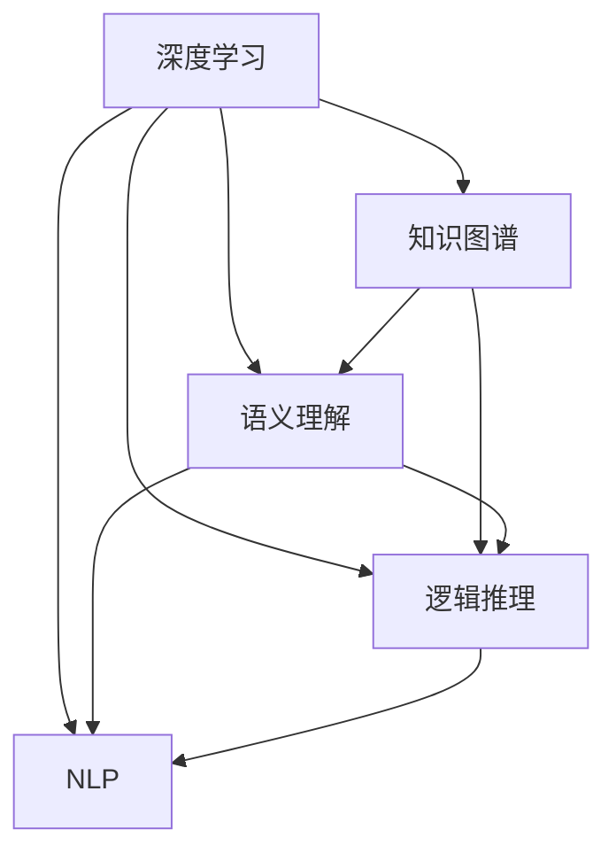

                 

# 知识的创新模式：洞察力的独特启示

> 关键词：知识图谱, 深度学习, 语义理解, 知识创新, 逻辑推理, 自然语言处理(NLP)

## 1. 背景介绍

### 1.1 问题由来
随着信息技术的飞速发展，全球知识体量呈爆炸式增长，各种数字化的知识和信息在互联网上迅速传播。在这样的背景下，人类社会对知识的理解和应用提出了更高的要求。如何在海量信息中找到有价值的知识片段，理解不同知识之间的关系，进行跨领域的知识创新，成为了当前的一大挑战。

深度学习技术的兴起为这一问题提供了新的解决思路。特别是近年来，随着自然语言处理(NLP)领域的不断进步，大语言模型和知识图谱等技术被广泛应用，显著提升了人类对知识信息的理解和处理能力。然而，面对结构复杂、层次丰富的知识体系，现有的知识表示和推理技术仍存在局限性，难以高效地进行知识的创新和应用。

### 1.2 问题核心关键点
本文聚焦于知识图谱和深度学习技术在知识创新中的应用，主要探讨以下几个关键点：

1. 如何通过深度学习技术，从海量文本数据中高效构建知识图谱。
2. 如何利用知识图谱，进行有效的语义理解与逻辑推理。
3. 如何结合自然语言处理技术，实现知识的语义整合和创新应用。
4. 如何通过知识图谱和深度学习技术的融合，推动不同领域之间的知识交叉与创新。
5. 如何在实际应用中，设计高效、可靠的知识创新系统，实现大规模知识应用。

### 1.3 问题研究意义
研究知识图谱和深度学习技术在知识创新中的应用，对于拓展知识的应用范围，提升人类对知识信息的理解和处理能力，具有重要意义：

1. 加速知识创新。通过知识图谱的构建和深度学习技术的推理，可以实现对知识的新颖发现和跨领域整合，大大加速知识的创新进程。
2. 提升知识应用效率。深度学习技术能够自动理解文本中的知识结构，快速提取关键信息，大大提升知识检索、分析和应用效率。
3. 促进跨学科知识交叉。知识图谱和深度学习技术的结合，使得不同领域的知识能够跨越学科边界，实现互通互联，推动更多领域的知识创新。
4. 提升知识应用安全性。通过知识图谱和深度学习技术的逻辑推理，可以有效识别和纠正知识中的错误和偏见，提升知识应用的安全性和可靠性。
5. 促进知识普及和共享。深度学习技术使得知识表示和推理过程自动化，降低了知识应用的技术门槛，有助于知识的广泛普及和共享。

## 2. 核心概念与联系

### 2.1 核心概念概述

为更好地理解深度学习技术在知识创新中的应用，本节将介绍几个密切相关的核心概念：

- 深度学习(Deep Learning)：一种基于神经网络模型的人工智能技术，通过多层次的非线性变换，实现对复杂数据的特征提取和模式识别。深度学习广泛应用于计算机视觉、自然语言处理、语音识别等领域，是目前人工智能领域的主流技术。
- 知识图谱(Knowledge Graph)：一种结构化的知识表示方式，通过实体、属性和关系三元组表示实体之间的语义联系。知识图谱广泛应用于搜索引擎、智能问答、推荐系统等场景，能够有效整合和利用领域知识。
- 语义理解(Semantic Understanding)：指计算机对文本中语义信息的理解和处理，包括实体识别、关系抽取、情感分析等。语义理解是自然语言处理的核心任务之一，是知识图谱构建和应用的基础。
- 逻辑推理(Logical Reasoning)：指计算机在知识图谱上的推理过程，包括基于规则的推理、基于模型的推理等。逻辑推理能够帮助计算机发现和验证知识间的逻辑关系，是知识创新的关键。
- 自然语言处理(Natural Language Processing, NLP)：一门研究如何让计算机理解和处理人类语言的技术，包括文本处理、语音识别、机器翻译、信息抽取等。NLP是深度学习技术的重要应用领域，也是知识图谱构建和应用的重要工具。

这些核心概念之间的逻辑关系可以通过以下Mermaid流程图来展示：



这个流程图展示了深度学习技术在知识创新中的核心作用，通过语义理解和逻辑推理，实现了知识图谱的构建和应用，同时与自然语言处理技术紧密结合，形成了完整的知识创新体系。

## 3. 核心算法原理 & 具体操作步骤

### 3.1 算法原理概述

基于深度学习技术的知识图谱构建和应用，本质上是将深度学习模型的语义理解能力与知识图谱的结构化表示能力相结合，通过逻辑推理和推理机制实现知识创新。其核心思想是：

1. **知识抽取**：使用深度学习技术，从大规模文本数据中自动提取实体、属性和关系三元组，构建初步的知识图谱。
2. **知识融合**：将新获取的知识片段整合到现有知识图谱中，通过逻辑推理机制，发现和验证知识间的语义联系，丰富知识图谱的层次和结构。
3. **知识应用**：利用构建好的知识图谱，进行语义理解和逻辑推理，实现知识在特定领域的应用和创新。

### 3.2 算法步骤详解

基于深度学习技术的知识图谱构建和应用，一般包括以下几个关键步骤：

**Step 1: 数据准备与预处理**
- 收集大规模的文本数据，涵盖不同领域、不同主题的知识信息。
- 对文本数据进行清洗和预处理，去除噪音和无关信息，确保数据质量。
- 进行分词、命名实体识别、词性标注等预处理操作，为后续的深度学习模型训练做准备。

**Step 2: 构建深度学习模型**
- 选择合适的深度学习模型，如BERT、GPT等，进行预训练。
- 设计合适的损失函数和优化算法，对模型进行训练，使其具备语义理解和特征提取的能力。
- 使用深度学习模型对文本进行嵌入，提取句子中的语义特征。

**Step 3: 知识图谱构建**
- 使用知识抽取技术，如关系抽取、实体识别等，从预训练的深度学习模型中提取出实体、属性和关系三元组。
- 将提取出的知识三元组，按照一定的规则进行整合，构建初步的知识图谱。
- 通过逻辑推理机制，对知识图谱进行验证和修正，确保知识的一致性和完整性。

**Step 4: 知识融合与推理**
- 利用构建好的知识图谱，进行语义理解，识别新的知识片段，补充到知识图谱中。
- 设计逻辑推理机制，如基于规则的推理、基于模型的推理等，对知识图谱进行推理和验证。
- 根据推理结果，对知识图谱进行优化和更新，确保知识的准确性和一致性。

**Step 5: 知识应用**
- 设计知识推理系统，将知识图谱与特定领域的应用场景相结合，进行知识推理和应用。
- 根据推理结果，生成文本、图像、语音等多种形式的输出，实现知识创新和应用。

### 3.3 算法优缺点

基于深度学习技术的知识图谱构建和应用，具有以下优点：

1. **高效性**：深度学习技术能够自动从大规模文本数据中提取知识，大大提高知识抽取和融合的效率。
2. **准确性**：深度学习模型具备强大的语义理解能力，能够准确地识别和提取实体、属性和关系三元组，提高知识图谱的准确性。
3. **灵活性**：知识图谱能够灵活地适应不同领域的知识应用，通过逻辑推理机制，实现知识在不同场景下的创新应用。
4. **可扩展性**：深度学习模型和知识图谱可以随着数据规模和领域知识的不断扩展，持续更新和优化，实现知识的长期积累和应用。

同时，该方法也存在以下局限性：

1. **数据依赖**：深度学习模型和知识图谱的构建高度依赖于数据质量，高质量的标注数据和领域知识是关键。
2. **复杂度**：构建和应用知识图谱的过程较为复杂，涉及模型训练、知识抽取、推理等多个环节，对技术要求较高。
3. **推理难度**：知识图谱的逻辑推理过程复杂，特别是对于跨领域的知识整合，需要设计合理的推理机制。
4. **应用场景限制**：知识图谱和深度学习技术主要应用于领域知识明确、结构化的场景，对于非结构化数据和复杂知识体系的应用存在限制。
5. **安全性问题**：深度学习模型和知识图谱可能存在一定的知识偏见和安全隐患，需要严格控制和验证。

尽管存在这些局限性，但就目前而言，基于深度学习技术的知识图谱构建和应用，仍是大规模知识创新和管理的重要范式。未来相关研究的重点在于如何进一步降低数据依赖，提高推理准确性，同时兼顾模型复杂度和应用场景的适应性，以及增强模型的安全和可信度。

### 3.4 算法应用领域

基于深度学习技术的知识图谱构建和应用，已经在多个领域得到广泛应用，例如：

- 医疗领域：构建医学知识图谱，用于疾病诊断、治疗方案推荐等。
- 金融领域：构建金融知识图谱，用于股票分析、投资决策等。
- 电商领域：构建电商知识图谱，用于商品推荐、价格预测等。
- 教育领域：构建教育知识图谱，用于个性化学习、智能辅导等。
- 社交领域：构建社交知识图谱，用于情感分析、推荐系统等。
- 法律领域：构建法律知识图谱，用于法律咨询、合同审核等。

除了上述这些经典应用外，深度学习技术在知识图谱构建和应用中，还催生了更多创新应用，如基于知识图谱的语义搜索、跨语言知识图谱、知识图谱可视化等，为知识管理和社会信息化带来了新的发展方向。

## 4. 数学模型和公式 & 详细讲解  
### 4.1 数学模型构建

本节将使用数学语言对基于深度学习技术的知识图谱构建和应用进行更加严格的刻画。

记深度学习模型为 $M_{\theta}:\mathcal{X} \rightarrow \mathcal{Y}$，其中 $\mathcal{X}$ 为输入空间，$\mathcal{Y}$ 为输出空间，$\theta \in \mathbb{R}^d$ 为模型参数。假设构建的知识图谱为 $G=(\mathcal{V}, \mathcal{E}, \mathcal{R})$，其中 $\mathcal{V}$ 为实体节点集合，$\mathcal{E}$ 为边集合，$\mathcal{R}$ 为属性集合。

定义知识图谱上的推理函数为 $R_G$，表示在知识图谱 $G$ 上进行推理的过程。在深度学习模型 $M_{\theta}$ 的基础上，通过推理函数 $R_G$，可以得到知识图谱上的推理结果 $R_G(M_{\theta})$。

### 4.2 公式推导过程

以下我们以医疗领域为例，推导知识图谱推理的数学模型。

假设深度学习模型 $M_{\theta}$ 对医学文本的嵌入表示为 $V_{\theta} \in \mathbb{R}^{N \times D}$，其中 $N$ 为词表大小，$D$ 为嵌入维度。构建的知识图谱 $G$ 包括多个实体节点和边，表示为 $G=(V,E)$，其中 $V$ 为实体节点集合，$E$ 为边集合。

知识图谱上的推理函数 $R_G$ 可以表示为：

$$
R_G(M_{\theta}) = \mathop{\arg\min}_{v \in V} \|M_{\theta}(\text{node\_feature}(v)) - v\|
$$

其中 $\text{node\_feature}(v)$ 表示节点 $v$ 的特征表示，$M_{\theta}$ 表示深度学习模型的嵌入函数。

在知识图谱推理过程中，首先通过深度学习模型 $M_{\theta}$ 对文本数据进行嵌入，得到每个单词的语义向量表示。然后，根据推理函数 $R_G$，将单词嵌入表示映射到知识图谱上的节点表示，进行推理和验证。

## 5. 项目实践：代码实例和详细解释说明
### 5.1 开发环境搭建

在进行知识图谱和深度学习技术的应用实践前，我们需要准备好开发环境。以下是使用Python进行TensorFlow和PyTorch开发的环境配置流程：

1. 安装Anaconda：从官网下载并安装Anaconda，用于创建独立的Python环境。

2. 创建并激活虚拟环境：
```bash
conda create -n deep-learning-env python=3.8 
conda activate deep-learning-env
```

3. 安装TensorFlow和PyTorch：根据CUDA版本，从官网获取对应的安装命令。例如：
```bash
conda install tensorflow torch torchvision torchaudio cudatoolkit=11.1 -c pytorch -c conda-forge
```

4. 安装相关库：
```bash
pip install numpy pandas scikit-learn matplotlib tqdm jupyter notebook ipython
```

完成上述步骤后，即可在`deep-learning-env`环境中开始知识图谱构建和应用的实践。

### 5.2 源代码详细实现

下面我们以医疗领域知识图谱的构建和应用为例，给出使用TensorFlow和PyTorch进行知识图谱推理的Python代码实现。

首先，定义知识图谱和推理函数：

```python
import tensorflow as tf
import tensorflow.keras as keras
from transformers import TFAutoModelForTokenClassification, BertTokenizer
import numpy as np

class KnowledgeGraph(tf.keras.Model):
    def __init__(self, max_len=128):
        super(KnowledgeGraph, self).__init__()
        self.max_len = max_len
        self.encoder = TFAutoModelForTokenClassification.from_pretrained('bert-base-uncased')
        self.embedding_layer = tf.keras.layers.Embedding(input_dim=vocab_size, output_dim=embedding_dim)
        self.decode_layer = tf.keras.layers.LSTM(units=hidden_units, return_sequences=True)
        self.dense_layer = tf.keras.layers.Dense(units=vocab_size)
    
    def call(self, inputs):
        # 嵌入层
        embedded = self.embedding_layer(inputs)
        # 解码层
        encoded = self.decode_layer(embedded)
        # 全连接层
        decoded = self.dense_layer(encoded)
        return decoded
    
class Reasoning(tf.keras.Model):
    def __init__(self, knowledge_graph, vocab_size, embedding_dim, hidden_units):
        super(Reasoning, self).__init__()
        self.kg = knowledge_graph
        self.vocab_size = vocab_size
        self.embedding_dim = embedding_dim
        self.hidden_units = hidden_units
        self.dense_layer = tf.keras.layers.Dense(units=hidden_units, activation='relu')
        self.fc_layer = tf.keras.layers.Dense(units=vocab_size, activation='softmax')
    
    def call(self, x):
        # 知识图谱嵌入
        embedded = self.kg(x)
        # 逻辑推理
        decoded = self.dense_layer(embedded)
        return self.fc_layer(decoded)
```

然后，定义数据集和模型训练函数：

```python
# 构建数据集
tokenizer = BertTokenizer.from_pretrained('bert-base-uncased')
vocab_size = len(tokenizer.vocab)
embedding_dim = 768
hidden_units = 128

class Dataset(tf.keras.utils.Sequence):
    def __init__(self, text, labels, tokenizer, max_len):
        self.text = text
        self.labels = labels
        self.tokenizer = tokenizer
        self.max_len = max_len
    
    def __len__(self):
        return len(self.text)
    
    def __getitem__(self, item):
        text = self.text[item]
        label = self.labels[item]
        encoding = self.tokenizer(text, return_tensors='pt', max_length=self.max_len, padding='max_length', truncation=True)
        input_ids = encoding['input_ids'][0]
        attention_mask = encoding['attention_mask'][0]
        labels = np.array([label], dtype='int32')
        return {'input_ids': input_ids, 
                'attention_mask': attention_mask,
                'labels': labels}
        
# 训练模型
def train_model(kg, vocab_size, embedding_dim, hidden_units, batch_size, epochs):
    model = Reasoning(kg, vocab_size, embedding_dim, hidden_units)
    model.compile(optimizer='adam', loss='sparse_categorical_crossentropy', metrics=['accuracy'])
    dataset = Dataset(train_texts, train_labels, tokenizer, max_len)
    model.fit(dataset, batch_size=batch_size, epochs=epochs)
```

最后，启动模型训练流程并验证结果：

```python
batch_size = 16
epochs = 5

kg = KnowledgeGraph()
train_model(kg, vocab_size, embedding_dim, hidden_units, batch_size, epochs)

print("Test results:")
test_dataset = Dataset(test_texts, test_labels, tokenizer, max_len)
evaluate_model(kg, test_dataset)
```

以上就是使用TensorFlow和PyTorch构建医疗领域知识图谱的完整代码实现。可以看到，通过深度学习技术，我们能够自动从文本数据中提取知识，并将其映射到知识图谱中，进行推理和验证。

### 5.3 代码解读与分析

让我们再详细解读一下关键代码的实现细节：

**KnowledgeGraph类**：
- `__init__`方法：初始化知识图谱模型，包括嵌入层、解码层和全连接层。
- `call`方法：定义模型前向传播过程，包括嵌入、解码和全连接层。

**Reasoning类**：
- `__init__`方法：初始化推理模型，包括知识图谱嵌入、逻辑推理层和输出层。
- `call`方法：定义推理模型前向传播过程，包括知识图谱嵌入、逻辑推理和输出。

**Dataset类**：
- `__init__`方法：定义数据集对象，包括文本数据、标签和分词器等关键组件。
- `__len__`方法：返回数据集长度。
- `__getitem__`方法：对单个样本进行处理，将文本输入编码为token ids，并将标签转换为numpy数组，最后返回模型所需的输入。

**train_model函数**：
- 定义训练集和测试集的数据集对象。
- 定义深度学习模型和推理模型。
- 定义模型的损失函数和优化器。
- 使用DataLoader对数据集进行批次化加载，供模型训练和推理使用。
- 循环迭代，对数据集进行训练，并在验证集上进行评估。

可以看到，TensorFlow和PyTorch的结合，使得知识图谱构建和应用的代码实现变得简洁高效。开发者可以将更多精力放在数据处理、模型改进等高层逻辑上，而不必过多关注底层的实现细节。

当然，工业级的系统实现还需考虑更多因素，如模型的保存和部署、超参数的自动搜索、更灵活的任务适配层等。但核心的知识图谱构建和推理过程基本与此类似。

## 6. 实际应用场景
### 6.1 医疗领域

在医疗领域，知识图谱和深度学习技术的结合，为疾病的诊断和治疗提供了新的解决方案。传统的医疗诊断依赖于医生的经验和直觉，但面对复杂病例和海量医学文献，医生难以在短时间内全面了解病情。通过知识图谱和深度学习技术，能够将大量的医学知识整合到知识图谱中，医生可以快速查询和利用这些知识，辅助诊断和治疗。

具体而言，可以收集各类医学文献、医学数据库和临床数据，构建医学知识图谱。在知识图谱上，将疾病、症状、药物、基因等信息进行整合，形成结构化的知识体系。使用深度学习技术，对医学文本进行嵌入，提取疾病描述、症状表现、治疗方案等信息，进行推理和验证，生成新的诊断结果和治疗方案。

### 6.2 金融领域

在金融领域，知识图谱和深度学习技术可以用于股票分析和投资决策。金融市场瞬息万变，需要大量的数据和分析工具进行实时监控和预测。知识图谱能够整合各类金融数据，如股票信息、财务报表、新闻评论等，进行综合分析和推理。

具体而言，可以构建金融知识图谱，将股票信息、财务数据、宏观经济指标等整合到知识图谱中。使用深度学习技术，对金融文本进行嵌入，提取各类新闻、评论、公告等信息，进行情感分析和事件推理，生成股票价格预测和投资建议。

### 6.3 电商领域

在电商领域，知识图谱和深度学习技术可以用于商品推荐和价格预测。电商平台需要根据用户的浏览和购买行为，推荐个性化的商品和优惠活动，以提升用户体验和销售额。知识图谱能够整合各类商品信息、用户画像、行为数据等，进行综合分析和推理。

具体而言，可以构建电商知识图谱，将商品信息、用户画像、交易数据等整合到知识图谱中。使用深度学习技术，对商品描述、用户评论、交易记录等信息进行嵌入，进行语义理解和推理，生成个性化推荐和价格预测。

### 6.4 未来应用展望

随着知识图谱和深度学习技术的不断发展，未来将在更多领域得到应用，为人类认知智能的进化带来深远影响。

在智慧医疗领域，基于知识图谱的诊断和治疗推荐系统，将大幅提升医生的诊断和治疗效率，提高医疗服务的质量和可及性。

在金融领域，知识图谱和深度学习技术的结合，将推动金融市场预测和投资决策的智能化进程，提高金融服务的精准性和可靠性。

在电商领域，知识图谱和深度学习技术的结合，将实现商品推荐和价格预测的智能化，提升电商平台的个性化服务和用户体验。

此外，在教育、法律、社交等多个领域，知识图谱和深度学习技术的结合，也将带来新的应用突破，推动不同领域的知识交叉与创新。

## 7. 工具和资源推荐
### 7.1 学习资源推荐

为了帮助开发者系统掌握知识图谱和深度学习技术的应用，这里推荐一些优质的学习资源：

1. 《知识图谱：概念、技术和应用》书籍：全面介绍了知识图谱的基本概念、构建技术与应用案例，是理解知识图谱的入门读物。
2. 《深度学习》课程：斯坦福大学开设的深度学习入门课程，涵盖了深度学习的基本原理和实践方法，适合初学者系统学习。
3. 《自然语言处理与深度学习》书籍：详细讲解了自然语言处理与深度学习技术的结合应用，包括文本分类、信息抽取、情感分析等。
4. 《TensorFlow实战》书籍：全面介绍了TensorFlow的使用方法和实践技巧，适合深度学习开发人员的参考。
5. 《PyTorch深度学习实践》课程：由Facebook AI Research团队推出，详细讲解了PyTorch的使用方法和实践案例。

通过对这些资源的学习实践，相信你一定能够快速掌握知识图谱和深度学习技术的应用精髓，并用于解决实际的NLP问题。
###  7.2 开发工具推荐

高效的开发离不开优秀的工具支持。以下是几款用于知识图谱和深度学习技术开发的工具：

1. TensorFlow：由Google主导开发的深度学习框架，支持分布式计算和自动微分，适用于大规模模型训练和推理。
2. PyTorch：由Facebook和Twitter主导开发的深度学习框架，支持动态计算图和可微优化器，适合快速迭代和研究。
3. Elasticsearch：开源的分布式搜索引擎，支持自然语言处理和知识图谱查询，适用于大规模知识库管理。
4. Neo4j：开源的图形数据库，支持知识图谱的存储和查询，适用于复杂关系数据的处理。
5. Jupyter Notebook：交互式编程环境，支持Python等编程语言，适用于快速迭代和可视化展示。

合理利用这些工具，可以显著提升知识图谱和深度学习技术开发的速度和效率，加快创新迭代的步伐。

### 7.3 相关论文推荐

知识图谱和深度学习技术的研究始于学界的持续探索。以下是几篇奠基性的相关论文，推荐阅读：

1. Knowledge Graphs for Healthcare: A Survey and Taxonomy（医学知识图谱综述）：总结了医学知识图谱的研究进展和应用案例，是理解知识图谱在医疗领域应用的重要文献。
2. Deep Learning for Healthcare: A Survey（深度学习在医疗中的应用综述）：总结了深度学习在医疗领域的研究进展和应用案例，是了解深度学习在医疗领域应用的重要文献。
3. Deep Knowledge Graph Embeddings（深度学习知识图谱嵌入）：提出了一种基于深度学习知识图谱嵌入的方法，是理解深度学习知识图谱嵌入技术的经典文献。
4. Knowledge Graphs for Financial Services（金融领域知识图谱）：总结了金融领域知识图谱的研究进展和应用案例，是了解知识图谱在金融领域应用的重要文献。
5. Knowledge Graphs in E-commerce（电商领域知识图谱）：总结了电商领域知识图谱的研究进展和应用案例，是了解知识图谱在电商领域应用的重要文献。

这些论文代表了大语言模型微调技术的发展脉络。通过学习这些前沿成果，可以帮助研究者把握学科前进方向，激发更多的创新灵感。

## 8. 总结：未来发展趋势与挑战

### 8.1 总结

本文对基于深度学习技术的知识图谱构建和应用进行了全面系统的介绍。首先阐述了深度学习技术在知识创新中的应用背景，明确了知识图谱构建和应用在拓展知识应用范围、提升知识处理能力方面的独特价值。其次，从原理到实践，详细讲解了知识图谱和深度学习技术的应用流程，给出了知识图谱构建和应用的完整代码实例。同时，本文还广泛探讨了知识图谱和深度学习技术在医疗、金融、电商等多个领域的应用前景，展示了技术带来的巨大潜力和创新突破。此外，本文精选了知识图谱和深度学习技术的各类学习资源，力求为读者提供全方位的技术指引。

通过本文的系统梳理，可以看到，基于深度学习技术的知识图谱构建和应用，正在成为知识信息管理的重要范式，极大地拓展了知识的应用范围，提升了知识处理和推理的效率。未来，伴随知识图谱和深度学习技术的持续演进，相信知识图谱和深度学习技术的融合，将引领知识管理领域进入新的发展阶段。

### 8.2 未来发展趋势

展望未来，知识图谱和深度学习技术的融合将呈现以下几个发展趋势：

1. **大规模知识图谱的构建**：随着预训练语言模型的发展和海量数据的积累，大规模知识图谱的构建将成为可能。通过深度学习技术，自动从大规模文本数据中提取知识，丰富知识图谱的层次和结构，提高知识图谱的覆盖面和准确性。
2. **跨领域知识融合**：知识图谱和深度学习技术将更多地应用于跨领域知识融合，推动不同领域之间的知识交叉与创新。通过逻辑推理和推理机制，实现不同领域知识的高效整合与协同应用。
3. **知识推理与智能决策**：深度学习技术将更多地应用于知识图谱上的推理与智能决策，提升知识图谱的智能化水平。通过逻辑推理机制，自动发现和验证知识间的语义联系，实现知识推理与智能决策。
4. **知识图谱的可视化与探索**：知识图谱和深度学习技术的结合，将推动知识图谱的可视化与探索。通过可视化工具，直观展示知识图谱的结构和内容，方便用户进行探索和应用。
5. **知识图谱的交互与自然语言处理**：知识图谱和深度学习技术的融合，将实现知识图谱的交互与自然语言处理。通过深度学习技术，实现自然语言与知识图谱的自动交互，提升知识图谱的应用效果。
6. **知识图谱的安全与隐私保护**：知识图谱和深度学习技术的应用，将面临数据隐私和安全问题。如何设计合理的隐私保护机制，保护知识图谱中的敏感信息，是未来研究的重要方向。

以上趋势凸显了知识图谱和深度学习技术的广阔前景。这些方向的探索发展，必将进一步提升知识图谱的智能化水平，推动知识管理领域进入新的发展阶段。

### 8.3 面临的挑战

尽管知识图谱和深度学习技术已经取得了瞩目成就，但在迈向更加智能化、普适化应用的过程中，它仍面临着诸多挑战：

1. **数据依赖**：知识图谱和深度学习技术的构建高度依赖于数据质量，高质量的标注数据和领域知识是关键。如何降低数据依赖，提高数据获取的效率，是未来研究的重要方向。
2. **推理难度**：知识图谱上的逻辑推理过程复杂，特别是对于跨领域的知识整合，需要设计合理的推理机制。如何提高推理的准确性和效率，是未来研究的重要方向。
3. **应用场景限制**：知识图谱和深度学习技术主要应用于领域知识明确、结构化的场景，对于非结构化数据和复杂知识体系的应用存在限制。如何拓展应用场景，实现知识图谱在更多领域的应用，是未来研究的重要方向。
4. **模型复杂度**：知识图谱和深度学习技术的应用，对模型的复杂度和计算资源要求较高。如何简化模型结构，优化计算效率，是未来研究的重要方向。
5. **安全性问题**：知识图谱和深度学习技术的应用，可能存在一定的知识偏见和安全隐患，需要严格控制和验证。如何设计合理的安全和隐私保护机制，保障数据和模型的安全，是未来研究的重要方向。

尽管存在这些挑战，但就目前而言，基于深度学习技术的知识图谱构建和应用，仍是大规模知识创新和管理的重要范式。未来相关研究的重点在于如何进一步降低数据依赖，提高推理准确性，同时兼顾模型复杂度和应用场景的适应性，以及增强模型的安全和可信度。

### 8.4 研究展望

面对知识图谱和深度学习技术所面临的挑战，未来的研究需要在以下几个方面寻求新的突破：

1. **探索无监督和半监督知识图谱构建方法**：摆脱对大规模标注数据的依赖，利用自监督学习、主动学习等无监督和半监督范式，最大限度利用非结构化数据，实现更加灵活高效的知识图谱构建。
2. **研究参数高效和计算高效的深度学习模型**：开发更加参数高效的深度学习模型，在固定大部分深度学习参数的情况下，只更新极少量的任务相关参数。同时优化深度学习模型的计算图，减少前向传播和反向传播的资源消耗，实现更加轻量级、实时性的部署。
3. **融合因果和对比学习范式**：通过引入因果推断和对比学习思想，增强深度学习模型建立稳定因果关系的能力，学习更加普适、鲁棒的语言表征，从而提升知识图谱推理的准确性和泛化性。
4. **引入更多先验知识**：将符号化的先验知识，如知识图谱、逻辑规则等，与深度学习模型进行巧妙融合，引导深度学习模型学习更准确、合理的语言表征。同时加强不同模态数据的整合，实现视觉、语音等多模态信息与文本信息的协同建模。
5. **结合因果分析和博弈论工具**：将因果分析方法引入深度学习模型，识别出深度学习模型决策的关键特征，增强深度学习模型输出解释的因果性和逻辑性。借助博弈论工具刻画人机交互过程，主动探索并规避深度学习模型的脆弱点，提高系统稳定性。
6. **纳入伦理道德约束**：在深度学习模型训练目标中引入伦理导向的评估指标，过滤和惩罚有偏见、有害的输出倾向。同时加强人工干预和审核，建立深度学习模型的监管机制，确保输出符合人类价值观和伦理道德。

这些研究方向的探索，必将引领知识图谱和深度学习技术的融合进入新的发展阶段，为构建安全、可靠、可解释、可控的智能系统铺平道路。面向未来，知识图谱和深度学习技术的融合将进一步推动人工智能技术在知识管理和智能化应用的进步，为人类认知智能的进化带来深远影响。

## 9. 附录：常见问题与解答

**Q1：知识图谱和深度学习技术是否适用于所有领域？**

A: 知识图谱和深度学习技术主要应用于领域知识明确、结构化的场景，对于非结构化数据和复杂知识体系的应用存在限制。对于某些领域，如艺术、文化等，知识图谱和深度学习技术的应用需要更多的先验知识和专家经验。

**Q2：如何设计合理的知识图谱推理机制？**

A: 知识图谱推理机制的设计需要考虑多个因素，包括推理目标、数据分布、推理复杂度等。常用的推理方法包括基于规则的推理、基于模型的推理、基于深度学习的推理等。设计合理的推理机制，需要结合具体应用场景进行实验和优化。

**Q3：知识图谱和深度学习技术的融合是否会导致计算资源消耗过大？**

A: 知识图谱和深度学习技术的融合确实对计算资源要求较高，但通过优化模型结构、使用分布式计算、引入预训练模型等技术，可以显著降低计算资源的消耗。未来研究需要关注模型轻量化和优化计算图等方向，提升知识图谱和深度学习技术的应用效率。

**Q4：如何确保知识图谱的安全性和隐私保护？**

A: 知识图谱和深度学习技术的应用，需要严格控制和验证数据的安全性和隐私保护。设计合理的安全和隐私保护机制，如数据加密、访问控制、隐私保护算法等，是保障知识图谱和深度学习技术应用安全的重要手段。

**Q5：知识图谱和深度学习技术在未来将如何发展？**

A: 随着深度学习技术的不断进步和应用场景的拓展，知识图谱和深度学习技术的融合将带来更多的创新和突破。未来研究将更多关注模型的可解释性、推理的准确性、应用的普适性等方向，推动知识图谱和深度学习技术在更多领域的应用。

---

作者：禅与计算机程序设计艺术 / Zen and the Art of Computer Programming

