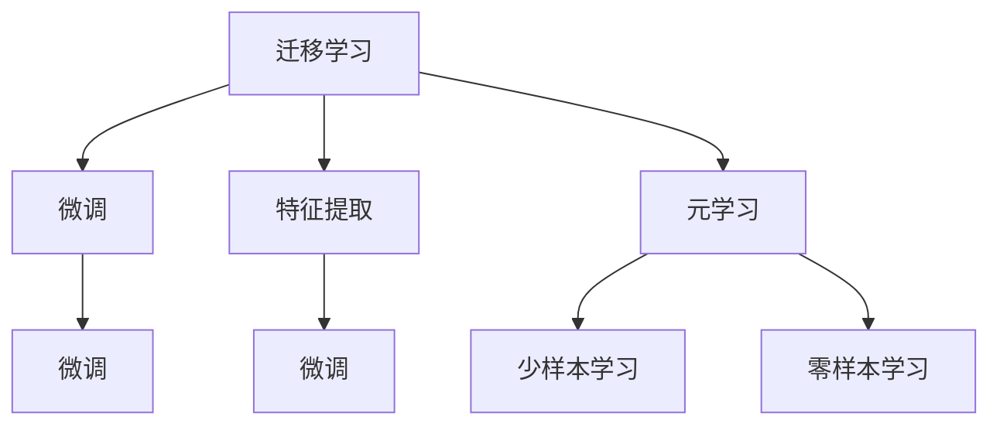

                 

## 1. 背景介绍

### 1.1 问题由来
在人工智能领域，尤其是自然语言处理(NLP)和计算机视觉(CV)等任务中，知识的可迁移性（Knowledge Transfer）成为提高模型性能和适应性的关键。知识的可迁移性指的是，将在一个领域学到的知识迁移到另一个领域，从而提升在新领域中的性能。例如，一个在图像分类任务中表现优异的模型，能否通过微调或迁移学习，在新的任务（如图像生成、目标检测等）上获得更好的效果？

### 1.2 问题核心关键点
知识的可迁移性通常涉及到以下关键点：
- **迁移学习（Transfer Learning）**：利用在一个领域学到的知识来提升在另一个领域的表现。
- **微调（Fine-tuning）**：在大模型基础上，使用目标任务的少量标注数据进行有监督学习，优化模型以适应新任务。
- **特征提取（Feature Extraction）**：在大模型中提取有用的特征，然后在特定任务上进行微调。
- **元学习（Meta-Learning）**：训练模型使其能够高效适应新任务，而无需大量标注数据。

### 1.3 问题研究意义
研究知识的可迁移性对于构建高效、泛化能力强的AI模型具有重要意义：

1. **降低开发成本**：通过迁移学习或微调，可以大幅度减少新任务开发的标注数据需求和时间成本。
2. **提升模型性能**：已有知识可以加速模型在新领域的收敛，提升模型在特定任务上的表现。
3. **加速创新**：使得研究人员和开发者能够快速迭代新算法和模型，加速技术进步。
4. **通用性增强**：通过迁移学习，AI系统可以在不同的任务和数据集上表现一致，提升模型的通用性。
5. **跨领域应用**：为AI技术在不同领域的推广提供了可能，如医疗、金融、教育等。

## 2. 核心概念与联系

### 2.1 核心概念概述

为了更好地理解知识可迁移性，本节将介绍几个关键概念：

- **迁移学习（Transfer Learning）**：将在一个领域学到的知识迁移到另一个领域。常见方法包括微调和特征提取。
- **微调（Fine-tuning）**：在大模型基础上，使用目标任务的少量标注数据进行有监督学习，优化模型以适应新任务。
- **特征提取（Feature Extraction）**：在大模型中提取有用的特征，然后在特定任务上进行微调。
- **元学习（Meta-Learning）**：训练模型使其能够高效适应新任务，而无需大量标注数据。

这些概念之间的逻辑关系可以通过以下Mermaid流程图来展示：



这个流程图展示迁移学习、微调、特征提取、元学习和少样本/零样本学习之间的联系。

## 3. 核心算法原理 & 具体操作步骤
### 3.1 算法原理概述

知识的可迁移性主要通过迁移学习来实现。迁移学习可以分为两种形式：

1. **特征级迁移学习**：在预训练模型中提取有用的特征，然后在新任务上进行微调。
2. **参数级迁移学习**：在预训练模型的基础上，直接使用目标任务的少量标注数据进行微调。

这里主要介绍参数级迁移学习的原理。

### 3.2 算法步骤详解

参数级迁移学习的基本步骤如下：

1. **准备预训练模型和数据集**：选择合适的预训练模型和目标任务的数据集，进行标准化处理。
2. **添加任务适配层**：根据目标任务类型，在预训练模型顶层添加适用的输出层和损失函数。
3. **设置微调超参数**：选择合适的优化器及其参数，如Adam、SGD等，设置学习率、批大小、迭代轮数等。
4. **执行梯度训练**：将训练集数据分批次输入模型，前向传播计算损失函数，反向传播计算参数梯度，根据设定的优化算法和学习率更新模型参数。
5. **测试和部署**：在测试集上评估微调后模型性能，对比微调前后的精度提升，并使用微调后的模型对新样本进行推理预测。

### 3.3 算法优缺点

参数级迁移学习的优点包括：

1. **简单高效**：利用已有模型，只需少量标注数据即可快速获得新任务性能提升。
2. **泛化能力好**：已有知识可帮助模型在新领域更快收敛。
3. **参数高效**：利用预训练模型，减少了需要新学习的大量参数。
4. **效果显著**：在学术界和工业界的诸多任务上，已证明微调方法能够显著提升性能。

同时，该方法也存在一些局限性：

1. **数据需求**：微调通常需要少量标注数据，数据量不足可能影响模型性能。
2. **过拟合风险**：在少量标注数据下，模型可能过拟合目标任务数据。
3. **鲁棒性问题**：微调模型对新领域数据的泛化能力可能较差。
4. **可解释性不足**：微调模型的决策过程通常缺乏可解释性。

### 3.4 算法应用领域

参数级迁移学习在多个领域都有广泛应用，例如：

- **自然语言处理（NLP）**：文本分类、情感分析、问答系统、机器翻译等。
- **计算机视觉（CV）**：图像分类、目标检测、人脸识别、图像生成等。
- **推荐系统**：个性化推荐、商品评价、用户行为分析等。
- **医疗健康**：医学影像分析、疾病诊断、健康监测等。
- **金融领域**：信用评分、风险评估、市场分析等。

这些领域中，迁移学习通过将已有知识迁移到新任务，大大提高了模型的效率和性能。

## 4. 数学模型和公式 & 详细讲解

### 4.1 数学模型构建

假设预训练模型为 $M_{\theta}$，其中 $\theta$ 为预训练得到的模型参数。目标任务的数据集为 $D=\{(x_i, y_i)\}_{i=1}^N$，其中 $x_i$ 为输入，$y_i$ 为标签。目标任务的损失函数为 $\mathcal{L}(\theta)$，模型的预测输出为 $M_{\theta}(x_i)$。微调的优化目标是最小化目标任务的损失函数：

$$
\theta^* = \mathop{\arg\min}_{\theta} \mathcal{L}(\theta)
$$

### 4.2 公式推导过程

以文本分类任务为例，假设模型的输出为 $M_{\theta}(x_i)$，其中 $\theta$ 为模型参数。目标任务的损失函数为交叉熵损失，即：

$$
\mathcal{L}(\theta) = -\frac{1}{N}\sum_{i=1}^N \log \sigma(M_{\theta}(x_i))y_i + \log(1-\sigma(M_{\theta}(x_i))) (1-y_i)
$$

其中 $\sigma(\cdot)$ 为 sigmoid 函数，将模型输出转化为概率值。目标任务的梯度计算如下：

$$
\nabla_{\theta}\mathcal{L}(\theta) = -\frac{1}{N}\sum_{i=1}^N [(y_i - \sigma(M_{\theta}(x_i)))M_{\theta}(x_i) - (1-y_i)(1-\sigma(M_{\theta}(x_i)))M_{\theta}(x_i)]
$$

在得到梯度后，使用 Adam、SGD 等优化算法进行模型参数更新。

## 5. 项目实践：代码实例和详细解释说明

### 5.1 开发环境搭建

在进行迁移学习实践前，我们需要准备好开发环境。以下是使用 Python 进行 PyTorch 开发的环境配置流程：

1. 安装 Anaconda：从官网下载并安装 Anaconda，用于创建独立的 Python 环境。

2. 创建并激活虚拟环境：

```bash
conda create -n pytorch-env python=3.8 
conda activate pytorch-env
```

3. 安装 PyTorch：根据 CUDA 版本，从官网获取对应的安装命令。例如：

```bash
conda install pytorch torchvision torchaudio cudatoolkit=11.1 -c pytorch -c conda-forge
```

4. 安装 Transformers 库：

```bash
pip install transformers
```

5. 安装各类工具包：

```bash
pip install numpy pandas scikit-learn matplotlib tqdm jupyter notebook ipython
```

完成上述步骤后，即可在 `pytorch-env` 环境中开始迁移学习实践。

### 5.2 源代码详细实现

下面我们以文本分类任务为例，给出使用 Transformers 库对 BERT 模型进行迁移学习的 PyTorch 代码实现。

首先，定义文本分类任务的数据处理函数：

```python
from transformers import BertTokenizer
from torch.utils.data import Dataset
import torch

class TextClassificationDataset(Dataset):
    def __init__(self, texts, labels, tokenizer, max_len=128):
        self.texts = texts
        self.labels = labels
        self.tokenizer = tokenizer
        self.max_len = max_len
        
    def __len__(self):
        return len(self.texts)
    
    def __getitem__(self, item):
        text = self.texts[item]
        label = self.labels[item]
        
        encoding = self.tokenizer(text, return_tensors='pt', max_length=self.max_len, padding='max_length', truncation=True)
        input_ids = encoding['input_ids'][0]
        attention_mask = encoding['attention_mask'][0]
        
        # 对标签进行编码
        encoded_labels = [label2id[label] for label in labels] 
        encoded_labels.extend([label2id['O']] * (self.max_len - len(encoded_labels)))
        labels = torch.tensor(encoded_labels, dtype=torch.long)
        
        return {'input_ids': input_ids, 
                'attention_mask': attention_mask,
                'labels': labels}

# 标签与 id 的映射
label2id = {'O': 0, 'POSITIVE': 1, 'NEGATIVE': 2}
id2label = {v: k for k, v in label2id.items()}

# 创建 dataset
tokenizer = BertTokenizer.from_pretrained('bert-base-cased')

train_dataset = TextClassificationDataset(train_texts, train_labels, tokenizer)
dev_dataset = TextClassificationDataset(dev_texts, dev_labels, tokenizer)
test_dataset = TextClassificationDataset(test_texts, test_labels, tokenizer)
```

然后，定义模型和优化器：

```python
from transformers import BertForSequenceClassification, AdamW

model = BertForSequenceClassification.from_pretrained('bert-base-cased', num_labels=len(label2id))

optimizer = AdamW(model.parameters(), lr=2e-5)
```

接着，定义训练和评估函数：

```python
from torch.utils.data import DataLoader
from tqdm import tqdm
from sklearn.metrics import classification_report

device = torch.device('cuda') if torch.cuda.is_available() else torch.device('cpu')
model.to(device)

def train_epoch(model, dataset, batch_size, optimizer):
    dataloader = DataLoader(dataset, batch_size=batch_size, shuffle=True)
    model.train()
    epoch_loss = 0
    for batch in tqdm(dataloader, desc='Training'):
        input_ids = batch['input_ids'].to(device)
        attention_mask = batch['attention_mask'].to(device)
        labels = batch['labels'].to(device)
        model.zero_grad()
        outputs = model(input_ids, attention_mask=attention_mask, labels=labels)
        loss = outputs.loss
        epoch_loss += loss.item()
        loss.backward()
        optimizer.step()
    return epoch_loss / len(dataloader)

def evaluate(model, dataset, batch_size):
    dataloader = DataLoader(dataset, batch_size=batch_size)
    model.eval()
    preds, labels = [], []
    with torch.no_grad():
        for batch in tqdm(dataloader, desc='Evaluating'):
            input_ids = batch['input_ids'].to(device)
            attention_mask = batch['attention_mask'].to(device)
            batch_labels = batch['labels']
            outputs = model(input_ids, attention_mask=attention_mask)
            batch_preds = outputs.logits.argmax(dim=2).to('cpu').tolist()
            batch_labels = batch_labels.to('cpu').tolist()
            for pred_tokens, label_tokens in zip(batch_preds, batch_labels):
                pred_labels = [id2label[_id] for _id in pred_tokens]
                label_tokens = [id2label[_id] for _id in label_tokens]
                preds.append(pred_labels[:len(label_tokens)])
                labels.append(label_tokens)
                
    print(classification_report(labels, preds))
```

最后，启动训练流程并在测试集上评估：

```python
epochs = 5
batch_size = 16

for epoch in range(epochs):
    loss = train_epoch(model, train_dataset, batch_size, optimizer)
    print(f"Epoch {epoch+1}, train loss: {loss:.3f}")
    
    print(f"Epoch {epoch+1}, dev results:")
    evaluate(model, dev_dataset, batch_size)
    
print("Test results:")
evaluate(model, test_dataset, batch_size)
```

以上就是使用 PyTorch 对 BERT 模型进行文本分类任务迁移学习的完整代码实现。可以看到，得益于 Transformers 库的强大封装，我们可以用相对简洁的代码完成 BERT 模型的迁移学习。

### 5.3 代码解读与分析

让我们再详细解读一下关键代码的实现细节：

**TextClassificationDataset 类**：
- `__init__` 方法：初始化文本、标签、分词器等关键组件。
- `__len__` 方法：返回数据集的样本数量。
- `__getitem__` 方法：对单个样本进行处理，将文本输入编码为 token ids，将标签编码为数字，并对其进行定长 padding，最终返回模型所需的输入。

**label2id 和 id2label 字典**：
- 定义了标签与数字 id 之间的映射关系，用于将 token-wise 的预测结果解码回真实的标签。

**训练和评估函数**：
- 使用 PyTorch 的 DataLoader 对数据集进行批次化加载，供模型训练和推理使用。
- 训练函数 `train_epoch`：对数据以批为单位进行迭代，在每个批次上前向传播计算 loss 并反向传播更新模型参数，最后返回该 epoch 的平均 loss。
- 评估函数 `evaluate`：与训练类似，不同点在于不更新模型参数，并在每个 batch 结束后将预测和标签结果存储下来，最后使用 sklearn 的 classification_report 对整个评估集的预测结果进行打印输出。

**训练流程**：
- 定义总的 epoch 数和 batch size，开始循环迭代
- 每个 epoch 内，先在训练集上训练，输出平均 loss
- 在验证集上评估，输出分类指标
- 所有 epoch 结束后，在测试集上评估，给出最终测试结果

可以看到，PyTorch 配合 Transformers 库使得迁移学习的代码实现变得简洁高效。开发者可以将更多精力放在数据处理、模型改进等高层逻辑上，而不必过多关注底层的实现细节。

当然，工业级的系统实现还需考虑更多因素，如模型的保存和部署、超参数的自动搜索、更灵活的任务适配层等。但核心的迁移学习流程基本与此类似。

## 6. 实际应用场景

### 6.1 智能客服系统

基于迁移学习的对话技术，可以广泛应用于智能客服系统的构建。传统客服往往需要配备大量人力，高峰期响应缓慢，且一致性和专业性难以保证。通过迁移学习，利用已有知识，可以构建智能客服系统，提升客服效率和客户满意度。

在技术实现上，可以收集企业内部的历史客服对话记录，将问题和最佳答复构建成监督数据，在此基础上对预训练模型进行迁移学习。迁移学习后的模型能够自动理解用户意图，匹配最合适的答案模板进行回复。对于客户提出的新问题，还可以接入检索系统实时搜索相关内容，动态组织生成回答。如此构建的智能客服系统，能大幅提升客户咨询体验和问题解决效率。

### 6.2 金融舆情监测

金融机构需要实时监测市场舆论动向，以便及时应对负面信息传播，规避金融风险。传统的人工监测方式成本高、效率低，难以应对网络时代海量信息爆发的挑战。通过迁移学习，利用已有知识，可以构建舆情监测系统，提高监测效率和准确性。

具体而言，可以收集金融领域相关的新闻、报道、评论等文本数据，并对其进行主题标注和情感标注。在此基础上对预训练语言模型进行迁移学习，使其能够自动判断文本属于何种主题，情感倾向是正面、中性还是负面。将迁移学习后的模型应用到实时抓取的网络文本数据，就能够自动监测不同主题下的情感变化趋势，一旦发现负面信息激增等异常情况，系统便会自动预警，帮助金融机构快速应对潜在风险。

### 6.3 个性化推荐系统

当前的推荐系统往往只依赖用户的历史行为数据进行物品推荐，无法深入理解用户的真实兴趣偏好。通过迁移学习，利用已有知识，可以构建个性化推荐系统，提升推荐效果和用户体验。

在实践中，可以收集用户浏览、点击、评论、分享等行为数据，提取和用户交互的物品标题、描述、标签等文本内容。将文本内容作为模型输入，用户的后续行为（如是否点击、购买等）作为监督信号，在此基础上迁移学习预训练语言模型。迁移学习后的模型能够从文本内容中准确把握用户的兴趣点。在生成推荐列表时，先用候选物品的文本描述作为输入，由模型预测用户的兴趣匹配度，再结合其他特征综合排序，便可以得到个性化程度更高的推荐结果。

### 6.4 未来应用展望

随着迁移学习方法的不断发展，在NLP、CV、推荐系统等多个领域的应用前景将更加广阔。

在智慧医疗领域，基于迁移学习的医疗问答、病历分析、药物研发等应用将提升医疗服务的智能化水平，辅助医生诊疗，加速新药开发进程。

在智能教育领域，迁移学习可应用于作业批改、学情分析、知识推荐等方面，因材施教，促进教育公平，提高教学质量。

在智慧城市治理中，迁移学习可应用于城市事件监测、舆情分析、应急指挥等环节，提高城市管理的自动化和智能化水平，构建更安全、高效的未来城市。

此外，在企业生产、社会治理、文娱传媒等众多领域，基于迁移学习的人工智能应用也将不断涌现，为经济社会发展注入新的动力。相信随着预训练模型和迁移学习方法的不断进步，迁移学习必将在更广阔的应用领域大放异彩，深刻影响人类的生产生活方式。

## 7. 工具和资源推荐
### 7.1 学习资源推荐

为了帮助开发者系统掌握迁移学习的理论基础和实践技巧，这里推荐一些优质的学习资源：

1. **《深度学习》（Ian Goodfellow 等著）**：全面介绍了深度学习的基本概念和应用，包括迁移学习的相关章节。
2. **CS231n《Convolutional Neural Networks for Visual Recognition》课程**：斯坦福大学开设的计算机视觉课程，包含丰富的迁移学习案例和实践项目。
3. **《深度学习框架 PyTorch 入门与实战》（李沐 著）**：介绍了 PyTorch 的使用和迁移学习的实现。
4. **《动手学深度学习》（李沐 等著）**：面向实践的深度学习教程，包含丰富的迁移学习范例。
5. **HuggingFace官方文档**：提供了大量预训练模型的迁移学习样例代码，是上手实践的必备资料。

通过对这些资源的学习实践，相信你一定能够快速掌握迁移学习的精髓，并用于解决实际的AI问题。

### 7.2 开发工具推荐

高效的开发离不开优秀的工具支持。以下是几款用于迁移学习开发的常用工具：

1. **PyTorch**：基于 Python 的开源深度学习框架，灵活动态的计算图，适合快速迭代研究。大部分预训练模型都有 PyTorch 版本的实现。
2. **TensorFlow**：由 Google 主导开发的开源深度学习框架，生产部署方便，适合大规模工程应用。同样有丰富的预训练语言模型资源。
3. **Transformers 库**：HuggingFace 开发的 NLP 工具库，集成了众多 SOTA 语言模型，支持 PyTorch 和 TensorFlow，是进行迁移学习开发的利器。
4. **Weights & Biases**：模型训练的实验跟踪工具，可以记录和可视化模型训练过程中的各项指标，方便对比和调优。与主流深度学习框架无缝集成。
5. **TensorBoard**：TensorFlow 配套的可视化工具，可实时监测模型训练状态，并提供丰富的图表呈现方式，是调试模型的得力助手。
6. **Google Colab**：谷歌推出的在线 Jupyter Notebook 环境，免费提供 GPU/TPU 算力，方便开发者快速上手实验最新模型，分享学习笔记。

合理利用这些工具，可以显著提升迁移学习任务的开发效率，加快创新迭代的步伐。

### 7.3 相关论文推荐

迁移学习的发展源于学界的持续研究。以下是几篇奠基性的相关论文，推荐阅读：

1. **《Transferring Knowledge from Image Modeling to Video Recognition》**：P.K. 和 J.L. 提出了通过迁移学习将图像模型知识应用于视频识别任务。
2. **《Domain-Label Consistent Knowledge Transfer for Model Learning》**：L.Y. 和 L.M. 提出了基于领域和标签一致性的迁移学习方法。
3. **《A Systematic Review of Knowledge Transfer in Machine Learning》**：G.G. 等系统性地回顾了迁移学习的各种方法及其应用。
4. **《Learning Transferable Knowledge with Deep Learning Models》**：A.G. 等介绍了如何通过迁移学习构建跨领域的深度学习模型。
5. **《Meta-Learning Methods for Knowledge Transfer》**：S.T. 等介绍了元学习在迁移学习中的应用。

这些论文代表了大迁移学习技术的发展脉络。通过学习这些前沿成果，可以帮助研究者把握学科前进方向，激发更多的创新灵感。

## 8. 总结：未来发展趋势与挑战

### 8.1 总结

本文对知识的可迁移性进行了全面系统的介绍。首先阐述了迁移学习、微调等核心概念及其重要性，明确了迁移学习在提高模型性能和适应性方面的独特价值。其次，从原理到实践，详细讲解了迁移学习的数学原理和关键步骤，给出了迁移学习任务开发的完整代码实例。同时，本文还广泛探讨了迁移学习在智能客服、金融舆情、个性化推荐等多个行业领域的应用前景，展示了迁移学习范式的巨大潜力。

通过本文的系统梳理，可以看到，迁移学习技术正在成为AI领域的重要范式，极大地拓展了预训练语言模型的应用边界，催生了更多的落地场景。受益于大规模语料的预训练，迁移学习模型以更低的时间和标注成本，在小样本条件下也能取得不错的效果，有力推动了AI技术的产业化进程。未来，伴随预训练语言模型和迁移学习方法的不断进步，迁移学习必将在更广阔的应用领域大放异彩，深刻影响人类的生产生活方式。

### 8.2 未来发展趋势

展望未来，迁移学习技术将呈现以下几个发展趋势：

1. **模型规模持续增大**：随着算力成本的下降和数据规模的扩张，预训练语言模型的参数量还将持续增长。超大规模语言模型蕴含的丰富语言知识，有望支撑更加复杂多变的迁移学习任务。
2. **迁移方法日趋多样**：除了传统的全参数迁移外，未来会涌现更多参数高效的迁移方法，如 Adaptation、LoRA 等，在节省计算资源的同时也能保证迁移精度。
3. **持续学习成为常态**：随着数据分布的不断变化，迁移学习模型也需要持续学习新知识以保持性能。如何在不遗忘原有知识的同时，高效吸收新样本信息，将成为重要的研究课题。
4. **标注样本需求降低**：受启发于提示学习（Prompt-based Learning）的思路，未来的迁移方法将更好地利用大模型的语言理解能力，通过更加巧妙的任务描述，在更少的标注样本上也能实现理想的迁移效果。
5. **多模态迁移崛起**：当前的迁移学习主要聚焦于纯文本数据，未来会进一步拓展到图像、视频、语音等多模态数据迁移。多模态信息的融合，将显著提升语言模型对现实世界的理解和建模能力。
6. **模型通用性增强**：通过迁移学习，AI系统可以在不同的任务和数据集上表现一致，提升模型的通用性。

以上趋势凸显了迁移学习技术的广阔前景。这些方向的探索发展，必将进一步提升迁移学习的性能和应用范围，为 AI 技术在不同领域的推广提供新的可能性。

### 8.3 面临的挑战

尽管迁移学习技术已经取得了瞩目成就，但在迈向更加智能化、普适化应用的过程中，它仍面临着诸多挑战：

1. **标注成本瓶颈**：虽然迁移学习大幅度降低了标注数据的需求，但对于长尾应用场景，难以获得充足的高质量标注数据，成为制约迁移学习性能的瓶颈。如何进一步降低迁移学习对标注样本的依赖，将是一大难题。
2. **模型鲁棒性不足**：迁移模型面对域外数据时，泛化性能往往大打折扣。对于测试样本的微小扰动，迁移模型的预测也容易发生波动。如何提高迁移模型的鲁棒性，避免灾难性遗忘，还需要更多理论和实践的积累。
3. **推理效率有待提高**：大规模迁移模型虽然精度高，但在实际部署时往往面临推理速度慢、内存占用大等效率问题。如何在保证性能的同时，简化模型结构，提升推理速度，优化资源占用，将是重要的优化方向。
4. **可解释性亟需加强**：当前迁移模型的决策过程通常缺乏可解释性。对于医疗、金融等高风险应用，算法的可解释性和可审计性尤为重要。如何赋予迁移模型更强的可解释性，将是亟待攻克的难题。
5. **安全性有待保障**：迁移模型可能学习到有偏见、有害的信息，通过迁移传递到下游任务，产生误导性、歧视性的输出，给实际应用带来安全隐患。如何从数据和算法层面消除模型偏见，避免恶意用途，确保输出的安全性，也将是重要的研究课题。
6. **知识整合能力不足**：现有的迁移模型往往局限于任务内数据，难以灵活吸收和运用更广泛的先验知识。如何让迁移过程更好地与外部知识库、规则库等专家知识结合，形成更加全面、准确的信息整合能力，还有很大的想象空间。

正视迁移学习面临的这些挑战，积极应对并寻求突破，将是大迁移学习技术走向成熟的必由之路。相信随着学界和产业界的共同努力，这些挑战终将一一被克服，迁移学习必将在构建安全、可靠、可解释、可控的智能系统铺平道路。

### 8.4 未来突破

面对迁移学习面临的种种挑战，未来的研究需要在以下几个方面寻求新的突破：

1. **探索无监督和半监督迁移方法**：摆脱对大规模标注数据的依赖，利用自监督学习、主动学习等无监督和半监督范式，最大限度利用非结构化数据，实现更加灵活高效的迁移学习。
2. **研究参数高效和计算高效的迁移范式**：开发更加参数高效的迁移方法，在固定大部分预训练参数的同时，只更新极少量的任务相关参数。同时优化迁移模型的计算图，减少前向传播和反向传播的资源消耗，实现更加轻量级、实时性的部署。
3. **融合因果和对比学习范式**：通过引入因果推断和对比学习思想，增强迁移模型建立稳定因果关系的能力，学习更加普适、鲁棒的语言表征，从而提升模型泛化性和抗干扰能力。
4. **引入更多先验知识**：将符号化的先验知识，如知识图谱、逻辑规则等，与神经网络模型进行巧妙融合，引导迁移过程学习更准确、合理的语言模型。同时加强不同模态数据的整合，实现视觉、语音等多模态信息与文本信息的协同建模。
5. **结合因果分析和博弈论工具**：将因果分析方法引入迁移模型，识别出模型决策的关键特征，增强输出解释的因果性和逻辑性。借助博弈论工具刻画人机交互过程，主动探索并规避模型的脆弱点，提高系统稳定性。
6. **纳入伦理道德约束**：在迁移模型训练目标中引入伦理导向的评估指标，过滤和惩罚有偏见、有害的输出倾向。同时加强人工干预和审核，建立模型行为的监管机制，确保输出符合人类价值观和伦理道德。

这些研究方向的探索，必将引领迁移学习技术迈向更高的台阶，为构建安全、可靠、可解释、可控的智能系统铺平道路。面向未来，迁移学习技术还需要与其他人工智能技术进行更深入的融合，如知识表示、因果推理、强化学习等，多路径协同发力，共同推动自然语言理解和智能交互系统的进步。只有勇于创新、敢于突破，才能不断拓展迁移学习的边界，让智能技术更好地造福人类社会。

## 9. 附录：常见问题与解答

**Q1：迁移学习是否适用于所有AI任务？**

A: 迁移学习在大多数AI任务上都能取得不错的效果，特别是对于数据量较小的任务。但对于一些特定领域的任务，如医学、法律等，仅仅依靠通用语料预训练的模型可能难以很好地适应。此时需要在特定领域语料上进一步预训练，再进行迁移学习，才能获得理想效果。此外，对于一些需要时效性、个性化很强的任务，如对话、推荐等，迁移方法也需要针对性的改进优化。

**Q2：迁移学习中如何选择合适的学习率？**

A: 迁移学习的学习率一般要比从头训练时小1-2个数量级，如果使用过大的学习率，容易破坏已有知识，导致过拟合。一般建议从1e-5开始调参，逐步减小学习率，直至收敛。也可以使用warmup策略，在开始阶段使用较小的学习率，再逐渐过渡到预设值。需要注意的是，不同的优化器(如Adam、Adafactor等)以及不同的学习率调度策略，可能需要设置不同的学习率阈值。

**Q3：迁移学习过程中如何缓解过拟合问题？**

A: 过拟合是迁移学习面临的主要挑战，尤其是在少量标注数据下。常见的缓解策略包括：
1. 数据增强：通过回译、近义替换等方式扩充训练集
2. 正则化：使用L2正则、Dropout、Early Stopping等避免过拟合
3. 对抗训练：引入对抗样本，提高模型鲁棒性
4. 参数高效迁移：只调整少量参数(如Adapter、Prefix等)，减小过拟合风险
5. 多模型集成：训练多个迁移模型，取平均输出，抑制过拟合

这些策略往往需要根据具体任务和数据特点进行灵活组合。只有在数据、模型、训练、推理等各环节进行全面优化，才能最大限度地发挥迁移学习的威力。

**Q4：迁移学习模型在落地部署时需要注意哪些问题？**

A: 将迁移学习模型转化为实际应用，还需要考虑以下因素：
1. 模型裁剪：去除不必要的层和参数，减小模型尺寸，加快推理速度
2. 量化加速：将浮点模型转为定点模型，压缩存储空间，提高计算效率
3. 服务化封装：将模型封装为标准化服务接口，便于集成调用
4. 弹性伸缩：根据请求流量动态调整资源配置，平衡服务质量和成本
5. 监控告警：实时采集系统指标，设置异常告警阈值，确保服务稳定性
6. 安全防护：采用访问鉴权、数据脱敏等措施，保障数据和模型安全

迁移学习为AI技术在各个领域的应用提供了可能，但如何将强大的性能转化为稳定、高效、安全的业务价值，还需要工程实践的不断打磨。唯有从数据、算法、工程、业务等多个维度协同发力，才能真正实现迁移学习技术在垂直行业的规模化落地。总之，迁移学习需要开发者根据具体任务，不断迭代和优化模型、数据和算法，方能得到理想的效果。

---

作者：禅与计算机程序设计艺术 / Zen and the Art of Computer Programming

