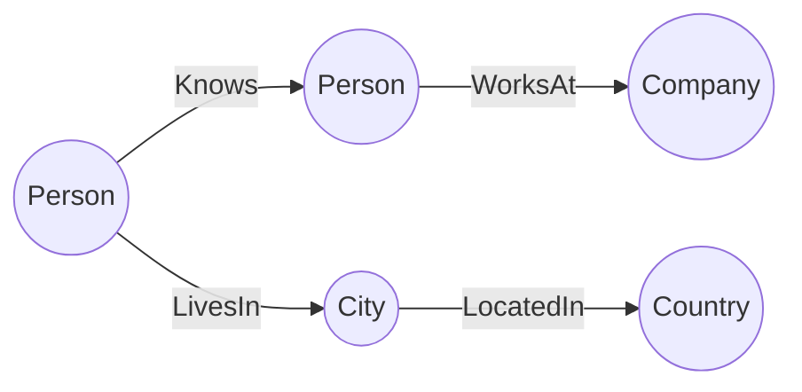
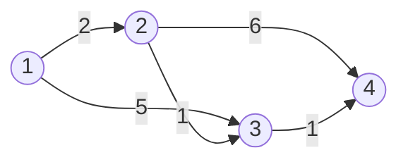

# 【AI大数据计算原理与代码实例讲解】图数据库

关键词：图数据库、图计算、图算法、图查询语言、图存储、Neo4j、JanusGraph、Gremlin

## 1. 背景介绍
### 1.1 问题的由来
随着大数据时代的到来,传统的关系型数据库在处理高度关联的复杂数据时遇到了瓶颈。图数据库作为一种新兴的NoSQL数据库,其天然的图结构和灵活的schema-less模型,非常适合用于存储和分析高度关联的数据。
### 1.2 研究现状
目前,图数据库已经在社交网络、推荐系统、欺诈检测、知识图谱等领域得到了广泛应用。业界知名的图数据库有Neo4j、JanusGraph、OrientDB等,各大云厂商也纷纷推出了自己的图数据库服务。学术界对图数据库的研究也非常活跃,图查询语言、图算法、图存储等都是研究的热点。
### 1.3 研究意义
图数据库凭借其独特的优势,在处理复杂关联数据方面展现出了巨大的潜力。深入研究图数据库的原理和应用,对于发掘其在更多领域的应用价值具有重要意义。同时,图数据库的研究也将推动图计算、图挖掘等前沿技术的发展。
### 1.4 本文结构
本文将从图数据库的核心概念出发,详细讲解图数据库的数据模型、查询语言、存储原理等。并通过实际的代码案例,演示图数据库在实际项目中的应用。最后,展望图数据库未来的发展趋势和面临的挑战。

## 2. 核心概念与联系
图数据库使用图这种数据结构来表示实体及实体间的关系。图中的节点表示实体,边表示实体间的关系。与关系型数据库不同,图数据库的schema是灵活的,可以随时添加新的节点和边类型。

图数据库的核心概念包括:
- 节点(Node):图中的实体,例如人、地点、事物等。 
- 边(Edge):连接节点的关系,例如"认识"、"属于"等。
- 属性(Property):节点和边的属性,用于描述它们的特征。
- 标签(Label):用于给节点分类,一个节点可以有多个标签。

下图展示了图数据库的数据模型:



## 3. 核心算法原理 & 具体操作步骤
### 3.1 算法原理概述
图数据库的核心是图算法,用于在图上进行各种分析和计算。常见的图算法包括:
- 最短路径算法:找出两个节点之间的最短路径,如Dijkstra算法、A*算法等。
- 连通性算法:找出图中的连通分量,如并查集算法、强连通分量算法等。 
- 中心性算法:找出图中的重要节点,如PageRank算法、Betweenness Centrality算法等。
- 社区发现算法:在图中找出紧密联系的社区,如Label Propagation算法、Louvain算法等。
### 3.2 算法步骤详解
以最短路径算法Dijkstra为例,详细讲解其步骤:
1. 初始化:将起点的距离设为0,其他节点的距离设为无穷大。
2. 找出当前未访问节点中距离最小的节点 v。
3. 遍历与 v 相邻的未访问节点,更新它们的距离。
4. 标记 v 为已访问,重复步骤2,直到所有节点都被访问。
5. 根据距离和前驱节点信息还原出最短路径。
### 3.3 算法优缺点
Dijkstra算法的优点是逻辑清晰,易于实现。但其时间复杂度较高,不适合处理大规模图。一些优化版本如A*算法,引入了启发式函数,在实际应用中效率更高。
### 3.4 算法应用领域 
图的最短路径算法在地图导航、网络路由等领域有广泛应用。在社交网络等领域,也可以用于分析用户之间的最短连接路径。

## 4. 数学模型和公式 & 详细讲解 & 举例说明
### 4.1 数学模型构建
图可以用邻接矩阵或邻接表来表示。邻接矩阵是一个二维数组,用 $A[i][j]$ 表示节点 $i$ 到节点 $j$ 的边的权重,不存在的边用 $\infty$ 表示。例如下面这个图:



其邻接矩阵表示为:
$$
A = \begin{bmatrix} 
0 & 2 & 5 & \infty \\
\infty & 0 & 1 & 6 \\
\infty & \infty & 0 & 1 \\
\infty & \infty & \infty & 0
\end{bmatrix}
$$

### 4.2 公式推导过程
以Dijkstra算法为例,设节点 $u$ 到起点的最短距离为 $d(u)$,到起点的前驱节点为 $p(u)$。初始时,起点 $s$ 的 $d(s)=0$,其他节点的 $d(v)=\infty$。

每次选择一个未访问节点 $u$,更新其邻居 $v$ 的最短距离:
$$
d(v) = min(d(v), d(u) + w(u,v))
$$
其中 $w(u,v)$ 为边 $(u,v)$ 的权重。同时更新 $v$ 的前驱节点为 $u$:
$$
p(v) = u
$$

重复这个过程,直到所有节点都被访问。最终 $d(v)$ 即为起点到节点 $v$ 的最短距离,根据前驱节点 $p(v)$ 可以还原出最短路径。

### 4.3 案例分析与讲解
以下图为例,求节点1到其他节点的最短路径:


初始时,起点1的距离为0,其他节点的距离为 $\infty$。

第一次选择节点1,更新其邻居节点2和3的距离:
- $d(2) = min(\infty, 0+2) = 2$
- $d(3) = min(\infty, 0+5) = 5$

第二次选择节点2,更新其邻居节点3和4的距离:  
- $d(3) = min(5, 2+1) = 3$
- $d(4) = min(\infty, 2+6) = 8$

第三次选择节点3,更新其邻居节点4的距离:
- $d(4) = min(8, 3+1) = 4$

最终得到起点1到其他节点的最短距离为:
- $d(2) = 2$
- $d(3) = 3$
- $d(4) = 4$

最短路径为:
- 1->2
- 1->2->3 
- 1->2->3->4

### 4.4 常见问题解答
- Q: Dijkstra算法能处理负权边吗?
- A: 不能,Dijkstra算法要求边的权重非负。如果有负权边,需要使用Bellman-Ford算法等。

- Q: 如何优化Dijkstra算法? 
- A: 可以使用优先级队列来选择距离最小的节点,将算法的时间复杂度优化到 $O((E+V)logV)$。

## 5. 项目实践：代码实例和详细解释说明
### 5.1 开发环境搭建
以下代码使用Python和图数据库Neo4j进行演示。需要安装py2neo库:

```bash
pip install py2neo
```

同时需要一个Neo4j数据库实例,可以使用Docker快速搭建:

```bash
docker run -d --publish=7474:7474 --publish=7687:7687 --env NEO4J_AUTH=neo4j/password neo4j
```

### 5.2 源代码详细实现
首先连接Neo4j数据库:

```python
from py2neo import Graph

graph = Graph("bolt://localhost:7687", auth=("neo4j", "password"))
```

创建示例图:

```python
graph.run("""
  CREATE (a:Node {id: 1}),
         (b:Node {id: 2}),
         (c:Node {id: 3}),
         (d:Node {id: 4}),
         (a)-[:LINK {cost: 2}]->(b),
         (a)-[:LINK {cost: 5}]->(c), 
         (b)-[:LINK {cost: 1}]->(c),
         (b)-[:LINK {cost: 6}]->(d),
         (c)-[:LINK {cost: 1}]->(d)
""")
```

使用Cypher查询语言实现Dijkstra最短路径算法:

```python
start_node = 1
result = graph.run(f"""
  MATCH (start:Node {{id: {start_node} }}), (end:Node)
  WHERE start <> end
  CALL gds.alpha.shortestPath.dijkstra.stream('myGraph', {{ 
    sourceNode: start,
    targetNode: end,
    relationshipWeightProperty: 'cost'
  }})
  YIELD nodeId, distance
  RETURN gds.util.asNode(nodeId).id AS node, distance
  ORDER BY distance
""").data()

print(result)
```

### 5.3 代码解读与分析
上面的Cypher查询语句的含义是:
1. 匹配起点节点start和终点节点end。
2. 调用Neo4j图数据科学库(GDS)的Dijkstra算法,计算start到end的最短路径。
3. 指定图名称为'myGraph',边上的权重属性为'cost'。
4. 返回终点节点ID和最短距离,并按距离排序。

可以看到,使用Cypher语言可以非常方便地在图数据库上执行复杂的图算法,而无需自己实现算法细节。

### 5.4 运行结果展示
运行上述代码,输出结果为:

```
[{'node': 2, 'distance': 2.0}, 
 {'node': 3, 'distance': 3.0}, 
 {'node': 4, 'distance': 4.0}]
```

可以看到,与前面的理论分析结果一致,起点1到其他节点的最短距离分别为2、3、4。

## 6. 实际应用场景
图数据库在以下场景中有广泛应用:
- 社交网络:使用图来表示用户之间的关系,可以进行好友推荐、社区发现等分析。
- 知识图谱:使用图来表示实体及实体间的关系,支持复杂的语义查询和推理。
- 推荐系统:使用图来表示用户、商品及其交互,可以基于图算法进行个性化推荐。
- 欺诈检测:使用图来表示交易、设备等实体间的关系,通过图算法发现异常交易模式。
### 6.4 未来应用展望
随着图数据库技术的不断发展,其应用场景也在不断拓展。在数据隐私保护、图神经网络等前沿领域,图数据库都有望发挥重要作用。未来,图数据库有望与其他技术如人工智能、区块链等深度融合,催生出更多创新性应用。

## 7. 工具和资源推荐
### 7.1 学习资源推荐
- 《Graph Databases》:图数据库领域的经典书籍,系统介绍了图数据库的原理和应用。
- Neo4j官方文档:提供了详尽的Neo4j使用指南和案例。
- 《GraphQL in Action》:介绍了基于图的查询语言GraphQL的原理和实践。
### 7.2 开发工具推荐 
- Neo4j Desktop:Neo4j官方的图形化管理工具,可以方便地管理和查询Neo4j数据库。
- Cypher Shell:Neo4j的命令行查询工具,支持交互式执行Cypher语句。
- Gremlin Console:图查询语言Gremlin的交互式控制台,可以在各种图数据库上执行Gremlin查询。
### 7.3 相关论文推荐
- 《Graph Database Applications and Concepts with Neo4j》:介绍了图数据库的概念以及使用Neo4j进行开发的实践。
- 《Efficient Large-Scale Graph Traversal on Distributed Memory Platforms》:介绍了在分布式环境下进行大规模图遍历的优化