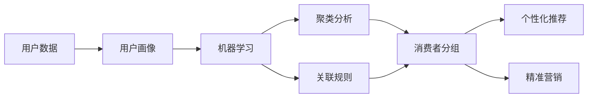

# 【AI大数据计算原理与代码实例讲解】消费者组

关键词：AI、大数据、计算原理、消费者组、机器学习、数据挖掘、聚类分析、关联规则、推荐系统

## 1. 背景介绍
### 1.1 问题的由来
随着互联网和电子商务的快速发展,海量的用户行为数据被记录下来。如何从这些海量数据中挖掘出有价值的信息,为企业的精准营销和个性化推荐提供数据支持,成为了当前亟需解决的问题。而对消费者进行分组,是实现精准营销和个性化推荐的重要基础。

### 1.2 研究现状
目前,国内外学者对消费者分组的研究主要集中在以下几个方面:

(1)基于人口统计学特征的分组方法。如根据消费者的年龄、性别、收入等人口统计学特征进行分组。

(2)基于消费行为的分组方法。如根据消费者的购买频率、购买金额、购买品类等消费行为数据进行分组。

(3)基于心理特征的分组方法。如根据消费者的生活方式、个性特征、价值观等心理特征进行分组。

(4)基于多维度特征的综合分组方法。即综合考虑人口统计学特征、消费行为特征和心理特征等多个维度的数据进行分组。

### 1.3 研究意义
消费者分组对企业的精准营销和服务具有重要意义:

(1)有助于企业深入洞察不同消费群体的特点,实现差异化营销。

(2)为个性化推荐提供基础,提升用户体验和满意度。

(3)指导企业调整产品结构和营销策略,提高经营效率。

(4)预测潜在客户,开拓新市场。

### 1.4 本文结构
本文将重点介绍如何利用AI和大数据技术,对消费者进行自动化、智能化分组。内容涵盖核心概念、算法原理、数学模型、代码实践等方面。全文结构如下:

1.背景介绍
2.核心概念与联系
3.核心算法原理与具体操作步骤
4.数学模型和公式详细讲解举例说明
5.项目实践:代码实例和详细解释说明
6.实际应用场景
7.工具和资源推荐
8.总结:未来发展趋势与挑战
9.附录:常见问题与解答

## 2. 核心概念与联系
在利用AI和大数据技术对消费者进行分组时,涉及到以下几个核心概念:

(1)用户画像:从用户产生的各类数据中抽取用户特征,构建用户模型,刻画用户的属性、行为和偏好等特征。它是开展消费者分组的基础。

(2)机器学习:利用计算机从数据中自动分析获得规律,并利用规律对未知数据进行预测。机器学习是实现智能分组的核心技术之一。

(3)聚类分析:将物理或抽象对象的集合分成由类似的对象组成的多个类的分析过程。它可以帮助我们发现数据中的分组结构。

(4)关联规则:用于发现数据集中变量之间有趣的关联关系的规则学习方法。关联规则可以揭示不同用户特征之间的关联性,为分组提供有价值的信息。

(5)推荐系统:根据用户的历史行为和偏好,向其推荐可能感兴趣的信息和商品。推荐系统是消费者分组的一个重要应用场景。

下图展示了这些概念之间的联系:

## 3. 核心算法原理 & 具体操作步骤
### 3.1 算法原理概述
对消费者进行分组,本质上是一个无监督学习问题。我们可以使用聚类算法,将相似的消费者自动归类到一个群组中。常见的聚类算法包括K-means、DBSCAN、层次聚类等。本文将重点介绍K-means算法。

K-means算法的基本思想是:通过迭代,将数据点分配到K个簇中,使得每个簇内数据点到簇中心的距离最小。其优化目标为最小化误差平方和准则函数:

$$J=\sum_{i=1}^K\sum_{x\in C_i}\lVert x-\mu_i \rVert^2$$

其中,$C_i$表示第$i$个簇,$\mu_i$表示第$i$个簇的中心。

### 3.2 算法步骤详解
K-means算法的具体步骤如下:

输入:包含$n$个数据点的数据集$D=\{x_1,x_2,...,x_n\}$,聚类簇数$K$。
输出:$K$个簇$C=\{C_1,C_2,...,C_K\}$和对应的簇中心$\{\mu_1,\mu_2,...,\mu_K\}$。

1. 从数据集$D$中随机选择$K$个数据点作为初始的簇中心$\{\mu_1,\mu_2,...,\mu_K\}$。

2. 重复下列步骤,直至簇中心不再变化或达到最大迭代次数:

   (1)计算每个数据点$x_i$到各个簇中心$\mu_j$的距离$d_{ij}=\lVert x_i-\mu_j \rVert^2$。

   (2)将每个数据点$x_i$分配到距离最近的簇$C_{j^*}$中:

   $$j^*=\arg\min_{j}d_{ij}$$

   (3)更新每个簇的中心$\mu_j$为簇内所有点的均值:

   $$\mu_j=\frac{1}{|C_j|}\sum_{x\in C_j}x$$

3. 输出最终的簇划分$\{C_1,C_2,...,C_K\}$和簇中心$\{\mu_1,\mu_2,...,\mu_K\}$。

### 3.3 算法优缺点
K-means算法的主要优点有:

(1)原理简单,易于实现。
(2)聚类效果较好,在处理大数据集时仍然高效。

但K-means算法也存在一些缺陷:

(1)需要预先指定聚类簇数$K$。在实际应用中,$K$的选择并不容易。
(2)对噪声和异常点敏感。异常点会对最终的聚类结果产生较大影响。
(3)容易陷入局部最优。聚类结果依赖于初始簇中心的选择。

### 3.4 算法应用领域
K-means算法在消费者分组中有广泛应用,一些典型的应用场景包括:

(1)客户细分:通过人口统计学特征、消费行为等数据,将客户划分为多个细分群体,实现差异化营销。

(2)用户画像:根据用户的属性特征、行为偏好等,对用户进行聚类,构建用户画像,为个性化推荐提供支持。

(3)市场划分:根据不同地区消费者的特点,进行市场划分,制定针对性的营销策略。

除了消费者分组,K-means算法还被广泛应用于文本聚类、图像分割等领域。

## 4. 数学模型和公式 & 详细讲解 & 举例说明
### 4.1 数学模型构建
对消费者进行分组,首先需要构建用户特征的数学模型。我们可以将每个用户表示为一个$n$维特征向量:

$$x_i=(x_{i1},x_{i2},...,x_{in})$$

其中,$x_{ij}$表示用户$i$在第$j$个特征上的取值。常见的用户特征可以包括:

(1)人口统计学特征:如年龄、性别、收入等。
(2)消费行为特征:如购买频率、购买金额、购买品类等。
(3)偏好特征:如对不同品类、品牌的偏好度。

在实际应用中,我们还需要对特征进行预处理,如缺失值填充、数据归一化等,以提高聚类效果。

### 4.2 公式推导过程
接下来,我们对K-means算法的目标函数进行推导。K-means算法的优化目标是最小化误差平方和准则函数:

$$J=\sum_{i=1}^K\sum_{x\in C_i}\lVert x-\mu_i \rVert^2$$

我们可以将其展开为:

$$J=\sum_{i=1}^K\sum_{x\in C_i}(x-\mu_i)^T(x-\mu_i)$$

$$=\sum_{i=1}^K\sum_{x\in C_i}(x^Tx-2x^T\mu_i+\mu_i^T\mu_i)$$

$$=\sum_{i=1}^K\left(\sum_{x\in C_i}x^Tx-2\mu_i^T\sum_{x\in C_i}x+|C_i|\mu_i^T\mu_i\right)$$

对$J$求$\mu_i$的偏导数,并令其等于0:

$$\frac{\partial J}{\partial \mu_i}=-2\sum_{x\in C_i}x+2|C_i|\mu_i=0$$

$$\Rightarrow \mu_i=\frac{1}{|C_i|}\sum_{x\in C_i}x$$

由此可得,当簇中心$\mu_i$等于簇内所有点的均值时,目标函数$J$最小。这也是K-means算法中更新簇中心的依据。

### 4.3 案例分析与讲解
下面我们以一个简单的例子来说明K-means算法的应用。假设有一个小型电商平台,现有6个用户,每个用户有3个特征:年龄、月均消费金额、购买频率。我们希望根据这些特征将用户划分为2个群组。

用户数据如下:

| 用户ID | 年龄 | 月均消费金额(元) | 月均购买次数 |
|:------:|:----:|:---------------:|:------------:|
| 1      | 25   | 500             | 3            |
| 2      | 40   | 1000            | 2            |
| 3      | 20   | 200             | 5            |
| 4      | 35   | 800             | 2            |
| 5      | 30   | 600             | 4            |
| 6      | 45   | 1200            | 1            |

我们首先将数据进行归一化处理,然后随机选择2个点作为初始簇中心,如用户1和用户4。接下来不断迭代,计算每个用户到两个簇中心的距离,将其分配到距离最近的簇中,并更新簇中心,直至簇中心不再变化。

最终,我们可以得到以下聚类结果:

簇1:{用户1,用户3,用户5},簇心为(25,433,4)
簇2:{用户2,用户4,用户6},簇心为(40,1000,1.67)

从结果可以看出,K-means算法根据用户特征,将具有相似特点的用户自动归为一类。簇1中的用户整体偏年轻,消费金额适中,购买频率较高;而簇2中的用户年龄偏大,消费金额较高,购买频率较低。这一分组结果可以为后续的营销策略提供有益参考。

### 4.4 常见问题解答
问题1:K-means算法需要预先确定聚类数K,如何选择合适的K值?

答:选择最优的聚类数是一个复杂的问题,需要综合考虑聚类结果的可解释性和聚类性能。以下是一些常用的启发式方法:

(1)肘部法则:将不同K值下的聚类误差平方和SSE绘制成图,选择SSE下降速度突然变缓的点作为最佳K值。
(2)轮廓系数:计算不同K值下每个数据点的轮廓系数,选择平均轮廓系数最大的K值。
(3)间隔统计量:考察聚类结果的稳定性,选择聚类稳定性最好的K值。

此外,我们还可以根据先验知识或业务需求来确定K值。当然,K值的选择仍然需要结合实际问题进行分析。

问题2:如何评估聚类结果的好坏?

答:由于聚类是无监督学习,我们无法像分类问题那样通过准确率等指标来直接评估聚类效果。以下是一些常