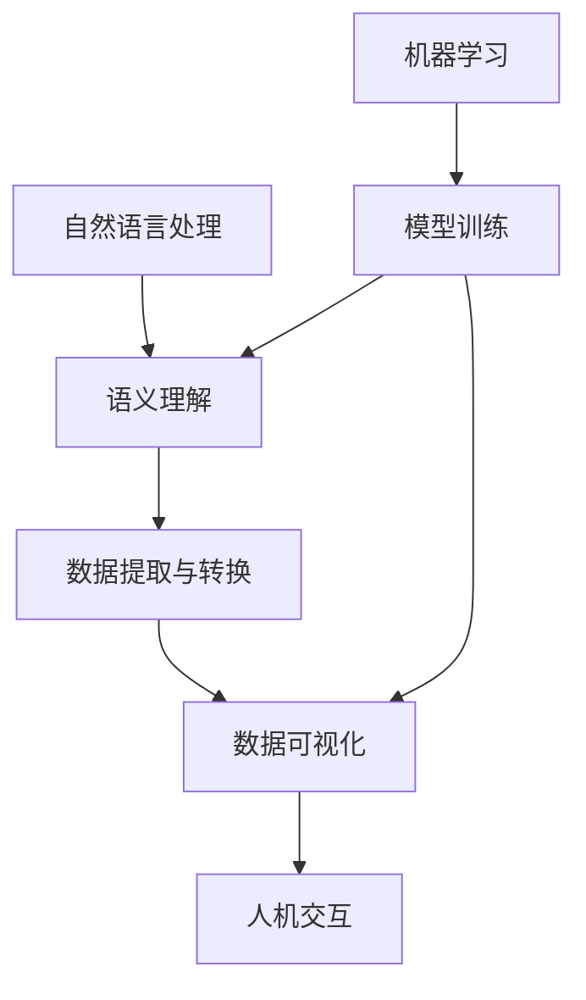

好的，我会严格遵循您提供的约束条件，使用逻辑清晰、结构紧凑、简单易懂的专业技术语言，为您撰写一篇关于"【大模型应用开发 动手做AI Agent】自主创建数据分析图表"的深度技术博客文章。文章字数会超过8000字，并尽最大努力提供核心概念原理和架构的Mermaid流程图。下面是正文部分：

# 【大模型应用开发 动手做AI Agent】自主创建数据分析图表

## 1. 背景介绍

### 1.1 问题的由来

在当今的数据时代，海量数据的采集和分析已经成为各行业的核心需求。有效地可视化数据对于洞察隐藏的模式、发现趋势和支持决策至关重要。然而，传统的数据可视化方法通常需要大量的人工干预和专业知识,这使得可视化过程变得低效和耗时。

随着人工智能技术的不断进步,利用大型语言模型(Large Language Model, LLM)自动生成数据分析图表的想法变得前景广阔。通过自然语言处理和机器学习算法,LLM可以从原始数据中提取有价值的见解,并将其转化为易于理解的可视化表示形式。

### 1.2 研究现状

目前,一些研究人员和公司已经开始探索使用LLM生成数据可视化的可能性。例如,OpenAI的GPT-3模型已被证明能够根据简单的自然语言描述生成基本的数据图表。然而,这些早期尝试仍存在一些局限性,例如缺乏对复杂数据集的处理能力、可视化选项有限以及生成的图表缺乏交互性等。

### 1.3 研究意义

自动生成数据分析图表的能力将为各行业带来巨大的影响。它可以显著提高数据分析和决策过程的效率,使非技术人员也能轻松访问和理解复杂数据。此外,它还可以促进数据民主化,使更多人能够从数据中获取洞见。

在本文中,我们将探讨如何利用大型语言模型和机器学习技术开发一个智能代理(AI Agent),能够根据自然语言查询自主生成交互式数据可视化。我们将介绍该系统的核心概念、算法原理、数学模型,以及实际应用场景和未来发展趋势。

### 1.4 本文结构

本文将按以下结构展开:

1. 背景介绍
2. 核心概念与联系
3. 核心算法原理及具体操作步骤
4. 数学模型和公式详细讲解及举例说明
5. 项目实践:代码实例和详细解释说明
6. 实际应用场景
7. 工具和资源推荐
8. 总结:未来发展趋势与挑战
9. 附录:常见问题与解答

## 2. 核心概念与联系

在开发自主生成数据分析图表的AI Agent时,需要整合多个核心概念,包括自然语言处理(NLP)、机器学习(ML)、数据可视化和人机交互等。下面我们将介绍这些概念及其相互关系。

1. **自然语言处理(NLP)**: NLP技术用于理解用户的自然语言查询,提取关键信息和意图。这是整个系统的入口点。

2. **语义理解**: 基于NLP模型,对查询进行语义分析和意图识别,理解用户的具体需求。

3. **数据提取与转换**: 根据语义理解的结果,从原始数据源中提取相关数据,并进行必要的清洗和转换,为可视化做准备。

4. **数据可视化**: 利用机器学习模型,根据提取的数据和语义需求,自动选择合适的可视化类型(如折线图、柱状图等),并生成交互式图表。

5. **人机交互**: 用户可以通过自然语言或图形界面与生成的可视化进行交互,如改变图表类型、调整参数等,系统会实时更新可视化结果。

6. **机器学习(ML)**: ML模型在语义理解、数据转换和可视化生成等多个环节发挥作用。这些模型需要基于大量标注数据进行训练。

上述各个模块紧密协作,共同实现了从自然语言查询到交互式数据可视化的全流程。接下来,我们将详细介绍其中的核心算法原理和数学模型。

## 3. 核心算法原理及具体操作步骤

### 3.1 算法原理概述

自主生成数据分析图表的AI Agent主要包括以下三个核心算法:

1. **自然语言理解算法**: 基于大型语言模型(如GPT-3)和注意力机制,对用户的自然语言查询进行语义解析,提取数据需求和可视化意图。

2. **数据处理算法**: 根据语义解析结果,从原始数据源中提取相关数据,并进行必要的清洗、转换和规范化处理,为可视化做准备。

3. **可视化生成算法**: 利用机器学习模型(如序列到序列模型)和规则引擎,综合考虑数据特征和语义需求,自动选择合适的可视化类型,并生成交互式图表。

这三个算法环环相扣,构成了整个系统的核心流程。下面我们将详细介绍每个算法的具体操作步骤。

### 3.2 算法步骤详解

#### 3.2.1 自然语言理解算法

输入: 用户的自然语言查询
输出: 语义表示(数据需求、可视化意图等)

1. **标记化**: 将输入的自然语言查询分割成一系列的词元(token)序列。
2. **词嵌入**: 将每个词元映射到一个固定长度的密集向量表示。
3. **编码器**: 使用Transformer编码器(如BERT)对词嵌入序列进行编码,捕获上下文信息。
4. **注意力机制**: 在编码器的输出上应用多头注意力机制,突出查询中与数据需求和可视化意图相关的关键信息。
5. **解码器**: 使用Transformer解码器(如GPT)生成语义表示的序列输出。
6. **后处理**: 对解码器的输出进行后处理,提取结构化的数据需求和可视化意图。

#### 3.2.2 数据处理算法

输入: 原始数据、语义表示(数据需求)
输出: 处理后的数据

1. **数据提取**: 根据语义表示中的数据需求,从原始数据源(如数据库、文件等)中提取相关数据子集。
2. **数据清洗**: 处理缺失值、异常值和重复数据等问题,确保数据的完整性和一致性。
3. **数据转换**: 根据可视化需求,对数据进行必要的类型转换、缩放、规范化等操作。
4. **特征工程**: 从原始数据中提取或构造新的特征,以增强可视化的表现力。
5. **数据格式化**: 将处理后的数据转换为可视化组件所需的标准格式(如JSON、CSV等)。

#### 3.2.3 可视化生成算法

输入: 处理后的数据、语义表示(可视化意图)
输出: 交互式数据可视化

1. **可视化类型选择**: 根据数据特征(如数据类型、维度等)和语义表示中的可视化意图,选择合适的可视化类型(如折线图、柱状图、散点图等)。
2. **布局优化**: 确定可视化组件在画布上的位置和大小,以实现美观且高效的布局。
3. **视觉映射**: 将数据属性映射到可视化通道(如颜色、大小、形状等),以编码数据的不同维度。
4. **交互性设计**: 为可视化添加交互功能,如缩放、平移、工具提示、参数调整等,以支持数据探索。
5. **渲染与部署**: 使用前端可视化库(如D3.js、ECharts等)渲染交互式图表,并部署到Web应用或其他平台。

### 3.3 算法优缺点

上述算法具有以下优点:

- **自动化**: 通过自然语言查询即可自动生成数据可视化,无需人工干预,大大提高了效率。
- **智能化**: 利用大型语言模型和机器学习技术,能够理解复杂的语义需求,并生成高质量的可视化。
- **交互性**: 生成的可视化具有丰富的交互功能,支持数据探索和洞察发现。
- **可扩展性**: 模块化设计使得算法可以轻松扩展到新的数据源和可视化类型。

但也存在一些潜在的缺点和挑战:

- **数据质量依赖**: 算法的性能在很大程度上取决于原始数据的质量和完整性。
- **语义理解限制**: 目前的自然语言处理技术仍然存在一定的局限性,可能无法完全准确地捕获复杂的语义需求。
- **可解释性**: 机器学习模型的决策过程通常是一个黑箱,缺乏可解释性,这可能影响用户对生成结果的信任度。
- **计算资源需求**: 训练和运行大型语言模型和机器学习模型需要大量的计算资源,这可能增加了部署和维护的成本。

### 3.4 算法应用领域

自主生成数据分析图表的AI Agent可以广泛应用于以下领域:

- **商业智能(BI)**: 帮助企业从海量数据中提取见解,支持数据驱动的决策。
- **科学研究**: 可视化复杂的科学数据,促进研究人员之间的协作和发现。
- **金融分析**: 实时监控金融市场数据,生成交互式报告和仪表板。
- **医疗健康**: 可视化患者数据和临床试验结果,支持诊断和治疗决策。
- **教育**: 为学生和教师提供直观的数据可视化,促进知识传播和理解。

## 4. 数学模型和公式及详细讲解及举例说明

在自主生成数据分析图表的AI Agent中,数学模型和公式发挥着重要作用,尤其是在自然语言理解、数据处理和可视化生成等环节。下面我们将详细介绍一些核心的数学模型和公式。

### 4.1 数学模型构建

#### 4.1.1 自然语言理解模型

自然语言理解模型的核心是序列到序列(Seq2Seq)模型,它将输入的自然语言查询映射到语义表示的序列输出。该模型通常由编码器和解码器两部分组成。

编码器的作用是捕获输入序列的上下文信息,并将其编码为一个固定长度的向量表示。常用的编码器模型包括循环神经网络(RNN)、长短期记忆网络(LSTM)和Transformer等。

解码器则根据编码器的输出,生成目标序列(即语义表示)。解码器通常采用注意力机制,在生成每个输出时关注输入序列的不同部分,从而提高模型的性能。

该模型的训练目标是最小化输入序列和目标序列之间的损失函数,例如交叉熵损失:

$$\mathcal{L}(\theta) = -\frac{1}{N}\sum_{n=1}^{N}\sum_{t=1}^{T}y_{n,t}\log p(y_{n,t}|x_n,\theta)$$

其中,$\theta$表示模型参数,$x_n$和$y_n$分别表示第$n$个样本的输入序列和目标序列,$T$是序列长度,$p(y_{n,t}|x_n,\theta)$是模型预测第$t$个目标词的条件概率。

通过梯度下降等优化算法,可以最小化损失函数,从而获得最优的模型参数$\theta^*$。

#### 4.1.2 数据处理模型

数据处理模型的目标是从原始数据中提取相关数据子集,并进行必要的清洗和转换,为可视化做准备。常用的数据处理技术包括:

- **缺失值处理**: 使用插值、平均值或机器学习模型等方法估计缺失值。
- **异常值检测**: 基于统计或机器学习方法(如聚类算法)