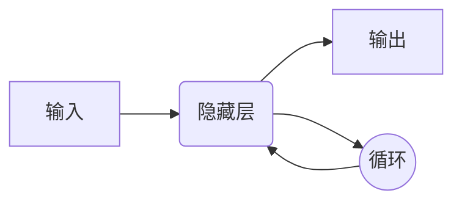
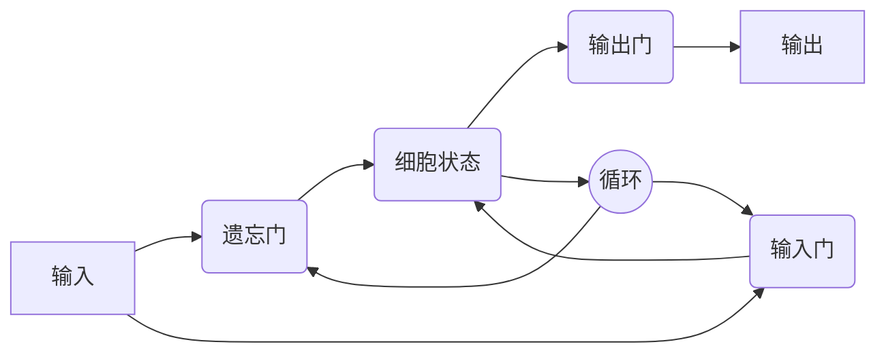
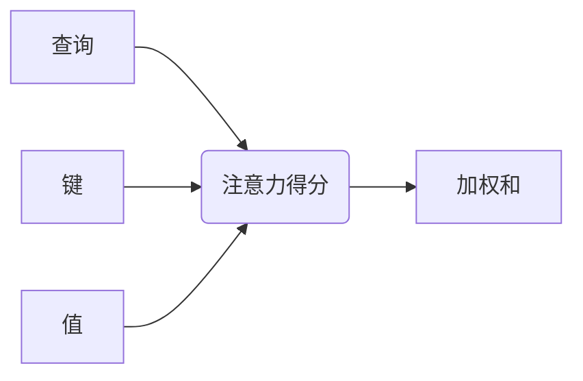

好的,我会按照您的要求,撰写一篇题为《从零开始大模型开发与微调：循环神经网络理论讲解》的技术博客文章。文章将遵循您提供的结构模板,使用Markdown格式,数学公式采用LaTex格式,并尽最大努力提供核心概念原理和架构的Mermaid流程图。我将努力确保文章逻辑清晰、内容深入、见解独到。请稍等,这可能需要一些时间。

# 从零开始大模型开发与微调：循环神经网络理论讲解

## 1. 背景介绍

### 1.1 问题的由来

随着数据的快速增长和计算能力的不断提高,人工智能领域出现了一股新的浪潮——大模型。大模型通过在海量数据上进行预训练,能够学习到通用的知识表示,并在下游任务上通过微调获得出色的性能表现。然而,开发和微调这些大模型面临着诸多挑战。

### 1.2 研究现状

目前,transformer等注意力机制模型在自然语言处理、计算机视觉等领域取得了巨大成功。GPT、BERT、ViT等大模型凭借其强大的表现力和泛化能力,成为了深度学习的主流模型。但这些模型往往包含数十亿甚至上百亿参数,对计算资源和数据需求极高,给模型开发和微调带来了巨大挑战。

### 1.3 研究意义

本文将重点介绍循环神经网络(RNN)在大模型开发和微调中的应用,旨在为读者提供循环模型的核心理论知识,并探讨其在处理序列数据方面的优势。通过深入了解RNN的原理和实现细节,读者可以更好地把握大模型的本质,为未来的模型创新奠定基础。

### 1.4 本文结构

本文将从以下几个方面全面解析循环神经网络在大模型开发和微调中的应用:

1. 核心概念与联系
2. 核心算法原理与具体操作步骤
3. 数学模型和公式详细讲解与案例分析
4. 项目实践:代码实例和详细解释
5. 实际应用场景
6. 工具和资源推荐
7. 总结:未来发展趋势与挑战
8. 附录:常见问题与解答

## 2. 核心概念与联系

在深入探讨循环神经网络的细节之前,我们先来了解一些核心概念,为后续内容做好铺垫。

### 2.1 序列数据

序列数据指的是一种按照时间或空间顺序排列的数据,如自然语言文本、语音信号、基因序列等。处理这种数据需要考虑元素之间的依赖关系,传统的前馈神经网络由于缺乏记忆能力,难以很好地捕捉长期依赖。

### 2.2 循环神经网络(RNN)

循环神经网络是一种特殊的深度神经网络,它通过在网络中引入循环连接,使得当前时刻的输出不仅依赖于当前输入,还依赖于前一时刻的隐藏状态,从而获得了处理序列数据的能力。

### 2.3 长短期记忆网络(LSTM)

LSTM是RNN的一种变体,它通过设计特殊的门控机制,能够更好地捕捉长期依赖,解决了传统RNN存在的梯度消失和爆炸问题。LSTM广泛应用于自然语言处理、语音识别、时间序列预测等领域。

### 2.4 注意力机制

注意力机制是一种重要的神经网络组件,它允许模型在处理序列数据时,动态地关注输入序列中的不同部分,并据此分配不同的权重。注意力机制在提高模型性能的同时,也增加了可解释性。

### 2.5 大模型与微调

大模型通常指包含数十亿甚至上百亿参数的深度神经网络模型。这些模型通过在大规模无标注数据上进行自监督预训练,学习到通用的知识表示。在下游任务上,我们可以对这些大模型进行微调(fine-tuning),使其适应特定的任务,从而获得出色的性能表现。

## 3. 核心算法原理与具体操作步骤

### 3.1 算法原理概述

循环神经网络的核心思想是在神经网络中引入循环连接,使得当前时刻的输出不仅依赖于当前输入,还依赖于前一时刻的隐藏状态。这种循环结构赋予了RNN处理序列数据的能力。

在传统的前馈神经网络中,我们有如下公式:

$$
\begin{aligned}
h_t &= f(W_x x_t + b) \\
y_t &= g(W_h h_t + c)
\end{aligned}
$$

其中$x_t$是当前时刻的输入,$h_t$是隐藏层的状态,$y_t$是输出,$f$和$g$分别是隐藏层和输出层的激活函数。

而在RNN中,隐藏层的状态不仅依赖于当前输入,还依赖于前一时刻的隐藏状态:

$$
\begin{aligned}
h_t &= f(W_x x_t + W_h h_{t-1} + b) \\
y_t &= g(W_y h_t + c)
\end{aligned}
$$

其中$W_h$是循环权重矩阵,它将前一时刻的隐藏状态$h_{t-1}$映射到当前时刻的隐藏状态$h_t$。这种循环结构使得RNN能够捕捉序列数据中的长期依赖关系。

### 3.2 算法步骤详解

以下是RNN在处理序列数据时的具体步骤:

1. **初始化**:首先需要初始化RNN的隐藏状态$h_0$,通常将其设置为全0向量。

2. **前向传播**:对于序列中的每一个时间步$t$,我们根据当前输入$x_t$和前一时刻的隐藏状态$h_{t-1}$,计算当前时刻的隐藏状态$h_t$和输出$y_t$:

   $$
   \begin{aligned}
   h_t &= f(W_x x_t + W_h h_{t-1} + b) \\
   y_t &= g(W_y h_t + c)
   \end{aligned}
   $$

3. **反向传播**:在训练过程中,我们需要计算损失函数关于模型参数的梯度,并使用优化算法(如SGD或Adam)更新参数。由于RNN存在循环结构,我们需要使用反向传播through time(BPTT)算法来计算梯度。

4. **输出**:对于序列预测任务,我们可以直接使用每一时刻的输出$y_t$作为预测结果;对于序列生成任务,我们可以将上一时刻的输出$y_{t-1}$作为当前时刻的输入$x_t$,递归地生成整个序列。

### 3.3 算法优缺点

**优点**:

- 能够捕捉序列数据中的长期依赖关系
- 模型结构简单,易于理解和实现
- 在许多序列建模任务上表现出色,如语言模型、机器翻译等

**缺点**:

- 存在梯度消失和爆炸问题,难以捕捉到很长的依赖关系
- 无法并行计算,训练速度较慢
- 对于同一个序列中的不同位置,RNN的表示能力是相同的,缺乏针对性

为了解决RNN的这些缺点,研究者提出了一些改进方案,如LSTM、GRU等,以及注意力机制。这些改进使得RNN在处理长序列时更加稳定和高效。

### 3.4 算法应用领域

循环神经网络及其变体广泛应用于以下领域:

- **自然语言处理**:语言模型、机器翻译、文本生成、情感分析等
- **语音识别**:将语音信号转录为文本
- **时间序列预测**:股票预测、天气预报等
- **生物信息学**:蛋白质结构预测、DNA序列分析等

## 4. 数学模型和公式详细讲解与举例说明

在上一节中,我们介绍了RNN的基本原理和算法步骤。本节将深入探讨RNN的数学模型,并通过具体案例帮助读者更好地理解相关概念和公式。

### 4.1 数学模型构建

我们以一个简单的字符级语言模型为例,来构建RNN的数学模型。假设我们有一个长度为$T$的字符序列$\{x_1, x_2, \ldots, x_T\}$,其中每个$x_t$是一个one-hot向量,表示该时刻的字符。我们的目标是根据前面的字符,预测下一个字符的概率分布。

对于每一个时间步$t$,RNN的隐藏状态$h_t$可以表示为:

$$
h_t = f(W_x x_t + W_h h_{t-1} + b)
$$

其中$W_x$是输入权重矩阵,$W_h$是循环权重矩阵,$b$是偏置向量,$f$是激活函数(如tanh或ReLU)。

然后,我们可以使用$h_t$来计算下一个字符的概率分布:

$$
\hat{y}_t = \text{softmax}(W_y h_t + c)
$$

其中$W_y$是输出权重矩阵,$c$是输出偏置向量,softmax函数将线性输出转换为概率分布。

在训练过程中,我们可以使用交叉熵损失函数来衡量模型的预测与真实标签之间的差异:

$$
L = -\frac{1}{T} \sum_{t=1}^T \log P(x_t | x_1, \ldots, x_{t-1})
$$

其中$P(x_t | x_1, \ldots, x_{t-1})$是根据前面的字符预测当前字符$x_t$的概率。

通过反向传播算法,我们可以计算损失函数关于模型参数的梯度,并使用优化算法(如SGD或Adam)来更新参数,从而最小化损失函数。

### 4.2 公式推导过程

在上一小节中,我们给出了RNN的核心公式,但没有详细解释它们是如何推导出来的。现在,我们将通过数学推导的方式,一步步地揭示这些公式的来源。

假设我们有一个长度为$T$的序列$\{x_1, x_2, \ldots, x_T\}$,我们希望建立一个模型来预测下一个元素$x_{T+1}$。根据概率链式法则,我们可以将$P(x_{T+1})$分解为:

$$
P(x_{T+1}) = \sum_{x_1, x_2, \ldots, x_T} P(x_1, x_2, \ldots, x_T, x_{T+1})
$$

进一步应用链式法则,我们可以得到:

$$
P(x_{T+1}) = \sum_{x_1, x_2, \ldots, x_T} P(x_{T+1} | x_1, x_2, \ldots, x_T) P(x_1, x_2, \ldots, x_T)
$$

为了简化计算,我们可以引入一个隐藏状态$h_t$,使得:

$$
P(x_{t+1} | x_1, x_2, \ldots, x_t) \approx P(x_{t+1} | h_t)
$$

其中$h_t$是一个向量,它综合了序列$\{x_1, x_2, \ldots, x_t\}$的信息。

现在,我们需要定义$h_t$的计算方式。一种自然的选择是使用递归关系:

$$
h_t = f(x_t, h_{t-1})
$$

其中$f$是一个非线性函数,例如前馈神经网络。具体来说,我们可以将$f$定义为:

$$
h_t = \phi(W_x x_t + W_h h_{t-1} + b)
$$

其中$W_x$