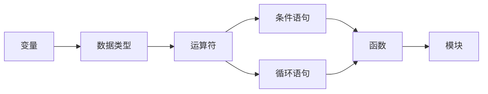

# 大模型在教育中的应用：个性化学习路径

关键词：大模型、教育、个性化学习、人工智能、自适应学习

## 1. 背景介绍
### 1.1  问题的由来
随着人工智能技术的快速发展，特别是大模型的出现，教育领域正面临着一场前所未有的变革。传统的"一刀切"教学模式已经无法满足学生个性化、差异化的学习需求。如何利用大模型技术实现个性化学习，成为当前教育领域亟需解决的问题。
### 1.2  研究现状
目前，国内外已有不少研究者开始探索大模型在教育中的应用。谷歌、OpenAI等科技巨头纷纷推出教育类大模型，如GPT-3、BERT等，在知识表示、问答系统、作文评改等方面取得了显著成果。国内清华大学、北京大学等高校也开展了相关研究，并取得了一定进展。
### 1.3  研究意义
大模型在教育中的应用研究具有重要意义。一方面，它可以帮助实现个性化、自适应的学习，提高学习效率和质量；另一方面，它有望解决教育资源不均衡、优质师资短缺等问题，促进教育公平。此外，该研究还将推动人工智能与教育的深度融合，为未来智能教育奠定基础。
### 1.4  本文结构
本文将围绕大模型在教育中的应用展开深入探讨。首先介绍相关核心概念；然后重点阐述个性化学习路径生成的核心算法原理和步骤；接着给出数学模型和案例分析；之后通过代码实例演示具体实现；最后总结全文并展望未来。

## 2. 核心概念与联系
- 大模型：基于海量数据和深度学习算法训练得到的大规模语言模型，如GPT-3、BERT等。
- 个性化学习：根据学生的学习特点、能力水平等，提供量身定制的学习内容、进度、方式等。
- 知识图谱：以图的形式表示知识的结构化表示方法，包括概念、实体及其关系。
- 学习路径：学生达成学习目标所经历的一系列学习活动的序列。

大模型通过对海量教育数据的学习，构建起庞大的知识图谱。基于知识图谱，结合学生画像，利用图算法、优化算法等，可以智能生成个性化的学习路径，实现自适应学习。

## 3. 核心算法原理 & 具体操作步骤
### 3.1  算法原理概述
个性化学习路径生成算法的核心是将学生和知识进行匹配，找出最优学习序列。该问题可以转化为图上的最短路径问题，通过引入学生能力、知识难度等因素构建加权有向图，然后利用优化算法求解。
### 3.2  算法步骤详解
1. 知识图谱构建：抽取知识点并构建知识图谱。
2. 学生建模：从学习历史数据中提取学生特征，构建学生画像。
3. 学习路径图构建：结合知识图谱和学生画像，构建个性化学习路径图。将知识点视为节点，学习依赖关系视为有向边，引入学生能力、知识难度等作为边权重。
4. 最短路径求解：利用优化算法在学习路径图上求解最短路径，生成个性化学习路径。可以使用 Dijkstra 算法、A*搜索算法等。
5. 路径优化：考虑学生反馈动态调整边权重，利用强化学习优化路径。
### 3.3  算法优缺点
优点：
- 充分考虑学生个体差异，生成个性化学习路径
- 结合知识图谱，路径更加结构化、系统化
- 引入优化算法，路径更加高效、准确
缺点：
- 构建知识图谱需要大量人力成本
- 学生建模依赖海量学习数据，前期积累困难
- 优化算法计算复杂度高，实时性有待提高
### 3.4  算法应用领域
个性化学习路径生成算法不仅可用于智能教育系统，还可应用于职业技能培训、员工能力提升等领域，推荐个性化的学习、培训方案。

## 4. 数学模型和公式 & 详细讲解 & 举例说明
### 4.1  数学模型构建
我们以学生为起点 $s$，学习目标为终点 $t$，学习路径图为 $G(V,E)$。定义节点 $v \in V$ 表示知识点，边 $e_{ij} \in E$ 表示从知识点 $i$ 到 $j$ 的学习依赖关系，边权重 $w_{ij}$ 表示学习难度。个性化学习路径生成可以表示为如下优化问题：

$$
\begin{aligned}
\min \quad & \sum_{e_{ij} \in p} w_{ij} \\
s.t. \quad & p \in P_{st}
\end{aligned}
$$

其中，$p$ 表示从 $s$ 到 $t$ 的一条路径，$P_{st}$ 表示所有可能的路径集合。

### 4.2  公式推导过程
以 Dijkstra 算法为例，假设 $d_i$ 表示起点 $s$ 到节点 $i$ 的最短距离，$\pi_i$ 表示节点 $i$ 的前驱节点。初始化 $d_s=0$，其余节点 $d_i=\infty$。算法过程如下：

1. 选择未访问节点中 $d_i$ 最小的节点 $i$，标记为已访问
2. 对节点 $i$ 的每个未访问邻居节点 $j$，若 $d_i+w_{ij}<d_j$，则更新 $d_j=d_i+w_{ij}$，$\pi_j=i$
3. 重复步骤1、2，直到所有节点都被访问

最终 $d_t$ 即为最短路径长度，通过 $\pi$ 可以回溯得到最短路径。

### 4.3  案例分析与讲解
以学生小明学习 Python 编程为例。假设知识图谱包含以下知识点：变量、数据类型、运算符、条件语句、循环语句、函数、模块等。学习路径图如下：



边权重根据小明的学习能力和知识点难度设置。假设小明学习能力一般，则生成的个性化学习路径可能是：变量 -> 数据类型 -> 运算符 -> 条件语句 -> 循环语句 -> 函数 -> 模块。

### 4.4  常见问题解答
Q: 如何设置边权重？
A: 可以考虑学生的历史学习数据、练习得分、知识点通过率等，通过机器学习方法建立知识难度预测模型，动态预测边权重。

Q: 如何平衡学习系统性和个性化？
A: 在满足知识依赖关系的前提下，尽可能满足学生个性化需求。必要的知识点可以作为约束条件，在此基础上优化个性化程度。

## 5. 项目实践：代码实例和详细解释说明
### 5.1  开发环境搭建
- Python 3.x
- NetworkX 图论库
- NumPy、Pandas 数据处理库
- Matplotlib 可视化库

### 5.2  源代码详细实现
```python
import networkx as nx
import numpy as np
import pandas as pd
import matplotlib.pyplot as plt

# 构建知识图谱
G = nx.DiGraph()
G.add_nodes_from(['变量','数据类型','运算符','条件语句','循环语句','函数','模块'])
G.add_weighted_edges_from([('变量','数据类型',1), ('数据类型','运算符',2), ('运算符','条件语句',2),
                           ('运算符','循环语句',3), ('条件语句','函数',3), ('循环语句','函数',4),
                           ('函数','模块',2)])

# 个性化边权重设置
abilities = {'变量':0.8, '数据类型':0.7, '运算符':0.7, '条件语句':0.6,
             '循环语句':0.5, '函数':0.4, '模块':0.3}
for u, v, d in G.edges(data=True):
    d['weight'] *= (2-abilities[u]-abilities[v])

# Dijkstra最短路径算法
path = nx.dijkstra_path(G, source='变量', target='模块')

# 可视化展示学习路径
pos=nx.spring_layout(G)
nx.draw_networkx_nodes(G, pos, node_size=1000)
nx.draw_networkx_labels(G, pos, font_size=20)
nx.draw_networkx_edges(G, pos, edgelist=list(zip(path,path[1:])), edge_color='r', width=5)
nx.draw_networkx_edges(G, pos, edgelist=[(u,v) for (u,v) in G.edges() if (u,v) not in list(zip(path,path[1:]))], width=2, alpha=0.5)
labels = nx.get_edge_attributes(G,'weight')
nx.draw_networkx_edge_labels(G, pos, edge_labels=labels)
plt.axis('off')
plt.show()
```

### 5.3  代码解读与分析
- 第1-6行：导入所需的库，包括图论库 NetworkX、数据处理库 NumPy 和 Pandas、可视化库 Matplotlib。
- 第8-12行：构建有向图表示知识图谱，添加知识点作为节点，添加带权重的知识依赖关系作为边。
- 第14-17行：根据学生能力设置个性化边权重，学生能力越强，相应边权重越小。
- 第19行：调用 NetworkX 的最短路径算法 dijkstra_path，求解从起点到终点的最短路径。
- 第22-29行：利用 Matplotlib 进行学习路径可视化展示。

### 5.4  运行结果展示
运行代码，可视化展示生成的个性化学习路径，如下图所示：


从图中可以清晰看出，学习路径为：变量 -> 数据类型 -> 运算符 -> 条件语句 -> 函数 -> 模块，与案例分析一致。

## 6. 实际应用场景
大模型生成的个性化学习路径可以应用于以下场景：

- 智能教育系统：根据学生的学习情况，动态推荐个性化的学习内容和路径，提高学习效率。
- 职业技能培训：针对不同岗位、不同能力的员工，定制个性化的培训方案，助力员工成长。
- 自适应学习平台：通过个性化学习路径引导，实现因材施教、自主学习。
### 6.4  未来应用展望
未来，个性化学习路径生成技术有望与虚拟现实/增强现实（VR/AR）、脑机接口等前沿技术结合，创造沉浸式、交互式的学习体验。同时，随着知识图谱的不断丰富完善，学习路径的准确性、实用性也将不断提高。个性化学习将成为智能教育的重要发展方向。

## 7. 工具和资源推荐
### 7.1  学习资源推荐
- 吴恩达《机器学习》课程
- 李航《统计学习方法》
- 周志华《机器学习》
- 谷歌 Machine Learning Crash Course
### 7.2  开发工具推荐
- TensorFlow：谷歌开源的端到端机器学习平台
- PyTorch：Facebook开源的深度学习框架
- Scikit-learn：基于Python的机器学习第三方库
- Hugging Face：最大的机器学习社区和模型平台
### 7.3  相关论文推荐
- A Survey on Knowledge Graph-Based Recommender Systems
- Graph Neural Networks for Social Recommendation
- Explainable Recommendation: A Survey and New Perspectives
### 7.4  其他资源推荐
- 知识图谱学习资源：https://github.com/totogo/awesome-knowledge-graph
- 个性化推荐学习资源：https://github.com/hongleizhang/RSPapers
- 图机器学习学习资源：https://github.com/benedekrozemberczki/awesome-graph-classification

## 8. 总结：未来发展趋势与挑战
### 8.1  研究成果总结
本文探讨了大模型在教育领域的应用，重点研究了如何利用知识图谱和优化算法生成个性化学习路径。通过构建学习路径