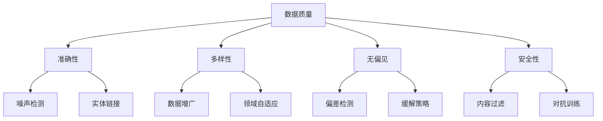

好的,我会严格遵循约束条件,以"大规模语言模型从理论到实践 数据质量"为主题,撰写一篇专业的技术博客文章。

# 大规模语言模型从理论到实践 数据质量

## 1. 背景介绍

### 1.1 问题的由来

随着人工智能和自然语言处理技术的不断发展,大规模语言模型(Large Language Models,LLMs)已经成为当前研究的热点领域之一。LLMs通过在海量文本数据上进行预训练,学习语言的语义和上下文信息,从而具备强大的语言理解和生成能力。然而,训练数据的质量对于模型性能的影响至关重要。低质量的训练数据不仅会导致模型学习到错误或有偏见的知识,还可能引入安全隐患,如生成违法、暴力或不当内容。

### 1.2 研究现状

目前,已有多项研究探讨了训练数据质量对LLMs性能的影响。一些研究发现,使用高质量、多样化的训练数据可以显著提高模型的泛化能力和鲁棒性。另一些研究则关注于检测和过滤训练数据中的噪声、偏差和不当内容。然而,由于训练数据规模庞大,手动清理和标注是一项艰巨的任务。因此,如何高效地评估和提高训练数据质量,仍然是一个亟待解决的挑战。

### 1.3 研究意义

提高训练数据质量不仅可以优化LLMs的性能,还能确保模型生成的内容更加准确、公正和安全。高质量的训练数据有助于减少模型中的偏见和不当内容,从而提高公众对AI系统的信任度。此外,数据质量评估和改进技术在其他领域也具有广泛的应用前景,如信息检索、知识图谱构建等。

### 1.4 本文结构

本文将从理论和实践两个角度,系统地探讨大规模语言模型中的数据质量问题。首先,我们将介绍相关的核心概念和理论基础。接下来,详细阐述数据质量评估和改进的核心算法原理及具体操作步骤。然后,我们将构建数学模型,并通过公式推导和案例分析,深入讲解数据质量评估和改进的方法。此外,我们还将提供项目实践的代码示例和详细解释。最后,我们将探讨实际应用场景、工具和资源推荐,并总结未来的发展趋势和挑战。

## 2. 核心概念与联系

在探讨大规模语言模型中的数据质量问题之前,我们需要先了解一些核心概念及其相互关系。

1. **数据质量(Data Quality)**: 指训练数据的整体质量,包括准确性、多样性、无偏见性和安全性等多个方面。
2. **准确性(Accuracy)**: 指训练数据中的事实和知识是否正确无误,涉及噪声检测和实体链接等技术。
3. **多样性(Diversity)**: 指训练数据是否覆盖了足够广泛的领域和主题,可通过数据增广和领域自适应等方法提高。
4. **无偏见(Unbiasedness)**: 指训练数据中是否存在潜在的偏见和歧视,需要进行偏差检测和采取缓解策略。
5. **安全性(Safety)**: 指训练数据中是否包含违法、暴力或不当内容,需要进行内容过滤和对抗训练等处理。

上述概念相互关联且影响重大。例如,如果训练数据缺乏多样性,模型可能会产生偏差;如果训练数据包含不当内容,模型可能会生成不安全的输出。因此,我们需要从多个角度评估和改进数据质量,以确保训练出高质量的语言模型。

## 3. 核心算法原理 & 具体操作步骤

### 3.1 算法原理概述

评估和改进大规模语言模型训练数据质量的核心算法原理可以概括为以下几个方面:

1. **噪声检测(Noise Detection)**: 通过统计和机器学习方法,自动识别和过滤训练数据中的噪声样本,如拼写错误、语法错误等。
2. **实体链接(Entity Linking)**: 将训练数据中的实体(如人名、地名等)链接到知识库中的条目,从而校正错误信息并丰富语义信息。
3. **数据增广(Data Augmentation)**: 通过各种技术(如背译、同义词替换等)生成新的训练样本,扩充数据集的覆盖面和多样性。
4. **领域自适应(Domain Adaptation)**: 将通用语料库适应到特定领域,生成与目标任务更相关的训练数据。
5. **偏差检测(Bias Detection)**: 使用统计学和机器学习方法,发现训练数据中潜在的偏差和歧视,如性别偏差、种族偏差等。
6. **缓解策略(Debiasing Strategies)**: 采取重采样、数据增广、对抗训练等策略,减轻或消除训练数据中的偏差。
7. **内容过滤(Content Filtering)**: 使用规则或机器学习模型,自动识别和过滤训练数据中的违法、暴力或不当内容。
8. **对抗训练(Adversarial Training)**: 通过对抗样本训练,增强模型对于不当输入的鲁棒性,从而提高输出内容的安全性。

### 3.2 算法步骤详解

1. **噪声检测**
   - 统计方法:基于规则和阈值,如字符/词频统计、语法检查等。
   - 机器学习方法:训练二分类模型(如逻辑回归)识别噪声样本。
   - 处理方式:过滤或修正被检测为噪声的样本。

2. **实体链接**
   - 命名实体识别:使用序列标注模型识别文本中的实体。
   - 实体disambiguaton:将实体链接到知识库中的正确条目。
   - 实体归一化:对错误信息进行修正,丰富语义信息。

3. **数据增广**
   - 背译:将源语言翻译成pivot语言,再翻译回源语言。
   - 同义词替换:使用WordNet等词典,替换文本中的词语。
   - 语法变换:通过主动/被动转换、词序变换等方式。
   - 上采样:对少数类样本进行复制,增加其在训练集中的比例。

4. **领域自适应**
   - 数据选择:从通用语料库中选取与目标领域相关的子集。
   - 实例加权:对通用语料库中的实例赋予不同权重。
   - 特征增强:将领域特征(如关键词)融入通用语料库。

5. **偏差检测**
   - 统计检测:计算不同人口属性组别在数据集中的分布差异。
   - 表示学习:将文本映射到连续向量空间,检测不同组别的聚类程度。
   - 语料库评测:在标注语料库上测试模型,发现偏差现象。

6. **缓解策略**
   - 重采样:过采样少数类样本,下采样多数类样本。
   - 数据增广:针对性地生成少数类样本,增加多样性。
   - 对抗训练:最小化模型对于对抗样本的损失,提高鲁棒性。
   - 后处理:在模型输出后,采取规则或模型校正偏差。

7. **内容过滤**
   - 规则过滤:使用关键词列表、正则表达式等规则过滤不当内容。
   - 机器学习模型:训练分类器(如BERT)检测违规、暴力等内容。
   - 处理方式:直接过滤不当样本,或对其进行掩码/替换处理。

8. **对抗训练**
   - 对抗样本生成:针对性地构造对抗样本,使模型产生错误输出。
   - 对抗训练:将对抗样本加入训练数据,最小化模型对其的损失。
   - 提高鲁棒性:增强模型对于对抗输入和不当内容的鲁棒性。

### 3.3 算法优缺点

上述算法在提高大规模语言模型训练数据质量方面具有一定的优势,但也存在一些局限性和挑战:

优点:
- 自动化程度高,可以高效处理海量训练数据。
- 融合了统计学、机器学习和自然语言处理等多种技术。
- 涵盖了准确性、多样性、无偏见性和安全性等多个维度。
- 可以有效提高模型的泛化能力、鲁棒性和可信度。

缺点:
- 某些算法依赖于人工标注的语料库,成本较高。
- 算法的性能受到领域、语言和任务的限制。
- 处理低资源语言和特殊领域数据时,效果可能不佳。
- 某些策略(如对抗训练)可能会影响模型的收敛性和效率。

### 3.4 算法应用领域

上述算法不仅适用于大规模语言模型的训练数据质量评估和改进,还可以广泛应用于其他自然语言处理任务和领域,例如:

- 信息检索:提高检索结果的准确性和多样性。
- 知识图谱构建:消除知识库中的噪声和偏差。
- 对话系统:生成更加自然、无偏见和安全的对话响应。
- 内容审核:自动识别和过滤不当的用户生成内容。
- 教育领域:消除教育资源中的错误信息和有害内容。
- 新闻媒体:确保新闻报道的准确性和公正性。

总的来说,提高数据质量是构建可信赖的人工智能系统的关键基础。相关算法和技术在多个领域都有广阔的应用前景。

## 4. 数学模型和公式 & 详细讲解 & 举例说明

在评估和改进大规模语言模型训练数据质量的过程中,我们需要构建数学模型对相关概念和算法进行形式化描述。下面将详细介绍一些常用的数学模型和公式。

### 4.1 数学模型构建

#### 4.1.1 噪声检测模型

我们可以将噪声检测建模为一个二分类问题,判断每个训练样本 $x$ 是否为噪声。设 $y \in \{0, 1\}$ 为样本的标签,其中 $y=1$ 表示噪声样本, $y=0$ 表示正常样本。我们的目标是学习一个分类器 $f(x)$,使其能够正确预测样本的标签。

常用的分类器包括逻辑回归模型:

$$f(x) = \sigma(w^T x + b)$$

其中 $\sigma(z) = \frac{1}{1 + e^{-z}}$ 为 Sigmoid 函数, $w$ 和 $b$ 分别为模型的权重和偏置参数。我们可以通过最小化负对数似然损失函数来训练模型参数:

$$\mathcal{L}(w, b) = -\frac{1}{N} \sum_{i=1}^N \left[ y_i \log f(x_i) + (1 - y_i) \log (1 - f(x_i)) \right]$$

其中 $N$ 为训练集大小。在实践中,我们还可以使用更复杂的模型,如神经网络、决策树等,并采用合适的正则化策略来防止过拟合。

#### 4.1.2 实体链接模型

实体链接可以分为两个子任务:命名实体识别(Named Entity Recognition, NER)和实体disambiguaton。对于 NER 任务,我们可以将其建模为一个序列标注问题,即为每个词赋予一个标签(如人名、地名等)。常用的模型包括条件随机场(Conditional Random Fields, CRF)和 BiLSTM-CRF 等。

对于实体disambiguaton,我们需要将识别出的实体链接到知识库中的正确条目。这可以建模为一个排名问题,即为每个候选实体赋予一个相