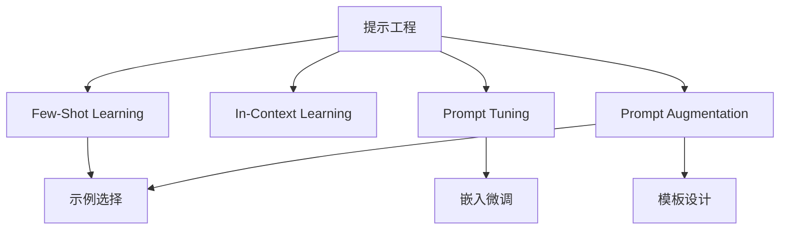

以下是关于"大语言模型应用指南：什么是提示工程"的技术博客文章正文内容：

# 大语言模型应用指南：什么是提示工程

## 1. 背景介绍

### 1.1 问题的由来

近年来,大型语言模型(Large Language Models, LLMs)凭借其强大的自然语言理解和生成能力,在广泛的应用场景中展现出巨大的潜力和价值。然而,如何高效利用这些模型并充分发挥其能力,成为了一个亟待解决的关键问题。传统的人工智能系统通常需要大量的标注数据和复杂的模型微调,而提示工程(Prompt Engineering)应运而生,为我们提供了一种全新的范式,可以更加直接、高效地指导大型语言模型完成各种任务。

### 1.2 研究现状

提示工程作为一种新兴的范式,近年来受到了广泛关注和研究。越来越多的研究人员和从业者开始探索如何设计高质量的提示,以充分利用大型语言模型的潜能。目前,提示工程主要集中在以下几个方面:

1. 提示模板设计
2. 提示增强技术(如Few-Shot Learning)
3. 提示优化算法
4. 提示评估指标
5. 提示可解释性研究

尽管取得了一些进展,但提示工程仍然是一个充满挑战的新领域,需要更多的研究和探索。

### 1.3 研究意义

提示工程的研究对于充分发挥大型语言模型的能力,并将其应用于广泛的实际场景具有重要意义。通过提示工程,我们可以:

1. 降低模型微调的成本和门槛
2. 提高模型的可解释性和可控性
3. 扩展模型的应用范围
4. 促进人工智能系统的民主化和普及

因此,深入研究提示工程对于推动人工智能技术的发展和应用具有重要的理论和实践价值。

### 1.4 本文结构

本文将全面介绍提示工程的核心概念、算法原理、数学模型、实践案例和应用场景。具体内容安排如下:

1. 核心概念与联系
2. 核心算法原理与具体操作步骤
3. 数学模型和公式详细讲解与举例说明
4. 项目实践:代码实例和详细解释说明
5. 实际应用场景
6. 工具和资源推荐
7. 总结:未来发展趋势与挑战
8. 附录:常见问题与解答

## 2. 核心概念与联系

提示工程(Prompt Engineering)是一种指导大型语言模型完成特定任务的方法,其核心思想是通过精心设计的提示(Prompt)来引导模型产生所需的输出。提示可以是一段自然语言文本、一些示例输入输出对,或者两者的组合。

提示工程与其他一些相关概念存在密切联系,包括:

1. **Few-Shot Learning**: 通过少量示例即可让模型学习新任务的范式,是提示工程的一种重要技术。
2. **In-Context Learning**: 模型在看到提示后,根据上下文动态调整自身表现的能力。
3. **Prompt Tuning**: 在保持大模型参数不变的情况下,微调提示的嵌入向量,以适应特定任务。
4. **Prompt Augmentation**: 通过一些技术(如模板设计、示例选择等)增强提示质量。

这些概念与提示工程紧密相关,相互影响和促进。掌握它们有助于我们全面理解提示工程的本质和方法。

## 3. 核心算法原理与具体操作步骤

### 3.1 算法原理概述

提示工程的核心算法原理可以概括为以下三个步骤:

1. **构建提示(Prompt Construction)**: 根据任务需求,设计合适的提示模板和示例,以引导模型产生所需输出。
2. **模型评估(Model Evaluation)**: 将构建好的提示输入到大型语言模型中,模型根据提示生成对应的输出。
3. **输出后处理(Output Post-Processing)**: 对模型生成的原始输出进行必要的后处理(如过滤、重构等),得到最终结果。

这三个步骤环环相扣,构成了提示工程的完整流程。其中,提示构建是最关键的一环,决定了模型输出的质量。

### 3.2 算法步骤详解

下面我们对提示工程的具体算法步骤进行详细解释:

#### 3.2.1 构建提示

构建高质量的提示是提示工程的核心,包括以下几个关键步骤:

1. **任务分析**: 明确任务目标,分析输入和期望输出的形式。
2. **选择提示模板**: 根据任务特点,选择合适的提示模板形式,如自然语言描述、输入输出示例对、或两者结合。
3. **设计提示内容**: 编写提示模板的具体内容,包括任务说明、示例输入输出等。
4. **优化提示质量(可选)**: 通过一些技术(如Few-Shot Learning、Prompt Augmentation等)进一步优化提示质量。

#### 3.2.2 模型评估

将构建好的提示输入到大型语言模型中,模型会根据提示生成相应的输出。这个过程可以表示为:

$$\text{Output} = \text{Model}(\text{Prompt})$$

其中,Output是模型生成的原始输出,Model是大型语言模型,Prompt是我们构建的提示。

不同的语言模型可能对提示的形式和长度有不同的要求,因此在具体实现时需要根据使用的模型进行调整。

#### 3.2.3 输出后处理

模型生成的原始输出可能需要进行一些后处理,以满足实际需求。常见的后处理操作包括:

1. **过滤**: 去除输出中的无关或不当内容。
2. **重构**: 对输出进行重新格式化或重构,以满足特定的格式要求。
3. **评分**: 为输出结果打分,筛选出质量较高的结果。
4. **组合**: 将多个输出结果进行合并或组合,产生最终结果。

后处理环节的具体操作取决于任务需求和输出形式,需要根据实际情况进行设计和实现。

### 3.3 算法优缺点

提示工程作为一种新兴的范式,具有以下优缺点:

**优点**:

1. **高效**: 无需从头训练或微调大型模型,降低了计算成本和资源需求。
2. **灵活**: 可以快速应对新任务,而无需重新训练模型。
3. **可解释性强**: 提示的形式更加直观,有助于理解模型的行为。
4. **可控性好**: 通过调整提示,可以更好地控制模型的输出。

**缺点**:

1. **质量依赖提示设计**: 提示质量直接影响模型输出,设计良好的提示是一个挑战。
2. **存在能力上限**: 模型的基础能力受到预训练阶段的限制,无法无限扩展。
3. **缺乏理论指导**: 提示工程缺乏系统的理论基础,很多方法是基于经验的探索。
4. **评估标准缺失**: 目前还缺乏评估提示质量和模型表现的统一标准。

总的来说,提示工程为我们提供了一种高效利用大型语言模型的新方式,但也面临着一些需要进一步研究和解决的挑战。

### 3.4 算法应用领域

提示工程可以应用于各种需要利用大型语言模型的任务和场景,包括但不限于:

1. **自然语言处理**: 文本分类、情感分析、机器翻译、问答系统等。
2. **内容创作**: 文案写作、创意生成、故事续写等。
3. **知识提取**: 从大量文本中提取关键信息和知识。
4. **任务辅助**: 辅助完成编程、数学推理、决策分析等任务。
5. **对话系统**: 设计对话机器人、智能助手等交互系统。

随着提示工程的不断发展,其应用范围还将进一步扩大,为各个领域带来全新的机遇和可能。

## 4. 数学模型和公式详细讲解与举例说明

### 4.1 数学模型构建

为了更好地理解和优化提示工程过程,我们需要构建相应的数学模型。一个常见的模型是将提示工程视为一个**序列到序列(Sequence-to-Sequence, Seq2Seq)学习**问题。

假设我们有一个提示 $X = (x_1, x_2, \ldots, x_n)$,期望模型生成一个目标序列 $Y = (y_1, y_2, \ldots, y_m)$。我们的目标是最大化条件概率 $P(Y|X)$,即给定提示 $X$ 时,生成目标序列 $Y$ 的概率。根据链式法则,我们可以将 $P(Y|X)$ 分解为:

$$P(Y|X) = \prod_{t=1}^m P(y_t | y_{<t}, X)$$

其中 $y_{<t}$ 表示序列 $Y$ 中位于时间步 $t$ 之前的所有元素。

为了计算上述条件概率,我们可以使用神经网络模型,如Transformer等。该模型将首先将提示 $X$ 和部分生成的序列 $y_{<t}$ 编码为隐藏状态向量,然后基于这些隐藏状态预测下一个词元 $y_t$ 的概率分布:

$$P(y_t | y_{<t}, X) = \text{ModelNetwork}(X, y_{<t})$$

在训练阶段,模型会最大化训练数据的似然函数,而在inference阶段,则通过贪婪搜索或beam search等方法来生成最可能的序列作为输出。

这个Seq2Seq模型为我们提供了一个理论基础,可以用于分析和优化提示工程过程。例如,我们可以研究如何设计更好的提示 $X$,使其能够引导模型生成更准确的目标序列 $Y$。

### 4.2 公式推导过程

在上一节中,我们给出了提示工程的基本数学模型,即将其视为一个Seq2Seq问题。现在,我们将推导出该模型的训练目标函数,并说明如何对其进行优化。

假设我们有一个包含 $N$ 个训练样本的数据集 $\mathcal{D} = \{(X^{(i)}, Y^{(i)})\}_{i=1}^N$,其中每个样本由一个提示 $X^{(i)}$ 和对应的目标序列 $Y^{(i)}$ 组成。我们的目标是最大化该数据集上的似然函数:

$$\mathcal{L}(\theta) = \sum_{i=1}^N \log P(Y^{(i)} | X^{(i)}; \theta)$$

其中 $\theta$ 表示模型的可训练参数。根据之前推导的序列条件概率公式,我们可以将似然函数展开为:

$$\begin{aligned}
\mathcal{L}(\theta) &= \sum_{i=1}^N \log \prod_{t=1}^{m_i} P(y_t^{(i)} | y_{<t}^{(i)}, X^{(i)}; \theta) \
&= \sum_{i=1}^N \sum_{t=1}^{m_i} \log P(y_t^{(i)} | y_{<t}^{(i)}, X^{(i)}; \theta)
\end{aligned}$$

其中 $m_i$ 表示第 $i$ 个训练样本的目标序列长度。

在实际训练中,我们通常采用一种称为**Teacher Forcing**的策略,即在每一个时间步,我们将上一步的真实目标词元 $y_{t-1}$ 作为输入,而不是使用模型生成的词元。这种策略可以加速训练收敛,避免误差累积的问题。

因此,我们的最终训练目标函数为:

$$\mathcal{J}(\theta) = -\mathcal{L}(\theta) = -\sum_{i=1}^N \sum_{t=1}^{m_i} \log P(y_t^{(i)} | y_{<t}^{(i)}, X^{(i)}; \theta)$$

我们可以使用一些优化算法(如Adam、SGD等)来