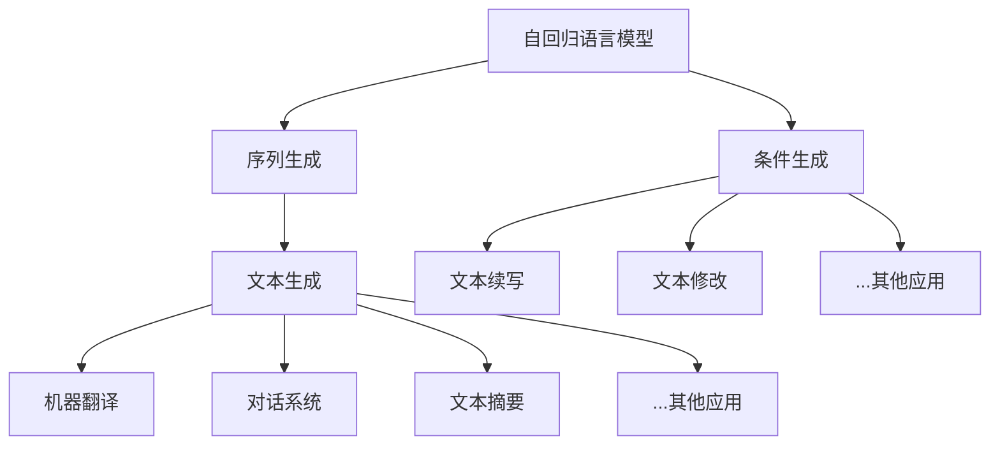

以下是技术博客文章《大语言模型应用指南：自回归模型与文本生成》的正文内容：

# 大语言模型应用指南：自回归模型与文本生成

## 1. 背景介绍

### 1.1 问题的由来

随着人工智能技术的不断发展,自然语言处理(NLP)领域取得了长足的进步。作为NLP的核心任务之一,文本生成已经广泛应用于机器翻译、对话系统、文本摘要等多个场景。传统的文本生成方法主要基于统计模型或规则系统,存在生成质量有限、缺乏多样性和上下文一致性等问题。

### 1.2 研究现状

近年来,随着深度学习技术的兴起,基于神经网络的序列生成模型得到了迅猛发展,尤其是自回归(Autoregressive)语言模型在文本生成任务中展现出了卓越的性能。自回归模型通过最大化下一个词的条件概率来生成文本序列,能够学习到丰富的语义和语法信息,生成质量更高、多样性更强。

代表性的自回归模型包括:

- RNN(Recurrent Neural Network)及其变种LSTM(Long Short-Term Memory)和GRU(Gated Recurrent Unit)
- Transformer及其改进版本如GPT(Generative Pre-trained Transformer)、BERT(Bidirectional Encoder Representations from Transformers)等
- 基于自回归模型的大型语言模型,如GPT-3、PanGu-α、Wu Dao 2.0等

这些模型在多个文本生成任务上取得了令人瞩目的成绩,推动了自然语言生成(NLG)技术的发展。

### 1.3 研究意义

自回归语言模型在文本生成中的优异表现,为构建高质量的NLG系统奠定了基础。通过对自回归模型的深入研究和应用指南的总结,可以帮助开发者和研究人员:

1. 全面理解自回归模型的原理和优势
2. 掌握模型训练、微调和部署的最佳实践
3. 探索自回归模型在不同场景下的应用
4. 把握模型发展趋势,规避潜在风险
5. 推动NLG技术在实际应用中的落地

### 1.4 本文结构

本文将从以下几个方面对自回归模型在文本生成中的应用进行深入探讨:

1. 核心概念与联系
2. 核心算法原理与具体操作步骤
3. 数学模型和公式详细讲解与案例分析
4. 项目实践:代码实例和详细解释说明
5. 实际应用场景
6. 工具和资源推荐
7. 总结:未来发展趋势与挑战
8. 附录:常见问题与解答

## 2. 核心概念与联系

自回归语言模型(Autoregressive Language Model)是一种基于神经网络的序列生成模型,通过最大化下一个词的条件概率来生成文本序列。它的核心思想是将文本生成任务建模为一个序列预测问题,每个时间步预测下一个词的概率分布,并根据这个分布进行采样。

自回归模型可以应用于多种自然语言生成(NLG)任务,包括:

1. **序列生成**:生成文本序列,如机器翻译、对话系统、文本摘要等。
2. **条件生成**:根据给定的上下文或条件生成文本,如文本续写、文本修改等。

自回归模型的优势在于能够学习到丰富的语义和语法信息,生成质量更高、多样性更强,是目前文本生成领域的主流方法。

## 3. 核心算法原理与具体操作步骤

### 3.1 算法原理概述

自回归语言模型的核心思想是将文本生成任务建模为一个序列预测问题。给定一个长度为 $T$ 的文本序列 $X = (x_1, x_2, ..., x_T)$,模型的目标是最大化该序列的条件概率:

$$P(X) = \prod_{t=1}^{T}P(x_t|x_1, x_2, ..., x_{t-1})$$

其中,每个时间步 $t$ 的条件概率 $P(x_t|x_1, x_2, ..., x_{t-1})$ 由神经网络模型计算得到。通过最大化该联合概率,模型可以学习到文本序列中的模式和规律。

在生成阶段,模型从起始符号 $x_0$ 开始,每个时间步 $t$ 根据已生成的部分序列 $(x_0, x_1, ..., x_{t-1})$ 预测下一个词 $x_t$ 的概率分布 $P(x_t|x_0, x_1, ..., x_{t-1})$,然后从该分布中采样得到 $x_t$,重复该过程直到生成完整序列。

### 3.2 算法步骤详解

自回归语言模型的训练和生成过程可以概括为以下步骤:

1. **数据预处理**:对训练语料进行分词、词典构建、编码等预处理操作。
2. **模型构建**:选择合适的神经网络模型结构,如RNN、LSTM、Transformer等,并初始化模型参数。
3. **模型训练**:
    - 对于每个训练样本序列 $X = (x_1, x_2, ..., x_T)$,将其划分为输入 $(x_1, x_2, ..., x_{T-1})$ 和目标 $(x_2, x_3, ..., x_T)$
    - 将输入序列输入模型,计算在每个时间步 $t$ 的条件概率分布 $P(x_t|x_1, x_2, ..., x_{t-1})$
    - 计算模型预测的目标序列概率与真实目标序列的交叉熵损失
    - 使用优化算法(如Adam)根据损失函数更新模型参数
    - 重复以上过程,直至模型收敛
4. **文本生成**:
    - 给定起始符号 $x_0$,将其输入模型
    - 在每个时间步 $t$,根据已生成的序列 $(x_0, x_1, ..., x_{t-1})$ 计算下一个词 $x_t$ 的概率分布 $P(x_t|x_0, x_1, ..., x_{t-1})$
    - 从该分布中采样得到 $x_t$,将其添加到已生成序列中
    - 重复上述过程,直至生成完整序列或达到最大长度

在实际应用中,还可以引入各种策略来提高生成质量,如Top-K采样、Nucleus采样、无师生成(Unsupervised pretraining)等。

### 3.3 算法优缺点

**优点**:

- 生成质量高:能够学习到丰富的语义和语法信息,生成的文本更加通顺、流畅。
- 多样性强:通过采样可以生成多样化的文本序列,避免重复性。
- 可解释性好:模型的生成过程具有很好的可解释性,便于分析和调试。

**缺点**:

- 生成效率较低:需要逐词生成,计算量大,生成速度慢。
- 暴露偏置风险:训练数据中存在的偏差可能会被放大,导致生成结果存在潜在风险。
- 上下文长度限制:由于计算复杂度的原因,模型只能考虑有限长度的上下文信息。

### 3.4 算法应用领域

自回归语言模型在以下领域有广泛的应用:

- **机器翻译**:将源语言文本翻译成目标语言。
- **对话系统**:根据对话历史生成自然的回复。
- **文本摘要**:自动生成文本的摘要。
- **文本续写**:根据已有文本继续生成后续内容。
- **文本修改**:根据上下文对文本进行修改、改写。
- **创作辅助**:辅助创作诗歌、小说、新闻等文学作品。
- **问答系统**:根据问题生成自然语言回答。
- **代码生成**:根据需求自动生成程序代码。

## 4. 数学模型和公式详细讲解与举例说明

### 4.1 数学模型构建

自回归语言模型的数学模型可以用条件概率链式法则来表示:

$$P(X) = \prod_{t=1}^{T}P(x_t|x_1, x_2, ..., x_{t-1})$$

其中,X 是长度为 T 的目标序列,x_t 是序列中的第 t 个词。该模型旨在最大化生成整个序列的联合概率。

为了计算每个时间步的条件概率 $P(x_t|x_1, x_2, ..., x_{t-1})$,我们使用神经网络模型,将已生成的部分序列作为输入,输出一个概率分布,表示下一个词的预测概率。常用的神经网络结构包括:

- **RNN(Recurrent Neural Network)**:

$$h_t = f(x_t, h_{t-1})$$
$$P(x_t|x_1, x_2, ..., x_{t-1}) = \text{softmax}(W_oh_t + b_o)$$

其中,h_t 是 RNN 在时间步 t 的隐状态,f 是递归函数(如 tanh 或 LSTM/GRU 单元),W_o 和 b_o 是输出层的权重和偏置。

- **Transformer**:

$$\begin{aligned}
Q &= X_qW^Q \\
K &= X_kW^K \\
V &= X_vW^V \\
\text{Attention}(Q, K, V) &= \text{softmax}(\frac{QK^T}{\sqrt{d_k}})V \\
P(x_t|x_1, x_2, ..., x_{t-1}) &= \text{softmax}(\text{FFN}(\text{Attention}(Q, K, V)))
\end{aligned}$$

其中,Q、K、V 分别表示查询(Query)、键(Key)和值(Value),通过注意力机制计算上下文表示,然后使用前馈神经网络(FFN)输出下一个词的概率分布。

通过最大化目标序列的联合概率,模型可以学习到文本序列中的模式和规律,从而生成高质量的文本。

### 4.2 公式推导过程

以 Transformer 模型为例,我们可以推导出注意力机制的计算过程:

1. 首先,我们将输入序列 X 分别与查询、键和值的权重矩阵 $W^Q$、$W^K$ 和 $W^V$ 相乘,得到查询 Q、键 K 和值 V:

$$\begin{aligned}
Q &= X_qW^Q \\
K &= X_kW^K \\
V &= X_vW^V
\end{aligned}$$

2. 然后,我们计算查询 Q 和所有键 K 的点积,并除以缩放因子 $\sqrt{d_k}$ (d_k 是键的维度),得到注意力分数:

$$\text{Attention Scores} = \frac{QK^T}{\sqrt{d_k}}$$

3. 对注意力分数应用 softmax 函数,得到注意力权重:

$$\text{Attention Weights} = \text{softmax}(\frac{QK^T}{\sqrt{d_k}})$$

4. 将注意力权重与值 V 相乘,得到加权和,即注意力输出:

$$\text{Attention Output} = \text{Attention Weights} \cdot V$$

5. 最后,将注意力输出输入前馈神经网络(FFN),得到下一个词的概率分布:

$$P(x_t|x_1, x_2, ..., x_{t-1}) = \text{softmax}(\text{FFN}(\text{Attention Output}))$$

通过上述推导,我们可以看到注意力机制是如何捕获输入序列中的关键信息,并将其融合到下一个词的预测中。这种机制使 Transformer 模型能够有效地建模长距离依赖关系,从而提高了文本生成的质量。

### 4.3 案例分析与讲解

让我们通过一个具体的案例来更好地理解自回归语言模型的工作原理。假设我们要生成一个简单的英文句子:"The cat sat on the mat."

1. 首先,我们将句子转换为词序列:["The", "cat", "sat", "on", "the", "mat", "."]
2. 在训