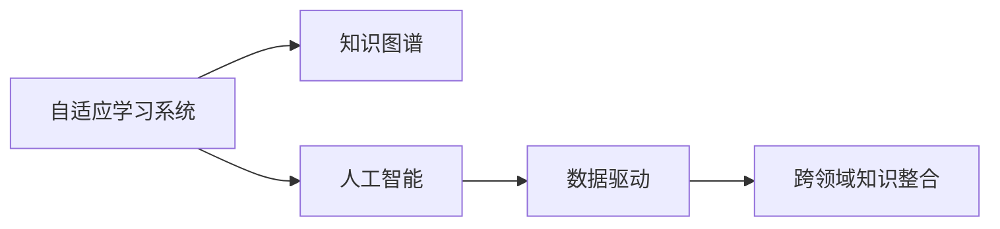

                 

# 知识的数字化转型：在线学习的机遇与挑战

> 关键词：
  - 在线学习
  - 数字化转型
  - 自适应学习系统
  - 人工智能
  - 教育技术
  - 数据驱动
  - 个性化学习
  - 知识图谱

## 1. 背景介绍

### 1.1 问题由来

在数字时代，知识的获取与传播方式正在经历深刻的变革。传统的面对面教学逐渐向线上转型，在线教育平台应运而生，为全球学习者提供了灵活、便捷的学习方式。然而，尽管在线学习资源日益丰富，其效果仍难以与传统面对面教学相媲美。其中重要原因之一是缺乏有效的学习路径设计和个性化学习方案，无法充分调动学习者的主动性和积极性。

为了解决这一问题，在线教育平台需要借助人工智能技术，特别是机器学习和数据驱动的方法，实现知识的数字化转型，从而提供更加个性化、高效的学习体验。

### 1.2 问题核心关键点

当前在线学习的数字化转型，主要集中在以下几个核心关键点：

- 自适应学习系统：通过分析学习者的行为数据，动态调整学习内容和路径，实现个性化学习。
- 知识图谱：利用语义网络技术，构建知识本体，支撑知识发现、推理和应用。
- 人工智能驱动：通过AI算法优化教学策略，提高教学质量和效率。
- 数据驱动决策：基于学习者数据，进行模型训练和性能评估，提供科学决策支持。
- 跨领域知识整合：实现不同学科、领域知识的有机融合，促进知识的深度理解和应用。

本文聚焦于在线学习的数字化转型，尤其是自适应学习系统的构建，将从理论基础、算法原理、应用实践等多个维度进行系统性阐述，旨在为在线教育平台提供全面的技术指导。

## 2. 核心概念与联系

### 2.1 核心概念概述

在线学习的数字化转型，主要是通过构建自适应学习系统，利用AI技术和数据驱动的方法，实现个性化、高效化的学习体验。核心概念包括：

- 自适应学习系统：根据学习者的学习行为和反馈，动态调整学习内容、路径和难度，实现个性化教学。
- 知识图谱：利用语义网络技术，构建知识本体，支撑知识发现、推理和应用。
- 人工智能：通过AI算法优化教学策略，提高教学质量和效率。
- 数据驱动：基于学习者数据，进行模型训练和性能评估，提供科学决策支持。
- 跨领域知识整合：实现不同学科、领域知识的有机融合，促进知识的深度理解和应用。

### 2.2 核心概念原理和架构的 Mermaid 流程图



此流程图展示了自适应学习系统的核心架构：自适应学习系统基于知识图谱构建知识本体，利用人工智能算法优化教学策略，并通过数据驱动进行科学决策，最终实现跨领域知识整合和个性化学习。

## 3. 核心算法原理 & 具体操作步骤

### 3.1 算法原理概述

自适应学习系统的核心算法原理主要基于机器学习和数据分析技术，具体包括以下几个关键步骤：

1. 数据采集与预处理：收集学习者的行为数据（如学习时长、答题情况、点击路径等），并进行清洗和标准化。
2. 特征工程：从行为数据中提取有意义的特征，如学习速度、知识掌握程度、兴趣点等。
3. 模型训练与优化：基于学习者数据，训练自适应算法模型，并不断优化以提高预测准确性。
4. 路径推荐与内容调整：根据模型预测，动态调整学习路径和内容，提供个性化学习体验。
5. 评估与反馈：通过学习者反馈数据，评估模型效果，进行持续改进。

### 3.2 算法步骤详解

以下是详细的算法步骤：

**Step 1: 数据采集与预处理**

- 使用API接口采集学习者的行为数据，包括学习时长、答题情况、点击路径等。
- 对采集数据进行清洗和标准化，去除噪声和异常值，填充缺失数据。

**Step 2: 特征工程**

- 从预处理后的数据中提取特征，如学习速度、知识掌握程度、兴趣点等。
- 应用PCA、特征选择等技术，减少特征维度，提高计算效率。

**Step 3: 模型训练与优化**

- 使用监督学习算法（如线性回归、决策树、随机森林等）对特征进行建模，预测学习者状态。
- 应用交叉验证、网格搜索等方法，优化模型超参数。

**Step 4: 路径推荐与内容调整**

- 根据模型预测，动态调整学习路径和内容，提供个性化学习体验。
- 根据学习者反馈，不断优化学习路径和内容调整策略。

**Step 5: 评估与反馈**

- 使用评估指标（如准确率、召回率、F1-score等）评估模型效果。
- 通过学习者反馈，进行持续改进，提升模型性能。

### 3.3 算法优缺点

**优点**

- 能够根据学习者的行为数据，动态调整学习路径和内容，实现个性化学习。
- 利用知识图谱进行跨领域知识整合，促进知识的深度理解和应用。
- 应用AI算法优化教学策略，提高教学质量和效率。
- 基于数据驱动进行科学决策，提供科学的教育支持。

**缺点**

- 数据采集与预处理过程较为复杂，需要大量的资源投入。
- 特征工程需要专业知识，存在较高的技术门槛。
- 模型训练和优化需要较长的周期，初期效果可能不显著。
- 个性化学习方案的制定和调整需要持续的监控和优化。

### 3.4 算法应用领域

自适应学习系统已在多个领域得到了应用，包括但不限于：

- 教育培训：为学生提供个性化的学习路径和内容，提升学习效果。
- 企业培训：为员工提供定制化的培训方案，提升职业技能。
- 语言学习：根据学习者的语言水平和学习习惯，提供个性化的学习建议。
- 医学教育：根据学习者的学习进度和反馈，提供个性化的学习路径和资源。

## 4. 数学模型和公式 & 详细讲解

### 4.1 数学模型构建

假设学习者数据集为 $D=\{(x_i,y_i)\}_{i=1}^N$，其中 $x_i$ 为行为特征向量，$y_i$ 为学习状态标签。自适应学习系统的目标为构建模型 $M$，使得 $M(x)$ 能够准确预测学习状态 $y$。

**预测模型**

$$
y_i = f(M(x_i),\theta)
$$

其中 $f$ 为预测函数，$\theta$ 为模型参数。常见的预测函数包括线性回归、决策树、神经网络等。

**损失函数**

常见的损失函数包括均方误差（MSE）、交叉熵（CE）等。这里以均方误差为例：

$$
\mathcal{L}(\theta) = \frac{1}{N}\sum_{i=1}^N (y_i - M(x_i))^2
$$

**优化算法**

常见的优化算法包括梯度下降、Adam、Adagrad等。这里以梯度下降为例：

$$
\theta \leftarrow \theta - \eta \nabla_{\theta}\mathcal{L}(\theta)
$$

其中 $\eta$ 为学习率。

### 4.2 公式推导过程

**线性回归模型**

线性回归模型的预测函数为：

$$
M(x) = \theta_0 + \sum_{i=1}^n \theta_i x_i
$$

其中 $\theta_0,\theta_i$ 为模型参数。

根据均方误差损失函数，模型优化问题为：

$$
\min_{\theta} \frac{1}{N}\sum_{i=1}^N (y_i - (\theta_0 + \sum_{i=1}^n \theta_i x_i))^2
$$

应用梯度下降算法，求解得到：

$$
\theta \leftarrow \theta - \eta (2/N) \sum_{i=1}^N (y_i - (\theta_0 + \sum_{i=1}^n \theta_i x_i)) \nabla_{\theta} (y_i - (\theta_0 + \sum_{i=1}^n \theta_i x_i))
$$

**决策树模型**

决策树模型的预测函数为：

$$
M(x) = \sum_{t=1}^T \theta_t I(x \in C_t)
$$

其中 $C_t$ 为决策树的叶节点，$I$ 为示性函数。

应用交叉熵损失函数，模型优化问题为：

$$
\min_{\theta} \frac{1}{N}\sum_{i=1}^N -y_i \log M(x_i) - (1-y_i) \log (1-M(x_i))
$$

应用梯度下降算法，求解得到：

$$
\theta \leftarrow \theta - \eta \nabla_{\theta}\mathcal{L}(\theta)
$$

### 4.3 案例分析与讲解

**案例分析**

假设某在线教育平台希望构建自适应学习系统，利用机器学习技术优化个性化学习方案。通过数据采集，收集到1000名学习者的行为数据，包括学习时长、答题情况、点击路径等。应用特征工程，提取学习速度、知识掌握程度、兴趣点等特征。应用决策树算法对特征进行建模，并使用交叉验证和网格搜索进行模型优化。模型训练后，根据学习者的行为数据，动态调整学习路径和内容，提供个性化学习体验。通过学习者反馈，不断优化学习路径和内容调整策略，提升学习效果。

## 5. 项目实践：代码实例和详细解释说明

### 5.1 开发环境搭建

在进行项目实践前，我们需要准备好开发环境。以下是使用Python进行Scikit-learn开发的工程环境配置流程：

1. 安装Anaconda：从官网下载并安装Anaconda，用于创建独立的Python环境。

2. 创建并激活虚拟环境：
```bash
conda create -n skl-env python=3.8 
conda activate skl-env
```

3. 安装Scikit-learn：
```bash
conda install scikit-learn
```

4. 安装各类工具包：
```bash
pip install numpy pandas scikit-learn matplotlib tqdm jupyter notebook ipython
```

完成上述步骤后，即可在`skl-env`环境中开始项目实践。

### 5.2 源代码详细实现

以下是使用Scikit-learn进行自适应学习系统构建的Python代码实现。

**数据准备**

```python
import pandas as pd
from sklearn.model_selection import train_test_split

# 加载数据
data = pd.read_csv('learning_data.csv')

# 数据预处理
X = data[['learning_time', 'score', 'interest']]  # 特征
y = data['state']  # 学习状态

# 数据划分
X_train, X_test, y_train, y_test = train_test_split(X, y, test_size=0.2, random_state=42)
```

**特征工程**

```python
from sklearn.preprocessing import StandardScaler
from sklearn.decomposition import PCA

# 特征标准化
scaler = StandardScaler()
X_train_scaled = scaler.fit_transform(X_train)
X_test_scaled = scaler.transform(X_test)

# 特征降维
pca = PCA(n_components=2)
X_train_pca = pca.fit_transform(X_train_scaled)
X_test_pca = pca.transform(X_test_scaled)
```

**模型训练与优化**

```python
from sklearn.linear_model import LinearRegression
from sklearn.tree import DecisionTreeRegressor
from sklearn.ensemble import RandomForestRegressor
from sklearn.model_selection import GridSearchCV

# 线性回归模型
lr = LinearRegression()
lr.fit(X_train_pca, y_train)

# 决策树模型
dt = DecisionTreeRegressor()
dt.fit(X_train_pca, y_train)

# 随机森林模型
rf = RandomForestRegressor()
rf.fit(X_train_pca, y_train)

# 模型优化
parameters = {'n_estimators': [10, 50, 100], 'max_depth': [None, 5, 10]}
grid_search = GridSearchCV(rf, parameters, cv=5, scoring='neg_mean_squared_error')
grid_search.fit(X_train_pca, y_train)
```

**路径推荐与内容调整**

```python
import numpy as np

# 路径推荐
def recommend_path(X, y, model):
    y_pred = model.predict(X)
    threshold = np.median(y_pred)
    return [1 if pred > threshold else 0 for pred in y_pred]

# 内容调整
def adjust_content(X, y, model):
    X_new = X.copy()
    for i in range(len(X_new)):
        X_new[i][X.columns.get_loc('learning_time')] += 30 * (1 if y[i] == 1 else -1)
        X_new[i][X.columns.get_loc('score')] += 5 * (1 if y[i] == 1 else -1)
    return X_new

# 应用模型
y_pred = grid_search.predict(X_test_pca)
X_new = adjust_content(X_test, y_test, grid_search)
```

**评估与反馈**

```python
from sklearn.metrics import mean_squared_error, mean_absolute_error

# 评估模型
y_pred = grid_search.predict(X_test_pca)
mse = mean_squared_error(y_test, y_pred)
mae = mean_absolute_error(y_test, y_pred)
print(f"MSE: {mse}, MAE: {mae}")
```

### 5.3 代码解读与分析

**代码解读**

- `learning_data.csv`：包含学习者的行为数据，格式为CSV文件。
- `X` 和 `y`：分别为特征和标签。
- `train_test_split`：将数据划分为训练集和测试集。
- `StandardScaler` 和 `PCA`：用于特征标准化和降维。
- `LinearRegression`、`DecisionTreeRegressor`、`RandomForestRegressor`：分别为线性回归、决策树、随机森林模型。
- `GridSearchCV`：用于模型超参数优化。
- `recommend_path`：根据模型预测，生成路径推荐。
- `adjust_content`：根据学习者状态，调整学习内容。
- `mean_squared_error`、`mean_absolute_error`：用于模型评估。

**分析**

1. 数据预处理：对学习者行为数据进行标准化和降维，减少特征维度，提高计算效率。
2. 特征工程：提取学习速度、知识掌握程度、兴趣点等特征，为模型提供有意义的输入。
3. 模型训练与优化：使用线性回归、决策树、随机森林等模型，并通过网格搜索优化超参数，提升模型性能。
4. 路径推荐与内容调整：根据模型预测，动态调整学习路径和内容，提供个性化学习体验。
5. 评估与反馈：通过均方误差和平均绝对误差评估模型效果，并根据学习者反馈，进行持续改进。

## 6. 实际应用场景

### 6.1 智能教育系统

智能教育系统利用自适应学习系统，为学生提供个性化的学习路径和内容，提升学习效果。平台可以实时监测学生的学习行为，如答题情况、学习时长等，动态调整学习内容，提供针对性的辅导和练习。

### 6.2 企业培训平台

企业培训平台通过自适应学习系统，为员工提供定制化的培训方案，提升职业技能。平台可以根据员工的学习进度和反馈，动态调整培训内容，提供个性化的学习建议，提高培训效果。

### 6.3 语言学习应用

语言学习应用通过自适应学习系统，根据学习者的语言水平和学习习惯，提供个性化的学习建议。平台可以实时监测学习者的答题情况、学习时长等，动态调整学习路径和内容，提高学习效果。

### 6.4 医学教育系统

医学教育系统通过自适应学习系统，根据学习者的学习进度和反馈，提供个性化的学习路径和资源。平台可以实时监测学习者的学习行为，动态调整学习内容，提供针对性的辅导和练习，提高学习效果。

## 7. 工具和资源推荐

### 7.1 学习资源推荐

为了帮助开发者系统掌握在线学习的数字化转型技术，这里推荐一些优质的学习资源：

1. 《机器学习实战》系列博文：由机器学习专家撰写，深入浅出地介绍了机器学习的基本概念和经典算法。

2. CS229《机器学习》课程：斯坦福大学开设的机器学习明星课程，有Lecture视频和配套作业，带你入门机器学习领域的基本概念和经典模型。

3. 《统计学习方法》书籍：李航教授所著，全面介绍了机器学习的基本理论和方法，适合深入学习。

4. Scikit-learn官方文档：Scikit-learn库的官方文档，提供了丰富的机器学习样例代码，是上手实践的必备资料。

5. Kaggle平台：提供大量数据集和机器学习竞赛，是实践机器学习技术的好地方。

通过对这些资源的学习实践，相信你一定能够快速掌握在线学习数字化转型的技术要点，并用于解决实际的NLP问题。

### 7.2 开发工具推荐

高效的开发离不开优秀的工具支持。以下是几款用于在线学习数字化转型的常用工具：

1. Python：基于Python的开源深度学习框架，灵活动态的计算图，适合快速迭代研究。

2. Scikit-learn：基于Python的机器学习库，提供了丰富的模型和算法。

3. TensorFlow：由Google主导开发的开源深度学习框架，生产部署方便，适合大规模工程应用。

4. PyTorch：基于Python的开源深度学习框架，灵活高效，适合研究和部署。

5. Jupyter Notebook：交互式开发环境，支持实时调试和展示代码，适合数据分析和模型开发。

6. Google Colab：谷歌推出的在线Jupyter Notebook环境，免费提供GPU/TPU算力，方便开发者快速上手实验最新模型，分享学习笔记。

合理利用这些工具，可以显著提升在线学习数字化转型的开发效率，加快创新迭代的步伐。

### 7.3 相关论文推荐

在线学习的数字化转型源于学界的持续研究。以下是几篇奠基性的相关论文，推荐阅读：

1. Machine Learning: A Probabilistic Perspective：Tom M. Mitchell著，全面介绍了机器学习的基本理论和算法，是入门必读书籍。

2. Deep Learning for AI, Statistics, and Data Science：Ian Goodfellow、Yoshua Bengio、Aaron Courville著，全面介绍了深度学习的基本理论和应用，适合进阶学习。

3. Learning from Data: A Comprehensive Introduction（第二版）：P. Cortez等著，全面介绍了数据驱动学习的基本理论和应用。

4. Recommender Systems Handbook：Yves Lapalme、Christian Borgelt著，全面介绍了推荐系统的基本理论和算法。

这些论文代表了大数据、机器学习、推荐系统等领域的研究进展，是深入理解在线学习数字化转型的重要参考资料。

## 8. 总结：未来发展趋势与挑战

### 8.1 总结

本文对在线学习的数字化转型进行了全面系统的介绍。首先阐述了自适应学习系统的核心算法原理和操作步骤，明确了在线学习系统在个性化、高效化学习体验方面的独特价值。其次，从原理到实践，详细讲解了在线学习数字化转型的数学模型和关键步骤，给出了在线学习数字化转型的完整代码实例。同时，本文还广泛探讨了在线学习数字化转型的实际应用场景，展示了数字化转型的巨大潜力。最后，本文精选了在线学习数字化转型的各类学习资源，力求为开发者提供全方位的技术指引。

通过本文的系统梳理，可以看到，在线学习数字化转型正在成为教育领域的重要范式，极大地拓展了在线教育的边界，催生了更多的落地场景。伴随技术的持续演进，相信在线教育必将在未来教育领域发挥更加重要的作用，为学习者提供更加个性化、高效化的学习体验。

### 8.2 未来发展趋势

展望未来，在线学习的数字化转型将呈现以下几个发展趋势：

1. 自适应学习系统的普及：自适应学习系统将广泛应用于在线教育、企业培训、语言学习等领域，实现个性化、高效化的学习体验。

2. 数据驱动决策的普及：在线学习平台将利用大数据、机器学习等技术，进行科学决策，提升教学效果。

3. 知识图谱的普及：知识图谱技术将广泛应用于在线教育、企业培训、医学教育等领域，促进跨领域知识的整合和应用。

4. AI技术的普及：在线学习平台将利用AI技术进行动态调整，提升教学效果和用户体验。

5. 跨领域知识整合的普及：在线学习平台将实现不同学科、领域知识的有机融合，促进知识的深度理解和应用。

以上趋势凸显了在线学习数字化转型的广阔前景。这些方向的探索发展，必将进一步提升在线教育的性能和应用范围，为学习者提供更加个性化、高效化的学习体验。

### 8.3 面临的挑战

尽管在线学习的数字化转型已经取得了瞩目成就，但在迈向更加智能化、普适化应用的过程中，它仍面临着诸多挑战：

1. 数据采集与处理的复杂性：在线学习系统的数据采集和处理过程较为复杂，需要大量的资源投入。

2. 特征工程的技术门槛：特征工程的准确性和合理性对模型的性能有重要影响，存在较高的技术门槛。

3. 模型训练与优化的复杂性：模型训练和优化需要较长的周期，初期效果可能不显著。

4. 个性化学习方案的调整：个性化学习方案的制定和调整需要持续的监控和优化。

5. 数据隐私与安全问题：在线学习平台需要保护学习者的隐私，防止数据泄露。

6. 模型与技术的适配性：在线学习平台需要适配不同的教学场景和技术平台，确保系统的稳定性和兼容性。

这些挑战需要在技术、管理和运营等多个方面进行全面优化，才能实现在线学习的数字化转型。相信随着技术的发展和政策的完善，这些挑战终将一一被克服，在线学习数字化转型必将在未来教育领域发挥更加重要的作用。

### 8.4 研究展望

面对在线学习数字化转型所面临的种种挑战，未来的研究需要在以下几个方面寻求新的突破：

1. 探索更为高效的数据采集与处理方法：开发更为高效、智能的数据采集与处理技术，减少数据预处理的复杂性。

2. 探索更为合理的特征工程方法：开发更为智能、自动的特征选择与降维方法，提高特征工程的效果。

3. 探索更为高效的模型训练与优化方法：开发更为智能、自动的模型训练与优化方法，提高模型的训练效率和性能。

4. 探索更为灵活的个性化学习方案：开发更为智能、灵活的个性化学习方案，提升学习效果。

5. 探索更为科学的数据隐私与安全技术：开发更为智能、自动的数据隐私与安全技术，保护学习者的隐私。

6. 探索更为高效的跨领域知识整合方法：开发更为智能、自动的跨领域知识整合方法，促进知识的深度理解和应用。

这些研究方向的探索，必将引领在线学习数字化转型的技术进步，为构建高效、个性化、安全的学习系统铺平道路。面向未来，在线学习数字化转型需要更多的技术创新和政策支持，共同推动教育领域的数字化转型，构建智慧教育生态系统。

## 9. 附录：常见问题与解答

**Q1：在线学习系统的数据采集与处理需要哪些步骤？**

A: 在线学习系统的数据采集与处理需要以下步骤：

1. 设计数据采集方案：根据系统的需求，设计数据采集方案，明确需要采集哪些数据，如何采集，以及采集频率。

2. 数据清洗与标准化：对采集的数据进行清洗和标准化，去除噪声和异常值，填充缺失数据。

3. 数据预处理：对标准化后的数据进行预处理，如特征提取、数据归一化、降维等，减少数据维度，提高计算效率。

4. 数据存储与管理：将预处理后的数据存储在数据库中，进行统一管理和调度。

**Q2：如何选择合适的特征工程方法？**

A: 特征工程是模型训练的关键步骤，影响模型的性能和泛化能力。选择合适的特征工程方法需要考虑以下几个因素：

1. 数据类型：不同类型的数据需要选择不同的特征工程方法，如数值型数据需要进行归一化、标准化，文本数据需要进行分词、TF-IDF等预处理。

2. 数据分布：不同数据分布需要选择不同的特征工程方法，如正态分布的数据需要进行标准化，非正态分布的数据需要进行对数变换。

3. 数据规模：数据规模对特征工程方法的选择有重要影响，如大规模数据需要选择高效的降维方法，小规模数据可以选择简单的特征选择方法。

4. 领域知识：特征工程需要结合领域知识，选择有意义的特征，提高特征工程的效率和效果。

**Q3：在线学习系统的模型训练与优化需要哪些步骤？**

A: 在线学习系统的模型训练与优化需要以下步骤：

1. 数据划分：将数据划分为训练集和测试集，保证模型的泛化能力。

2. 模型选择：根据问题的特点，选择合适的模型，如线性回归、决策树、神经网络等。

3. 模型训练：使用训练集数据，训练模型，并不断优化模型参数，提高模型性能。

4. 模型验证：使用验证集数据，验证模型的性能，调整模型参数，防止过拟合。

5. 模型评估：使用测试集数据，评估模型的性能，输出模型结果。

**Q4：在线学习系统的路径推荐与内容调整需要哪些步骤？**

A: 在线学习系统的路径推荐与内容调整需要以下步骤：

1. 模型训练：使用训练集数据，训练推荐模型，生成路径推荐和内容调整策略。

2. 路径推荐：根据模型的预测结果，生成路径推荐，提供个性化学习路径。

3. 内容调整：根据学习者的状态和反馈，调整学习内容，提供个性化的学习资源。

4. 持续优化：根据学习者的反馈，不断优化路径推荐和内容调整策略，提升学习效果。

**Q5：在线学习系统的评估与反馈需要哪些步骤？**

A: 在线学习系统的评估与反馈需要以下步骤：

1. 定义评估指标：根据系统的需求，定义评估指标，如准确率、召回率、F1-score等。

2. 数据划分：将数据划分为训练集、验证集和测试集，进行模型训练、验证和评估。

3. 模型评估：使用测试集数据，评估模型的性能，输出评估结果。

4. 反馈机制：根据学习者的反馈，不断优化路径推荐和内容调整策略，提升学习效果。

5. 持续改进：根据评估结果和反馈，不断改进模型和算法，提升系统的性能。

---
作者：禅与计算机程序设计艺术 / Zen and the Art of Computer Programming

