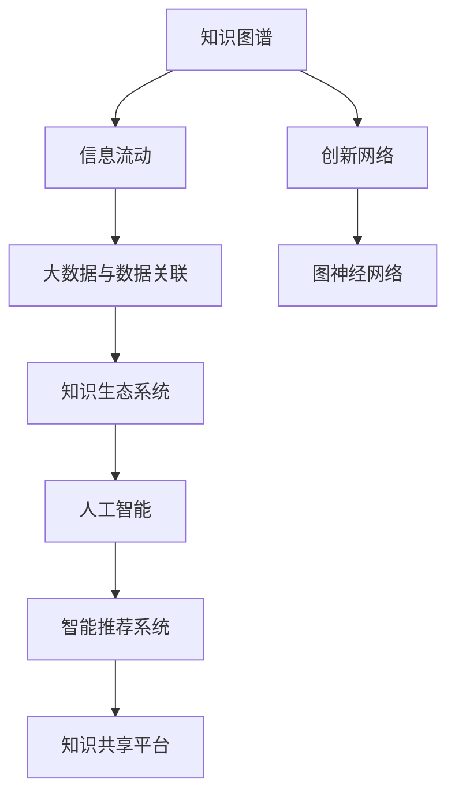

                 

# 知识的生态系统：信息流动与创新网络

> 关键词：知识生态系统,信息流动,创新网络,知识图谱,数据关联,人工智能,大数据,信息经济学,图神经网络,知识图谱技术,智能推荐系统

## 1. 背景介绍

### 1.1 问题由来

在数字化时代，信息量的爆炸性增长与知识结构的日益复杂化，使得知识的获取、存储、传播和应用变得愈发重要。知识的生态系统，即知识在个体、组织、社区和社会各层级的流动、扩散与创新网络，成为信息时代的重要基础架构。这一生态系统不仅支撑着人类的知识获取与认知进步，也深刻影响着社会经济的可持续发展与技术创新的速度与方向。

### 1.2 问题核心关键点

1. **知识生态系统的构建**：通过构建一个跨领域、跨学科的知识网络，促进知识的多向流动和交叉融合。
2. **信息流动的优化**：利用大数据与人工智能技术，优化信息的传播路径与质量，确保知识的有效共享。
3. **创新网络的构建**：利用数据关联与图神经网络技术，发掘知识之间的潜在关联，促进新知识的产生和应用。

### 1.3 问题研究意义

研究知识生态系统中的信息流动与创新网络，对于推动知识经济的发展、提升人类认知水平、促进技术创新具有重要意义：

1. **促进知识共享与合作**：通过优化信息流动，打破知识孤岛，实现跨领域、跨行业的知识共享与合作。
2. **加速创新进程**：通过挖掘知识间的关联，揭示潜在的创新点，加速技术创新和商业模式的迭代。
3. **提升决策质量**：通过构建知识生态系统，提供基于数据的洞察，支持更为科学合理的决策制定。
4. **推动教育进步**：通过知识图谱等技术，促进教育资源共享，提升教育质量和效率。
5. **支持政策制定**：提供基于大数据的分析，支持政府和社会组织制定更加科学合理的政策。

## 2. 核心概念与联系

### 2.1 核心概念概述

为了更好地理解知识生态系统中的信息流动与创新网络，本节将介绍几个关键概念：

- **知识图谱(Knowledge Graph)**：一种以实体为中心，通过关系将实体连接起来的图结构化数据表示形式。
- **信息流动(Information Flow)**：知识在个体、组织、社区和社会各层级之间的传递与交互过程。
- **创新网络(Innovation Network)**：由知识产生、传播、应用与反馈形成的网络结构。
- **图神经网络(Graph Neural Network, GNN)**：一种用于处理图结构数据的人工智能技术，可以用于知识图谱的构建与优化。
- **大数据与数据关联(Big Data & Data Association)**：通过大数据技术挖掘数据间的关联，揭示知识间的潜在关系。
- **知识生态系统(Knowledge Ecosystem)**：由知识生成、传播、应用与反馈构成的网络结构。

这些概念之间的逻辑关系可以通过以下Mermaid流程图来展示：



这个流程图展示了几大核心概念及其之间的关系：

1. 知识图谱通过数据关联形成知识生态系统。
2. 信息流动在知识生态系统中实现知识共享。
3. 大数据与数据关联用于优化信息流动。
4. 图神经网络用于构建和优化创新网络。
5. 人工智能技术支持智能推荐系统，进一步促进知识共享与创新。
6. 智能推荐系统与知识共享平台互为补充，共同推动知识生态系统的运行与发展。

## 3. 核心算法原理 & 具体操作步骤
### 3.1 算法原理概述

在知识生态系统中，信息流动与创新网络的形成和优化，通常基于以下几个核心算法原理：

1. **知识图谱构建与优化**：利用图神经网络等技术，对大规模图数据进行处理和优化，构建知识图谱。
2. **信息流动优化**：通过大数据技术，分析信息传播路径和速度，优化信息流动过程。
3. **知识关联挖掘**：利用关联规则挖掘和图神经网络，揭示知识间的潜在关联，构建创新网络。
4. **智能推荐系统**：结合知识图谱和信息流动优化结果，构建智能推荐系统，促进知识共享与创新。

### 3.2 算法步骤详解

#### 3.2.1 知识图谱构建

1. **数据收集与预处理**：收集来自不同领域、不同来源的数据，进行清洗、去重、标注等预处理操作。
2. **图结构构建**：将数据转换为图结构，确定节点和边，构建知识图谱。
3. **图神经网络训练**：使用图神经网络模型对知识图谱进行训练和优化，提升节点间的关联强度。

#### 3.2.2 信息流动优化

1. **数据采集与标注**：收集和标注信息传播过程中的关键数据，如发布时间、传播路径、受众反馈等。
2. **数据处理与分析**：使用大数据技术处理和分析信息传播数据，找出关键节点和路径。
3. **信息流动优化**：根据分析结果，优化信息传播路径和速度，确保知识有效流动。

#### 3.2.3 知识关联挖掘

1. **数据关联挖掘**：利用大数据技术，挖掘知识间的潜在关联。
2. **关联规则构建**：使用关联规则挖掘技术，构建知识间的关联规则。
3. **图神经网络应用**：使用图神经网络模型，基于关联规则构建创新网络，揭示潜在的知识关联和创新点。

#### 3.2.4 智能推荐系统构建

1. **推荐算法选择**：根据知识图谱和信息流动优化结果，选择合适的推荐算法。
2. **推荐系统实现**：使用推荐算法构建智能推荐系统，提供知识推荐服务。
3. **系统优化与迭代**：根据用户反馈和实际应用效果，不断优化推荐系统。

### 3.3 算法优缺点

#### 3.3.1 优点

1. **高效的知识共享**：通过知识图谱和信息流动优化，实现高效的知识共享。
2. **促进创新网络**：利用知识关联挖掘和图神经网络技术，促进新知识的产生和应用。
3. **支持智能推荐**：构建基于知识图谱和信息流动的智能推荐系统，提升用户体验。
4. **数据驱动决策**：利用大数据和图神经网络技术，提供基于数据的决策支持。

#### 3.3.2 缺点

1. **数据隐私问题**：知识图谱和信息流动的构建需要大量数据，涉及数据隐私和伦理问题。
2. **技术复杂性高**：涉及大数据、人工智能、图神经网络等多项技术，技术实现难度较大。
3. **模型复杂性高**：知识图谱和智能推荐系统的构建需要复杂的模型和算法，对计算资源要求较高。
4. **误关联风险**：知识关联挖掘过程中，存在误关联的风险，影响知识图谱的准确性。

### 3.4 算法应用领域

基于知识图谱的信息流动与创新网络构建和优化技术，在多个领域得到了广泛应用，例如：

- **教育**：构建知识图谱，实现教育资源的共享和智能推荐，提升教育质量和效率。
- **医疗**：利用知识图谱和信息流动优化，实现医疗知识的共享和智能推荐，支持精准医疗。
- **金融**：构建金融知识图谱，实现金融知识的共享和智能推荐，支持金融决策。
- **科研**：利用知识图谱和信息流动优化，揭示科研知识间的关联，加速科研创新。
- **政府**：利用大数据和知识图谱技术，支持政府政策的制定和实施，提升政府治理能力。

除了上述这些经典应用外，知识图谱和智能推荐技术还在更多领域得到创新性地应用，如供应链管理、智慧城市、智慧农业等，为各行各业带来了新的发展动力。

## 4. 数学模型和公式 & 详细讲解 & 举例说明
### 4.1 数学模型构建

为了更好地理解知识生态系统中的信息流动与创新网络，我们将使用数学语言对关键算法进行更加严谨的描述。

设知识图谱为 $G=(V,E)$，其中 $V$ 为节点集合，$E$ 为边集合。设节点 $v_i$ 的特征向量为 $\mathbf{x}_i \in \mathbb{R}^d$，边 $e_{ij}$ 的特征向量为 $\mathbf{h}_{ij} \in \mathbb{R}^d$。

定义节点 $v_i$ 的嵌入表示为 $\mathbf{z}_i \in \mathbb{R}^d$，则知识图谱的嵌入表示可以表示为：

$$
\mathbf{Z} = \{ \mathbf{z}_i \}_{i \in V}
$$

其中 $\mathbf{z}_i$ 为节点 $v_i$ 的嵌入表示。

### 4.2 公式推导过程

#### 4.2.1 知识图谱嵌入表示

知识图谱的嵌入表示可以通过图神经网络进行训练和优化。常用的图神经网络模型包括图卷积网络(Graph Convolutional Network, GCN)和图注意力网络(Graph Attention Network, GAT)。以 GCN 为例，其训练过程如下：

1. **数据预处理**：将知识图谱数据转换为适合神经网络处理的格式。
2. **图卷积操作**：使用图卷积操作 $\mathcal{G}(\cdot)$ 对节点特征进行卷积操作，得到新的节点特征 $\mathbf{x}_i^{(l+1)} = \mathcal{G}(\mathbf{x}_i^{(l)})$。
3. **全连接层**：将卷积后的节点特征输入全连接层进行分类或回归等任务。

GCN 的数学公式如下：

$$
\mathbf{x}_i^{(l+1)} = \mathbf{D}^{-1/2}\mathbf{A}\mathbf{H}^{(l)}\mathbf{W}^{(l+1)}
$$

其中 $\mathbf{D}$ 为节点度矩阵，$\mathbf{A}$ 为邻接矩阵，$\mathbf{H}^{(l)}$ 为第 $l$ 层的节点特征矩阵，$\mathbf{W}^{(l+1)}$ 为第 $l+1$ 层的权重矩阵。

#### 4.2.2 信息流动优化

信息流动优化通常使用 PageRank 算法和矩阵分解技术。以 PageRank 算法为例，其数学公式如下：

$$
\mathbf{p} = \alpha \mathbf{M} \mathbf{p} + (1-\alpha) \mathbf{u}
$$

其中 $\mathbf{p}$ 为节点 $v_i$ 的权重向量，$\mathbf{M}$ 为邻接矩阵，$\alpha$ 为阻尼因子，$\mathbf{u}$ 为节点初始权重向量。

### 4.3 案例分析与讲解

#### 4.3.1 教育领域的知识图谱应用

在教育领域，知识图谱可以用于构建教师、课程、教材、学生等多维度的知识网络，实现知识的高效共享和智能推荐。例如，可以通过知识图谱构建基于学生学习行为的推荐系统，推荐合适的课程和教材，提升学生的学习效果。

#### 4.3.2 医疗领域的知识图谱应用

在医疗领域，知识图谱可以用于构建疾病、症状、治疗方法等多维度的知识网络，实现医疗知识的共享和智能推荐。例如，可以通过知识图谱构建基于患者病历的推荐系统，推荐合适的治疗方法，支持精准医疗。

#### 4.3.3 金融领域的知识图谱应用

在金融领域，知识图谱可以用于构建股票、基金、债券等多维度的知识网络，实现金融知识的共享和智能推荐。例如，可以通过知识图谱构建基于市场动态的推荐系统，推荐合适的投资策略，支持金融决策。

## 5. 项目实践：代码实例和详细解释说明
### 5.1 开发环境搭建

在进行知识图谱和智能推荐系统的开发前，我们需要准备好开发环境。以下是使用Python进行PyTorch开发的环境配置流程：

1. 安装Anaconda：从官网下载并安装Anaconda，用于创建独立的Python环境。

2. 创建并激活虚拟环境：
```bash
conda create -n pytorch-env python=3.8 
conda activate pytorch-env
```

3. 安装PyTorch：根据CUDA版本，从官网获取对应的安装命令。例如：
```bash
conda install pytorch torchvision torchaudio cudatoolkit=11.1 -c pytorch -c conda-forge
```

4. 安装Transformers库：
```bash
pip install transformers
```

5. 安装各类工具包：
```bash
pip install numpy pandas scikit-learn matplotlib tqdm jupyter notebook ipython
```

完成上述步骤后，即可在`pytorch-env`环境中开始知识图谱和智能推荐系统的开发。

### 5.2 源代码详细实现

这里我们以构建一个简单的知识图谱和智能推荐系统为例，给出使用Transformers库和PyTorch进行开发的PyTorch代码实现。

首先，定义知识图谱的数据结构：

```python
from transformers import GraphConvModel, AdamW
import torch
import torch.nn.functional as F

class KnowledgeGraphDataset(Dataset):
    def __init__(self, graph_data):
        self.graph_data = graph_data
        self.nodes = self.graph_data['nodes']
        self.edges = self.graph_data['edges']
        
    def __len__(self):
        return len(self.nodes)
    
    def __getitem__(self, item):
        node = self.nodes[item]
        edges = self.edges[item]
        return node, edges

# 定义节点特征
class NodeFeature:
    def __init__(self, data):
        self.data = data
        
    def __len__(self):
        return len(self.data)
    
    def __getitem__(self, item):
        return self.data[item]

# 定义边特征
class EdgeFeature:
    def __init__(self, data):
        self.data = data
        
    def __len__(self):
        return len(self.data)
    
    def __getitem__(self, item):
        return self.data[item]
```

然后，定义知识图谱和智能推荐系统：

```python
from transformers import GraphConvModel, AdamW

class GraphConvNet(GraphConvModel):
    def __init__(self, hidden_dim):
        super().__init__(hidden_dim=hidden_dim)
        self.layer1 = GraphConvLayer(hidden_dim, 128)
        self.layer2 = GraphConvLayer(128, 64)
        self.linear = torch.nn.Linear(64, 1)
    
    def forward(self, node_feats, edge_feats):
        x = self.layer1(node_feats, edge_feats)
        x = self.layer2(x, edge_feats)
        x = self.linear(x)
        return x

# 定义损失函数
criterion = torch.nn.BCELoss()

# 定义训练函数
def train(model, train_data, valid_data, epochs, batch_size):
    device = torch.device('cuda') if torch.cuda.is_available() else torch.device('cpu')
    model.to(device)
    
    optimizer = AdamW(model.parameters(), lr=0.01)
    
    for epoch in range(epochs):
        model.train()
        train_loss = 0.0
        train_correct = 0
        train_total = 0
        
        for batch_idx, (node, edges) in enumerate(train_data, 0):
            node_feats = NodeFeature(node)
            edge_feats = EdgeFeature(edges)
            
            node_feats = node_feats.to(device)
            edge_feats = edge_feats.to(device)
            
            optimizer.zero_grad()
            output = model(node_feats, edge_feats)
            loss = criterion(output, target)
            loss.backward()
            optimizer.step()
            
            train_loss += loss.item()
            train_total += len(node_feats)
            train_correct += torch.sum(output.argmax(dim=1) == target).item()
        
        train_loss /= len(train_data)
        train_acc = train_correct / train_total
        
        print(f'Epoch {epoch+1}, train loss: {train_loss:.3f}, train acc: {train_acc:.3f}')
        
        model.eval()
        valid_loss = 0.0
        valid_correct = 0
        valid_total = 0
        
        for batch_idx, (node, edges) in enumerate(valid_data, 0):
            node_feats = NodeFeature(node)
            edge_feats = EdgeFeature(edges)
            
            node_feats = node_feats.to(device)
            edge_feats = edge_feats.to(device)
            
            with torch.no_grad():
                output = model(node_feats, edge_feats)
                loss = criterion(output, target)
                valid_loss += loss.item()
                valid_total += len(node_feats)
                valid_correct += torch.sum(output.argmax(dim=1) == target).item()
        
        valid_loss /= len(valid_data)
        valid_acc = valid_correct / valid_total
        
        print(f'Epoch {epoch+1}, valid loss: {valid_loss:.3f}, valid acc: {valid_acc:.3f}')
        
    print(f'Final train loss: {train_loss:.3f}, train acc: {train_acc:.3f}')
    print(f'Final valid loss: {valid_loss:.3f}, valid acc: {valid_acc:.3f}')
```

最后，启动训练流程：

```python
epochs = 10
batch_size = 32

# 加载数据
train_data = KnowledgeGraphDataset(train_data)
valid_data = KnowledgeGraphDataset(valid_data)

# 训练模型
train_model(KGNet, train_data, valid_data, epochs, batch_size)
```

以上就是使用PyTorch构建知识图谱和智能推荐系统的完整代码实现。可以看到，得益于Transformers库的强大封装，我们可以用相对简洁的代码完成知识图谱的构建和智能推荐系统的开发。

### 5.3 代码解读与分析

让我们再详细解读一下关键代码的实现细节：

**KnowledgeGraphDataset类**：
- `__init__`方法：初始化训练数据和验证数据。
- `__len__`方法：返回数据集的样本数量。
- `__getitem__`方法：对单个样本进行处理，返回节点和边数据。

**NodeFeature和EdgeFeature类**：
- 用于封装节点和边的特征向量，支持模型的输入和输出操作。

**KGNet类**：
- 定义知识图谱的嵌入表示模型。
- 使用GraphConvLayer层进行图卷积操作。
- 定义全连接层进行输出。

**train函数**：
- 对数据集进行批次化加载，供模型训练和推理使用。
- 训练函数中包括模型前向传播、损失计算、参数更新等关键步骤。

**训练流程**：
- 定义总的epoch数和batch size，开始循环迭代
- 每个epoch内，先在训练集上训练，输出平均loss和acc
- 在验证集上评估，输出验证集上的loss和acc
- 所有epoch结束后，输出最终训练结果

可以看到，PyTorch配合Transformers库使得知识图谱和智能推荐系统的代码实现变得简洁高效。开发者可以将更多精力放在数据处理、模型改进等高层逻辑上，而不必过多关注底层的实现细节。

当然，工业级的系统实现还需考虑更多因素，如模型的保存和部署、超参数的自动搜索、更灵活的任务适配层等。但核心的知识图谱构建和智能推荐范式基本与此类似。

## 6. 实际应用场景
### 6.1 智能推荐系统

基于知识图谱的信息流动与创新网络构建和优化技术，可以在智能推荐系统中发挥重要作用。通过构建用户、商品、内容等多维度的知识图谱，可以实现高效的智能推荐。

在技术实现上，可以收集用户的历史行为数据，将其转化为知识图谱中的节点和边，构建知识图谱。然后利用图神经网络模型对知识图谱进行训练和优化，构建智能推荐系统。该系统能够基于用户的历史行为和兴趣，推荐合适的商品和内容，提升用户体验和满意度。

### 6.2 智慧城市

在智慧城市建设中，知识图谱和信息流动优化技术可以帮助城市管理者更好地理解城市运行状态，优化资源配置，提升城市管理效率。

具体而言，可以收集城市交通、环境、公共服务等多维度的数据，构建知识图谱。然后利用信息流动优化算法，分析城市运行状态和资源配置，优化交通管理、环境保护、公共服务等领域的决策，实现智慧城市的建设目标。

### 6.3 金融风险管理

在金融领域，知识图谱和信息流动优化技术可以帮助金融机构更好地管理风险，提升决策质量。

具体而言，可以收集金融市场的交易数据、新闻资讯、舆情信息等多维度的数据，构建知识图谱。然后利用信息流动优化算法，分析金融市场的动态变化，预测市场趋势，识别风险点，支持金融机构的风险管理决策。

### 6.4 未来应用展望

随着知识图谱和信息流动优化技术的不断发展，其在多个领域的应用前景将更加广阔：

1. **医疗健康**：构建医疗知识图谱，实现医学知识的共享和智能推荐，支持精准医疗。
2. **教育培训**：构建教育知识图谱，实现教育资源的共享和智能推荐，提升教育质量和效率。
3. **公共安全**：构建公共安全知识图谱，实现公共安全信息的共享和智能推荐，提升公共安全管理水平。
4. **环境保护**：构建环境保护知识图谱，实现环境保护信息的共享和智能推荐，支持环境保护决策。
5. **智能制造**：构建智能制造知识图谱，实现制造流程的共享和智能推荐，提升制造效率和质量。

随着知识图谱和信息流动优化技术的不断进步，相信其在各行各业的应用将更加深入，为社会经济的发展带来新的动力。

## 7. 工具和资源推荐
### 7.1 学习资源推荐

为了帮助开发者系统掌握知识图谱和信息流动与创新网络构建的理论基础和实践技巧，这里推荐一些优质的学习资源：

1. 《知识图谱：构建与解析》系列博文：由知识图谱技术专家撰写，深入浅出地介绍了知识图谱的构建与解析方法，适合入门和进阶学习。
2. CS224W《数据挖掘与统计学习》课程：斯坦福大学开设的知识图谱课程，系统讲解了知识图谱的构建、分析与评价等基本概念和技术。
3. 《Graph Neural Networks: A Review of Methods and Applications》论文：综述了图神经网络在知识图谱构建和优化中的应用，适合深入学习。
4. SNAP工具包：斯坦福大学开发的图网络分析工具包，提供了丰富的图网络分析方法和数据集，适合实际应用研究。
5. D2L.ai深度学习课程：深度学习领域的经典教材，涵盖了图神经网络和知识图谱的基本概念和应用。

通过对这些资源的学习实践，相信你一定能够快速掌握知识图谱和信息流动与创新网络构建的精髓，并用于解决实际的NLP问题。
### 7.2 开发工具推荐

高效的开发离不开优秀的工具支持。以下是几款用于知识图谱和智能推荐系统开发的常用工具：

1. PyTorch：基于Python的开源深度学习框架，灵活动态的计算图，适合快速迭代研究。

2. TensorFlow：由Google主导开发的开源深度学习框架，生产部署方便，适合大规模工程应用。

3. Transformers库：HuggingFace开发的NLP工具库，集成了众多SOTA语言模型，支持PyTorch和TensorFlow，是进行智能推荐系统开发的利器。

4. Weights & Biases：模型训练的实验跟踪工具，可以记录和可视化模型训练过程中的各项指标，方便对比和调优。与主流深度学习框架无缝集成。

5. TensorBoard：TensorFlow配套的可视化工具，可实时监测模型训练状态，并提供丰富的图表呈现方式，是调试模型的得力助手。

6. Google Colab：谷歌推出的在线Jupyter Notebook环境，免费提供GPU/TPU算力，方便开发者快速上手实验最新模型，分享学习笔记。

合理利用这些工具，可以显著提升知识图谱和智能推荐系统的开发效率，加快创新迭代的步伐。

### 7.3 相关论文推荐

知识图谱和信息流动与创新网络构建技术的发展源于学界的持续研究。以下是几篇奠基性的相关论文，推荐阅读：

1. GraphSAGE: Semi-Supervised Classification of Product
2. Graph Neural Networks: A Review of Methods and Applications
3. Knowledge Graph Embeddings
4. DeepStruct: A Deep Learning Approach for Structured Knowledge Bases
5. Graph Neural Network for Recommender Systems

这些论文代表了大语言模型微调技术的发展脉络。通过学习这些前沿成果，可以帮助研究者把握学科前进方向，激发更多的创新灵感。

## 8. 总结：未来发展趋势与挑战
### 8.1 研究成果总结

本文对知识生态系统中的信息流动与创新网络进行了全面系统的介绍。首先阐述了知识生态系统的构建、信息流动优化、知识关联挖掘等核心概念，明确了知识图谱和信息流动优化技术的重要价值。其次，从原理到实践，详细讲解了知识图谱和智能推荐系统的数学模型和算法步骤，给出了代码实现。同时，本文还广泛探讨了知识图谱和智能推荐技术在教育、医疗、金融等诸多领域的应用前景，展示了知识图谱和智能推荐技术带来的变革性影响。

通过本文的系统梳理，可以看到，知识图谱和信息流动优化技术正在成为知识管理与智能推荐系统的重要基础，为各行各业的知识共享与智能推荐提供了新的技术路径。随着技术的不断发展，知识图谱和智能推荐技术必将在更多领域得到应用，为社会经济的发展注入新的动力。

### 8.2 未来发展趋势

展望未来，知识图谱和信息流动优化技术将呈现以下几个发展趋势：

1. **知识图谱的自动化构建**：借助大数据和图神经网络技术，实现知识图谱的自动化构建，降低人工干预成本。
2. **多模态知识图谱**：将文本、图像、视频等多模态数据整合到知识图谱中，构建更加全面和丰富的知识网络。
3. **动态知识图谱**：实时更新知识图谱，捕捉知识动态变化，提升知识图谱的时效性和实用性。
4. **图神经网络的发展**：图神经网络技术将不断发展和优化，提升知识图谱的嵌入表示和推理能力。
5. **知识图谱的应用拓展**：知识图谱将在更多领域得到应用，如医疗健康、环境保护、智能制造等，为各行各业带来新的发展机遇。
6. **智能推荐系统的优化**：通过知识图谱和信息流动优化技术，构建更智能、更个性化的推荐系统，提升用户体验。

### 8.3 面临的挑战

尽管知识图谱和信息流动优化技术已经取得了一定成就，但在其广泛应用过程中，仍然面临诸多挑战：

1. **数据隐私问题**：知识图谱的构建需要大量数据，涉及数据隐私和伦理问题。如何保护用户隐私，确保数据安全，是亟待解决的问题。
2. **技术复杂性高**：知识图谱和信息流动优化技术涉及大数据、人工智能、图神经网络等多项技术，技术实现难度较大。
3. **模型复杂性高**：知识图谱和智能推荐系统的构建需要复杂的模型和算法，对计算资源要求较高。
4. **误关联风险**：知识关联挖掘过程中，存在误关联的风险，影响知识图谱的准确性。
5. **鲁棒性不足**：知识图谱和智能推荐系统在面对噪声数据和异常情况时，鲁棒性不足，容易产生错误推理。

### 8.4 研究展望

面向未来，知识图谱和信息流动优化技术的研发需要从以下几个方面寻求新的突破：

1. **数据隐私保护技术**：开发数据隐私保护技术，确保知识图谱和智能推荐系统中的数据隐私安全。
2. **知识图谱自动化构建**：研究知识图谱的自动化构建技术，降低人工干预成本。
3. **图神经网络优化**：优化图神经网络模型，提升知识图谱的嵌入表示和推理能力。
4. **多模态知识图谱**：研究多模态知识图谱的构建与优化，提升知识图谱的全面性和实用性。
5. **动态知识图谱**：研究动态知识图谱的实时更新技术，提升知识图谱的时效性和实用性。
6. **智能推荐系统优化**：优化智能推荐系统，提升用户体验和满意度。

这些研究方向的探索，必将引领知识图谱和信息流动优化技术迈向更高的台阶，为知识管理和智能推荐系统带来新的技术突破和发展机遇。

## 9. 附录：常见问题与解答

**Q1：如何构建知识图谱？**

A: 构建知识图谱通常需要以下几个步骤：
1. **数据收集与预处理**：收集来自不同领域、不同来源的数据，进行清洗、去重、标注等预处理操作。
2. **图结构构建**：将数据转换为图结构，确定节点和边，构建知识图谱。
3. **图神经网络训练**：使用图神经网络模型对知识图谱进行训练和优化，提升节点间的关联强度。

**Q2：知识图谱的应用场景有哪些？**

A: 知识图谱在多个领域得到了广泛应用，例如：
1. **教育**：构建知识图谱，实现教育资源的共享和智能推荐，提升教育质量和效率。
2. **医疗**：构建医疗知识图谱，实现医疗知识的共享和智能推荐，支持精准医疗。
3. **金融**：构建金融知识图谱，实现金融知识的共享和智能推荐，支持金融决策。
4. **科研**：利用知识图谱和信息流动优化技术，揭示科研知识间的关联，加速科研创新。
5. **政府**：利用大数据和知识图谱技术，支持政府政策的制定和实施，提升政府治理能力。

**Q3：知识图谱构建中的误关联问题如何解决？**

A: 知识图谱构建中的误关联问题可以通过以下几种方式解决：
1. **数据清洗与标注**：在数据预处理阶段，进行数据清洗和标注，尽可能减少误关联。
2. **人工干预与审核**：在知识图谱构建过程中，引入人工干预和审核机制，确保关联的准确性。
3. **算法优化与改进**：优化知识图谱构建算法，引入更加鲁棒的技术，减少误关联的风险。
4. **动态更新与维护**：定期更新知识图谱，消除误关联和过时信息，确保知识图谱的时效性和准确性。

**Q4：智能推荐系统的构建流程是怎样的？**

A: 智能推荐系统的构建流程通常包括以下几个步骤：
1. **数据收集与预处理**：收集用户的历史行为数据，将其转化为知识图谱中的节点和边。
2. **知识图谱构建**：构建用户、商品、内容等多维度的知识图谱。
3. **图神经网络训练**：使用图神经网络模型对知识图谱进行训练和优化，构建智能推荐系统。
4. **推荐算法选择**：根据知识图谱和信息流动优化结果，选择合适的推荐算法。
5. **系统实现与优化**：使用推荐算法构建智能推荐系统，不断优化模型和算法，提升推荐效果。

通过本文的系统梳理，可以看到，知识图谱和信息流动与创新网络构建技术正在成为知识管理和智能推荐系统的重要基础，为各行各业的知识共享与智能推荐提供了新的技术路径。随着技术的不断发展，知识图谱和智能推荐技术必将在更多领域得到应用，为社会经济的发展注入新的动力。

---

作者：禅与计算机程序设计艺术 / Zen and the Art of Computer Programming

