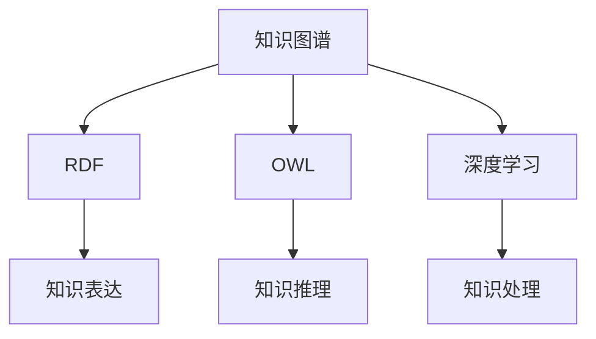

                 

# 知识的结构化：洞察力的重要贡献

> 关键词：知识图谱，结构化存储，洞察力，智能搜索，深度学习

## 1. 背景介绍

在信息爆炸的时代，人类获取、处理和应用知识的方式正在发生深刻变革。传统的文档检索、搜索引擎已经难以满足对复杂知识体系的高效管理和智能理解的需求。为了应对这一挑战，知识图谱(Knowledge Graph)应运而生。作为深度学习的里程碑，知识图谱为知识的结构化存储和智能处理提供了全新的范式。

知识图谱是一种以图模型为核心的知识表示方法，通过节点表示实体和属性，边表示实体间的关系，构建起一个结构化的知识网络。它不仅能够精确地刻画实体之间的复杂关系，还能通过深度学习技术，揭示知识网络中的深层次模式和关联，极大地提升了知识处理和应用的能力。

本文将系统探讨知识图谱的构建和应用，揭示其在提升洞察力、优化决策过程中的重要贡献。

## 2. 核心概念与联系

### 2.1 核心概念概述

为更好地理解知识图谱，本节将介绍几个核心概念：

- 知识图谱(Knowledge Graph)：以图结构存储知识库的方法，通过节点和边表示实体及其关系。包括传统关系型数据库和新兴的语义网结构。

- RDF（Resource Description Framework）：一种用于描述互联网资源的标准，定义了XML文档的格式，通过URI表示资源，通过谓词描述关系，实现知识表达和交换。

- OWL（Web Ontology Language）：一种语义Web的标准，用于描述资源的概念、属性及其之间的关系，支持知识推理和验证。

- 深度学习（Deep Learning）：一种基于多层神经网络的机器学习技术，通过多层次的特征学习，在知识图谱上构建模型，实现对知识的深层次理解和处理。

这些核心概念构成了知识图谱的基础，通过它们的相互联系，构建起知识处理的强大工具。

### 2.2 核心概念原理和架构的 Mermaid 流程图



这个流程图展示了知识图谱核心概念之间的联系：

1. 知识图谱通过RDF实现知识表达。
2. OWL用于描述资源的概念、属性及其关系，支持知识推理。
3. 深度学习构建知识处理模型，揭示知识图谱中的深层次模式。

## 3. 核心算法原理 & 具体操作步骤
### 3.1 算法原理概述

知识图谱的构建和应用主要包括以下几个步骤：

1. 知识抽取：从非结构化数据中提取实体、属性和关系，构建知识图谱。
2. 知识推理：通过逻辑推理和计算，从知识图谱中发现新知识，增强知识的完整性和可靠性。
3. 知识查询：通过智能搜索技术，从知识图谱中检索相关知识，支持知识的应用和推理。

深度学习在知识图谱中的应用，主要集中在以下几个方面：

- 实体关系分类：通过深度神经网络，自动识别和分类实体之间的复杂关系。
- 知识图谱嵌入：将知识图谱中的节点和边映射到高维向量空间，揭示知识网络中的模式和关联。
- 知识图谱预测：利用深度学习模型，预测知识图谱中的未知节点和关系。
- 知识图谱优化：通过深度学习技术，优化知识图谱的结构，提高知识的准确性和完整性。

### 3.2 算法步骤详解

以下详细介绍知识图谱构建和应用的关键步骤：

**Step 1: 数据准备**

- 从各类文本、网页、数据库等非结构化数据中抽取实体、属性和关系。
- 清洗和标准化数据，去除噪声和冗余信息。

**Step 2: 实体和关系分类**

- 使用深度学习模型，如卷积神经网络、循环神经网络、图神经网络等，对抽取的实体和关系进行分类。
- 通过多层卷积和池化操作，提取实体的特征，使用全连接层或RNN对关系进行分类。

**Step 3: 知识图谱嵌入**

- 使用知识图谱嵌入技术，如TransE、KBNet等，将实体和关系映射到高维向量空间。
- 通过神经网络模型，学习节点和边之间的映射关系，揭示知识网络中的模式和关联。

**Step 4: 知识图谱推理**

- 使用基于规则的推理方法，如符号推理、逻辑推理等，从知识图谱中发现新知识。
- 使用神经网络模型，如基于神经逻辑的推理方法，发现知识图谱中的隐性关系。

**Step 5: 知识图谱查询**

- 通过智能搜索技术，如GraphSAGE、GNN等，从知识图谱中检索相关知识。
- 结合用户查询意图和上下文信息，返回最相关、最精准的知识结果。

### 3.3 算法优缺点

知识图谱技术具有以下优点：

- 精确刻画实体关系：通过图结构精确表示实体及其关系，便于知识的组织和理解。
- 深层次模式揭示：通过深度学习技术，发现知识网络中的深层次模式和关联。
- 推理能力强大：支持基于规则和神经网络的推理方法，揭示知识图谱中的隐性关系。
- 知识应用广泛：广泛应用于自然语言处理、信息检索、推荐系统等领域。

同时，知识图谱也存在以下缺点：

- 数据准备复杂：需要大规模高质量数据，数据准备和清洗工作繁琐。
- 构建和维护成本高：知识图谱的构建和维护需要大量技术资源和人力成本。
- 推理准确性问题：基于规则的推理方法容易受到知识图谱不完备的限制。
- 模型复杂度高：深度学习模型的复杂度较高，需要大量计算资源。

尽管存在这些局限，但知识图谱在知识处理和应用中仍然具有重要的应用价值。

### 3.4 算法应用领域

知识图谱技术广泛应用于以下领域：

- 自然语言处理(NLP)：通过知识图谱提高语言模型的上下文理解能力，增强自然语言生成和理解的效果。
- 信息检索：利用知识图谱进行实体链接和知识融合，提升搜索结果的相关性和准确性。
- 推荐系统：结合用户兴趣和知识图谱中的关联关系，生成个性化推荐。
- 智能问答：基于知识图谱进行实体链接和推理，构建智能问答系统。
- 智能推荐：结合知识图谱中的信息，提高推荐系统的智能化水平。

## 4. 数学模型和公式 & 详细讲解 & 举例说明

### 4.1 数学模型构建

知识图谱的构建通常基于三元组的形式，即实体-关系-实体。记知识图谱中的节点为 $v$，边为 $e$，边属性为 $a$。节点和边可以被表示为向量 $\mathbf{v}$ 和 $\mathbf{e}$。

一个简单的知识图谱可以表示为：

$$
\mathcal{G} = \{ \mathbf{v}, \mathbf{e}, \mathbf{a} \}
$$

其中 $\mathbf{v} = \{v_1, v_2, ..., v_n\}$，$\mathbf{e} = \{e_1, e_2, ..., e_m\}$，$\mathbf{a} = \{a_1, a_2, ..., a_k\}$。

节点 $v_i$ 和节点 $v_j$ 之间存在关系 $r$，则边 $e_{ij}$ 为 $(v_i, r, v_j)$，边属性为 $a_{ij}$。

### 4.2 公式推导过程

知识图谱的深度学习嵌入，通常采用神经网络模型进行映射。假设知识图谱中有 $n$ 个节点，$m$ 条边，$k$ 个边属性。使用深度学习模型 $\mathcal{M}$ 对节点和边进行嵌入，得到节点嵌入向量 $\mathbf{v}$ 和边嵌入向量 $\mathbf{e}$。

使用深度学习模型进行节点嵌入的公式为：

$$
\mathbf{v} = \mathcal{M}(\mathbf{x})
$$

其中 $\mathbf{x}$ 为节点的特征向量，可以包括节点的属性、节点之间的距离等。

使用深度学习模型进行边嵌入的公式为：

$$
\mathbf{e} = \mathcal{M}(\mathbf{v}_i, \mathbf{v}_j, r)
$$

其中 $r$ 为节点之间的关系，$\mathbf{v}_i$ 和 $\mathbf{v}_j$ 分别为节点 $v_i$ 和 $v_j$ 的嵌入向量。

### 4.3 案例分析与讲解

以自然语言处理(NLP)为例，分析知识图谱在其中的应用。

- **实体识别**：使用BERT等预训练语言模型，从文本中识别出实体。
- **关系抽取**：通过逻辑推理和深度学习模型，从文本中提取实体之间的关系。
- **知识融合**：将从文本中抽取的知识融合到知识图谱中，构建出更加完整和丰富的知识网络。
- **知识推理**：使用基于神经逻辑的推理方法，从知识图谱中发现新知识。

例如，在一个电影评价知识图谱中，节点可以表示电影、演员、评分等实体，边表示实体之间的关系。通过深度学习模型，可以将实体嵌入高维向量空间，揭示实体之间的复杂关系。

## 5. 项目实践：代码实例和详细解释说明

### 5.1 开发环境搭建

在进行知识图谱开发前，需要准备好开发环境。以下是使用Python进行PyTorch开发的环境配置流程：

1. 安装Anaconda：从官网下载并安装Anaconda，用于创建独立的Python环境。

2. 创建并激活虚拟环境：
```bash
conda create -n pytorch-env python=3.8 
conda activate pytorch-env
```

3. 安装PyTorch：根据CUDA版本，从官网获取对应的安装命令。例如：
```bash
conda install pytorch torchvision torchaudio cudatoolkit=11.1 -c pytorch -c conda-forge
```

4. 安装相关库：
```bash
pip install networkx graphneur adjacency_lists pyg2vae
```

5. 安装TensorFlow：
```bash
pip install tensorflow
```

6. 安装相关的深度学习框架：
```bash
pip install torch pytorch-lightning transformers
```

完成上述步骤后，即可在`pytorch-env`环境中开始知识图谱的开发。

### 5.2 源代码详细实现

下面以知识图谱嵌入为例，给出使用PyTorch进行深度学习知识图谱嵌入的代码实现。

首先，定义知识图谱的数据结构：

```python
import networkx as nx
import torch
from torch_geometric import nn

class GraphDataset:
    def __init__(self, graph):
        self.graph = graph
        self.num_nodes = graph.number_of_nodes()
        self.num_edges = graph.number_of_edges()
        
    def __getitem__(self, index):
        x = self.graph.nodes[index]
        y = self.graph.edges[index]
        return x, y

    def __len__(self):
        return self.num_nodes
```

然后，定义知识图谱嵌入模型：

```python
class GraphEmbeddingModel(nn.Module):
    def __init__(self, num_nodes, dim):
        super(GraphEmbeddingModel, self).__init__()
        self.num_nodes = num_nodes
        self.dim = dim
        
    def forward(self, x, y):
        # 节点嵌入
        embedding = self.node_embedding(x)
        # 边嵌入
        edge_embedding = self.edge_embedding(y)
        
        # 计算损失
        loss = self.loss(embedding, edge_embedding)
        return loss
        
    def node_embedding(self, x):
        # 使用多层感知器进行节点嵌入
        embedding = self.mlp(x)
        return embedding
    
    def edge_embedding(self, y):
        # 使用多层感知器进行边嵌入
        embedding = self.mlp(y)
        return embedding
    
    def loss(self, embedding_x, embedding_y):
        # 计算节点和边之间的距离
        distance = torch.norm(embedding_x - embedding_y, dim=1)
        # 使用平均距离作为损失
        loss = torch.mean(distance)
        return loss
```

最后，定义训练函数和优化器：

```python
from pytorch_lightning import Trainer

model = GraphEmbeddingModel(num_nodes=100, dim=64)
optimizer = torch.optim.Adam(model.parameters(), lr=0.001)

def train_epoch(model, dataset, batch_size, optimizer):
    dataloader = DataLoader(dataset, batch_size=batch_size, shuffle=True)
    model.train()
    epoch_loss = 0
    for batch in dataloader:
        x, y = batch
        model.zero_grad()
        loss = model(x, y)
        epoch_loss += loss.item()
        loss.backward()
        optimizer.step()
    return epoch_loss / len(dataloader)

trainer = Trainer(max_epochs=100, batch_size=32)
trainer.fit(model, train_dataset, val_dataset=val_dataset)
```

以上就是使用PyTorch进行知识图谱嵌入的完整代码实现。可以看到，通过定义数据结构、模型和优化器，以及训练函数，可以很方便地实现知识图谱的深度学习嵌入。

### 5.3 代码解读与分析

让我们再详细解读一下关键代码的实现细节：

**GraphDataset类**：
- `__init__`方法：初始化知识图谱的节点数、边数，创建数据集。
- `__getitem__`方法：对单个样本进行处理，返回节点的特征和边的特征。
- `__len__`方法：返回数据集的样本数量。

**GraphEmbeddingModel类**：
- `__init__`方法：初始化节点数、维度，创建模型。
- `forward`方法：前向传播计算损失函数。
- `node_embedding`方法：对节点进行嵌入计算。
- `edge_embedding`方法：对边进行嵌入计算。
- `loss`方法：计算损失函数。

**训练函数**：
- `train_epoch`方法：对数据集进行批次迭代训练，计算损失函数并更新模型参数。
- `train`方法：使用PyTorch Lightning的 Trainer 进行模型训练。

这些代码展示了知识图谱深度学习嵌入的基本流程，开发者可以根据具体需求进行扩展和优化。

## 6. 实际应用场景

### 6.1 智能推荐系统

知识图谱在智能推荐系统中有着广泛的应用。推荐系统需要处理海量的用户行为数据，从中挖掘出用户兴趣和物品特征之间的关联。通过将用户行为数据和物品信息映射到知识图谱中，可以更加精准地捕捉用户兴趣，生成个性化的推荐结果。

具体而言，可以将用户行为和物品信息构建成知识图谱，使用图神经网络模型进行节点嵌入，挖掘用户兴趣和物品特征之间的关联。结合深度学习技术，可以进一步优化推荐系统的性能，实现更精准、更具个性化的推荐服务。

### 6.2 智能问答系统

智能问答系统需要从知识库中检索相关知识，并根据用户查询意图生成回答。知识图谱为智能问答系统提供了结构化的知识库，便于进行实体链接和推理，生成精准的回答。

在智能问答系统中，可以通过深度学习模型对知识图谱进行嵌入，构建知识图谱的向量表示。结合用户查询意图和上下文信息，使用智能搜索技术，检索知识图谱中的相关知识，生成精准的回答。

### 6.3 金融风险评估

金融领域需要处理大量的非结构化数据，从中挖掘出潜在的风险因素。知识图谱为金融风险评估提供了结构化的知识库，便于进行实体链接和关系挖掘，揭示潜在的风险模式。

在金融风险评估中，可以将金融数据构建成知识图谱，使用深度学习模型对节点和边进行嵌入，挖掘潜在的风险因素。结合规则推理和深度学习模型，可以生成精准的风险评估报告，帮助金融机构及时防范风险。

### 6.4 未来应用展望

未来，知识图谱技术将在更多领域得到广泛应用，为知识处理和应用带来新的突破。

在智慧城市治理中，知识图谱可以用于城市事件监测、舆情分析、应急指挥等环节，提高城市管理的自动化和智能化水平。

在医疗领域，知识图谱可以用于疾病诊疗、药物研发、健康管理等场景，帮助医生和患者更好地理解和管理健康信息。

在教育领域，知识图谱可以用于智能辅导、知识图谱、推荐系统等场景，提高教育资源的利用效率，实现因材施教。

此外，在智慧农业、智能制造、智能交通等领域，知识图谱也具有重要的应用价值，有望推动相关行业的数字化转型升级。

## 7. 工具和资源推荐

### 7.1 学习资源推荐

为了帮助开发者系统掌握知识图谱的理论基础和实践技巧，这里推荐一些优质的学习资源：

1. 《深度学习入门：基于PyTorch的理论与实现》系列博文：由大模型技术专家撰写，深入浅出地介绍了深度学习的基本概念和知识图谱的应用。

2. 《Knowledge Graphs: Concepts, Approaches, Applications》书籍：详细介绍了知识图谱的概念、技术和应用，是知识图谱研究的经典教材。

3. 《Semantic Technologies for the Web》课程：斯坦福大学开设的语义网络课程，介绍了语义Web和知识图谱的基本概念和应用。

4. 《Graph Neural Networks》书籍：全面介绍了图神经网络的知识图谱应用，涵盖模型构建和应用实践。

5. 《Linked Data Primer》书籍：介绍了语义Web和知识图谱的基本概念和应用，适合初学者学习。

通过对这些资源的学习实践，相信你一定能够快速掌握知识图谱的精髓，并用于解决实际的NLP问题。

### 7.2 开发工具推荐

高效的开发离不开优秀的工具支持。以下是几款用于知识图谱开发常用的工具：

1. PyTorch：基于Python的开源深度学习框架，灵活的计算图，适合快速迭代研究。支持图神经网络模型和深度学习模型的构建。

2. TensorFlow：由Google主导开发的开源深度学习框架，生产部署方便，支持大规模工程应用。支持图神经网络模型和深度学习模型的构建。

3. Pyg：基于PyTorch的图神经网络框架，提供丰富的图数据处理和图神经网络模型，适合知识图谱的研究和应用。

4. GraphSAGE：由斯坦福大学开发的图神经网络模型，支持高效的网络数据处理和图神经网络模型的构建。

5. GNN：由微软开发的图神经网络库，提供丰富的图神经网络模型和图数据处理工具，适合知识图谱的研究和应用。

合理利用这些工具，可以显著提升知识图谱的开发效率，加快创新迭代的步伐。

### 7.3 相关论文推荐

知识图谱和深度学习的发展源于学界的持续研究。以下是几篇奠基性的相关论文，推荐阅读：

1. 《A Survey on Knowledge Graph Embeddings and Their Applications》：综述了知识图谱嵌入的基本概念和技术，分析了其在知识推理和知识应用中的作用。

2. 《Reasoning About Real-World Knowledge: Data, Models, and Reasoning》：介绍了知识图谱在自然语言处理和知识推理中的基本概念和技术。

3. 《Learning to Entail》：提出了一种基于深度学习的知识图谱推理方法，通过学习推理规则，实现更加精准的知识推理。

4. 《Knowledge Graph Embeddings》：详细介绍了知识图谱嵌入的基本概念和技术，分析了其在知识推理和知识应用中的作用。

5. 《Knowledge Graphs for Smart Cities》：介绍了知识图谱在智慧城市治理中的应用，分析了其在城市管理中的作用。

这些论文代表了大语言模型微调技术的发展脉络。通过学习这些前沿成果，可以帮助研究者把握学科前进方向，激发更多的创新灵感。

## 8. 总结：未来发展趋势与挑战

### 8.1 研究成果总结

本文对知识图谱的构建和应用进行了全面系统的介绍。首先阐述了知识图谱的背景和意义，明确了其在提升洞察力、优化决策过程中的重要贡献。其次，从原理到实践，详细讲解了知识图谱的数学模型和关键步骤，给出了知识图谱嵌入的代码实现。同时，本文还广泛探讨了知识图谱在推荐系统、智能问答、金融风险评估等诸多领域的应用前景，展示了知识图谱技术的广阔前景。

通过本文的系统梳理，可以看到，知识图谱技术正在成为知识处理和应用的重要范式，极大地拓展了预训练语言模型的应用边界，催生了更多的落地场景。受益于大规模语料的预训练，知识图谱在知识处理和应用中发挥了重要作用，必将推动人工智能技术在更多领域实现规模化落地。

### 8.2 未来发展趋势

展望未来，知识图谱技术将呈现以下几个发展趋势：

1. 规模化和自动化：随着大数据和人工智能技术的进一步发展，知识图谱的构建和应用将更加自动化和规模化，提升知识图谱的构建效率和应用效果。

2. 深度融合多模态数据：知识图谱将与视觉、语音、文本等多样化的数据进行深度融合，提升知识图谱的复杂性和多样性，揭示更为丰富的知识模式。

3. 智能推理和智能生成：基于深度学习模型的知识图谱，将实现更加精准的智能推理和智能生成，提升知识图谱的应用价值。

4. 跨领域知识融合：知识图谱将与各类领域知识进行深度融合，提升知识图谱的跨领域应用能力，推动更多领域的智能化转型。

5. 数据治理和安全保障：随着知识图谱在更多领域的应用，数据治理和安全保障问题将更加重要，知识图谱需要更加严格的规范和保障措施，确保数据安全。

以上趋势凸显了知识图谱技术的广阔前景。这些方向的探索发展，必将进一步提升知识图谱的应用能力和智能水平，为构建人机协同的智能系统铺平道路。

### 8.3 面临的挑战

尽管知识图谱技术已经取得了瞩目成就，但在迈向更加智能化、普适化应用的过程中，它仍面临诸多挑战：

1. 数据质量问题：知识图谱的构建需要高质量的数据，但数据来源多样、格式不一，难以确保数据的一致性和准确性。

2. 知识图谱完备性问题：知识图谱需要覆盖尽可能全面的知识，但难以涵盖所有领域和场景。

3. 知识图谱的泛化能力：知识图谱的泛化能力有限，难以在新的场景和领域中快速推广。

4. 推理能力提升：基于深度学习的知识图谱推理方法，仍需提升推理能力和泛化性能。

5. 计算资源限制：知识图谱的构建和推理需要大量的计算资源，难以满足大规模应用的需求。

6. 知识图谱的鲁棒性和可解释性：知识图谱的鲁棒性和可解释性仍有待提升，难以应对复杂和多变的应用场景。

正视知识图谱面临的这些挑战，积极应对并寻求突破，将知识图谱技术推向更高的成熟度，才能真正实现其在各领域的应用价值。

### 8.4 研究展望

面对知识图谱所面临的种种挑战，未来的研究需要在以下几个方面寻求新的突破：

1. 自动构建知识图谱：开发更加自动化的知识图谱构建方法，减少对人工标注的依赖，提高知识图谱的构建效率和质量。

2. 跨领域知识融合：开发更加通用的知识图谱嵌入方法，实现知识图谱的跨领域应用，推动更多领域的智能化转型。

3. 知识图谱推理优化：结合深度学习和符号推理，提升知识图谱的推理能力和泛化性能，增强知识图谱的应用价值。

4. 知识图谱的鲁棒性和可解释性：开发更加鲁棒和可解释的知识图谱方法，确保知识图谱在复杂和多变的应用场景中的稳定性。

5. 计算资源的优化：开发更加高效的计算方法和工具，提高知识图谱的构建和推理效率，满足大规模应用的需求。

这些研究方向的探索，必将引领知识图谱技术迈向更高的台阶，为构建安全、可靠、可解释、可控的智能系统铺平道路。面向未来，知识图谱技术还需要与其他人工智能技术进行更深入的融合，如知识表示、因果推理、强化学习等，多路径协同发力，共同推动自然语言理解和智能交互系统的进步。只有勇于创新、敢于突破，才能不断拓展知识图谱的边界，让智能技术更好地造福人类社会。

---

作者：禅与计算机程序设计艺术 / Zen and the Art of Computer Programming

