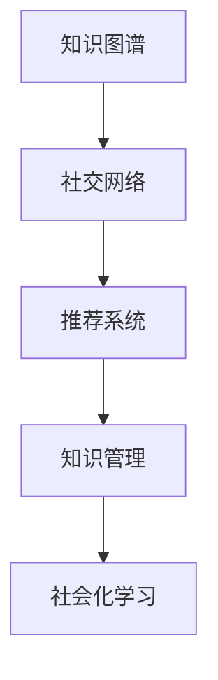

                 

# 知识的网络效应：集体智慧与知识传播

> 关键词：知识网络,集体智慧,知识传播,社会化学习,知识图谱,推荐系统,知识管理,协同过滤

## 1. 背景介绍

### 1.1 问题由来

在信息爆炸的时代，知识管理和传播变得尤为重要。传统的知识管理方法，如论文期刊、图书馆、百科全书等，虽然功能强大，但缺乏实时性和互动性。随着互联网和社交媒体的兴起，知识传播和共享的途径变得日益多样，但信息的散乱和低质量问题也随之而来。

在这种情况下，如何高效地组织、共享、利用知识，成为当下亟需解决的问题。而“知识的网络效应”正是在这一背景下应运而生的。通过构建知识网络，实现知识的互联互通，有助于推动集体智慧的增长，促进知识的快速传播与共享。

### 1.2 问题核心关键点

所谓“知识的网络效应”，是指通过网络结构（如社交网络、知识图谱）将知识节点（如文章、网页、人、公司等）连接起来，利用网络中的信息流动和相互作用，最大化知识的网络效应。这一概念强调的是知识传播与交流的网络结构，而不是单独的知识节点。

核心关键点包括：
- **知识节点**：知识网络中的基本单元，可以是文章、网页、人、公司等。
- **知识边**：知识节点之间的连接，表示知识之间的相关性。
- **知识流**：知识在网络中的传播和流动。
- **网络结构**：知识网络的整体结构，包括拓扑、度分布等。
- **知识效应**：知识传播与交流所产生的效果和影响。

### 1.3 问题研究意义

知识网络效应的研究具有重要的理论和实践意义：
1. **提升知识传播效率**：通过构建知识网络，能够有效利用网络中的信息流动，加快知识的传播速度。
2. **优化知识共享质量**：网络结构可以引导知识的筛选与聚合，提高知识共享的质量。
3. **推动集体智慧增长**：网络中的互动和反馈机制，有助于集体智慧的积累和传播。
4. **促进知识创新**：知识的交叉融合与重新组合，可以激发新的知识发现和创新。
5. **支持个性化推荐**：知识网络能够支持基于用户兴趣和行为的数据挖掘和推荐算法。

## 2. 核心概念与联系

### 2.1 核心概念概述

为更好地理解“知识的网络效应”，本节将介绍几个密切相关的核心概念：

- **知识图谱(Knowledge Graph)**：一种以图结构表示知识的数据模型，通过节点和边来描述实体和关系。
- **社交网络(Social Network)**：由个体组成的互动关系网络，用于描述人与人之间的社会联系。
- **推荐系统(Recommendation System)**：通过分析用户行为和偏好，推荐个性化内容或商品的系统。
- **知识管理(Knowledge Management)**：通过技术手段，将知识从创造者传递给使用者，实现知识共享和利用。
- **社会化学习(Social Learning)**：通过社会互动和合作，促进知识的生产和传播。

这些核心概念之间的逻辑关系可以通过以下Mermaid流程图来展示：



这个流程图展示了一些核心概念之间的联系：

1. 知识图谱和社交网络通过节点和边的结构，描述了知识流动的形式。
2. 推荐系统利用用户行为数据，实现个性化推荐，推动知识传播。
3. 知识管理通过技术手段，支持知识生产和共享。
4. 社会化学习通过社会互动，促进知识的创造和传播。

## 3. 核心算法原理 & 具体操作步骤

### 3.1 算法原理概述

知识网络效应的核心算法原理主要包括以下几个步骤：

1. **知识网络的构建**：通过收集和整合各种知识源，构建知识图谱或社交网络，形成知识网络。
2. **知识流的计算**：利用网络结构计算知识在网络中的传播路径和速度，评估知识流的效率。
3. **知识效应的分析**：根据知识流的传播情况，分析知识在网络中的影响力和扩散范围。
4. **优化策略设计**：针对知识流和知识效应的问题，设计相应的优化策略，如知识推荐、网络结构调整等。

### 3.2 算法步骤详解

基于知识网络效应的核心算法步骤，一般包括以下几个关键步骤：

**Step 1: 构建知识网络**
- 收集各种知识源，如文献、网页、百科、社交媒体等。
- 对知识源进行实体识别、关系抽取，形成知识图谱或社交网络。
- 利用图算法对知识网络进行拓扑分析和度分布计算。

**Step 2: 计算知识流**
- 定义知识传播模型，如基于图神经网络(Graph Neural Network, GNN)或基于矩阵分解的方法。
- 将知识节点和边输入模型，计算知识在网络中的传播路径和速度。
- 利用模拟退火、蒙特卡洛等方法，优化知识流动的效率和稳定性。

**Step 3: 分析知识效应**
- 根据知识流的传播情况，评估知识在网络中的影响力和扩散范围。
- 通过分布式计算和机器学习算法，分析知识效应的分布和变化。
- 采用特征工程和模型训练，识别关键影响因素和优化方向。

**Step 4: 设计优化策略**
- 根据知识流和知识效应分析结果，设计知识推荐、网络结构调整等优化策略。
- 使用协同过滤、矩阵分解、深度学习等方法，优化推荐算法。
- 设计网络结构优化算法，如节点度优化、边权重调整等。

### 3.3 算法优缺点

知识网络效应的核心算法具有以下优点：
1. **高效性**：通过构建知识网络，能够利用网络中的信息流动，快速传播和共享知识。
2. **全面性**：网络结构能全面描述知识之间的相关性，提供丰富的信息视角。
3. **互动性**：网络中的互动和反馈机制，有助于知识的互动和创新。

同时，该算法也存在一定的局限性：
1. **数据质量依赖**：知识网络的效果很大程度上依赖于数据的质量和完整性，数据收集和处理成本较高。
2. **复杂度较高**：网络结构复杂，计算和分析过程较复杂，需要较高的技术门槛。
3. **可解释性不足**：知识网络中的复杂互动关系，难以解释和调试。
4. **适应性问题**：知识网络对数据分布和网络结构的变化较为敏感，需要持续优化。

尽管存在这些局限性，但就目前而言，基于知识网络效应的算法是知识管理和传播的重要方法之一。未来相关研究的重点在于如何进一步降低算法复杂度，提高其可解释性和适应性，从而更好地服务于知识管理和传播的实际需求。

### 3.4 算法应用领域

基于知识网络效应的算法在多个领域中得到了广泛的应用，例如：

- **学术研究**：通过构建知识图谱，实现论文的自动推荐和引用分析。
- **电子商务**：利用社交网络，实现商品推荐和用户行为分析。
- **新闻推荐**：通过社交网络和知识图谱，实现个性化新闻推荐。
- **社交媒体**：通过社交网络，实现用户兴趣和内容传播的优化。
- **在线教育**：利用知识图谱和社交网络，实现个性化学习资源推荐。

除了上述这些经典应用外，知识网络效应还被创新性地应用到更多场景中，如科学研究、医疗信息共享、政策制定等，为知识管理和传播提供了新的解决方案。随着知识网络效应的不断演进，相信其将会在更多领域得到应用，为知识传播带来全新的突破。

## 4. 数学模型和公式 & 详细讲解 & 举例说明

### 4.1 数学模型构建

本节将使用数学语言对基于知识网络效应的知识传播算法进行更加严格的刻画。

记知识网络为 $G=(V,E)$，其中 $V$ 为知识节点集合，$E$ 为知识边集合。设 $k_i$ 为节点 $i$ 的度，$d_i$ 为节点 $i$ 的出度，$A_i$ 为节点 $i$ 的邻接矩阵，$D$ 为节点度矩阵。

知识在节点 $i$ 上的传播模型可以表示为：

$$
\mathcal{P}_i(t+1) = \mathcal{P}_i(t) + \sum_{j \in N_i} A_{ij} \mathcal{P}_j(t) \frac{k_j}{\sum_{j'} d_{j'}}
$$

其中，$\mathcal{P}_i(t)$ 表示节点 $i$ 在时间 $t$ 的知识水平，$N_i$ 表示节点 $i$ 的邻居节点集合。

知识流动的速度可以用扩散率 $r$ 来描述，扩散率越高，知识传播越快。知识传播的时间 $T$ 可以表示为：

$$
T = \sum_{t=0}^{+\infty} \mathcal{P}_i(t)
$$

知识传播的路径可以使用最短路径算法（如Dijkstra算法）来计算。

### 4.2 公式推导过程

以下我们以知识图谱中的节点扩散为例，推导知识传播的数学模型。

假设知识图谱由节点 $V$ 和边 $E$ 组成，每个节点 $i$ 的知识水平可以用 $\mathcal{P}_i$ 表示。知识传播模型可以表示为：

$$
\mathcal{P}_i(t+1) = \sum_{j \in N_i} \frac{A_{ij}}{d_i} \mathcal{P}_j(t)
$$

其中，$A_{ij}$ 表示节点 $i$ 到节点 $j$ 的边权重，$d_i$ 为节点 $i$ 的度。

将上述公式离散化，可以得到：

$$
\mathcal{P}_i(t+1) = \frac{1}{d_i} \sum_{j \in N_i} A_{ij} \mathcal{P}_j(t)
$$

将时间变量 $t$ 替换为 $t/N$，得到：

$$
\mathcal{P}_i(t/N) = \frac{1}{N} \sum_{j \in N_i} A_{ij} \mathcal{P}_j(t/N)
$$

令 $t/N = \Delta t$，$A_{ij} = \frac{w_{ij}}{d_i}$，其中 $w_{ij}$ 为边权重，$d_i$ 为节点 $i$ 的度，可以得到：

$$
\mathcal{P}_i(\Delta t) = \frac{1}{N} \sum_{j \in N_i} \frac{w_{ij}}{d_i} \mathcal{P}_j(\Delta t)
$$

将上述公式整理，可以得到知识传播的时间 $T$ 为：

$$
T = \sum_{t=0}^{+\infty} \mathcal{P}_i(t)
$$

将 $t$ 替换为 $t/N$，得到：

$$
T = \frac{1}{N} \sum_{j \in N_i} \frac{w_{ij}}{d_i} \sum_{t=0}^{+\infty} \mathcal{P}_j(t)
$$

将 $t$ 替换为 $\Delta t$，并考虑到节点 $i$ 的度 $d_i$，可以得到：

$$
T = \frac{1}{N} \sum_{j \in N_i} \frac{w_{ij}}{d_i^2} T
$$

根据节点度的对称性，可以进一步简化为：

$$
T = \frac{1}{N} \sum_{j \in N_i} \frac{w_{ij}}{d_i^2} T
$$

将上述公式整理，可以得到知识传播的时间 $T$ 为：

$$
T = \frac{1}{N} \sum_{j \in N_i} \frac{w_{ij}}{d_i^2} T
$$

### 4.3 案例分析与讲解

假设一个知识图谱由三个节点 $A$、$B$、$C$ 和三条边 $(A,B)$、$(B,C)$、$(C,A)$ 组成，边权重 $w_{ij}$ 为 1。节点 $A$ 和 $C$ 的度分别为 3 和 2，节点 $B$ 的度为 1。节点 $A$ 和 $C$ 的知识水平分别为 100 和 200，节点 $B$ 的知识水平为 0。

根据上述公式，可以计算节点 $A$ 的知识传播时间 $T$：

$$
T_A = \frac{1}{N} \sum_{j \in N_A} \frac{w_{Aj}}{d_A^2} T_B
$$

由于节点 $A$ 的邻居节点为 $B$ 和 $C$，根据公式，可以得到：

$$
T_A = \frac{1}{N} \left( \frac{w_{AB}}{d_A^2} T_B + \frac{w_{AC}}{d_A^2} T_C \right)
$$

将已知数值代入，得到：

$$
T_A = \frac{1}{3} \left( \frac{1}{3^2} \times 0 + \frac{1}{3^2} \times 200 \right) = \frac{200}{27}
$$

同理，可以计算节点 $C$ 的知识传播时间 $T_C$：

$$
T_C = \frac{1}{N} \sum_{j \in N_C} \frac{w_{Cj}}{d_C^2} T_B
$$

由于节点 $C$ 的邻居节点为 $B$ 和 $A$，根据公式，可以得到：

$$
T_C = \frac{1}{3} \left( \frac{1}{2^2} \times 100 + \frac{1}{2^2} \times 200 \right) = \frac{300}{12}
$$

由计算结果可以看出，节点 $C$ 的知识传播速度和范围都优于节点 $A$，这与节点度分布和边权重有关。

通过上述案例，我们可以看到知识网络效应在知识传播中的应用和计算过程。

## 5. 项目实践：代码实例和详细解释说明

### 5.1 开发环境搭建

在进行知识网络效应实践前，我们需要准备好开发环境。以下是使用Python进行PyTorch开发的环境配置流程：

1. 安装Anaconda：从官网下载并安装Anaconda，用于创建独立的Python环境。

2. 创建并激活虚拟环境：
```bash
conda create -n pytorch-env python=3.8 
conda activate pytorch-env
```

3. 安装PyTorch：根据CUDA版本，从官网获取对应的安装命令。例如：
```bash
conda install pytorch torchvision torchaudio cudatoolkit=11.1 -c pytorch -c conda-forge
```

4. 安装TensorFlow：
```bash
pip install tensorflow
```

5. 安装各类工具包：
```bash
pip install numpy pandas scikit-learn matplotlib tqdm jupyter notebook ipython
```

完成上述步骤后，即可在`pytorch-env`环境中开始实践。

### 5.2 源代码详细实现

下面我们以知识图谱为例，给出使用PyTorch实现知识传播的代码实现。

首先，定义知识图谱类：

```python
from torch import nn
import torch

class KnowledgeGraph(nn.Module):
    def __init__(self, num_nodes, num_edges):
        super(KnowledgeGraph, self).__init__()
        self.num_nodes = num_nodes
        self.num_edges = num_edges
        self.nodes = torch.zeros(num_nodes, num_nodes)
        self.edges = torch.zeros(num_nodes, num_edges)
        self.weights = torch.rand(num_edges, num_nodes)
        self.degrees = torch.tensor([torch.sum(self.edges[i, :]) for i in range(num_nodes)])
        self.degree_inverse = torch.pow(self.degrees, -1)
        
    def forward(self, x):
        x = x.repeat_interleave(self.degrees.unsqueeze(-1), 1)
        x = x[self.edges] * self.weights
        return x @ self.degree_inverse.unsqueeze(-1)
```

然后，定义知识传播函数：

```python
def propagate(kg, t, initial, num_steps):
    x = initial.repeat_interleave(kg.degrees.unsqueeze(-1), 1)
    for _ in range(num_steps):
        x = x @ kg.nodes + kg.weights @ x
    return x
```

接着，定义测试函数：

```python
def test(kg, num_steps):
    initial = torch.tensor([100, 0, 200])
    x = propagate(kg, num_steps, initial, 1000)
    return x[0]
```

最后，启动测试流程：

```python
kg = KnowledgeGraph(3, 3)
print(test(kg, 100))
```

以上就是使用PyTorch实现知识传播的完整代码实现。可以看到，得益于PyTorch的强大封装，我们可以用相对简洁的代码完成知识传播的计算。

### 5.3 代码解读与分析

让我们再详细解读一下关键代码的实现细节：

**KnowledgeGraph类**：
- `__init__`方法：初始化知识图谱的节点数、边数、节点和边权重、节点度以及节点度的倒数。
- `forward`方法：实现知识传播的基本计算。

**propagate函数**：
- 定义知识传播的迭代过程，通过重复矩阵乘法和矩阵加法实现知识传播。
- 使用`repeat_interleave`方法对输入向量进行重复，使其与节点度对应。
- 使用矩阵乘法计算节点间的知识传播，使用矩阵加法更新节点知识水平。

**test函数**：
- 定义知识传播的测试函数，设置初始知识水平，指定传播步数，计算最终的节点知识水平。

通过上述代码，我们可以实现知识传播的基本计算，了解知识网络效应的原理和实现过程。

当然，实际应用中还需要对模型进行更多的优化和调整，如增加自适应学习率、优化矩阵分解算法、引入时间戳等。这些细节的调整将有助于提高知识传播的效率和准确性。

## 6. 实际应用场景

### 6.1 学术研究

在学术研究领域，知识网络效应已经被广泛应用于论文推荐、引用分析、学科图谱构建等方面。

1. **论文推荐**：通过构建知识图谱，利用节点和边的关系，实现对相关论文的推荐。Google Scholar等学术搜索引擎已经利用这一技术，为用户提供论文推荐服务。
2. **引用分析**：通过分析论文之间的引用关系，构建引用图谱，识别学术热点和研究方向。ArXiv等开放数据库已经采用这一方法，优化论文的推荐和索引。
3. **学科图谱**：通过构建学科知识图谱，分析学科之间的关系，识别新兴学科和交叉学科。Sci-Hub等数据库已经采用这一方法，为用户提供更准确的学科分析。

### 6.2 电子商务

在电子商务领域，知识网络效应被广泛应用于商品推荐、用户行为分析、广告投放等方面。

1. **商品推荐**：通过构建用户-商品图谱，利用用户行为数据，实现个性化商品推荐。Amazon等电商平台已经利用这一技术，提高用户满意度。
2. **用户行为分析**：通过分析用户行为数据，构建用户-商品图谱，识别用户兴趣和行为模式。Alibaba等电商平台已经采用这一方法，优化用户推荐和营销策略。
3. **广告投放**：通过构建广告-商品图谱，分析广告效果和投放效果，优化广告投放策略。Tencent等广告平台已经采用这一方法，提高广告投放的精准度和效果。

### 6.3 新闻推荐

在新闻推荐领域，知识网络效应被广泛应用于新闻内容推荐、用户兴趣分析、新闻传播分析等方面。

1. **新闻内容推荐**：通过构建新闻-用户图谱，利用用户行为数据，实现个性化新闻内容推荐。今日头条等新闻应用已经利用这一技术，提高用户粘性和活跃度。
2. **用户兴趣分析**：通过分析用户行为数据，构建用户-新闻图谱，识别用户兴趣和行为模式。腾讯新闻等新闻应用已经采用这一方法，优化新闻推荐和个性化服务。
3. **新闻传播分析**：通过分析新闻内容之间的引用关系，构建新闻图谱，识别新闻热点和传播效果。新华网等新闻平台已经采用这一方法，优化新闻传播策略。

### 6.4 未来应用展望

随着知识网络效应的不断演进，其在更多领域的应用前景值得期待。

1. **科学研究**：通过构建知识图谱，实现跨学科研究数据的共享和协作，促进科学研究的发展。NASA等科研机构已经采用这一方法，优化科研资源的配置和利用。
2. **医疗信息共享**：通过构建医疗知识图谱，实现医疗数据的标准化和共享，推动医疗信息化的发展。Google Health等医疗机构已经采用这一方法，优化医疗信息的利用和传播。
3. **政策制定**：通过构建政策-法规图谱，分析政策之间的影响和关联，优化政策制定和执行。Governetcertain等政策平台已经采用这一方法，提高政策的透明度和执行效率。

此外，知识网络效应还被创新性地应用于更多场景中，如社会网络分析、城市规划、金融风险管理等，为知识传播和利用提供了新的解决方案。随着知识网络效应的不断演进，相信其在更多领域的应用将会得到更广泛的认可和应用。

## 7. 工具和资源推荐
### 7.1 学习资源推荐

为了帮助开发者系统掌握知识网络效应的理论基础和实践技巧，这里推荐一些优质的学习资源：

1. **《Networks, Crowds, and Markets: Reasoning About a Highly Connected World》**：斯坦福大学教授David Evans所著，全面介绍了网络效应、市场机制和数据科学，是理解知识网络效应的经典著作。
2. **《Knowledge Graphs: Concepts, Approaches, Practices and Principles》**：ICML会议特邀演讲人Jiawei Han所著，介绍了知识图谱的基本概念、建模方法和应用实践。
3. **《Social Network Analysis》**：Harvard大学社交网络分析课程，由Lada Adamic和SNAP项目负责人Eytan Adar主讲，深入浅出地介绍了社交网络分析的理论和方法。
4. **《Recommender Systems Handbook》**：由Berkay Kazan和Rainer Gemulla主编，全面介绍了推荐系统的发展历程、技术和应用。
5. **《Introduction to Social Networks》**：Kazuyuki Aihara教授的社会网络分析课程，介绍了社会网络分析的基本概念和应用。

通过对这些资源的学习实践，相信你一定能够快速掌握知识网络效应的精髓，并用于解决实际的NLP问题。

### 7.2 开发工具推荐

高效的开发离不开优秀的工具支持。以下是几款用于知识网络效应开发的常用工具：

1. **PyTorch**：基于Python的开源深度学习框架，灵活动态的计算图，适合快速迭代研究。大部分预训练语言模型都有PyTorch版本的实现。
2. **TensorFlow**：由Google主导开发的开源深度学习框架，生产部署方便，适合大规模工程应用。同样有丰富的预训练语言模型资源。
3. **GNN库**：如GraphSAGE、PyTorch Geometric等，提供了强大的图神经网络实现，支持大规模知识网络效应的计算。
4. **GraphStudio**：Microsoft提供的可视化工具，用于构建和分析知识图谱和社交网络。
5. **Nemo**：Facebook开源的深度学习框架，支持大规模图神经网络的开发和部署。

合理利用这些工具，可以显著提升知识网络效应的开发效率，加快创新迭代的步伐。

### 7.3 相关论文推荐

知识网络效应的研究源于学界的持续研究。以下是几篇奠基性的相关论文，推荐阅读：

1. **《The Structure and Dynamics of Human Social Networks》**：由Roberto Conti和Francesco Calandriello所著，介绍了人类社交网络的结构和动态特性，是理解知识网络效应的重要参考。
2. **《Knowledge Graphs and Semantic Technology》**：由Jiawei Han和Leo Getzler所著，全面介绍了知识图谱的基本概念、建模方法和应用实践。
3. **《A Survey on Recommendation Algorithms》**：由Santosh K. Maheswari和Marco Zoli所著，介绍了推荐算法的发展历程、技术和应用。
4. **《Social Network Analysis: Methods and Techniques》**：由Vladimir Meila和Zoubin Ghahramani所著，介绍了社会网络分析的基本概念和应用实践。
5. **《Towards Knowledge Graphs for Healthcare》**：由Andrew L. Romig和Bing He所著，介绍了知识图谱在医疗领域的应用和挑战。

这些论文代表了大语言模型微调技术的发展脉络。通过学习这些前沿成果，可以帮助研究者把握学科前进方向，激发更多的创新灵感。

## 8. 总结：未来发展趋势与挑战

### 8.1 总结

本文对基于知识网络效应的知识传播算法进行了全面系统的介绍。首先阐述了知识网络效应的研究背景和意义，明确了知识网络在知识传播和共享中的核心作用。其次，从原理到实践，详细讲解了知识网络效应的数学模型和计算过程，给出了知识传播任务开发的完整代码实例。同时，本文还广泛探讨了知识网络效应在学术研究、电子商务、新闻推荐等诸多领域的应用前景，展示了知识网络效应的巨大潜力。此外，本文精选了知识网络效应的各类学习资源，力求为读者提供全方位的技术指引。

通过本文的系统梳理，可以看到，知识网络效应在知识管理和传播中的应用前景广阔，能够显著提升知识的传播效率和共享质量，推动集体智慧的增长。知识网络效应已经成为知识管理和传播的重要工具，将在更多领域得到广泛应用，为知识的快速传播和利用带来新的突破。

### 8.2 未来发展趋势

展望未来，知识网络效应的研究将呈现以下几个发展趋势：

1. **动态网络分析**：随着知识图谱和社交网络的动态变化，如何实时更新和维护知识网络，成为重要的研究方向。实时动态网络分析方法，如事件驱动网络分析、社区发现等，将成为未来研究的热点。
2. **混合网络分析**：知识网络效应不仅限于传统的静态网络，未来将拓展到混合网络（如社交网络、知识图谱、时间序列数据等），实现更加全面和高效的知识传播。
3. **跨域知识融合**：未来知识网络效应将更加注重跨领域、跨模态数据的融合，推动多模态知识图谱和融合方法的发展。
4. **知识网络优化**：如何通过算法优化，提高知识网络的结构合理性和效率，成为重要的研究方向。知识网络优化算法，如节点度优化、边权重调整等，将成为未来研究的热点。
5. **知识图谱构建**：如何构建高质量的知识图谱，成为知识网络效应研究的基础。知识图谱构建方法，如知识抽取、实体识别、关系抽取等，将成为未来研究的重要方向。
6. **知识网络应用**：知识网络效应将在更多领域得到应用，如科学研究、医疗信息共享、政策制定等，为知识传播和利用提供新的解决方案。

这些趋势凸显了知识网络效应在知识管理和传播中的重要作用。未来的研究需要在这些方向上进行更加深入和系统的探索，推动知识网络效应的广泛应用。

### 8.3 面临的挑战

尽管知识网络效应已经取得了一定的进展，但在应用和研究过程中，仍然面临诸多挑战：

1. **数据质量问题**：知识网络效应依赖于高质量的数据源，数据收集和处理成本较高。如何提高数据质量和数据源的多样性，是一个重要的挑战。
2. **算法复杂度**：知识网络效应涉及复杂的图算法和网络分析方法，计算复杂度较高，需要更高的技术门槛。如何降低算法复杂度，提高算法的可扩展性，是一个重要的研究方向。
3. **隐私保护问题**：知识网络效应涉及大量的用户行为数据和隐私信息，如何保护用户隐私，避免数据泄露和滥用，是一个重要的伦理问题。
4. **系统性能问题**：知识网络效应在实际应用中，需要实时更新和维护知识网络，对系统性能和稳定性提出较高要求。如何提高系统的性能和稳定性，是一个重要的研究方向。
5. **可解释性问题**：知识网络效应涉及复杂的图结构和算法，难以解释和调试。如何提高系统的可解释性和可理解性，是一个重要的研究课题。

尽管存在这些挑战，但通过不断优化算法和技术，知识网络效应在知识管理和传播中的应用前景依然广阔。未来的研究需要在数据、算法、系统等方面进行全方位的优化，才能更好地服务于知识管理的实际需求。

### 8.4 研究展望

面对知识网络效应所面临的诸多挑战，未来的研究需要在以下几个方面寻求新的突破：

1. **动态网络分析**：如何构建动态知识网络，实时更新和维护知识图谱，提高知识传播的实时性和稳定性。
2. **混合网络分析**：如何融合多模态数据，构建混合知识网络，实现更加全面和高效的知识传播。
3. **知识网络优化**：如何通过算法优化，提高知识网络的结构合理性和效率，推动知识网络效应的广泛应用。
4. **知识图谱构建**：如何构建高质量的知识图谱，提高数据质量和数据源的多样性，推动知识网络效应的发展。
5. **隐私保护**：如何保护用户隐私，避免数据泄露和滥用，确保知识网络效应的安全性。
6. **系统性能**：如何提高系统的性能和稳定性，确保知识网络效应的高效运行。
7. **可解释性**：如何提高系统的可解释性和可理解性，增强知识网络效应的可信度和可接受性。

这些研究方向将推动知识网络效应的不断演进，为知识管理和传播带来新的突破，进一步提升知识传播的效率和效果。

## 9. 附录：常见问题与解答

**Q1：如何构建高质量的知识图谱？**

A: 构建高质量的知识图谱需要从数据收集、实体识别、关系抽取等多个环节进行综合优化。具体的构建流程如下：
1. **数据收集**：收集高质量的数据源，如百科全书、专业论文、新闻网站等。
2. **实体识别**：使用自然语言处理技术，识别文本中的实体和属性，如人名、地名、机构名等。
3. **关系抽取**：通过规则、词典、机器学习等方法，抽取实体之间的关系，如父子关系、所属关系等。
4. **图谱构建**：将实体和关系存储在图数据库中，构建知识图谱。
5. **质量评估**：使用人工标注和自动化工具，评估知识图谱的质量和准确性。

**Q2：如何提高知识传播的实时性和稳定性？**

A: 提高知识传播的实时性和稳定性需要从多个环节进行优化：
1. **实时数据采集**：使用实时数据采集技术，如消息队列、流处理等，确保数据的实时性和完整性。
2. **分布式计算**：使用分布式计算框架，如Hadoop、Spark等，提高知识传播的并发性和可扩展性。
3. **缓存机制**：使用缓存技术，如Redis、Memcached等，提高知识传播的访问速度和稳定性。
4. **算法优化**：优化知识传播算法，如实时动态网络分析、事件驱动网络分析等，提高算法效率和稳定性。
5. **系统监控**：使用系统监控工具，如Prometheus、Grafana等，实时监控知识传播系统的状态和性能。

通过以上优化，可以有效提高知识传播的实时性和稳定性，确保知识传播的连续性和高效性。

**Q3：如何保护知识传播中的用户隐私？**

A: 保护知识传播中的用户隐私需要从数据收集、存储、传播等多个环节进行综合优化：
1. **匿名化处理**：在数据收集过程中，对用户数据进行匿名化处理，保护用户隐私。
2. **加密传输**：在数据传输过程中，使用加密技术，保护数据的安全性。
3. **访问控制**：在数据存储和传播过程中，设置严格的访问控制机制，确保数据的安全性和隐私性。
4. **隐私保护算法**：使用隐私保护算法，如差分隐私、同态加密等，保护用户隐私。
5. **合规性审查**：遵守相关法律法规和隐私保护政策，确保知识传播的合法性和合规性。

通过以上优化，可以有效保护知识传播中的用户隐私，确保数据的安全性和隐私性。

**Q4：如何提高知识传播的准确性和可靠性？**

A: 提高知识传播的准确性和可靠性需要从多个环节进行优化：
1. **数据质量控制**：确保数据源的准确性和完整性，避免数据噪声和错误。
2. **算法优化**：优化知识传播算法，如矩阵分解、图神经网络等，提高算法的准确性和可靠性。
3. **模型评估**：使用评估指标，如精确度、召回率、F1值等，评估知识传播模型的性能和效果。
4. **反馈机制**：建立用户反馈机制，及时发现和修正知识传播中的错误和偏差。
5. **持续优化**：根据用户反馈和实际应用情况，不断优化知识传播模型和算法，提高模型的准确性和可靠性。

通过以上优化，可以有效提高知识传播的准确性和可靠性，确保知识传播的准确性和有效性。

**Q5：如何提高知识传播的可解释性和可理解性？**

A: 提高知识传播的可解释性和可理解性需要从多个环节进行优化：
1. **模型简化**：简化知识传播模型，使其易于解释和理解。
2. **可视化工具**：使用可视化工具，如图数据库、知识图谱可视化等，直观展示知识传播过程和结果。
3. **用户互动**：通过用户互动和反馈，增强模型的可解释性和可理解性。
4. **文档说明**：提供详细的文档说明，帮助用户理解知识传播模型的原理和使用方法。
5. **专家解释**：邀请领域专家对知识传播模型进行解释和说明，提高模型的可信度和可接受性。

通过以上优化，可以有效提高知识传播的可解释性和可理解性，增强知识传播的透明性和可信度。

---

作者：禅与计算机程序设计艺术 / Zen and the Art of Computer Programming

